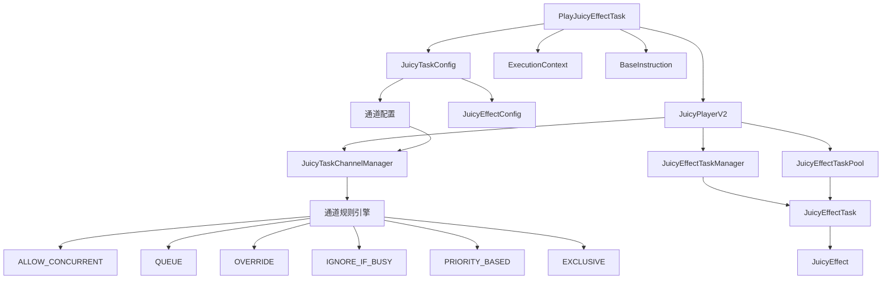
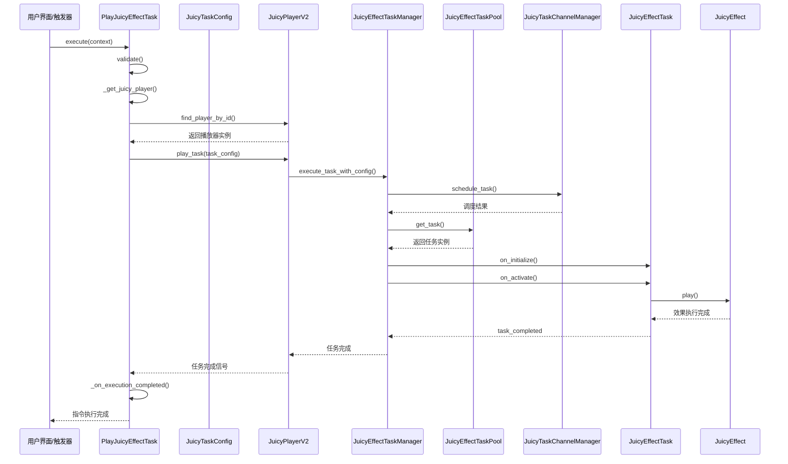
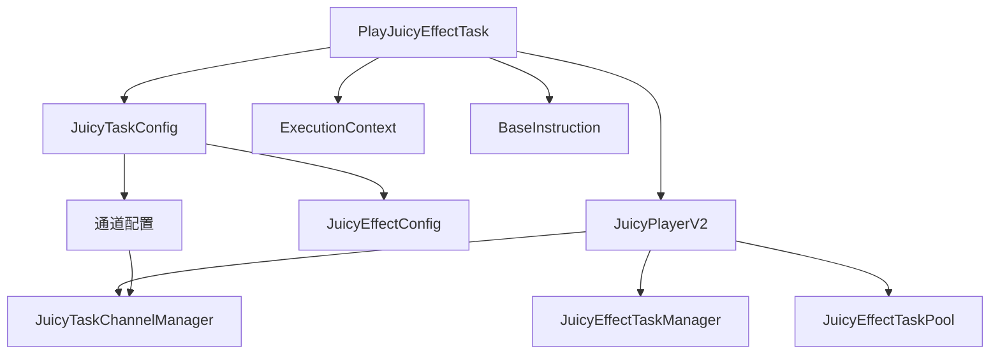
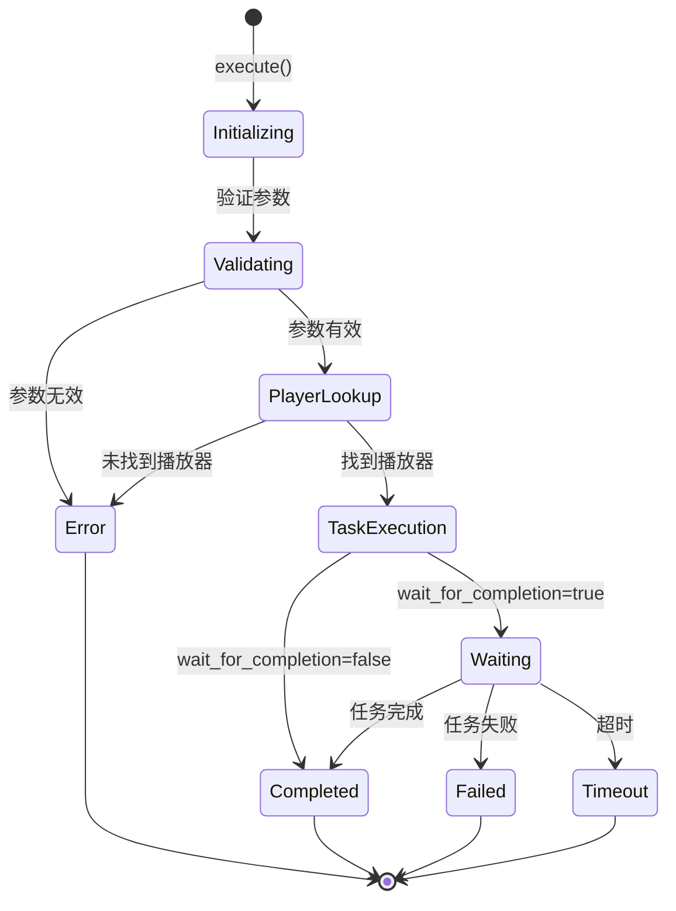
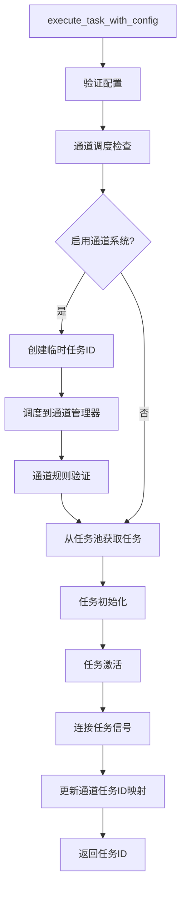
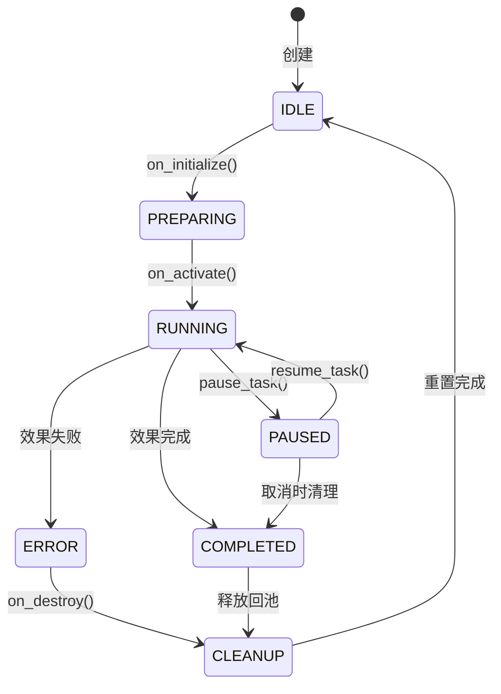

# PlayJuicyEffectTask 完整逻辑执行链分析文档

## 概述

`PlayJuicyEffectTask` 是 Fuse 框架中的一个指令类，用于播放 Juicy 效果任务。它继承自 [`BaseInstruction`](addons/fuse/core/base/base_instruction.gd:4) 基类，与 [`JuicyTaskConfig`](addons/juicy/configs/base/juicy_task_config.gd:15) 和 [`JuicyPlayerV2`](addons/juicy/juicy_player_v2.gd:3) 紧密集成，提供了一套完整的异步效果播放解决方案。

## 系统架构总览

### 核心组件层次结构



### 数据流和控制流



## 核心架构

### 类继承关系

```
BaseInstruction
└── PlayJuicyEffectTask
```

### 主要组件交互



## 1. 核心功能分析

### 1.1 主要职责

- **任务配置管理**: 通过 [`JuicyTaskConfig`](addons/fuse/instructions/play_juicy_effect_task.gd:44) 资源管理效果配置
- **播放器查找**: 支持通过 [`player_id`](addons/fuse/instructions/play_juicy_effect_task.gd:50) 查找或自动发现 [`JuicyPlayerV2`](addons/fuse/instructions/play_juicy_effect_task.gd:77) 实例
- **异步执行**: 支持同步和异步两种执行模式
- **状态跟踪**: 完整的任务状态管理，包括初始化、播放、等待、完成、失败和超时状态
- **错误处理**: 集成 [`FuseError`](addons/fuse/core/logging/fuse_error.gd:2) 系统进行统一错误处理
- **超时控制**: 可配置的任务超时机制

### 1.2 关键属性

```gdscript
# 核心配置
@export var task_config: JuicyTaskConfig = null
@export var player_id: String = "main_player"
@export var wait_for_completion: bool = true
@export var timeout_seconds: float = 0.0
@export var stop_on_failure: bool = false

# 内部状态
var _juicy_task_state: JuicyTaskState = JuicyTaskState.INITIALIZING
var _task_id: String = ""
var _player_instance: JuicyPlayerV2 = null
var _juicy_timeout_timer: SceneTreeTimer = null
var _execution_context: ExecutionContext = null
```

## 2. JuicyTaskConfig 和 JuicyPlayerV2 交互机制

### 2.1 JuicyTaskConfig 配置系统

[`JuicyTaskConfig`](addons/juicy/configs/base/juicy_task_config.gd:15) 是一个资源类，包含：

- **效果配置**: [`effect_config: JuicyEffectConfig`](addons/juicy/configs/base/juicy_task_config.gd:24)
- **通道配置**: 通道名称、规则、优先级等
- **任务生命周期**: 自动清理、重试次数、超时设置
- **调试选项**: 调试模式、日志记录、性能跟踪
- **执行上下文**: 所有者节点、播放器实例等

### 2.2 JuicyPlayerV2 播放器系统

[`JuicyPlayerV2`](addons/juicy/juicy_player_v2.gd:3) 提供：

- **任务管理**: 通过 [`JuicyEffectTaskManager`](addons/juicy/juicy_player_v2.gd:123) 管理任务执行
- **对象池**: 通过 [`JuicyEffectTaskPool`](addons/juicy/juicy_player_v2.gd:124) 复用对象
- **通道管理**: 通过 [`JuicyTaskChannelManager`](addons/juicy/juicy_player_v2.gd:135) 实现智能任务调度
- **全局注册**: 支持通过 [`player_id`](addons/juicy/juicy_player_v2.gd:43) 注册和查找播放器实例
- **信号系统**: 提供任务开始、完成、失败、取消等信号

### 2.3 交互流程

1. **配置验证**: PlayJuicyEffectTask 验证 JuicyTaskConfig 的有效性
2. **播放器查找**: 通过 [`_get_juicy_player()`](addons/fuse/instructions/play_juicy_effect_task.gd:188) 方法查找播放器
3. **任务执行**: 调用播放器的 [`play_task()`](addons/juicy/juicy_player_v2.gd:1894) 方法
4. **通道调度**: 如果启用通道系统，任务会被调度到 [`JuicyTaskChannelManager`](addons/juicy/core/juicy_task_channel_manager.gd:6)
5. **信号连接**: 连接播放器的任务信号以监听状态变化
6. **状态同步**: 根据信号更新内部状态

## 3. 完整执行流程和状态转换

### 3.0 通道管理系统

#### 3.0.1 JuicyTaskChannelManager 核心功能

[`JuicyTaskChannelManager`](addons/juicy/core/juicy_task_channel_manager.gd:6) 是任务调度和优先级管理的核心组件，负责：

- **任务调度**: 根据不同通道规则智能调度任务执行
- **优先级管理**: 处理基于优先级的任务打断和排队
- **通道规则执行**: 实现6种不同的通道规则
- **资源管理**: 自动清理空闲通道和过期任务

#### 3.0.2 六种通道规则

1. **ALLOW_CONCURRENT**: 允许多个任务同时执行，受最大并发数限制
2. **QUEUE**: 新任务加入队列等待，按优先级排序执行
3. **OVERRIDE**: 新任务立即执行，取消所有现有任务
4. **IGNORE_IF_BUSY**: 通道忙碌时忽略新任务
5. **PRIORITY_BASED**: 高优先级任务可以打断低优先级任务
6. **EXCLUSIVE**: 独占执行，暂停其他所有通道

#### 3.0.3 通道配置传递链

```
PlayJuicyEffectTask.task_config
  → JuicyTaskConfig.channel_enabled
  → JuicyTaskConfig.channel_name
  → JuicyTaskConfig.channel_rule
  → JuicyPlayerV2.play_task()
  → JuicyTaskChannelManager.schedule_task()
```

#### 3.0.4 通道调度流程

```gdscript
# 在 JuicyPlayerV2.play_task() 中
if _channel_manager_enabled and task_config.channel_enabled:
    _channel_manager.schedule_task(task_config.channel_name, task_id, task_execution_config)
```

```gdscript
# 在 JuicyTaskChannelManager.schedule_task() 中
match rule:
    ChannelRule.ALLOW_CONCURRENT:
        success = _schedule_concurrent(channel, task_id, task_config)
    ChannelRule.QUEUE:
        success = _schedule_queued(channel, task_id, task_config)
    ChannelRule.OVERRIDE:
        success = _schedule_override(channel, task_id, task_config)
    # ... 其他规则
```

### 3.1 执行流程图



### 3.2 详细执行步骤

#### 步骤 1: 指令启动
```gdscript
func execute(context: ExecutionContext):
    _start_execution(context)  # BaseInstruction 方法
    _execution_context = context
```

#### 步骤 2: 参数验证
```gdscript
var errors = validate()
if not errors.is_empty():
    _handle_error(ErrorType.INVALID_CONFIG, "参数验证失败: " + ", ".join(errors))
    _on_execution_completed()
    return
```

#### 步骤 3: 播放器查找
```gdscript
var player = _get_juicy_player()
if not player:
    _handle_error(ErrorType.PLAYER_NOT_FOUND, "无法找到 JuicyPlayerV2 实例")
    _on_execution_completed()
    return
```

#### 步骤 4: 任务执行
```gdscript
var task_id = _execute_juicy_task(player)
if task_id.is_empty():
    _on_execution_completed()
    return
```

在 [`_execute_juicy_task()`](addons/fuse/instructions/play_juicy_effect_task.gd:226) 中，任务执行流程如下：

1. **调用播放器方法**: [`player.play_task(task_config)`](addons/juicy/juicy_player_v2.gd:1894)
2. **通道调度**: 如果启用通道系统，任务会被调度到通道管理器
3. **信号连接**: 连接播放器的任务状态信号
4. **状态更新**: 更新内部任务状态为 PLAYING

#### 步骤 5: 超时设置
```gdscript
if timeout_seconds > 0:
    _setup_timeout_timer()
```

#### 步骤 6: 等待完成
```gdscript
if not wait_for_completion:
    _juicy_task_state = JuicyTaskState.COMPLETED
    _on_execution_completed()
    return

_juicy_task_state = JuicyTaskState.WAITING
```

### 3.3 状态转换详细说明

#### JuicyTaskState 枚举
```gdscript
enum JuicyTaskState {
    INITIALIZING,    # 初始化中
    PLAYING,         # 播放中
    WAITING,         # 等待完成
    COMPLETED,       # 任务完成
    FAILED,          # 任务失败
    TIMEOUT          # 任务超时
}
```

#### 状态转换触发条件

1. **INITIALIZING → PLAYING**: 成功调用 [`_execute_juicy_task()`](addons/fuse/instructions/play_juicy_effect_task.gd:226)
2. **PLAYING → WAITING**: 任务开始执行且 [`wait_for_completion`](addons/fuse/instructions/play_juicy_effect_task.gd:57) 为 true
3. **PLAYING/WAITING → COMPLETED**: 收到 [`task_completed`](addons/fuse/instructions/play_juicy_effect_task.gd:298) 信号
4. **PLAYING/WAITING → FAILED**: 收到 [`task_failed`](addons/fuse/instructions/play_juicy_effect_task.gd:314) 或 [`task_cancelled`](addons/fuse/instructions/play_juicy_effect_task.gd:335) 信号
5. **WAITING → TIMEOUT**: 超时计时器触发

## 4. 错误处理和超时机制

### 4.1 错误类型系统

```gdscript
enum ErrorType {
    INVALID_CONFIG,      # 无效配置
    PLAYER_NOT_FOUND,    # 播放器未找到
    TASK_EXECUTION_FAILED, # 任务执行失败
    TIMEOUT,            # 超时
    UNEXPECTED_ERROR     # 意外错误
}
```

### 4.2 错误处理流程

#### 错误检测
1. **配置验证**: [`validate()`](addons/fuse/instructions/play_juicy_effect_task.gd:150) 方法检查参数有效性
2. **播放器验证**: 检查 [`JuicyPlayerV2`](addons/fuse/instructions/play_juicy_effect_task.gd:189) 实例是否存在且有效
3. **任务执行验证**: 检查 [`play_task()`](addons/juicy/juicy_player_v2.gd:1894) 返回的任务ID

#### 错误处理
```gdscript
func _handle_error(error_type: ErrorType, message: String, context: Dictionary = {}):
    var error_context = context.duplicate()
    error_context["error_type"] = error_type
    error_context["task_id"] = _task_id
    error_context["instruction_name"] = metadata.name
    error_context["juicy_task_state"] = JuicyTaskState.keys()[_juicy_task_state]
    
    set_error(message, FuseError.ErrorType.EXECUTION_ERROR, error_context)
    
    if stop_on_failure:
        _log_error("任务失败，停止指令序列: %s" % message)
    else:
        _log_warning("任务失败，但继续执行指令序列: %s" % message)
```

### 4.3 超时机制

#### 超时设置
```gdscript
func _setup_timeout_timer():
    var scene_tree = Engine.get_main_loop()
    if not scene_tree:
        return
    
    _cleanup_timeout_timer()
    _timeout_timer = scene_tree.create_timer(timeout_seconds)
    _timeout_timer.timeout.connect(_on_timeout)
```

#### 超时处理
```gdscript
func _on_timeout():
    _juicy_task_state = JuicyTaskState.TIMEOUT
    
    var error_message = "任务执行超时 (%.1f 秒)，任务ID: %s" % [timeout_seconds, _task_id]
    _handle_error(ErrorType.TIMEOUT, error_message, {
        "task_id": _task_id,
        "timeout_duration": timeout_seconds
    })
    
    # 尝试取消任务
    if _player_instance and not _task_id.is_empty():
        _player_instance.stop()
    
    _disconnect_task_signals()
    _on_execution_completed()
```

## 5. 信号系统和异步执行逻辑

### 5.1 信号连接机制

#### 连接播放器信号
```gdscript
func _connect_task_signals(player: JuicyPlayerV2):
    if not player:
        return
    
    # 连接任务相关信号
    if not player.task_started.is_connected(_on_task_started):
        player.task_started.connect(_on_task_started)
    
    if not player.task_completed.is_connected(_on_task_completed):
        player.task_completed.connect(_on_task_completed)
    
    if not player.task_failed.is_connected(_on_task_failed):
        player.task_failed.connect(_on_task_failed)
    
    if not player.task_cancelled.is_connected(_on_task_cancelled):
        player.task_cancelled.connect(_on_task_cancelled)
```

#### 断开信号连接
```gdscript
func _disconnect_task_signals():
    if not _player_instance:
        return
    
    # 断开所有信号连接
    if _player_instance.task_started.is_connected(_on_task_started):
        _player_instance.task_started.disconnect(_on_task_started)
    
    # ... 其他信号断开
```

### 5.2 异步执行逻辑

#### 任务开始处理
```gdscript
func _on_task_started(task_id: String, effect_type: String):
    if task_id != _task_id:
        return  # 不是我们的任务
    
    _juicy_task_state = JuicyTaskState.PLAYING
    _log_info("任务开始执行，任务ID: %s，效果类型: %s" % [task_id, effect_type])
    
    if _execution_context:
        _execution_context.print_message("Juicy 任务开始: %s" % effect_type)
```

#### 任务完成处理
```gdscript
func _on_task_completed(task_id: String, effect_type: String):
    if task_id != _task_id:
        return  # 不是我们的任务
    
    _cleanup_timeout_timer()
    _juicy_task_state = JuicyTaskState.COMPLETED
    
    _log_info("任务执行完成，任务ID: %s，效果类型: %s" % [task_id, effect_type])
    
    if _execution_context:
        _execution_context.print_message("Juicy 任务完成: %s" % effect_type)
    
    _disconnect_task_signals()
    _on_execution_completed()
```

#### 任务失败处理
```gdscript
func _on_task_failed(task_id: String, effect_type: String, error: String):
    if task_id != _task_id:
        return  # 不是我们的任务
    
    _cleanup_timeout_timer()
    _juicy_task_state = JuicyTaskState.FAILED
    
    var error_message = "任务执行失败: %s (任务ID: %s, 效果类型: %s)" % [error, task_id, effect_type]
    _handle_error(ErrorType.TASK_EXECUTION_FAILED, error_message, {
        "task_id": task_id,
        "effect_type": effect_type,
        "original_error": error
    })
    
    _disconnect_task_signals()
    _on_execution_completed()
```

### 5.3 异步执行模式

#### 同步模式 (wait_for_completion = false)
- 立即返回，不等待任务完成
- 适用于"发射后不管"的场景
- 指令状态立即设置为 COMPLETED

#### 异步模式 (wait_for_completion = true)
- 等待任务完成后再返回
- 适用于需要确认执行结果的场景
- 通过信号系统监听任务状态

## 6. 日志和调试系统

### 6.1 日志集成

PlayJuicyEffectTask 集成了 Fuse 框架的日志系统：

```gdscript
func _log_debug(message: String):
    FuseLogger.log_debug("BaseInstruction", log_level, message, get_name())

func _log_info(message: String):
    FuseLogger.log_info("BaseInstruction", log_level, message, get_name())

func _log_warning(message: String):
    FuseLogger.log_warning("BaseInstruction", log_level, message, get_name())

func _log_error(message: String):
    FuseLogger.log_error("BaseInstruction", log_level, message, get_name())
```

### 6.2 调试信息

#### 执行统计
```gdscript
func get_execution_stats() -> Dictionary:
    return {
        "task_id": _task_id,
        "task_state": JuicyTaskState.keys()[_juicy_task_state],
        "player_found": _player_instance != null,
        "timeout_set": timeout_seconds > 0,
        "wait_for_completion": wait_for_completion,
        "stop_on_failure": stop_on_failure
    }
```

#### 状态查询方法
- [`get_task_id()`](addons/fuse/instructions/play_juicy_effect_task.gd:458): 获取当前任务ID
- [`get_juicy_task_state()`](addons/fuse/instructions/play_juicy_effect_task.gd:462): 获取当前任务状态
- [`get_player_instance()`](addons/fuse/instructions/play_juicy_effect_task.gd:466): 获取播放器实例

## 7. 资源管理和清理

### 7.1 资源清理机制

```gdscript
func _cleanup_resources():
    super._cleanup_resources()
    
    _cleanup_timeout_timer()
    _disconnect_task_signals()
    
    _player_instance = null
    _execution_context = null
    _task_id = ""
    _juicy_task_state = JuicyTaskState.INITIALIZING
    
    _log_debug("PlayJuicyEffectTask 资源清理完成")
```

### 7.2 状态重置

```gdscript
func reset():
    super.reset()
    
    _cleanup_timeout_timer()
    _disconnect_task_signals()
    
    _player_instance = null
    _execution_context = null
    _task_id = ""
    _juicy_task_state = JuicyTaskState.INITIALIZING
    
    _log_debug("PlayJuicyEffectTask 状态已重置")
```

### 7.3 取消机制

```gdscript
func cancel():
    if is_running():
        _log_debug("取消 Juicy 效果任务指令")
        
        # 清理超时计时器
        _cleanup_timeout_timer()
        
        # 断开信号连接
        _disconnect_task_signals()
        
        # 尝试取消任务
        if _player_instance and not _task_id.is_empty():
            _player_instance.stop()
        
        super.cancel()
```

## 8. 与 Fuse 框架的集成

### 8.1 指令元数据系统

```gdscript
static func _get_instruction_metadata() -> InstructionMetadata:
    metadata = InstructionMetadata.new()
    metadata.name = "播放 Juicy 效果任务"
    metadata.category = "Juicy 效果"
    metadata.description = "使用预配置的 JuicyTaskConfig 播放 Juicy 效果任务，支持异步执行和任务等待"
    metadata.keywords = ["juicy", "效果", "任务", "播放", "动画", "特效"]
    
    if ResourceLoader.exists("res://addons/juicy/icons/juicy_effect.svg"):
        metadata.icon = load("res://addons/juicy/icons/juicy_effect.svg")
    
    return metadata
```

### 8.2 执行上下文集成

PlayJuicyEffectTask 通过 [`ExecutionContext`](addons/fuse/core/base/execution_context.gd:2) 与 Fuse 框架集成：

- **消息输出**: 使用 [`context.print_message()`](addons/fuse/core/base/execution_context.gd:331) 输出执行信息
- **错误报告**: 通过 [`context.print_error()`](addons/fuse/core/base/execution_context.gd:349) 报告错误
- **变量访问**: 可以访问和修改执行上下文中的变量

### 8.3 错误处理集成

```gdscript
set_error(message, FuseError.ErrorType.EXECUTION_ERROR, error_context)
```

与 Fuse 框架的统一错误处理系统集成，提供：
- **错误分类**: 使用 [`FuseError.ErrorType`](addons/fuse/core/logging/fuse_error.gd:11) 进行分类
- **上下文信息**: 包含丰富的错误上下文信息
- **日志记录**: 自动记录到 Fuse 日志系统

## 9. 使用示例

### 9.1 基本使用

```gdscript
# 创建 PlayJuicyEffectTask 指令
var instruction = PlayJuicyEffectTask.new()

# 配置任务
var task_config = JuicyTaskConfig.create_with_effect(
    effect_config,
    "default",  # 通道名称
    0,          # 通道规则
    0           # 优先级
)

instruction.task_config = task_config
instruction.player_id = "main_player"
instruction.wait_for_completion = true
instruction.timeout_seconds = 5.0

# 执行指令
var context = ExecutionContext.new()
instruction.execute(context)
```

### 9.2 高级配置

```gdscript
# 创建高优先级任务配置
var task_config = JuicyTaskConfig.create_high_priority(
    effect_config,
    "combat_effects",
    10
)

# 配置超时和错误处理
instruction.task_config = task_config
instruction.wait_for_completion = true
instruction.timeout_seconds = 10.0
instruction.stop_on_failure = true
```

### 9.3 异步使用

```gdscript
# 不等待完成
instruction.wait_for_completion = false

# 连接完成信号
instruction.finished.connect(_on_instruction_finished)

func _on_instruction_finished():
    if instruction.is_completed():
        print("Juicy 效果任务完成")
    elif instruction.has_error():
        print("任务失败: ", instruction.get_error_message())
```

## 10. 通道管理系统应用场景

### 10.1 典型应用场景

#### 10.1.1 战斗效果系统
```gdscript
# 高优先级战斗效果
var combat_config = JuicyTaskConfig.create_high_priority(
    effect_config,
    "combat",      # 通道名称
    10            # 优先级
)

# 通道规则自动设置为 PRIORITY_BASED
# 重要战斗效果可以打断普通效果
```

#### 10.1.2 UI 反馈系统
```gdscript
# 排队UI效果
var ui_config = JuicyTaskConfig.create_channel_config(
    "ui",          # 通道名称
    1,            # QUEUE 规则
    5             # 优先级
)

# UI效果会排队执行，确保反馈按顺序显示
```

#### 10.1.3 环境音效系统
```gdscript
# 并发环境音效
var ambient_config = JuicyTaskConfig.create_channel_config(
    "ambient",     # 通道名称
    0,            # ALLOW_CONCURRENT 规则
    1,            # 优先级
    5             # 最大并发数
)

# 多个环境音效可以同时播放
```

#### 10.1.4 过场动画系统
```gdscript
# 独占过场动画
var cutscene_config = JuicyTaskConfig.create_exclusive(
    effect_config,
    "cutscene",    # 通道名称
    100           # 最高优先级
)

# 过场动画会暂停其他所有通道
```

### 10.2 通道状态监控

```gdscript
# 获取通道状态
var channel_status = player.get_channel_manager().get_all_channels_status()

# 监控特定通道
var combat_status = player.get_channel_manager().get_channel_status("combat")

# 获取调试信息
var debug_info = player.get_channel_manager().get_debug_info()
```

## 11. 深度技术分析

### 11.1 JuicyEffectTaskManager 核心机制

#### 任务执行流程详解



#### 任务池管理机制

[`JuicyEffectTaskPool`](addons/juicy/pools/juicy_effect_task_pool.gd:5) 实现了高效的对象复用机制：

1. **池化策略**: 按效果类型分池管理，提高复用率
2. **懒加载**: 按需创建任务对象，减少内存占用
3. **自动清理**: 池满时自动销毁多余对象
4. **预热机制**: 支持预先创建常用任务类型

```gdscript
# 从池中获取任务的核心逻辑
func get_task(effect_type: String, config: Dictionary = {}):
    var pool = _task_pools.get(effect_type, [])
    
    # 尝试从池中获取
    if pool.size() > 0:
        var task = pool.pop_back()
        _stats.pool_hits += 1
        return task
    
    # 池中没有，创建新的
    _stats.pool_misses += 1
    var effect = _create_effect_from_config(config)
    var task = JuicyEffectTask.new(effect)
    task.on_initialize(config)
    return task
```

### 11.2 JuicyEffectTask 生命周期管理

#### 任务状态机

[`JuicyEffectTask`](addons/juicy/systems/juicy_effect_task.gd:5) 实现了完整的任务状态机：



#### 配置应用机制

任务配置的应用是一个复杂的过程，涉及多个层次的配置合并：

```gdscript
func _apply_config_to_effect() -> bool:
    # 1. 缓存 Resource 配置
    if _config.has("resource_config"):
        _effect.set_resource_config_cache(_config["resource_config"])
    
    # 2. 处理目标节点（优先级：节点引用 > 节点路径 > 目标路径）
    var target_node_set = false
    if _config.has("target_node"):
        _effect.set_target_node(_config["target_node"])
        target_node_set = true
    elif _config.has("target_node_path"):
        var target_node = _resolve_target_node_path(_config["target_node_path"])
        if target_node:
            _effect.set_target_node(target_node)
            target_node_set = true
    
    # 3. 应用效果特定配置
    for key in _config.keys():
        if key not in task_level_keys:
            if _effect.has_method("set_" + key):
                _effect.call("set_" + key, _config[key])
    
    return true
```

### 11.3 通道管理系统的深度实现

#### 通道规则引擎

[`JuicyTaskChannelManager`](addons/juicy/core/juicy_task_channel_manager.gd:6) 的规则引擎实现了6种不同的调度策略：

1. **ALLOW_CONCURRENT**: 并发执行，受最大并发数限制
2. **QUEUE**: 队列执行，按优先级排序
3. **OVERRIDE**: 覆盖执行，取消现有任务
4. **IGNORE_IF_BUSY**: 忽略策略，忙碌时拒绝新任务
5. **PRIORITY_BASED**: 优先级基础，高优先级可打断
6. **EXCLUSIVE**: 独占执行，暂停其他通道

#### 通道状态管理

每个通道维护独立的状态信息：

```gdscript
class Channel:
    var name: StringName
    var rule: ChannelRule
    var active_tasks: Array[String] = []
    var queued_tasks: Array[TaskInfo] = []
    var is_paused: bool = false
    var is_exclusive: bool = false
    var max_concurrent: int = 1
    var max_queue_size: int = 10
    var timeout: float = 0.0
    var auto_cleanup: bool = true
```

#### 任务调度算法

不同规则使用不同的调度算法：

```gdscript
# PRIORITY_BASED 规则的调度算法
func _schedule_priority_based(channel: Channel, task_id: String, task_config: Dictionary) -> bool:
    var new_priority = task_config.get("priority", 0)
    
    # 检查是否需要打断现有任务
    for active_task_id in channel.active_tasks:
        var active_task_info = _task_infos.get(active_task_id)
        if active_task_info and new_priority > active_task_info.priority:
            # 高优先级任务打断低优先级任务
            _interrupt_task(active_task_id)
    
    # 执行新任务
    return _execute_task_in_channel(channel, task_id, task_config)
```

### 11.4 信号系统的实现细节

#### 信号连接管理

PlayJuicyEffectTask 实现了安全的信号连接机制：

```gdscript
func _connect_task_signals(player: JuicyPlayerV2):
    # 防止重复连接
    if not player.task_started.is_connected(_on_task_started):
        player.task_started.connect(_on_task_started)
    
    if not player.task_completed.is_connected(_on_task_completed):
        player.task_completed.connect(_on_task_completed)
    
    # ... 其他信号连接
```

#### 信号过滤机制

信号处理函数实现了任务ID过滤，确保只处理相关任务：

```gdscript
func _on_task_completed(task_id: String, effect_type: String):
    if task_id != _task_id:
        return  # 不是我们的任务，忽略
    
    # 处理任务完成逻辑
    _cleanup_timeout_timer()
    _juicy_task_state = JuicyTaskState.COMPLETED
    _disconnect_task_signals()
    _on_execution_completed()
```

## 12. 性能考虑和最佳实践

### 12.1 性能优化建议

1. **对象复用**: 使用 JuicyPlayerV2 的对象池系统，避免频繁创建/销毁对象
2. **信号管理**: 及时断开信号连接避免内存泄漏，使用弱引用避免循环引用
3. **超时设置**: 合理设置超时时间避免无限等待，建议根据效果复杂度设置
4. **批量操作**: 对于多个效果，考虑使用批量播放API减少调度开销
5. **通道配置**: 根据游戏场景合理配置通道规则，避免不必要的任务排队

### 12.2 最佳实践

1. **配置验证**: 在执行前验证 JuicyTaskConfig 的有效性，使用 `validate_config()` 方法
2. **错误处理**: 根据场景需求设置 `stop_on_failure` 参数，重要任务建议设为 true
3. **资源清理**: 确保在不需要时调用清理方法，避免内存泄漏
4. **日志级别**: 在生产环境中调整日志级别，避免过多日志影响性能
5. **优先级设计**: 设计合理的优先级体系，避免优先级冲突

### 12.3 常见问题和解决方案

1. **播放器未找到**: 确保 JuicyPlayerV2 已正确注册 player_id，使用 `find_player_by_id()` 验证
2. **任务超时**: 检查效果配置的持续时间是否合理，适当增加超时时间
3. **信号未触发**: 确保播放器实例在场景树中，检查信号连接是否正确
4. **内存泄漏**: 确保在指令完成时断开所有信号连接，使用 `_cleanup_resources()` 方法
5. **通道阻塞**: 检查通道规则配置是否合理，避免任务无限排队，设置合理的超时时间
6. **优先级冲突**: 合理设置任务优先级，避免高优先级任务过度打断低优先级任务
7. **任务池耗尽**: 监控任务池状态，适当增加池大小或预热常用任务类型

### 12.4 调试和监控

#### 系统状态监控

```gdscript
# 获取完整的系统状态
var status = player.get_complete_system_status()
print("播放器状态: ", status["player_state"])
print("活跃任务数: ", status["task_system"]["active_task_count"])
print("通道状态: ", status["channel_system"]["global_status"])
```

#### 性能统计

```gdscript
# 获取性能统计
var stats = player.get_performance_statistics()
print("成功率: ", stats["success_rate"], "%")
print("平均任务数: ", stats["average_tasks_per_play"])
print("失败任务数: ", stats["failed_tasks"])
```

#### 健康检查

```gdscript
# 系统健康检查
var health = player.get_system_health_status()
if not health.healthy:
    print("系统存在问题: ", health.issues)
    for recommendation in health.recommendations:
        print("建议: ", recommendation)
```

## 总结

PlayJuicyEffectTask 提供了一个完整、健壮的 Juicy 效果播放解决方案，具有以下特点：

1. **完整的生命周期管理**: 从初始化到清理的完整流程，确保资源正确释放
2. **灵活的配置系统**: 通过 JuicyTaskConfig 支持丰富的配置选项，满足各种需求
3. **智能任务调度**: 通过 JuicyTaskChannelManager 实现复杂的任务优先级和并发控制
4. **强大的错误处理**: 集成 Fuse 框架的统一错误处理机制，提供详细的错误上下文
5. **异步执行支持**: 支持同步和异步两种执行模式，适应不同场景需求
6. **详细的日志记录**: 集成 FuseLogger 提供完整的执行日志，便于调试和监控
7. **资源管理**: 自动管理资源生命周期，防止内存泄漏，包含对象池优化
8. **通道管理系统**: 提供6种不同的通道规则，满足各种游戏场景需求

该指令是 Fuse 框架中处理 Juicy 效果的核心组件，通过集成 JuicyTaskChannelManager，将简单的效果播放升级为智能的任务调度系统，为游戏开发者提供了强大而灵活的效果播放能力。通道管理系统使得整个 Juicy 效果系统能够处理游戏中复杂的效果优先级和并发控制需求，如战斗效果打断、UI反馈排队、环境音效并发、过场动画独占等高级功能。

通过深入的技术分析，我们可以看到该系统在架构设计、性能优化、错误处理等方面的深思熟虑，为游戏开发提供了企业级的效果播放解决方案。