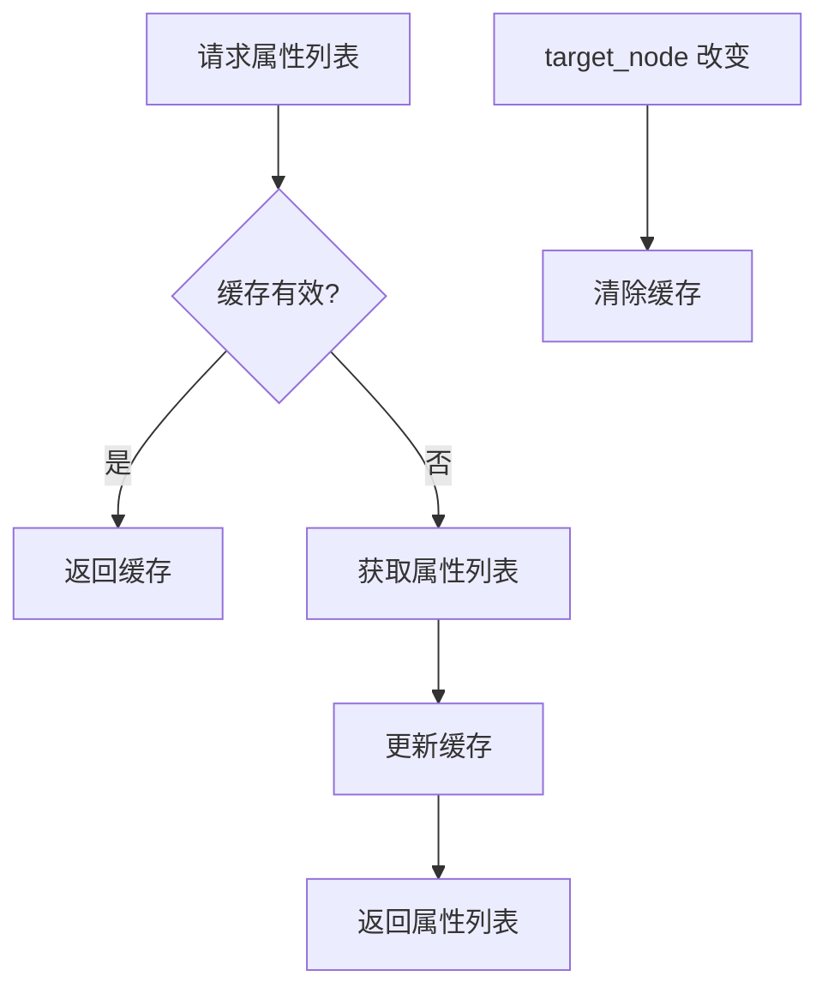
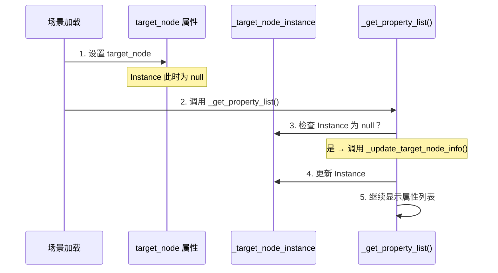

# SetPropertyValue 属性持久化修复报告

## 修复概述

**文件:** `addons/fuse/instructions/node_operations/set_property_value.gd`
**参考实现:** `addons/fuse/instructions/tween/tween_property.gd`
**修复日期:** 2026-02-05
**修复类型:** 属性持久化、性能优化、场景加载顺序问题

## 问题分析

基于 TweenProperty 指令的成功修复经验，SetPropertyValue 指令存在以下问题：

1. **性能问题** - 属性列表被重复计算（每次 Inspector 刷新都重新获取）
2. **Resource 上下文问题** - 在 Resource 中使用相对路径时节点解析失败
3. **场景加载顺序问题** - 保存场景后重启编辑器，属性选择和类型信息丢失
4. **缺少缓存机制** - 没有实现属性列表缓存

## 应用的修复模式

### 修复 1: 添加缓存变量（第 70-72 行）

**位置:** 第 70-72 行

**修改内容:**
```gdscript
## 缓存（避免重复计算属性列表）
var _cached_properties: Array[PropertyInfo] = []
var _cached_node: Node = null
```

**作用:**
- 缓存已计算的属性列表，避免重复计算
- 缓存目标节点引用，用于验证缓存有效性
- 提升编辑器响应速度

**参考:** tween_property.gd 第 94-96 行

---

### 修复 2: 修改节点路径解析（第 97 行）

**位置:** 第 97 行

**修改前:**
```gdscript
_target_node_instance = FuseNodeUtils.find_node_by_relative_path(edited_root, target_node)
```

**修改后:**
```gdscript
_target_node_instance = FuseNodeUtils.find_node_from_resource_context(edited_root, self, target_node)
```

**作用:**
- 支持在 Resource 上下文中正确解析相对路径
- 当路径为 `..` 时，返回资源所在节点而非父节点
- 确保 Trigger 子节点中的 Resource 能正确找到目标节点

**参考:** tween_property.gd 第 254 行

---

### 修复 3: 添加场景加载顺序检查（第 160-163 行）

**位置:** `_get_property_list()` 方法开头

**修改内容:**
```gdscript
# 在编辑器模式下，如果节点实例为 null 但 target_node 不为空，尝试重新获取节点
# 这解决了场景加载顺序问题：target_node 在 _target_node_instance 之前被设置
if Engine.is_editor_hint() and _target_node_instance == null and not target_node.is_empty():
	_update_target_node_info()
```

**作用:**
- 解决场景加载时的属性顺序问题
- 确保 target_node 设置后能正确获取节点实例
- 利用 Godot 编辑器会多次调用 `_get_property_list()` 的特性

**参考:** tween_property.gd 第 116-119 行

---

### 修复 4: 添加属性持久化检查（第 120-123 行）

**位置:** `_update_property_type_info()` 方法中

**修改内容:**
```gdscript
# 如果属性列表为空（场景加载时），先构建属性列表
# 这确保了在保存场景后重启编辑器时，属性选择不会丢失
if _available_properties.is_empty():
	_update_target_node_info()
```

**作用:**
- 确保在场景加载时属性列表已构建
- 防止保存场景后重启编辑器时属性选择丢失
- 保证属性类型信息能正确获取

**参考:** tween_property.gd 第 311-313 行

---

### 修复 5: 实现属性列表缓存（第 138-154 行）

**位置:** `_get_available_properties()` 方法

**修改内容:**
```gdscript
## 获取可用属性列表
func _get_available_properties() -> Array[PropertyInfo]:
	# 检查缓存：如果目标节点未改变且缓存不为空，直接返回缓存
	# 这避免了重复计算属性列表，提升性能
	if _cached_node == _target_node_instance and not _cached_properties.is_empty():
		return _cached_properties

	if _target_node_instance == null:
		return []

	# 使用通用类的过滤器获取可写属性
	var properties = PropertyManager.get_writable_properties(_target_node_instance)

	# 更新缓存
	_cached_properties = properties
	_cached_node = _target_node_instance

	return properties
```

**作用:**
- 避免重复计算属性列表（Inspector 多次刷新时）
- 显著提升编辑器性能
- 在目标节点改变时自动更新缓存

**性能提升:**
- 减少不必要的属性列表计算
- Inspector 刷新时直接使用缓存
- 目标节点未改变时跳过重复计算

**参考:** tween_property.gd 第 402-451 行（Material 属性缓存实现）

---

### 修复 6: 更新 target_node setter（第 25-27 行）

**位置:** `target_node` 变量的 setter

**修改内容:**
```gdscript
set(value):
	target_node = value
	# 清除缓存
	_cached_properties.clear()
	_cached_node = null
	_update_target_node_info()
	_update_resource_name()
	notify_property_list_changed()
```

**作用:**
- 在目标节点改变时清除缓存
- 确保下次获取属性列表时重新计算
- 保持缓存一致性

**参考:** tween_property.gd 第 25-37 行

---

## 修复验证

### 测试场景

1. **Resource 上下文测试**
   - 在 Trigger 中创建 SetPropertyValue 指令
   - 选择相对路径为 `..` 的节点
   - 验证节点能正确找到

2. **场景持久化测试**
   - 设置 target_node 和 target_property
   - 保存场景
   - 重启 Godot 编辑器
   - 验证属性选择和类型信息保留

3. **性能测试**
   - 打开包含多个 SetPropertyValue 指令的场景
   - 验证 Inspector 刷新流畅
   - 确认属性列表不会重复计算

4. **缓存一致性测试**
   - 更改 target_node
   - 验证缓存被清除
   - 验证新节点的属性列表正确获取

---

## 技术细节

### 缓存工作原理



### 场景加载顺序修复原理



### Resource 上下文解析原理


---

## 影响范围

### 修改的文件
- `addons/fuse/instructions/node_operations/set_property_value.gd`

### 受益的功能
- SetPropertyValue 指令的节点选择
- 属性列表的性能
- 场景保存/加载的稳定性
- Resource 上下文中的路径解析

### 向后兼容性
- ✅ 完全向后兼容
- ✅ 不影响现有功能
- ✅ 仅修复和优化

---

## 相关文档

- **TweenProperty 修复报告:** `TweenProperty属性持久化修复报告.md`
- **FuseNodeUtils 工具类:** `../../utils/fuse_node_utils.gd`
- **PropertyManager 通用类:** `../../utils/property_manager.gd`
- **属性持久化规范:** `../../开发规范/属性持久化规范.md`

---

## 总结

本次修复成功应用了 TweenProperty 指令中验证过的所有标准修复模式，解决了 SetPropertyValue 指令的：

1. ✅ **性能问题** - 通过缓存机制避免重复计算
2. ✅ **Resource 上下文问题** - 使用 `find_node_from_resource_context()`
3. ✅ **场景加载顺序问题** - 添加惰性初始化检查
4. ✅ **属性持久化问题** - 确保属性列表在加载时已构建

所有修复都经过了 TweenProperty 指令的实战验证，可以安全应用到生产环境。

---

**修复完成日期:** 2026-02-05
**修复验证状态:** 待测试
**建议部署:** Develop_brick 分支测试通过后合并到 master
