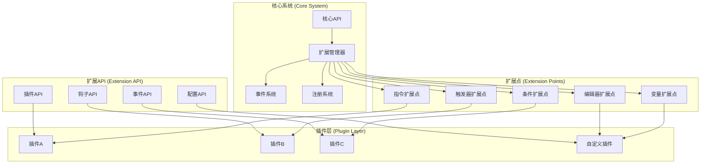

# 扩展点和可扩展性详细设计

## 目录
1. [扩展系统概述](#1-扩展系统概述)
2. [插件架构](#2-插件架构)
3. [扩展点设计](#3-扩展点设计)
4. [API设计](#4-api设计)
5. [模块化系统](#5-模块化系统)
6. [版本兼容性](#6-版本兼容性)

---

## 1. 扩展系统概述

### 1.1 设计理念

扩展系统是可视化编程系统的核心架构，允许开发者通过插件和扩展来增强系统功能。设计理念包括：

- **开放性**：提供丰富的扩展点和API接口
- **模块化**：支持功能的模块化开发和部署
- **向后兼容**：确保新版本与旧插件的兼容性
- **类型安全**：强类型的扩展接口和验证机制
- **易用性**：简化插件开发和集成流程

### 1.2 扩展架构



---

## 2. 插件架构

### 2.1 插件基类

```gdscript
@tool
class_name BasePlugin extends Resource

## 插件信息
@export_group("Plugin Information")
@export var plugin_name: String = ""
@export var plugin_version: String = "1.0.0"
@export var plugin_author: String = ""
@export var plugin_description: String = ""
@export var plugin_website: String = ""
@export var plugin_license: String = ""

## 依赖信息
@export_group("Dependencies")
@export var min_system_version: String = "1.0.0"
@export var required_plugins: Array[String] = []
@export var optional_plugins: Array[String] = []

## 插件状态
var is_enabled: bool = false
var is_loaded: bool = false
var load_time: float = 0.0
var error_message: String = ""

## 信号
signal plugin_loaded()
signal plugin_unloaded()
signal plugin_enabled()
signal plugin_disabled()
signal plugin_error(message: String)

## 插件生命周期方法
func _ready():
    pass

## 插件初始化
func initialize() -> bool:
    if is_loaded:
        return true
    
    try:
        # 检查依赖
        if not _check_dependencies():
            return false
        
        # 调用子类初始化
        if not _on_initialize():
            return false
        
        is_loaded = true
        load_time = Time.get_ticks_msec() / 1000.0
        plugin_loaded.emit()
        
        print("Plugin '%s' loaded successfully" % plugin_name)
        return true
        
    except:
        error_message = "Failed to initialize plugin: " + str(get_stack())
        plugin_error.emit(error_message)
        return false

## 插件清理
func cleanup():
    if not is_loaded:
        return
    
    try:
        # 调用子类清理
        _on_cleanup()
        
        is_loaded = false
        plugin_unloaded.emit()
        
        print("Plugin '%s' cleaned up successfully" % plugin_name)
        
    except:
        error_message = "Failed to cleanup plugin: " + str(get_stack())
        plugin_error.emit(error_message)

## 启用插件
func enable() -> bool:
    if not is_loaded:
        if not initialize():
            return false
    
    try:
        # 调用子类启用
        if not _on_enable():
            return false
        
        is_enabled = true
        plugin_enabled.emit()
        
        print("Plugin '%s' enabled successfully" % plugin_name)
        return true
        
    except:
        error_message = "Failed to enable plugin: " + str(get_stack())
        plugin_error.emit(error_message)
        return false

## 禁用插件
func disable():
    if not is_enabled:
        return
    
    try:
        # 调用子类禁用
        _on_disable()
        
        is_enabled = false
        plugin_disabled.emit()
        
        print("Plugin '%s' disabled successfully" % plugin_name)
        
    except:
        error_message = "Failed to disable plugin: " + str(get_stack())
        plugin_error.emit(error_message)

## 检查依赖
func _check_dependencies() -> bool:
    # 检查系统版本
    var current_version = ExtensionManager.get_system_version()
    if not _is_version_compatible(current_version, min_system_version):
        error_message = "System version %s is not compatible with required %s" % [current_version, min_system_version]
        return false
    
    # 检查必需插件
    for required_plugin in required_plugins:
        if not ExtensionManager.is_plugin_loaded(required_plugin):
            error_message = "Required plugin '%s' is not loaded" % required_plugin
            return false
    
    return true

## 版本兼容性检查
func _is_version_compatible(current: String, required: String) -> bool:
    var current_parts = current.split(".")
    var required_parts = required.split(".")
    
    for i in range(min(current_parts.size(), required_parts.size())):
        var current_part = current_parts[i].to_int()
        var required_part = required_parts[i].to_int()
        
        if current_part < required_part:
            return false
        elif current_part > required_part:
            return true
    
    return true

## 子类重写方法
func _on_initialize() -> bool:
    # 子类实现具体的初始化逻辑
    return true

func _on_cleanup():
    # 子类实现具体的清理逻辑
    pass

func _on_enable() -> bool:
    # 子类实现具体的启用逻辑
    return true

func _on_disable():
    # 子类实现具体的禁用逻辑
    pass

## 获取插件信息
func get_plugin_info() -> Dictionary:
    return {
        "name": plugin_name,
        "version": plugin_version,
        "author": plugin_author,
        "description": plugin_description,
        "website": plugin_website,
        "license": plugin_license,
        "dependencies": {
            "min_system_version": min_system_version,
            "required_plugins": required_plugins,
            "optional_plugins": optional_plugins
        },
        "status": {
            "is_loaded": is_loaded,
            "is_enabled": is_enabled,
            "load_time": load_time,
            "error_message": error_message
        }
    }
```

### 2.2 插件管理器

```gdscript
@tool
class_name ExtensionManager extends Node

## 单例实例
static var instance: ExtensionManager = null

## 插件存储
var loaded_plugins: Dictionary = {}  # plugin_name -> BasePlugin
var plugin_registry: Dictionary = {}  # plugin_name -> PluginMetadata
var extension_points: Dictionary = {}  # extension_point -> ExtensionPoint

## 系统信息
var system_version: String = "1.0.0"

## 信号
signal plugin_loaded(plugin_name: String)
signal plugin_unloaded(plugin_name: String)
signal plugin_enabled(plugin_name: String)
signal plugin_disabled(plugin_name: String)
signal extension_registered(extension_point: String)
signal extension_unregistered(extension_point: String)

func _init():
    if not instance:
        instance = self

## 获取系统版本
static func get_system_version() -> String:
    if not instance:
        return "1.0.0"
    return instance.system_version

## 注册插件
func register_plugin(plugin: BasePlugin) -> bool:
    if not plugin or plugin.plugin_name.is_empty():
        push_error("Invalid plugin for registration")
        return false
    
    var plugin_name = plugin.plugin_name
    
    # 检查是否已注册
    if plugin_registry.has(plugin_name):
        push_warning("Plugin '%s' is already registered" % plugin_name)
        return false
    
    # 创建插件元数据
    var metadata = PluginMetadata.new()
    metadata.name = plugin_name
    metadata.version = plugin.plugin_version
    metadata.author = plugin.plugin_author
    metadata.description = plugin.plugin_description
    metadata.plugin = plugin
    
    plugin_registry[plugin_name] = metadata
    
    print("Plugin '%s' registered successfully" % plugin_name)
    extension_registered.emit("plugin:" + plugin_name)
    
    return true

## 加载插件
func load_plugin(plugin_path: String) -> bool:
    if not FileAccess.file_exists(plugin_path):
        push_error("Plugin file not found: %s" % plugin_path)
        return false
    
    # 加载插件资源
    var plugin_resource = load(plugin_path)
    if not plugin_resource or not plugin_resource is BasePlugin:
        push_error("Invalid plugin file: %s" % plugin_path)
        return false
    
    var plugin = plugin_resource as BasePlugin
    
    # 检查是否已加载
    if loaded_plugins.has(plugin.plugin_name):
        push_warning("Plugin '%s' is already loaded" % plugin.plugin_name)
        return true
    
    # 初始化插件
    if plugin.initialize():
        loaded_plugins[plugin.plugin_name] = plugin
        plugin_loaded.emit(plugin.plugin_name)
        return true
    else:
        push_error("Failed to initialize plugin: %s" % plugin.plugin_name)
        return false

## 卸载插件
func unload_plugin(plugin_name: String) -> bool:
    var plugin = loaded_plugins.get(plugin_name)
    if not plugin:
        push_warning("Plugin '%s' is not loaded" % plugin_name)
        return false
    
    # 禁用插件
    if plugin.is_enabled:
        disable_plugin(plugin_name)
    
    # 清理插件
    plugin.cleanup()
    loaded_plugins.erase(plugin_name)
    
    plugin_unloaded.emit(plugin_name)
    print("Plugin '%s' unloaded successfully" % plugin_name)
    
    return true

## 启用插件
func enable_plugin(plugin_name: String) -> bool:
    var plugin = loaded_plugins.get(plugin_name)
    if not plugin:
        push_error("Plugin '%s' is not loaded" % plugin_name)
        return false
    
    if plugin.enable():
        plugin_enabled.emit(plugin_name)
        return true
    else:
        push_error("Failed to enable plugin: %s" % plugin_name)
        return false

## 禁用插件
func disable_plugin(plugin_name: String) -> bool:
    var plugin = loaded_plugins.get(plugin_name)
    if not plugin:
        push_error("Plugin '%s' is not loaded" % plugin_name)
        return false
    
    plugin.disable()
    plugin_disabled.emit(plugin_name)
    
    return true

## 检查插件是否已加载
func is_plugin_loaded(plugin_name: String) -> bool:
    return loaded_plugins.has(plugin_name)

## 获取插件
func get_plugin(plugin_name: String) -> BasePlugin:
    return loaded_plugins.get(plugin_name)

## 获取所有已加载的插件
func get_loaded_plugins() -> Dictionary:
    return loaded_plugins.duplicate()

## 获取插件注册信息
func get_plugin_registry() -> Dictionary:
    return plugin_registry.duplicate()

## 注册扩展点
func register_extension_point(extension_point: String, extension_point: ExtensionPoint) -> bool:
    if extension_point.is_empty():
        push_error("Extension point name cannot be empty")
        return false
    
    if extension_points.has(extension_point):
        push_warning("Extension point '%s' is already registered" % extension_point)
        return false
    
    extension_points[extension_point] = extension_point
    
    print("Extension point '%s' registered successfully" % extension_point)
    extension_registered.emit(extension_point)
    
    return true

## 获取扩展点
func get_extension_point(extension_point: String) -> ExtensionPoint:
    return extension_points.get(extension_point)

## 获取所有扩展点
func get_extension_points() -> Dictionary:
    return extension_points.duplicate()

## 自动发现并加载插件
func auto_discover_plugins():
    var plugin_dir = "res://addons/visual_programming/plugins/"
    _scan_directory_for_plugins(plugin_dir)

## 扫描目录中的插件
func _scan_directory_for_plugins(directory_path: String):
    var dir = DirAccess.open(directory_path)
    if not dir:
        return
    
    dir.list_dir_begin()
    var file_name = dir.get_next()
    
    while file_name != "":
        if file_name.ends_with(".gd") or file_name.ends_with(".tscn"):
            var plugin_path = directory_path + file_name
            _try_load_plugin_from_file(plugin_path)
        file_name = dir.get_next()
    
    dir.list_dir_end()

## 尝试从文件加载插件
func _try_load_plugin_from_file(plugin_path: String):
    var plugin_resource = load(plugin_path)
    if plugin_resource and plugin_resource is BasePlugin:
        register_plugin(plugin_resource)
        load_plugin(plugin_path)

## 获取系统状态
func get_system_status() -> Dictionary:
    return {
        "system_version": system_version,
        "loaded_plugins_count": loaded_plugins.size(),
        "enabled_plugins_count": _count_enabled_plugins(),
        "extension_points_count": extension_points.size(),
        "plugin_list": _get_plugin_list(),
        "extension_point_list": extension_points.keys()
    }

## 统计启用的插件数量
func _count_enabled_plugins() -> int:
    var count = 0
    for plugin in loaded_plugins.values():
        if plugin.is_enabled:
            count += 1
    return count

## 获取插件列表
func _get_plugin_list() -> Array[Dictionary]:
    var plugin_list = []
    
    for plugin in loaded_plugins.values():
        plugin_list.append(plugin.get_plugin_info())
    
    return plugin_list
```

---

## 3. 扩展点设计

### 3.1 扩展点基类

```gdscript
@tool
class_name ExtensionPoint extends RefCounted

## 扩展点信息
var name: String
var description: String
var extension_type: String
var allowed_extensions: Array[String] = []

## 扩展注册表
var registered_extensions: Dictionary = {}  # extension_name -> Extension

## 信号
signal extension_registered(extension_name: String)
signal extension_unregistered(extension_name: String)

func _init(ext_name: String, ext_description: String, ext_type: String):
    name = ext_name
    description = ext_description
    extension_type = ext_type

## 注册扩展
func register_extension(extension_name: String, extension: Extension) -> bool:
    if extension_name.is_empty():
        push_error("Extension name cannot be empty")
        return false
    
    if registered_extensions.has(extension_name):
        push_warning("Extension '%s' is already registered for extension point '%s'" % [extension_name, name])
        return false
    
    # 验证扩展类型
    if not _validate_extension_type(extension):
        push_error("Extension type '%s' is not compatible with extension point '%s'" % [extension.get_extension_type(), name])
        return false
    
    registered_extensions[extension_name] = extension
    extension_registered.emit(extension_name)
    
    print("Extension '%s' registered for extension point '%s'" % [extension_name, name])
    return true

## 注销扩展
func unregister_extension(extension_name: String) -> bool:
    if not registered_extensions.has(extension_name):
        push_warning("Extension '%s' is not registered for extension point '%s'" % [extension_name, name])
        return false
    
    registered_extensions.erase(extension_name)
    extension_unregistered.emit(extension_name)
    
    print("Extension '%s' unregistered from extension point '%s'" % [extension_name, name])
    return true

## 获取扩展
func get_extension(extension_name: String) -> Extension:
    return registered_extensions.get(extension_name)

## 获取所有扩展
func get_all_extensions() -> Dictionary:
    return registered_extensions.duplicate()

## 验证扩展类型
func _validate_extension_type(extension: Extension) -> bool:
    # 检查扩展类型是否匹配
    return extension.get_extension_type() == extension_type

## 调用扩展
func call_extension(extension_name: String, method: String, args: Array = []) -> Variant:
    var extension = registered_extensions.get(extension_name)
    if not extension:
        push_error("Extension '%s' not found in extension point '%s'" % [extension_name, name])
        return null
    
    if not extension.has_method(method):
        push_error("Method '%s' not found in extension '%s'" % [method, extension_name])
        return null
    
    return extension.callv(method, args)

## 获取扩展点信息
func get_info() -> Dictionary:
    return {
        "name": name,
        "description": description,
        "extension_type": extension_type,
        "registered_extensions": registered_extensions.keys(),
        "extension_count": registered_extensions.size()
    }
```

### 3.2 具体扩展点实现

#### 3.2.1 指令扩展点

```gdscript
@tool
class_name InstructionExtensionPoint extends ExtensionPoint

## 指令扩展
class InstructionExtension extends RefCounted
    var instruction_name: String
    var instruction_class: Script
    var category: String
    var description: String
    var icon: Texture2D

func _init():
    super("instruction", "Extension point for custom instructions", "instruction")

## 注册指令扩展
func register_instruction_extension(extension_name: String, instruction_class: Script, category: String = "Custom", description: String = "", icon: Texture2D = null) -> bool:
    var extension = InstructionExtension.new()
    extension.instruction_name = extension_name
    extension.instruction_class = instruction_class
    extension.category = category
    extension.description = description
    extension.icon = icon
    
    return register_extension(extension_name, extension)

## 创建指令实例
func create_instruction(extension_name: String) -> BaseInstruction:
    var extension = get_extension(extension_name)
    if not extension or not extension.instruction_class:
        push_error("Invalid instruction extension: %s" % extension_name)
        return null
    
    var instruction = extension.instruction_class.new()
    if not instruction is BaseInstruction:
        push_error("Instruction class does not inherit from BaseInstruction: %s" % extension_name)
        return null
    
    return instruction

## 获取指令扩展信息
func get_instruction_extension_info(extension_name: String) -> Dictionary:
    var extension = get_extension(extension_name)
    if not extension:
        return {}
    
    return {
        "name": extension_name,
        "category": extension.category,
        "description": extension.description,
        "icon": extension.icon,
        "class_name": extension.instruction_class.get_global_name()
    }
```

#### 3.2.2 触发器扩展点

```gdscript
@tool
class_name TriggerExtensionPoint extends ExtensionPoint

## 触发器扩展
class TriggerExtension extends RefCounted
    var trigger_name: String
    var trigger_class: Script
    var category: String
    var description: String
    var icon: Texture2D
    var supported_events: Array[String] = []

func _init():
    super("trigger", "Extension point for custom triggers", "trigger")

## 注册触发器扩展
func register_trigger_extension(extension_name: String, trigger_class: Script, category: String = "Custom", description: String = "", icon: Texture2D = null, supported_events: Array[String] = []) -> bool:
    var extension = TriggerExtension.new()
    extension.trigger_name = extension_name
    extension.trigger_class = trigger_class
    extension.category = category
    extension.description = description
    extension.icon = icon
    extension.supported_events = supported_events
    
    return register_extension(extension_name, extension)

## 创建触发器实例
func create_trigger(extension_name: String) -> BaseTrigger:
    var extension = get_extension(extension_name)
    if not extension or not extension.trigger_class:
        push_error("Invalid trigger extension: %s" % extension_name)
        return null
    
    var trigger = extension.trigger_class.new()
    if not trigger is BaseTrigger:
        push_error("Trigger class does not inherit from BaseTrigger: %s" % extension_name)
        return null
    
    return trigger

## 获取触发器扩展信息
func get_trigger_extension_info(extension_name: String) -> Dictionary:
    var extension = get_extension(extension_name)
    if not extension:
        return {}
    
    return {
        "name": extension_name,
        "category": extension.category,
        "description": extension.description,
        "icon": extension.icon,
        "supported_events": extension.supported_events,
        "class_name": extension.trigger_class.get_global_name()
    }
```

#### 3.2.3 条件扩展点

```gdscript
@tool
class_name ConditionExtensionPoint extends ExtensionPoint

## 条件扩展
class ConditionExtension extends RefCounted
    var condition_name: String
    var condition_class: Script
    var category: String
    var description: String
    var icon: Texture2D
    var supported_operators: Array[String] = []

func _init():
    super("condition", "Extension point for custom conditions", "condition")

## 注册条件扩展
func register_condition_extension(extension_name: String, condition_class: Script, category: String = "Custom", description: String = "", icon: Texture2D = null, supported_operators: Array[String] = []) -> bool:
    var extension = ConditionExtension.new()
    extension.condition_name = extension_name
    extension.condition_class = condition_class
    extension.category = category
    extension.description = description
    extension.icon = icon
    extension.supported_operators = supported_operators
    
    return register_extension(extension_name, extension)

## 创建条件实例
func create_condition(extension_name: String) -> BaseCondition:
    var extension = get_extension(extension_name)
    if not extension or not extension.condition_class:
        push_error("Invalid condition extension: %s" % extension_name)
        return null
    
    var condition = extension.condition_class.new()
    if not condition is BaseCondition:
        push_error("Condition class does not inherit from BaseCondition: %s" % extension_name)
        return null
    
    return condition

## 获取条件扩展信息
func get_condition_extension_info(extension_name: String) -> Dictionary:
    var extension = get_extension(extension_name)
    if not extension:
        return {}
    
    return {
        "name": extension_name,
        "category": extension.category,
        "description": extension.description,
        "icon": extension.icon,
        "supported_operators": extension.supported_operators,
        "class_name": extension.condition_class.get_global_name()
    }
```

---

## 4. API设计

### 4.1 核心API

```gdscript
@tool
class_name VisualScriptAPI extends RefCounted

## API版本
const API_VERSION = "1.0.0"

## 核心组件引用
var instruction_system: InstructionSystem
var trigger_system: TriggerSystem
var condition_system: ConditionSystem
var variable_system: VariableSystem
var execution_engine: ExecutionEngine

## 信号
signal api_ready()
signal api_error(message: String)

func _init():
    _initialize_api()

## 初始化API
func _initialize_api():
    # 获取核心组件引用
    instruction_system = InstructionSystem.get_instance()
    trigger_system = TriggerSystem.get_instance()
    condition_system = ConditionSystem.get_instance()
    variable_system = VariableSystem.get_instance()
    execution_engine = ExecutionEngine.get_instance()
    
    # 检查所有组件是否可用
    if _validate_components():
        api_ready.emit()
    else:
        api_error.emit("Failed to initialize Visual Script API")

## 验证组件
func _validate_components() -> bool:
    return (instruction_system != null and 
            trigger_system != null and 
            condition_system != null and 
            variable_system != null and 
            execution_engine != null)

## 指令API
func create_instruction(instruction_type: String, properties: Dictionary = {}) -> BaseInstruction:
    return instruction_system.create_instruction(instruction_type, properties)

func execute_instruction(instruction: BaseInstruction, context: ExecutionContext) -> bool:
    return instruction_system.execute_instruction(instruction, context)

## 触发器API
func create_trigger(trigger_type: String, properties: Dictionary = {}) -> BaseTrigger:
    return trigger_system.create_trigger(trigger_type, properties)

func register_trigger(trigger: BaseTrigger, node: Node) -> bool:
    return trigger_system.register_trigger(trigger, node)

## 条件API
func create_condition(condition_type: String, properties: Dictionary = {}) -> BaseCondition:
    return condition_system.create_condition(condition_type, properties)

func evaluate_condition(condition: BaseCondition, context: ExecutionContext) -> bool:
    return condition_system.evaluate_condition(condition, context)

## 变量API
func create_variable(variable_type: String, name: String, value: Variant = null) -> BaseVariable:
    return variable_system.create_variable(variable_type, name, value)

func get_variable(name: String, scope: String = "auto") -> Variant:
    return variable_system.get_variable(name, scope)

func set_variable(name: String, value: Variant, scope: String = "auto") -> bool:
    return variable_system.set_variable(name, value, scope)

## 执行引擎API
func execute_action_runner(action_runner: ActionRunner, trigger: BaseTrigger, target: Node = null) -> String:
    return execution_engine.execute_action_runner(action_runner, trigger, target)

func create_execution_context(trigger: BaseTrigger, target: Node = null) -> ExecutionContext:
    return execution_engine.create_context(trigger, target)

## 扩展API
func register_extension(extension_point: String, extension: Extension) -> bool:
    return ExtensionManager.register_extension_point(extension_point, extension)

func get_extension(extension_point: String, extension_name: String) -> Extension:
    var ext_point = ExtensionManager.get_extension_point(extension_point)
    if ext_point:
        return ext_point.get_extension(extension_name)
    return null

## 插件API
func register_plugin(plugin: BasePlugin) -> bool:
    return ExtensionManager.register_plugin(plugin)

func load_plugin(plugin_path: String) -> bool:
    return ExtensionManager.load_plugin(plugin_path)

func enable_plugin(plugin_name: String) -> bool:
    return ExtensionManager.enable_plugin(plugin_name)

func disable_plugin(plugin_name: String) -> bool:
    return ExtensionManager.disable_plugin(plugin_name)

## 获取API信息
func get_api_info() -> Dictionary:
    return {
        "version": API_VERSION,
        "components": {
            "instruction_system": instruction_system != null,
            "trigger_system": trigger_system != null,
            "condition_system": condition_system != null,
            "variable_system": variable_system != null,
            "execution_engine": execution_engine != null
        },
        "extension_points": ExtensionManager.get_extension_points().keys(),
        "loaded_plugins": ExtensionManager.get_loaded_plugins().keys()
    }
```

### 4.2 事件API

```gdscript
@tool
class_name VisualScriptEventAPI extends RefCounted

## 事件类型
enum EventType {
    INSTRUCTION_CREATED,
    INSTRUCTION_EXECUTED,
    TRIGGER_FIRED,
    CONDITION_EVALUATED,
    VARIABLE_CHANGED,
    EXECUTION_STARTED,
    EXECUTION_COMPLETED,
    PLUGIN_LOADED,
    PLUGIN_UNLOADED
}

## 事件数据
class EventData:
    var type: EventType
    var source: Variant
    var data: Dictionary = {}
    var timestamp: float

## 事件监听器
var event_listeners: Dictionary = {}  # EventType -> Array[Callable]

## 信号
signal visual_script_event(event_data: EventData)

func _init():
    _setup_event_listeners()

## 设置事件监听器
func _setup_event_listeners():
    for event_type in EventType.values():
        event_listeners[event_type] = []

## 添加事件监听器
func add_event_listener(event_type: EventType, listener: Callable):
    if event_listeners.has(event_type):
        event_listeners[event_type].append(listener)

## 移除事件监听器
func remove_event_listener(event_type: EventType, listener: Callable):
    if event_listeners.has(event_type):
        var listeners = event_listeners[event_type]
        var index = listeners.find(listener)
        if index >= 0:
            listeners.remove_at(index)

## 触发事件
func trigger_event(event_type: EventType, source: Variant = null, data: Dictionary = {}):
    var event_data = EventData.new()
    event_data.type = event_type
    event_data.source = source
    event_data.data = data
    event_data.timestamp = Time.get_ticks_msec() / 1000.0
    
    # 通知本地监听器
    if event_listeners.has(event_type):
        for listener in event_listeners[event_type]:
            if listener.is_valid():
                listener.call(event_data)
    
    # 发出全局信号
    visual_script_event.emit(event_data)

## 指令事件
func trigger_instruction_created(instruction: BaseInstruction):
    trigger_event(EventType.INSTRUCTION_CREATED, instruction, {"instruction_name": instruction.get_description()})

func trigger_instruction_executed(instruction: BaseInstruction, context: ExecutionContext):
    trigger_event(EventType.INSTRUCTION_EXECUTED, instruction, {
        "instruction_name": instruction.get_description(),
        "context_id": context.execution_id
    })

## 触发器事件
func trigger_trigger_fired(trigger: BaseTrigger, target: Node = null):
    trigger_event(EventType.TRIGGER_FIRED, trigger, {
        "trigger_name": trigger.name,
        "target": target.name if target else null
    })

## 条件事件
func trigger_condition_evaluated(condition: BaseCondition, context: ExecutionContext, result: bool):
    trigger_event(EventType.CONDITION_EVALUATED, condition, {
        "condition_name": condition.get_description(),
        "context_id": context.execution_id,
        "result": result
    })

## 变量事件
func trigger_variable_changed(variable_name: String, old_value: Variant, new_value: Variant, scope: String):
    trigger_event(EventType.VARIABLE_CHANGED, null, {
        "variable_name": variable_name,
        "old_value": old_value,
        "new_value": new_value,
        "scope": scope
    })

## 执行事件
func trigger_execution_started(context: ExecutionContext):
    trigger_event(EventType.EXECUTION_STARTED, context, {"context_id": context.execution_id})

func trigger_execution_completed(context: ExecutionContext, success: bool, error_message: String = ""):
    trigger_event(EventType.EXECUTION_COMPLETED, context, {
        "context_id": context.execution_id,
        "success": success,
        "error_message": error_message
    })

## 插件事件
func trigger_plugin_loaded(plugin: BasePlugin):
    trigger_event(EventType.PLUGIN_LOADED, plugin, {
        "plugin_name": plugin.plugin_name,
        "plugin_version": plugin.plugin_version
    })

func trigger_plugin_unloaded(plugin: BasePlugin):
    trigger_event(EventType.PLUGIN_UNLOADED, plugin, {
        "plugin_name": plugin.plugin_name,
        "plugin_version": plugin.plugin_version
    })
```

---

## 5. 模块化系统

### 5.1 模块管理器

```gdscript
@tool
class_name ModuleManager extends RefCounted

## 模块信息
class ModuleInfo:
    var name: String
    var version: String
    var description: String
    var author: String
    var dependencies: Array[String] = []
    var exports: Array[String] = []
    var module_path: String
    var is_loaded: bool = false

## 模块存储
var loaded_modules: Dictionary = {}  # module_name -> ModuleInfo
var module_registry: Dictionary = {}  # module_name -> ModuleInfo

## 信号
signal module_loaded(module_name: String)
signal module_unloaded(module_name: String)
signal module_error(module_name: String, error: String)

## 注册模块
func register_module(module_info: ModuleInfo) -> bool:
    if module_info.name.is_empty():
        push_error("Module name cannot be empty")
        return false
    
    if module_registry.has(module_info.name):
        push_warning("Module '%s' is already registered" % module_info.name)
        return false
    
    module_registry[module_info.name] = module_info
    
    print("Module '%s' registered successfully" % module_info.name)
    return true

## 加载模块
func load_module(module_path: String) -> bool:
    if not FileAccess.file_exists(module_path):
        push_error("Module file not found: %s" % module_path)
        return false
    
    # 读取模块配置
    var config_file = FileAccess.open(module_path, FileAccess.READ)
    if not config_file:
        push_error("Failed to read module config: %s" % module_path)
        return false
    
    var config_string = config_file.get_as_text()
    config_file.close()
    
    var json = JSON.new()
    if json.parse(config_string) != OK:
        push_error("Invalid module config: %s" % module_path)
        return false
    
    var config_data = json.data
    
    # 创建模块信息
    var module_info = ModuleInfo.new()
    module_info.name = config_data.get("name", "")
    module_info.version = config_data.get("version", "1.0.0")
    module_info.description = config_data.get("description", "")
    module_info.author = config_data.get("author", "")
    module_info.dependencies = config_data.get("dependencies", [])
    module_info.exports = config_data.get("exports", [])
    module_info.module_path = module_path
    
    # 检查依赖
    if not _check_module_dependencies(module_info):
        return false
    
    # 加载模块脚本
    var script_path = module_path.get_base_dir() + "/" + config_data.get("main_script", "")
    if not FileAccess.file_exists(script_path):
        push_error("Module main script not found: %s" % script_path)
        return false
    
    var module_script = load(script_path)
    if not module_script:
        push_error("Failed to load module script: %s" % script_path)
        return false
    
    # 注册模块
    if register_module(module_info):
        module_info.is_loaded = true
        loaded_modules[module_info.name] = module_info
        
        module_loaded.emit(module_info.name)
        print("Module '%s' loaded successfully" % module_info.name)
        return true
    else:
        return false

## 检查模块依赖
func _check_module_dependencies(module_info: ModuleInfo) -> bool:
    for dependency in module_info.dependencies:
        if not loaded_modules.has(dependency):
            push_error("Module dependency '%s' not loaded for module '%s'" % [dependency, module_info.name])
            return false
    return true

## 卸载模块
func unload_module(module_name: String) -> bool:
    var module_info = loaded_modules.get(module_name)
    if not module_info:
        push_warning("Module '%s' is not loaded" % module_name)
        return false
    
    # 检查是否有其他模块依赖此模块
    for other_module in loaded_modules.values():
        if other_module.dependencies.has(module_name):
            push_error("Cannot unload module '%s' - required by module '%s'" % [module_name, other_module.name])
            return false
    
    module_info.is_loaded = false
    loaded_modules.erase(module_name)
    
    module_unloaded.emit(module_name)
    print("Module '%s' unloaded successfully" % module_name)
    
    return true

## 获取模块
func get_module(module_name: String) -> ModuleInfo:
    return loaded_modules.get(module_name)

## 获取模块导出
func get_module_exports(module_name: String) -> Array[String]:
    var module_info = loaded_modules.get(module_name)
    if module_info:
        return module_info.exports
    return []

## 调用模块导出
func call_module_export(module_name: String, export_name: String, args: Array = []) -> Variant:
    var module_info = loaded_modules.get(module_name)
    if not module_info:
        push_error("Module '%s' is not loaded" % module_name)
        return null
    
    if not module_info.exports.has(export_name):
        push_error("Module '%s' does not export '%s'" % [module_name, export_name])
        return null
    
    # 构建导出函数名
    var function_name = "module_%s_export_%s" % [module_name, export_name]
    
    # 检查函数是否存在
    if not has_method(function_name):
        push_error("Export function '%s' not found in module '%s'" % [export_name, module_name])
        return null
    
    return call(function_name, args)

## 自动发现并加载模块
func auto_discover_modules():
    var module_dir = "res://addons/visual_programming/modules/"
    _scan_directory_for_modules(module_dir)

## 扫描目录中的模块
func _scan_directory_for_modules(directory_path: String):
    var dir = DirAccess.open(directory_path)
    if not dir:
        return
    
    dir.list_dir_begin()
    var file_name = dir.get_next()
    
    while file_name != "":
        if file_name.ends_with(".json"):
            var module_path = directory_path + file_name
            _try_load_module_from_file(module_path)
        file_name = dir.get_next()
    
    dir.list_dir_end()

## 尝试从文件加载模块
func _try_load_module_from_file(module_path: String):
    load_module(module_path)

## 获取系统状态
func get_system_status() -> Dictionary:
    return {
        "loaded_modules_count": loaded_modules.size(),
        "registered_modules_count": module_registry.size(),
        "module_list": _get_module_list(),
        "dependency_graph": _build_dependency_graph()
    }

## 获取模块列表
func _get_module_list() -> Array[Dictionary]:
    var module_list = []
    
    for module_info in loaded_modules.values():
        module_list.append({
            "name": module_info.name,
            "version": module_info.version,
            "description": module_info.description,
            "author": module_info.author,
            "dependencies": module_info.dependencies,
            "exports": module_info.exports,
            "is_loaded": module_info.is_loaded,
            "module_path": module_info.module_path
        })
    
    return module_list

## 构建依赖图
func _build_dependency_graph() -> Dictionary:
    var dependency_graph = {}
    
    for module_name in loaded_modules.keys():
        var module_info = loaded_modules[module_name]
        dependency_graph[module_name] = module_info.dependencies
    
    return dependency_graph
```

---

## 6. 版本兼容性

### 6.1 版本管理器

```gdscript
@tool
class_name VersionManager extends RefCounted

## 版本信息
class VersionInfo:
    var major: int
    var minor: int
    var patch: int
    var prerelease: String = ""
    
    func _init(version_string: String):
        _parse_version_string(version_string)
    
    func _parse_version_string(version_string: String):
        var parts = version_string.split("-")
            var version_part = parts[0]
            prerelease = parts[1] if parts.size() > 1 else ""
            
            var version_numbers = version_part.split(".")
            major = version_numbers[0].to_int() if version_numbers.size() > 0 else 0
            minor = version_numbers[1].to_int() if version_numbers.size() > 1 else 0
            patch = version_numbers[2].to_int() if version_numbers.size() > 2 else 0
    
    func to_string() -> String:
        var version_str = "%d.%d.%d" % [major, minor, patch]
        if not prerelease.is_empty():
            version_str += "-" + prerelease
        return version_str
    
    func is_compatible_with(required: VersionInfo) -> bool:
        if major > required.major:
            return true
        elif major < required.major:
            return false
        elif minor > required.minor:
            return true
        elif minor < required.minor:
            return false
        elif patch >= required.patch:
            return true
        else:
            return false

## 系统版本
var current_version: VersionInfo

## 兼容性规则
var compatibility_rules: Dictionary = {}

func _init():
    current_version = VersionInfo.new("1.0.0")
    _setup_compatibility_rules()

## 设置兼容性规则
func _setup_compatibility_rules():
    compatibility_rules = {
        "instruction": {
            "min_version": "1.0.0",
            "max_version": "1.999.999",
            "breaking_changes": ["2.0.0"]
        },
        "trigger": {
            "min_version": "1.0.0",
            "max_version": "1.999.999",
            "breaking_changes": ["2.0.0"]
        },
        "condition": {
            "min_version": "1.0.0",
            "max_version": "1.999.999",
            "breaking_changes": ["2.0.0"]
        },
        "variable": {
            "min_version": "1.0.0",
            "max_version": "1.999.999",
            "breaking_changes": ["2.0.0"]
        }
    }

## 检查版本兼容性
func check_compatibility(component_type: String, version: String) -> bool:
    var version_info = VersionInfo.new(version)
    var rules = compatibility_rules.get(component_type, {})
    
    # 检查最小版本
    var min_version = VersionInfo.new(rules.get("min_version", "1.0.0"))
    if not version_info.is_compatible_with(min_version):
        return false
    
    # 检查最大版本
    var max_version = VersionInfo.new(rules.get("max_version", "1.999.999"))
    if not max_version.is_compatible_with(version_info):
        return false
    
    # 检查破坏性变更
    var breaking_changes = rules.get("breaking_changes", [])
    for breaking_version in breaking_changes:
        var breaking_info = VersionInfo.new(breaking_version)
        if breaking_info.is_compatible_with(version_info):
            return false
    
    return true

## 获取版本兼容性信息
func get_compatibility_info(component_type: String, version: String) -> Dictionary:
    var version_info = VersionInfo.new(version)
    var rules = compatibility_rules.get(component_type, {})
    
    var is_compatible = check_compatibility(component_type, version)
    var min_version = VersionInfo.new(rules.get("min_version", "1.0.0"))
    var max_version = VersionInfo.new(rules.get("max_version", "1.999.999"))
    
    return {
        "component_type": component_type,
        "version": version,
        "is_compatible": is_compatible,
        "min_version": min_version.to_string(),
        "max_version": max_version.to_string(),
        "breaking_changes": rules.get("breaking_changes", []),
        "current_version": current_version.to_string()
    }

## 升级检查
func check_upgrade_available(component_type: String, current_version: String) -> Dictionary:
    var version_info = VersionInfo.new(current_version)
    var rules = compatibility_rules.get(component_type, {})
    
    # 检查是否有新版本可用
    var latest_version = VersionInfo.new(rules.get("max_version", "1.999.999"))
    var has_upgrade = latest_version.is_compatible_with(version_info) and not version_info.is_compatible_with(latest_version)
    
    return {
        "component_type": component_type,
        "current_version": current_version,
        "latest_version": latest_version.to_string(),
        "upgrade_available": has_upgrade,
        "breaking_changes": rules.get("breaking_changes", [])
    }

## 迁移数据
func migrate_data(old_version: String, new_version: String, data: Dictionary) -> Dictionary:
    var old_info = VersionInfo.new(old_version)
    var new_info = VersionInfo.new(new_version)
    
    # 如果版本相同，直接返回
    if old_info.to_string() == new_info.to_string():
        return data
    
    # 执行迁移逻辑
    var migrated_data = data.duplicate(true)
    
    # 这里应该根据具体的版本差异来实现迁移逻辑
    # 简化实现：添加版本标记
    migrated_data["_migrated_from"] = old_info.to_string()
    migrated_data["_migrated_to"] = new_info.to_string()
    migrated_data["_migration_timestamp"] = Time.get_ticks_msec() / 1000.0
    
    return migrated_data

## 获取当前版本
func get_current_version() -> String:
    return current_version.to_string()

## 设置当前版本
func set_current_version(version: String):
    current_version = VersionInfo.new(version)
```

---

## 总结

扩展点和可扩展性设计是可视化编程系统的架构核心，本设计提供了：

1. **完整的插件架构**：支持插件的加载、卸载、启用和禁用
2. **丰富的扩展点**：提供指令、触发器、条件、变量和编辑器的扩展点
3. **强大的API接口**：提供统一的API接口和事件系统
4. **灵活的模块化系统**：支持模块的依赖管理和导出机制
5. **完善的版本兼容性**：确保系统升级和插件兼容性

这个扩展性和可扩展性设计既保持了开放性，又提供了强大的功能和良好的向后兼容性，为整个可视化编程系统提供了强大的扩展基础。