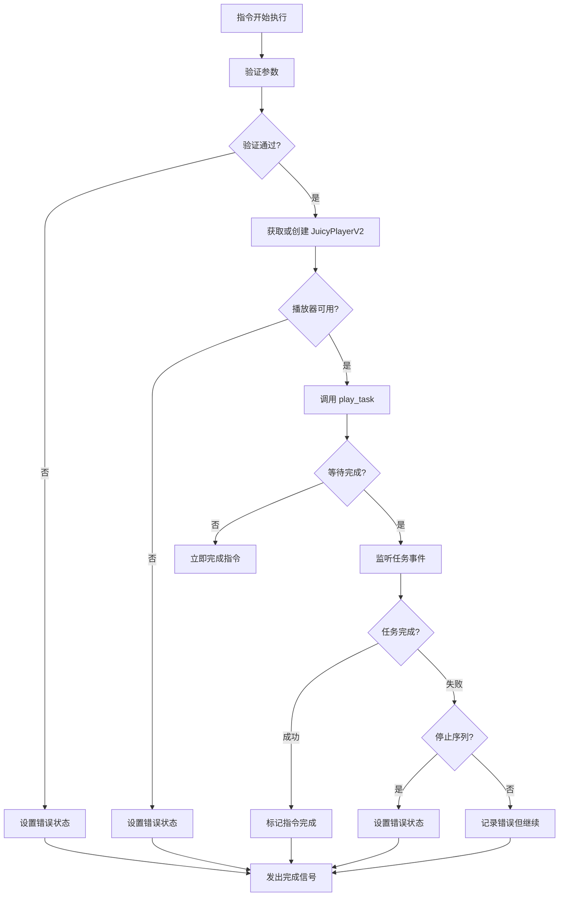

# PlayJuicyEffectTask 指令设计文档

## 概述

`PlayJuicyEffectTask` 是一个 Fuse 指令，用于在指令序列中播放 Juicy 效果任务。该指令通过使用预配置的 `JuicyTaskConfig` 资源，调用 `JuicyPlayerV2.play_task()` 方法来执行效果，并等待任务完成。

## 设计目标

1. **简化集成**：提供 Fuse 指令系统与 Juicy 效果系统的无缝集成
2. **资源驱动**：使用预配置的 `JuicyTaskConfig` 资源，确保配置的一致性和可重用性
3. **异步支持**：支持异步执行和任务等待，不阻塞指令序列的执行
4. **错误处理**：提供完善的错误处理和验证机制
5. **状态管理**：提供清晰的执行状态跟踪和调试信息

## 核心功能

### 1. 参数配置

指令支持以下核心参数：

```gdscript
## JuicyTaskConfig 资源（必需）
@export var task_config: JuicyTaskConfig = null:
    set(value):
        task_config = value
        _update_resource_name()

## JuicyPlayerV2 Player ID（可选，用于通过ID查找播放器）
@export var player_id: String = "":
    set(value):
        player_id = value
        _update_resource_name()

## 是否等待任务完成（可选，默认为 true）
@export var wait_for_completion: bool = true:
    set(value):
        wait_for_completion = value
        _update_resource_name()

## 任务超时时间（可选，0 表示无超时）
@export_range(0.0, 300.0, 0.1) var timeout_seconds: float = 0.0:
    set(value):
        timeout_seconds = value
        _update_resource_name()

## 是否在失败时停止指令序列（可选，默认为 false）
@export var stop_on_failure: bool = false:
    set(value):
        stop_on_failure = value
        _update_resource_name()
```

### 2. 执行流程



### 3. 状态管理

指令继承 `BaseInstruction` 的状态管理，并添加以下特定状态：

```gdscript
## Juicy 任务特定状态
enum JuicyTaskState {
    INITIALIZING,    ## 初始化中
    PLAYING,         ## 播放中
    WAITING,         ## 等待完成
    COMPLETED,       ## 任务完成
    FAILED,          ## 任务失败
    TIMEOUT          ## 任务超时
}

var _juicy_task_state: JuicyTaskState = JuicyTaskState.INITIALIZING
var _task_id: String = ""                    ## 任务ID
var _player_instance: JuicyPlayerV2 = null   ## 播放器实例
var _timeout_timer: SceneTreeTimer = null     ## 超时计时器
```

## 错误处理和验证机制

### 1. 参数验证

```gdscript
func validate() -> Array[String]:
    var errors = super.validate()
    
    # 验证任务配置
    if not task_config:
        errors.append("任务配置不能为空")
    elif not task_config is JuicyTaskConfig:
        errors.append("任务配置必须是 JuicyTaskConfig 类型")
    else:
        # 验证任务配置的有效性
        var config_validation = task_config.validate_config()
        if not config_validation.valid:
            errors.append_array(config_validation.issues)
    
    # 验证超时时间
    if timeout_seconds < 0:
        errors.append("超时时间不能为负数")
    
    return errors
```

### 2. 运行时错误处理

```gdscript
## 错误类型枚举
enum ErrorType {
    INVALID_CONFIG,      ## 无效配置
    PLAYER_NOT_FOUND,    ## 播放器未找到
    TASK_EXECUTION_FAILED, ## 任务执行失败
    TIMEOUT,            ## 超时
    UNEXPECTED_ERROR     ## 意外错误
}

## 错误处理方法
func _handle_error(error_type: ErrorType, message: String, context: Dictionary = {}):
    var error_context = context.duplicate()
    error_context["error_type"] = error_type
    error_context["task_id"] = _task_id
    error_context["instruction_name"] = metadata.name
    
    set_error(message, FuseError.ErrorType.EXECUTION_ERROR, error_context)
    
    # 根据配置决定是否停止指令序列
    if stop_on_failure:
        _log_error("任务失败，停止指令序列: %s" % message)
    else:
        _log_warning("任务失败，但继续执行指令序列: %s" % message)
```

## 元数据和分类信息

```gdscript
static func _get_instruction_metadata() -> InstructionMetadata:
    metadata = InstructionMetadata.new()
    metadata.name = "播放 Juicy 效果任务"
    metadata.category = "Juicy 效果"
    metadata.description = "使用预配置的 JuicyTaskConfig 播放 Juicy 效果任务，支持异步执行和任务等待"
    metadata.keywords = ["juicy", "效果", "任务", "播放", "动画", "特效"]
    metadata.icon = preload("res://addons/juicy/icons/juicy_effect.svg")
    metadata.version = "1.0.0"
    metadata.author = "Juicy Team"
    metadata.dependencies = ["JuicyPlayerV2", "JuicyTaskConfig"]
    return metadata
```

## 与 JuicyPlayerV2.play_task() 的集成方案

### 1. 播放器获取策略

```gdscript
## 获取 JuicyPlayerV2 实例的策略
func _get_juicy_player() -> JuicyPlayerV2:
    var player: JuicyPlayerV2 = null
    
    # 策略1：使用指定的节点路径
    if not player_node_path.is_empty():
        player = get_node_or_null(player_node_path)
        if player and player is JuicyPlayerV2:
            _log_debug("通过节点路径找到 JuicyPlayerV2: %s" % player.name)
            return player
    
    # 策略2：从执行上下文获取
    if _execution_context and _execution_context.has_method("get_variable"):
        var context_player = _execution_context.get_variable("juicy_player")
        if context_player and context_player is JuicyPlayerV2:
            _log_debug("从执行上下文获取 JuicyPlayerV2: %s" % context_player.name)
            return context_player
    
    # 策略3：在场景树中查找第一个 JuicyPlayerV2
    var scene_tree = get_tree()
    if scene_tree:
        var root = scene_tree.current_scene
        player = _find_first_juicy_player(root)
        if player:
            _log_debug("在场景树中找到 JuicyPlayerV2: %s" % player.name)
            return player
    
    _log_error("无法找到 JuicyPlayerV2 实例")
    return null

## 递归查找第一个 JuicyPlayerV2
func _find_first_juicy_player(node: Node) -> JuicyPlayerV2:
    if node is JuicyPlayerV2:
        return node
    
    for child in node.get_children():
        var result = _find_first_juicy_player(child)
        if result:
            return result
    
    return null
```

### 2. 任务执行集成

```gdscript
## 执行 Juicy 任务
func _execute_juicy_task(player: JuicyPlayerV2) -> String:
    # 确保播放器已初始化
    if not player.is_inside_tree():
        _log_error("JuicyPlayerV2 不在场景树中")
        return ""
    
    # 调用 play_task 方法
    var task_id = player.play_task(task_config)
    
    if task_id.is_empty():
        _handle_error(ErrorType.TASK_EXECUTION_FAILED, "播放任务失败，返回空的任务ID")
        return ""
    
    _task_id = task_id
    _juicy_task_state = JuicyTaskState.PLAYING
    
    _log_info("成功启动 Juicy 任务，任务ID: %s" % task_id)
    
    # 连接信号以监听任务状态
    _connect_task_signals(player)
    
    return task_id

## 连接任务信号
func _connect_task_signals(player: JuicyPlayerV2):
    if not player:
        return
    
    # 连接任务相关信号
    if not player.task_started.is_connected(_on_task_started):
        player.task_started.connect(_on_task_started)
    
    if not player.task_completed.is_connected(_on_task_completed):
        player.task_completed.connect(_on_task_completed)
    
    if not player.task_failed.is_connected(_on_task_failed):
        player.task_failed.connect(_on_task_failed)
    
    if not player.task_cancelled.is_connected(_on_task_cancelled):
        player.task_cancelled.connect(_on_task_cancelled)
```

## 异步执行和任务等待机制

### 1. 异步执行架构

```gdscript
## 执行指令（异步版本）
func execute(context: ExecutionContext):
    _start_execution(context)
    _execution_context = context
    
    # 验证参数
    var errors = validate()
    if not errors.is_empty():
        _handle_error(ErrorType.INVALID_CONFIG, "参数验证失败: " + ", ".join(errors))
        _on_execution_completed()
        return
    
    # 获取播放器
    _juicy_task_state = JuicyTaskState.INITIALIZING
    var player = _get_juicy_player()
    if not player:
        _handle_error(ErrorType.PLAYER_NOT_FOUND, "无法找到 JuicyPlayerV2 实例")
        _on_execution_completed()
        return
    
    # 执行任务
    var task_id = _execute_juicy_task(player)
    if task_id.is_empty():
        _on_execution_completed()
        return
    
    # 设置超时计时器
    if timeout_seconds > 0:
        _setup_timeout_timer()
    
    # 根据配置决定是否等待完成
    if not wait_for_completion:
        _log_info("不等待任务完成，指令立即完成")
        _juicy_task_state = JuicyTaskState.COMPLETED
        _on_execution_completed()
        return
    
    _juicy_task_state = JuicyTaskState.WAITING
    _log_info("等待任务完成，任务ID: %s" % task_id)
```

### 2. 任务事件处理

```gdscript
## 任务开始事件
func _on_task_started(task_id: String, effect_type: String):
    if task_id != _task_id:
        return  # 不是我们的任务
    
    _juicy_task_state = JuicyTaskState.PLAYING
    _log_info("任务开始执行，任务ID: %s，效果类型: %s" % [task_id, effect_type])
    
    if _execution_context:
        _execution_context.print_message("Juicy 任务开始: %s" % effect_type)

## 任务完成事件
func _on_task_completed(task_id: String, effect_type: String):
    if task_id != _task_id:
        return  # 不是我们的任务
    
    _cleanup_timeout_timer()
    _juicy_task_state = JuicyTaskState.COMPLETED
    
    _log_info("任务执行完成，任务ID: %s，效果类型: %s" % [task_id, effect_type])
    
    if _execution_context:
        _execution_context.print_message("Juicy 任务完成: %s" % effect_type)
    
    _disconnect_task_signals()
    _on_execution_completed()

## 任务失败事件
func _on_task_failed(task_id: String, effect_type: String, error: String):
    if task_id != _task_id:
        return  # 不是我们的任务
    
    _cleanup_timeout_timer()
    _juicy_task_state = JuicyTaskState.FAILED
    
    var error_message = "任务执行失败: %s (任务ID: %s, 效果类型: %s)" % [error, task_id, effect_type]
    _handle_error(ErrorType.TASK_EXECUTION_FAILED, error_message, {
        "task_id": task_id,
        "effect_type": effect_type,
        "original_error": error
    })
    
    if _execution_context:
        _execution_context.print_error("Juicy 任务失败: %s" % error)
    
    _disconnect_task_signals()
    _on_execution_completed()

## 任务取消事件
func _on_task_cancelled(task_id: String, effect_type: String):
    if task_id != _task_id:
        return  # 不是我们的任务
    
    _cleanup_timeout_timer()
    _juicy_task_state = JuicyTaskState.FAILED
    
    var error_message = "任务被取消 (任务ID: %s, 效果类型: %s)" % [task_id, effect_type]
    _handle_error(ErrorType.TASK_EXECUTION_FAILED, error_message, {
        "task_id": task_id,
        "effect_type": effect_type
    })
    
    if _execution_context:
        _execution_context.print_warning("Juicy 任务被取消: %s" % effect_type)
    
    _disconnect_task_signals()
    _on_execution_completed()
```

### 3. 超时处理

```gdscript
## 设置超时计时器
func _setup_timeout_timer():
    if timeout_seconds <= 0:
        return
    
    var scene_tree = get_tree()
    if not scene_tree:
        return
    
    _cleanup_timeout_timer()
    _timeout_timer = scene_tree.create_timer(timeout_seconds)
    _timeout_timer.timeout.connect(_on_timeout)
    
    _log_debug("设置超时计时器: %.1f 秒" % timeout_seconds)

## 超时处理
func _on_timeout():
    _juicy_task_state = JuicyTaskState.TIMEOUT
    
    var error_message = "任务执行超时 (%.1f 秒)，任务ID: %s" % [timeout_seconds, _task_id]
    _handle_error(ErrorType.TIMEOUT, error_message, {
        "task_id": _task_id,
        "timeout_duration": timeout_seconds
    })
    
    if _execution_context:
        _execution_context.print_error("Juicy 任务超时: %s" % error_message)
    
    # 尝试取消任务
    if _player_instance and not _task_id.is_empty():
        _player_instance.stop()
    
    _disconnect_task_signals()
    _on_execution_completed()

## 清理超时计时器
func _cleanup_timeout_timer():
    if _timeout_timer:
        if _timeout_timer.timeout.is_connected(_on_timeout):
            _timeout_timer.timeout.disconnect(_on_timeout)
        _timeout_timer = null
```

## 使用示例

### 1. 基本使用

```gdscript
# 创建指令
var instruction = PlayJuicyEffectTask.new()

# 设置任务配置
instruction.task_config = load("res://configs/shake_effect.tres")

# 执行指令
var context = ExecutionContext.new()
instruction.execute(context)
```

### 2. 在指令序列中使用

```gdscript
# 创建指令序列
var instructions = [
    CreateVariable.new(),  # 创建变量
    PlayJuicyEffectTask.new(),  # 播放效果
    Print.new()  # 打印消息
]

# 配置 Juicy 效果指令
var juicy_instruction = instructions[1] as PlayJuicyEffectTask
juicy_instruction.task_config = load("res://configs/explosion_effect.tres")
juicy_instruction.wait_for_completion = true
juicy_instruction.timeout_seconds = 5.0

# 执行序列
for instruction in instructions:
    instruction.execute(context)
    await instruction.finished
```

### 3. 与变量系统集成

```gdscript
# 创建动态任务配置选择
var instruction = PlayJuicyEffectTask.new()

# 通过变量选择效果配置
var effect_name = context.get_variable("effect_type", "shake")
var config_path = "res://configs/%s_effect.tres" % effect_name
instruction.task_config = load(config_path)

# 执行指令
instruction.execute(context)
```

## 最佳实践

### 1. 资源管理

- **预配置资源**：建议在项目启动时预加载常用的 `JuicyTaskConfig` 资源
- **资源验证**：在设置 `task_config` 时进行有效性检查
- **错误处理**：为资源加载失败提供备用方案

### 2. 性能优化

- **播放器复用**：尽量复用同一个 `JuicyPlayerV2` 实例
- **信号管理**：及时断开不需要的信号连接，避免内存泄漏
- **超时设置**：根据效果复杂度合理设置超时时间

### 3. 调试和监控

- **日志级别**：在开发阶段启用详细日志，生产环境减少日志输出
- **状态跟踪**：利用指令的状态信息进行调试
- **错误报告**：提供详细的错误上下文信息

### 4. 扩展性考虑

- **自定义播放器**：支持自定义 `JuicyPlayerV2` 子类
- **插件架构**：为未来功能扩展预留接口
- **配置模板**：提供常用的配置模板和预设

## 实现注意事项

### 1. 线程安全

- 指令执行在主线程中进行
- 信号连接和断开需要确保线程安全
- 避免在信号回调中进行耗时操作

### 2. 内存管理

- 及时清理信号连接
- 正确释放计时器资源
- 避免循环引用

### 3. 兼容性

- 保持与现有 Fuse 指令系统的兼容性
- 支持不同版本的 Juicy 系统
- 提供向后兼容的API

## 总结

`PlayJuicyEffectTask` 指令提供了 Fuse 指令系统与 Juicy 效果系统的完整集成方案。通过使用预配置的 `JuicyTaskConfig` 资源，该指令能够：

1. **简化使用**：通过单一指令即可播放复杂的 Juicy 效果
2. **保证一致性**：使用预配置资源确保效果的一致性
3. **支持异步**：完整的异步执行和等待机制
4. **错误处理**：完善的错误处理和验证机制
5. **易于调试**：详细的状态跟踪和日志信息

该设计遵循了 Fuse 指令系统的设计原则，同时充分利用了 Juicy 系统的功能特性，为用户提供了一个强大而易用的效果播放解决方案。

---

**文档版本：1.0**  
**创建日期：2025年11月13日**  
**作者：Juicy Team**