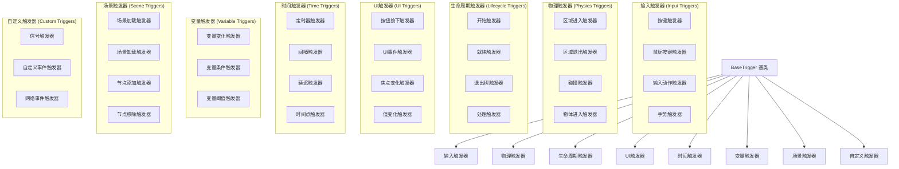

# 事件系统详细设计

> **术语更新**: 本文档中的 "Trigger" (触发器) 已更名为 "Event" (事件)
> **实际实现**: `addons/fuse/core/trigger.gd` (保留旧文件名以保持向后兼容)
> **实现状态**: ✅ 已实现

## 目录
1. [触发器系统概述](#1-触发器系统概述)
2. [核心触发器类型](#2-核心触发器类型)
3. [事件处理机制](#3-事件处理机制)
4. [触发器扩展框架](#4-触发器扩展框架)
5. [内置触发器实现](#5-内置触发器实现)
6. [触发器调试和优化](#6-触发器调试和优化)

---

## 1. 事件系统概述

### 1.1 设计理念

事件系统是可视化编程系统的事件入口点，负责监听和响应各种游戏事件。设计理念包括：

- **事件驱动**：基于Godot的Signal系统实现高效的事件监听
- **类型安全**：利用GDScript的类型系统确保事件处理的安全
- **可组合性**：支持多个触发器的组合和级联
- **高性能**：优化事件处理流程，避免不必要的性能开销
- **易于扩展**：提供简单的接口支持自定义触发器

### 1.2 触发器分类体系



---

## 2. 核心触发器类型

### 2.1 基础触发器类

```gdscript
@tool
class_name BaseTrigger extends Node
@icon("res://addons/visual_programming/icons/trigger.svg")

## 触发器配置
@export_group("Trigger Configuration")
@export var enabled: bool = true
@export var debug_mode: bool = false
@export var trigger_once: bool = false
@export var cooldown_time: float = 0.0

## 动作配置
@export_group("Actions")
@export var action_runner: ActionRunner
@export var conditions: Array[BaseCondition] = []

## 变量配置
@export_group("Variables")
@export var local_variables: VariableContainer = null

## 触发器状态
var is_triggered: bool = false
var last_trigger_time: float = 0.0
var trigger_count: int = 0
var execution_context: ExecutionContext = null

## 信号
signal triggered(context: ExecutionContext)
signal conditions_failed(context: ExecutionContext)
signal action_completed(context: ExecutionContext)

func _ready():
    _setup_trigger()
    _initialize_local_variables()

## 设置触发器
func _setup_trigger():
    # 子类实现具体的设置逻辑
    pass

## 初始化局部变量
func _initialize_local_variables():
    if not local_variables:
        local_variables = VariableManager.create_container()

## 触发动作执行
func trigger_actions(target: Node = null, event_data: Dictionary = {}):
    if not enabled:
        _log_debug("Trigger is disabled, ignoring trigger")
        return
    
    # 检查冷却时间
    if cooldown_time > 0.0:
        var current_time = Time.get_ticks_msec() / 1000.0
        if current_time - last_trigger_time < cooldown_time:
            _log_debug("Trigger is in cooldown, ignoring trigger")
            return
        last_trigger_time = current_time
    
    # 检查单次触发
    if trigger_once and is_triggered:
        _log_debug("Trigger already triggered once, ignoring trigger")
        return
    
    # 创建执行上下文
    execution_context = _create_execution_context(target, event_data)
    
    # 检查条件
    if not _check_conditions(execution_context):
        conditions_failed.emit(execution_context)
        return
    
    # 标记为已触发
    is_triggered = true
    trigger_count += 1
    
    _log_debug("Trigger #%d activated" % trigger_count)
    triggered.emit(execution_context)
    
    # 执行动作
    if action_runner:
        action_runner.run(execution_context)
        await action_runner.action_completed
        action_completed.emit(execution_context)
    else:
        _log_warning("No action runner assigned to trigger")

## 创建执行上下文
func _create_execution_context(target: Node, event_data: Dictionary) -> ExecutionContext:
    var context = ExecutionContext.new(self, target)
    
    # 添加事件数据到局部变量
    for key in event_data.keys():
        context.local_variables[key] = event_data[key]
    
    return context

## 检查条件
func _check_conditions(context: ExecutionContext) -> bool:
    for condition in conditions:
        if condition and not condition.check(context):
            _log_debug("Condition failed: %s" % condition.get_description())
            return false
    return true

## 重置触发器状态
func reset():
    is_triggered = false
    trigger_count = 0
    last_trigger_time = 0.0
    _log_debug("Trigger reset")

## 启用/禁用触发器
func set_enabled(value: bool):
    enabled = value
    _log_debug("Trigger %s" % ("enabled" if value else "disabled"))

## 调试日志
func _log_debug(message: String):
    if debug_mode:
        print("[DEBUG][%s] %s" % [name, message])

func _log_warning(message: String):
    if debug_mode:
        push_warning("[WARNING][%s] %s" % [name, message])

func _log_error(message: String):
    if debug_mode:
        push_error("[ERROR][%s] %s" % [name, message])

## 获取触发器描述
func get_description() -> String:
    return "Base Trigger"

## 获取触发器状态信息
func get_status_info() -> Dictionary:
    return {
        "enabled": enabled,
        "is_triggered": is_triggered,
        "trigger_count": trigger_count,
        "last_trigger_time": last_trigger_time,
        "cooldown_remaining": max(0.0, cooldown_time - (Time.get_ticks_msec() / 1000.0 - last_trigger_time))
    }
```

### 2.2 输入触发器

#### 2.2.1 按键触发器

```gdscript
@tool
class_name TriggerOnKeyPressed extends BaseTrigger
@icon("res://addons/visual_programming/icons/key_pressed.svg")

@export_group("Key Settings")
@export var key_code: Key = KEY_SPACE
@export var require_modifier: bool = false
@export var modifier_key: Key = KEY_CTRL
@export_group("Trigger Settings")
@export var trigger_on_press: bool = true
@export var trigger_on_release: bool = false
@export var trigger_repeat: bool = false

var is_key_pressed: bool = false

func _setup_trigger():
    super._setup_trigger()
    set_process_input(true)

func _input(event: InputEvent):
    if not enabled:
        return
    
    if event is InputEventKey:
        var key_event = event as InputEventKey
        _handle_key_event(key_event)

func _handle_key_event(key_event: InputEventKey):
    # 检查修饰键
    if require_modifier:
        var modifier_pressed = Input.is_key_pressed(modifier_key)
        if not modifier_pressed:
            return
    
    # 检查按键码
    if key_event.keycode != key_code:
        return
    
    # 检查触发条件
    var should_trigger = false
    
    if trigger_on_press and key_event.pressed and not is_key_pressed:
        should_trigger = true
        is_key_pressed = true
    elif trigger_on_release and not key_event.pressed and is_key_pressed:
        should_trigger = true
        is_key_pressed = false
    elif trigger_repeat and key_event.pressed and key_event.echo:
        should_trigger = true
    
    if should_trigger:
        var event_data = {
            "key_code": key_code,
            "pressed": key_event.pressed,
            "modifier_pressed": require_modifier and Input.is_key_pressed(modifier_key),
            "echo": key_event.echo
        }
        trigger_actions(null, event_data)

func get_description() -> String:
    var key_name = OS.get_keycode_string(key_code)
    var modifier_name = OS.get_keycode_string(modifier_key) if require_modifier else ""
    var trigger_desc = []
    
    if trigger_on_press:
        trigger_desc.append("press")
    if trigger_on_release:
        trigger_desc.append("release")
    if trigger_repeat:
        trigger_desc.append("repeat")
    
    return "Trigger on %s %s" % [
        ("%s+" % modifier_name if modifier_name else "") + key_name,
        trigger_desc.join("/")
    ]
```

#### 2.2.2 输入动作触发器

```gdscript
@tool
class_name TriggerOnInputAction extends BaseTrigger
@icon("res://addons/visual_programming/icons/input_action.svg")

@export_group("Action Settings")
@export var action_name: String = ""
@export_group("Trigger Settings")
@export var trigger_on_start: bool = true
@export var trigger_on_end: bool = false
@export var require_strength: bool = false
@export var min_strength: float = 0.5

var is_action_active: bool = false

func _setup_trigger():
    super._setup_trigger()
    set_process_input(true)

func _input(event: InputEvent):
    if not enabled or action_name.is_empty():
        return
    
    if not InputMap.has_action(action_name):
        _log_warning("Input action '%s' not found in InputMap" % action_name)
        return
    
    var strength = Input.get_action_strength(action_name)
    var was_active = is_action_active
    is_action_active = strength > 0.0
    
    # 检查强度要求
    if require_strength and strength < min_strength:
        return
    
    # 检查触发条件
    var should_trigger = false
    
    if trigger_on_start and is_action_active and not was_active:
        should_trigger = true
    elif trigger_on_end and not is_action_active and was_active:
        should_trigger = true
    
    if should_trigger:
        var event_data = {
            "action_name": action_name,
            "strength": strength,
            "started": is_action_active and not was_active,
            "ended": not is_action_active and was_active
        }
        trigger_actions(null, event_data)

func get_description() -> String:
    var trigger_desc = []
    
    if trigger_on_start:
        trigger_desc.append("start")
    if trigger_on_end:
        trigger_desc.append("end")
    
    var strength_desc = " (strength >= %.1f)" % min_strength if require_strength else ""
    
    return "Trigger on input action '%s' %s%s" % [
        action_name,
        trigger_desc.join("/"),
        strength_desc
    ]
```

### 2.3 物理触发器

#### 2.3.1 区域进入触发器

```gdscript
@tool
class_name TriggerOnAreaEnter extends Area3D
@icon("res://addons/visual_programming/icons/area_enter.svg")

## 继承BaseTrigger的属性
@export_group("Trigger Configuration", "trigger_")
@export var trigger_enabled: bool = true setget set_trigger_enabled
@export var trigger_debug_mode: bool = false setget set_trigger_debug_mode
@export var trigger_once: bool = false setget set_trigger_once
@export var cooldown_time: float = 0.0 setget set_cooldown_time

@export_group("Actions", "action_")
@export var action_runner_on_enter: ActionRunner setget set_action_runner_on_enter
@export var action_runner_on_exit: ActionRunner setget set_action_runner_on_exit
@export var conditions_on_enter: Array[BaseCondition] = [] setget set_conditions_on_enter
@export var conditions_on_exit: Array[BaseCondition] = [] setget set_conditions_on_exit

@export_group("Variables", "var_")
@export var local_variables: VariableContainer = null setget set_local_variables

@export_group("Filter Settings")
@export var target_group: String = ""
@export var target_layers: int = 1
@export var require_collision_layer: bool = false
@export var collision_layer_mask: int = 1

## 内部状态
var base_trigger: BaseTrigger
var entered_bodies: Array[Node] = []
var last_enter_time: float = 0.0
var last_exit_time: float = 0.0

## 信号
signal area_entered_triggered(body: Node)
signal area_exited_triggered(body: Node)

func _ready():
    super._ready()
    _setup_base_trigger()
    _setup_area_monitoring()
    body_entered.connect(_on_body_entered)
    body_exited.connect(_on_body_exited)

func _setup_base_trigger():
    base_trigger = BaseTrigger.new()
    base_trigger.name = "BaseTrigger"
    add_child(base_trigger)
    base_trigger.owner = self

func _setup_area_monitoring():
    # 设置碰撞层和掩码
    if require_collision_layer:
        collision_layer = collision_layer_mask
        collision_mask = collision_layer_mask

func _on_body_entered(body: Node):
    if not _should_process_body(body):
        return
    
    # 检查是否已经在体内
    if body in entered_bodies:
        return
    
    entered_bodies.append(body)
    last_enter_time = Time.get_ticks_msec() / 1000.0
    
    var event_data = {
        "body": body,
        "body_name": body.name,
        "body_groups": body.get_groups(),
        "enter_time": last_enter_time
    }
    
    _log_debug("Body entered: %s" % body.name)
    area_entered_triggered.emit(body)
    
    # 执行进入动作
    if action_runner_on_enter:
        await _execute_action_runner(action_runner_on_enter, conditions_on_enter, body, event_data)

func _on_body_exited(body: Node):
    if not _should_process_body(body):
        return
    
    # 检查是否在体内
    if body not in entered_bodies:
        return
    
    entered_bodies.erase(body)
    last_exit_time = Time.get_ticks_msec() / 1000.0
    
    var event_data = {
        "body": body,
        "body_name": body.name,
        "body_groups": body.get_groups(),
        "exit_time": last_exit_time,
        "stay_duration": last_exit_time - last_enter_time
    }
    
    _log_debug("Body exited: %s" % body.name)
    area_exited_triggered.emit(body)
    
    # 执行退出动作
    if action_runner_on_exit:
        await _execute_action_runner(action_runner_on_exit, conditions_on_exit, body, event_data)

func _should_process_body(body: Node) -> bool:
    if not trigger_enabled:
        return false
    
    # 检查组过滤
    if not target_group.is_empty() and not body.is_in_group(target_group):
        return false
    
    # 检查碰撞层
    if require_collision_layer:
        var collision_object = body as CollisionObject3D
        if collision_object and (collision_object.collision_layer & collision_layer_mask) == 0:
            return false
    
    return true

func _execute_action_runner(
    action_runner: ActionRunner,
    conditions: Array[BaseCondition],
    target: Node,
    event_data: Dictionary
):
    # 配置基础触发器
    base_trigger.action_runner = action_runner
    base_trigger.conditions = conditions
    base_trigger.local_variables = local_variables
    base_trigger.enabled = trigger_enabled
    base_trigger.debug_mode = trigger_debug_mode
    base_trigger.trigger_once = trigger_once
    base_trigger.cooldown_time = cooldown_time
    
    # 触发动作
    base_trigger.trigger_actions(target, event_data)

## 属性设置器
func set_trigger_enabled(value: bool):
    trigger_enabled = value
    if base_trigger:
        base_trigger.enabled = value

func set_trigger_debug_mode(value: bool):
    trigger_debug_mode = value
    if base_trigger:
        base_trigger.debug_mode = value

func set_trigger_once(value: bool):
    trigger_once = value
    if base_trigger:
        base_trigger.trigger_once = value

func set_cooldown_time(value: float):
    cooldown_time = value
    if base_trigger:
        base_trigger.cooldown_time = value

func set_action_runner_on_enter(value: ActionRunner):
    action_runner_on_enter = value

func set_action_runner_on_exit(value: ActionRunner):
    action_runner_on_exit = value

func set_conditions_on_enter(value: Array[BaseCondition]):
    conditions_on_enter = value

func set_conditions_on_exit(value: Array[BaseCondition]):
    conditions_on_exit = value

func set_local_variables(value: VariableContainer):
    local_variables = value
    if base_trigger:
        base_trigger.local_variables = value

func get_description() -> String:
    var filter_desc = []
    
    if not target_group.is_empty():
        filter_desc.append("group: %s" % target_group)
    
    if require_collision_layer:
        filter_desc.append("layer: %d" % collision_layer_mask)
    
    var filter_str = " (%s)" % filter_desc.join(", ") if not filter_desc.is_empty() else ""
    
    return "Area Enter Trigger%s" % filter_str

func _log_debug(message: String):
    if trigger_debug_mode:
        print("[DEBUG][%s] %s" % [name, message])
```

### 2.4 生命周期触发器

#### 2.4.1 开始触发器

```gdscript
@tool
class_name TriggerOnStart extends BaseTrigger
@icon("res://addons/visual_programming/icons/start.svg")

@export_group("Timing Settings")
@export var delay_seconds: float = 0.0
@export var trigger_on_ready: bool = false

func _ready():
    super._ready()
    
    if trigger_on_ready:
        _trigger_with_delay()
    else:
        call_deferred("_trigger_with_delay")

func _trigger_with_delay():
    if not enabled:
        return
    
    if delay_seconds > 0.0:
        await get_tree().create_timer(delay_seconds).timeout
    
    var event_data = {
        "trigger_time": Time.get_ticks_msec() / 1000.0,
        "delayed": delay_seconds > 0.0,
        "delay_amount": delay_seconds
    }
    
    trigger_actions(null, event_data)

func get_description() -> String:
    var timing_desc = "Ready" if trigger_on_ready else "Start"
    var delay_desc = " (delay: %.1fs)" % delay_seconds if delay_seconds > 0.0 else ""
    return "Trigger on %s%s" % [timing_desc, delay_desc]
```

### 2.5 时间触发器

#### 2.5.1 定时器触发器

```gdscript
@tool
class_name TriggerOnTimer extends BaseTrigger
@icon("res://addons/visual_programming/icons/timer.svg")

@export_group("Timer Settings")
@export var wait_time: float = 1.0
@export var autostart: bool = true
@export var one_shot: bool = false
@export var use_unscaled_time: bool = false

@export_group("Advanced Settings")
@export var random_variation: float = 0.0
@export var trigger_count_limit: int = -1  # -1 = unlimited

var timer: Timer = null
var current_trigger_count: int = 0

func _ready():
    super._setup_trigger()
    _setup_timer()

func _setup_timer():
    timer = Timer.new()
    timer.wait_time = wait_time
    timer.one_shot = one_shot
    timer.autostart = autostart
    timer.use_unscaled_time = use_unscaled_time
    
    timer.timeout.connect(_on_timer_timeout)
    add_child(timer)
    
    if autostart:
        _start_timer()

func _start_timer():
    if not timer:
        return
    
    var actual_wait_time = wait_time
    
    # 添加随机变化
    if random_variation > 0.0:
        actual_wait_time += randf_range(-random_variation, random_variation)
        actual_wait_time = max(0.01, actual_wait_time)  # 确保最小时间
    
    timer.wait_time = actual_wait_time
    timer.start()
    
    _log_debug("Timer started with wait time: %.3fs" % actual_wait_time)

func _on_timer_timeout():
    if not enabled:
        return
    
    # 检查触发次数限制
    if trigger_count_limit > 0 and current_trigger_count >= trigger_count_limit:
        _log_debug("Trigger count limit reached, stopping timer")
        timer.stop()
        return
    
    current_trigger_count += 1
    
    var event_data = {
        "trigger_count": current_trigger_count,
        "wait_time": timer.wait_time,
        "is_one_shot": one_shot,
        "remaining_triggers": max(0, trigger_count_limit - current_trigger_count) if trigger_count_limit > 0 else -1
    }
    
    trigger_actions(null, event_data)
    
    # 如果不是单次触发，重新启动定时器
    if not one_shot:
        _start_timer()

func start_timer():
    if timer:
        _start_timer()

func stop_timer():
    if timer:
        timer.stop()

func reset_timer():
    current_trigger_count = 0
    if timer:
        timer.stop()
        if autostart:
            _start_timer()

func get_description() -> String:
    var mode_desc = "one-shot" if one_shot else "repeating"
    var limit_desc = " (limit: %d)" % trigger_count_limit if trigger_count_limit > 0 else ""
    var variation_desc = " (variation: ±%.1fs)" % random_variation if random_variation > 0.0 else ""
    
    return "Timer Trigger (%.1fs, %s)%s%s" % [
        wait_time,
        mode_desc,
        limit_desc,
        variation_desc
    ]
```

### 2.6 自定义触发器

#### 2.6.1 信号触发器

```gdscript
@tool
class_name TriggerOnSignal extends BaseTrigger
@icon("res://addons/visual_programming/icons/signal.svg")

@export_group("Signal Settings")
@export var signal_source: NodePath
@export var signal_name: String = ""
@export_group("Data Settings")
@export var capture_arguments: bool = true
@export var max_arguments: int = 5
@export_group("Filter Settings")
@export var argument_filter: String = ""  # 简单的表达式过滤

var source_node: Node = null
var is_connected: bool = false

func _ready():
    super._setup_trigger()
    _connect_to_signal()

func _exit_tree():
    _disconnect_from_signal()

func _connect_to_signal():
    if signal_name.is_empty():
        _log_warning("Signal name is empty")
        return
    
    source_node = get_node_or_null(signal_source)
    if not source_node:
        _log_warning("Signal source node not found: %s" % signal_source)
        return
    
    if not source_node.has_signal(signal_name):
        _log_warning("Signal '%s' not found on node: %s" % [signal_name, source_node.name])
        return
    
    # 动态连接到信号
    if source_node.connect(signal_name, _on_signal_triggered) == OK:
        is_connected = true
        _log_debug("Connected to signal: %s.%s" % [source_node.name, signal_name])
    else:
        _log_error("Failed to connect to signal: %s.%s" % [source_node.name, signal_name])

func _disconnect_from_signal():
    if is_connected and source_node and source_node.has_signal(signal_name):
        source_node.disconnect(signal_name, _on_signal_triggered)
        is_connected = false
        _log_debug("Disconnected from signal: %s.%s" % [source_node.name, signal_name])

func _on_signal_triggered(...):
    if not enabled:
        return
    
    var args = Array([...])
    
    # 限制参数数量
    if args.size() > max_arguments:
        args = args.slice(0, max_arguments)
    
    # 应用参数过滤器
    if not argument_filter.is_empty():
        if not _apply_argument_filter(args):
            _log_debug("Signal arguments filtered out")
            return
    
    var event_data = {
        "signal_name": signal_name,
        "source_node": source_node,
        "argument_count": args.size(),
        "arguments": args if capture_arguments else []
    }
    
    # 添加参数到事件数据
    if capture_arguments:
        for i in range(args.size()):
            event_data["arg_%d" % i] = args[i]
    
    trigger_actions(source_node, event_data)

func _apply_argument_filter(args: Array) -> bool:
    # 简单的表达式过滤器实现
    # 在实际项目中可以使用更强大的表达式解析库
    var expression = argument_filter
    
    # 替换参数占位符
    for i in range(args.size()):
        expression = expression.replace("$%d" % i, str(args[i]))
    
    # 简单的布尔表达式求值
    var expr = Expression.new()
    var parse_result = expr.parse(expression)
    
    if parse_result != OK:
        _log_error("Failed to parse argument filter: %s" % argument_filter)
        return true  # 默认通过
    
    var result = expr.execute()
    if result is String:
        _log_error("Filter execution error: %s" % result)
        return true
    
    return bool(result)

func get_description() -> String:
    var source_name = "Unknown"
    if source_node:
        source_name = source_node.name
    elif not signal_source.is_empty():
        source_name = signal_source.get_name(0)
    
    var filter_desc = " (filter: %s)" % argument_filter if not argument_filter.is_empty() else ""
    
    return "Signal Trigger: %s.%s%s" % [source_name, signal_name, filter_desc]

func validate() -> Array[String]:
    var errors: Array[String] = []
    
    if signal_name.is_empty():
        errors.append("Signal name cannot be empty")
    
    if signal_source.is_empty():
        errors.append("Signal source cannot be empty")
    
    if max_arguments < 1:
        errors.append("Max arguments must be at least 1")
    
    return errors
```

---

## 3. 事件处理机制

### 3.1 事件队列系统

```gdscript
@tool
class_name EventQueue extends Node

## 事件类型
enum EventType {
    INPUT,
    PHYSICS,
    LIFECYCLE,
    UI,
    TIME,
    VARIABLE,
    SCENE,
    CUSTOM
}

## 事件数据
class EventData:
    var type: EventType
    var source: Node
    var data: Dictionary
    var timestamp: float
    var priority: int = 0

var event_queue: Array[EventData] = []
var max_queue_size: int = 1000
var processing_events: bool = false

## 添加事件到队列
func add_event(event_type: EventType, source: Node, data: Dictionary = {}, priority: int = 0):
    if event_queue.size() >= max_queue_size:
        _remove_oldest_event()
    
    var event = EventData.new()
    event.type = event_type
    event.source = source
    event.data = data
    event.timestamp = Time.get_ticks_msec() / 1000.0
    event.priority = priority
    
    event_queue.append(event)
    
    # 按优先级排序
    event_queue.sort_custom(_compare_event_priority)

## 处理事件队列
func process_events():
    if processing_events or event_queue.is_empty():
        return
    
    processing_events = true
    
    while not event_queue.is_empty():
        var event = event_queue.pop_front()
        _process_event(event)
        
        # 每处理一个事件后让出一帧
        await get_tree().process_frame
    
    processing_events = false

## 处理单个事件
func _process_event(event: EventData):
    match event.type:
        EventType.INPUT:
            _process_input_event(event)
        EventType.PHYSICS:
            _process_physics_event(event)
        EventType.LIFECYCLE:
            _process_lifecycle_event(event)
        EventType.UI:
            _process_ui_event(event)
        EventType.TIME:
            _process_time_event(event)
        EventType.VARIABLE:
            _process_variable_event(event)
        EventType.SCENE:
            _process_scene_event(event)
        EventType.CUSTOM:
            _process_custom_event(event)

## 处理输入事件
func _process_input_event(event: EventData):
    # 分发到输入触发器
    var input_triggers = _get_triggers_by_type("TriggerOnKeyPressed")
    input_triggers.append_array(_get_triggers_by_type("TriggerOnInputAction"))
    
    for trigger in input_triggers:
        if trigger.enabled:
            trigger._handle_input_event(event.data.get("input_event"))

## 处理物理事件
func _process_physics_event(event: EventData):
    # 分发到物理触发器
    var physics_triggers = _get_triggers_by_type("TriggerOnAreaEnter")
    
    for trigger in physics_triggers:
        if trigger.enabled:
            match event.data.get("physics_type"):
                "body_entered":
                    trigger._on_body_entered(event.data.get("body"))
                "body_exited":
                    trigger._on_body_exited(event.data.get("body"))

## 处理生命周期事件
func _process_lifecycle_event(event: EventData):
    # 分发到生命周期触发器
    var lifecycle_triggers = _get_triggers_by_type("TriggerOnStart")
    
    for trigger in lifecycle_triggers:
        if trigger.enabled:
            match event.data.get("lifecycle_type"):
                "ready":
                    trigger._on_ready()
                "start":
                    trigger._on_start()

## 比较事件优先级
func _compare_event_priority(a: EventData, b: EventData) -> bool:
    if a.priority != b.priority:
        return a.priority > b.priority  # 高优先级在前
    return a.timestamp < b.timestamp  # 早的时间在前

## 移除最旧的事件
func _remove_oldest_event():
    if not event_queue.is_empty():
        event_queue.pop_front()

## 获取指定类型的触发器
func _get_triggers_by_type(trigger_type: String) -> Array:
    var triggers = []
    var scene_tree = get_tree()
    
    if scene_tree and scene_tree.current_scene:
        _collect_triggers_recursive(scene_tree.current_scene, trigger_type, triggers)
    
    return triggers

## 递归收集触发器
func _collect_triggers_recursive(node: Node, trigger_type: String, triggers: Array):
    if node.get_script() and node.get_script().get_global_name() == trigger_type:
        triggers.append(node)
    
    for child in node.get_children():
        _collect_triggers_recursive(child, trigger_type, triggers)
```

### 3.2 事件过滤器系统

```gdscript
@tool
class_name EventFilter extends RefCounted

## 过滤器类型
enum FilterType {
    NONE,
    SOURCE_TYPE,
    SOURCE_GROUP,
    DATA_KEY,
    DATA_VALUE,
    TIME_RANGE,
    CUSTOM
}

## 过滤器配置
class FilterConfig:
    var type: FilterType
    var parameter: String
    var value: Variant
    var custom_filter: Callable

var filters: Array[FilterConfig] = []

## 添加过滤器
func add_filter(filter_type: FilterType, parameter: String, value: Variant = null, custom_filter: Callable = Callable()):
    var config = FilterConfig.new()
    config.type = filter_type
    config.parameter = parameter
    config.value = value
    config.custom_filter = custom_filter
    
    filters.append(config)

## 移除过滤器
func remove_filter(filter_type: FilterType, parameter: String):
    for i in range(filters.size() - 1, -1, -1):
        if filters[i].type == filter_type and filters[i].parameter == parameter:
            filters.remove_at(i)

## 应用过滤器
func apply_filters(event: EventData) -> bool:
    for filter_config in filters:
        if not _apply_single_filter(event, filter_config):
            return false
    return true

## 应用单个过滤器
func _apply_single_filter(event: EventData, filter_config: FilterConfig) -> bool:
    match filter_config.type:
        FilterType.NONE:
            return true
        FilterType.SOURCE_TYPE:
            return _filter_source_type(event, filter_config)
        FilterType.SOURCE_GROUP:
            return _filter_source_group(event, filter_config)
        FilterType.DATA_KEY:
            return _filter_data_key(event, filter_config)
        FilterType.DATA_VALUE:
            return _filter_data_value(event, filter_config)
        FilterType.TIME_RANGE:
            return _filter_time_range(event, filter_config)
        FilterType.CUSTOM:
            return _filter_custom(event, filter_config)
    return true

## 过滤源类型
func _filter_source_type(event: EventData, filter_config: FilterConfig) -> bool:
    if not event.source:
        return false
    
    var expected_type = filter_config.value
    return event.source.is_class(expected_type)

## 过滤源组
func _filter_source_group(event: EventData, filter_config: FilterConfig) -> bool:
    if not event.source:
        return false
    
    var expected_group = filter_config.value as String
    return event.source.is_in_group(expected_group)

## 过滤数据键
func _filter_data_key(event: EventData, filter_config: FilterConfig) -> bool:
    var required_key = filter_config.value as String
    return event.data.has(required_key)

## 过滤数据值
func _filter_data_value(event: EventData, filter_config: FilterConfig) -> bool:
    var key = filter_config.parameter
    var expected_value = filter_config.value
    
    if not event.data.has(key):
        return false
    
    return event.data[key] == expected_value

## 过滤时间范围
func _filter_time_range(event: EventData, filter_config: FilterConfig) -> bool:
    var time_range = filter_config.value as Array
    if time_range.size() != 2:
        return true
    
    var min_time = time_range[0]
    var max_time = time_range[1]
    
    return event.timestamp >= min_time and event.timestamp <= max_time

## 自定义过滤器
func _filter_custom(event: EventData, filter_config: FilterConfig) -> bool:
    if filter_config.custom_filter.is_valid():
        return filter_config.custom_filter.call(event)
    return true
```

---

## 4. 触发器扩展框架

### 4.1 触发器注册系统

```gdscript
@tool
class_name TriggerRegistry extends RefCounted

static var _registered_triggers: Dictionary = {}
static var _trigger_categories: Dictionary = {}
static var _trigger_metadata: Dictionary = {}

## 触发器元数据
class TriggerMetadata:
    var name: String
    var description: String
    var category: String
    var icon: Texture2D
    var version: String
    var author: String
    var dependencies: Array[String] = []

## 注册触发器类型
static func register_trigger(
    trigger_name: String,
    trigger_script: Script,
    metadata: TriggerMetadata
) -> bool:
    if _registered_triggers.has(trigger_name):
        print_warning("Trigger '%s' is already registered" % trigger_name)
        return false
    
    # 验证触发器脚本
    if not _validate_trigger_script(trigger_script):
        print_error("Invalid trigger script for '%s'" % trigger_name)
        return false
    
    _registered_triggers[trigger_name] = trigger_script
    _trigger_metadata[trigger_name] = metadata
    
    # 添加到分类
    if not _trigger_categories.has(metadata.category):
        _trigger_categories[metadata.category] = []
    _trigger_categories[metadata.category].append(trigger_name)
    
    print("Registered trigger: %s" % trigger_name)
    return true

## 验证触发器脚本
static func _validate_trigger_script(trigger_script: Script) -> bool:
    # 检查脚本是否继承自BaseTrigger
    var base_class = trigger_script.get_base_script()
    while base_class:
        if base_class.get_global_name() == "BaseTrigger":
            return true
        base_class = base_class.get_base_script()
    return false

## 创建触发器实例
static func create_trigger(trigger_name: String) -> BaseTrigger:
    var trigger_script = _registered_triggers.get(trigger_name)
    if not trigger_script:
        print_error("Trigger '%s' not found" % trigger_name)
        return null
    
    var trigger = trigger_script.new()
    if not trigger is BaseTrigger:
        print_error("Failed to create trigger '%s'" % trigger_name)
        return null
    
    return trigger

## 获取所有注册的触发器
static func get_registered_triggers() -> Dictionary:
    return _registered_triggers.duplicate()

## 获取触发器分类
static func get_trigger_categories() -> Dictionary:
    return _trigger_categories.duplicate()

## 获取触发器元数据
static func get_trigger_metadata(trigger_name: String) -> TriggerMetadata:
    return _trigger_metadata.get(trigger_name)

## 自动发现并注册触发器
static func auto_register_triggers():
    var trigger_dir = "res://addons/visual_programming/triggers/"
    _scan_directory_for_triggers(trigger_dir)

## 扫描目录中的触发器
static func _scan_directory_for_triggers(directory_path: String):
    var dir = DirAccess.open(directory_path)
    if not dir:
        return
    
    dir.list_dir_begin()
    var file_name = dir.get_next()
    
    while file_name != "":
        if file_name.ends_with(".gd"):
            var script_path = directory_path + file_name
            _try_register_trigger_from_file(script_path)
        file_name = dir.get_next()
    
    dir.list_dir_end()

## 尝试从文件注册触发器
static func _try_register_trigger_from_file(script_path: String):
    var script = load(script_path)
    if not script or not script is Script:
        return
    
    # 检查是否有自定义注册方法
    if script.has_method("auto_register"):
        script.auto_register()
```

### 4.2 触发器模板系统

```gdscript
@tool
class_name TriggerTemplate extends Resource

@export var template_name: String
@export var description: String
@export var category: String
@export var trigger_type: String
@export var default_properties: Dictionary = {}
@export var required_components: Array[String] = []

## 从模板创建触发器
func create_trigger(custom_properties: Dictionary = {}) -> BaseTrigger:
    var trigger = TriggerRegistry.create_trigger(trigger_type)
    if not trigger:
        return null
    
    # 应用默认属性
    _apply_default_properties(trigger)
    
    # 应用自定义属性
    _apply_custom_properties(trigger, custom_properties)
    
    return trigger

## 应用默认属性
func _apply_default_properties(trigger: BaseTrigger):
    for property_name in default_properties:
        var value = default_properties[property_name]
        if trigger.has_method("set"):
            trigger.set(property_name, value)

## 应用自定义属性
func _apply_custom_properties(trigger: BaseTrigger, custom_properties: Dictionary):
    for property_name in custom_properties:
        var value = custom_properties[property_name]
        if trigger.has_method("set"):
            trigger.set(property_name, value)

## 验证触发器配置
func validate_trigger_configuration(trigger: BaseTrigger) -> Array[String]:
    var errors: Array[String] = []
    
    # 检查必需的组件
    for component_name in required_components:
        if not trigger.has_node(component_name):
            errors.append("Missing required component: %s" % component_name)
    
    # 检查触发器特定的验证
    if trigger.has_method("validate"):
        errors.append_array(trigger.validate())
    
    return errors

## 获取模板预览信息
func get_preview_info() -> Dictionary:
    return {
        "name": template_name,
        "description": description,
        "category": category,
        "trigger_type": trigger_type,
        "required_components": required_components,
        "property_count": default_properties.size()
    }
```

---

## 5. 内置触发器实现

### 5.1 变量触发器

#### 5.1.1 变量变化触发器

```gdscript
@tool
class_name TriggerOnVariableChanged extends BaseTrigger
@icon("res://addons/visual_programming/icons/variable_changed.svg")

@export_group("Variable Settings")
@export var variable_name: String = ""
@export_enum("Local", "Trigger", "Global") var variable_scope: int = 0
@export_group("Filter Settings")
@export var value_type_filter: String = ""  # 可选的值类型过滤
@export var min_change_threshold: float = 0.0
@export_group("Monitoring Settings")
@export var check_interval: float = 0.1
@export var continuous_monitoring: bool = true

var timer: Timer = null
var last_value: Variant = null
var is_monitoring: bool = false

func _ready():
    super._setup_trigger()
    _setup_monitoring()

func _setup_monitoring():
    if continuous_monitoring:
        timer = Timer.new()
        timer.wait_time = check_interval
        timer.timeout.connect(_check_variable_change)
        add_child(timer)
        timer.start()
        is_monitoring = true

func _check_variable_change():
    if not enabled or variable_name.is_empty():
        return
    
    var current_value = _get_variable_value()
    
    # 首次检查，记录初始值
    if last_value == null:
        last_value = current_value
        return
    
    # 检查值是否发生变化
    if not _values_equal(current_value, last_value):
        var change_amount = _calculate_change_amount(current_value, last_value)
        
        # 检查变化阈值
        if abs(change_amount) >= min_change_threshold:
            var event_data = {
                "variable_name": variable_name,
                "old_value": last_value,
                "new_value": current_value,
                "change_amount": change_amount,
                "variable_scope": ["local", "trigger", "global"][variable_scope]
            }
            
            last_value = current_value
            trigger_actions(null, event_data)

func _get_variable_value() -> Variant:
    var context = ExecutionContext.new(self, null)
    return context.get_variable(variable_name)

func _values_equal(value1: Variant, value2: Variant) -> bool:
    # 类型检查
    if typeof(value1) != typeof(value2):
        return false
    
    # 值比较
    if value1 is float or value1 is int:
        return abs(float(value1) - float(value2)) < 0.0001
    else:
        return value1 == value2

func _calculate_change_amount(new_value: Variant, old_value: Variant) -> float:
    if new_value is float and old_value is float:
        return float(new_value) - float(old_value)
    elif new_value is int and old_value is int:
        return float(int(new_value) - int(old_value))
    else:
        return 0.0  # 非数值类型的变化量为0

func start_monitoring():
    if timer and not is_monitoring:
        timer.start()
        is_monitoring = true

func stop_monitoring():
    if timer and is_monitoring:
        timer.stop()
        is_monitoring = false

func get_description() -> String:
    var scope_name = ["local", "trigger", "global"][variable_scope]
    var threshold_desc = " (threshold: %.2f)" % min_change_threshold if min_change_threshold > 0.0 else ""
    return "Variable Change Trigger: %s.%s%s" % [scope_name, variable_name, threshold_desc]

func validate() -> Array[String]:
    var errors: Array[String] = []
    
    if variable_name.is_empty():
        errors.append("Variable name cannot be empty")
    
    if check_interval <= 0.0:
        errors.append("Check interval must be greater than 0")
    
    return errors
```

---

## 6. 触发器调试和优化

### 6.1 触发器调试系统

```gdscript
@tool
class_name TriggerDebugger extends RefCounted

## 调试信息
class TriggerDebugInfo:
    var trigger: BaseTrigger
    var trigger_time: float
    var execution_context: ExecutionContext
    var conditions_result: bool
    var action_execution_time: float
    var error_message: String = ""

var debug_history: Array[TriggerDebugInfo] = []
var is_debugging: bool = false
var max_debug_history: int = 500

## 开始调试
func start_debugging():
    is_debugging = true
    debug_history.clear()
    print("Trigger debugging started")

## 停止调试
func stop_debugging():
    is_debugging = false
    print("Trigger debugging stopped")

## 记录触发器事件
func record_trigger_event(
    trigger: BaseTrigger,
    execution_context: ExecutionContext,
    conditions_result: bool,
    action_execution_time: float,
    error_message: String = ""
):
    if not is_debugging:
        return
    
    var debug_info = TriggerDebugInfo.new()
    debug_info.trigger = trigger
    debug_info.trigger_time = Time.get_ticks_msec() / 1000.0
    debug_info.execution_context = execution_context
    debug_info.conditions_result = conditions_result
    debug_info.action_execution_time = action_execution_time
    debug_info.error_message = error_message
    
    debug_history.append(debug_info)
    
    # 限制调试历史记录数量
    if debug_history.size() > max_debug_history:
        debug_history.pop_front()
    
    _print_debug_info(debug_info)

## 打印调试信息
func _print_debug_info(debug_info: TriggerDebugInfo):
    print("=== TRIGGER DEBUG ===")
    print("Trigger: %s" % debug_info.trigger.name)
    print("Time: %.3f" % debug_info.trigger_time)
    print("Conditions: %s" % debug_info.conditions_result)
    print("Action Time: %.3f ms" % debug_info.action_execution_time)
    
    if not debug_info.error_message.is_empty():
        print("Error: %s" % debug_info.error_message)
    
    print("====================")

## 生成调试报告
func generate_debug_report() -> String:
    var report = "TRIGGER DEBUG REPORT\n"
    report += "=====================\n\n"
    
    var total_triggers = debug_history.size()
    var successful_triggers = 0
    var failed_conditions = 0
    var total_action_time = 0.0
    
    for debug_info in debug_history:
        if debug_info.conditions_result:
            successful_triggers += 1
            total_action_time += debug_info.action_execution_time
        else:
            failed_conditions += 1
    
    report += "Total Trigger Events: %d\n" % total_triggers
    report += "Successful Triggers: %d\n" % successful_triggers
    report += "Failed Conditions: %d\n" % failed_conditions
    report += "Total Action Time: %.3f ms\n" % total_action_time
    report += "Average Action Time: %.3f ms\n" % (total_action_time / successful_triggers if successful_triggers > 0 else 0)
    
    # 按触发器分组统计
    var trigger_stats = {}
    for debug_info in debug_history:
        var trigger_name = debug_info.trigger.name
        if not trigger_stats.has(trigger_name):
            trigger_stats[trigger_name] = {
                "count": 0,
                "successful": 0,
                "total_time": 0.0
            }
        
        trigger_stats[trigger_name]["count"] += 1
        if debug_info.conditions_result:
            trigger_stats[trigger_name]["successful"] += 1
            trigger_stats[trigger_name]["total_time"] += debug_info.action_execution_time
    
    report += "\nTRIGGER STATISTICS:\n"
    for trigger_name in trigger_stats.keys():
        var stats = trigger_stats[trigger_name]
        var avg_time = stats["total_time"] / stats["successful"] if stats["successful"] > 0 else 0
        report += "  %s: %d triggers, %d successful, avg %.3f ms\n" % [
            trigger_name, stats["count"], stats["successful"], avg_time
        ]
    
    return report
```

### 6.2 性能优化

```gdscript
@tool
class_name TriggerOptimizer extends RefCounted

## 优化建议
class OptimizationSuggestion:
    var trigger: BaseTrigger
    var suggestion_type: String
    var description: String
    var impact: String  # "low", "medium", "high"

## 分析触发器性能
func analyze_performance(triggers: Array[BaseTrigger]) -> Array[OptimizationSuggestion]:
    var suggestions: Array[OptimizationSuggestion] = []
    
    for trigger in triggers:
        suggestions.append_array(_analyze_trigger(trigger))
    
    return suggestions

## 分析单个触发器
func _analyze_trigger(trigger: BaseTrigger) -> Array[OptimizationSuggestion]:
    var suggestions: Array[OptimizationSuggestion] = []
    
    # 检查冷却时间
    if trigger.cooldown_time < 0.1:
        suggestions.append(_create_suggestion(
            trigger,
            "short_cooldown",
            "Very short cooldown may cause performance issues",
            "medium"
        ))
    
    # 检查条件数量
    if trigger.conditions.size() > 10:
        suggestions.append(_create_suggestion(
            trigger,
            "many_conditions",
            "Large number of conditions may impact performance",
            "high"
        ))
    
    # 检查触发器类型特定优化
    if trigger is TriggerOnVariableChanged:
        suggestions.append_array(_analyze_variable_trigger(trigger))
    elif trigger is TriggerOnTimer:
        suggestions.append_array(_analyze_timer_trigger(trigger))
    
    return suggestions

## 分析变量触发器
func _analyze_variable_trigger(trigger: TriggerOnVariableChanged) -> Array[OptimizationSuggestion]:
    var suggestions: Array[OptimizationSuggestion] = []
    
    if trigger.continuous_monitoring and trigger.check_interval < 0.05:
        suggestions.append(_create_suggestion(
            trigger,
            "frequent_monitoring",
            "Very frequent variable monitoring may impact performance",
            "high"
        ))
    
    return suggestions

## 分析定时器触发器
func _analyze_timer_trigger(trigger: TriggerOnTimer) -> Array[OptimizationSuggestion]:
    var suggestions: Array[OptimizationSuggestion] = []
    
    if trigger.wait_time < 0.01:
        suggestions.append(_create_suggestion(
            trigger,
            "very_fast_timer",
            "Very fast timer may cause performance issues",
            "high"
        ))
    
    return suggestions

## 创建优化建议
func _create_suggestion(
    trigger: BaseTrigger,
    suggestion_type: String,
    description: String,
    impact: String
) -> OptimizationSuggestion:
    var suggestion = OptimizationSuggestion.new()
    suggestion.trigger = trigger
    suggestion.suggestion_type = suggestion_type
    suggestion.description = description
    suggestion.impact = impact
    return suggestion

## 优化触发器配置
func optimize_trigger_configuration(trigger: BaseTrigger) -> BaseTrigger:
    var optimized = trigger.duplicate()
    
    # 优化冷却时间
    if optimized.cooldown_time < 0.1:
        optimized.cooldown_time = 0.1
    
    # 优化条件顺序（将最可能失败的条件放在前面）
    optimized.conditions = _optimize_condition_order(optimized.conditions)
    
    return optimized

## 优化条件顺序
func _optimize_condition_order(conditions: Array[BaseCondition]) -> Array[BaseCondition]:
    # 简单的条件重排序：将简单条件放在前面
    var optimized = conditions.duplicate()
    
    optimized.sort_custom(func(a, b):
        # 简单的启发式：变量条件比复杂条件更快
        if a is VariableCondition and not (b is VariableCondition):
            return true
        elif not (a is VariableCondition) and b is VariableCondition:
            return false
        return false
    )
    
    return optimized
```

---

## 总结

触发器系统是可视化编程系统的事件处理核心，本设计提供了：

1. **完整的触发器分类体系**：涵盖输入、物理、生命周期、UI、时间、变量、场景和自定义等多个方面
2. **强大的事件处理机制**：基于事件队列和过滤器系统，提供高效的事件分发
3. **灵活的扩展框架**：支持触发器的注册、模板化和自动发现
4. **全面的调试支持**：提供详细的触发器调试信息和性能分析
5. **智能的性能优化**：自动分析和优化触发器配置

这个触发器系统设计既保持了简单易用性，又提供了强大的功能和良好的扩展性，为整个可视化编程系统提供了可靠的事件处理基础。