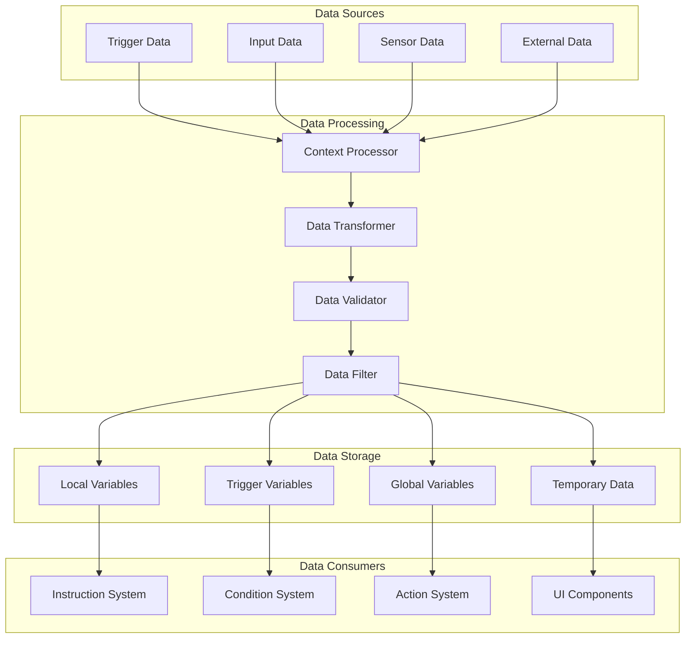
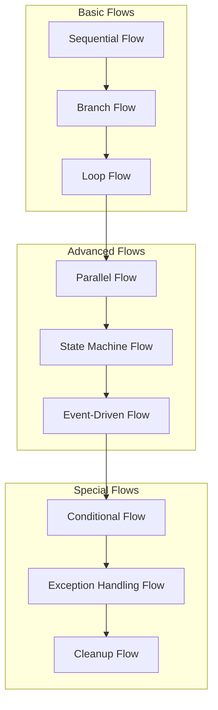

> 🌐 [**中文版**](../../../zh_CN/system_docs/architecture/dataflow_controlflow_design.md) | English

# Data Flow and Control Flow Detailed Design

## Table of Contents
1. [Data Flow Design](#1-data-flow-design)
2. [Control Flow Design](#2-control-flow-design)
3. [Execution Engine](#3-execution-engine)
4. [Asynchronous Processing Mechanism](#4-asynchronous-processing-mechanism)
5. [Error Handling and Recovery](#5-error-handling-and-recovery)
6. [Performance Optimization Strategies](#6-performance-optimization-strategies)

---

## 1. Data Flow Design

### 1.1 Data Flow Overview

Data flow is the path and mechanism by which data travels between components in the visual programming system. The design principles include:

- **Type safety**: Ensure type-safe data passing
- **Context isolation**: Data isolation between different execution contexts
- **Efficient passing**: Minimize the overhead of data copying and conversion
- **Traceability**: Support tracing and debugging of the data flow

### 1.2 Data Flow Architecture



### 1.3 Execution Context System

```gdscript
@tool
class_name ExecutionContext extends RefCounted

## Context configuration
class ContextConfig:
    var enable_data_tracking: bool = false
    var enable_performance_monitoring: bool = false
    var enable_debug_logging: bool = false
    var max_data_history: int = 100

## Context data
var trigger: BaseTrigger
var target: Node
var local_variables: Dictionary = {}
var global_variables: VariableContainer
var temporary_data: Dictionary = {}
var data_history: Array[Dictionary] = []

## Execution state
var execution_id: String
var start_time: float
var current_time: float
var is_cancelled: bool = false
var cancellation_reason: String = ""

## Performance monitoring
var performance_data: Dictionary = {}
var memory_usage: Array[float] = []

## Signals
signal data_changed(key: String, old_value: Variant, new_value: Variant)
signal context_cancelled(reason: String)
signal execution_completed

## Configuration
var config: ContextConfig

func _init(trigger_node: BaseTrigger = null, target_node: Node = null, context_config: ContextConfig = null):
    trigger = trigger_node
    target = target_node
    config = context_config if context_config else ContextConfig.new()
    
    execution_id = _generate_execution_id()
    start_time = Time.get_ticks_msec() / 1000.0
    current_time = start_time
    
    # Initialize the global variable container
    global_variables = VariableManager.get_global_variables()

## Generate an execution ID
func _generate_execution_id() -> String:
    return "exec_%d_%d" % [Time.get_ticks_msec(), randi()]

## Get a variable value (supports the scope chain)
func get_variable(name: String, default_value = null) -> Variant:
    var value = null
    
    # 1. Check temporary data
    if temporary_data.has(name):
        value = temporary_data[name]
    
    # 2. Check local variables
    elif local_variables.has(name):
        value = local_variables[name]
    
    # 3. Check trigger variables
    elif trigger and trigger.local_variables and trigger.local_variables.has(name):
        value = trigger.local_variables.get(name)
    
    # 4. Check global variables
    elif global_variables and global_variables.has(name):
        value = global_variables.get(name)
    
    # 5. Return the default value
    else:
        value = default_value
    
    # Record the data access
    if config.enable_data_tracking:
        _record_data_access(name, value)
    
    return value

## Set a variable value (smart scope selection)
func set_variable(name: String, value: Variant, scope: String = "auto") -> bool:
    var old_value = get_variable(name)
    var success = false
    
    match scope:
        "local":
            local_variables[name] = value
            success = true
        "trigger":
            if trigger and trigger.local_variables:
                success = trigger.local_variables.set(name, value)
        "global":
            if global_variables:
                success = global_variables.set(name, value)
        "temporary":
            temporary_data[name] = value
            success = true
        "auto":  # Automatically select the best scope
            success = _auto_assign_variable_scope(name, value)
        _:
            push_error("Invalid variable scope: %s" % scope)
            return false
    
    if success:
        # Record the data change
        if config.enable_data_tracking:
            _record_data_change(name, old_value, value, scope)
        
        # Emit the change signal
        data_changed.emit(name, old_value, value)
        
        # Performance monitoring
        if config.enable_performance_monitoring:
            _update_performance_metrics(name, value)
    
    return success

## Automatically assign the variable scope
func _auto_assign_variable_scope(name: String, value: Variant) -> bool:
    # Priority: temporary > local > trigger > global
    
    # If the variable name starts with "temp_", assign it to the temporary scope
    if name.begins_with("temp_"):
        temporary_data[name] = value
        return true
    
    # If the variable is a basic type with a small value, assign it to the local scope
    if _is_simple_type(value) and _is_small_value(value):
        local_variables[name] = value
        return true
    
    # If the variable already exists in a scope, update that scope
    if local_variables.has(name):
        local_variables[name] = value
        return true
    elif trigger and trigger.local_variables and trigger.local_variables.has(name):
        return trigger.local_variables.set(name, value)
    elif global_variables and global_variables.has(name):
        return global_variables.set(name, value)
    
    # Assign to the local scope by default
    local_variables[name] = value
    return true

## Check whether the value is a simple type
func _is_simple_type(value: Variant) -> bool:
    return value is bool or value is int or value is float or value is String

## Check whether the value is small
func _is_small_value(value: Variant) -> bool:
    if value is String:
        return (value as String).length() < 100
    elif value is Array:
        return (value as Array).size() < 10
    elif value is Dictionary:
        return (value as Dictionary).size() < 10
    return true

## Record a data access
func _record_data_access(name: String, value: Variant):
    var access_record = {
        "type": "access",
        "variable_name": name,
        "value": value,
        "timestamp": Time.get_ticks_msec() / 1000.0
    }
    _add_to_data_history(access_record)

## Record a data change
func _record_data_change(name: String, old_value: Variant, new_value: Variant, scope: String):
    var change_record = {
        "type": "change",
        "variable_name": name,
        "old_value": old_value,
        "new_value": new_value,
        "scope": scope,
        "timestamp": Time.get_ticks_msec() / 1000.0
    }
    _add_to_data_history(change_record)

## Add to the data history
func _add_to_data_history(record: Dictionary):
    data_history.append(record)
    
    # Cap the number of history records
    if data_history.size() > config.max_data_history:
        data_history.pop_front()

## Update performance metrics
func _update_performance_metrics(name: String, value: Variant):
    current_time = Time.get_ticks_msec() / 1000.0
    
    if not performance_data.has(name):
        performance_data[name] = {
            "access_count": 0,
            "last_access": 0,
            "total_size": 0
        }
    
    var metrics = performance_data[name]
    metrics.access_count += 1
    metrics.last_access = current_time
    metrics.total_size += _estimate_value_size(value)

## Estimate the value size
func _estimate_value_size(value: Variant) -> int:
    match typeof(value):
        TYPE_BOOL:
            return 1
        TYPE_INT:
            return 4
        TYPE_FLOAT:
            return 8
        TYPE_STRING:
            return (value as String).length() * 2
        TYPE_ARRAY:
            return (value as Array).size() * 8
        TYPE_DICTIONARY:
            return (value as Dictionary).size() * 16
        _:
            return 32

## Request execution cancellation
func request_cancel(reason: String = ""):
    is_cancelled = true
    cancellation_reason = reason
    context_cancelled.emit(reason)

## Check whether execution is cancelled
func is_execution_cancelled() -> bool:
    return is_cancelled

## Get execution statistics
func get_execution_stats() -> Dictionary:
    return {
        "execution_id": execution_id,
        "start_time": start_time,
        "current_time": current_time,
        "duration": current_time - start_time,
        "is_cancelled": is_cancelled,
        "cancellation_reason": cancellation_reason,
        "local_variable_count": local_variables.size(),
        "temporary_data_count": temporary_data.size(),
        "data_history_size": data_history.size(),
        "performance_data": performance_data
    }

## Clear temporary data
func cleanup_temporary_data():
    temporary_data.clear()

## Clone the context
func clone() -> ExecutionContext:
    var new_context = ExecutionContext.new(trigger, target, config)
    new_context.local_variables = local_variables.duplicate(true)
    new_context.temporary_data = temporary_data.duplicate(true)
    new_context.execution_id = _generate_execution_id()
    return new_context
```

---

## 2. Control Flow Design

### 2.1 Control Flow Overview

Control flow defines the execution order and logic of instructions and conditions in the visual programming system. Design characteristics include:

- **Flexible flow control**: Supports sequential, branch, loop, and other flows
- **Asynchronous execution support**: Native support for asynchronous operations and awaiting
- **Conditional branching**: Dynamic flow control driven by conditions
- **Error recovery**: Supports exception handling and flow recovery

### 2.2 Control Flow Types



### 2.3 Flow Controller

```gdscript
@tool
class_name FlowController extends RefCounted

## Flow types
enum FlowType {
    SEQUENTIAL,
    BRANCH,
    LOOP,
    PARALLEL,
    STATE_MACHINE,
    EVENT_DRIVEN
}

## Flow states
enum FlowState {
    IDLE,
    RUNNING,
    PAUSED,
    COMPLETED,
    ERROR,
    CANCELLED
}

## Flow execution result
class FlowResult:
    var state: FlowState
    var output_data: Dictionary = {}
    var error_message: String = ""
    var execution_time: float = 0.0

## Flow configuration
class FlowConfig:
    var enable_debugging: bool = false
    var enable_profiling: bool = false
    var max_execution_time: float = -1  # -1 = unlimited
    var enable_error_recovery: bool = true
    var retry_count: int = 3

var current_flow: FlowExecutor = null
var flow_stack: Array[FlowExecutor] = []
var global_context: ExecutionContext = null
var config: FlowConfig

func _init(flow_config: FlowConfig = null):
    config = flow_config if flow_config else FlowConfig.new()

## Execute a flow
func execute_flow(
    flow_type: FlowType,
    flow_data: Dictionary,
    context: ExecutionContext
) -> FlowResult:
    var flow_executor = _create_flow_executor(flow_type, flow_data)
    if not flow_executor:
        var result = FlowResult.new()
        result.state = FlowState.ERROR
        result.error_message = "Failed to create flow executor"
        return result
    
    flow_executor.context = context
    flow_executor.config = config
    
    # Push onto the flow stack
    flow_stack.append(flow_executor)
    current_flow = flow_executor
    
    # Execute the flow
    var result = await flow_executor.execute()
    
    # Pop from the flow stack
    flow_stack.erase(flow_executor)
    if flow_stack.size() > 0:
        current_flow = flow_stack[-1]
    else:
        current_flow = null
    
    return result

## Create a flow executor
func _create_flow_executor(flow_type: FlowType, flow_data: Dictionary) -> FlowExecutor:
    match flow_type:
        FlowType.SEQUENTIAL:
            return SequentialFlowExecutor.new(flow_data)
        FlowType.BRANCH:
            return BranchFlowExecutor.new(flow_data)
        FlowType.LOOP:
            return LoopFlowExecutor.new(flow_data)
        FlowType.PARALLEL:
            return ParallelFlowExecutor.new(flow_data)
        FlowType.STATE_MACHINE:
            return StateMachineFlowExecutor.new(flow_data)
        FlowType.EVENT_DRIVEN:
            return EventDrivenFlowExecutor.new(flow_data)
    return null

## Pause the current flow
func pause_current_flow():
    if current_flow:
        current_flow.pause()

## Resume the current flow
func resume_current_flow():
    if current_flow:
        current_flow.resume()

## Cancel the current flow
func cancel_current_flow(reason: String = ""):
    if current_flow:
        current_flow.cancel(reason)

## Get the flow status
func get_flow_status() -> Dictionary:
    return {
        "current_flow": current_flow,
        "flow_stack_size": flow_stack.size(),
        "stack_trace": _get_stack_trace()
    }

## Get the stack trace
func _get_stack_trace() -> Array[Dictionary]:
    var trace = []
    
    for i in range(flow_stack.size()):
        var flow = flow_stack[i]
        trace.append({
            "level": i,
            "flow_type": flow.get_flow_type(),
            "state": flow.get_state(),
            "execution_time": flow.get_execution_time()
        })
    
    return trace
```

### 2.4 Flow Executor Base Class

```gdscript
@tool
class_name FlowExecutor extends RefCounted

## Flow data
var flow_data: Dictionary = {}
var context: ExecutionContext = null
var config: FlowController.FlowConfig = null

## Execution state
var state: FlowController.FlowState = FlowController.FlowState.IDLE
var start_time: float = 0.0
var execution_time: float = 0.0
var error_message: String = ""

## Signals
signal flow_started()
signal flow_completed(result: FlowController.FlowResult)
signal flow_paused()
signal flow_resumed()
signal flow_cancelled(reason: String)
signal flow_error(error_message: String)

## Execute the flow (implemented by subclasses)
func execute() -> FlowController.FlowResult:
    push_error("execute() must be implemented by subclass")
    return null

## Pause the flow
func pause():
    if state == FlowController.FlowState.RUNNING:
        state = FlowController.FlowState.PAUSED
        flow_paused.emit()

## Resume the flow
func resume():
    if state == FlowController.FlowState.PAUSED:
        state = FlowController.FlowState.RUNNING
        flow_resumed.emit()

## Cancel the flow
func cancel(reason: String = ""):
    state = FlowController.FlowState.CANCELLED
    error_message = reason
    flow_cancelled.emit(reason)

## Get the flow type
func get_flow_type() -> String:
    return "Base"

## Get the state
func get_state() -> FlowController.FlowState:
    return state

## Get the execution time
func get_execution_time() -> float:
    return execution_time

## Create the execution result
func _create_result(result_state: FlowController.FlowState) -> FlowController.FlowResult:
    var result = FlowController.FlowResult.new()
    result.state = result_state
    result.error_message = error_message
    result.execution_time = execution_time
    return result

## Start execution
func _start_execution():
    state = FlowController.FlowState.RUNNING
    start_time = Time.get_ticks_msec() / 1000.0
    flow_started.emit()

## Complete execution
func _complete_execution(result_state: FlowController.FlowState) -> FlowController.FlowResult:
    execution_time = Time.get_ticks_msec() / 1000.0 - start_time
    state = result_state
    
    var result = _create_result(result_state)
    flow_completed.emit(result)
    
    return result

## Handle an error
func _handle_error(error: String):
    state = FlowController.FlowState.ERROR
    error_message = error
    flow_error.emit(error)
```

### 2.5 Sequential Flow Executor

```gdscript
@tool
class_name SequentialFlowExecutor extends FlowExecutor

## Sequential flow data
class SequentialFlowData:
    var instructions: Array[BaseInstruction] = []
    var stop_on_error: bool = true
    var stop_on_first_false: bool = false

var flow_config: SequentialFlowData

func _init(data: Dictionary):
    flow_data = data
    flow_config = SequentialFlowData.new()
    
    # Parse the flow data
    if data.has("instructions"):
        flow_config.instructions = data["instructions"]
    if data.has("stop_on_error"):
        flow_config.stop_on_error = data["stop_on_error"]
    if data.has("stop_on_first_false"):
        flow_config.stop_on_first_false = data["stop_on_first_false"]

func execute() -> FlowController.FlowResult:
    _start_execution()
    
    var last_result = true
    
    for i in range(flow_config.instructions.size()):
        # Check whether execution is cancelled
        if context.is_execution_cancelled():
            return _complete_execution(FlowController.FlowState.CANCELLED)
        
        var instruction = flow_config.instructions[i]
        if not instruction:
            continue
        
        # Execute the instruction
        instruction.execute(context)
        await instruction.finished
        
        # Check the instruction result
        var instruction_result = _get_instruction_result(instruction)
        last_result = instruction_result
        
        # Handle the stop conditions
        if flow_config.stop_on_error and not instruction_result:
            return _complete_execution(FlowController.FlowState.ERROR)
        
        if flow_config.stop_on_first_false and not instruction_result:
            break
    
    return _complete_execution(FlowController.FlowState.COMPLETED)

func get_flow_type() -> String:
    return "Sequential"

## Get the instruction execution result
func _get_instruction_result(instruction: BaseInstruction) -> bool:
    # The execution result could be derived from the instruction type and context here
    # Simplified implementation: assume all instructions succeed
    return true
```

### 2.6 Branch Flow Executor

```gdscript
@tool
class_name BranchFlowExecutor extends FlowExecutor

## Branch flow data
class BranchFlowData:
    var condition: BaseCondition
    var true_instructions: Array[BaseInstruction] = []
    var false_instructions: Array[BaseInstruction] = []
    var default_branch: String = "true"  # "true", "false", "both"

var flow_config: BranchFlowData

func _init(data: Dictionary):
    flow_data = data
    flow_config = BranchFlowData.new()
    
    # Parse the flow data
    if data.has("condition"):
        flow_config.condition = data["condition"]
    if data.has("true_instructions"):
        flow_config.true_instructions = data["true_instructions"]
    if data.has("false_instructions"):
        flow_config.false_instructions = data["false_instructions"]
    if data.has("default_branch"):
        flow_config.default_branch = data["default_branch"]

func execute() -> FlowController.FlowResult:
    _start_execution()
    
    # Check whether execution is cancelled
    if context.is_execution_cancelled():
        return _complete_execution(FlowController.FlowState.CANCELLED)
    
    # Evaluate the condition
    var condition_result = false
    if flow_config.condition:
        condition_result = flow_config.condition.check(context)
    
    # Select the branch to execute
    var instructions_to_execute: Array[BaseInstruction] = []
    
    match flow_config.default_branch:
        "true":
            instructions_to_execute = flow_config.true_instructions if condition_result else []
        "false":
            instructions_to_execute = flow_config.false_instructions if not condition_result else []
        "both":
            instructions_to_execute = flow_config.true_instructions if condition_result else flow_config.false_instructions
        _:
            instructions_to_execute = flow_config.true_instructions if condition_result else flow_config.false_instructions
    
    # Execute the selected instructions
    for instruction in instructions_to_execute:
        # Check whether execution is cancelled
        if context.is_execution_cancelled():
            return _complete_execution(FlowController.FlowState.CANCELLED)
        
        instruction.execute(context)
        await instruction.finished
    
    return _complete_execution(FlowController.FlowState.COMPLETED)

func get_flow_type() -> String:
    return "Branch"
```

---

## 3. Execution Engine

### 3.1 Execution Engine Overview

The execution engine is the core runtime of the visual programming system, responsible for coordinating the execution of instructions, conditions, variables, and triggers. Design characteristics:

- **Unified execution model**: Provides a unified execution interface and model
- **Async-first**: Native support for asynchronous execution and awaiting
- **Resource management**: Intelligently manages execution resources and memory
- **Performance monitoring**: Built-in performance monitoring and profiling

### 3.2 Execution Engine Architecture

```gdscript
@tool
class_name ExecutionEngine extends Node

## Execution engine configuration
class EngineConfig:
    var max_concurrent_executions: int = 10
    var enable_profiling: bool = false
    var enable_debug_logging: bool = false
    var execution_timeout: float = 30.0
    var enable_gc_optimization: bool = true

## Execution state
enum ExecutionState {
    IDLE,
    RUNNING,
    PAUSED,
    STOPPING
}

var config: EngineConfig
var current_state: ExecutionState = ExecutionState.IDLE

## Execution management
var active_executions: Dictionary = {}  # execution_id -> ExecutionContext
var execution_queue: Array[Dictionary] = []
var execution_history: Array[Dictionary] = []

## Performance monitoring
var performance_monitor: PerformanceMonitor = null
var resource_monitor: ResourceMonitor = null

## Signals
signal execution_started(execution_id: String)
signal execution_completed(execution_id: String, result: Dictionary)
signal execution_failed(execution_id: String, error: String)
signal engine_state_changed(new_state: ExecutionState)

func _ready():
    config = EngineConfig.new()
    _setup_monitors()

## Set up the monitors
func _setup_monitors():
    if config.enable_profiling:
        performance_monitor = PerformanceMonitor.new()
        add_child(performance_monitor)
        
        resource_monitor = ResourceMonitor.new()
        add_child(resource_monitor)

## Execute an action sequence
func execute_action_runner(
    action_runner: ActionRunner,
    trigger: BaseTrigger,
    target: Node = null
) -> String:
    var execution_id = _generate_execution_id()
    
    # Create the execution context
    var context = ExecutionContext.new(trigger, target)
    
    # Add to the active execution list
    active_executions[execution_id] = context
    
    # Emit the start signal
    execution_started.emit(execution_id)
    
    # Execute the action sequence
    _execute_action_runner_async(action_runner, context, execution_id)
    
    return execution_id

## Execute an action sequence asynchronously
func _execute_action_runner_async(
    action_runner: ActionRunner,
    context: ExecutionContext,
    execution_id: String
):
    # Check the concurrency limit
    if active_executions.size() >= config.max_concurrent_executions:
        _queue_execution(action_runner, context, execution_id)
        return
    
    # Set up the timeout
    var timeout_timer = Timer.new()
    timeout_timer.wait_time = config.execution_timeout
    timeout_timer.timeout.connect(_on_execution_timeout.bind(execution_id))
    timeout_timer.autostart = true
    add_child(timeout_timer)
    
    # Start performance monitoring
    if performance_monitor:
        performance_monitor.start_monitoring(execution_id)
    
    try:
        # Execute the action sequence
        action_runner.run(context)
        await action_runner.action_completed
        
        # Execution succeeded
        _on_execution_success(execution_id, context)
        
    except:
        # Execution failed
        var error_message = "Execution failed: " + str(get_stack())
        _on_execution_error(execution_id, error_message)
    
    finally:
        # Clean up resources
        timeout_timer.queue_free()
        
        if performance_monitor:
            performance_monitor.stop_monitoring(execution_id)
        
        # Process the next queued execution
        _process_execution_queue()

## Handle successful execution
func _on_execution_success(execution_id: String, context: ExecutionContext):
    var result = {
        "execution_id": execution_id,
        "success": true,
        "context": context,
        "performance_data": performance_monitor.get_data(execution_id) if performance_monitor else {},
        "execution_time": Time.get_ticks_msec() / 1000.0 - context.start_time
    }
    
    # Record in the execution history
    _record_execution(execution_id, result)
    
    # Remove from active executions
    active_executions.erase(execution_id)
    
    # Emit the completion signal
    execution_completed.emit(execution_id, result)

## Handle execution errors
func _on_execution_error(execution_id: String, error_message: String):
    # Log the error
    push_error("Execution error [%s]: %s" % [execution_id, error_message])
    
    # Remove from active executions
    active_executions.erase(execution_id)
    
    # Emit the failure signal
    execution_failed.emit(execution_id, error_message)

## Handle execution timeout
func _on_execution_timeout(execution_id: String):
    var context = active_executions.get(execution_id)
    if context:
        context.request_cancel("Execution timeout")
    
    _on_execution_error(execution_id, "Execution timeout")

## Queue an execution
func _queue_execution(
    action_runner: ActionRunner,
    context: ExecutionContext,
    execution_id: String
):
    execution_queue.append({
        "action_runner": action_runner,
        "context": context,
        "execution_id": execution_id,
        "queue_time": Time.get_ticks_msec() / 1000.0
    })

## Process the execution queue
func _process_execution_queue():
    if execution_queue.is_empty():
        return
    
    if active_executions.size() >= config.max_concurrent_executions:
        return
    
    var queued_execution = execution_queue.pop_front()
    _execute_action_runner_async(
        queued_execution.action_runner,
        queued_execution.context,
        queued_execution.execution_id
    )

## Record an execution
func _record_execution(execution_id: String, result: Dictionary):
    var record = {
        "execution_id": execution_id,
        "timestamp": Time.get_ticks_msec() / 1000.0,
        "result": result
    }
    
    execution_history.append(record)
    
    # Cap the number of history records
    if execution_history.size() > 1000:
        execution_history.pop_front()

## Generate an execution ID
func _generate_execution_id() -> String:
    return "exec_%d_%d" % [Time.get_ticks_msec(), randi()]

## Get execution statistics
func get_execution_statistics() -> Dictionary:
    var stats = {
        "current_state": current_state,
        "active_executions": active_executions.size(),
        "queued_executions": execution_queue.size(),
        "total_executions": execution_history.size(),
        "success_rate": 0.0,
        "average_execution_time": 0.0,
        "performance_summary": {}
    }
    
    # Compute the success rate and average execution time
    if execution_history.size() > 0:
        var success_count = 0
        var total_time = 0.0
        
        for record in execution_history:
            var result = record.result
            if result.get("success", false):
                success_count += 1
            total_time += result.get("execution_time", 0.0)
        
        stats.success_rate = float(success_count) / execution_history.size() * 100.0
        stats.average_execution_time = total_time / execution_history.size()
    
    # Performance summary
    if performance_monitor:
        stats.performance_summary = performance_monitor.get_summary()
    
    return stats

## Pause the engine
func pause_engine():
    current_state = ExecutionState.PAUSED
    engine_state_changed.emit(current_state)

## Resume the engine
func resume_engine():
    current_state = ExecutionState.RUNNING
    engine_state_changed.emit(current_state)

## Stop the engine
func stop_engine():
    current_state = ExecutionState.STOPPING
    
    # Cancel all active executions
    for execution_id in active_executions.keys():
        var context = active_executions[execution_id]
        context.request_cancel("Engine stopping")
    
    # Clear the queue
    execution_queue.clear()
    
    engine_state_changed.emit(current_state)
```

---

## 4. Asynchronous Processing Mechanism

### 4.1 Asynchronous Processor

```gdscript
@tool
class_name AsyncProcessor extends RefCounted

## Async task states
enum AsyncTaskStatus {
    PENDING,
    RUNNING,
    COMPLETED,
    FAILED,
    CANCELLED
}

## Async task
class AsyncTask:
    var task_id: String
    var callable: Callable
    var args: Array = []
    var status: AsyncTaskStatus = AsyncTaskStatus.PENDING
    var result: Variant = null
    var error_message: String = ""
    var start_time: float = 0.0
    var end_time: float = 0.0
    var timeout: float = -1  # -1 = no timeout

## Processor configuration
class ProcessorConfig:
    var max_concurrent_tasks: int = 50
    var default_timeout: float = 30.0
    var enable_task_priority: bool = true
    var enable_task_cancellation: bool = true

var config: ProcessorConfig
var active_tasks: Dictionary = {}  # task_id -> AsyncTask
var task_queue: Array[AsyncTask] = []
var completed_tasks: Array[AsyncTask] = []

## Signals
signal task_started(task_id: String)
signal task_completed(task_id: String, result: Variant)
signal task_failed(task_id: String, error: String)
signal task_cancelled(task_id: String)

func _init(processor_config: ProcessorConfig = null):
    config = processor_config if processor_config else ProcessorConfig.new()

## Submit an async task
func submit_task(callable: Callable, args: Array = [], timeout: float = -1) -> String:
    var task = AsyncTask.new()
    task.task_id = _generate_task_id()
    task.callable = callable
    task.args = args
    task.timeout = timeout if timeout > 0 else config.default_timeout
    
    # Add to the queue
    task_queue.append(task)
    
    # Try to execute immediately
    _process_task_queue()
    
    return task.task_id

## Process the task queue
func _process_task_queue():
    while not task_queue.is_empty() and active_tasks.size() < config.max_concurrent_tasks:
        var task = task_queue.pop_front()
        _execute_task(task)

## Execute a task
func _execute_task(task: AsyncTask):
    active_tasks[task.task_id] = task
    task.status = AsyncTaskStatus.RUNNING
    task.start_time = Time.get_ticks_msec() / 1000.0
    
    task_started.emit(task.task_id)
    
    # Set up the timeout
    if task.timeout > 0:
        var timeout_timer = get_tree().create_timer(task.timeout)
        timeout_timer.timeout.connect(_on_task_timeout.bind(task.task_id))
    
    # Execute the task asynchronously
    _execute_task_async(task)

## Execute a task asynchronously
func _execute_task_async(task: AsyncTask):
    try:
        # Invoke the callable
        task.result = await task.callable.callv(task.args)
        task.status = AsyncTaskStatus.COMPLETED
        task.end_time = Time.get_ticks_msec() / 1000.0
        
        task_completed.emit(task.task_id, task.result)
        
    except:
        task.error_message = "Task execution failed: " + str(get_stack())
        task.status = AsyncTaskStatus.FAILED
        task.end_time = Time.get_ticks_msec() / 1000.0
        
        task_failed.emit(task.task_id, task.error_message)
    
    finally:
        # Remove from active tasks
        active_tasks.erase(task.task_id)
        
        # Add to completed tasks
        completed_tasks.append(task)
        
        # Process the next queued task
        _process_task_queue()

## Handle task timeout
func _on_task_timeout(task_id: String):
    var task = active_tasks.get(task_id)
    if task and task.status == AsyncTaskStatus.RUNNING:
        task.status = AsyncTaskStatus.CANCELLED
        task.error_message = "Task timeout"
        task.end_time = Time.get_ticks_msec() / 1000.0
        
        task_cancelled.emit(task_id)
        
        active_tasks.erase(task_id)

## Cancel a task
func cancel_task(task_id: String) -> bool:
    var task = active_tasks.get(task_id)
    if task:
        task.status = AsyncTaskStatus.CANCELLED
        task.error_message = "Task cancelled"
        task.end_time = Time.get_ticks_msec() / 1000.0
        
        task_cancelled.emit(task_id)
        active_tasks.erase(task_id)
        return true
    
    # Check the queued tasks
    for i in range(task_queue.size()):
        if task_queue[i].task_id == task_id:
            task_queue.remove_at(i)
            return true
    
    return false

## Wait for a task to complete
func wait_for_task(task_id: String) -> Variant:
    var task = active_tasks.get(task_id)
    if not task:
        # Check the completed tasks
        for completed_task in completed_tasks:
            if completed_task.task_id == task_id:
                if completed_task.status == AsyncTaskStatus.COMPLETED:
                    return completed_task.result
                elif completed_task.status == AsyncTaskStatus.FAILED:
                    push_error(completed_task.error_message)
                    return null
        return null
    
    # Wait for the task to complete
    while task.status == AsyncTaskStatus.RUNNING or task.status == AsyncTaskStatus.PENDING:
        await get_tree().process_frame
    
    if task.status == AsyncTaskStatus.COMPLETED:
        return task.result
    elif task.status == AsyncTaskStatus.FAILED:
        push_error(task.error_message)
        return null
    
    return null

## Wait for multiple tasks
func wait_for_tasks(task_ids: Array[String]) -> Array[Variant]:
    var results = []
    
    for task_id in task_ids:
        var result = wait_for_task(task_id)
        results.append(result)
    
    return results

## Generate a task ID
func _generate_task_id() -> String:
    return "task_%d_%d" % [Time.get_ticks_msec(), randi()]

## Get the processor status
func get_processor_status() -> Dictionary:
    return {
        "active_tasks": active_tasks.size(),
        "queued_tasks": task_queue.size(),
        "completed_tasks": completed_tasks.size(),
        "max_concurrent_tasks": config.max_concurrent_tasks,
        "total_processed": completed_tasks.size()
    }

## Clean up completed tasks
func cleanup_completed_tasks(max_keep: int = 100):
    if completed_tasks.size() > max_keep:
        completed_tasks = completed_tasks.slice(-max_keep)
```

---

## 5. Error Handling and Recovery

### 5.1 Error Handling System

```gdscript
@tool
class_name ErrorHandler extends RefCounted

## Error types
enum ErrorType {
    VALIDATION_ERROR,
    EXECUTION_ERROR,
    TIMEOUT_ERROR,
    RESOURCE_ERROR,
    LOGIC_ERROR,
    UNKNOWN_ERROR
}

## Error severity
enum ErrorSeverity {
    LOW,
    MEDIUM,
    HIGH,
    CRITICAL
}

## Error info
class ErrorInfo:
    var error_type: ErrorType
    var severity: ErrorSeverity
    var message: String
    var context: ExecutionContext
    var stack_trace: Array[Dictionary] = []
    var timestamp: float
    var recovery_suggestions: Array[String] = []

## Error recovery strategies
enum RecoveryStrategy {
    IGNORE,
    RETRY,
    FALLBACK,
    ABORT,
    CUSTOM
}

## Error handler configuration
class ErrorHandlerConfig:
    var enable_logging: bool = true
    var enable_recovery: bool = true
    var max_retry_count: int = 3
    var retry_delay: float = 1.0
    var enable_error_aggregation: bool = true

var config: ErrorHandlerConfig
var error_history: Array[ErrorInfo] = []
var recovery_strategies: Dictionary = {}

## Signals
signal error_occurred(error_info: ErrorInfo)
signal error_recovered(error_info: ErrorInfo, strategy: RecoveryStrategy)
signal recovery_failed(error_info: ErrorInfo)

func _init(error_handler_config: ErrorHandlerConfig = null):
    config = error_handler_config if error_handler_config else ErrorHandlerConfig.new()
    _setup_default_recovery_strategies()

## Set up the default recovery strategies
func _setup_default_recovery_strategies():
    recovery_strategies[ErrorType.VALIDATION_ERROR] = RecoveryStrategy.FALLBACK
    recovery_strategies[ErrorType.EXECUTION_ERROR] = RecoveryStrategy.RETRY
    recovery_strategies[ErrorType.TIMEOUT_ERROR] = RecoveryStrategy.RETRY
    recovery_strategies[ErrorType.RESOURCE_ERROR] = RecoveryStrategy.FALLBACK
    recovery_strategies[ErrorType.LOGIC_ERROR] = RecoveryStrategy.ABORT
    recovery_strategies[ErrorType.UNKNOWN_ERROR] = RecoveryStrategy.IGNORE

## Handle an error
func handle_error(
    error_type: ErrorType,
    severity: ErrorSeverity,
    message: String,
    context: ExecutionContext = null
) -> ErrorInfo:
    var error_info = ErrorInfo.new()
    error_info.error_type = error_type
    error_info.severity = severity
    error_info.message = message
    error_info.context = context
    error_info.stack_trace = get_stack()
    error_info.timestamp = Time.get_ticks_msec() / 1000.0
    
    # Generate recovery suggestions
    error_info.recovery_suggestions = _generate_recovery_suggestions(error_info)
    
    # Log the error
    error_history.append(error_info)
    
    # Cap the number of error history records
    if error_history.size() > 1000:
        error_history.pop_front()
    
    # Write the log entry
    if config.enable_logging:
        _log_error(error_info)
    
    # Emit the error signal
    error_occurred.emit(error_info)
    
    # Attempt recovery
    if config.enable_recovery:
        var recovery_result = await _attempt_recovery(error_info)
        if recovery_result:
            error_recovered.emit(error_info, recovery_result)
        else:
            recovery_failed.emit(error_info)
    
    return error_info

## Generate recovery suggestions
func _generate_recovery_suggestions(error_info: ErrorInfo) -> Array[String]:
    var suggestions = []
    
    match error_info.error_type:
        ErrorType.VALIDATION_ERROR:
            suggestions.append("Check input parameters")
            suggestions.append("Validate data types")
            suggestions.append("Review configuration")
        
        ErrorType.EXECUTION_ERROR:
            suggestions.append("Check resource availability")
            suggestions.append("Verify permissions")
            suggestions.append("Review execution logic")
        
        ErrorType.TIMEOUT_ERROR:
            suggestions.append("Increase timeout duration")
            suggestions.append("Optimize execution performance")
            suggestions.append("Check network connectivity")
        
        ErrorType.RESOURCE_ERROR:
            suggestions.append("Verify resource paths")
            suggestions.append("Check resource dependencies")
            suggestions.append("Ensure sufficient memory")
        
        ErrorType.LOGIC_ERROR:
            suggestions.append("Review logic flow")
            suggestions.append("Check condition evaluations")
            suggestions.append("Verify variable values")
        
        ErrorType.UNKNOWN_ERROR:
            suggestions.append("Enable debug logging")
            suggestions.append("Check system logs")
            suggestions.append("Report issue to developers")
    
    return suggestions

## Attempt recovery
func _attempt_recovery(error_info: ErrorInfo) -> RecoveryStrategy:
    var strategy = recovery_strategies.get(error_info.error_type, RecoveryStrategy.IGNORE)
    
    match strategy:
        RecoveryStrategy.RETRY:
            return await _retry_recovery(error_info)
        RecoveryStrategy.FALLBACK:
            return await _fallback_recovery(error_info)
        RecoveryStrategy.ABORT:
            return await _abort_recovery(error_info)
        RecoveryStrategy.IGNORE:
            return await _ignore_recovery(error_info)
        RecoveryStrategy.CUSTOM:
            return await _custom_recovery(error_info)
    
    return strategy

## Retry recovery
func _retry_recovery(error_info: ErrorInfo) -> RecoveryStrategy:
    if error_info.context:
        var retry_count = error_info.context.get_variable("_retry_count", 0)
        
        if retry_count < config.max_retry_count:
            error_info.context.set_variable("_retry_count", retry_count + 1)
            
            # Wait for the retry delay
            await get_tree().create_timer(config.retry_delay).timeout
            
            # Execute again
            if error_info.context.trigger and error_info.context.trigger.action_runner:
                error_info.context.trigger.action_runner.run(error_info.context)
                await error_info.context.trigger.action_runner.action_completed
                
                return RecoveryStrategy.RETRY
    
    return RecoveryStrategy.ABORT

## Fallback recovery
func _fallback_recovery(error_info: ErrorInfo) -> RecoveryStrategy:
    # Fallback logic implementation
    if error_info.context:
        var fallback_action = error_info.context.get_variable("_fallback_action")
        if fallback_action:
            # Execute the fallback action
            print("Executing fallback action: %s" % fallback_action)
            return RecoveryStrategy.FALLBACK
    
    return RecoveryStrategy.IGNORE

## Abort recovery
func _abort_recovery(error_info: ErrorInfo) -> RecoveryStrategy:
    if error_info.context:
        error_info.context.request_cancel("Error recovery: " + error_info.message)
    
    return RecoveryStrategy.ABORT

## Ignore recovery
func _ignore_recovery(error_info: ErrorInfo) -> RecoveryStrategy:
    print("Ignoring error: %s" % error_info.message)
    return RecoveryStrategy.IGNORE

## Custom recovery
func _custom_recovery(error_info: ErrorInfo) -> RecoveryStrategy:
    # Custom recovery logic implementation
    var custom_recovery_func = error_info.context.get_variable("_custom_recovery_func") if error_info.context else null
    
    if custom_recovery_func and custom_recovery_func is Callable:
        var result = await custom_recovery_func.call(error_info)
        return result if result is RecoveryStrategy else RecoveryStrategy.IGNORE
    
    return RecoveryStrategy.IGNORE

## Write the error log
func _log_error(error_info: ErrorInfo):
    var severity_str = ErrorSeverity.keys()[error_info.severity]
    var type_str = ErrorType.keys()[error_info.error_type]
    
    var log_message = "[%s][%s] %s" % [severity_str, type_str, error_info.message]
    
    match error_info.severity:
        ErrorSeverity.LOW:
            print(log_message)
        ErrorSeverity.MEDIUM:
            push_warning(log_message)
        ErrorSeverity.HIGH, ErrorSeverity.CRITICAL:
            push_error(log_message)

## Get error statistics
func get_error_statistics() -> Dictionary:
    var stats = {
        "total_errors": error_history.size(),
        "error_types": {},
        "severity_distribution": {},
        "recent_errors": []
    }
    
    # Tally error types
    for error_info in error_history:
        var type_str = ErrorType.keys()[error_info.error_type]
        stats.error_types[type_str] = stats.error_types.get(type_str, 0) + 1
        
        var severity_str = ErrorSeverity.keys()[error_info.severity]
        stats.severity_distribution[severity_str] = stats.severity_distribution.get(severity_str, 0) + 1
    
    # Most recent errors
    var recent_count = min(10, error_history.size())
    for i in range(recent_count):
        var error_info = error_history[error_history.size() - recent_count + i]
        stats.recent_errors.append({
            "message": error_info.message,
            "type": ErrorType.keys()[error_info.error_type],
            "severity": ErrorSeverity.keys()[error_info.severity],
            "timestamp": error_info.timestamp
        })
    
    return stats
```

---

## 6. Performance Optimization Strategies

### 6.1 Performance Monitor

```gdscript
@tool
class_name PerformanceMonitor extends Node

## Performance metrics
class PerformanceMetrics:
    var execution_id: String
    var start_time: float
    var end_time: float
    var memory_usage: Array[float] = []
    var cpu_usage: Array[float] = []
    var frame_times: Array[float] = []
    var instruction_count: int = 0
    var variable_access_count: int = 0

var active_monitors: Dictionary = {}  # execution_id -> PerformanceMetrics
var monitoring_enabled: bool = false
var update_interval: float = 0.1  # Monitoring update interval
var monitor_timer: Timer = null

## Signals
signal performance_update(execution_id: String, metrics: PerformanceMetrics)
signal performance_warning(execution_id: String, warning: String)

func _ready():
    _setup_monitor_timer()

## Set up the monitor timer
func _setup_monitor_timer():
    monitor_timer = Timer.new()
    monitor_timer.wait_time = update_interval
    monitor_timer.timeout.connect(_update_all_monitors)
    monitor_timer.autostart = false
    add_child(monitor_timer)

## Start monitoring
func start_monitoring(execution_id: String):
    var metrics = PerformanceMetrics.new()
    metrics.execution_id = execution_id
    metrics.start_time = Time.get_ticks_msec() / 1000.0
    
    active_monitors[execution_id] = metrics
    
    if not monitoring_enabled:
        monitoring_enabled = true
        monitor_timer.start()

## Stop monitoring
func stop_monitoring(execution_id: String):
    var metrics = active_monitors.get(execution_id)
    if metrics:
        metrics.end_time = Time.get_ticks_msec() / 1000.0
        performance_update.emit(execution_id, metrics)
    
    active_monitors.erase(execution_id)
    
    if active_monitors.is_empty():
        monitoring_enabled = false
        monitor_timer.stop()

## Update all monitors
func _update_all_monitors():
    for execution_id in active_monitors.keys():
        _update_monitor(execution_id)

## Update a single monitor
func _update_monitor(execution_id: String):
    var metrics = active_monitors.get(execution_id)
    if not metrics:
        return
    
    # Record memory usage
    var memory_usage = OS.get_static_memory_usage_by_type()[OS.MEMORY_TYPE_STATIC]
    metrics.memory_usage.append(memory_usage)
    
    # Record the frame time
    var frame_time = get_process_delta_time()
    metrics.frame_times.append(frame_time)
    
    # Check performance warnings
    _check_performance_warnings(execution_id, metrics)

## Check performance warnings
func _check_performance_warnings(execution_id: String, metrics: PerformanceMetrics):
    # Check memory usage
    if metrics.memory_usage.size() > 0:
        var current_memory = metrics.memory_usage[-1]
        if current_memory > 100 * 1024 * 1024:  # 100MB
            performance_warning.emit(execution_id, "High memory usage: %.1f MB" % (current_memory / (1024 * 1024)))
    
    # Check frame times
    if metrics.frame_times.size() > 0:
        var current_frame_time = metrics.frame_times[-1]
        if current_frame_time > 0.1:  # 100ms
            performance_warning.emit(execution_id, "Long frame time: %.1f ms" % (current_frame_time * 1000))

## Get monitoring data
func get_data(execution_id: String) -> Dictionary:
    var metrics = active_monitors.get(execution_id)
    if not metrics:
        return {}
    
    return {
        "execution_id": metrics.execution_id,
        "start_time": metrics.start_time,
        "end_time": metrics.end_time,
        "duration": metrics.end_time - metrics.start_time if metrics.end_time > 0 else 0,
        "memory_usage": metrics.memory_usage,
        "cpu_usage": metrics.cpu_usage,
        "frame_times": metrics.frame_times,
        "instruction_count": metrics.instruction_count,
        "variable_access_count": metrics.variable_access_count,
        "average_memory": _calculate_average(metrics.memory_usage),
        "average_frame_time": _calculate_average(metrics.frame_times),
        "peak_memory": _calculate_peak(metrics.memory_usage),
        "peak_frame_time": _calculate_peak(metrics.frame_times)
    }

## Compute the average
func _calculate_average(values: Array[float]) -> float:
    if values.is_empty():
        return 0.0
    
    var sum = 0.0
    for value in values:
        sum += value
    
    return sum / values.size()

## Compute the peak
func _calculate_peak(values: Array[float]) -> float:
    if values.is_empty():
        return 0.0
    
    var peak = values[0]
    for value in values:
        if value > peak:
            peak = value
    
    return peak

## Get the performance summary
func get_summary() -> Dictionary:
    var summary = {
        "active_monitors": active_monitors.size(),
        "total_executions": 0,
        "average_duration": 0.0,
        "average_memory": 0.0,
        "performance_issues": []
    }
    
    var all_durations = []
    var all_memory_peaks = []
    
    for execution_id in active_monitors.keys():
        var data = get_data(execution_id)
        if not data.is_empty():
            summary.total_executions += 1
            all_durations.append(data.duration)
            all_memory_peaks.append(data.peak_memory)
    
    if all_durations.size() > 0:
        summary.average_duration = _calculate_average(all_durations)
        summary.average_memory = _calculate_average(all_memory_peaks)
    
    return summary
```

---

## Summary

Data flow and control flow are the execution core of the visual programming system. This design provides:

1. **Complete data flow architecture**: Supports multi-layer data processing, type safety, and context isolation
2. **Flexible control flow system**: Supports sequential, branch, loop, parallel, and other flow control
3. **Powerful execution engine**: Provides a unified execution model, resource management, and performance monitoring
4. **Advanced asynchronous processing**: Supports task queues, concurrency control, and timeout handling
5. **Robust error handling**: Provides error classification, recovery strategies, and automatic retries
6. **Comprehensive performance optimization**: Built-in performance monitoring, resource management, and optimization advice

This data flow and control flow design maintains high performance while delivering powerful capabilities and good extensibility, providing a reliable execution foundation for the entire visual programming system.

---

## Architecture Updates (2026-03)

### Variable System Refactoring
- VariableContainer has been marked @deprecated
- New utility classes: VariableOperations (unified variable access), VariableScopeUtils (scope utilities)
- ScopeVariableContainer / ScopeVariableManager (scoped variable system)
- GlobalVariableAssistant / GlobalVariableManager (global variable system)

### Control Flow Extensions
- New loop instructions such as WhileLoop, ForEach, Count, and WaitUntil
- IfThen / IfElse conditional branching
- RunRunner supports instruction reuse

### Runtime Instance Integration
- ExecutionContext is now managed through RuntimeActionRunnerInstance
- Variable snapshot methods support breakpoint debugging
- Loop flag stack supports nested loop control
