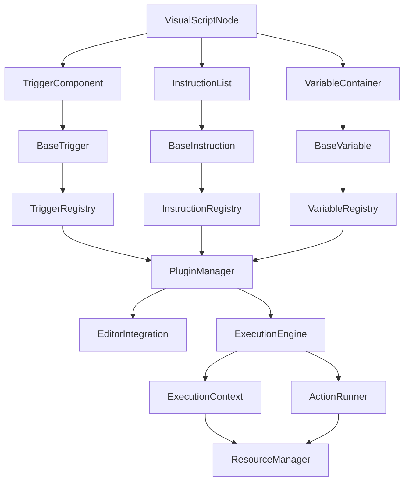

> 🌐 [**中文版**](../../../zh_CN/system_docs/architecture/visual_programming_complete_design_summary.md) | English

# Complete Design Summary of the Visual Programming System

## 1. Project Overview

This document summarizes the complete visual programming architecture designed for the Godot 4.x engine, based on an analysis of the GameCreator visual scripting system architecture and the "juicy" trigger suggestions. The system provides a powerful, flexible, and easily extensible visual programming solution that takes full advantage of the Godot engine's core features.

## 2. Design Goals

- **Integrate no components from the existing juicy plugin**: a fully independent system design
- **Optimized for the Godot 4.x engine**: fully leverages the new features and improvements of Godot 4.x
- **Combines GameCreator's architectural strengths**: draws on the design philosophy of a mature visual scripting system
- **Uses the Godot features suggested by juicy**: deeply integrates Godot's native capabilities
- **Complete component system**: includes a full system of instructions, triggers, conditions, variables, and more
- **Editor tool support**: provides an intuitive visual editing environment
- **Extensibility and ease of use**: ensures the system is easy to extend and use

## 3. Core Architecture Design

### 3.1 Layered Architecture

```
┌───────────────────────────────────────────────────────────────────────────────────────────────────┐
│                                           Editor Layer                                            │
│  ┌─────────────────────────────┐ ┌─────────────────────────────┐ ┌─────────────────────────────┐  │
│  │        Visual Editor        │ │       Inspector Panel       │ │        Helper Tools         │  │
│  └─────────────────────────────┘ └─────────────────────────────┘ └─────────────────────────────┘  │
└───────────────────────────────────────────────────────────────────────────────────────────────────┘
┌───────────────────────────────────────────────────────────────────────────────────────────────────┐
│                                          Component Layer                                          │
│  ┌─────────────────────────────┐ ┌─────────────────────────────┐ ┌─────────────────────────────┐  │
│  │           Trigger           │ │         Instruction         │ │          Condition          │  │
│  └─────────────────────────────┘ └─────────────────────────────┘ └─────────────────────────────┘  │
└───────────────────────────────────────────────────────────────────────────────────────────────────┘
┌───────────────────────────────────────────────────────────────────────────────────────────────────┐
│                                           Engine Layer                                            │
│  ┌─────────────────────────────┐ ┌─────────────────────────────┐ ┌─────────────────────────────┐  │
│  │      Instruction List       │ │         Branch List         │ │        Event System         │  │
│  └─────────────────────────────┘ └─────────────────────────────┘ └─────────────────────────────┘  │
└───────────────────────────────────────────────────────────────────────────────────────────────────┘
┌───────────────────────────────────────────────────────────────────────────────────────────────────┐
│                                            Core Layer                                             │
│  ┌─────────────────────────────┐ ┌─────────────────────────────┐ ┌─────────────────────────────┐  │
│  │   Instruction Abstraction   │ │     Branch Abstraction      │ │ Condition/Event Abstraction │  │
│  └─────────────────────────────┘ └─────────────────────────────┘ └─────────────────────────────┘  │
└───────────────────────────────────────────────────────────────────────────────────────────────────┘
┌───────────────────────────────────────────────────────────────────────────────────────────────────┐
│                                         Polymorphic Layer                                         │
│  ┌─────────────────────────────┐ ┌─────────────────────────────┐ ┌─────────────────────────────┐  │
│  │    Type-safe Containers     │ │      Polymorphic Items      │ │   Registration Mechanism    │  │
│  └─────────────────────────────┘ └─────────────────────────────┘ └─────────────────────────────┘  │
└───────────────────────────────────────────────────────────────────────────────────────────────────┘
┌───────────────────────────────────────────────────────────────────────────────────────────────────┐
│                                   Godot Integration Layer                                   │
│  ┌─────────────────────────────┐ ┌─────────────────────────────┐ ┌─────────────────────────────┐  │
│  │       Resource System       │ │        Signal System        │ │       NodePath System       │  │
│  └─────────────────────────────┘ └─────────────────────────────┘ └─────────────────────────────┘  │
└───────────────────────────────────────────────────────────────────────────────────────────────────┘
```

### 3.2 Core Component Relationships



## 4. Major System Components

### 4.1 Instruction System

**Core features**:
- Unified abstraction based on BaseInstruction
- Type-safe instruction registration and creation mechanisms
- Asynchronous execution support and resource management
- A rich set of built-in instruction types

**Main instruction types**:
- **Control flow instructions**: If, While, For, Switch, Break, Continue
- **Node operation instructions**: GetNode, SetNodeProperty, CallNodeMethod
- **Scene management instructions**: LoadScene, InstanceScene, ChangeScene
- **Audio instructions**: PlaySound, StopSound, SetSoundVolume
- **Animation instructions**: PlayAnimation, StopAnimation, SetAnimationSpeed
- **Variable instructions**: SetVariable, GetVariable, IncrementVariable
- **UI instructions**: ShowUI, HideUI, SetUIText, GetUIValue

**Extension mechanisms**:
- Instruction registration system
- Template-based instruction creation
- Custom parameter validation
- Visual editor integration

### 4.2 Trigger System

**Core features**:
- Unified interface based on BaseTrigger
- Event-driven triggering mechanism
- Flexible parameter configuration and filtering
- Automated lifecycle management

**Main trigger types**:
- **Input triggers**: KeyPressed, MouseButtonPressed, GamepadButtonPressed
- **Physics triggers**: BodyEntered, BodyExited, AreaShapeEntered
- **Lifecycle triggers**: NodeReady, TreeEntered, TreeExited
- **UI triggers**: ButtonPressed, ItemSelected, ValueChanged
- **Time triggers**: Timer, Interval, Delay
- **Variable triggers**: VariableChanged, VariableEquals
- **Scene triggers**: SceneLoaded, SceneChanged
- **Custom triggers**: user-defined special trigger conditions

**Event handling mechanisms**:
- Event queues and filters
- Priority and deferred processing
- Batch event processing
- Event history

### 4.3 Condition System

**Core features**:
- Unified evaluation interface based on BaseCondition
- Type-safe condition composition
- Support for complex logical expressions
- Real-time condition evaluation

**Main condition types**:
- **Variable conditions**: VariableEquals, VariableGreaterThan, VariableContains
- **Node conditions**: NodeExists, NodeIsActive, NodeInGroup
- **Input conditions**: KeyPressed, MouseButtonPressed
- **Physics conditions**: IsColliding, IsOnFloor, IsInArea
- **Time conditions**: TimeElapsed, IsTimeOfDay
- **Game state conditions**: IsPaused, IsGameOver, LevelCompleted
- **Logic conditions**: And, Or, Not, Xor
- **Math conditions**: Equals, GreaterThan, LessThan, InRange

**Condition combinators**:
- Nested condition support
- Logical operators
- Condition priority
- Short-circuit evaluation optimization

### 4.4 Variable System

**Core features**:
- Unified variable interface based on BaseVariable
- Support for multiple variable types
- Scope isolation and access control
- Automatic persistence and serialization

**Main variable types**:
- **Basic types**: BoolVariable, IntVariable, FloatVariable, StringVariable
- **Math types**: Vector2Variable, Vector3Variable, ColorVariable
- **Godot types**: NodePathVariable, ResourceVariable
- **Collection types**: ArrayVariable, DictionaryVariable
- **Custom types**: user-defined complex variable types

**Variable containers**:
- Local scope
- Trigger scope
- Global scope
- Variable chains and inheritance

## 5. Data Flow and Control Flow Design

### 5.1 Execution Context System

```gdscript
class_name ExecutionContext
extends RefCounted

var owner_node: Node
var variable_container: VariableContainer
var trigger_data: Dictionary = {}
var execution_stack: Array[BaseInstruction] = []
var debug_info: Dictionary = {}

func get_variable(name: String) -> BaseVariable:
    return variable_container.get_variable(name)

func set_variable(name: String, value: Variant):
    variable_container.set_variable(name, value)

func push_stack(instruction: BaseInstruction):
    execution_stack.append(instruction)

func pop_stack() -> BaseInstruction:
    return execution_stack.pop_back()
```

### 5.2 Data Passing Mechanisms

- **Type-safe data passing**: ensures consistency of data types
- **Variable scope management**: supports multi-level scopes and variable access
- **Data validation**: automatically validates data type and validity
- **Data conversion**: supports conversion between different data types

### 5.3 Control Flow Design

- **Sequential execution**: executes in instruction-list order
- **Branching execution**: selects branches based on conditions
- **Looping execution**: supports multiple loop constructs
- **Parallel execution**: supports parallel execution of instructions
- **Asynchronous execution**: Signal-based asynchronous processing

## 6. Editor Tool Support

### 6.1 Visual Editor

- **Node graph editor**: drag-and-drop node editing interface
- **Connection system**: visual data-flow connections between nodes
- **Automatic layout**: intelligent node layout algorithms
- **Live preview**: real-time preview of effects while editing

### 6.2 Inspector Integration

- **Custom Inspector plugins**: dedicated property editors for various components
- **Live preview**: real-time preview and validation of property changes
- **Batch editing**: supports batch editing of multiple properties
- **Template system**: common configuration templates and presets

### 6.3 Debugging Tools

- **Debug panel**: detailed execution information and history
- **Profiler**: real-time performance monitoring and analysis
- **Breakpoint system**: set breakpoints on instructions for debugging
- **Variable watcher**: monitors variable value changes in real time

### 6.4 Project Management Tools

- **Project manager**: create, open, save, and manage projects
- **Recent projects**: quick access to recently opened projects
- **Project templates**: template-based project creation
- **Version control integration**: integration with Git and other version control systems

## 7. Extensibility Design

### 7.1 Plugin Architecture

```gdscript
class_name BasePlugin
extends Resource

var plugin_name: String
var version: String
var dependencies: Array[String] = []

func _initialize():
    pass

func _cleanup():
    pass

func get_instructions() -> Array[Script]:
    return []

func get_triggers() -> Array[Script]:
    return []

func get_conditions() -> Array[Script]:
    return []

func get_variables() -> Array[Script]:
    return []
```

### 7.2 Extension Points

- **Instruction extension point**: register custom instruction types
- **Trigger extension point**: register custom trigger types
- **Condition extension point**: register custom condition types
- **Variable extension point**: register custom variable types
- **Editor extension point**: extend editor functionality
- **Execution engine extension point**: extend execution engine functionality

### 7.3 API Design

- **Core API**: unified system interface
- **Event API**: event listening and emission
- **Plugin API**: plugin management and interaction
- **Module API**: module loading and export

## 8. Godot Feature Integration

### 8.1 Deep Integration with the Resource System

- **Resource reuse mechanism**: resource-backed storage for ActionRunner and variables
- **Embedded logic support**: create and edit logic directly inside scenes
- **Resource version management**: version control and migration of resources
- **Resource template system**: template-based resource creation

### 8.2 Optimized Integration with the Signal System

- **Signal connection manager**: safe signal connection and disconnection
- **Asynchronous execution optimization**: efficient Signal- and await-based asynchronous execution
- **Event dispatch mechanism**: event filtering and priority handling
- **Signal pool management**: optimizes signal performance and memory usage

### 8.3 NodePath System Integration

- **Path resolver**: supports resolving relative and absolute paths
- **Path validator**: ensures paths are valid and safe
- **Scene instantiation**: scene instantiation and reference management
- **Smart path suggestions**: context-aware path suggestions and completion

### 8.4 Editor Tool Integration

- **Custom editor plugins**: deep integration with the Godot editor
- **Visual editing interface**: intuitive drag-and-drop programming interface
- **Inspector integration**: custom property editors
- **Menu and toolbar integration**: seamless integration with the editor UI

## 9. Performance Optimization

### 9.1 Object Pool System

- **Node object pool**: reuses node objects to reduce GC pressure
- **Resource object pool**: reuses resource objects to improve loading performance
- **Automatic pool management**: adjusts pool sizes automatically based on usage
- **Pool warm-up mechanism**: pre-creates objects before they are needed

### 9.2 Resource Management Optimization

- **Smart resource loading**: loads and unloads resources on demand
- **Resource reference counting**: precise resource lifecycle management
- **Memory usage monitoring**: monitors memory usage in real time
- **Resource compression and optimization**: reduces resource storage footprint

### 9.3 Execution Performance Optimization

- **Instruction caching**: caches frequently used instruction instances
- **Short-circuit condition evaluation**: optimizes condition evaluation performance
- **Batch operations**: merges similar operations to reduce overhead
- **Asynchronous execution**: uses asynchronous execution to improve responsiveness

## 10. Error Handling and Debugging

### 10.1 Error Handling System

- **Error classification**: classifies and handles multiple error types
- **Error recovery strategies**: strategies such as ignore, retry, fall back, and abort
- **Error history**: records and analyzes error history
- **User-friendly error messages**: clear error information and resolution suggestions

### 10.2 Debugging Tools

- **Execution tracing**: detailed instruction execution tracing
- **Variable watching**: monitors variable value changes in real time
- **Performance analysis**: analyzes execution performance and suggests optimizations
- **Breakpoint debugging**: sets breakpoints at key points for debugging

## 11. Implementation Recommendations

### 11.1 Development Phases

1. **Phase 1**: core architecture and base components
   - Implement BaseInstruction, BaseTrigger, BaseCondition, BaseVariable
   - Implement the registration system and the polymorphic framework
   - Create the basic execution engine

2. **Phase 2**: built-in components and editor integration
   - Implement commonly used built-in instruction, trigger, condition, and variable types
   - Create the basic editor plugins and visual interfaces
   - Implement Inspector integration

3. **Phase 3**: advanced features and optimization
   - Implement advanced editor features (debugging, profiling, etc.)
   - Optimize performance and memory usage
   - Refine the extension mechanisms and plugin system

4. **Phase 4**: documentation and examples
   - Write complete user documentation and developer documentation
   - Create example projects and tutorials
   - Perform comprehensive testing and optimization

### 11.2 Technical Considerations

- **Godot version compatibility**: ensure compatibility with Godot 4.x
- **Performance requirements**: ensure good performance on a wide range of devices
- **Memory management**: manage memory usage sensibly and avoid leaks
- **Thread safety**: ensure the system is safe in multithreaded environments

### 11.3 Testing Strategy

- **Unit testing**: thorough unit tests for every component
- **Integration testing**: test integration and interaction between components
- **Performance testing**: test system performance under various loads
- **User testing**: invite users to test and provide feedback

## 12. Summary

This visual programming system design fully blends GameCreator's advanced design philosophy with the core features of Godot 4.x, creating a visual programming solution that is both powerful and flexible. The system has the following characteristics:

1. **Clear architecture**: the layered design ensures maintainability and extensibility
2. **Complete functionality**: includes a full component system of instructions, triggers, conditions, variables, and more
3. **Easy to use**: provides an intuitive visual editing interface and rich debugging tools
4. **Highly extensible**: a well-developed plugin system and extension mechanisms
5. **Performance optimized**: takes full advantage of Godot's features for performance optimization
6. **Deeply integrated**: deep integration with the Godot editor and engine

This design offers Godot developers an excellent visual programming solution that keeps the system simple while providing powerful features and good extensibility. With this system, developers can create game logic more efficiently, lower the barrier to programming, and improve development productivity.

## 2026-03 Addendum

- The Runtime Instance architecture has been fully implemented
- The unified variable system has replaced VariableContainer
- The editor tools have been rewritten from the "node graph editor" into the actual Inspector integration tools
- See the "Architecture Updates (2026-03)" sections of the individual architecture documents for details
