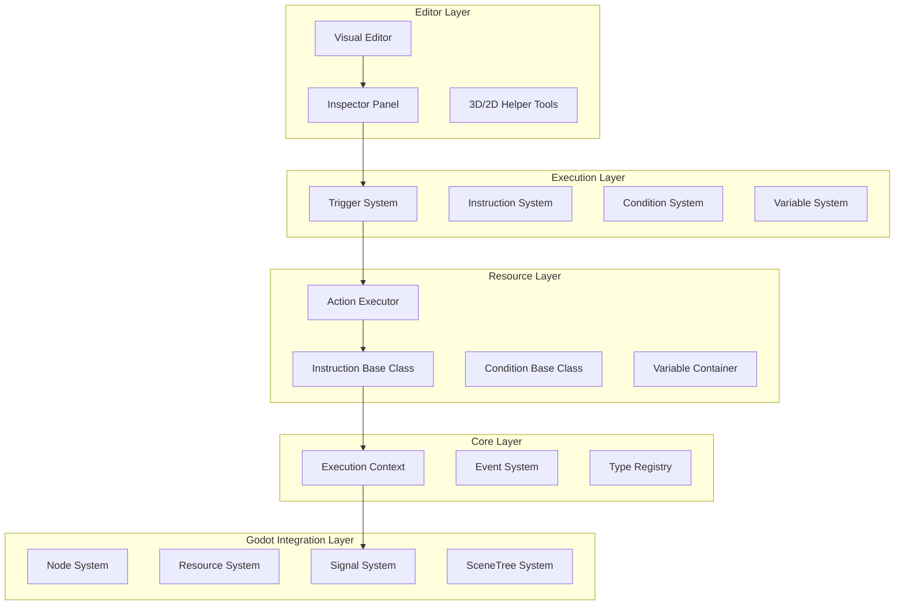
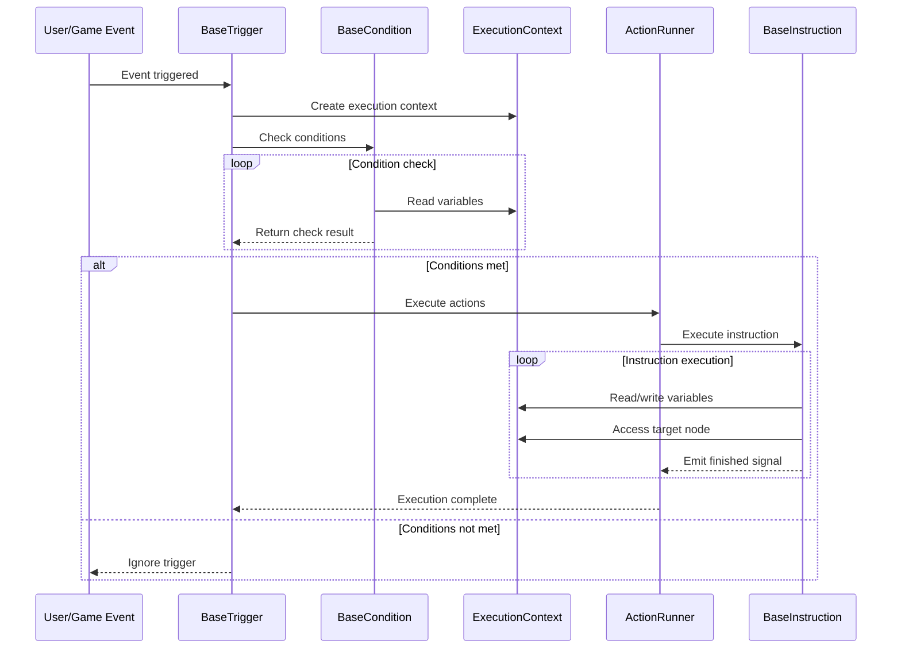
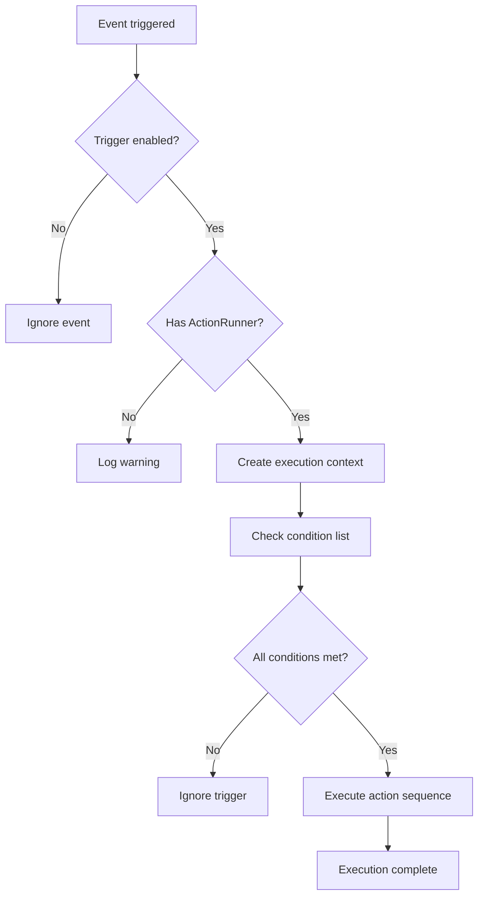
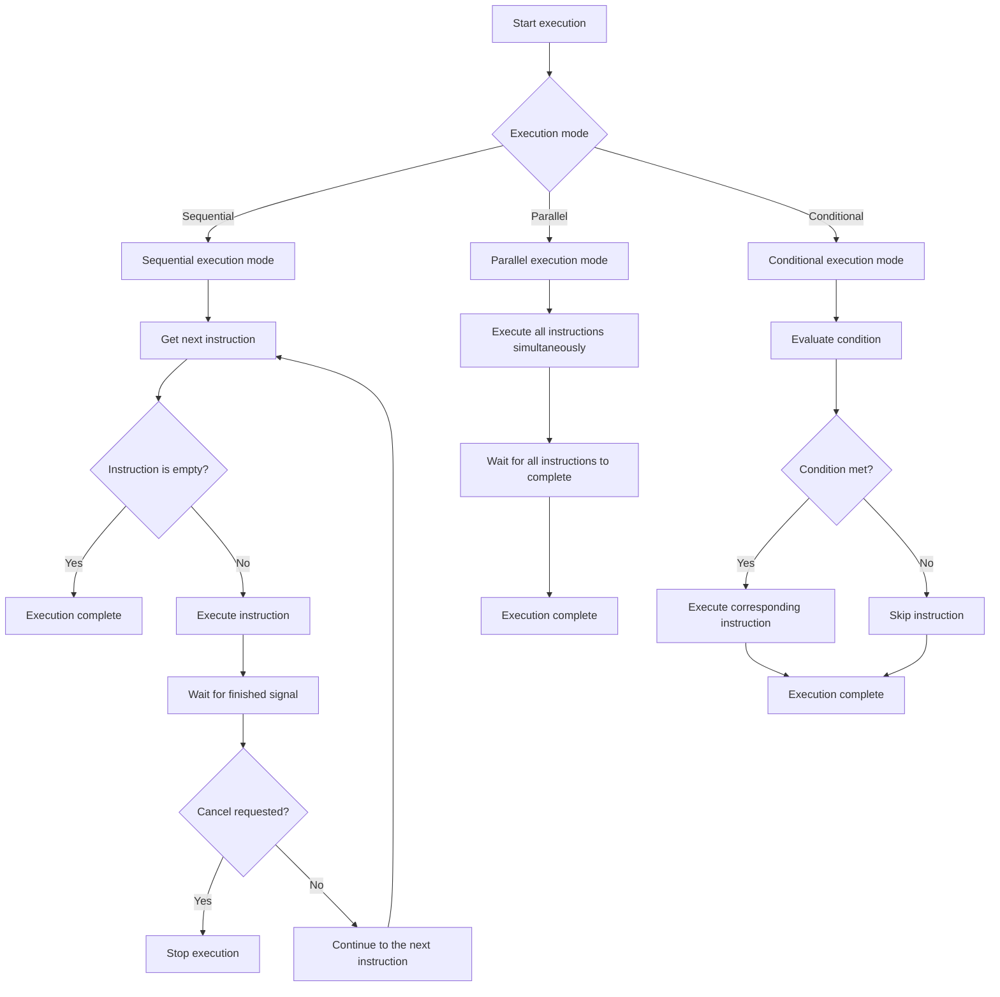
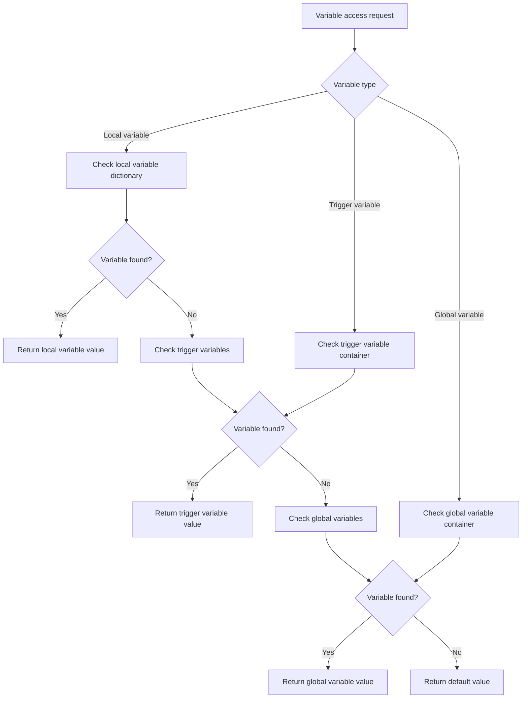

> 🌐 [**中文版**](../../../zh_CN/system_docs/architecture/visual_programming_system_architecture.md) | English

# Complete Architecture Design of the Godot 4.x Visual Programming System

## Table of Contents
1. [Overview of the Core Architecture Design](#1-overview-of-the-core-architecture-design)
2. [Main Components and Their Responsibilities](#2-main-components-and-their-responsibilities)
3. [Data Flow and Control Flow Design](#3-data-flow-and-control-flow-design)
4. [Extension Point Design](#4-extension-point-design)
5. [Integration with Godot Features](#5-integration-with-godot-features)

---

## 1. Overview of the Core Architecture Design

### 1.1 Design Philosophy

This architecture combines the advanced design concepts of GameCreator with the core features of Godot 4.x, creating a visual programming system that is both powerful and flexible. The core concepts include:

- **Resource-first**: Fully leverages Godot's Resource system for logic reuse and embedding
- **Signal-driven**: Builds on Godot's Signal system for event-driven asynchronous execution
- **Atomic design**: Each instruction performs a single responsibility; complex logic is built through composition
- **Type safety**: Leverages GDScript's type system for compile-time safety
- **Editor-native**: Deeply integrated with the Godot editor for an intuitive visual experience

### 1.2 Overall Architecture Diagram



### 1.3 Core Design Principles

#### 1.3.1 Separation of Resources and Nodes
- **Resource**: Stores reusable logic and data (instructions, conditions, variables)
- **Node**: Handles execution and interaction (triggers, executors)

#### 1.3.2 Async-First Execution Model
- All instruction execution is based on the Signal and await mechanisms
- Avoids blocking the main thread, ensuring smooth gameplay

#### 1.3.3 Context-Driven Parameter Passing
- A unified ExecutionContext provides the execution context
- Supports safe access to local and global variables

---

## 2. Main Components and Their Responsibilities

### 2.1 Core Resource Components

#### 2.1.1 BaseInstruction - Instruction Base Class

```gdscript
@tool
class_name BaseInstruction extends Resource
signal finished

## Instruction execution interface
## context: ExecutionContext - execution context
func execute(context: ExecutionContext):
    print("Executing: %s" % resource_path)
    finished.emit()

## Instruction validation interface
func validate() -> Array[String]:
    return []

## Instruction description
func get_description() -> String:
    return "Base Instruction"

## Instruction icon
func get_icon() -> Texture2D:
    return null
```

**Responsibilities**:
- Defines the basic interface and behavior common to all instructions
- Provides a unified execution-completion signal mechanism
- Supports instruction validation and descriptions

#### 2.1.2 ActionRunner - Action Executor

```gdscript
@tool
class_name ActionRunner extends Resource

@export var instructions: Array[BaseInstruction] = []
@export var execution_mode: ExecutionMode = ExecutionMode.SEQUENTIAL
@export var stop_on_error: bool = true

enum ExecutionMode { SEQUENTIAL, PARALLEL, CONDITIONAL }

var is_running: bool = false
var current_context: ExecutionContext = null

## Execute the instruction sequence
func run(context: ExecutionContext):
    if is_running:
        context.print_warning("ActionRunner is already running")
        return
    
    is_running = true
    current_context = context
    
    match execution_mode:
        ExecutionMode.SEQUENTIAL:
            await _run_sequential(context)
        ExecutionMode.PARALLEL:
            await _run_parallel(context)
        ExecutionMode.CONDITIONAL:
            await _run_conditional(context)
    
    is_running = false
    current_context = null

## Stop execution
func stop():
    if is_running and current_context:
        current_context.request_cancel()
```

**Responsibilities**:
- Manages the execution flow of instruction sequences
- Supports multiple execution modes (sequential, parallel, conditional)
- Provides execution state control and error handling

#### 2.1.3 BaseCondition - Condition Base Class

```gdscript
@tool
class_name BaseCondition extends Resource

## Condition check interface
## context: ExecutionContext - execution context
## returns: bool - whether the condition is met
func check(context: ExecutionContext) -> bool:
    return true

## Condition validation interface
func validate() -> Array[String]:
    return []

## Condition description
func get_description() -> String:
    return "Base Condition"

## Condition icon
func get_icon() -> Texture2D:
    return null
```

**Responsibilities**:
- Defines the basic interface for condition checks
- Supports composition of complex conditional logic
- Provides condition validation and descriptions

### 2.2 Core Node Components

#### 2.2.1 BaseTrigger - Trigger Base Class

```gdscript
@tool
class_name BaseTrigger extends Node

@export var action_runner: ActionRunner
@export var conditions: Array[BaseCondition] = []
@export var local_variables: VariableContainer = null
@export var enabled: bool = true

var execution_context: ExecutionContext = null

## Trigger action execution
func trigger_actions(target: Node = null):
    if not enabled or not action_runner:
        return
    
    # Create the execution context
    execution_context = ExecutionContext.new(self, target)
    
    # Check conditions
    if not _check_conditions(execution_context):
        return
    
    # Execute actions
    action_runner.run(execution_context)

## Check all conditions
func _check_conditions(context: ExecutionContext) -> bool:
    for condition in conditions:
        if condition and not condition.check(context):
            return false
    return true
```

**Responsibilities**:
- Serves as the entry point of the event system
- Manages local variables and the execution context
- Coordinates condition checks and action execution

#### 2.2.2 ExecutionContext - Execution Context

```gdscript
@tool
class_name ExecutionContext extends RefCounted

var trigger: BaseTrigger
var target: Node
var local_variables: Dictionary = {}
var global_variables: VariableContainer
var is_cancelled: bool = false

signal cancel_requested

func _init(trigger_node: BaseTrigger, target_node: Node = null):
    trigger = trigger_node
    target = target_node
    global_variables = VariableManager.get_global_variables()

## Get a variable value
func get_variable(name: String, default_value = null):
    # Priority: local variables > trigger variables > global variables
    if local_variables.has(name):
        return local_variables[name]
    elif trigger and trigger.local_variables and trigger.local_variables.has(name):
        return trigger.local_variables.get(name)
    elif global_variables and global_variables.has(name):
        return global_variables.get(name)
    return default_value

## Set a variable value
func set_variable(name: String, value):
    if local_variables.has(name):
        local_variables[name] = value
    elif trigger and trigger.local_variables:
        trigger.local_variables.set(name, value)
    elif global_variables:
        global_variables.set(name, value)

## Request cancellation of execution
func request_cancel():
    is_cancelled = true
    cancel_requested.emit()

## Print a log message
func print_message(message: String, type: String = "INFO"):
    var prefix = "[VisualScript][%s]" % trigger.name if trigger else "[VisualScript]"
    match type:
        "ERROR":
            push_error("%s %s" % [prefix, message])
        "WARNING":
            push_warning("%s %s" % [prefix, message])
        _:
            print("%s %s" % [prefix, message])
```

**Responsibilities**:
- Provides a unified execution context environment
- Manages variable access and modification
- Supports execution cancellation and logging

### 2.3 Variable System Components

#### 2.3.1 VariableContainer - Variable Container

```gdscript
@tool
class_name VariableContainer extends Resource

@export var variables: Dictionary = {}

## Get a variable value
func get(name: String, default_value = null):
    return variables.get(name, default_value)

## Set a variable value
func set(name: String, value):
    variables[name] = value

## Check whether a variable exists
func has(name: String) -> bool:
    return variables.has(name)

## Delete a variable
func erase(name: String):
    variables.erase(name)

## Get all variable names
func get_variable_names() -> Array[String]:
    return variables.keys()

## Clear all variables
func clear():
    variables.clear()
```

**Responsibilities**:
- Provides type-safe variable storage and access
- Supports variable create, delete, update, and query operations
- Serves as the unified container for local and global variables

#### 2.3.2 VariableManager - Variable Manager

```gdscript
@tool
class_name VariableManager extends Node

static var instance: VariableManager
var global_variables: VariableContainer

func _init():
    if not instance:
        instance = self
        global_variables = VariableContainer.new()

## Get the global variable container
static func get_global_variables() -> VariableContainer:
    if not instance:
        instance = VariableManager.new()
    return instance.global_variables

## Create a variable container
static func create_container() -> VariableContainer:
    return VariableContainer.new()
```

**Responsibilities**:
- Manages the lifecycle of global variables
- Provides interfaces for creating and accessing variable containers
- Implements the singleton pattern to ensure global uniqueness

---

## 3. Data Flow and Control Flow Design

### 3.1 Data Flow Diagram



### 3.2 Control Flow Design

#### 3.2.1 Trigger Control Flow



#### 3.2.2 Instruction Execution Control Flow



### 3.3 Variable Access Flow



---

## 4. Extension Point Design

### 4.1 Instruction System Extension Points

#### 4.1.1 Custom Instruction Interface

```gdscript
@tool
class_name CustomInstruction extends BaseInstruction

@export_group("Custom Settings")
@export var custom_property: String = ""
@export var target_node: NodePath

func execute(context: ExecutionContext):
    # Custom execution logic
    var node = context.get_node(target_node)
    if node:
        # Perform the custom operation
        _perform_custom_action(node, context)
    
    finished.emit()

func _perform_custom_action(node: Node, context: ExecutionContext):
    # Subclasses implement the concrete logic
    pass

func get_description() -> String:
    return "Custom Instruction: %s" % custom_property
```

#### 4.1.2 Instruction Registration System

```gdscript
@tool
class_name InstructionRegistry extends RefCounted

static var registered_instructions: Dictionary = {}

## Register an instruction type
static func register_instruction(instruction_name: String, instruction_script: Script):
    registered_instructions[instruction_name] = instruction_script

## Get all registered instructions
static func get_registered_instructions() -> Dictionary:
    return registered_instructions

## Create an instruction instance
static func create_instruction(instruction_name: String) -> BaseInstruction:
    var script = registered_instructions.get(instruction_name)
    if script:
        return script.new()
    return null

## Automatically discover and register instructions
static func auto_register_instructions():
    var directory = DirAccess.open("res://addons/visual_programming/instructions/")
    if directory:
        _scan_directory_for_instructions(directory)
```

### 4.2 Trigger System Extension Points

#### 4.2.1 Custom Trigger Base Class

```gdscript
@tool
class_name CustomTrigger extends BaseTrigger

@export_group("Trigger Settings")
@export var trigger_event: String = "custom_event"
@export var target_group: String = ""

func _ready():
    super._ready()
    _setup_custom_listeners()

func _setup_custom_listeners():
    # Subclasses implement the concrete event listening logic
    pass

func _on_custom_event_occurred(data: Dictionary = {}):
    # Handle the custom event
    trigger_actions(data.get("target", null))
```

#### 4.2.2 Generic Signal Trigger

```gdscript
@tool
class_name TriggerOnSignal extends BaseTrigger

@export_group("Signal Settings")
@export var signal_source: NodePath
@export var signal_name: String = ""
@export var target_argument_index: int = 0

var source_node: Node = null

func _ready():
    super._ready()
    _connect_to_signal()

func _connect_to_signal():
    if signal_name.is_empty():
        return
    
    source_node = get_node_or_null(signal_source)
    if source_node:
        if not source_node.has_signal(signal_name):
            print_warning("Node %s does not have signal: %s" % [source_node.name, signal_name])
            return
        
        # Dynamically connect to the specified signal
        source_node.connect(signal_name, _on_signal_triggered)

func _on_signal_triggered(...):
    var args = Array([...])
    var target = null
    
    if target_argument_index >= 0 and target_argument_index < args.size():
        target = args[target_argument_index]
    
    trigger_actions(target)
```

### 4.3 Condition System Extension Points

#### 4.3.1 Composite Conditions

```gdscript
@tool
class_name CompositeCondition extends BaseCondition

@export_group("Composite Settings")
@export var logical_operator: LogicalOperator = LogicalOperator.AND
@export var sub_conditions: Array[BaseCondition] = []

enum LogicalOperator { AND, OR, NOT, NAND, NOR }

func check(context: ExecutionContext) -> bool:
    match logical_operator:
        LogicalOperator.AND:
            return _check_and(context)
        LogicalOperator.OR:
            return _check_or(context)
        LogicalOperator.NOT:
            return _check_not(context)
        LogicalOperator.NAND:
            return not _check_and(context)
        LogicalOperator.NOR:
            return not _check_or(context)
    return false

func _check_and(context: ExecutionContext) -> bool:
    for condition in sub_conditions:
        if condition and not condition.check(context):
            return false
    return true

func _check_or(context: ExecutionContext) -> bool:
    for condition in sub_conditions:
        if condition and condition.check(context):
            return true
    return false

func _check_not(context: ExecutionContext) -> bool:
    if sub_conditions.size() > 0:
        return not sub_conditions[0].check(context)
    return true
```

### 4.4 Editor Extension Points

#### 4.4.1 Custom Inspector Plugin

```gdscript
@tool
@icon("res://addons/visual_programming/icons/visual_script_editor.svg")
extends EditorInspectorPlugin

const ActionRunnerEditor = preload("res://addons/visual_programming/editor/action_runner_editor.gd")

func _can_handle(object):
    return object is ActionRunner

func _parse_begin(object):
    var editor = ActionRunnerEditor.new()
    editor.set_object(object)
    add_custom_control(editor)
```

#### 4.4.2 Visual Editor

```gdscript
@tool
class_name VisualScriptEditor extends Control

var current_action_runner: ActionRunner
var instruction_library: VBoxContainer
var workspace: Control

func _ready():
    _setup_ui()
    _load_instruction_library()

func _setup_ui():
    # Create the editor UI
    var split_container = HSplitContainer.new()
    add_child(split_container)
    
    # Left: instruction library
    instruction_library = VBoxContainer.new()
    instruction_library.custom_minimum_size.x = 200
    split_container.add_child(instruction_library)
    
    # Right: workspace
    workspace = Control.new()
    split_container.add_child(workspace)

func _load_instruction_library():
    # Load all available instructions
    var instructions = InstructionRegistry.get_registered_instructions()
    for instruction_name in instructions.keys():
        var button = Button.new()
        button.text = instruction_name
        button.pressed.connect(_on_instruction_button_pressed.bind(instruction_name))
        instruction_library.add_child(button)

func _on_instruction_button_pressed(instruction_name: String):
    # Create an instruction and add it to the current ActionRunner
    var instruction = InstructionRegistry.create_instruction(instruction_name)
    if instruction and current_action_runner:
        current_action_runner.instructions.append(instruction)
        _refresh_workspace()
```

---

## 5. Integration with Godot Features

### 5.1 Deep Integration with the Resource System

#### 5.1.1 Resource Reuse Mechanism

```gdscript
@tool
class_name ResourceManager extends RefCounted

## Create a reusable ActionRunner
static func create_reusable_action_runner(name: String) -> ActionRunner:
    var action_runner = ActionRunner.new()
    action_runner.resource_name = name
    ResourceSaver.save(action_runner, "res://visual_scripts/%s.tres" % name)
    return action_runner

## Load a reusable ActionRunner
static func load_reusable_action_runner(name: String) -> ActionRunner:
    var path = "res://visual_scripts/%s.tres" % name
    if ResourceLoader.exists(path):
        return ResourceLoader.load(path)
    return null

## Create an embedded ActionRunner
static func create_embedded_action_runner() -> ActionRunner:
    return ActionRunner.new()
```

#### 5.1.2 Resource Version Management

```gdscript
@tool
class_name ResourceVersionManager extends RefCounted

## Resource version information
class ResourceVersion:
    var version: String
    var changelog: String
    var migration_script: Script

static var version_history: Dictionary = {}

## Register a resource version
static func register_version(resource_type: String, version_info: ResourceVersion):
    if not version_history.has(resource_type):
        version_history[resource_type] = []
    version_history[resource_type].append(version_info)

## Check whether a resource needs migration
static func needs_migration(resource: Resource, target_version: String) -> bool:
    var current_version = resource.get("version", "1.0.0")
    return current_version != target_version

## Perform resource migration
static func migrate_resource(resource: Resource, target_version: String) -> Resource:
    var resource_type = resource.get_class()
    var versions = version_history.get(resource_type, [])
    
    for version_info in versions:
        if version_info.version == target_version and version_info.migration_script:
            return version_info.migration_script.new().migrate(resource)
    
    return resource
```

### 5.2 Optimized Integration with the Signal System

#### 5.2.1 Signal Connection Manager

```gdscript
@tool
class_name SignalConnectionManager extends RefCounted

var active_connections: Array[Dictionary] = []

## Safely connect a signal
func connect_signal(source: Object, signal_name: String, target: Callable, flags: int = 0) -> Error:
    if not source or not source.has_signal(signal_name):
        return ERR_METHOD_NOT_FOUND
    
    var connection = {
        "source": source,
        "signal": signal_name,
        "target": target,
        "flags": flags
    }
    
    var result = source.connect(signal_name, target, flags)
    if result == OK:
        active_connections.append(connection)
    
    return result

## Disconnect all connections
func disconnect_all():
    for connection in active_connections:
        if connection.source and connection.source.is_connected(connection.signal, connection.target):
            connection.source.disconnect(connection.signal, connection.target)
    
    active_connections.clear()

## Clean up invalid connections
func cleanup_invalid_connections():
    var valid_connections = []
    for connection in active_connections:
        if connection.source and is_instance_valid(connection.source):
            valid_connections.append(connection)
    
    active_connections = valid_connections
```

#### 5.2.2 Asynchronous Execution Optimization

```gdscript
@tool
class_name AsyncExecutionManager extends Node

var active_tasks: Array[AsyncTask] = []
var max_concurrent_tasks: int = 10

## Asynchronous task class
class AsyncTask:
    var id: String
    var context: ExecutionContext
    var instruction: BaseInstruction
    var status: String = "pending"
    var start_time: float
    var end_time: float

## Execute an instruction asynchronously
func execute_async(instruction: BaseInstruction, context: ExecutionContext) -> String:
    # Check the concurrency limit
    if _get_running_task_count() >= max_concurrent_tasks:
        await _wait_for_task_completion()
    
    var task = AsyncTask.new()
    task.id = _generate_task_id()
    task.context = context
    task.instruction = instruction
    task.start_time = Time.get_ticks_msec()
    
    active_tasks.append(task)
    
    # Connect the finished signal
    instruction.finished.connect(_on_instruction_finished.bind(task.id))
    
    # Execute the instruction
    instruction.execute(context)
    
    return task.id

## Wait for task completion
func _on_instruction_finished(task_id: String):
    var task = _find_task(task_id)
    if task:
        task.status = "completed"
        task.end_time = Time.get_ticks_msec()
        active_tasks.erase(task)

## Get the number of running tasks
func _get_running_task_count() -> int:
    var count = 0
    for task in active_tasks:
        if task.status == "running":
            count += 1
    return count
```

### 5.3 NodePath System Integration

#### 5.3.1 Path Resolver

```gdscript
@tool
class_name NodePathResolver extends RefCounted

## Resolve a relative path
static func resolve_relative_path(context: ExecutionContext, path: NodePath) -> Node:
    if path.is_empty():
        return null
    
    var base_node = context.trigger if context.trigger else context.target
    if not base_node:
        return null
    
    return base_node.get_node_or_null(path)

## Resolve an absolute path
static func resolve_absolute_path(path: NodePath) -> Node:
    if path.is_empty():
        return null
    
    var scene_tree = Engine.get_main_loop() as SceneTree
    if not scene_tree or not scene_tree.current_scene:
        return null
    
    return scene_tree.current_scene.get_node_or_null(path)

## Resolve a group path
static func resolve_group_path(group_name: String) -> Array[Node]:
    var scene_tree = Engine.get_main_loop() as SceneTree
    if not scene_tree or not scene_tree.current_scene:
        return []
    
    return scene_tree.get_nodes_in_group(group_name)
```

#### 5.3.2 Path Validator

```gdscript
@tool
class_name NodePathValidator extends RefCounted

## Validate path validity
static func validate_path(context: ExecutionContext, path: NodePath) -> Dictionary:
    var result = {
        "valid": false,
        "node": null,
        "error": ""
    }
    
    if path.is_empty():
        result.error = "Path is empty"
        return result
    
    var node = NodePathResolver.resolve_relative_path(context, path)
    if not node:
        result.error = "Node not found at path: %s" % path
        return result
    
    result.valid = true
    result.node = node
    return result

## Validate the node type
static func validate_node_type(node: Node, expected_type: String) -> bool:
    if not node:
        return false
    
    return node.is_class(expected_type) or ClassDB.class_exists(expected_type) and node.get_script().get_base_script().get_global_name() == expected_type
```

### 5.4 SceneTree System Integration

#### 5.4.1 Scene Lifecycle Management

```gdscript
@tool
class_name SceneLifecycleManager extends Node

var active_triggers: Array[BaseTrigger] = []
var scene_state: String = "loading"

func _ready():
    scene_state = "ready"
    _notify_triggers_scene_ready()

func _enter_tree():
    scene_state = "entering"
    _notify_triggers_scene_entering()

func _exit_tree():
    scene_state = "exiting"
    _notify_triggers_scene_exiting()

## Register a trigger
func register_trigger(trigger: BaseTrigger):
    if trigger not in active_triggers:
        active_triggers.append(trigger)

## Unregister a trigger
func unregister_trigger(trigger: BaseTrigger):
    active_triggers.erase(trigger)

## Notify triggers that the scene is ready
func _notify_triggers_scene_ready():
    for trigger in active_triggers:
        if trigger.enabled:
            trigger.on_scene_ready()

## Notify triggers that the scene is entering
func _notify_triggers_scene_entering():
    for trigger in active_triggers:
        if trigger.enabled:
            trigger.on_scene_entering()

## Notify triggers that the scene is exiting
func _notify_triggers_scene_exiting():
    for trigger in active_triggers:
        if trigger.enabled:
            trigger.on_scene_exiting()
```

#### 5.4.2 Cross-Scene Communication

```gdscript
@tool
class_name CrossSceneCommunicator extends Node

static var instance: CrossSceneCommunicator
var scene_data: Dictionary = {}

func _init():
    if not instance:
        instance = self

## Set scene data
static func set_scene_data(scene_name: String, key: String, value):
    if instance:
        if not instance.scene_data.has(scene_name):
            instance.scene_data[scene_name] = {}
        instance.scene_data[scene_name][key] = value

## Get scene data
static func get_scene_data(scene_name: String, key: String, default_value = null):
    if instance and instance.scene_data.has(scene_name):
        return instance.scene_data[scene_name].get(key, default_value)
    return default_value

## Clear scene data
static func clear_scene_data(scene_name: String):
    if instance and instance.scene_data.has(scene_name):
        instance.scene_data.erase(scene_name)
```

### 5.5 Editor Tool Integration

#### 5.5.1 Custom Editor Plugin

```gdscript
@tool
extends EditorPlugin

const VisualScriptDock = preload("res://addons/visual_programming/editor/visual_script_dock.gd")
var visual_script_dock: Control

func _enter_tree():
    # Add custom types
    add_custom_type(
        "BaseTrigger",
        "Node",
        preload("res://addons/visual_programming/triggers/base_trigger.gd"),
        preload("res://addons/visual_programming/icons/trigger.svg")
    )
    
    add_custom_type(
        "ActionRunner",
        "Resource",
        preload("res://addons/visual_programming/core/action_runner.gd"),
        preload("res://addons/visual_programming/icons/action_runner.svg")
    )
    
    # Add the Inspector plugin
    add_inspector_plugin(preload("res://addons/visual_programming/editor/action_runner_inspector.gd").new())
    
    # Add the dock panel
    visual_script_dock = VisualScriptDock.new()
    add_control_to_dock(DOCK_SLOT_LEFT_UL, visual_script_dock)

func _exit_tree():
    # Remove custom types
    remove_custom_type("BaseTrigger")
    remove_custom_type("ActionRunner")
    
    # Remove the dock panel
    remove_control_from_docks(visual_script_dock)
    visual_script_dock.queue_free()
```

#### 5.5.2 Visual Editing UI

```gdscript
@tool
class_name VisualScriptDock extends Control

var scene_tree: Tree
var property_editor: Control
var toolbar: HBoxContainer

func _ready():
    _setup_ui()
    _connect_signals()

func _setup_ui():
    # Create the vertical layout
    var vbox = VBoxContainer.new()
    add_child(vbox)
    
    # Toolbar
    toolbar = HBoxContainer.new()
    vbox.add_child(toolbar)
    
    var new_trigger_btn = Button.new()
    new_trigger_btn.text = "New Trigger"
    new_trigger_btn.pressed.connect(_on_new_trigger_pressed)
    toolbar.add_child(new_trigger_btn)
    
    var new_action_btn = Button.new()
    new_action_btn.text = "New Action"
    new_action_btn.pressed.connect(_on_new_action_pressed)
    toolbar.add_child(new_action_btn)
    
    # Scene tree
    scene_tree = Tree.new()
    scene_tree.custom_minimum_size.y = 200
    vbox.add_child(scene_tree)
    
    # Property editor
    property_editor = Control.new()
    property_editor.custom_minimum_size.y = 300
    vbox.add_child(property_editor)

func _connect_signals():
    scene_tree.item_selected.connect(_on_tree_item_selected)
    scene_tree.item_activated.connect(_on_tree_item_activated)

func _on_tree_item_selected():
    var item = scene_tree.get_selected()
    if item:
        _show_properties(item.get_meta("object"))

func _on_tree_item_activated():
    var item = scene_tree.get_selected()
    if item:
        _focus_node_in_scene(item.get_meta("object"))

func _show_properties(object: Object):
    # Show the properties of the selected object
    pass

func _focus_node_in_scene(object: Object):
    # Focus the node in the scene
    pass
```

---

## Summary

This architecture fully combines the advanced design concepts of GameCreator with the core features of Godot 4.x, creating a visual programming system that is both powerful and flexible. Its main features include:

1. **Separation of resources and nodes**: Achieves logic reusability and embedding flexibility
2. **Async-first execution model**: Ensures smooth gameplay based on the Signal and await mechanisms
3. **Complete component system**: Covers core components such as instructions, triggers, conditions, and variables
4. **Powerful extension mechanism**: Supports custom instructions, triggers, conditions, and editor tools
5. **Deep Godot integration**: Makes full use of core features such as Resource, Signal, NodePath, and SceneTree

This architecture provides a complete visual programming solution for Godot 4.x, keeping the system simple while ensuring powerful functionality and good extensibility.

## Architecture Updates (2026-03)

- Added the Runtime Instance layer: RuntimeEventInstance, RuntimeInstructionInstance, RuntimeActionRunnerInstance
- Added a unified variable system: GlobalVariableAssistant + ScopeVariableContainer
- Added FuseError/FuseLogger infrastructure
- Trigger uses two-layer inheritance: Trigger extends BaseTrigger
- Detailed reference: `archive/architecture/runtime-instance-pattern.md`
