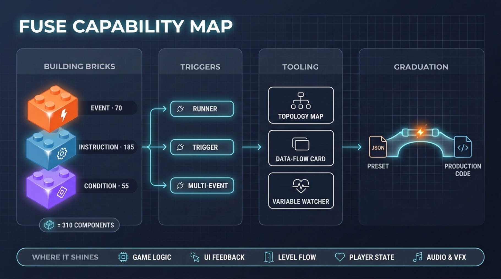

> 🌐 [**中文版**](../../../zh_CN/user_docs/Introductions/01-overview.md) | English

# Fuse Overview: A Non-destructive Bridge from Visual Prototyping to Production Code

By the end of this chapter you will have a complete capability map of Fuse. It answers three questions: how designers and artists who don't write code can "dial up" interaction logic in the Inspector; how developers who use AI can have AI directly generate compliant, verifiable logic configurations; and how engineering teams can smoothly "graduate" systems validated in prototypes into production code that no longer depends on the plugin. Behind all three paths sits the same model of Event / Instruction / Condition building blocks, and Fuse itself is a bridge that is safe in both directions — going up requires no project restructuring, and coming down you can roll back at any time.

## What Problem Does Fuse Solve

Let's start with the pain point. One of the most common forms of friction in indie game teams is a "logic development bottleneck" concentrated on one or two programmers. A designer may have a crystal-clear design in mind — "when the player steps on a trap: stun for 1.5 seconds, screen shake, lose 20 HP, play a hit sound effect" — but they can't write GDScript, so the requirement gets filed into a ticket queue waiting for a programmer. The programmer is busy fixing a physics collision bug and won't be free for three days. Three days later the feature ships, the designer plays it and the feel is off, and it's back to the back of the queue for another round. Artists face something similar: they want a button that pops up a panel with a little easing animation — something that could be done in ten minutes — but because it involves signal connections and Tween code, the artist can only open a ticket and wait.

Fuse moves this kind of logic implementation — the kind "everyone wants to touch, but only programmers can" — out of the code editor and into Godot's Inspector panel. Its core philosophy in one sentence: **place a trigger node in the scene, configure "when to act, what to do, and under what conditions to act" in the Inspector, let it execute automatically at runtime — no code writing at any point.**

That sentence describes the "outbound trip". Today's Fuse has grown into a two-way bridge: on the **prototype side**, AI can generate compliant preset JSON directly against the schema — offline validation, ready to use on import, with humans only reviewing and tuning parameters; on the **exit side**, systems that have been stabilized can be exported as structured handoff artifacts (system decomposition + behavior specs + component contracts) and handed to your AI agent to write production code independent of Fuse. Colleagues who don't write code stay in the runtime and keep tuning, the source Trigger is never touched, and everything can be rolled back at any time — that is what "non-destructive" means. The final chapter of this series (Chapter 16) walks through this graduation path in detail.

This is a visual programming plugin running on Godot 4.7+. The plugin itself is a complete system of hundreds of GDScript files, but to the designer on your team its meaning is simple: they open the Inspector, fill in a few dropdowns, and the logic runs.

## Understanding Fuse's Core Model in Four Sentences

All of Fuse's capability converges into "three stages + one exit". Once you grasp that, everything else is detail:

**When to act (When) — Events.** Decides at what moment a piece of logic gets triggered. Fuse provides 70 events, grouped into a dozen-plus categories such as input, physics, lifecycle, animation, UI, and timers: key, mouse, and gamepad input; collisions, raycasts, area entry; node entering the tree, scene ready, per-frame/timed intervals; animation playback, animation finished; button pressed, text changed, value changed; timers, countdowns, cooldown end; and Event Bus received events for cross-scene communication. In plain words: the Event answers "when does this logic wake up".

**What to do (What) — Instructions.** Decides what exactly gets executed after the trigger fires. Fuse ships 185 built-in instructions, grouped into twenty-plus categories such as variables and math, transforms, animation, Tween, audio, camera, UI, scene, data structures, and flow control: set variables and evaluate math expressions; move, rotate, and scale nodes; play/stop/blend animations; Tween pop, shake, and fade effects; play sound effects, switch background music, crossfade; camera follow, shake, and zoom; UI text set, texture set, progress bar; scene switching, background scene loading, node instantiation; array add/remove/sort, dictionary merge and nested access; IfElse, ForLoop, WhileLoop, Wait. In plain words: the Instruction answers "what to do after waking up".

**Under what conditions to act (Condition).** Adds a gate before the "doing", deciding whether to actually execute. Fuse provides 55 conditions spread across twenty-plus subcategories: variable comparison, node existence, physics state (on floor, against wall, velocity direction), whether input is pressed, animation playback state, whether a time has arrived; and most importantly the composite conditions — CheckAll (AND), CheckAny (OR), CheckNot (NOT) — which nest and combine arbitrary conditions into complex decision trees like Lego bricks. In plain words: the Condition answers "should this really be done".

**How to hand off to AI and how to graduate (Graduation) — handoff artifacts.** The logic you build doesn't have to live only inside the plugin: AI generates preset JSON against the schema, validated and imported directly; stabilized systems export scene topology and system decomposition artifacts, packaged with behavior specs into a handoff bundle for the engineering-side AI agent to write Fuse-independent code. In plain words: this answers "where to go after the prototype is validated".

Many visual tools in the industry call these three kinds of components "nodes" or "bricks". In Fuse they are all fundamentally Godot Resources — they can be saved, duplicated, and reused across projects. Drag an Event, a few Instructions, and a Condition into the corresponding property slots in the Inspector, and a piece of logic takes shape.

## How Deep Do the Three Building Blocks Go

70 events, 185 instructions, 55 conditions — these numbers can feel abstract. Put them into a real scenario:

**Event coverage.** A side-scrolling platformer character needs key input events (left/right/jump/attack), physics collision events (stomping an enemy, hitting a trap, entering an area), animation events (switch back to idle when the attack animation finishes), sound events (play on hit), and lifecycle events (initialize state on spawn). That's over a dozen trigger scenarios, and each category has its own parameters — input events can distinguish the press instant, hold duration, and release instant; collision events can count only physical contact and ignore overlaps.

**Instruction coverage.** From the most basic variable read/write to animation control, Tween tweens, scene switching, audio playback, character physics movement, array and dictionary operations, and If/For/While flow control — the main needs of the interaction-logic layer are comprehensively covered. Instructions can be chained into sequences, paced with waits, and routed with branches, composing complete interaction flows.

**Condition composition.** A single condition is handy; the real power comes from composite judgments. "Player at wall AND holding right AND in mid-jump" triggers a wall rebound — three conditions nested into one decision node, without writing a single line of `if`.

Fuse's total capability footprint is **70 Events + 185 Instructions + 55 Conditions = 310 independent capability units**, spread across more than 50 categories. *Component counts are subject to `addons/fuse/preset_ai_context/fuse_components.json` and change with versions.*

## Three Trigger Types: Your First Step in Building Logic

With bricks in hand, you still need an "assembly bench". Fuse provides three trigger types, each covering different building scenarios:

**Runner (action executor).** The lightest option. Attach it to any node, add the instructions you want to run, then in the Inspector pick the `target_node`, and choose the signal you want to listen to from the `signal_name` dropdown; at runtime, whenever that signal is emitted, the logic inside the runner executes. Ideal for simple scenarios of "one node, one signal, one string of actions". You can also call it directly from script: `runner.run()` starts execution and `await runner.wait_completed()` waits for it to finish; you can even trigger another Runner from inside an Instruction sequence with the `RunRunner` instruction — the "function call" of visual logic.

**Trigger.** An upgraded version with debounce and lifecycle management. It supports `trigger_once` for fire-once behavior and `cooldown` for debounce — solving "the player standing in the trap area takes damage a dozen times a second". A Trigger also carries its own enabled/disabled state, so you can dynamically switch off a trigger while the logic is running.

**MultiEventTrigger (multi-event trigger).** When the same node needs to respond to multiple events (say, an NPC that responds to click-to-talk, responds to someone entering its range, and automatically acts when a timer expires), MultiEventTrigger lets you manage all events in a single component; right-click to merge similar events or split them into separate logic lines.

These three trigger types form a progression: "minimal configuration → with debounce → multi-event management". Real projects mix them: simple signals (button clicks, Timer timeout) use a Runner; anything needing event filtering or input events uses a Trigger; NPC behavior uses MultiEventTrigger.

## Your First Working Example in 5 Minutes: Button Click Prints Hello World

Is five minutes enough, from opening the editor to seeing the test result? Yes. Here are the steps:

1. Create a Button node in the scene.
2. Attach a Runner component to this Button (right-click Add Component → Fuse → Runner).
3. In the Runner's Inspector panel: set `target_node` to `../Button` (pointing at the button), set `signal_name` to `pressed` (the button-pressed signal).
4. Double-click `action_runner` to enter editing, in the `instructions` list click Add → pick **Print**, and type "Hello World from Fuse！" into `message`.

Run the scene, click the button, and the Output panel prints "Hello World from Fuse！". Not once did you open a `.gd` file. You just built your first piece of visual logic.

If you want it displayed on the game screen instead of only printed to the console, replace the Print instruction with **SetUIText**, point `target_node` at a Label node, and put the same text into `text` — it becomes a genuinely visible output on screen.

## Editor Integration: Fuse Is More Than Logic Building

We've covered how many bricks there are and how to assemble them; in real projects you also need a supporting toolset to manage, debug, and optimize all this visual logic:

**The Fuse Topology main screen.** In the Godot editor's top toolbar, Fuse has its own dedicated tab, side by side with 2D/3D/Script. Opening it shows a tree diagram of every Trigger/Runner in the current scene — each logic line occupies one node, and if a piece of logic is wrong (say, it references a variable that doesn't exist), the node gets a red/yellow marker with the specific error message on hover. This is a management tool with a global perspective.

**Inspector data-flow cards.** Select any Trigger or Runner and, beyond the usual property list, the Inspector shows a "data flow card" displaying that trigger's event source, instruction sequence, and condition tree — you can read the logic structure directly from the card without jumping around the node tree.

**The variable watcher.** At runtime you can watch variable values change in real time, with tabs per scope, double-click editing, a 60-second line-chart recording, and snapshot export — when logic doesn't behave as expected, opening the watcher to check variables is far faster than guessing blindly or sprinkling Print instructions.

These editor tools cover the complete workflow from building, inspection, and debugging to static analysis.

## Five Use Case Categories: Where Fuse Shines

**Category one: game logic and state management.** Character skill cooldowns, quest progress tracking, enemy AI state switching — these are Fuse's most common scenarios, built from Trigger + conditions + flow control instructions.

**Category two: UI interaction and feedback.** Button clicks popping panels, health changes triggering health bar animations, item pickups popping toast windows — with UI instructions paired with Tween animation instructions, a handful of bricks is enough to build interactions with feedback.

**Category three: level events and flow control.** The player walking into an area triggers story dialogue, defeating the boss opens a door, collecting all fragments unlocks a portal — the spatial judgment ability of events and conditions is a natural fit for this "trigger → judge → execute" style of level design.

**Category four: player state management.** Health, mana, experience, equipment, inventory — managed by the three-layer variable system (local, scope, global) plus the global variable persistence save system; a natural fit for RPGs.

**Category five: sound and VFX triggers.** Hit sound effects, background music crossfades, hit particles, screen shake — the audio and Tween instructions have been polished specifically for this kind of feedback.

There are also things Fuse is currently not good at: low-level render pipeline customization, highly custom physics solvers, real-time strategy with massive units squeezed frame by frame for performance — those belong back in code. Fuse's positioning is "cover the interaction-logic layer", not replace engine-level programming.

## The Full Picture of Fuse at a Glance

We've covered a lot in scattered fashion; now let's gather it together: on the left the three building blocks (Event 70 / Instruction 185 / Condition 55), in the middle the three trigger types, on the right the editor integrations and the five use case categories — this is the whole of Fuse, clear at a single glance.

Keep this panoramic framework in your head as the series' navigation map. Over the next fifteen chapters, each one drills into one region of this framework, taking it from "knowing it exists" to "being able to build things with it".

## Series Preview: What the Next Fifteen Chapters Cover

This is the opening of an entire series. I've planned it as sixteen chapters, covering the complete path from getting started, to production-grade engineering, to AI collaboration and graduation handoff:

- Three getting-started chapters (2 to 4): a five-minute working example, the three-layer variable system, the expression engine.
- Eight core system chapters (5 to 12): flow control and data structures, animation and Tween, character control, the UI/camera/audio trio, the event system in full, the condition system, scene and node management, the zero-code extension generator.
- Three advanced-moat chapters (13 to 15): the debugging system, the Topology main screen and static analysis, engineering and performance.
- One finale (16): AI collaboration and graduation handoff — the preset AI generation loop, topology export, system artifacts, one-click handoff packaging, completing the "return trip".

Every chapter comes with runnable examples and screenshots, and the moat features get extra weight. You don't need to read every chapter — pick by what you need right now.

**In the next chapter, I'll walk you through building your first genuinely runnable piece of game logic from scratch in five minutes.** How to set up a Runner, when a Trigger should step in, and how to merge multiple events with MultiEventTrigger — one chapter to make the selection decision tree for the three trigger types crystal clear. If today's Hello World gave you a feel for it, the next chapter is the step that turns it into something "you could put into a real project".
