# 条件系统详细设计

## 目录
1. [条件系统概述](#1-条件系统概述)
2. [核心条件类型](#2-核心条件类型)
3. [条件评估机制](#3-条件评估机制)
4. [条件组合逻辑](#4-条件组合逻辑)
5. [条件扩展框架](#5-条件扩展框架)
6. [内置条件实现](#6-内置条件实现)
7. [条件调试和优化](#7-条件调试和优化)

---

## 1. 条件系统概述

### 1.1 设计理念

条件系统是可视化编程系统的决策核心，负责评估各种游戏状态和逻辑条件。设计理念包括：

- **类型安全**：利用GDScript的类型系统确保条件评估的安全
- **高性能**：优化条件评估流程，支持短路评估
- **可组合性**：支持复杂条件的组合和嵌套
- **易于扩展**：提供简单的接口支持自定义条件
- **调试友好**：提供详细的条件评估信息

### 1.2 条件分类体系

```mermaid
graph TB
    BaseCondition[BaseCondition 基类]
    
    subgraph "变量条件 (Variable Conditions)"
        VariableCondition[变量条件]
        VariableCompareCondition[变量比较条件]
        VariableExistsCondition[变量存在条件]
        VariableTypeCondition[变量类型条件]
    end
    
    subgraph "节点条件 (Node Conditions)"
        CheckNodeExists[节点存在条件]
        NodeGroupCondition[节点组条件]
        NodePropertyCondition[节点属性条件]
        NodeDistanceCondition[节点距离条件]
    end
    
    subgraph "输入条件 (Input Conditions)"
        KeyPressedCondition[按键按下条件]
        InputActionCondition[输入动作条件]
        MousePositionCondition[鼠标位置条件]
        GestureCondition[手势条件]
    end
    
    subgraph "物理条件 (Physics Conditions)"
        AreaOverlapCondition[区域重叠条件]
        CollisionCondition[碰撞条件]
        VelocityCondition[速度条件]
        RaycastCondition[射线检测条件]
    end
    
    subgraph "时间条件 (Time Conditions)"
        TimeRangeCondition[时间范围条件]
        TimerCondition[定时器条件]
        CooldownCondition[冷却时间条件]
        IntervalCondition[间隔条件]
    end
    
    subgraph "游戏状态条件 (Game State Conditions)"
        SceneCondition[场景条件]
        GameStateCondition[游戏状态条件]
        LevelCondition[关卡条件]
        QuestCondition[任务条件]
    end
    
    subgraph "逻辑条件 (Logical Conditions)"
        AndCondition[与条件]
        OrCondition[或条件]
        NotCondition[非条件]
        XorCondition[异或条件]
    end
    
    subgraph "数学条件 (Mathematical Conditions)"
        CompareCondition[比较条件]
        RangeCondition[范围条件]
        RandomCondition[随机条件]
        ExpressionCondition[表达式条件]
    end
    
    subgraph "自定义条件 (Custom Conditions)"
        ScriptCondition[脚本条件]
        SignalCondition[信号条件]
        EventCondition[事件条件]
        NetworkCondition[网络条件]
    end
    
    BaseCondition --> 变量条件
    BaseCondition --> 节点条件
    BaseCondition --> 输入条件
    BaseCondition --> 物理条件
    BaseCondition --> 时间条件
    BaseCondition --> 游戏状态条件
    BaseCondition --> 逻辑条件
    BaseCondition --> 数学条件
    BaseCondition --> 自定义条件
```



---

## 2. 核心条件类型

### 2.1 基础条件类

```gdscript
@tool
class_name BaseCondition extends Resource
@icon("res://addons/visual_programming/icons/condition.svg")

## 条件配置
@export_group("Condition Settings")
@export var enabled: bool = true
@export var debug_mode: bool = false
@export var negate_result: bool = false

## 条件状态
var last_evaluation_time: float = 0.0
var last_result: bool = false
var evaluation_count: int = 0

## 条件评估接口
## context: ExecutionContext - 执行上下文
## returns: bool - 条件是否满足
func check(context: ExecutionContext) -> bool:
    if not enabled:
        _log_debug("Condition is disabled, returning false")
        return false
    
    evaluation_count += 1
    last_evaluation_time = Time.get_ticks_msec() / 1000.0
    
    var result = _evaluate_condition(context)
    
    # 应用否定
    if negate_result:
        result = not result
    
    last_result = result
    
    _log_debug("Condition evaluated: %s (negated: %s)" % [result, negate_result])
    
    return result

## 子类实现的具体评估逻辑
func _evaluate_condition(context: ExecutionContext) -> bool:
    return true

## 条件验证接口
func validate() -> Array[String]:
    return []

## 条件描述信息
func get_description() -> String:
    return "Base Condition"

## 条件图标
func get_icon() -> Texture2D:
    return null

## 获取条件状态信息
func get_status_info() -> Dictionary:
    return {
        "enabled": enabled,
        "last_evaluation_time": last_evaluation_time,
        "last_result": last_result,
        "evaluation_count": evaluation_count,
        "negate_result": negate_result
    }

## 调试日志
func _log_debug(message: String):
    if debug_mode:
        print("[DEBUG][Condition] %s: %s" % [get_description(), message])

func _log_warning(message: String):
    if debug_mode:
        push_warning("[WARNING][Condition] %s: %s" % [get_description(), message])

func _log_error(message: String):
    if debug_mode:
        push_error("[ERROR][Condition] %s: %s" % [get_description(), message])
```

### 2.2 变量条件

#### 2.2.1 变量比较条件

```gdscript
@tool
class_name VariableCompareCondition extends BaseCondition
@icon("res://addons/visual_programming/icons/variable_compare.svg")

@export_group("Variable Settings")
@export var variable_name: String = ""
@export_enum("Local", "Trigger", "Global") var variable_scope: int = 0
@export_group("Comparison Settings")
@export_enum("Equals", "Not Equals", "Greater Than", "Less Than", "Greater Equal", "Less Equal") var comparison_operator: int = 0
@export_group("Value Settings")
@export_enum("Literal", "Variable", "Expression") var value_source: int = 0
@export_enum("bool", "int", "float", "String", "Vector2", "Vector3", "Color") var value_type: int = 0
@export var bool_value: bool = false
@export var int_value: int = 0
@export var float_value: float = 0.0
@export var string_value: String = ""
@export var vector2_value: Vector2 = Vector2.ZERO
@export var vector3_value: Vector3 = Vector3.ZERO
@export var color_value: Color = Color.WHITE
@export var compare_variable_name: String = ""
@export var expression: String = ""

func _evaluate_condition(context: ExecutionContext) -> bool:
    if variable_name.is_empty():
        _log_error("Variable name is empty")
        return false
    
    var variable_value = _get_variable_value(context)
    var compare_value = _get_compare_value(context)
    
    var result = _compare_values(variable_value, compare_value)
    
    _log_debug("Variable comparison: %s %s %s = %s" % [
        variable_value,
        _get_operator_symbol(),
        compare_value,
        result
    ])
    
    return result

func _get_variable_value(context: ExecutionContext) -> Variant:
    match variable_scope:
        0: # Local
            return context.local_variables.get(variable_name, null)
        1: # Trigger
            if context.trigger and context.trigger.local_variables:
                return context.trigger.local_variables.get(variable_name, null)
        2: # Global
            if context.global_variables:
                return context.global_variables.get(variable_name, null)
    return null

func _get_compare_value(context: ExecutionContext) -> Variant:
    match value_source:
        0: # Literal
            match value_type:
                0: return bool_value
                1: return int_value
                2: return float_value
                3: return string_value
                4: return vector2_value
                5: return vector3_value
                6: return color_value
        1: # Variable
            return context.get_variable(compare_variable_name)
        2: # Expression
            return _evaluate_expression(context)
    return null

func _evaluate_expression(context: ExecutionContext) -> Variant:
    if expression.is_empty():
        return null
    
    var expr = Expression.new()
    var parse_result = expr.parse(expression)
    
    if parse_result != OK:
        _log_error("Failed to parse expression: %s" % expression)
        return null
    
    # 设置变量上下文
    for var_name in context.local_variables.keys():
        expr.set_input_value(var_name, context.local_variables[var_name])
    
    var result = expr.execute()
    if result is String:
        _log_error("Expression execution error: %s" % result)
        return null
    
    return result

func _compare_values(value1: Variant, value2: Variant) -> bool:
    # 类型检查
    if typeof(value1) != typeof(value2):
        _log_warning("Type mismatch in comparison: %s vs %s" % [typeof(value1), typeof(value2)])
        return false
    
    match comparison_operator:
        0: return value1 == value2  # Equals
        1: return value1 != value2  # Not Equals
        2: return value1 > value2   # Greater Than
        3: return value1 < value2   # Less Than
        4: return value1 >= value2  # Greater Equal
        5: return value1 <= value2  # Less Equal
    return false

func _get_operator_symbol() -> String:
    match comparison_operator:
        0: return "=="
        1: return "!="
        2: return ">"
        3: return "<"
        4: return ">="
        5: return "<="
    return "?"

func get_description() -> String:
    var scope_name = ["local", "trigger", "global"][variable_scope]
    var operator_symbol = _get_operator_symbol()
    var value_desc = ""
    
    match value_source:
        0: # Literal
            value_desc = str(_get_compare_value(null))
        1: # Variable
            value_desc = "variable: %s" % compare_variable_name
        2: # Expression
            value_desc = "expression: %s" % expression
    
    return "%s variable '%s' %s %s" % [scope_name, variable_name, operator_symbol, value_desc]

func validate() -> Array[String]:
    var errors: Array[String] = []
    
    if variable_name.is_empty():
        errors.append("Variable name cannot be empty")
    
    if value_source == 1 and compare_variable_name.is_empty():
        errors.append("Compare variable name cannot be empty when using variable as value source")
    
    if value_source == 2 and expression.is_empty():
        errors.append("Expression cannot be empty when using expression as value source")
    
    return errors
```

#### 2.2.2 变量存在条件

```gdscript
@tool
class_name VariableExistsCondition extends BaseCondition
@icon("res://addons/visual_programming/icons/variable_exists.svg")

@export_group("Variable Settings")
@export var variable_name: String = ""
@export_enum("Local", "Trigger", "Global") var variable_scope: int = 0
@export_group("Type Settings")
@export var check_type: bool = false
@export_enum("Any", "bool", "int", "float", "String", "Vector2", "Vector3", "Color", "Node", "Array", "Dictionary") var expected_type: int = 0

func _evaluate_condition(context: ExecutionContext) -> bool:
    if variable_name.is_empty():
        _log_error("Variable name is empty")
        return false
    
    var variable_value = _get_variable_value(context)
    var exists = variable_value != null
    
    if exists and check_type:
        var actual_type = _get_variable_type_index(variable_value)
        exists = actual_type == expected_type
    
    _log_debug("Variable '%s' exists: %s" % [variable_name, exists])
    
    return exists

func _get_variable_value(context: ExecutionContext) -> Variant:
    match variable_scope:
        0: # Local
            return context.local_variables.get(variable_name, null)
        1: # Trigger
            if context.trigger and context.trigger.local_variables:
                return context.trigger.local_variables.get(variable_name, null)
        2: # Global
            if context.global_variables:
                return context.global_variables.get(variable_name, null)
    return null

func _get_variable_type_index(value: Variant) -> int:
    if value is bool:
        return 1
    elif value is int:
        return 2
    elif value is float:
        return 3
    elif value is String:
        return 4
    elif value is Vector2:
        return 5
    elif value is Vector3:
        return 6
    elif value is Color:
        return 7
    elif value is Node:
        return 8
    elif value is Array:
        return 9
    elif value is Dictionary:
        return 10
    else:
        return 0  # Any

func get_description() -> String:
    var scope_name = ["local", "trigger", "global"][variable_scope]
    var type_desc = ""
    
    if check_type:
        var type_names = ["Any", "bool", "int", "float", "String", "Vector2", "Vector3", "Color", "Node", "Array", "Dictionary"]
        type_desc = " (type: %s)" % type_names[expected_type]
    
    return "%s variable '%s' exists%s" % [scope_name, variable_name, type_desc]

func validate() -> Array[String]:
    var errors: Array[String] = []
    
    if variable_name.is_empty():
        errors.append("Variable name cannot be empty")
    
    return errors
```

### 2.3 节点条件

#### 2.3.1 节点存在条件

```gdscript
@tool
class_name CheckNodeExists extends BaseCondition
@icon("res://addons/visual_programming/icons/node_exists.svg")

@export_group("Node Settings")
@export var node_path: NodePath
@export_enum("Relative to Trigger", "Relative to Target", "Absolute") var path_type: int = 0
@export_group("Filter Settings")
@export var check_type: bool = false
@export var expected_type: String = "Node"
@export var check_group: bool = false
@export var required_group: String = ""

func _evaluate_condition(context: ExecutionContext) -> bool:
    var node = _get_target_node(context)
    var exists = node != null
    
    if exists:
        if check_type:
            exists = _check_node_type(node)
        
        if exists and check_group:
            exists = node.is_in_group(required_group)
    
    _log_debug("Node '%s' exists: %s" % [node_path, exists])
    
    return exists

func _get_target_node(context: ExecutionContext) -> Node:
    if node_path.is_empty():
        return null
    
    var base_node: Node
    
    match path_type:
        0: # Relative to Trigger
            base_node = context.trigger
        1: # Relative to Target
            base_node = context.target
        2: # Absolute
            base_node = context.get_tree().current_scene
    
    if not base_node:
        return null
    
    return base_node.get_node_or_null(node_path)

func _check_node_type(node: Node) -> bool:
    if expected_type == "Node":
        return true
    
    # 检查类名
    if node.get_class() == expected_type:
        return true
    
    # 检查脚本类名
    if node.get_script():
        var script_class = node.get_script().get_global_name()
        if script_class == expected_type:
            return true
    
    # 检查继承关系
    return ClassDB.class_exists(expected_type) and node.is_class(expected_type)

func get_description() -> String:
    var path_desc = ""
    
    match path_type:
        0: path_desc = "relative to trigger"
        1: path_desc = "relative to target"
        2: path_desc = "absolute"
    
    var filter_desc = ""
    
    if check_type:
        filter_desc += " (type: %s)" % expected_type
    
    if check_group:
        filter_desc += " (group: %s)" % required_group
    
    return "Node '%s' exists (%s)%s" % [node_path, path_desc, filter_desc]

func validate() -> Array[String]:
    var errors: Array[String] = []
    
    if node_path.is_empty():
        errors.append("Node path cannot be empty")
    
    if check_group and required_group.is_empty():
        errors.append("Required group cannot be empty when checking group")
    
    return errors
```

#### 2.3.2 节点距离条件

```gdscript
@tool
class_name NodeDistanceCondition extends BaseCondition
@icon("res://addons/visual_programming/icons/node_distance.svg")

@export_group("Node Settings")
@export var node_a_path: NodePath
@export var node_b_path: NodePath
@export_enum("Relative to Trigger", "Relative to Target", "Absolute") var path_type: int = 0
@export_group("Distance Settings")
@export_enum("Less Than", "Greater Than", "Equals", "Range") var comparison_type: int = 0
@export var distance_threshold: float = 10.0
@export var min_distance: float = 5.0
@export var max_distance: float = 15.0
@export_group("Advanced Settings")
@export var use_2d_distance: bool = false
@export var ignore_y_axis: bool = false

func _evaluate_condition(context: ExecutionContext) -> bool:
    var node_a = _get_node(node_a_path, context)
    var node_b = _get_node(node_b_path, context)
    
    if not node_a or not node_b:
        _log_error("One or both nodes not found")
        return false
    
    var distance = _calculate_distance(node_a, node_b)
    var result = _compare_distance(distance)
    
    _log_debug("Distance between nodes: %.2f, condition: %s" % [distance, result])
    
    return result

func _get_node(node_path: NodePath, context: ExecutionContext) -> Node:
    if node_path.is_empty():
        return null
    
    var base_node: Node
    
    match path_type:
        0: # Relative to Trigger
            base_node = context.trigger
        1: # Relative to Target
            base_node = context.target
        2: # Absolute
            base_node = context.get_tree().current_scene
    
    if not base_node:
        return null
    
    return base_node.get_node_or_null(node_path)

func _calculate_distance(node_a: Node, node_b: Node) -> float:
    var pos_a: Vector3
    var pos_b: Vector3
    
    if use_2d_distance:
        pos_a = Vector3((node_a as Node2D).global_position.x, (node_a as Node2D).global_position.y, 0) if node_a is Node2D else node_a.global_position
        pos_b = Vector3((node_b as Node2D).global_position.x, (node_b as Node2D).global_position.y, 0) if node_b is Node2D else node_b.global_position
    else:
        pos_a = node_a.global_position if node_a is Node3D else Vector3((node_a as Node2D).global_position.x, (node_a as Node2D).global_position.y, 0)
        pos_b = node_b.global_position if node_b is Node3D else Vector3((node_b as Node2D).global_position.x, (node_b as Node2D).global_position.y, 0)
    
    if ignore_y_axis:
        pos_a.y = 0
        pos_b.y = 0
    
    return pos_a.distance_to(pos_b)

func _compare_distance(distance: float) -> bool:
    match comparison_type:
        0: return distance < distance_threshold  # Less Than
        1: return distance > distance_threshold  # Greater Than
        2: return abs(distance - distance_threshold) < 0.001  # Equals
        3: return distance >= min_distance and distance <= max_distance  # Range
    return false

func get_description() -> String:
    var path_desc = ["relative to trigger", "relative to target", "absolute"][path_type]
    var comparison_desc = ["<", ">", "=", "range"][comparison_type]
    
    match comparison_type:
        0, 1, 2:
            return "Distance between nodes %s %.1f (%s)" % [comparison_desc, distance_threshold, path_desc]
        3:
            return "Distance between nodes in range [%.1f, %.1f] (%s)" % [min_distance, max_distance, path_desc]
    return ""

func validate() -> Array[String]:
    var errors: Array[String] = []
    
    if node_a_path.is_empty():
        errors.append("Node A path cannot be empty")
    
    if node_b_path.is_empty():
        errors.append("Node B path cannot be empty")
    
    if distance_threshold < 0:
        errors.append("Distance threshold cannot be negative")
    
    if min_distance < 0 or max_distance < 0:
        errors.append("Distance range values cannot be negative")
    
    if min_distance > max_distance:
        errors.append("Min distance cannot be greater than max distance")
    
    return errors
```

### 2.4 逻辑条件

#### 2.4.1 与条件

```gdscript
@tool
class_name AndCondition extends BaseCondition
@icon("res://addons/visual_programming/icons/and_condition.svg")

@export_group("Condition Settings")
@export var sub_conditions: Array[BaseCondition] = []
@export var short_circuit: bool = true

func _evaluate_condition(context: ExecutionContext) -> bool:
    if sub_conditions.is_empty():
        _log_warning("No sub-conditions specified, returning true")
        return true
    
    for condition in sub_conditions:
        if not condition:
            continue
        
        var result = condition.check(context)
        
        if not result:
            _log_debug("Condition failed: %s" % condition.get_description())
            if short_circuit:
                return false
        
        _log_debug("Condition passed: %s" % condition.get_description())
    
    _log_debug("All conditions passed")
    return true

func get_description() -> String:
    if sub_conditions.is_empty():
        return "AND (empty)"
    
    var descriptions = []
    for condition in sub_conditions:
        if condition:
            descriptions.append(condition.get_description())
    
    return "AND [%s]" % descriptions.join(", ")

func validate() -> Array[String]:
    var errors: Array[String] = []
    
    if sub_conditions.is_empty():
        errors.append("AND condition requires at least one sub-condition")
    
    for i in range(sub_conditions.size()):
        var condition = sub_conditions[i]
        if not condition:
            errors.append("Sub-condition %d is null" % i)
        else:
            errors.append_array(condition.validate())
    
    return errors
```

#### 2.4.2 或条件

```gdscript
@tool
class_name OrCondition extends BaseCondition
@icon("res://addons/visual_programming/icons/or_condition.svg")

@export_group("Condition Settings")
@export var sub_conditions: Array[BaseCondition] = []
@export var short_circuit: bool = true

func _evaluate_condition(context: ExecutionContext) -> bool:
    if sub_conditions.is_empty():
        _log_warning("No sub-conditions specified, returning false")
        return false
    
    for condition in sub_conditions:
        if not condition:
            continue
        
        var result = condition.check(context)
        
        if result:
            _log_debug("Condition passed: %s" % condition.get_description())
            if short_circuit:
                return true
        
        _log_debug("Condition failed: %s" % condition.get_description())
    
    _log_debug("All conditions failed")
    return false

func get_description() -> String:
    if sub_conditions.is_empty():
        return "OR (empty)"
    
    var descriptions = []
    for condition in sub_conditions:
        if condition:
            descriptions.append(condition.get_description())
    
    return "OR [%s]" % descriptions.join(", ")

func validate() -> Array[String]:
    var errors: Array[String] = []
    
    if sub_conditions.is_empty():
        errors.append("OR condition requires at least one sub-condition")
    
    for i in range(sub_conditions.size()):
        var condition = sub_conditions[i]
        if not condition:
            errors.append("Sub-condition %d is null" % i)
        else:
            errors.append_array(condition.validate())
    
    return errors
```

---

## 3. 条件评估机制

### 3.1 条件评估器

```gdscript
@tool
class_name ConditionEvaluator extends RefCounted

## 评估结果
class EvaluationResult:
    var condition: BaseCondition
    var result: bool
    var evaluation_time: float
    var error_message: String = ""

## 评估配置
class EvaluationConfig:
    var enable_short_circuit: bool = true
    var enable_caching: bool = true
    var cache_timeout: float = 0.1
    var enable_profiling: bool = false

var evaluation_cache: Dictionary = {}
var config: EvaluationConfig

func _init():
    config = EvaluationConfig.new()

## 评估单个条件
func evaluate_condition(condition: BaseCondition, context: ExecutionContext) -> EvaluationResult:
    var result = EvaluationResult.new()
    result.condition = condition
    
    if not condition:
        result.error_message = "Condition is null"
        return result
    
    # 检查缓存
    if config.enable_caching:
        var cached_result = _get_cached_result(condition, context)
        if cached_result != null:
            result.result = cached_result
            return result
    
    var start_time = Time.get_ticks_msec() / 1000.0
    
    try:
        result.result = condition.check(context)
    except:
        result.error_message = "Exception during condition evaluation"
        result.result = false
    
    result.evaluation_time = Time.get_ticks_msec() / 1000.0 - start_time
    
    # 缓存结果
    if config.enable_caching and result.error_message.is_empty():
        _cache_result(condition, context, result.result)
    
    return result

## 评估条件列表
func evaluate_conditions(conditions: Array[BaseCondition], context: ExecutionContext) -> Array[EvaluationResult]:
    var results: Array[EvaluationResult] = []
    
    for condition in conditions:
        var result = evaluate_condition(condition, context)
        results.append(result)
        
        # 短路评估
        if config.enable_short_circuit and not result.result:
            break
    
    return results

## 获取缓存结果
func _get_cached_result(condition: BaseCondition, context: ExecutionContext) -> bool:
    var cache_key = _generate_cache_key(condition, context)
    var cache_entry = evaluation_cache.get(cache_key)
    
    if not cache_entry:
        return null
    
    var current_time = Time.get_ticks_msec() / 1000.0
    if current_time - cache_entry.timestamp > config.cache_timeout:
        evaluation_cache.erase(cache_key)
        return null
    
    return cache_entry.result

## 缓存结果
func _cache_result(condition: BaseCondition, context: ExecutionContext, result: bool):
    var cache_key = _generate_cache_key(condition, context)
    var cache_entry = {
        "result": result,
        "timestamp": Time.get_ticks_msec() / 1000.0
    }
    
    evaluation_cache[cache_key] = cache_entry
    
    # 限制缓存大小
    if evaluation_cache.size() > 1000:
        _cleanup_cache()

## 生成缓存键
func _generate_cache_key(condition: BaseCondition, context: ExecutionContext) -> String:
    var key_parts = [
        condition.get_instance_id(),
        str(context.trigger.get_instance_id()) if context.trigger else "null",
        str(context.target.get_instance_id()) if context.target else "null",
        str(context.local_variables.hash())
    ]
    return key_parts.join("_")

## 清理缓存
func _cleanup_cache():
    var oldest_key = ""
    var oldest_time = INF
    
    for key in evaluation_cache.keys():
        var cache_entry = evaluation_cache[key]
        if cache_entry.timestamp < oldest_time:
            oldest_time = cache_entry.timestamp
            oldest_key = key
    
    if not oldest_key.is_empty():
        evaluation_cache.erase(oldest_key)

## 清空缓存
func clear_cache():
    evaluation_cache.clear()

## 设置评估配置
func set_config(new_config: EvaluationConfig):
    config = new_config
```

### 3.2 条件组合器

```gdscript
@tool
class_name ConditionCombiner extends RefCounted

## 组合类型
enum CombinationType {
    AND,
    OR,
    NAND,
    NOR,
    XOR,
    MAJORITY
}

## 组合单个条件
func combine_conditions(
    conditions: Array[BaseCondition],
    combination_type: CombinationType,
    context: ExecutionContext
) -> bool:
    match combination_type:
        CombinationType.AND:
            return _combine_and(conditions, context)
        CombinationType.OR:
            return _combine_or(conditions, context)
        CombinationType.NAND:
            return not _combine_and(conditions, context)
        CombinationType.NOR:
            return not _combine_or(conditions, context)
        CombinationType.XOR:
            return _combine_xor(conditions, context)
        CombinationType.MAJORITY:
            return _combine_majority(conditions, context)
    return false

## AND组合
func _combine_and(conditions: Array[BaseCondition], context: ExecutionContext) -> bool:
    for condition in conditions:
        if not condition or not condition.check(context):
            return false
    return true

## OR组合
func _combine_or(conditions: Array[BaseCondition], context: ExecutionContext) -> bool:
    for condition in conditions:
        if condition and condition.check(context):
            return true
    return false

## XOR组合
func _combine_xor(conditions: Array[BaseCondition], context: ExecutionContext) -> bool:
    var true_count = 0
    for condition in conditions:
        if condition and condition.check(context):
            true_count += 1
    return true_count == 1

## 多数组合
func _combine_majority(conditions: Array[BaseCondition], context: ExecutionContext) -> bool:
    if conditions.is_empty():
        return false
    
    var true_count = 0
    for condition in conditions:
        if condition and condition.check(context):
            true_count += 1
    
    return true_count > conditions.size() / 2.0

## 复杂组合
func combine_complex(
    condition_groups: Array[Array[BaseCondition]],
    group_operators: Array[CombinationType],
    context: ExecutionContext
) -> bool:
    if condition_groups.is_empty():
        return false
    
    var group_results = []
    
    # 评估每个条件组
    for group in condition_groups:
        var group_result = true  # 默认AND组合
        if group.size() > 0:
            group_result = _combine_and(group, context)
        group_results.append(group_result)
    
    # 组合组结果
    if group_results.size() == 1:
        return group_results[0]
    
    var final_result = group_results[0]
    
    for i in range(1, group_results.size()):
        var operator = group_operators[i - 1] if i - 1 < group_operators.size() else CombinationType.AND
        
        match operator:
            CombinationType.AND:
                final_result = final_result and group_results[i]
            CombinationType.OR:
                final_result = final_result or group_results[i]
            CombinationType.XOR:
                final_result = final_result != group_results[i]
    
    return final_result
```

---

## 4. 条件组合逻辑

### 4.1 条件树

```gdscript
@tool
class_name ConditionTree extends RefCounted

## 条件节点类型
enum NodeType {
    LEAF,
    AND,
    OR,
    NOT,
    CUSTOM
}

## 条件节点
class ConditionNode:
    var type: NodeType
    var condition: BaseCondition  # 仅用于LEAF节点
    var children: Array[ConditionNode] = []
    var custom_evaluator: Callable  # 用于CUSTOM节点
    
    func evaluate(context: ExecutionContext) -> bool:
        match type:
            NodeType.LEAF:
                return condition.check(context) if condition else false
            NodeType.AND:
                for child in children:
                    if not child.evaluate(context):
                        return false
                return true
            NodeType.OR:
                for child in children:
                    if child.evaluate(context):
                        return true
                return false
            NodeType.NOT:
                if children.size() > 0:
                    return not children[0].evaluate(context)
                return false
            NodeType.CUSTOM:
                if custom_evaluator.is_valid():
                    return custom_evaluator.call(children, context)
        return false

var root: ConditionNode = null

## 构建简单的AND树
func build_and_tree(conditions: Array[BaseCondition]) -> ConditionNode:
    if conditions.is_empty():
        return null
    
    var and_node = ConditionNode.new()
    and_node.type = NodeType.AND
    
    for condition in conditions:
        var leaf_node = ConditionNode.new()
        leaf_node.type = NodeType.LEAF
        leaf_node.condition = condition
        and_node.children.append(leaf_node)
    
    return and_node

## 构建简单的OR树
func build_or_tree(conditions: Array[BaseCondition]) -> ConditionNode:
    if conditions.is_empty():
        return null
    
    var or_node = ConditionNode.new()
    or_node.type = NodeType.OR
    
    for condition in conditions:
        var leaf_node = ConditionNode.new()
        leaf_node.type = NodeType.LEAF
        leaf_node.condition = condition
        or_node.children.append(leaf_node)
    
    return or_node

## 构建复杂树
func build_complex_tree(
    conditions: Array[BaseCondition],
    structure: String  # 例如: "(A AND B) OR (C AND D)"
) -> ConditionNode:
    # 这里可以实现一个简单的解析器来解析结构字符串
    # 为了简化，这里提供一个基本实现
    
    var tokens = _tokenize_structure(structure)
    return _parse_tokens(tokens, 0).node

## 标记化结构字符串
func _tokenize_structure(structure: String) -> Array:
    var tokens = []
    var current_token = ""
    
    for i in range(structure.length()):
        var char = structure[i]
        
        match char:
            "(", ")", "AND", "OR", "NOT":
                if not current_token.is_empty():
                    tokens.append(current_token.strip_edges())
                    current_token = ""
                tokens.append(char)
            " ":
                continue  # 跳过空格
            _:
                current_token += char
    
    if not current_token.is_empty():
        tokens.append(current_token.strip_edges())
    
    return tokens

## 解析标记
func _parse_tokens(tokens: Array, index: int) -> Dictionary:
    if index >= tokens.size():
        return {"node": null, "next_index": index}
    
    var token = tokens[index]
    
    match token:
        "(":
            var sub_result = _parse_sub_expression(tokens, index + 1)
            return sub_result
        "NOT":
            var not_result = _parse_tokens(tokens, index + 1)
            var not_node = ConditionNode.new()
            not_node.type = NodeType.NOT
            not_node.children.append(not_result.node)
            return {"node": not_node, "next_index": not_result.next_index}
        _:
            # 假设这是一个条件引用
            var leaf_node = ConditionNode.new()
            leaf_node.type = NodeType.LEAF
            # 这里需要根据token找到对应的条件
            # 为了简化，我们创建一个占位符
            return {"node": leaf_node, "next_index": index + 1}

## 解析子表达式
func _parse_sub_expression(tokens: Array, start_index: int) -> Dictionary:
    var nodes = []
    var operators = []
    var i = start_index
    
    while i < tokens.size():
        var token = tokens[i]
        
        match token:
            ")":
                break
            "AND", "OR":
                operators.append(token)
            _:
                var result = _parse_tokens(tokens, i)
                nodes.append(result.node)
                i = result.next_index - 1
        
        i += 1
    
    # 构建子树
    if nodes.size() == 1:
        return {"node": nodes[0], "next_index": i}
    
    # 简化实现：假设所有操作符都是AND或OR，且优先级相同
    var root_node = ConditionNode.new()
    root_node.type = NodeType.AND if operators[0] == "AND" else NodeType.OR
    root_node.children = nodes
    
    return {"node": root_node, "next_index": i}

## 评估条件树
func evaluate(context: ExecutionContext) -> bool:
    if not root:
        return false
    
    return root.evaluate(context)

## 设置根节点
func set_root(node: ConditionNode):
    root = node

## 获取树深度
func get_tree_depth() -> int:
    if not root:
        return 0
    
    return _calculate_depth(root)

## 计算节点深度
func _calculate_depth(node: ConditionNode) -> int:
    if node.children.is_empty():
        return 1
    
    var max_child_depth = 0
    for child in node.children:
        var child_depth = _calculate_depth(child)
        max_child_depth = max(max_child_depth, child_depth)
    
    return max_child_depth + 1

## 获取节点数量
func get_node_count() -> int:
    if not root:
        return 0
    
    return _count_nodes(root)

## 计算节点数量
func _count_nodes(node: ConditionNode) -> int:
    var count = 1
    
    for child in node.children:
        count += _count_nodes(child)
    
    return count
```

---

## 5. 条件扩展框架

### 5.1 条件注册系统

```gdscript
@tool
class_name ConditionRegistry extends RefCounted

static var _registered_conditions: Dictionary = {}
static var _condition_categories: Dictionary = {}
static var _condition_metadata: Dictionary = {}

## 条件元数据
class ConditionMetadata:
    var name: String
    var description: String
    var category: String
    var icon: Texture2D
    var version: String
    var author: String
    var dependencies: Array[String] = []

## 注册条件类型
static func register_condition(
    condition_name: String,
    condition_script: Script,
    metadata: ConditionMetadata
) -> bool:
    if _registered_conditions.has(condition_name):
        print_warning("Condition '%s' is already registered" % condition_name)
        return false
    
    # 验证条件脚本
    if not _validate_condition_script(condition_script):
        print_error("Invalid condition script for '%s'" % condition_name)
        return false
    
    _registered_conditions[condition_name] = condition_script
    _condition_metadata[condition_name] = metadata
    
    # 添加到分类
    if not _condition_categories.has(metadata.category):
        _condition_categories[metadata.category] = []
    _condition_categories[metadata.category].append(condition_name)
    
    print("Registered condition: %s" % condition_name)
    return true

## 验证条件脚本
static func _validate_condition_script(condition_script: Script) -> bool:
    # 检查脚本是否继承自BaseCondition
    var base_class = condition_script.get_base_script()
    while base_class:
        if base_class.get_global_name() == "BaseCondition":
            return true
        base_class = base_class.get_base_script()
    return false

## 创建条件实例
static func create_condition(condition_name: String) -> BaseCondition:
    var condition_script = _registered_conditions.get(condition_name)
    if not condition_script:
        print_error("Condition '%s' not found" % condition_name)
        return null
    
    var condition = condition_script.new()
    if not condition is BaseCondition:
        print_error("Failed to create condition '%s'" % condition_name)
        return null
    
    return condition

## 获取所有注册的条件
static func get_registered_conditions() -> Dictionary:
    return _registered_conditions.duplicate()

## 获取条件分类
static func get_condition_categories() -> Dictionary:
    return _condition_categories.duplicate()

## 获取条件元数据
static func get_condition_metadata(condition_name: String) -> ConditionMetadata:
    return _condition_metadata.get(condition_name)

## 自动发现并注册条件
static func auto_register_conditions():
    var condition_dir = "res://addons/visual_programming/conditions/"
    _scan_directory_for_conditions(condition_dir)

## 扫描目录中的条件
static func _scan_directory_for_conditions(directory_path: String):
    var dir = DirAccess.open(directory_path)
    if not dir:
        return
    
    dir.list_dir_begin()
    var file_name = dir.get_next()
    
    while file_name != "":
        if file_name.ends_with(".gd"):
            var script_path = directory_path + file_name
            _try_register_condition_from_file(script_path)
        file_name = dir.get_next()
    
    dir.list_dir_end()

## 尝试从文件注册条件
static func _try_register_condition_from_file(script_path: String):
    var script = load(script_path)
    if not script or not script is Script:
        return
    
    # 检查是否有自定义注册方法
    if script.has_method("auto_register"):
        script.auto_register()
```

### 5.2 条件模板系统

```gdscript
@tool
class_name ConditionTemplate extends Resource

@export var template_name: String
@export var description: String
@export var category: String
@export var condition_type: String
@export var default_properties: Dictionary = {}
@export var required_parameters: Array[String] = []

## 从模板创建条件
func create_condition(custom_properties: Dictionary = {}) -> BaseCondition:
    var condition = ConditionRegistry.create_condition(condition_type)
    if not condition:
        return null
    
    # 应用默认属性
    _apply_default_properties(condition)
    
    # 应用自定义属性
    _apply_custom_properties(condition, custom_properties)
    
    return condition

## 应用默认属性
func _apply_default_properties(condition: BaseCondition):
    for property_name in default_properties:
        var value = default_properties[property_name]
        if condition.has_method("set"):
            condition.set(property_name, value)

## 应用自定义属性
func _apply_custom_properties(condition: BaseCondition, custom_properties: Dictionary):
    for property_name in custom_properties:
        var value = custom_properties[property_name]
        if condition.has_method("set"):
            condition.set(property_name, value)

## 验证条件配置
func validate_condition_configuration(condition: BaseCondition) -> Array[String]:
    var errors: Array[String] = []
    
    # 检查必需参数
    for param_name in required_parameters:
        if not condition.get(param_name):
            errors.append("Required parameter '%s' is missing" % param_name)
    
    # 检查条件特定的验证
    if condition.has_method("validate"):
        errors.append_array(condition.validate())
    
    return errors

## 获取模板预览信息
func get_preview_info() -> Dictionary:
    return {
        "name": template_name,
        "description": description,
        "category": category,
        "condition_type": condition_type,
        "required_parameters": required_parameters,
        "property_count": default_properties.size()
    }
```

---

## 6. 内置条件实现

### 6.1 数学条件

#### 6.1.1 范围条件

```gdscript
@tool
class_name RangeCondition extends BaseCondition
@icon("res://addons/visual_programming/icons/range.svg")

@export_group("Value Settings")
@export_enum("Literal", "Variable", "Expression") var value_source: int = 0
@export_enum("int", "float") var value_type: int = 0
@export var int_value: int = 0
@export var float_value: float = 0.0
@export var variable_name: String = ""
@export var expression: String = ""
@export_group("Range Settings")
@export var min_value: float = 0.0
@export var max_value: float = 100.0
@export var inclusive: bool = true

func _evaluate_condition(context: ExecutionContext) -> bool:
    var value = _get_value(context)
    
    if value == null:
        _log_error("Failed to get value for range comparison")
        return false
    
    var result = false
    
    if inclusive:
        result = value >= min_value and value <= max_value
    else:
        result = value > min_value and value < max_value
    
    _log_debug("Value %.2f in range [%.2f, %.2f]: %s" % [value, min_value, max_value, result])
    
    return result

func _get_value(context: ExecutionContext) -> Variant:
    match value_source:
        0: # Literal
            match value_type:
                0: return int_value
                1: return float_value
        1: # Variable
            return context.get_variable(variable_name)
        2: # Expression
            return _evaluate_expression(context)
    return null

func _evaluate_expression(context: ExecutionContext) -> Variant:
    if expression.is_empty():
        return null
    
    var expr = Expression.new()
    var parse_result = expr.parse(expression)
    
    if parse_result != OK:
        _log_error("Failed to parse expression: %s" % expression)
        return null
    
    var result = expr.execute()
    if result is String:
        _log_error("Expression execution error: %s" % result)
        return null
    
    return result

func get_description() -> String:
    var value_desc = ""
    
    match value_source:
        0: # Literal
            value_desc = str(_get_value(null))
        1: # Variable
            value_desc = "variable: %s" % variable_name
        2: # Expression
            value_desc = "expression: %s" % expression
    
    var range_desc = "[%s, %s]" % [min_value, max_value]
    if not inclusive:
        range_desc = "(%s, %s)" % [min_value, max_value]
    
    return "Value %s in range %s" % [value_desc, range_desc]

func validate() -> Array[String]:
    var errors: Array[String] = []
    
    if value_source == 1 and variable_name.is_empty():
        errors.append("Variable name cannot be empty when using variable as value source")
    
    if value_source == 2 and expression.is_empty():
        errors.append("Expression cannot be empty when using expression as value source")
    
    if min_value > max_value:
        errors.append("Min value cannot be greater than max value")
    
    return errors
```

### 6.2 输入条件

#### 6.2.1 按键按下条件

```gdscript
@tool
class_name KeyPressedCondition extends BaseCondition
@icon("res://addons/visual_programming/icons/key_pressed.svg")

@export_group("Key Settings")
@export var key_code: Key = KEY_SPACE
@export var require_modifier: bool = false
@export var modifier_key: Key = KEY_CTRL
@export_group("Check Settings")
@export var check_pressed: bool = true
@export var check_just_pressed: bool = false
@export var check_just_released: bool = false

func _evaluate_condition(context: ExecutionContext) -> bool:
    var is_pressed = Input.is_key_pressed(key_code)
    var is_just_pressed = Input.is_key_just_pressed(key_code)
    var is_just_released = Input.is_key_just_released(key_code)
    
    # 检查修饰键
    if require_modifier:
        var modifier_pressed = Input.is_key_pressed(modifier_key)
        if not modifier_pressed:
            _log_debug("Modifier key not pressed")
            return false
    
    var result = false
    
    if check_pressed and is_pressed:
        result = true
    
    if check_just_pressed and is_just_pressed:
        result = true
    
    if check_just_released and is_just_released:
        result = true
    
    _log_debug("Key %s check result: %s" % [OS.get_keycode_string(key_code), result])
    
    return result

func get_description() -> String:
    var key_name = OS.get_keycode_string(key_code)
    var modifier_name = OS.get_keycode_string(modifier_key) if require_modifier else ""
    var check_desc = []
    
    if check_pressed:
        check_desc.append("pressed")
    if check_just_pressed:
        check_desc.append("just_pressed")
    if check_just_released:
        check_desc.append("just_released")
    
    return "Key %s %s %s" % [
        ("%s+" % modifier_name if modifier_name else "") + key_name,
        "is" if check_desc.size() == 1 else "is",
        check_desc.join(" or ")
    ]

func validate() -> Array[String]:
    var errors: Array[String] = []
    
    if not check_pressed and not check_just_pressed and not check_just_released:
        errors.append("At least one check type must be enabled")
    
    return errors
```

---

## 7. 条件调试和优化

### 7.1 条件调试系统

```gdscript
@tool
class_name ConditionDebugger extends RefCounted

## 调试信息
class ConditionDebugInfo:
    var condition: BaseCondition
    var context: ExecutionContext
    var result: bool
    var evaluation_time: float
    var timestamp: float
    var error_message: String = ""

var debug_history: Array[ConditionDebugInfo] = []
var is_debugging: bool = false
var max_debug_history: int = 1000

## 开始调试
func start_debugging():
    is_debugging = true
    debug_history.clear()
    print("Condition debugging started")

## 停止调试
func stop_debugging():
    is_debugging = false
    print("Condition debugging stopped")

## 记录条件评估
func record_condition_evaluation(
    condition: BaseCondition,
    context: ExecutionContext,
    result: bool,
    evaluation_time: float,
    error_message: String = ""
):
    if not is_debugging:
        return
    
    var debug_info = ConditionDebugInfo.new()
    debug_info.condition = condition
    debug_info.context = context
    debug_info.result = result
    debug_info.evaluation_time = evaluation_time
    debug_info.timestamp = Time.get_ticks_msec() / 1000.0
    debug_info.error_message = error_message
    
    debug_history.append(debug_info)
    
    # 限制调试历史记录数量
    if debug_history.size() > max_debug_history:
        debug_history.pop_front()
    
    _print_debug_info(debug_info)

## 打印调试信息
func _print_debug_info(debug_info: ConditionDebugInfo):
    print("=== CONDITION DEBUG ===")
    print("Condition: %s" % debug_info.condition.get_description())
    print("Result: %s" % debug_info.result)
    print("Time: %.3f ms" % debug_info.evaluation_time)
    print("Timestamp: %.3f" % debug_info.timestamp)
    
    if not debug_info.error_message.is_empty():
        print("Error: %s" % debug_info.error_message)
    
    print("========================")

## 生成调试报告
func generate_debug_report() -> String:
    var report = "CONDITION DEBUG REPORT\n"
    report += "========================\n\n"
    
    var total_evaluations = debug_history.size()
    var true_results = 0
    var false_results = 0
    var total_time = 0.0
    var error_count = 0
    
    for debug_info in debug_history:
        if debug_info.result:
            true_results += 1
        else:
            false_results += 1
        
        total_time += debug_info.evaluation_time
        
        if not debug_info.error_message.is_empty():
            error_count += 1
    
    report += "Total Evaluations: %d\n" % total_evaluations
    report += "True Results: %d (%.1f%%)\n" % [true_results, float(true_results) / total_evaluations * 100.0]
    report += "False Results: %d (%.1f%%)\n" % [false_results, float(false_results) / total_evaluations * 100.0]
    report += "Total Time: %.3f ms\n" % total_time
    report += "Average Time: %.3f ms\n" % (total_time / total_evaluations if total_evaluations > 0 else 0)
    report += "Error Count: %d\n" % error_count
    
    # 按条件分组统计
    var condition_stats = {}
    for debug_info in debug_history:
        var condition_name = debug_info.condition.get_description()
        if not condition_stats.has(condition_name):
            condition_stats[condition_name] = {
                "count": 0,
                "true_count": 0,
                "total_time": 0.0
            }
        
        var stats = condition_stats[condition_name]
        stats["count"] += 1
        if debug_info.result:
            stats["true_count"] += 1
        stats["total_time"] += debug_info.evaluation_time
    
    report += "\nCONDITION STATISTICS:\n"
    for condition_name in condition_stats.keys():
        var stats = condition_stats[condition_name]
        var avg_time = stats["total_time"] / stats["count"]
        var true_rate = float(stats["true_count"]) / stats["count"] * 100.0
        
        report += "  %s:\n" % condition_name
        report += "    Evaluations: %d\n" % stats["count"]
        report += "    True Rate: %.1f%%\n" % true_rate
        report += "    Avg Time: %.3f ms\n" % avg_time
    
    return report
```

### 7.2 条件优化

```gdscript
@tool
class_name ConditionOptimizer extends RefCounted

## 优化建议
class OptimizationSuggestion:
    var condition: BaseCondition
    var suggestion_type: String
    var description: String
    var impact: String  # "low", "medium", "high"

## 分析条件性能
func analyze_performance(conditions: Array[BaseCondition]) -> Array[OptimizationSuggestion]:
    var suggestions: Array[OptimizationSuggestion] = []
    
    for condition in conditions:
        suggestions.append_array(_analyze_condition(condition))
    
    # 分析条件组合
    suggestions.append_array(_analyze_condition_combination(conditions))
    
    return suggestions

## 分析单个条件
func _analyze_condition(condition: BaseCondition) -> Array[OptimizationSuggestion]:
    var suggestions: Array[OptimizationSuggestion] = []
    
    # 检查逻辑条件的子条件数量
    if condition is AndCondition or condition is OrCondition:
        var sub_conditions = condition.sub_conditions
        if sub_conditions.size() > 10:
            suggestions.append(_create_suggestion(
                condition,
                "many_sub_conditions",
                "Large number of sub-conditions may impact performance",
                "medium"
            ))
    
    # 检查变量条件的缓存可能性
    if condition is VariableCompareCondition:
        var var_condition = condition as VariableCompareCondition
        if var_condition.value_source == 0:  # Literal value
            suggestions.append(_create_suggestion(
                condition,
                "cache_candidate",
                "Variable comparison with literal value can be cached",
                "low"
            ))
    
    return suggestions

## 分析条件组合
func _analyze_condition_combination(conditions: Array[BaseCondition]) -> Array[OptimizationSuggestion]:
    var suggestions: Array[OptimizationSuggestion] = []
    
    # 检查重复条件
    var condition_descriptions = {}
    for condition in conditions:
        var desc = condition.get_description()
        if condition_descriptions.has(desc):
            condition_descriptions[desc] += 1
        else:
            condition_descriptions[desc] = 1
    
    for desc in condition_descriptions.keys():
        if condition_descriptions[desc] > 1:
            suggestions.append(_create_suggestion(
                null,
                "duplicate_conditions",
                "Duplicate condition found: %s" % desc,
                "medium"
            ))
    
    return suggestions

## 创建优化建议
func _create_suggestion(
    condition: BaseCondition,
    suggestion_type: String,
    description: String,
    impact: String
) -> OptimizationSuggestion:
    var suggestion = OptimizationSuggestion.new()
    suggestion.condition = condition
    suggestion.suggestion_type = suggestion_type
    suggestion.description = description
    suggestion.impact = impact
    return suggestion

## 优化条件顺序
func optimize_condition_order(conditions: Array[BaseCondition]) -> Array[BaseCondition]:
    var optimized = conditions.duplicate()
    
    # 简单的启发式排序：
    # 1. 变量条件（通常较快）
    # 2. 节点存在条件
    # 3. 复杂条件（如距离计算）
    
    optimized.sort_custom(func(a, b):
        var score_a = _get_condition_score(a)
        var score_b = _get_condition_score(b)
        return score_a < score_b  # 分数低的排在前面
    )
    
    return optimized

## 获取条件分数（用于排序）
func _get_condition_score(condition: BaseCondition) -> int:
    if condition is VariableCompareCondition:
        return 1  # 变量条件通常最快
    elif condition is CheckNodeExists:
        return 2  # 节点存在条件较快
    elif condition is NodeDistanceCondition:
        return 4  # 距离计算较慢
    elif condition is AndCondition or condition is OrCondition:
        return 3  # 逻辑条件中等
    else:
        return 3  # 默认分数

## 优化条件树
func optimize_condition_tree(tree: ConditionTree) -> ConditionTree:
    if not tree.root:
        return tree
    
    var optimized_tree = ConditionTree.new()
    optimized_tree.root = _optimize_node(tree.root)
    
    return optimized_tree

## 优化节点
func _optimize_node(node: ConditionTree.ConditionNode) -> ConditionTree.ConditionNode:
    var optimized_node = ConditionTree.ConditionNode.new()
    optimized_node.type = node.type
    optimized_node.condition = node.condition
    optimized_node.custom_evaluator = node.custom_evaluator
    
    # 优化子节点
    for child in node.children:
        optimized_node.children.append(_optimize_node(child))
    
    # 应用特定优化
    match node.type:
        ConditionTree.NodeType.AND:
            optimized_node = _optimize_and_node(optimized_node)
        ConditionTree.NodeType.OR:
            optimized_node = _optimize_or_node(optimized_node)
    
    return optimized_node

## 优化AND节点
func _optimize_and_node(node: ConditionTree.ConditionNode) -> ConditionTree.ConditionNode:
    # 将子节点按性能排序，快速失败的放在前面
    node.children.sort_custom(func(a, b):
        var score_a = _get_condition_score(a.condition) if a.condition else 3
        var score_b = _get_condition_score(b.condition) if b.condition else 3
        return score_a < score_b
    )
    
    return node

## 优化OR节点
func _optimize_or_node(node: ConditionTree.ConditionNode) -> ConditionTree.ConditionNode:
    # 将子节点按性能排序，快速成功的放在前面
    node.children.sort_custom(func(a, b):
        var score_a = _get_condition_score(a.condition) if a.condition else 3
        var score_b = _get_condition_score(b.condition) if b.condition else 3
        return score_a < score_b
    )
    
    return node
```

---

## 总结

条件系统是可视化编程系统的决策核心，本设计提供了：

1. **完整的条件分类体系**：涵盖变量、节点、输入、物理、时间、游戏状态、逻辑、数学和自定义等多个方面
2. **强大的评估机制**：基于条件树和组合器，支持复杂的逻辑组合
3. **灵活的扩展框架**：支持条件的注册、模板化和自动发现
4. **全面的调试支持**：提供详细的条件评估信息和性能分析
5. **智能的性能优化**：自动分析和优化条件顺序和组合

这个条件系统设计既保持了简单易用性，又提供了强大的功能和良好的扩展性，为整个可视化编程系统提供了可靠的决策基础。

---

## 架构更新（2026-03）

### 新增条件类型
- 复合条件：CheckAll(AND)、CheckAny(OR)、CheckNot(NOT)、CheckComposite
- 数组条件：CheckArraySize、CheckArrayContains
- 字典条件：CheckDictSize、CheckDictContainsKey
- 作用域变量条件：CheckScopeVariable
- 表达式条件：ExpressionCondition

### 目录结构变化
现在按功能分类：animation/、arrays/、composite/、dictionaries/、distance/、input/、math/、node/、physics/、scope/、scene/、time/、variable/

### 批量操作优化
validate_batch() / check_batch() 支持多 Trigger 场景