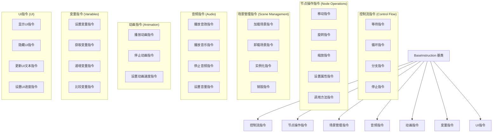

# 指令系统详细设计

## 目录
1. [指令系统概述](#1-指令系统概述)
2. [核心指令类型](#2-核心指令类型)
3. [指令执行机制](#3-指令执行机制)
4. [指令扩展框架](#4-指令扩展框架)
5. [内置指令实现](#5-内置指令实现)
6. [指令调试和性能优化](#6-指令调试和性能优化)

---

## 1. 指令系统概述

### 1.1 设计原则

指令系统是整个可视化编程系统的核心执行单元，遵循以下设计原则：

- **原子性**：每个指令执行单一、明确的操作
- **异步性**：所有指令基于Signal机制实现异步执行
- **可组合性**：通过组合简单指令实现复杂逻辑
- **类型安全**：利用GDScript的类型系统确保执行安全
- **可扩展性**：提供简单的扩展接口支持自定义指令

### 1.2 指令分类体系



---

## 2. 核心指令类型

### 2.1 控制流指令

#### 2.1.1 等待指令 (WaitInstruction)

```gdscript
@tool
class_name WaitInstruction extends BaseInstruction
@icon("res://addons/visual_programming/icons/wait.svg")

@export_group("Wait Settings")
@export var duration: float = 1.0
@export var use_unscaled_time: bool = false

func execute(context: ExecutionContext):
    var timer: SceneTreeTimer
    if use_unscaled_time:
        timer = context.get_tree().create_timer(duration, false, true)
    else:
        timer = context.get_tree().create_timer(duration)
    
    timer.timeout.connect(finished.emit)
    context.print_message("Waiting for %s seconds" % duration)

func get_description() -> String:
    return "Wait %s seconds%s" % [duration, " (unscaled)" if use_unscaled_time else ""]

func validate() -> Array[String]:
    var errors: Array[String] = []
    if duration < 0:
        errors.append("Duration cannot be negative")
    return errors
```

#### 2.1.2 循环指令 (LoopInstruction)

```gdscript
@tool
class_name LoopInstruction extends BaseInstruction
@icon("res://addons/visual_programming/icons/loop.svg")

@export_group("Loop Settings")
@export var loop_count: int = 3
@export var loop_instructions: Array[BaseInstruction] = []
@export var break_on_condition: BaseCondition = null

var current_iteration: int = 0
var loop_runner: ActionRunner = null

func execute(context: ExecutionContext):
    if loop_count <= 0:
        finished.emit()
        return
    
    current_iteration = 0
    loop_runner = ActionRunner.new()
    loop_runner.instructions = loop_instructions
    
    _execute_loop_iteration(context)

func _execute_loop_iteration(context: ExecutionContext):
    # 检查循环条件
    if break_on_condition and break_on_condition.check(context):
        context.print_message("Loop break condition met, exiting loop")
        finished.emit()
        return
    
    # 检查循环次数
    if current_iteration >= loop_count:
        context.print_message("Loop completed after %s iterations" % current_iteration)
        finished.emit()
        return
    
    context.print_message("Loop iteration %s/%s" % [current_iteration + 1, loop_count])
    current_iteration += 1
    
    # 执行循环体
    loop_runner.run(context)
    await loop_runner.action_completed
    
    # 继续下一次迭代
    _execute_loop_iteration(context)

func get_description() -> String:
    return "Loop %s times" % loop_count

func validate() -> Array[String]:
    var errors: Array[String] = []
    if loop_count < 1:
        errors.append("Loop count must be at least 1")
    if loop_instructions.is_empty():
        errors.append("Loop instructions cannot be empty")
    return errors
```

#### 2.1.3 分支指令 (BranchInstruction)

```gdscript
@tool
class_name BranchInstruction extends BaseInstruction
@icon("res://addons/visual_programming/icons/branch.svg")

@export_group("Branch Settings")
@export var condition: BaseCondition
@export var true_instructions: Array[BaseInstruction] = []
@export var false_instructions: Array[BaseInstruction] = []

var branch_runner: ActionRunner = null

func execute(context: ExecutionContext):
    var condition_result = false
    
    if condition:
        condition_result = condition.check(context)
        context.print_message("Branch condition result: %s" % condition_result)
    else:
        context.print_warning("Branch instruction has no condition, defaulting to false")
    
    var instructions_to_execute = true_instructions if condition_result else false_instructions
    
    if instructions_to_execute.is_empty():
        context.print_message("Branch has no instructions for %s path" % ("true" if condition_result else "false"))
        finished.emit()
        return
    
    branch_runner = ActionRunner.new()
    branch_runner.instructions = instructions_to_execute
    
    context.print_message("Executing %s branch with %s instructions" % [
        "true" if condition_result else "false",
        instructions_to_execute.size()
    ])
    
    branch_runner.run(context)
    await branch_runner.action_completed
    finished.emit()

func get_description() -> String:
    var true_count = true_instructions.size()
    var false_count = false_instructions.size()
    return "Branch: %s true, %s false" % [true_count, false_count]

func validate() -> Array[String]:
    var errors: Array[String] = []
    if not condition:
        errors.append("Branch instruction requires a condition")
    if true_instructions.is_empty() and false_instructions.is_empty():
        errors.append("Branch instruction must have at least one instruction in either branch")
    return errors
```

### 2.2 节点操作指令

#### 2.2.1 移动指令 (MoveInstruction)

```gdscript
@tool
class_name MoveInstruction extends BaseInstruction
@icon("res://addons/visual_programming/icons/move.svg")

@export_group("Target Settings")
@export var target_node_path: NodePath
@export_group("Movement Settings")
@export var target_position: Vector3
@export var duration: float = 1.0
@export var relative: bool = false
@export var use_local_coordinates: bool = false
@export_group("Tween Settings")
@export var ease_type: Tween.EaseType = Tween.EASE_IN_OUT
@export var trans_type: Tween.TransitionType = Tween.TRANS_SINE

var tween: Tween = null

func execute(context: ExecutionContext):
    var target_node = _get_target_node(context)
    if not target_node:
        context.print_error("MoveInstruction: Target node not found at path: %s" % target_node_path)
        finished.emit()
        return
    
    var start_pos = target_node.global_position if not use_local_coordinates else target_node.position
    var end_pos = target_position
    
    if relative:
        end_pos = start_pos + target_position
    
    context.print_message("Moving node from %s to %s over %s seconds" % [start_pos, end_pos, duration])
    
    tween = context.get_tree().create_tween()
    tween.set_ease(ease_type)
    tween.set_trans(trans_type)
    
    var property = "global_position" if not use_local_coordinates else "position"
    tween.tween_property(target_node, property, end_pos, duration)
    tween.finished.connect(finished.emit)

func _get_target_node(context: ExecutionContext) -> Node:
    if target_node_path.is_empty():
        return context.target
    
    return context.get_node(target_node_path)

func get_description() -> String:
    var node_name = "Target" if target_node_path.is_empty() else target_node_path.get_name(0)
    var move_type = "relative" if relative else "absolute"
    var coord_type = "local" if use_local_coordinates else "global"
    return "Move %s %s to %s (%s)" % [node_name, move_type, target_position, coord_type]

func validate() -> Array[String]:
    var errors: Array[String] = []
    if duration < 0:
        errors.append("Duration cannot be negative")
    return errors
```

#### 2.2.2 设置属性指令 (SetPropertyInstruction)

```gdscript
@tool
class_name SetPropertyInstruction extends BaseInstruction
@icon("res://addons/visual_programming/icons/set_property.svg")

@export_group("Target Settings")
@export var target_node_path: NodePath
@export_group("Property Settings")
@export var property_name: String = ""
@export_enum("bool", "int", "float", "String", "Vector2", "Vector3", "Color") var property_type: int = 0
@export var bool_value: bool = false
@export var int_value: int = 0
@export var float_value: float = 0.0
@export var string_value: String = ""
@export var vector2_value: Vector2 = Vector2.ZERO
@export var vector3_value: Vector3 = Vector3.ZERO
@export var color_value: Color = Color.WHITE
@export var use_variable: bool = false
@export var variable_name: String = ""

func execute(context: ExecutionContext):
    var target_node = _get_target_node(context)
    if not target_node:
        context.print_error("SetPropertyInstruction: Target node not found at path: %s" % target_node_path)
        finished.emit()
        return
    
    if property_name.is_empty():
        context.print_error("SetPropertyInstruction: Property name is empty")
        finished.emit()
        return
    
    var value = _get_property_value(context)
    
    # 使用call方法设置属性，支持嵌套属性
    var success = target_node.set(property_name, value)
    
    if success:
        context.print_message("Set property '%s' on node '%s' to: %s" % [
            property_name, target_node.name, value
        ])
    else:
        context.print_error("Failed to set property '%s' on node '%s'" % [property_name, target_node.name])
    
    finished.emit()

func _get_target_node(context: ExecutionContext) -> Node:
    if target_node_path.is_empty():
        return context.target
    
    return context.get_node(target_node_path)

func _get_property_value(context: ExecutionContext) -> Variant:
    if use_variable:
        return context.get_variable(variable_name)
    
    match property_type:
        0: return bool_value
        1: return int_value
        2: return float_value
        3: return string_value
        4: return vector2_value
        5: return vector3_value
        6: return color_value
        _: return null

func get_description() -> String:
    var node_name = "Target" if target_node_path.is_empty() else target_node_path.get_name(0)
    var value_str = "variable: %s" % variable_name if use_variable else str(_get_property_value(null))
    return "Set %s.%s = %s" % [node_name, property_name, value_str]

func validate() -> Array[String]:
    var errors: Array[String] = []
    if property_name.is_empty():
        errors.append("Property name cannot be empty")
    if use_variable and variable_name.is_empty():
        errors.append("Variable name cannot be empty when using variable")
    return errors
```

### 2.3 变量指令

#### 2.3.1 设置变量指令 (SetVariableInstruction)

```gdscript
@tool
class_name SetVariableInstruction extends BaseInstruction
@icon("res://addons/visual_programming/icons/set_variable.svg")

@export_group("Variable Settings")
@export var variable_name: String = ""
@export_enum("Local", "Trigger", "Global") var variable_scope: int = 0
@export_group("Value Settings")
@export_enum("Literal", "Variable", "Expression") var value_source: int = 0
@export_enum("bool", "int", "float", "String", "Vector2", "Vector3", "Color") var value_type: int = 0
@export var bool_value: bool = false
@export var int_value: int = 0
@export var float_value: float = 0.0
@export var string_value: String = ""
@export var vector2_value: Vector2 = Vector2.ZERO
@export var vector3_value: Vector3 = Vector3.ZERO
@export var color_value: Color = Color.WHITE
@export var source_variable_name: String = ""
@export var expression: String = ""

func execute(context: ExecutionContext):
    if variable_name.is_empty():
        context.print_error("SetVariableInstruction: Variable name is empty")
        finished.emit()
        return
    
    var value = _get_value(context)
    var scope_name = ["local", "trigger", "global"][variable_scope]
    
    match variable_scope:
        0: # Local
            context.local_variables[variable_name] = value
        1: # Trigger
            if context.trigger and context.trigger.local_variables:
                context.trigger.local_variables.set(variable_name, value)
        2: # Global
            if context.global_variables:
                context.global_variables.set(variable_name, value)
    
    context.print_message("Set %s variable '%s' to: %s" % [scope_name, variable_name, value])
    finished.emit()

func _get_value(context: ExecutionContext) -> Variant:
    match value_source:
        0: # Literal
            match value_type:
                0: return bool_value
                1: return int_value
                2: return float_value
                3: return string_value
                4: return vector2_value
                5: return vector3_value
                6: return color_value
        1: # Variable
            return context.get_variable(source_variable_name)
        2: # Expression
            return _evaluate_expression(context)
    return null

func _evaluate_expression(context: ExecutionContext) -> Variant:
    # 简单的表达式求值实现
    # 在实际项目中，可以使用更强大的表达式解析库
    var expr = expression
    var variables = context.local_variables.duplicate()
    
    # 替换变量引用
    for var_name in variables.keys():
        expr = expr.replace("${%s}" % var_name, str(variables[var_name]))
    
    # 简单的数学表达式求值
    var expression_parser = Expression.new()
    var parse_result = expression_parser.parse(expr)
    
    if parse_result != OK:
        context.print_error("Failed to parse expression: %s" % expression)
        return null
    
    var result = expression_parser.execute()
    if result is String:
        context.print_error("Expression execution error: %s" % result)
        return null
    
    return result

func get_description() -> String:
    var scope_name = ["local", "trigger", "global"][variable_scope]
    var value_desc = ""
    
    match value_source:
        0: # Literal
            value_desc = str(_get_value(null))
        1: # Variable
            value_desc = "variable: %s" % source_variable_name
        2: # Expression
            value_desc = "expression: %s" % expression
    
    return "Set %s variable '%s' = %s" % [scope_name, variable_name, value_desc]

func validate() -> Array[String]:
    var errors: Array[String] = []
    if variable_name.is_empty():
        errors.append("Variable name cannot be empty")
    if value_source == 1 and source_variable_name.is_empty():
        errors.append("Source variable name cannot be empty when using variable as value source")
    if value_source == 2 and expression.is_empty():
        errors.append("Expression cannot be empty when using expression as value source")
    return errors
```

---

## 3. 指令执行机制

### 3.1 异步执行框架

```gdscript
@tool
class_name InstructionExecutor extends RefCounted

## 指令执行状态
enum ExecutionStatus {
    PENDING,
    RUNNING,
    COMPLETED,
    CANCELLED,
    ERROR
}

## 执行上下文
class InstructionContext:
    var instruction: BaseInstruction
    var execution_context: ExecutionContext
    var status: ExecutionStatus = ExecutionStatus.PENDING
    var start_time: float = 0
    var end_time: float = 0
    var error_message: String = ""

var active_instructions: Array[InstructionContext] = []
var max_concurrent_instructions: int = 50

## 执行单个指令
func execute_instruction(instruction: BaseInstruction, context: ExecutionContext) -> String:
    var instruction_id = _generate_instruction_id()
    var instruction_context = InstructionContext.new()
    instruction_context.instruction = instruction
    instruction_context.execution_context = context
    instruction_context.status = ExecutionStatus.PENDING
    
    active_instructions.append(instruction_context)
    
    # 检查并发限制
    if _get_running_count() >= max_concurrent_instructions:
        await _wait_for_completion()
    
    _execute_instruction_context(instruction_context)
    return instruction_id

## 执行指令上下文
func _execute_instruction_context(instruction_context: InstructionContext):
    instruction_context.status = ExecutionStatus.RUNNING
    instruction_context.start_time = Time.get_ticks_msec()
    
    # 连接完成信号
    instruction_context.instruction.finished.connect(
        _on_instruction_completed.bind(instruction_context)
    )
    
    # 执行指令
    instruction_context.instruction.execute(instruction_context.execution_context)

## 指令完成回调
func _on_instruction_completed(instruction_context: InstructionContext):
    instruction_context.status = ExecutionStatus.COMPLETED
    instruction_context.end_time = Time.get_ticks_msec()
    
    var execution_time = instruction_context.end_time - instruction_context.start_time
    instruction_context.execution_context.print_message(
        "Instruction '%s' completed in %s ms" % [
            instruction_context.instruction.get_description(),
            execution_time
        ]
    )
    
    active_instructions.erase(instruction_context)

## 等待指令完成
func _wait_for_completion():
    while _get_running_count() >= max_concurrent_instructions:
        await get_tree().process_frame

## 获取正在运行的指令数量
func _get_running_count() -> int:
    var count = 0
    for context in active_instructions:
        if context.status == ExecutionStatus.RUNNING:
            count += 1
    return count

## 生成指令ID
func _generate_instruction_id() -> String:
    return "inst_%d_%d" % [Time.get_ticks_msec(), randi()]
```

### 3.2 错误处理机制

```gdscript
@tool
class_name InstructionErrorHandler extends RefCounted

## 错误类型
enum ErrorType {
    VALIDATION_ERROR,
    EXECUTION_ERROR,
    TIMEOUT_ERROR,
    CANCELLATION_ERROR
}

## 错误信息
class ErrorInfo:
    var error_type: ErrorType
    var instruction: BaseInstruction
    var context: ExecutionContext
    var error_message: String
    var timestamp: float

var error_history: Array[ErrorInfo] = []
var max_error_history: int = 100

## 处理指令错误
func handle_error(
    error_type: ErrorType,
    instruction: BaseInstruction,
    context: ExecutionContext,
    error_message: String
):
    var error_info = ErrorInfo.new()
    error_info.error_type = error_type
    error_info.instruction = instruction
    error_info.context = context
    error_info.error_message = error_message
    error_info.timestamp = Time.get_ticks_msec()
    
    error_history.append(error_info)
    
    # 限制错误历史记录数量
    if error_history.size() > max_error_history:
        error_history.pop_front()
    
    # 记录错误
    _log_error(error_info)
    
    # 根据错误类型采取不同的处理策略
    match error_type:
        ErrorType.VALIDATION_ERROR:
            _handle_validation_error(error_info)
        ErrorType.EXECUTION_ERROR:
            _handle_execution_error(error_info)
        ErrorType.TIMEOUT_ERROR:
            _handle_timeout_error(error_info)
        ErrorType.CANCELLATION_ERROR:
            _handle_cancellation_error(error_info)

## 记录错误
func _log_error(error_info: ErrorInfo):
    var error_type_name = ErrorType.keys()[error_info.error_type]
    context.print_error(
        "[%s] %s: %s" % [
            error_type_name,
            error_info.instruction.get_description(),
            error_info.error_message
        ]
    )

## 处理验证错误
func _handle_validation_error(error_info: ErrorInfo):
    # 验证错误通常不应该执行指令
    error_info.context.print_warning(
        "Skipping instruction due to validation errors: %s" % error_info.error_message
    )

## 处理执行错误
func _handle_execution_error(error_info: ErrorInfo):
    # 执行错误可能需要回滚或恢复
    error_info.context.print_error(
        "Instruction execution failed: %s" % error_info.error_message
    )

## 处理超时错误
func _handle_timeout_error(error_info: ErrorInfo):
    # 超时错误可能需要强制停止
    error_info.context.print_error(
        "Instruction execution timed out: %s" % error_info.error_message
    )

## 处理取消错误
func _handle_cancellation_error(error_info: ErrorInfo):
    # 取消错误是正常的，不需要特殊处理
    error_info.context.print_message(
        "Instruction was cancelled: %s" % error_info.error_message
    )
```

---

## 4. 指令扩展框架

### 4.1 指令注册系统

```gdscript
@tool
class_name InstructionRegistry extends RefCounted

static var _registered_instructions: Dictionary = {}
static var _instruction_categories: Dictionary = {}
static var _instruction_metadata: Dictionary = {}

## 指令元数据
class InstructionMetadata:
    var name: String
    var description: String
    var category: String
    var icon: Texture2D
    var version: String
    var author: String
    var dependencies: Array[String] = []

## 注册指令类型
static func register_instruction(
    instruction_name: String,
    instruction_script: Script,
    metadata: InstructionMetadata
) -> bool:
    if _registered_instructions.has(instruction_name):
        print_warning("Instruction '%s' is already registered" % instruction_name)
        return false
    
    # 验证指令脚本
    if not _validate_instruction_script(instruction_script):
        print_error("Invalid instruction script for '%s'" % instruction_name)
        return false
    
    _registered_instructions[instruction_name] = instruction_script
    _instruction_metadata[instruction_name] = metadata
    
    # 添加到分类
    if not _instruction_categories.has(metadata.category):
        _instruction_categories[metadata.category] = []
    _instruction_categories[metadata.category].append(instruction_name)
    
    print("Registered instruction: %s" % instruction_name)
    return true

## 验证指令脚本
static func _validate_instruction_script(instruction_script: Script) -> bool:
    # 检查脚本是否继承自BaseInstruction
    var base_class = instruction_script.get_base_script()
    while base_class:
        if base_class.get_global_name() == "BaseInstruction":
            return true
        base_class = base_class.get_base_script()
    return false

## 创建指令实例
static func create_instruction(instruction_name: String) -> BaseInstruction:
    var instruction_script = _registered_instructions.get(instruction_name)
    if not instruction_script:
        print_error("Instruction '%s' not found" % instruction_name)
        return null
    
    var instruction = instruction_script.new()
    if not instruction is BaseInstruction:
        print_error("Failed to create instruction '%s'" % instruction_name)
        return null
    
    return instruction

## 获取所有注册的指令
static func get_registered_instructions() -> Dictionary:
    return _registered_instructions.duplicate()

## 获取指令分类
static func get_instruction_categories() -> Dictionary:
    return _instruction_categories.duplicate()

## 获取指令元数据
static func get_instruction_metadata(instruction_name: String) -> InstructionMetadata:
    return _instruction_metadata.get(instruction_name)

## 自动发现并注册指令
static func auto_register_instructions():
    var instruction_dir = "res://addons/visual_programming/instructions/"
    _scan_directory_for_instructions(instruction_dir)

## 扫描目录中的指令
static func _scan_directory_for_instructions(directory_path: String):
    var dir = DirAccess.open(directory_path)
    if not dir:
        return
    
    dir.list_dir_begin()
    var file_name = dir.get_next()
    
    while file_name != "":
        if file_name.ends_with(".gd"):
            var script_path = directory_path + file_name
            _try_register_instruction_from_file(script_path)
        file_name = dir.get_next()
    
    dir.list_dir_end()

## 尝试从文件注册指令
static func _try_register_instruction_from_file(script_path: String):
    var script = load(script_path)
    if not script or not script is Script:
        return
    
    # 检查是否有自定义注册方法
    if script.has_method("auto_register"):
        script.auto_register()
```

### 4.2 指令模板系统

```gdscript
@tool
class_name InstructionTemplate extends Resource

@export var template_name: String
@export var description: String
@export var category: String
@export var instruction_data: Dictionary = {}
@export var parameters: Array[TemplateParameter] = []

## 模板参数
class TemplateParameter:
    var name: String
    var type: String
    var default_value: Variant
    var description: String
    var required: bool = true

## 从模板创建指令
func create_instruction(parameters: Dictionary = {}) -> BaseInstruction:
    var instruction_type = instruction_data.get("type")
    if instruction_type.is_empty():
        print_error("Template missing instruction type")
        return null
    
    var instruction = InstructionRegistry.create_instruction(instruction_type)
    if not instruction:
        return null
    
    # 应用模板参数
    _apply_template_parameters(instruction, parameters)
    
    # 应用模板数据
    _apply_template_data(instruction)
    
    return instruction

## 应用模板参数
func _apply_template_parameters(instruction: BaseInstruction, parameters: Dictionary):
    for param in self.parameters:
        var value = parameters.get(param.name, param.default_value)
        if param.required and value == null:
            print_error("Required parameter '%s' is missing" % param.name)
            continue
        
        # 使用反射设置属性值
        if instruction.has_method("set"):
            instruction.set(param.name, value)

## 应用模板数据
func _apply_template_data(instruction: BaseInstruction):
    for property_name in instruction_data:
        if property_name == "type":
            continue
        
        var value = instruction_data[property_name]
        if instruction.has_method("set"):
            instruction.set(property_name, value)

## 验证模板参数
func validate_parameters(parameters: Dictionary) -> Array[String]:
    var errors: Array[String] = []
    
    for param in self.parameters:
        if param.required and not parameters.has(param.name):
            errors.append("Required parameter '%s' is missing" % param.name)
        
        if parameters.has(param.name):
            var value = parameters[param.name]
            if not _validate_parameter_type(value, param.type):
                errors.append("Parameter '%s' has invalid type" % param.name)
    
    return errors

## 验证参数类型
func _validate_parameter_type(value: Variant, expected_type: String) -> bool:
    match expected_type:
        "bool":
            return value is bool
        "int":
            return value is int
        "float":
            return value is float
        "String":
            return value is String
        "Vector2":
            return value is Vector2
        "Vector3":
            return value is Vector3
        "Color":
            return value is Color
        "NodePath":
            return value is NodePath
        _:
            return true  # 未知类型，假设有效
```

---

## 5. 内置指令实现

### 5.1 场景管理指令

#### 5.1.1 加载场景指令

```gdscript
@tool
class_name LoadSceneInstruction extends BaseInstruction
@icon("res://addons/visual_programming/icons/load_scene.svg")

@export_group("Scene Settings")
@export var scene_path: String = ""
@export var show_progress: bool = false
@export var progress_bar_path: NodePath
@export_group("Loading Options")
@export var use_background_loading: bool = false
@export var replace_current_scene: bool = true
@export var parent_node_path: NodePath

func execute(context: ExecutionContext):
    if scene_path.is_empty():
        context.print_error("LoadSceneInstruction: Scene path is empty")
        finished.emit()
        return
    
    if not ResourceLoader.exists(scene_path):
        context.print_error("LoadSceneInstruction: Scene file not found: %s" % scene_path)
        finished.emit()
        return
    
    context.print_message("Loading scene: %s" % scene_path)
    
    if use_background_loading:
        _load_scene_background(context)
    else:
        _load_scene_sync(context)

func _load_scene_sync(context: ExecutionContext):
    var packed_scene = load(scene_path) as PackedScene
    if not packed_scene:
        context.print_error("Failed to load packed scene: %s" % scene_path)
        finished.emit()
        return
    
    var scene_instance = packed_scene.instantiate()
    if not scene_instance:
        context.print_error("Failed to instantiate scene: %s" % scene_path)
        finished.emit()
        return
    
    if replace_current_scene:
        context.get_tree().change_scene_to_packed(packed_scene)
    else:
        var parent_node = _get_parent_node(context)
        if parent_node:
            parent_node.add_child(scene_instance)
            scene_instance.owner = context.get_tree().current_scene
        else:
            context.print_error("LoadSceneInstruction: No valid parent node found")
    
    context.print_message("Scene loaded successfully: %s" % scene_path)
    finished.emit()

func _load_scene_background(context: ExecutionContext):
    ResourceLoader.load_threaded_request(scene_path)
    _check_loading_progress(context)

func _check_loading_progress(context: ExecutionContext):
    var progress = []
    var status = ResourceLoader.load_threaded_get_status(scene_path, progress)
    
    if show_progress:
        _update_progress_bar(progress[0] if progress.size() > 0 else 0.0)
    
    match status:
        ResourceLoader.THREAD_LOAD_IN_PROGRESS:
            await context.get_tree().process_frame
            _check_loading_progress(context)
        ResourceLoader.THREAD_LOAD_LOADED:
            _on_background_load_completed(context)
        ResourceLoader.THREAD_LOAD_FAILED:
            context.print_error("Background loading failed: %s" % scene_path)
            finished.emit()

func _on_background_load_completed(context: ExecutionContext):
    var packed_scene = ResourceLoader.load_threaded_get(scene_path) as PackedScene
    if packed_scene:
        _load_scene_sync(context)
    else:
        context.print_error("Failed to get loaded scene: %s" % scene_path)
        finished.emit()

func _get_parent_node(context: ExecutionContext) -> Node:
    if parent_node_path.is_empty():
        return context.get_tree().current_scene
    
    return context.get_node(parent_node_path)

func _update_progress_bar(progress: float):
    if not progress_bar_path.is_empty():
        var progress_bar = get_node_or_null(progress_bar_path)
        if progress_bar and progress_bar.has_method("set_value"):
            progress_bar.set_value(progress * 100.0)

func get_description() -> String:
    var mode = "replace" if replace_current_scene else "add"
    return "Load scene '%s' (%s)" % [scene_path, mode]

func validate() -> Array[String]:
    var errors: Array[String] = []
    if scene_path.is_empty():
        errors.append("Scene path cannot be empty")
    elif not ResourceLoader.exists(scene_path):
        errors.append("Scene file not found: %s" % scene_path)
    return errors
```

### 5.2 音频指令

#### 5.2.1 播放音效指令

```gdscript
@tool
class_name PlaySoundInstruction extends BaseInstruction
@icon("res://addons/visual_programming/icons/play_sound.svg")

@export_group("Audio Settings")
@export var sound_resource: AudioStream
@export var audio_player_path: NodePath
@export_group("Playback Settings")
@export var volume_db: float = 0.0
@export var pitch_scale: float = 1.0
@export var bus_name: String = "Master"
@export var autoplay: bool = true
@export var loop: bool = false

var audio_player: AudioStreamPlayer = null

func execute(context: ExecutionContext):
    audio_player = _get_audio_player(context)
    if not audio_player:
        context.print_error("PlaySoundInstruction: No valid audio player found")
        finished.emit()
        return
    
    if not sound_resource:
        context.print_error("PlaySoundInstruction: No sound resource assigned")
        finished.emit()
        return
    
    # 配置音频播放器
    audio_player.stream = sound_resource
    audio_player.volume_db = volume_db
    audio_player.pitch_scale = pitch_scale
    audio_player.bus = bus_name
    
    context.print_message("Playing sound: %s" % sound_resource.resource_path if sound_resource else "Unknown")
    
    if autoplay:
        if loop:
            audio_player.play()
            finished.emit()  # 循环播放立即完成
        else:
            audio_player.play()
            audio_player.finished.connect(finished.emit)
    else:
        finished.emit()

func _get_audio_player(context: ExecutionContext) -> AudioStreamPlayer:
    # 如果指定了音频播放器路径，使用指定的播放器
    if not audio_player_path.is_empty():
        var player = context.get_node(audio_player_path)
        if player is AudioStreamPlayer:
            return player
    
    # 尝试在触发器节点下查找音频播放器
    if context.trigger:
        var player = context.trigger.find_child("AudioStreamPlayer", true, false)
        if player is AudioStreamPlayer:
            return player
    
    # 尝试在目标节点下查找音频播放器
    if context.target:
        var player = context.target.find_child("AudioStreamPlayer", true, false)
        if player is AudioStreamPlayer:
            return player
    
    # 创建临时音频播放器
    var temp_player = AudioStreamPlayer.new()
    context.trigger.add_child(temp_player) if context.trigger else context.get_tree().current_scene.add_child(temp_player)
    temp_player.owner = context.get_tree().current_scene
    return temp_player

func get_description() -> String:
    var sound_name = "Unknown"
    if sound_resource:
        sound_name = sound_resource.resource_path.get_file().get_basename()
    
    var mode = "looped" if loop else "once"
    return "Play sound '%s' %s" % [sound_name, mode]

func validate() -> Array[String]:
    var errors: Array[String] = []
    if not sound_resource:
        errors.append("Sound resource is required")
    if pitch_scale <= 0:
        errors.append("Pitch scale must be greater than 0")
    return errors
```

---

## 6. 指令调试和性能优化

### 6.1 调试系统

```gdscript
@tool
class_name InstructionDebugger extends RefCounted

## 调试信息
class DebugInfo:
    var instruction: BaseInstruction
    var context: ExecutionContext
    var start_time: float
    var end_time: float
    var execution_time: float
    var memory_usage: int
    var variables_before: Dictionary
    var variables_after: Dictionary

var debug_history: Array[DebugInfo] = []
var is_debugging: bool = false
var max_debug_history: int = 1000

## 开始调试
func start_debugging():
    is_debugging = true
    debug_history.clear()
    print("Instruction debugging started")

## 停止调试
func stop_debugging():
    is_debugging = false
    print("Instruction debugging stopped")

## 记录指令执行
func record_instruction_execution(
    instruction: BaseInstruction,
    context: ExecutionContext,
    start_time: float,
    end_time: float
):
    if not is_debugging:
        return
    
    var debug_info = DebugInfo.new()
    debug_info.instruction = instruction
    debug_info.context = context
    debug_info.start_time = start_time
    debug_info.end_time = end_time
    debug_info.execution_time = end_time - start_time
    debug_info.memory_usage = _get_memory_usage()
    debug_info.variables_before = _get_variables_snapshot(context, "before")
    debug_info.variables_after = _get_variables_snapshot(context, "after")
    
    debug_history.append(debug_info)
    
    # 限制调试历史记录数量
    if debug_history.size() > max_debug_history:
        debug_history.pop_front()
    
    _print_debug_info(debug_info)

## 获取内存使用情况
func _get_memory_usage() -> int:
    return OS.get_static_memory_usage_by_type()[OS.MEMORY_TYPE_STATIC]

## 获取变量快照
func _get_variables_snapshot(context: ExecutionContext, phase: String) -> Dictionary:
    var snapshot = {}
    
    # 局部变量
    for var_name in context.local_variables.keys():
        snapshot["local_%s_%s" % [var_name, phase]] = context.local_variables[var_name]
    
    # 触发器变量
    if context.trigger and context.trigger.local_variables:
        for var_name in context.trigger.local_variables.get_variable_names():
            snapshot["trigger_%s_%s" % [var_name, phase]] = context.trigger.local_variables.get(var_name)
    
    # 全局变量
    if context.global_variables:
        for var_name in context.global_variables.get_variable_names():
            snapshot["global_%s_%s" % [var_name, phase]] = context.global_variables.get(var_name)
    
    return snapshot

## 打印调试信息
func _print_debug_info(debug_info: DebugInfo):
    print("=== DEBUG INFO ===")
    print("Instruction: %s" % debug_info.instruction.get_description())
    print("Execution Time: %.2f ms" % debug_info.execution_time)
    print("Memory Usage: %d bytes" % debug_info.memory_usage)
    print("Variables Changed: %d" % _count_changed_variables(debug_info))
    print("==================")

## 计算变量变化数量
func _count_changed_variables(debug_info: DebugInfo) -> int:
    var changes = 0
    for key in debug_info.variables_before:
        if debug_info.variables_before.has(key) and debug_info.variables_after.has(key):
            if debug_info.variables_before[key] != debug_info.variables_after[key]:
                changes += 1
    return changes

## 生成调试报告
func generate_debug_report() -> String:
    var report = "INSTRUCTION DEBUG REPORT\n"
    report += "========================\n\n"
    
    var total_time = 0.0
    var total_instructions = debug_history.size()
    
    for debug_info in debug_history:
        total_time += debug_info.execution_time
        report += "Instruction: %s\n" % debug_info.instruction.get_description()
        report += "  Time: %.2f ms\n" % debug_info.execution_time
        report += "  Memory: %d bytes\n" % debug_info.memory_usage
        report += "\n"
    
    report += "SUMMARY:\n"
    report += "Total Instructions: %d\n" % total_instructions
    report += "Total Time: %.2f ms\n" % total_time
    report += "Average Time: %.2f ms\n" % (total_time / total_instructions if total_instructions > 0 else 0)
    
    return report
```

### 6.2 性能优化

```gdscript
@tool
class_name InstructionOptimizer extends RefCounted

## 优化建议
class OptimizationSuggestion:
    var instruction: BaseInstruction
    var suggestion_type: String
    var description: String
    var impact: String  # "low", "medium", "high"

## 分析指令性能
func analyze_performance(instructions: Array[BaseInstruction]) -> Array[OptimizationSuggestion]:
    var suggestions: Array[OptimizationSuggestion] = []
    
    for instruction in instructions:
        suggestions.append_array(_analyze_instruction(instruction))
    
    return suggestions

## 分析单个指令
func _analyze_instruction(instruction: BaseInstruction) -> Array[OptimizationSuggestion]:
    var suggestions: Array[OptimizationSuggestion] = []
    
    # 检查等待指令
    if instruction is WaitInstruction:
        var wait_instruction = instruction as WaitInstruction
        if wait_instruction.duration > 5.0:
            suggestions.append(_create_suggestion(
                instruction,
                "long_wait",
                "Consider breaking long waits into smaller chunks",
                "medium"
            ))
    
    # 检查循环指令
    elif instruction is LoopInstruction:
        var loop_instruction = instruction as LoopInstruction
        if loop_instruction.loop_count > 100:
            suggestions.append(_create_suggestion(
                instruction,
                "large_loop",
                "Large loops may impact performance",
                "high"
            ))
    
    # 检查移动指令
    elif instruction is MoveInstruction:
        var move_instruction = instruction as MoveInstruction
        if move_instruction.duration < 0.1:
            suggestions.append(_create_suggestion(
                instruction,
                "instant_move",
                "Consider using instant position change for very short moves",
                "low"
            ))
    
    return suggestions

## 创建优化建议
func _create_suggestion(
    instruction: BaseInstruction,
    suggestion_type: String,
    description: String,
    impact: String
) -> OptimizationSuggestion:
    var suggestion = OptimizationSuggestion.new()
    suggestion.instruction = instruction
    suggestion.suggestion_type = suggestion_type
    suggestion.description = description
    suggestion.impact = impact
    return suggestion

## 优化指令序列
func optimize_instructions(instructions: Array[BaseInstruction]) -> Array[BaseInstruction]:
    var optimized = instructions.duplicate()
    
    # 合并连续的等待指令
    optimized = _merge_consecutive_waits(optimized)
    
    # 移除空指令
    optimized = _remove_empty_instructions(optimized)
    
    # 优化循环结构
    optimized = _optimize_loops(optimized)
    
    return optimized

## 合并连续的等待指令
func _merge_consecutive_waits(instructions: Array[BaseInstruction]) -> Array[BaseInstruction]:
    var optimized: Array[BaseInstruction] = []
    var total_wait_time = 0.0
    var use_unscaled_time = false
    
    for instruction in instructions:
        if instruction is WaitInstruction:
            var wait_instruction = instruction as WaitInstruction
            total_wait_time += wait_instruction.duration
            use_unscaled_time = use_unscaled_time or wait_instruction.use_unscaled_time
        else:
            # 如果有累积的等待时间，创建合并的等待指令
            if total_wait_time > 0:
                var merged_wait = WaitInstruction.new()
                merged_wait.duration = total_wait_time
                merged_wait.use_unscaled_time = use_unscaled_time
                optimized.append(merged_wait)
                total_wait_time = 0.0
                use_unscaled_time = false
            
            optimized.append(instruction)
    
    # 处理最后的等待指令
    if total_wait_time > 0:
        var merged_wait = WaitInstruction.new()
        merged_wait.duration = total_wait_time
        merged_wait.use_unscaled_time = use_unscaled_time
        optimized.append(merged_wait)
    
    return optimized

## 移除空指令
func _remove_empty_instructions(instructions: Array[BaseInstruction]) -> Array[BaseInstruction]:
    var optimized: Array[BaseInstruction] = []
    
    for instruction in instructions:
        if instruction:
            optimized.append(instruction)
    
    return optimized

## 优化循环结构
func _optimize_loops(instructions: Array[BaseInstruction]) -> Array[BaseInstruction]:
    # 这里可以实现更复杂的循环优化逻辑
    # 例如：检测可以并行化的循环
    return instructions
```

---

## 总结

指令系统是整个可视化编程系统的核心，本设计提供了：

1. **完整的指令分类体系**：涵盖控制流、节点操作、场景管理、音频、动画、变量、UI等多个方面
2. **强大的扩展框架**：支持自定义指令的注册、模板化和自动发现
3. **健壮的执行机制**：基于异步执行和完善的错误处理
4. **全面的调试支持**：提供详细的调试信息和性能分析
5. **智能的性能优化**：自动分析和优化指令序列

这个指令系统设计既保持了简单易用性，又提供了强大的功能和良好的扩展性，为整个可视化编程系统奠定了坚实的基础。

---

## 架构更新（2026-03）

### RuntimeInstructionInstance 架构
- 指令现在支持运行时实例，通过 get_default_runtime_state() 自声明状态
- 暂停/恢复机制：on_runtime_pause() / on_runtime_resume()
- ExecutionMode 枚举：AUTO_DETECT / FORCE_ASYNC / FORCE_SYNC
- 智能同步检测：can_execute_sync() 自动判断指令是否可以同步执行

### 新增指令类别
- Array 操作（18 个指令）
- Dictionary 操作（16 个指令）
- 表达式指令（MathExpression, StringExpression）
- 断点指令（BreakpointInstruction）
- 作用域变量指令（GetScopeVariable, SetScopeVariable）

### 统一基础设施
- FuseError 统一错误处理
- FuseLogger 统一日志