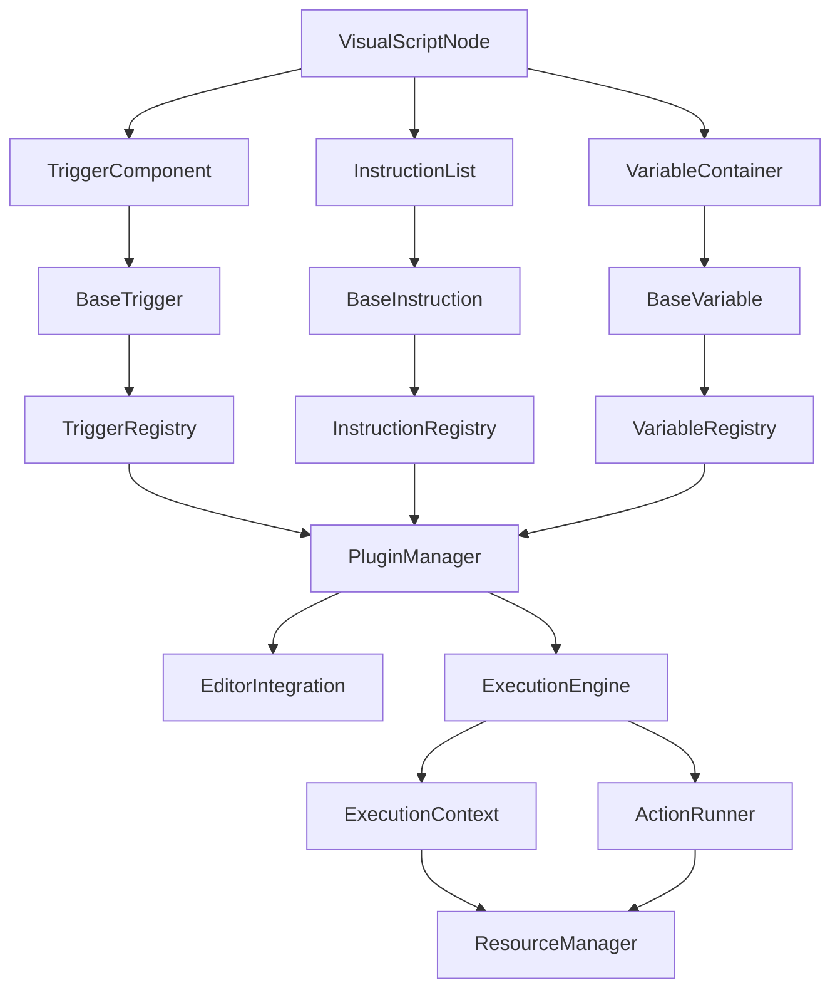

> 🌐 中文 | [**English**](../../../en_US/system_docs/architecture/visual_programming_complete_design_summary.md)

# 可视化编程系统完整设计总结

## 1. 项目概述

本文档是基于GameCreator视觉脚本系统架构分析和juicy触发器建议，为Godot 4.x引擎设计的完整可视化编程体系架构的总结。该系统提供了一个强大、灵活且易于扩展的可视化编程解决方案，充分利用Godot引擎的核心特性。

## 2. 设计目标

- **不集成现有juicy插件的任何组件**：完全独立的系统设计
- **针对Godot 4.x引擎优化**：充分利用Godot 4.x的新特性和改进
- **结合GameCreator架构优势**：借鉴成熟的视觉脚本系统设计理念
- **利用juicy建议中的Godot特性**：深度集成Godot的原生功能
- **完整的组件体系**：包含指令、触发器、条件、变量等完整系统
- **编辑器工具支持**：提供直观的可视化编辑环境
- **可扩展性和易用性**：确保系统易于扩展和使用

## 3. 核心架构设计

### 3.1 分层架构

```
┌─────────────────────────────────────────────────────────────┐
│                    编辑器层 (Editor Layer)                    │
│  ┌─────────────────┐ ┌─────────────────┐ ┌─────────────────┐ │
│  │  可视化编辑器    │ │  Inspector面板   │ │  辅助工具       │ │
│  └─────────────────┘ └─────────────────┘ └─────────────────┘ │
└─────────────────────────────────────────────────────────────┘
┌─────────────────────────────────────────────────────────────┐
│                    组件层 (Component Layer)                  │
│  ┌─────────────────┐ ┌─────────────────┐ ┌─────────────────┐ │
│  │     触发器       │ │      指令        │ │      条件        │ │
│  └─────────────────┘ └─────────────────┘ └─────────────────┘ │
└─────────────────────────────────────────────────────────────┘
┌─────────────────────────────────────────────────────────────┐
│                  执行引擎层 (Engine Layer)                   │
│  ┌─────────────────┐ ┌─────────────────┐ ┌─────────────────┐ │
│  │   指令列表       │ │    分支列表      │ │    事件系统      │ │
│  └─────────────────┘ └─────────────────┘ └─────────────────┘ │
└─────────────────────────────────────────────────────────────┘
┌─────────────────────────────────────────────────────────────┐
│                 核心抽象层 (Core Layer)                      │
│  ┌─────────────────┐ ┌─────────────────┐ ┌─────────────────┐ │
│  │    指令抽象      │ │    分支抽象      │ │   条件/事件抽象  │ │
│  └─────────────────┘ └─────────────────┘ └─────────────────┘ │
└─────────────────────────────────────────────────────────────┘
┌─────────────────────────────────────────────────────────────┐
│                多态框架层 (Polymorphic Layer)                │
│  ┌─────────────────┐ ┌─────────────────┐ ┌─────────────────┐ │
│  │  类型安全容器     │ │    多态项        │ │   注册机制       │ │
│  └─────────────────┘ └─────────────────┘ └─────────────────┘ │
└─────────────────────────────────────────────────────────────┘
┌─────────────────────────────────────────────────────────────┐
│              Godot集成层 (Godot Integration Layer)           │
│  ┌─────────────────┐ ┌─────────────────┐ ┌─────────────────┐ │
│  │  Resource系统   │ │   Signal系统    │ │  NodePath系统   │ │
│  └─────────────────┘ └─────────────────┘ └─────────────────┘ │
└─────────────────────────────────────────────────────────────┘
```

### 3.2 核心组件关系



## 4. 主要系统组件

### 4.1 指令系统 (Instruction System)

**核心特性**：
- 基于BaseInstruction的统一抽象
- 类型安全的指令注册和创建机制
- 异步执行支持和资源管理
- 丰富的内置指令类型

**主要指令类型**：
- **控制流指令**：If、While、For、Switch、Break、Continue
- **节点操作指令**：GetNode、SetNodeProperty、CallNodeMethod
- **场景管理指令**：LoadScene、InstanceScene、ChangeScene
- **音频指令**：PlaySound、StopSound、SetSoundVolume
- **动画指令**：PlayAnimation、StopAnimation、SetAnimationSpeed
- **变量指令**：SetVariable、GetVariable、IncrementVariable
- **UI指令**：ShowUI、HideUI、SetUIText、GetUIValue

**扩展机制**：
- 指令注册系统
- 模板化指令创建
- 自定义参数验证
- 可视化编辑器集成

### 4.2 触发器系统 (Trigger System)

**核心特性**：
- 基于BaseTrigger的统一接口
- 事件驱动的触发机制
- 灵活的参数配置和过滤
- 自动化的生命周期管理

**主要触发器类型**：
- **输入触发器**：KeyPressed、MouseButtonPressed、GamepadButtonPressed
- **物理触发器**：BodyEntered、BodyExited、AreaShapeEntered
- **生命周期触发器**：NodeReady、TreeEntered、TreeExited
- **UI触发器**：ButtonPressed、ItemSelected、ValueChanged
- **时间触发器**：Timer、Interval、Delay
- **变量触发器**：VariableChanged、VariableEquals
- **场景触发器**：SceneLoaded、SceneChanged
- **自定义触发器**：用户定义的特殊触发条件

**事件处理机制**：
- 事件队列和过滤器
- 优先级和延迟处理
- 批量事件处理
- 事件历史记录

### 4.3 条件系统 (Condition System)

**核心特性**：
- 基于BaseCondition的统一评估接口
- 类型安全的条件组合
- 复杂逻辑表达式支持
- 实时条件评估

**主要条件类型**：
- **变量条件**：VariableEquals、VariableGreaterThan、VariableContains
- **节点条件**：NodeExists、NodeIsActive、NodeInGroup
- **输入条件**：KeyPressed、MouseButtonPressed
- **物理条件**：IsColliding、IsOnFloor、IsInArea
- **时间条件**：TimeElapsed、IsTimeOfDay
- **游戏状态条件**：IsPaused、IsGameOver、LevelCompleted
- **逻辑条件**：And、Or、Not、Xor
- **数学条件**：Equals、GreaterThan、LessThan、InRange

**条件组合器**：
- 嵌套条件支持
- 逻辑运算符
- 条件优先级
- 短路评估优化

### 4.4 变量系统 (Variable System)

**核心特性**：
- 基于BaseVariable的统一变量接口
- 多种变量类型支持
- 作用域隔离和访问控制
- 自动持久化和序列化

**主要变量类型**：
- **基础类型**：BoolVariable、IntVariable、FloatVariable、StringVariable
- **数学类型**：Vector2Variable、Vector3Variable、ColorVariable
- **Godot类型**：NodePathVariable、ResourceVariable
- **集合类型**：ArrayVariable、DictionaryVariable
- **自定义类型**：用户定义的复杂变量类型

**变量容器**：
- 局部作用域
- 触发器作用域
- 全局作用域
- 变量链和继承

## 5. 数据流和控制流设计

### 5.1 执行上下文系统

```gdscript
class_name ExecutionContext
extends RefCounted

var owner_node: Node
var variable_container: VariableContainer
var trigger_data: Dictionary = {}
var execution_stack: Array[BaseInstruction] = []
var debug_info: Dictionary = {}

func get_variable(name: String) -> BaseVariable:
    return variable_container.get_variable(name)

func set_variable(name: String, value: Variant):
    variable_container.set_variable(name, value)

func push_stack(instruction: BaseInstruction):
    execution_stack.append(instruction)

func pop_stack() -> BaseInstruction:
    return execution_stack.pop_back()
```

### 5.2 数据传递机制

- **类型安全的数据传递**：确保数据类型的一致性
- **变量作用域管理**：支持多级作用域和变量访问
- **数据验证**：自动验证数据的类型和有效性
- **数据转换**：支持不同数据类型之间的转换

### 5.3 控制流设计

- **顺序执行**：按照指令列表顺序执行
- **分支执行**：基于条件进行分支选择
- **循环执行**：支持多种循环结构
- **并行执行**：支持指令的并行执行
- **异步执行**：基于Signal的异步处理

## 6. 编辑器工具支持

### 6.1 可视化编辑器

- **节点图编辑器**：拖拽式节点编辑界面
- **连接系统**：可视化节点间的数据流连接
- **自动布局**：智能的节点布局算法
- **实时预览**：编辑时的实时效果预览

### 6.2 Inspector集成

- **自定义Inspector插件**：为各种组件提供专门的属性编辑器
- **实时预览**：属性修改的实时预览和验证
- **批量编辑**：支持多个属性的批量编辑
- **模板系统**：常用的配置模板和预设

### 6.3 调试工具

- **调试面板**：详细的执行信息和历史记录
- **性能分析器**：实时的性能监控和分析
- **断点系统**：在指令上设置断点进行调试
- **变量监视器**：实时监视变量的值变化

### 6.4 项目管理工具

- **项目管理器**：项目的创建、打开、保存和管理
- **最近项目**：快速访问最近打开的项目
- **项目模板**：基于模板的项目创建
- **版本控制集成**：与Git等版本控制系统的集成

## 7. 扩展性设计

### 7.1 插件架构

```gdscript
class_name BasePlugin
extends Resource

var plugin_name: String
var version: String
var dependencies: Array[String] = []

func _initialize():
    pass

func _cleanup():
    pass

func get_instructions() -> Array[Script]:
    return []

func get_triggers() -> Array[Script]:
    return []

func get_conditions() -> Array[Script]:
    return []

func get_variables() -> Array[Script]:
    return []
```

### 7.2 扩展点

- **指令扩展点**：注册自定义指令类型
- **触发器扩展点**：注册自定义触发器类型
- **条件扩展点**：注册自定义条件类型
- **变量扩展点**：注册自定义变量类型
- **编辑器扩展点**：扩展编辑器功能
- **执行引擎扩展点**：扩展执行引擎功能

### 7.3 API设计

- **核心API**：统一的系统接口
- **事件API**：事件的监听和触发
- **插件API**：插件的管理和交互
- **模块API**：模块的加载和导出

## 8. Godot特性集成

### 8.1 Resource系统深度集成

- **资源重用机制**：ActionRunner和变量的资源化存储
- **内嵌逻辑支持**：在场景中直接创建和编辑逻辑
- **资源版本管理**：资源的版本控制和迁移
- **资源模板系统**：基于模板的资源创建

### 8.2 Signal系统优化集成

- **信号连接管理器**：安全的信号连接和断开
- **异步执行优化**：基于Signal和await的高效异步执行
- **事件分发机制**：事件的过滤和优先级处理
- **信号池管理**：优化信号的性能和内存使用

### 8.3 NodePath系统集成

- **路径解析器**：支持相对路径和绝对路径的解析
- **路径验证器**：确保路径的有效性和安全性
- **场景实例化**：场景的实例化和引用管理
- **智能路径建议**：基于上下文的路径建议和补全

### 8.4 编辑器工具集成

- **自定义编辑器插件**：深度集成Godot编辑器
- **可视化编辑界面**：直观的拖拽式编程界面
- **Inspector集成**：自定义的属性编辑器
- **菜单和工具栏集成**：与编辑器UI的无缝集成

## 9. 性能优化

### 9.1 对象池系统

- **节点对象池**：复用节点对象以减少GC压力
- **资源对象池**：复用资源对象以提高加载性能
- **自动池管理**：根据使用情况自动调整池大小
- **池预热机制**：在需要之前预先创建对象

### 9.2 资源管理优化

- **智能资源加载**：按需加载和卸载资源
- **资源引用计数**：精确的资源生命周期管理
- **内存使用监控**：实时监控内存使用情况
- **资源压缩和优化**：减少资源占用的存储空间

### 9.3 执行性能优化

- **指令缓存**：缓存常用的指令实例
- **条件短路评估**：优化条件评估的性能
- **批量操作**：合并相似的操作以减少开销
- **异步执行**：利用异步执行提高响应性

## 10. 错误处理和调试

### 10.1 错误处理系统

- **错误分类**：多种错误类型的分类和处理
- **错误恢复策略**：忽略、重试、回退和中止等策略
- **错误历史记录**：记录和分析错误历史
- **用户友好的错误提示**：清晰的错误信息和解决建议

### 10.2 调试工具

- **执行跟踪**：详细的指令执行跟踪
- **变量监视**：实时监视变量的值变化
- **性能分析**：执行性能的分析和优化建议
- **断点调试**：在关键点设置断点进行调试

## 11. 实施建议

### 11.1 开发阶段

1. **第一阶段**：核心架构和基础组件
   - 实现BaseInstruction、BaseTrigger、BaseCondition、BaseVariable
   - 实现注册系统和多态框架
   - 创建基本的执行引擎

2. **第二阶段**：内置组件和编辑器集成
   - 实现常用的内置指令、触发器、条件和变量类型
   - 创建基本的编辑器插件和可视化界面
   - 实现Inspector集成

3. **第三阶段**：高级功能和优化
   - 实现高级的编辑器功能（调试、性能分析等）
   - 优化性能和内存使用
   - 完善扩展机制和插件系统

4. **第四阶段**：文档和示例
   - 编写完整的用户文档和开发者文档
   - 创建示例项目和教程
   - 进行全面的测试和优化

### 11.2 技术考虑

- **Godot版本兼容性**：确保与Godot 4.x的兼容性
- **性能要求**：确保系统在各种设备上的良好性能
- **内存管理**：合理管理内存使用，避免内存泄漏
- **线程安全**：确保系统在多线程环境下的安全性

### 11.3 测试策略

- **单元测试**：对每个组件进行详细的单元测试
- **集成测试**：测试组件间的集成和交互
- **性能测试**：测试系统在各种负载下的性能
- **用户测试**：邀请用户进行测试和反馈

## 12. 总结

本可视化编程系统设计充分融合了GameCreator的先进设计理念和Godot 4.x的核心特性，创建了一个既强大又灵活的可视化编程解决方案。系统具有以下特点：

1. **架构清晰**：分层设计确保了系统的可维护性和可扩展性
2. **功能完整**：包含指令、触发器、条件、变量等完整的组件体系
3. **易于使用**：提供直观的可视化编辑界面和丰富的调试工具
4. **高度可扩展**：完善的插件系统和扩展机制
5. **性能优化**：充分利用Godot的特性进行性能优化
6. **深度集成**：与Godot编辑器和引擎的深度集成

这个设计为Godot开发者提供了一个优秀的可视化编程解决方案，既保持了系统的简洁性，又提供了强大的功能和良好的扩展性。通过这个系统，开发者可以更高效地创建游戏逻辑，降低编程门槛，提高开发效率。

## 2026-03 补充

- Runtime Instance 架构已全面实施
- 统一变量系统已替代 VariableContainer
- 编辑器工具已从"节点图编辑器"重写为实际的 Inspector 集成工具
- 详见各架构文档的"架构更新（2026-03）"章节