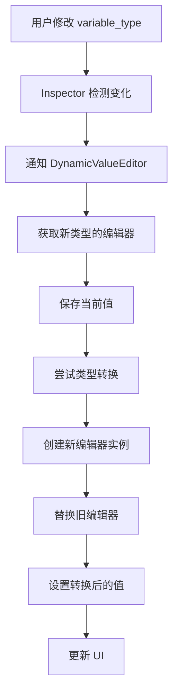

# CreateLocalVariableInstruction 动态 Inspector 插件设计方案

## 1. 项目概述

### 1.1 目标
为 `CreateLocalVariableInstruction` 创建一个自定义 Inspector 插件，使其 `default_value` 字段能够根据 `variable_type` 自动切换为合适的输入控件，提供直观的类型编辑体验。

### 1.2 核心需求
- 支持 BaseVariable.VariableType 枚举中定义的所有 23 种类型
- 当 variable_type 改变时，default_value 编辑器自动切换
- 提供类型验证和兼容性检查
- 保持与现有代码的兼容性
- 提供良好的用户体验

## 2. 技术架构

### 2.1 插件架构层次
```
EditorPlugin (plugin.gd)
    ↓
EditorInspectorPlugin (create_local_variable_inspector.gd)
    ↓
EditorProperty (dynamic_value_editor.gd)
    ↓
具体控件实现 (各种类型编辑器)
```

### 2.2 文件结构设计
```
addons/fuse/editor/
├── inspector/
│   ├── create_local_variable_inspector.gd      # 主 Inspector 插件
│   ├── dynamic_value_editor.gd                 # 动态值编辑器基类
│   ├── editors/                                # 具体类型编辑器
│   │   ├── bool_editor.gd                      # 布尔类型编辑器
│   │   ├── number_editor.gd                    # 数字类型编辑器 (INT/FLOAT)
│   │   ├── string_editor.gd                    # 字符串类型编辑器
│   │   ├── vector_editor.gd                    # 向量类型编辑器
│   │   ├── color_editor.gd                    # 颜色类型编辑器
│   │   ├── array_editor.gd                     # 数组类型编辑器
│   │   ├── dictionary_editor.gd               # 字典类型编辑器
│   │   ├── node_path_editor.gd                 # 节点路径编辑器
│   │   ├── resource_editor.gd                  # 资源类型编辑器
│   │   └── packed_array_editor.gd             # 打包数组编辑器
│   └── type_mapping.gd                         # 类型到控件的映射系统
```

## 3. 核心组件设计

### 3.1 CreateLocalVariableInspector (EditorInspectorPlugin)
**职责**: 检测 CreateLocalVariableInstruction 实例并注册自定义属性编辑器

**核心功能**:
- `_can_handle()`: 检查对象是否为 CreateLocalVariableInstruction
- `_parse_property()`: 拦截 default_value 属性并替换为自定义编辑器
- 监听 variable_type 变化并通知编辑器更新

### 3.2 DynamicValueEditor (EditorProperty)
**职责**: 管理动态值编辑器的核心逻辑

**核心功能**:
- 根据当前 variable_type 创建合适的子编辑器
- 处理类型切换时的编辑器替换
- 管理值的变化通知和验证
- 提供统一的编辑器接口

### 3.3 类型编辑器系统
**设计原则**: 每个类型编辑器继承自基础编辑器类，实现特定类型的编辑逻辑

**基础接口**:
```gdscript
class_name BaseValueEditor extends Control
# 必须实现的方法
func set_value(value: Variant)
func get_value() -> Variant
func set_placeholder(text: String)
func set_enabled(enabled: bool)

# 信号
signal value_changed(new_value: Variant)
```

## 4. 类型到控件的映射策略

### 4.1 基础类型映射
```gdscript
# 基础类型
VariableType.NIL → NullEditor (显示 "null" 标签)
VariableType.BOOL → CheckBox
VariableType.INT → SpinBox (整数范围)
VariableType.FLOAT → SpinBox (浮点数范围)
VariableType.STRING → LineEdit (多行可选)

# 数学类型
VariableType.VECTOR2 → Vector2Editor (X, Y 输入框)
VariableType.VECTOR2I → Vector2IEditor (整数 X, Y)
VariableType.VECTOR3 → Vector3Editor (X, Y, Z 输入框)
VariableType.VECTOR3I → Vector3IEditor (整数 X, Y, Z)
VariableType.COLOR → ColorPickerButton

# 容器类型
VariableType.ARRAY → ArrayEditor (列表视图)
VariableType.DICTIONARY → DictionaryEditor (键值对编辑器)

# 引用类型
VariableType.OBJECT → ResourcePicker (资源选择器)
VariableType.NODE_PATH → NodePathEditor (节点路径选择器)
VariableType.RID → RIDEditor (只读显示)
VariableType.SIGNAL → SignalEditor (信号选择器)
VariableType.CALLABLE → CallableEditor (方法选择器)

# 打包数组类型
VariableType.PACKED_*_ARRAY → PackedArrayEditor (类型化数组编辑器)
```

### 4.2 编辑器特性
- **实时验证**: 输入时立即验证类型兼容性
- **智能转换**: 支持类型间的自动转换 (如 int→float)
- **默认值**: 每种类型提供合理的默认值
- **占位符**: 显示期望的输入格式提示

## 5. 动态切换机制

### 5.1 切换流程


### 5.2 类型转换策略
```gdscript
# 转换优先级 (从高到低)
1. 直接兼容 (如 VECTOR2 → VECTOR2I)
2. 数值转换 (如 INT → FLOAT)
3. 字符串解析 (如 STRING "1,2" → VECTOR2)
4. 默认值回退 (无法转换时使用类型默认值)
```

## 6. 与现有代码的集成

### 6.1 插件注册
修改 `addons/fuse/plugin.gd`，在 `_enter_tree()` 中添加:
```gdscript
# 注册 Inspector 插件
var inspector_plugin = preload("res://addons/fuse/editor/inspector/create_local_variable_inspector.gd").new()
add_inspector_plugin(inspector_plugin)
```

### 6.2 兼容性保证
- 保持原有的 `@export var default_value: Variant` 声明
- 插件仅在编辑器中生效，不影响运行时行为
- 支持现有的 `_is_type_value_compatible()` 验证逻辑
- 保持与序列化系统的兼容性

## 7. 用户体验设计

### 7.1 视觉设计
- **类型指示**: 在编辑器旁边显示当前类型图标
- **错误提示**: 类型不兼容时显示红色边框和提示信息
- **转换提示**: 自动转换时显示小的转换图标
- **帮助信息**: 悬停时显示类型说明和示例

### 7.2 交互设计
- **即时反馈**: 类型切换时立即更新编辑器
- **智能默认**: 新类型自动设置合理的默认值
- **撤销支持**: 支持 Ctrl+Z 撤销类型切换
- **批量编辑**: 支持同时编辑多个 CreateLocalVariableInstruction

## 8. 实现步骤和优先级

### 8.1 第一阶段 (核心功能)
1. 创建基础插件架构
2. 实现基础类型编辑器 (BOOL, INT, FLOAT, STRING)
3. 实现动态切换机制
4. 基础测试和验证

### 8.2 第二阶段 (扩展功能)
1. 实现数学类型编辑器 (VECTOR2/3, COLOR)
2. 实现容器类型编辑器 (ARRAY, DICTIONARY)
3. 添加类型转换逻辑
4. 用户体验优化

### 8.3 第三阶段 (高级功能)
1. 实现引用类型编辑器 (OBJECT, NODE_PATH)
2. 实现打包数组编辑器
3. 添加高级验证和错误处理
4. 性能优化和测试

### 8.4 第四阶段 (完善和优化)
1. 添加批量编辑支持
2. 实现撤销/重做功能
3. 添加帮助文档和示例
4. 全面测试和 bug 修复

## 9. 技术考虑

### 9.1 性能优化
- 编辑器实例复用，避免频繁创建/销毁
- 延迟加载复杂编辑器 (如数组编辑器)
- 缓存类型映射关系

### 9.2 错误处理
- 优雅处理无效的默认值
- 提供清晰的错误信息和修复建议
- 支持从错误状态恢复

### 9.3 扩展性
- 设计可扩展的编辑器接口
- 支持自定义类型编辑器
- 提供插件 API 供第三方扩展

## 10. 测试策略

### 10.1 单元测试
- 每个类型编辑器的独立测试
- 类型转换逻辑测试
- 边界条件和异常情况测试

### 10.2 集成测试
- 与现有 CreateLocalVariableInstruction 的集成测试
- 序列化/反序列化兼容性测试
- 多实例并发编辑测试

### 10.3 用户测试
- 易用性测试和反馈收集
- 性能测试 (大量实例情况)
- 兼容性测试 (不同 Godot 版本)