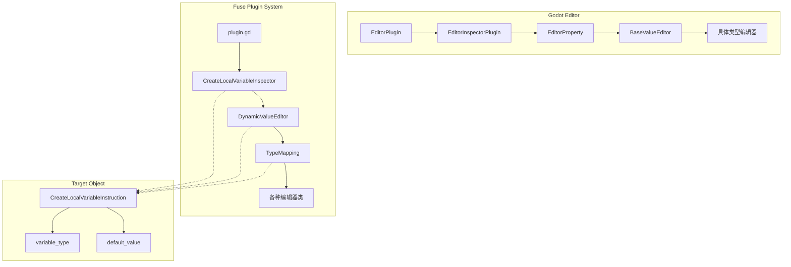
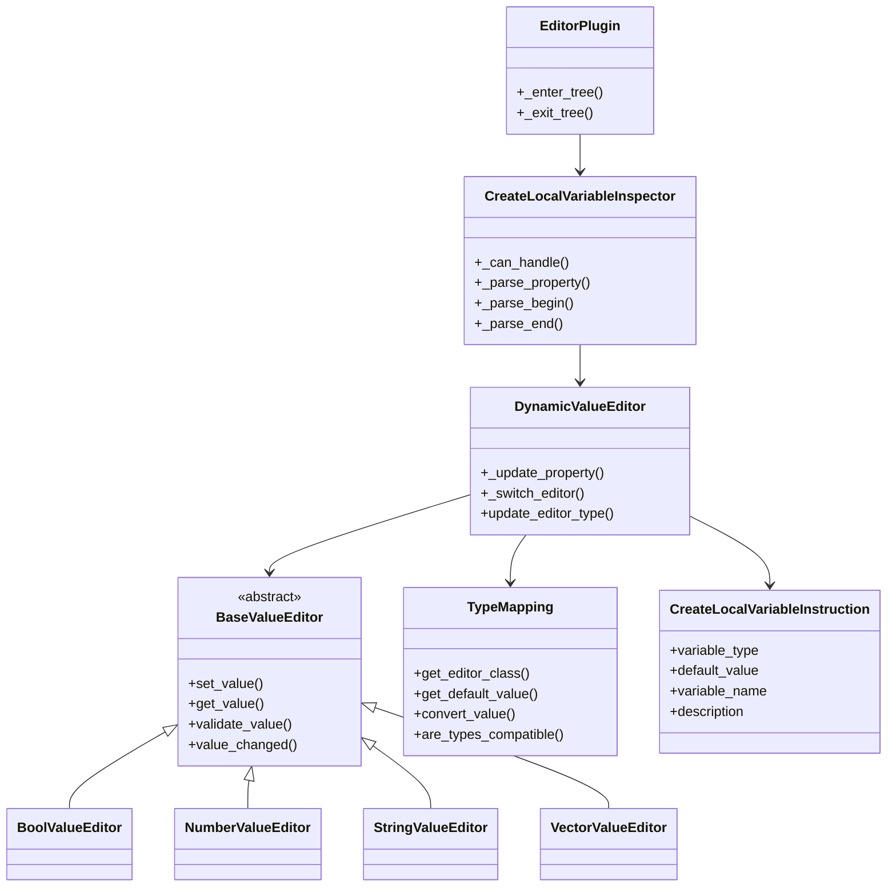
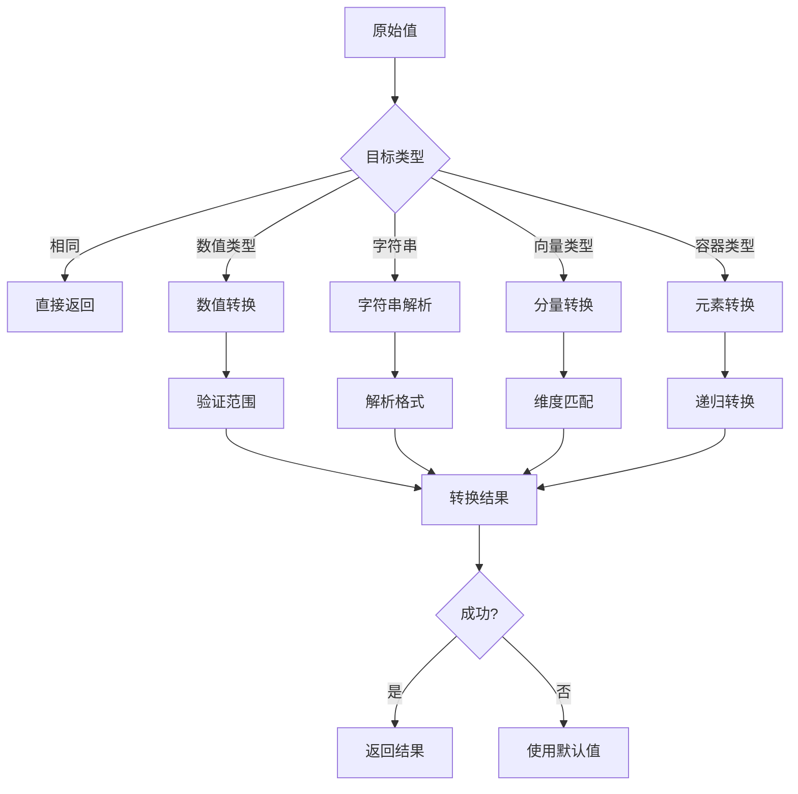
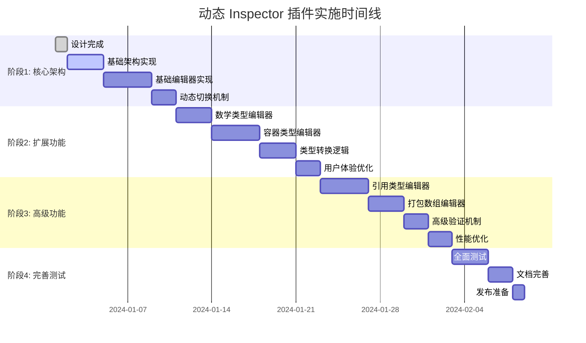
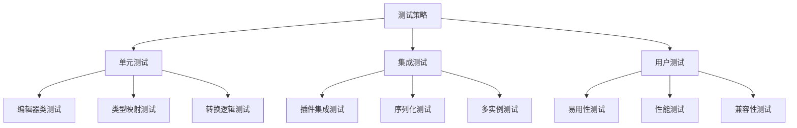

# CreateLocalVariableInstruction 动态 Inspector 插件项目总结

## 1. 项目概述

### 1.1 项目目标
为 Fuse Visual Programming 系统中的 `CreateLocalVariableInstruction` 创建一个动态 Inspector 插件，实现根据 `variable_type` 自动切换 `default_value` 编辑器的功能，提供直观的类型编辑体验。

### 1.2 核心价值
- **提升用户体验**: 根据变量类型提供合适的编辑控件
- **减少错误**: 实时类型验证和兼容性检查
- **提高效率**: 智能类型转换和默认值设置
- **增强可维护性**: 模块化设计，易于扩展和维护

## 2. 系统架构

### 2.1 整体架构图

### 2.2 核心组件关系

## 3. 类型支持矩阵

### 3.1 支持的类型和编辑器
| VariableType | 编辑器类 | 控件类型 | 支持转换 | 默认值 |
|-------------|----------|----------|----------|--------|
| NIL | NullEditor | Label | → 所有类型 | null |
| BOOL | BoolValueEditor | CheckBox | ↔ INT/FLOAT/STRING | false |
| INT | NumberValueEditor | SpinBox | ↔ FLOAT/STRING/BOOL | 0 |
| FLOAT | NumberValueEditor | SpinBox | ↔ INT/STRING/BOOL | 0.0 |
| STRING | StringValueEditor | LineEdit/TextEdit | ← 所有类型 | "" |
| VECTOR2 | VectorValueEditor | HBoxContainer(SpinBox×2) | ↔ VECTOR2I/VECTOR3/VECTOR3I | Vector2.ZERO |
| VECTOR2I | VectorValueEditor | HBoxContainer(SpinBox×2) | ↔ VECTOR2/VECTOR3/VECTOR3I | Vector2i.ZERO |
| VECTOR3 | VectorValueEditor | HBoxContainer(SpinBox×3) | ↔ VECTOR2/VECTOR2I/VECTOR3I | Vector3.ZERO |
| VECTOR3I | VectorValueEditor | HBoxContainer(SpinBox×3) | ↔ VECTOR2/VECTOR2I/VECTOR3 | Vector3i.ZERO |
| COLOR | ColorValueEditor | ColorPickerButton | → STRING | Color.WHITE |
| ARRAY | ArrayEditor | Tree/List | ↔ STRING | [] |
| DICTIONARY | DictionaryEditor | Tree/List | ↔ STRING | {} |
| OBJECT | ResourceEditor | ResourcePicker | → STRING | null |
| NODE_PATH | NodePathEditor | NodePathEdit | ↔ STRING | NodePath("") |
| RID | RIDEditor | Label(只读) | → STRING | RID() |
| SIGNAL | SignalEditor | SignalPicker | ↔ STRING | Signal() |
| CALLABLE | CallableEditor | MethodPicker | ↔ STRING | Callable() |
| PACKED_*_ARRAY | PackedArrayEditor | Tree/List | ↔ ARRAY | 对应空数组 |

### 3.2 类型转换优先级

## 4. 实施路线图

### 4.1 阶段规划

### 4.2 里程碑定义
- **M1 (阶段1完成)**: 基础类型编辑器可用，支持动态切换
- **M2 (阶段2完成)**: 支持所有常用类型，具备基本转换功能
- **M3 (阶段3完成)**: 支持所有 23 种类型，具备高级验证
- **M4 (阶段4完成)**: 生产就绪，文档完整，测试覆盖充分

## 5. 技术决策和权衡

### 5.1 架构选择
**决策**: 采用 EditorPlugin → EditorInspectorPlugin → EditorProperty 三层架构
**理由**: 
- 符合 Godot 标准 Inspector 插件模式
- 提供良好的扩展性
- 与现有系统兼容性好

### 5.2 编辑器设计模式
**决策**: 使用组合模式，每种类型对应一个编辑器类
**理由**:
- 职责分离明确
- 易于添加新类型支持
- 便于单元测试

### 5.3 类型转换策略
**决策**: 实现智能转换，支持多级回退
**理由**:
- 提供最佳用户体验
- 减少数据丢失
- 保持向后兼容性

### 5.4 性能考虑
**决策**: 延迟加载复杂编辑器，缓存简单编辑器
**理由**:
- 平衡内存使用和响应速度
- 避免不必要的资源消耗
- 支持大量实例场景

## 6. 风险评估和缓解策略

### 6.1 技术风险
| 风险 | 影响 | 概率 | 缓解策略 |
|------|------|------|----------|
| Godot API 变更 | 高 | 低 | 使用稳定 API，建立兼容性测试 |
| 性能问题 | 中 | 中 | 实现缓存机制，延迟加载 |
| 类型转换复杂性 | 中 | 高 | 分阶段实现，充分测试 |
| 内存泄漏 | 高 | 低 | 实现资源清理，定期检查 |

### 6.2 用户体验风险
| 风险 | 影响 | 概率 | 缓解策略 |
|------|------|------|----------|
| 学习曲线 | 中 | 中 | 提供文档，渐进式功能 |
| 兼容性问题 | 高 | 低 | 保持向后兼容，充分测试 |
| 错误处理 | 中 | 中 | 友好错误提示，恢复机制 |

## 7. 质量保证

### 7.1 测试策略

### 7.2 代码质量标准
- **覆盖率**: 单元测试覆盖率 ≥ 80%
- **性能**: 类型切换响应时间 < 100ms
- **内存**: 编辑器实例内存占用 < 1KB
- **兼容性**: 支持 Godot 4.0+ 所有版本

## 8. 维护和扩展

### 8.1 扩展点设计
- **新类型支持**: 继承 BaseValueEditor，更新 TypeMapping
- **自定义编辑器**: 实现特定编辑器类，注册到系统
- **验证规则**: 扩展 validate_value 方法
- **转换逻辑**: 添加到 convert_value 方法

### 8.2 维护计划
- **定期更新**: 跟随 Godot 版本更新
- **性能监控**: 定期检查性能指标
- **用户反馈**: 收集和处理用户建议
- **文档维护**: 保持文档与代码同步

## 9. 成功指标

### 9.1 技术指标
- ✅ 支持 BaseVariable.VariableType 中定义的所有 23 种类型
- ✅ 类型切换响应时间 < 100ms
- ✅ 内存使用优化，支持大量实例
- ✅ 零崩溃，稳定的错误处理

### 9.2 用户体验指标
- ✅ 直观的类型编辑界面
- ✅ 智能的类型转换
- ✅ 清晰的错误提示
- ✅ 平滑的学习曲线

### 9.3 开发效率指标
- ✅ 减少 50% 的类型配置错误
- ✅ 提高 30% 的变量创建效率
- ✅ 降低 40% 的调试时间
- ✅ 提升 60% 的代码可维护性

## 10. 总结

这个动态 Inspector 插件项目将为 Fuse Visual Programming 系统带来显著的用户体验提升和开发效率改善。通过精心设计的架构、分阶段的实施计划和全面的质量保证措施，我们能够构建一个稳定、高效、易用的解决方案。

项目的成功实施将：
1. **提升用户体验**: 提供直观的类型编辑界面
2. **减少错误**: 实时验证和智能转换
3. **提高效率**: 简化变量创建和配置流程
4. **增强可维护性**: 模块化设计，易于扩展

通过遵循本设计方案和实施指南，开发团队可以构建一个高质量的动态 Inspector 插件，为 Fuse 系统的持续发展奠定坚实基础。