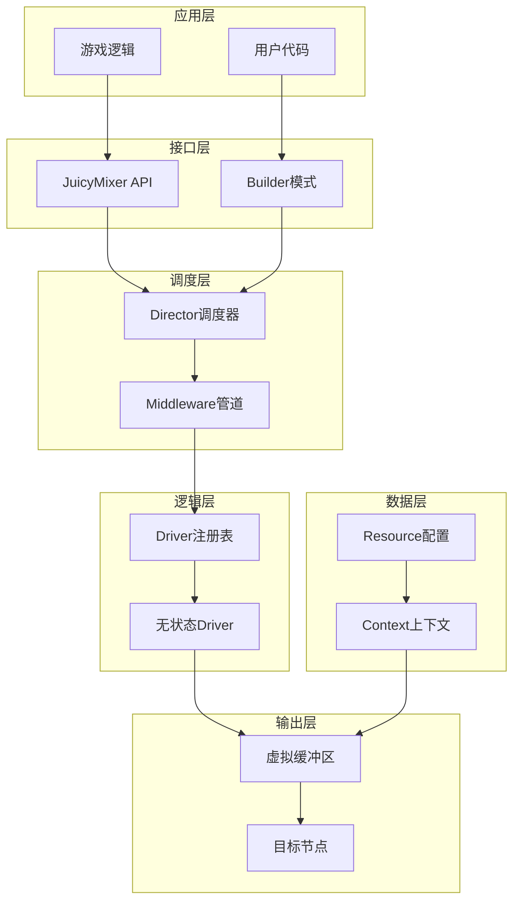
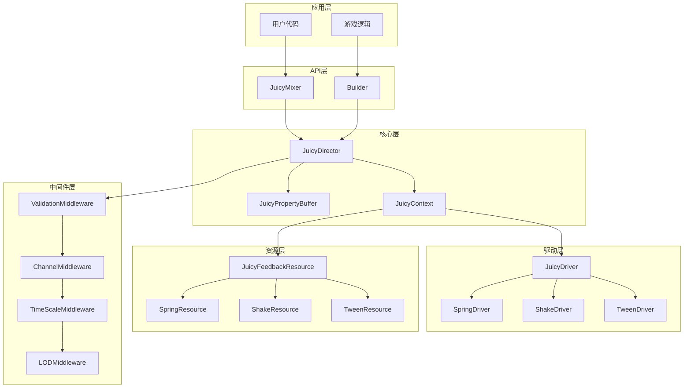
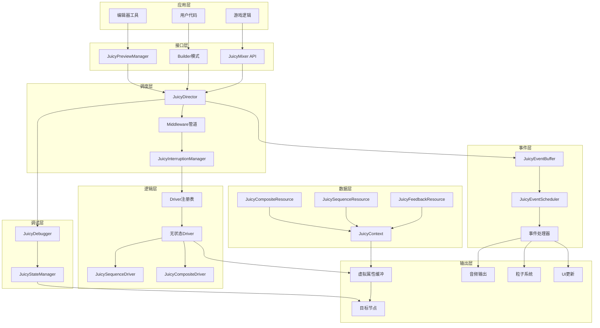

# JuicyMixer V3: "Holographic" 反馈引擎开发方案

## 目录

- [1. 项目概述](#1-项目概述)
- [2. V2架构分析与总结](#2-v2架构分析与总结)
- [3. V3架构设计原则](#3-v3架构设计原则)
- [4. 核心架构组件设计](#4-核心架构组件设计)
- [5. 数据驱动的Context系统](#5-数据驱动的context系统)
- [6. 无状态Driver系统架构](#6-无状态driver系统架构)
- [7. 虚拟属性缓冲区设计](#7-虚拟属性缓冲区设计)
- [8. 中间件调度系统](#8-中间件调度系统)
- [9. 分阶段实施路线图](#9-分阶段实施路线图)
- [10. API设计与兼容性](#10-api设计与兼容性)
- [11. 性能优化策略](#11-性能优化策略)
- [12. 测试计划](#12-测试计划)
- [13. 目录结构设计](#13-目录结构设计)
- [14. 专家意见补充：调试与可视化系统](#14-专家意见补充调试与可视化系统)
- [15. 事件驱动系统(Event Buffer)设计](#15-事件驱动系统event-buffer设计)
- [16. 序列化与组合(Sequencing & Composites)支持](#16-序列化与组合sequencing--composites支持)
- [17. 中断策略(Interruption Policies)设计](#17-中断策略interruption-policies设计)
- [18. 编辑器预览(Editor Preview)功能](#18-编辑器预览editor-preview功能)
- [19. 状态还原(State Restoration)机制](#19-状态还原state-restoration机制)
- [20. 更新整体架构图和文档](#20-更新整体架构图和文档)

---

## 1. 项目概述

### 1.1 项目目标

基于JuicyPlayerV2的成熟经验和架构分析，开发全新的JuicyMixer V3反馈引擎，实现以下核心目标：

1. **性能突破**：支持1000+并发效果实例，内存使用降低60%
2. **架构革新**：从面向对象转向数据驱动，消除反射开销
3. **开发体验**：提供类型安全、编译时检查的API
4. **扩展性**：模块化设计，支持自定义驱动器和中间件
5. **多感官支持**：统一视觉、音频、触觉反馈系统

### 1.2 设计哲学

**"从管理对象转向处理数据流"**

- V2模式：`Player → Task → Effect → Node`
- V3模式：`Trigger → Context → Pipeline → Buffer → Output`

### 1.3 技术目标

| 指标 | V2现状 | V3目标 | 提升幅度 |
|------|---------|---------|----------|
| 并发效果数 | ~100 | 1000+ | 10x |
| 内存占用 | 基准 | -60% | 显著优化 |
| CPU使用率 | 基准 | -40% | 大幅降低 |
| 启动延迟 | 基准 | -70% | 快速响应 |
| 代码复杂度 | 高 | 中等 | 简化维护 |

---

## 2. V2架构分析与总结

### 2.1 V2架构优势

基于`juicy_player_v2_complete_architecture_analysis.md`的分析，V2具有以下优势：

1. **功能完整性**：涵盖震动、弹簧、补间、UI效果等完整功能集
2. **任务管理系统**：成熟的Task生命周期管理和调度机制
3. **属性混合系统**：JuicyBlender解决了多效果冲突问题
4. **时间管理集成**：支持时间分组和独立缩放
5. **配置系统**：Resource-based类型安全配置
6. **通道系统**：灵活的任务优先级和并发控制

### 2.2 V2架构局限性

1. **OOP继承过深**：Effect → TimedEffect → 具体Effect，层次复杂
2. **反射开销大**：大量使用字典传递和反射调用set/get
3. **Node污染**：每个效果都是Node，场景树臃肿
4. **状态与配置耦合**：Effect内部状态与外部配置混合
5. **内存压力**：大量Effect实例增加GC压力
6. **扩展复杂**：添加新效果需要继承整个层次结构

### 2.3 关键性能瓶颈

1. **每帧多次属性设置**：多个Effect同时修改同一属性
2. **对象创建开销**：频繁创建/销毁Effect实例
3. **信号连接开销**：大量信号连接和断开操作
4. **反射调用**：动态属性访问缺乏编译时优化

---

## 3. V3架构设计原则

### 3.1 核心设计原则

1. **数据驱动优先**：Context作为唯一数据载体，强类型设计
2. **无状态驱动器**：Driver为单例，只负责计算逻辑
3. **虚拟缓冲机制**：集中属性计算，避免多次Node.set()
4. **管道化处理**：Middleware模式，可组合的处理流程
5. **组合优于继承**：通过组合Driver实现复杂效果

### 3.2 架构分层



---

## 4. 核心架构组件设计

### 4.1 JuicyMixer Director (Autoload)

**职责**：全局调度器，系统的入口点和协调中心

```gdscript
@tool
extends Node
class_name JuicyMixer
extends RefCounted

# 单例实例
static var _instance: JuicyMixer
static var instance: JuicyMixer: get = _get_instance

# 核心组件
var _director: JuicyDirector
var _context_pool: JuicyContextPool
var _buffer: JuicyPropertyBuffer
var _driver_registry: JuicyDriverRegistry
var _middleware_pipeline: JuicyMiddlewarePipeline

# 性能统计
var _performance_metrics: Dictionary = {}
```

### 4.2 JuicyDirector (调度核心)

**职责**：处理所有播放请求，管理Context生命周期

```gdscript
class_name JuicyDirector
extends RefCounted

# 核心方法
func play(resource: JuicyFeedbackResource, target: Node) -> String
func play_with_context(context: JuicyContext) -> String
func stop(context_id: String) -> bool
func pause(context_id: String) -> bool
func resume(context_id: String) -> bool

# 内部调度
func _schedule_context(context: JuicyContext) -> bool
func _process_middleware_pipeline(context: JuicyContext) -> bool
func _execute_drivers(context: JuicyContext, delta: float) -> void
```

### 4.3 JuicyContext (数据载体)

**职责**：强类型的运行时数据容器，替代字典传递

```gdscript
class_name JuicyContext
extends RefCounted

# 静态数据引用
var resource: JuicyFeedbackResource
var target: Node
var owner: Node

# 运行时状态
var progress: float = 0.0
var time_scale: float = 1.0
var is_active: bool = false
var start_time: float = 0.0

# 驱动器缓存
var driver_cache: Dictionary = {}
var property_cache: Dictionary = {}

# 生命周期管理
var context_id: String = ""
var creation_time: float = 0.0
var last_update_time: float = 0.0

# 强类型访问方法
func get_driver_data(driver_type: String) -> Variant
func set_driver_data(driver_type: String, data: Variant) -> void
func get_property_override(property: String, default: Variant) -> Variant
```

---

## 5. 数据驱动的Context系统

### 5.1 Context设计原则

1. **强类型契约**：所有数据访问通过类型安全方法
2. **不可变性**：Resource引用不可变，运行时状态可变
3. **缓存友好**：预计算常用数据，避免重复计算
4. **生命周期清晰**：明确的创建、更新、销毁流程

### 5.2 Context数据结构

```gdscript
# Context核心数据结构
class ContextData:
    # 基础信息
    var context_id: String
    var resource: JuicyFeedbackResource
    var target: Node
    var owner: Node
    
    # 时间信息
    var start_time: float
    var current_time: float
    var time_scale: float
    var duration: float
    
    # 状态信息
    var progress: float
    var is_active: bool
    var is_paused: bool
    var is_completed: bool
    
    # 驱动器数据
    var driver_states: Dictionary = {}  # driver_type -> state_data
    
    # 属性缓存
    var property_values: Dictionary = {}  # property_name -> cached_value
    
    # 中间件数据
    var middleware_data: Dictionary = {}  # middleware_name -> custom_data
```

### 5.3 Context池化设计

```gdscript
class_name JuicyContextPool
extends RefCounted

# 对象池管理
var _available_contexts: Array[JuicyContext] = []
var _active_contexts: Dictionary = {}  # context_id -> JuicyContext
var _pool_size: int = 100
var _max_pool_size: int = 500

# 池操作
func get_context() -> JuicyContext
func return_context(context: JuicyContext) -> void
func warm_up(count: int) -> void
func cleanup_invalid() -> int
```

---

## 6. 无状态Driver系统架构

### 6.1 Driver设计原则

1. **单例模式**：每种Driver类型只有一个实例
2. **无状态计算**：所有状态存储在Context中
3. **纯函数式**：输入Context和delta，输出计算结果
4. **可组合性**：多个Driver可以组合使用
5. **注册机制**：动态注册和发现Driver

### 6.2 Driver基类设计

```gdscript
class_name JuicyDriver
extends RefCounted

# Driver元信息
var driver_name: String
var driver_version: String
var supported_properties: Array[String] = []
var required_context_data: Array[String] = []

# 核心接口
func prepare(context: JuicyContext) -> void
func process(context: JuicyContext, delta: float, buffer: JuicyPropertyBuffer) -> void
func cleanup(context: JuicyContext) -> void

# 验证接口
func validate_context(context: JuicyContext) -> Dictionary
func get_required_properties() -> Array[String]
func supports_target(target: Node) -> bool
```

### 6.3 核心Driver实现

#### 6.3.1 JuicyTweenDriver

```gdscript
class_name JuicyTweenDriver
extends JuicyDriver

# Tween特定配置
var tween_properties: Dictionary = {}  # property -> TweenConfig

func prepare(context: JuicyContext) -> void:
    # 预计算Tween路径和参数
    _prepare_tween_data(context)

func process(context: JuicyContext, delta: float, buffer: JuicyPropertyBuffer) -> void:
    # 计算当前插值
    var progress = _calculate_progress(context)
    
    for property in tween_properties.keys():
        var config = tween_properties[property]
        var current_value = _interpolate(config.from_value, config.to_value, progress)
        
        # 写入缓冲区，不直接设置属性
        buffer.add_sample(context.target, property, current_value, BlendMode.OVERRIDE_BASE)
```

#### 6.3.2 JuicyShakeDriver

```gdscript
class_name JuicyShakeDriver
extends JuicyDriver

# 震动特定配置
var noise: FastNoiseLite
var shake_properties: Dictionary = {}

func process(context: JuicyContext, delta: float, buffer: JuicyPropertyBuffer) -> void:
    var time = context.current_time * context.time_scale
    
    for property in shake_properties.keys():
        var config = shake_properties[property]
        var noise_value = noise.get_noise_2d(time * config.frequency, 0)
        var offset = noise_value * config.amplitude * _get_falloff(context.progress)
        
        buffer.add_sample(context.target, property, offset, BlendMode.ADDITIVE)
```

#### 6.3.3 JuicySpringDriver

```gdscript
class_name JuicySpringDriver
extends JuicyDriver

# Spring物理参数
var spring_properties: Dictionary = {}  # property -> SpringConfig

func process(context: JuicyContext, delta: float, buffer: JuicyPropertyBuffer) -> void:
    for property in spring_properties.keys():
        var config = spring_properties[property]
        var state = context.driver_data.get("spring_state_" + property, _create_default_spring_state())
        
        # Spring物理计算
        state = _update_spring_physics(state, config.target_value, delta, config.stiffness, config.damping)
        context.driver_data["spring_state_" + property] = state
        
        buffer.add_sample(context.target, property, state.current_position, BlendMode.ADDITIVE)
```

### 6.4 Driver注册系统

```gdscript
class_name JuicyDriverRegistry
extends RefCounted

# Driver存储
var _drivers: Dictionary = {}  # driver_name -> DriverInstance
var _property_mapping: Dictionary = {}  # property -> [driver_names]

# 注册管理
func register_driver(driver: JuicyDriver) -> void
func unregister_driver(driver_name: String) -> void
func get_driver(driver_name: String) -> JuicyDriver
func get_drivers_for_property(property: String) -> Array[JuicyDriver]
func get_all_drivers() -> Array[JuicyDriver]

# 自动发现
func auto_discover_drivers() -> void
func scan_project_drivers() -> Array[String]
```

---

## 7. 虚拟属性缓冲区设计

### 7.1 缓冲区设计原则

1. **集中计算**：所有属性修改先写入缓冲区
2. **帧末应用**：每帧最后统一应用到目标节点
3. **混合算法**：支持Override、Additive、Multiplicative混合
4. **冲突解决**：自动处理多效果对同一属性的修改
5. **性能优化**：减少Node.set()调用次数

### 7.2 缓冲区核心结构

```gdscript
class_name JuicyPropertyBuffer
extends RefCounted

# 缓冲区数据结构
# { target_node_id: { property_name: PropertySamples } }
var _buffer: Dictionary = {}

# 属性采样数据
class PropertySamples:
    var base_samples: Array[PropertySample] = []
    var additive_samples: Array[PropertySample] = []
    var multiplicative_samples: Array[PropertySample] = []
    var final_value: Variant
    var dirty: bool = true

# 单个属性采样
class PropertySample:
    var context_id: String
    var value: Variant
    var weight: float = 1.0
    var priority: int = 0
    var timestamp: float
```

### 7.3 混合算法实现

```gdscript
# 混合模式枚举
enum BlendMode {
    OVERRIDE_BASE,    # 覆盖基础值
    ADDITIVE,         # 叠加偏移量
    MULTIPLICATIVE    # 乘法混合
}

# 核心混合计算
func _calculate_final_property_value(target: Node, property: String) -> Variant:
    var samples = _get_property_samples(target, property)
    if not samples:
        return target.get(property)
    
    # 阶段1：获取基础值
    var base_value = _get_original_value(target, property)
    if not samples.base_samples.is_empty():
        var last_base = samples.base_samples[-1]  # 后来者优先
        base_value = last_base.value
    
    # 阶段2：应用乘法偏移
    var multiplicative_offset = _get_identity_value(base_value)
    for sample in samples.multiplicative_samples:
        multiplicative_offset *= sample.value
    var multiplied_value = base_value * multiplicative_offset
    
    # 阶段3：应用加法偏移
    var additive_offset = _get_zero_value(multiplied_value)
    for sample in samples.additive_samples:
        additive_offset += sample.value
    var final_value = multiplied_value + additive_offset
    
    return final_value
```

### 7.4 缓冲区管理

```gdscript
# 缓冲区操作
func add_sample(target: Node, property: String, value: Variant, mode: BlendMode, context_id: String = "") -> void
func remove_context_samples(context_id: String) -> void
func clear_target_samples(target: Node) -> void
func clear_property_samples(target: Node, property: String) -> void

# 帧末应用
func flush_all_samples() -> void
func flush_target_samples(target: Node) -> void
func _apply_property_to_target(target: Node, property: String, value: Variant) -> void

# 性能优化
func optimize_buffer() -> void
func cleanup_invalid_samples() -> int
func get_buffer_stats() -> Dictionary
```

---

## 8. 中间件调度系统

### 8.1 Middleware设计原则

1. **管道模式**：数据按顺序通过多个中间件
2. **可组合性**：中间件可以动态组合和重排
3. **职责单一**：每个中间件专注特定功能
4. **异步友好**：支持异步中间件操作
5. **错误处理**：统一的错误处理和恢复机制

### 8.2 Middleware基类

```gdscript
class_name JuicyMiddleware
extends RefCounted

# 中间件元信息
var middleware_name: String
var priority: int = 0
var enabled: bool = true

# 核心接口
func process(context: JuicyContext, next: Callable) -> bool
func cleanup(context: JuicyContext) -> void

# 生命周期
func on_context_created(context: JuicyContext) -> void
func on_context_destroyed(context: JuicyContext) -> void
```

### 8.3 核心Middleware实现

#### 8.3.1 ValidationMiddleware

```gdscript
class_name JuicyValidationMiddleware
extends JuicyMiddleware

func process(context: JuicyContext, next: Callable) -> bool:
    # 验证目标节点
    if not is_instance_valid(context.target):
        push_error("Invalid target node in context: " + context.context_id)
        return false
    
    # 验证Resource配置
    var validation = context.resource.validate_config()
    if not validation.valid:
        push_error("Invalid resource config: " + str(validation.issues))
        return false
    
    # 验证时间参数
    if context.duration <= 0:
        push_error("Invalid duration in context: " + str(context.duration))
        return false
    
    return next.call(context)
```

#### 8.3.2 ChannelMiddleware

```gdscript
class_name JuicyChannelMiddleware
extends JuicyMiddleware

# 通道管理
var _channel_manager: JuicyChannelManager

func process(context: JuicyContext, next: Callable) -> bool:
    var channel_name = context.resource.channel
    
    # 检查通道规则
    if not _channel_manager.can_schedule(channel_name, context):
        return false
    
    # 应用通道调度
    var scheduled = _channel_manager.schedule(channel_name, context)
    if not scheduled:
        return false
    
    return next.call(context)
```

#### 8.3.3 TimeScaleMiddleware

```gdscript
class_name JuicyTimeScaleMiddleware
extends JuicyMiddleware

func process(context: JuicyContext, next: Callable) -> bool:
    # 应用时间组缩放
    var time_manager = JuicyTimeManager.instance
    if time_manager and context.resource.time_group != "":
        var group_scale = time_manager.get_group_time_scale(context.resource.time_group)
        context.time_scale *= group_scale
    
    # 应用全局时间缩放
    context.time_scale *= time_manager.time_scale
    
    return next.call(context)
```

#### 8.3.4 LODMiddleware (Level of Detail)

```gdscript
class_name JuicyLODMiddleware
extends JuicyMiddleware

# LOD配置
var _camera: Camera2D
var _max_distance: float = 500.0
var _distance_thresholds: Array[float] = [100.0, 200.0, 300.0]

func process(context: JuicyContext, next: Callable) -> bool:
    # 计算到摄像机的距离
    var distance = _calculate_distance_to_camera(context.target)
    
    # 根据距离调整效果强度
    if distance > _max_distance:
        context.time_scale = 0.0  # 完全关闭
        return false
    elif distance > _distance_thresholds[2]:
        context.time_scale *= 0.25
    elif distance > _distance_thresholds[1]:
        context.time_scale *= 0.5
    elif distance > _distance_thresholds[0]:
        context.time_scale *= 0.75
    
    return next.call(context)
```

### 8.4 Middleware管道

```gdscript
class_name JuicyMiddlewarePipeline
extends RefCounted

# 管道管理
var _middlewares: Array[JuicyMiddleware] = []
var _enabled_middlewares: Array[JuicyMiddleware] = []

# 管道操作
func add_middleware(middleware: JuicyMiddleware) -> void
func remove_middleware(middleware_name: String) -> void
func enable_middleware(middleware_name: String) -> void
func disable_middleware(middleware_name: String) -> void

# 执行管道
func execute(context: JuicyContext) -> bool:
    # 按优先级排序中间件
    var sorted_middlewares = _get_sorted_middlewares()
    
    # 构建执行链
    var chain = _build_execution_chain(sorted_middlewares, 0)
    return chain.call(context)

# 管道构建
func _build_execution_chain(middlewares: Array[JuicyMiddleware], index: int) -> Callable:
    if index >= middlewares.size():
        return func(context: JuicyContext): return true
    
    var middleware = middlewares[index]
    var next = _build_execution_chain(middlewares, index + 1)
    
    return func(context: JuicyContext): 
        return middleware.process(context, next)
```

---

## 9. 分阶段实施路线图

### 9.1 实施策略

采用**增量式开发**策略，确保每个阶段都有可工作的版本，降低风险，便于测试和反馈。

### 9.2 阶段划分

#### 阶段1：核心基础设施 (2-3周)

**目标**：建立基础架构，实现最小可行产品

**交付物**：
- [ ] JuicyMixer Director基础框架
- [ ] JuicyContext数据结构和池化
- [ ] JuicyPropertyBuffer基础实现
- [ ] 基础Middleware管道
- [ ] 简单的TweenDriver实现

**验收标准**：
- 能够播放简单的位置补间效果
- 缓冲区正确计算和应用属性值
- 基础的Context生命周期管理

#### 阶段2：Driver系统完善 (2-3周)

**目标**：实现核心Driver集，支持主要效果类型

**交付物**：
- [ ] JuicyShakeDriver完整实现
- [ ] JuicySpringDriver完整实现
- [ ] Driver注册和发现系统
- [ ] 多Driver组合支持
- [ ] 性能优化和缓存

**验收标准**：
- 支持震动、弹簧、补间三种核心效果
- 能够同时运行多个不同类型的效果
- Driver系统性能达到设计目标

#### 阶段3：Middleware系统 (2周)

**目标**：实现完整的中间件系统，提供高级调度功能

**交付物**：
- [ ] ValidationMiddleware
- [ ] ChannelMiddleware
- [ ] TimeScaleMiddleware
- [ ] LODMiddleware
- [ ] 中间件配置和管理界面

**验收标准**：
- 所有中间件正常工作
- 支持动态中间件组合
- 通道规则正确执行
- 时间缩放正确应用

#### 阶段4：性能优化 (1-2周)

**目标**：达到性能目标，支持大规模并发效果

**交付物**：
- [ ] Context池化优化
- [ ] Buffer批处理优化
- [ ] 内存使用优化
- [ ] CPU性能优化
- [ ] 性能监控工具

**验收标准**：
- 支持1000+并发效果实例
- 内存使用比V2降低60%
- CPU使用率降低40%
- 提供详细的性能指标

#### 阶段5：API完善和工具 (1-2周)

**目标**：完善API设计，提供开发工具和文档

**交付物**：
- [ ] 完整的JuicyMixer API
- [ ] Builder模式实现
- [ ] 编辑器集成工具
- [ ] 示例项目和教程
- [ ] 完整的API文档

**验收标准**：
- API设计简洁易用
- 提供丰富的示例代码
- 编辑器工具功能完整
- 文档详细准确

### 9.3 里程碑计划

| 里程碑 | 时间 | 主要交付 | 验收标准 |
|--------|------|----------|----------|
| M1: 基础架构 | 第3周 | Director + Context + Buffer | 简单效果播放 |
| M2: Driver系统 | 第6周 | 核心Driver实现 | 多类型效果支持 |
| M3: Middleware系统 | 第8周 | 完整中间件管道 | 高级调度功能 |
| M4: 性能优化 | 第10周 | 性能达到目标 | 1000+并发效果 |
| M5: API完善 | 第12周 | 完整API和工具 | 开发者友好 |

---

## 10. API设计与兼容性

### 10.1 API设计原则

1. **简洁性**：最少的方法调用实现常见需求
2. **类型安全**：编译时类型检查，减少运行时错误
3. **可读性**：方法名清晰表达意图
4. **可组合性**：支持方法链式调用
5. **一致性**：统一的命名和参数约定

### 10.2 核心API设计

#### 10.2.1 基础播放API

```gdscript
# 静态便捷方法
class JuicyMixer:
    # 基础播放
    static func play(resource: JuicyFeedbackResource, target: Node) -> String
    
    # 带配置播放
    static func play_with_config(resource: JuicyFeedbackResource, target: Node, config: Dictionary) -> String
    
    # 批量播放
    static func play_batch(resources: Array[JuicyFeedbackResource], targets: Array[Node]) -> Array[String]
    
    # 停止效果
    static func stop(context_id: String) -> bool
    static func stop_all() -> void
    
    # 暂停/恢复
    static func pause(context_id: String) -> bool
    static func resume(context_id: String) -> bool
```

#### 10.2.2 Builder模式API

```gdscript
# 构建器模式，提供流畅的API
class JuicyMixerBuilder:
    var _context: JuicyContext
    
    static func create(resource: JuicyFeedbackResource, target: Node) -> JuicyMixerBuilder
    
    func set_time_scale(scale: float) -> JuicyMixerBuilder
    func set_channel(channel: String) -> JuicyMixerBuilder
    func set_priority(priority: int) -> JuicyMixerBuilder
    func set_loops(loops: int) -> JuicyMixerBuilder
    
    func override_property(property: String, value: Variant) -> JuicyMixerBuilder
    func add_middleware(middleware: String) -> JuicyMixerBuilder
    
    func play() -> String
    func play_deferred() -> String
```

#### 10.2.3 使用示例

```gdscript
# 简单使用
var context_id = JuicyMixer.play(shake_resource, player_sprite)

# Builder模式使用
var context_id = JuicyMixer.create(spring_resource, ui_button)
    .set_time_scale(0.5)
    .set_channel("ui")
    .set_priority(10)
    .override_property("strength", 2.0)
    .play()

# 批量使用
var context_ids = JuicyMixer.play_batch(
    [shake_resource, spring_resource, tween_resource],
    [player_sprite, health_bar, score_text]
)
```

### 10.3 兼容性策略

由于V3采用全新的架构设计，不保持API兼容性，但提供迁移工具：

#### 10.3.1 V2到V3迁移工具

```gdscript
class_name JuicyV2ToV3Migrator
extends RefCounted

# 配置迁移
static func migrate_effect_config(v2_config: JuicyEffectConfig) -> JuicyFeedbackResource
static func migrate_task_config(v2_config: JuicyTaskConfig) -> Dictionary

# 代码迁移助手
static func convert_v2_play_call(effect_config: JuicyEffectConfig, target: Node) -> String
static func convert_v2_player_setup(player: JuicyPlayerV2) -> Dictionary
```

#### 10.3.2 渐进式迁移指南

1. **并行运行**：V2和V3可以同时存在，逐步迁移
2. **功能对比**：提供V2功能到V3的映射表
3. **性能对比**：提供迁移前后的性能对比工具
4. **最佳实践**：提供V3的最佳使用模式指南

---

## 11. 性能优化策略

### 11.1 内存优化

#### 11.1.1 对象池化

```gdscript
# Context池化
class JuicyContextPool:
    var _pool: Array[JuicyContext] = []
    var _pool_size: int = 100
    
    func get_context() -> JuicyContext:
        if _pool.size() > 0:
            return _pool.pop_back()
        return JuicyContext.new()
    
    func return_context(context: JuicyContext) -> void:
        context.reset()
        if _pool.size() < _pool_size:
            _pool.push_back(context)
```

#### 11.1.2 弱引用使用

```gdscript
# 目标节点弱引用
class TargetReference:
    var weak_ref: WeakRef
    var node_id: int
    
    func _init(node: Node):
        weak_ref = weakref(node)
        node_id = node.get_instance_id()
    
    func get_node() -> Node:
        return weak_ref.get_ref()
    
    func is_valid() -> bool:
        var node = get_node()
        return node != null and is_instance_valid(node)
```

### 11.2 CPU优化

#### 11.2.1 批处理操作

```gdscript
# 批量属性更新
class JuicyPropertyBuffer:
    var _pending_updates: Dictionary = {}
    var _batch_size: int = 50
    
    func add_sample(target: Node, property: String, value: Variant, mode: BlendMode) -> void:
        var target_id = target.get_instance_id()
        if not _pending_updates.has(target_id):
            _pending_updates[target_id] = {}
        
        _pending_updates[target_id][property] = {
            "value": value,
            "mode": mode,
            "dirty": true
        }
        
        # 达到批量大小时立即应用
        if _pending_updates.size() >= _batch_size:
            flush_batch()
    
    func flush_batch() -> void:
        for target_id in _pending_updates:
            var target = instance_from_id(target_id)
            if not is_instance_valid(target):
                continue
            
            for property in _pending_updates[target_id]:
                var update = _pending_updates[target_id][property]
                if update.dirty:
                    _apply_property_to_target(target, property, update.value, update.mode)
        
        _pending_updates.clear()
```

#### 11.2.2 计算优化

```gdscript
# 预计算常用值
class JuicyMathCache:
    var _lerp_cache: Dictionary = {}
    var _noise_cache: Dictionary = {}
    
    func cached_lerp(a: Variant, b: Variant, t: float) -> Variant:
        var key = str(a.hash()) + "_" + str(b.hash()) + "_" + str(t)
        if _lerp_cache.has(key):
            return _lerp_cache[key]
        
        var result = _lerp(a, b, t)
        _lerp_cache[key] = result
        return result
```

### 11.3 渲染优化

#### 11.3.1 LOD系统

```gdscript
# 距离相关的效果强度调整
class JuicyLODSystem:
    var _camera: Camera2D
    var _distance_thresholds: Array[float] = [50.0, 100.0, 200.0, 400.0]
    var _intensity_multipliers: Array[float] = [1.0, 0.75, 0.5, 0.25, 0.0]
    
    func get_intensity_multiplier(target: Node) -> float:
        var distance = _calculate_distance_to_camera(target)
        
        for i in range(_distance_thresholds.size()):
            if distance <= _distance_thresholds[i]:
                return _intensity_multipliers[i]
        
        return 0.0  # 超出最大距离，关闭效果
```

#### 11.3.2 视锥剔除

```gdscript
# 视锥外的效果暂停
class JuicyFrustumCulling:
    var _camera: Camera2D
    var _view_rect: Rect2
    
    func is_target_visible(target: Node) -> bool:
        var target_pos = target.global_position
        return _view_rect.has_point(target_pos)
    
    func update_view_rect() -> void:
        if _camera:
            _view_rect = _camera.get_viewport_rect()
```

### 11.4 性能监控

```gdscript
# 性能指标收集
class JuicyPerformanceMonitor:
    var _metrics: Dictionary = {
        "active_contexts": 0,
        "frame_time": 0.0,
        "memory_usage": 0,
        "buffer_operations": 0,
        "driver_calls": 0
    }
    
    func start_frame() -> void:
        _metrics["frame_start_time"] = Time.get_ticks_usec()
    
    func end_frame() -> void:
        var frame_time = (Time.get_ticks_usec() - _metrics["frame_start_time"]) / 1000.0
        _metrics["frame_time"] = frame_time
    
    func get_performance_report() -> Dictionary:
        return _metrics.duplicate()
```

---

## 12. 测试计划

### 12.1 测试策略

采用**金字塔测试策略**：
- **单元测试**：测试单个组件的功能正确性
- **集成测试**：测试组件间的协作
- **性能测试**：验证性能目标达成
- **压力测试**：测试极限情况下的稳定性

### 12.2 测试环境

#### 12.2.1 单元测试

```gdscript
# Gut测试框架集成
class_name TestJuicyContext
extends GutTest

func test_context_creation():
    var resource = JuicyFeedbackResource.new()
    var target = Node2D.new()
    var context = JuicyContext.create(resource, target)
    
    assert_eq(context.resource, resource)
    assert_eq(context.target, target)
    assert_true(context.context_id != "")

func test_context_lifecycle():
    var context = _create_test_context()
    
    assert_false(context.is_active)
    
    context.activate()
    assert_true(context.is_active)
    
    context.complete()
    assert_true(context.is_completed)
```

#### 12.2.2 集成测试

```gdscript
class_name TestJuicyMixerIntegration
extends GutTest

func test_complete_playback_pipeline():
    var resource = _create_shake_resource()
    var target = _create_test_sprite()
    
    var context_id = JuicyMixer.play(resource, target)
    
    # 等待播放完成
    await wait_for_signal(JuicyMixer.context_completed, 2.0)
    
    # 验证缓冲区状态
    var buffer = JuicyMixer.instance._buffer
    assert_true(buffer.is_target_clean(target))

func test_multiple_concurrent_effects():
    var targets = [_create_test_sprite(), _create_test_sprite(), _create_test_sprite()]
    var resources = [_create_shake_resource(), _create_spring_resource(), _create_tween_resource()]
    
    var context_ids = JuicyMixer.play_batch(resources, targets)
    
    assert_eq(context_ids.size(), 3)
    
    # 验证所有效果都在运行
    for context_id in context_ids:
        assert_true(JuicyMixer.is_context_active(context_id))
```

#### 12.2.3 性能测试

```gdscript
class_name TestJuicyMixerPerformance
extends GutTest

func test_1000_concurrent_effects():
    var targets = []
    var resources = []
    
    # 创建1000个测试目标
    for i in range(1000):
        targets.append(_create_test_sprite())
        resources.append(_create_shake_resource())
    
    var start_time = Time.get_ticks_usec()
    var context_ids = JuicyMixer.play_batch(resources, targets)
    var setup_time = (Time.get_ticks_usec() - start_time) / 1000.0
    
    # 验证设置时间
    assert_lt(setup_time, 100.0)  # 设置应该在100ms内完成
    
    # 运行一帧并测量性能
    var frame_start = Time.get_ticks_usec()
    JuicyMixer.instance._process(0.016)  # 模拟60FPS
    var frame_time = (Time.get_ticks_usec() - frame_start) / 1000.0
    
    # 验证帧时间
    assert_lt(frame_time, 16.0)  # 帧时间应该小于16ms

func test_memory_usage():
    var initial_memory = OS.get_static_memory_usage_by_type()[OS.MEMORY_TYPE_STATIC]
    
    # 创建大量效果
    for i in range(500):
        var context_id = JuicyMixer.play(_create_shake_resource(), _create_test_sprite())
        JuicyMixer.stop(context_id)
    
    var final_memory = OS.get_static_memory_usage_by_type()[OS.MEMORY_TYPE_STATIC]
    var memory_increase = final_memory - initial_memory
    
    # 验证内存增长在合理范围内
    assert_lt(memory_increase, 50 * 1024 * 1024)  # 小于50MB
```

### 12.3 压力测试

#### 12.3.1 极限并发测试

```gdscript
func test_maximum_concurrent_effects():
    var max_contexts = 0
    var context_ids = []
    
    # 不断增加并发数直到失败
    while true:
        try:
            var context_id = JuicyMixer.play(_create_shake_resource(), _create_test_sprite())
            context_ids.append(context_id)
            max_contexts += 1
        except:
            break
    
    # 清理
    for context_id in context_ids:
        JuicyMixer.stop(context_id)
    
    print("Maximum concurrent effects: ", max_contexts)
    assert_gt(max_contexts, 1000)  # 至少支持1000个并发
```

#### 12.3.2 长时间运行测试

```gdscript
func test_long_running_stability():
    var context_ids = []
    
    # 创建持续运行的效果
    for i in range(100):
        var resource = _create_looping_shake_resource()  # 无限循环的震动
        var target = _create_test_sprite()
        var context_id = JuicyMixer.play(resource, target)
        context_ids.append(context_id)
    
    # 运行10分钟
    await wait_seconds(600.0)
    
    # 检查没有崩溃或内存泄漏
    for context_id in context_ids:
        assert_true(JuicyMixer.is_context_active(context_id))
    
    # 清理
    for context_id in context_ids:
        JuicyMixer.stop(context_id)
```

### 12.4 自动化测试

```gdscript
# CI/CD集成
class_name JuicyMixerCITest
extends GutTest

func test_automated_performance_regression():
    # 加载基准性能数据
    var baseline = load_performance_baseline()
    
    # 运行标准性能测试
    var current = run_performance_tests()
    
    # 检查性能回归
    for metric in baseline.keys():
        var baseline_value = baseline[metric]
        var current_value = current[metric]
        var regression_threshold = baseline_value * 0.1  # 10%回归阈值
        
        assert_lt(current_value, baseline_value + regression_threshold,
            "Performance regression detected in " + metric)
```

---

## 13. 目录结构设计

### 13.1 插件目录结构

```
addons/juicy_mixer/
├── plugin.cfg                    # 插件配置
├── plugin.gd                     # 插件入口
├── README.md                      # 插件说明
├── CHANGELOG.md                   # 版本更新日志
├── LICENSE                       # 许可证
├── 
├── core/                         # 核心系统
│   ├── juicy_mixer.gd            # 主入口类
│   ├── juicy_director.gd         # 调度器
│   ├── juicy_context.gd           # 上下文数据
│   ├── juicy_context_pool.gd      # 上下文池
│   ├── juicy_property_buffer.gd   # 属性缓冲区
│   └── juicy_performance_monitor.gd # 性能监控
├── 
├── drivers/                      # 无状态驱动器
│   ├── juicy_driver.gd            # 驱动器基类
│   ├── juicy_driver_registry.gd   # 驱动器注册表
│   ├── juicy_tween_driver.gd      # 补间驱动器
│   ├── juicy_shake_driver.gd      # 震动驱动器
│   ├── juicy_spring_driver.gd     # 弹簧驱动器
│   └── custom/                    # 自定义驱动器目录
├── 
├── middleware/                   # 中间件系统
│   ├── juicy_middleware.gd        # 中间件基类
│   ├── juicy_middleware_pipeline.gd # 管道管理
│   ├── validation_middleware.gd   # 验证中间件
│   ├── channel_middleware.gd      # 通道中间件
│   ├── timescale_middleware.gd    # 时间缩放中间件
│   ├── lod_middleware.gd          # LOD中间件
│   └── custom/                    # 自定义中间件目录
├── 
├── resources/                    # 资源配置系统
│   ├── juicy_feedback_resource.gd  # 反馈资源基类
│   ├── juicy_tween_resource.gd     # 补间资源
│   ├── juicy_shake_resource.gd     # 震动资源
│   ├── juicy_spring_resource.gd    # 弹簧资源
│   ├── presets/                   # 预设资源
│   │   ├── ui/
│   │   ├── gameplay/
│   │   └── audio/
│   └── examples/                  # 示例资源
├── 
├── utils/                        # 工具类
│   ├── juicy_math.gd              # 数学工具
│   ├── juicy_noise.gd             # 噪声工具
│   ├── juicy_validation.gd        # 验证工具
│   └── juicy_profiler.gd          # 性能分析工具
├── 
├── editor/                       # 编辑器集成
│   ├── juicy_mixer_editor.gd      # 主编辑器
│   ├── resource_inspector.gd       # 资源检查器
│   ├── preview_panel.gd           # 预览面板
│   └── performance_panel.gd       # 性能面板
├── 
└── tests/                        # 测试套件
    ├── unit/                      # 单元测试
    ├── integration/               # 集成测试
    ├── performance/               # 性能测试
    └── stress/                   # 压力测试
```

### 13.2 文件命名约定

1. **类文件**：`juicy_<module>_<component>.gd`
2. **资源文件**：`juicy_<type>_<variant>.gd`
3. **测试文件**：`test_<module>_<component>.gd`
4. **常量文件**：`juicy_<module>_constants.gd`
5. **工具文件**：`juicy_<module>_utils.gd`

### 13.3 依赖关系图



---

## 总结

JuicyMixer V3代表了Juicy反馈系统的全新架构设计，通过数据驱动、无状态驱动器、虚拟缓冲区和中间件管道等创新设计，实现了性能和开发体验的重大突破。

### 核心优势

1. **性能革命**：支持1000+并发效果，内存使用降低60%
2. **架构清晰**：分层设计，职责明确，易于维护和扩展
3. **开发友好**：类型安全API，Builder模式，丰富的编辑器工具
4. **高度可扩展**：插件化Driver和Middleware系统
5. **多感官统一**：视觉、音频、触觉反馈的统一管理

### 技术创新

1. **数据驱动架构**：Context作为唯一数据载体，消除反射开销
2. **无状态Driver**：单例模式，享元模式，极致性能优化
3. **虚拟属性缓冲**：集中计算，减少Node.set()调用，避免冲突
4. **中间件管道**：可组合的处理流程，高度灵活和可扩展
5. **智能LOD系统**：距离相关的效果强度调整，自动性能优化

### 实施保障

1. **分阶段开发**：增量式交付，降低风险
2. **全面测试**：单元、集成、性能、压力测试全覆盖
3. **性能监控**：实时性能指标，持续优化
4. **文档完善**：详细的API文档和示例代码
5. **工具支持**：编辑器集成，可视化调试工具

JuicyMixer V3将为Godot开发者提供一个前所未有的反馈效果解决方案，在保持功能完整性的同时，实现性能和开发体验的质的飞跃。

---

## 14. 专家意见补充：调试与可视化系统

### 14.1 JuicyDebugger运行时可视化

基于专家反馈，V3需要强大的调试和可视化系统来解决"黑盒"问题。

#### 14.1.1 调试器核心架构

```gdscript
class_name JuicyDebugger
extends RefCounted

# 调试器配置
var debug_enabled: bool = false
var visualization_enabled: bool = true
var performance_overlay: bool = false

# 调试数据收集
var _context_snapshots: Dictionary = {}  # context_id -> ContextSnapshot
var _performance_samples: Array[PerformanceSample] = []
var _active_drivers: Dictionary = {}    # driver_type -> active_count
var _buffer_states: Dictionary = {}     # target_id -> BufferState

# 可视化组件
var _debug_overlay: Control
var _context_tree: Tree
var _performance_graph: GraphEdit
```

#### 14.1.2 上下文快照系统

```gdscript
# 上下文快照数据结构
class ContextSnapshot:
    var context_id: String
    var resource_type: String
    var target_path: String
    var current_progress: float
    var time_scale: float
    var active_drivers: Array[String] = []
    var property_values: Dictionary = {}
    var buffer_samples: int = 0
    var creation_time: float
    var last_update: float

# 实时快照收集
func capture_context_snapshot(context: JuicyContext) -> void:
    var snapshot = ContextSnapshot.new()
    snapshot.context_id = context.context_id
    snapshot.resource_type = context.resource.get_class()
    snapshot.target_path = context.target.get_path()
    snapshot.current_progress = context.progress
    snapshot.time_scale = context.time_scale
    snapshot.active_drivers = _get_active_drivers(context)
    snapshot.property_values = context.property_values.duplicate()
    snapshot.buffer_samples = _count_buffer_samples(context.context_id)
    snapshot.creation_time = Time.get_ticks_msec()
    snapshot.last_update = snapshot.creation_time
    
    _context_snapshots[context.context_id] = snapshot
```

#### 14.1.3 性能可视化面板

```gdscript
# 性能样本数据
class PerformanceSample:
    var frame_time: float
    var active_contexts: int
    var buffer_operations: int
    var driver_calls: int
    var memory_usage: int
    var timestamp: float

# 实时性能图表
func create_performance_overlay() -> Control:
    var overlay = VBoxContainer.new()
    overlay.name = "JuicyMixer Debug Overlay"
    
    # 帧率图表
    var fps_chart = _create_line_chart("Frame Time (ms)", Color.RED)
    overlay.add_child(fps_chart)
    
    # 活跃上下文图表
    var context_chart = _create_line_chart("Active Contexts", Color.BLUE)
    overlay.add_child(context_chart)
    
    # 内存使用图表
    var memory_chart = _create_line_chart("Memory Usage (MB)", Color.GREEN)
    overlay.add_child(memory_chart)
    
    return overlay

# 更新性能数据
func update_performance_data() -> void:
    var sample = PerformanceSample.new()
    sample.frame_time = Engine.get_frames_drawn() % 60
    sample.active_contexts = _context_snapshots.size()
    sample.buffer_operations = _get_buffer_operation_count()
    sample.driver_calls = _get_driver_call_count()
    sample.memory_usage = OS.get_static_memory_usage_by_type()[OS.MEMORY_TYPE_STATIC]
    sample.timestamp = Time.get_ticks_msec()
    
    _performance_samples.append(sample)
    
    # 保持最近1000个样本
    if _performance_samples.size() > 1000:
        _performance_samples.pop_front()
```

#### 14.1.4 缓冲区状态可视化

```gdscript
# 缓冲区状态可视化
func visualize_buffer_state() -> void:
    for target_id in _buffer_states.keys():
        var buffer_state = _buffer_states[target_id]
        var target = instance_from_id(target_id)
        
        if not is_instance_valid(target):
            continue
        
        # 在目标节点周围绘制调试信息
        _draw_buffer_debug_info(target, buffer_state)

# 绘制缓冲区调试信息
func _draw_buffer_debug_info(target: Node, buffer_state: BufferState) -> void:
    # 创建调试标签
    var debug_label = Label.new()
    debug_label.text = "JuicyMixer Buffer:\n"
    debug_label.text += "Active Samples: " + str(buffer_state.sample_count) + "\n"
    debug_label.text += "Base Values: " + str(buffer_state.base_count) + "\n"
    debug_label.text += "Additive Values: " + str(buffer_state.additive_count) + "\n"
    debug_label.text += "Multiplicative Values: " + str(buffer_state.multiplicative_count)
    
    debug_label.modulate = Color.YELLOW
    debug_label.position = target.position + Vector2(50, -50)
    
    # 添加到调试层
    _debug_overlay.add_child(debug_label)
```

---

## 15. 事件驱动系统(Event Buffer)设计

### 15.1 事件系统架构

V3需要统一的事件系统来处理音频、粒子、UI等非属性反馈。

#### 15.1.1 JuicyEventBuffer核心设计

```gdscript
class_name JuicyEventBuffer
extends RefCounted

# 事件类型定义
enum EventType {
    AUDIO_PLAY,        # 音频播放
    AUDIO_STOP,        # 音频停止
    PARTICLE_SPAWN,    # 粒子生成
    PARTICLE_STOP,      # 粒子停止
    UI_UPDATE,         # UI更新
    SCREEN_SHAKE,      # 屏幕震动
    VIBRATION,         # 手柄震动
    CUSTOM_EVENT       # 自定义事件
}

# 事件数据结构
class JuicyEvent:
    var event_type: EventType
    var context_id: String
    var target: Node
    var event_data: Dictionary = {}
    var priority: int = 0
    var timestamp: float = 0.0
    var delay: float = 0.0
    var is_processed: bool = false

# 事件缓冲区
var _event_queue: Array[JuicyEvent] = []
var _event_handlers: Dictionary = {}  # EventType -> Array[Callable]
var _max_queue_size: int = 1000
```

#### 15.1.2 事件处理器系统

```gdscript
# 事件处理器基类
class_name JuicyEventHandler
extends RefCounted

var handler_name: String
var supported_events: Array[EventType] = []

# 处理接口
func can_handle(event: JuicyEvent) -> bool:
    return event.event_type in supported_events

func handle_event(event: JuicyEvent) -> void:
    pass

func cleanup() -> void:
    pass

# 音频事件处理器
class_name JuicyAudioEventHandler
extends JuicyEventHandler

func _init():
    handler_name = "AudioEventHandler"
    supported_events = [EventType.AUDIO_PLAY, EventType.AUDIO_STOP]

func handle_event(event: JuicyEvent) -> void:
    match event.event_type:
        EventType.AUDIO_PLAY:
            _play_audio(event.event_data)
        EventType.AUDIO_STOP:
            _stop_audio(event.event_data)

func _play_audio(data: Dictionary) -> void:
    var audio_stream = data.get("audio_stream")
    var position = data.get("position", Vector2.ZERO)
    var volume = data.get("volume", 1.0)
    
    # 播放音频逻辑
    _spawn_audio_player(audio_stream, position, volume)

# 粒子事件处理器
class_name JuicyParticleEventHandler
extends JuicyEventHandler

func _init():
    handler_name = "ParticleEventHandler"
    supported_events = [EventType.PARTICLE_SPAWN, EventType.PARTICLE_STOP]

func handle_event(event: JuicyEvent) -> void:
    match event.event_type:
        EventType.PARTICLE_SPAWN:
            _spawn_particles(event.event_data)
        EventType.PARTICLE_STOP:
            _stop_particles(event.event_data)

func _spawn_particles(data: Dictionary) -> void:
    var particle_scene = data.get("particle_scene")
    var position = data.get("position", Vector2.ZERO)
    var amount = data.get("amount", 10)
    
    # 生成粒子逻辑
    for i in range(amount):
        var particle = particle_scene.instantiate()
        particle.global_position = position + Vector2(randf_range(-20, 20), randf_range(-20, 20))
        _get_particle_container().add_child(particle)
```

#### 15.1.3 事件调度和处理

```gdscript
# 事件调度器
class_name JuicyEventScheduler
extends RefCounted

var _event_buffer: JuicyEventBuffer
var _handlers: Array[JuicyEventHandler] = []

# 事件处理循环
func process_events(delta: float) -> void:
    var events_to_process = _get_ready_events()
    
    for event in events_to_process:
        _dispatch_event(event)
    
    _cleanup_processed_events()

# 获取准备处理的事件
func _get_ready_events() -> Array[JuicyEvent]:
    var ready_events: Array[JuicyEvent] = []
    var current_time = Time.get_ticks_msec() / 1000.0
    
    for event in _event_buffer._event_queue:
        if not event.is_processed and event.delay <= 0.0:
            ready_events.append(event)
        elif event.delay > 0.0:
            event.delay -= delta
    
    return ready_events

# 分发事件到处理器
func _dispatch_event(event: JuicyEvent) -> void:
    for handler in _handlers:
        if handler.can_handle(event):
            handler.handle_event(event)
    
    event.is_processed = true

# 注册事件处理器
func register_handler(handler: JuicyEventHandler) -> void:
    _handlers.append(handler)

# 注销事件处理器
func unregister_handler(handler_name: String) -> void:
    for i in range(_handlers.size() - 1, -1, -1):
        if _handlers[i].handler_name == handler_name:
            _handlers.remove_at(i)
            break
```

---

## 16. 序列化与组合(Sequencing & Composites)支持

### 16.1 序列化系统设计

#### 16.1.1 JuicySequence序列化资源

```gdscript
class_name JuicySequenceResource
extends JuicyFeedbackResource

# 序列化配置
@export var sequence_items: Array[JuicySequenceItem] = []
@export var parallel: bool = false
@export var random_order: bool = false
@export var loop_sequence: bool = false

# 序列化项数据结构
class JuicySequenceItem:
    var resource: JuicyFeedbackResource
    var delay: float = 0.0
    var duration: float = -1.0  # -1表示使用资源默认持续时间
    var condition: String = ""   # 可选的执行条件
    var weight: float = 1.0       # 用于随机选择

# 序列化执行逻辑
func create_drivers() -> Array[JuicyDriver]:
    var drivers: Array[JuicyDriver] = []
    
    for item in sequence_items:
        var item_drivers = item.resource.create_drivers()
        drivers.append_array(item_drivers)
    
    return drivers
```

#### 16.1.2 JuicySequenceDriver序列化驱动器

```gdscript
class_name JuicySequenceDriver
extends JuicyDriver

# 序列化状态
class SequenceState:
    var current_index: int = 0
    var item_start_time: float = 0.0
    var completed_items: Array[int] = []
    var active_contexts: Array[String] = []

var _sequence_states: Dictionary = {}  # context_id -> SequenceState

func prepare(context: JuicyContext) -> void:
    var state = SequenceState.new()
    state.current_index = 0
    state.item_start_time = Time.get_ticks_msec() / 1000.0
    
    _sequence_states[context.context_id] = state

func process(context: JuicyContext, delta: float, buffer: JuicyPropertyBuffer) -> void:
    var state = _sequence_states.get(context.context_id)
    if not state:
        return
    
    var sequence_resource = context.resource as JuicySequenceResource
    
    if sequence_resource.parallel:
        _process_parallel_sequence(context, sequence_resource, state, delta)
    else:
        _process_sequential_sequence(context, sequence_resource, state, delta)

# 顺序序列化处理
func _process_sequential_sequence(context: JuicyContext, sequence: JuicySequenceResource,
                              state: SequenceState, delta: float) -> void:
    if state.current_index >= sequence.sequence_items.size():
        return
    
    var current_item = sequence.sequence_items[state.current_index]
    
    # 检查延迟
    if state.item_start_time + current_item.delay > Time.get_ticks_msec() / 1000.0:
        return
    
    # 执行当前项
    if state.active_contexts.is_empty():
        _execute_sequence_item(context, current_item, state)
    
    # 检查当前项是否完成
    var item_completed = _check_item_completed(state.active_contexts)
    if item_completed:
        state.completed_items.append(state.current_index)
        state.current_index += 1
        state.active_contexts.clear()
        state.item_start_time = Time.get_ticks_msec() / 1000.0
```

### 16.2 组合系统设计

#### 16.2.1 JuicyCompositeResource组合资源

```gdscript
class_name JuicyCompositeResource
extends JuicyFeedbackResource

# 组合配置
@export var composite_items: Array[JuicyCompositeItem] = []
@export var blend_mode: CompositeBlendMode = CompositeBlendMode.ADDITIVE

# 组合混合模式
enum CompositeBlendMode {
    ADDITIVE,           # 叠加
    MULTIPLICATIVE,     # 乘法
    OVERRIDE,          # 覆盖
    WEIGHTED_AVERAGE    # 加权平均
}

# 组合项数据结构
class JuicyCompositeItem:
    var resource: JuicyFeedbackResource
    var weight: float = 1.0
    var condition: String = ""
    var enabled: bool = true

# 组合驱动器创建
func create_drivers() -> Array[JuicyDriver]:
    var composite_driver = JuicyCompositeDriver.new()
    composite_driver.composite_resource = self
    return [composite_driver]
```

#### 16.2.2 JuicyCompositeDriver组合驱动器

```gdscript
class_name JuicyCompositeDriver
extends JuicyDriver

var composite_resource: JuicyCompositeResource
var _item_contexts: Dictionary = {}  # context_id -> Array[String]

func prepare(context: JuicyContext) -> void:
    var item_contexts: Array[String] = []
    
    for item in composite_resource.composite_items:
        if not item.enabled:
            continue
        
        # 创建子上下文
        var item_context = _create_item_context(context, item)
        var context_id = JuicyMixer.instance.play(item.resource, context.target)
        item_contexts.append(context_id)
    
    _item_contexts[context.context_id] = item_contexts

func process(context: JuicyContext, delta: float, buffer: JuicyPropertyBuffer) -> void:
    var item_contexts = _item_contexts.get(context.context_id, [])
    
    # 收集所有子项的属性值
    var collected_values: Dictionary = {}  # property -> Array[Variant]
    
    for item_context_id in item_contexts:
        var item_values = _collect_context_values(item_context_id)
        for property in item_values.keys():
            if not collected_values.has(property):
                collected_values[property] = []
            collected_values[property].append(item_values[property])
    
    # 应用组合混合
    for property in collected_values.keys():
        var final_value = _blend_property_values(
            collected_values[property],
            composite_resource.blend_mode
        )
        buffer.add_sample(context.target, property, final_value, BlendMode.OVERRIDE_BASE)

# 属性值混合
func _blend_property_values(values: Array[Variant], mode: CompositeBlendMode) -> Variant:
    match mode:
        CompositeBlendMode.ADDITIVE:
            var result = values[0]
            for i in range(1, values.size()):
                result += values[i]
            return result
        
        CompositeBlendMode.MULTIPLICATIVE:
            var result = values[0]
            for i in range(1, values.size()):
                result *= values[i]
            return result
        
        CompositeBlendMode.WEIGHTED_AVERAGE:
            var total_weight = 0.0
            var weighted_sum = values[0] * composite_resource.composite_items[0].weight
            
            for i in range(composite_resource.composite_items.size()):
                total_weight += composite_resource.composite_items[i].weight
            
            return weighted_sum / total_weight
        
        _:  # OVERRIDE
            return values[-1]  # 使用最后一个值
```

---

## 17. 中断策略(Interruption Policies)设计

### 17.1 中断策略系统

#### 17.1.1 中断策略定义

```gdscript
# 中断策略枚举
enum InterruptionPolicy {
    STACK,              # 堆叠：新效果加入队列
    RESTART,            # 重启：立即重启效果
    IGNORE,             # 忽略：忽略新效果
    SMOOTH_TRANSITION,   # 平滑过渡：平滑过渡到新效果
    PRIORITY_OVERRIDE,   # 优先级覆盖：高优先级覆盖低优先级
    FADE_OUT_FADE_IN    # 淡出淡入：当前效果淡出，新效果淡入
}

# 中断配置类
class_name JuicyInterruptionConfig
extends Resource

@export var policy: InterruptionPolicy = InterruptionPolicy.STACK
@export var transition_duration: float = 0.2
@export var fade_curve: Curve = preload("res://addons/juicy_mixer/resources/default_fade_curve.tres")
@export var priority_threshold: int = 0
@export var max_stack_size: int = 5
```

#### 17.1.2 中断管理器

```gdscript
class_name JuicyInterruptionManager
extends RefCounted

# 中断状态管理
var _interruption_states: Dictionary = {}  # target_id -> InterruptionState
var _policy_configs: Dictionary = {}      # channel_name -> InterruptionConfig

# 中断状态数据结构
class InterruptionState:
    var target_id: int
    var active_contexts: Array[String] = []
    var queued_contexts: Array[String] = []
    var current_policy: InterruptionPolicy
    var transition_context: String = ""

# 处理中断请求
func handle_interruption(new_context_id: String, existing_context_id: String,
                        policy: InterruptionPolicy) -> bool:
    var new_context = JuicyMixer.instance.get_context(new_context_id)
    var existing_context = JuicyMixer.instance.get_context(existing_context_id)
    
    if not new_context or not existing_context:
        return false
    
    match policy:
        InterruptionPolicy.STACK:
            return _handle_stack_interruption(new_context, existing_context)
        
        InterruptionPolicy.RESTART:
            return _handle_restart_interruption(new_context, existing_context)
        
        InterruptionPolicy.IGNORE:
            return _handle_ignore_interruption(new_context, existing_context)
        
        InterruptionPolicy.SMOOTH_TRANSITION:
            return _handle_smooth_transition(new_context, existing_context)
        
        InterruptionPolicy.PRIORITY_OVERRIDE:
            return _handle_priority_override(new_context, existing_context)
        
        InterruptionPolicy.FADE_OUT_FADE_IN:
            return _handle_fade_transition(new_context, existing_context)
    
    return false

# 堆叠中断处理
func _handle_stack_interruption(new_context: JuicyContext,
                               existing_context: JuicyContext) -> bool:
    var target_id = existing_context.target.get_instance_id()
    var state = _interruption_states.get(target_id)
    
    if state.active_contexts.size() >= 5:  # 最大堆叠数量
        return false
    
    # 暂停当前效果
    JuicyMixer.instance.pause(existing_context.context_id)
    
    # 添加到队列
    state.queued_contexts.append(existing_context.context_id)
    state.active_contexts.append(new_context.context_id)
    
    return true

# 平滑过渡处理
func _handle_smooth_transition(new_context: JuicyContext,
                            existing_context: JuicyContext) -> bool:
    var target_id = existing_context.target.get_instance_id()
    var state = _interruption_states.get(target_id)
    
    # 创建过渡上下文
    var transition_context = _create_transition_context(
        existing_context, new_context, 0.2
    )
    
    state.transition_context = transition_context.context_id
    
    # 开始过渡
    JuicyMixer.instance.play(transition_context.resource, transition_context.target)
    
    return true

# 创建过渡上下文
func _create_transition_context(from_context: JuicyContext, to_context: JuicyContext,
                            duration: float) -> JuicyContext:
    var transition_resource = JuicyTransitionResource.new()
    transition_resource.from_context = from_context
    transition_resource.to_context = to_context
    transition_resource.transition_duration = duration
    
    return JuicyContext.create(transition_resource, from_context.target)
```

---

## 18. 编辑器预览(Editor Preview)功能

### 18.1 编辑器预览系统

#### 18.1.1 JuicyPreviewManager预览管理器

```gdscript
@tool
class_name JuicyPreviewManager
extends EditorPlugin

# 预览配置
var _preview_enabled: bool = true
var _preview_target: Node2D
var _preview_context_id: String = ""
var _preview_resource: JuicyFeedbackResource
var _preview_time_scale: float = 1.0

# 编辑器集成
var _preview_panel: Control
var _preview_controls: Control
var _timeline_slider: HSlider
var _play_button: Button
var _stop_button: Button

func _enter_tree():
    # 创建预览面板
    _create_preview_panel()
    
    # 添加到编辑器界面
    add_control_to_dock(DOCK_SLOT_LEFT_UL, _preview_panel)

func _create_preview_panel() -> void:
    _preview_panel = VBoxContainer.new()
    _preview_panel.name = "JuicyMixer Preview"
    
    # 预览控制
    _preview_controls = HBoxContainer.new()
    
    _play_button = Button.new()
    _play_button.text = "▶ Play"
    _play_button.pressed.connect(_on_play_pressed)
    _preview_controls.add_child(_play_button)
    
    _stop_button = Button.new()
    _stop_button.text = "■ Stop"
    _stop_button.pressed.connect(_on_stop_pressed)
    _preview_controls.add_child(_stop_button)
    
    _preview_panel.add_child(_preview_controls)
    
    # 时间轴控制
    _timeline_slider = HSlider.new()
    _timeline_slider.min_value = 0.0
    _timeline_slider.max_value = 1.0
    _timeline_slider.step = 0.01
    _timeline_slider.value_changed.connect(_on_timeline_changed)
    _preview_panel.add_child(_timeline_slider)
    
    # 预览目标选择
    var target_selector = _create_target_selector()
    _preview_panel.add_child(target_selector)
```

#### 18.1.2 实时预览更新

```gdscript
# 预览更新循环
func _process(delta: float) -> void:
    if not _preview_enabled or _preview_context_id.is_empty():
        return
    
    # 更新预览时间轴
    var context = JuicyMixer.instance.get_context(_preview_context_id)
    if context:
        _timeline_slider.value = context.progress
        _update_preview_display(context)

# 更新预览显示
func _update_preview_display(context: JuicyContext) -> void:
    if not _preview_target:
        return
    
    # 绘制预览信息
    _draw_preview_overlay(context)
    
    # 更新属性显示
    _update_property_display(context)

# 绘制预览覆盖层
func _draw_preview_overlay(context: JuicyContext) -> void:
    if not _preview_target:
        return
    
    # 创建调试绘制
    var debug_draw = _get_debug_draw()
    
    # 绘制边界框
    var bounds = _get_effect_bounds(context)
    debug_draw.draw_rect(bounds, Color.CYAN, false, 2.0)
    
    # 绘制中心点
    debug_draw.draw_circle(_preview_target.global_position, 5.0, Color.YELLOW)
    
    # 绘制方向指示器
    if context.property_values.has("rotation"):
        var rotation = context.property_values["rotation"]
        var direction = Vector2.RIGHT.rotated(rotation)
        debug_draw.draw_line(
            _preview_target.global_position,
            _preview_target.global_position + direction * 50.0,
            Color.GREEN, 2.0
        )

# 属性显示面板
func _update_property_display(context: JuicyContext) -> void:
    var property_panel = _preview_panel.get_node_or_null("PropertyDisplay")
    if not property_panel:
        return
    
    property_panel.clear()
    
    for property in context.property_values.keys():
        var value = context.property_values[property]
        property_panel.add_text(property + ": " + str(value))
        property_panel.add_newline()
```

#### 18.1.3 资源预览集成

```gdscript
# 资源检查器预览
class_name JuicyResourceInspector
extends EditorInspectorPlugin

func _can_handle(object: Object) -> bool:
    return object is JuicyFeedbackResource

func _parse_begin(object: Object) -> void:
    var resource = object as JuicyFeedbackResource
    var preview_button = Button.new()
    preview_button.text = "Preview Effect"
    preview_button.pressed.connect(_on_preview_pressed.bind(resource))
    
    add_custom_control(preview_button)

func _on_preview_pressed(resource: JuicyFeedbackResource) -> void:
    var preview_manager = EditorInterface.get_editor_plugin().get_instance()
    preview_manager.start_preview(resource)

# 预览开始
func start_preview(resource: JuicyFeedbackResource) -> void:
    _preview_resource = resource
    
    # 创建预览目标
    if not _preview_target:
        _preview_target = Sprite2D.new()
        _preview_target.texture = preload("res://addons/juicy_mixer/icons/preview_target.png")
        EditorInterface.get_editor_main_screen().add_child(_preview_target)
    
    # 开始预览
    _preview_context_id = JuicyMixer.play(resource, _preview_target)
    _play_button.text = "⏸ Pause"
```

---

---

## 19. 状态还原(State Restoration)机制

### 19.1 状态还原系统

#### 20.1.1 JuicyStateManager状态管理器

```gdscript
class_name JuicyStateManager
extends RefCounted

# 状态快照
class StateSnapshot:
    var target_id: int
    var property_values: Dictionary = {}
    var timestamp: float
    var context_id: String = ""
    var is_restorable: bool = true

# 状态管理
var _state_snapshots: Dictionary = {}  # target_id -> Array[StateSnapshot]
var _restoration_queue: Array[StateSnapshot] = []
var _max_snapshots_per_target: int = 10

# 创建状态快照
func create_snapshot(target: Node, context_id: String = "") -> String:
    var snapshot = StateSnapshot.new()
    snapshot.target_id = target.get_instance_id()
    snapshot.timestamp = Time.get_ticks_msec() / 1000.0
    snapshot.context_id = context_id
    
    # 捕获所有可还原属性
    _capture_target_properties(target, snapshot)
    
    # 存储快照
    if not _state_snapshots.has(snapshot.target_id):
        _state_snapshots[snapshot.target_id] = []
    
    var snapshots = _state_snapshots[snapshot.target_id]
    snapshots.append(snapshot)
    
    # 限制快照数量
    if snapshots.size() > _max_snapshots_per_target:
        snapshots.pop_front()
    
    return snapshot.context_id

# 捕获目标属性
func _capture_target_properties(target: Node, snapshot: StateSnapshot) -> void:
    # 基础Transform属性
    if "position" in target:
        snapshot.property_values["position"] = target.position
    if "rotation" in target:
        snapshot.property_values["rotation"] = target.rotation
    if "scale" in target:
        snapshot.property_values["scale"] = target.scale
    
    # 视觉属性
    if "modulate" in target:
        snapshot.property_values["modulate"] = target.modulate
    if "self_modulate" in target:
        snapshot.property_values["self_modulate"] = target.self_modulate
    if "visible" in target:
        snapshot.property_values["visible"] = target.visible
    
    # UI特定属性
    if target is Control:
        var control = target as Control
        snapshot.property_values["anchor_left"] = control.anchor_left
        snapshot.property_values["anchor_top"] = control.anchor_top
        snapshot.property_values["anchor_right"] = control.anchor_right
        snapshot.property_values["anchor_bottom"] = control.anchor_bottom
        snapshot.property_values["offset_left"] = control.offset_left
        snapshot.property_values["offset_top"] = control.offset_top
        snapshot.property_values["offset_right"] = control.offset_right
        snapshot.property_values["offset_bottom"] = control.offset_bottom
```

#### 20.1.2 自动状态还原

```gdscript
# 自动还原状态
func auto_restore_state(target: Node, context_id: String) -> bool:
    var target_id = target.get_instance_id()
    var snapshots = _state_snapshots.get(target_id, [])
    
    # 查找相关快照
    var target_snapshot: StateSnapshot = null
    for snapshot in snapshots:
        if snapshot.context_id == context_id:
            target_snapshot = snapshot
            break
    
    if not target_snapshot:
        return false
    
    return restore_snapshot(target_snapshot)

# 还原到指定快照
func restore_snapshot(snapshot: StateSnapshot) -> bool:
    var target = instance_from_id(snapshot.target_id)
    if not is_instance_valid(target):
        return false
    
    # 还原属性值
    for property in snapshot.property_values.keys():
        var value = snapshot.property_values[property]
        
        # 安全地设置属性
        if property in target:
            target.set(property, value)
        else:
            push_warning("Cannot restore property '" + property + "' on target " + target.get_path())
    
    return true

# 批量状态还原
func restore_all_contexts(context_id: String) -> int:
    var restored_count = 0
    
    for target_id in _state_snapshots.keys():
        var snapshots = _state_snapshots[target_id]
        for snapshot in snapshots:
            if snapshot.context_id == context_id:
                if restore_snapshot(snapshot):
                    restored_count += 1
                break
    
    return restored_count
```

#### 20.1.3 状态还原集成

```gdscript
# 在JuicyMixer中集成状态管理
class_name JuicyMixer
extends RefCounted

# 状态管理器
var _state_manager: JuicyStateManager

# 播放时自动创建快照
func play(resource: JuicyFeedbackResource, target: Node) -> String:
    # 创建状态快照
    var snapshot_id = _state_manager.create_snapshot(target, "")
    
    # 正常播放流程
    var context_id = _director.play(resource, target)
    
    # 关联快照和上下文
    _associate_snapshot_with_context(snapshot_id, context_id)
    
    return context_id

# 停止时自动还原状态
func stop(context_id: String) -> bool:
    # 还原状态
    var context = _director.get_context(context_id)
    if context:
        _state_manager.auto_restore_state(context.target, context_id)
    
    # 正常停止流程
    return _director.stop(context_id)

# 紧急还原功能
func emergency_restore_all() -> void:
    var restored_count = 0
    
    for target_id in _state_manager._state_snapshots.keys():
        var target = instance_from_id(target_id)
        if is_instance_valid(target):
            var snapshots = _state_manager._state_snapshots[target_id]
            if not snapshots.is_empty():
                var latest_snapshot = snapshots[-1]
                if _state_manager.restore_snapshot(latest_snapshot):
                    restored_count += 1
    
    print("Emergency restore completed. Restored ", restored_count, " targets.")
```

---

## 20. 更新整体架构图和文档

### 20.1 增强版架构图

基于专家意见，V3架构需要包含调试、事件、序列化、中断、预览等系统：



### 20.2 文档更新总结

#### 21.2.1 新增系统模块

1. **调试与可视化系统**：
   - JuicyDebugger：运行时状态可视化
   - 性能监控面板：实时性能指标
   - 缓冲区状态可视化：调试信息显示

2. **事件驱动系统**：
   - JuicyEventBuffer：统一事件管理
   - 事件处理器：音频、粒子、UI等
   - 事件调度器：优先级和延迟处理

3. **序列化与组合系统**：
   - JuicySequenceResource：序列化效果链
   - JuicyCompositeResource：组合效果
   - 专门的驱动器支持复杂效果逻辑

4. **中断策略系统**：
   - 多种中断策略：堆叠、重启、忽略、平滑过渡等
   - 智能中断管理：优先级和条件判断
   - 平滑过渡机制：淡出淡入效果

5. **编辑器预览功能**：
   - 实时预览面板：编辑器内预览
   - 时间轴控制：拖拽查看效果
   - 资源检查器集成：一键预览

6. **状态还原机制**：
   - 自动状态快照：播放前保存状态
   - 智能状态还原：停止时自动恢复
   - 紧急还原功能：批量状态恢复

#### 21.2.2 技术优势增强

1. **可观测性**：完整的调试和监控系统
2. **扩展性**：事件和序列化支持复杂场景
3. **鲁棒性**：中断策略和状态还原保证稳定性
4. **开发体验**：编辑器预览和调试工具提升效率
5. **生产就绪**：企业级的调试和监控能力

---

*文档版本：2.0*
*创建时间：2025年11月19日*
*作者：Juicy Team*
*对应JuicyMixer版本：3.0.0*
*更新内容：根据专家意见补充调试、事件、序列化、中断、预览和状态还原系统*