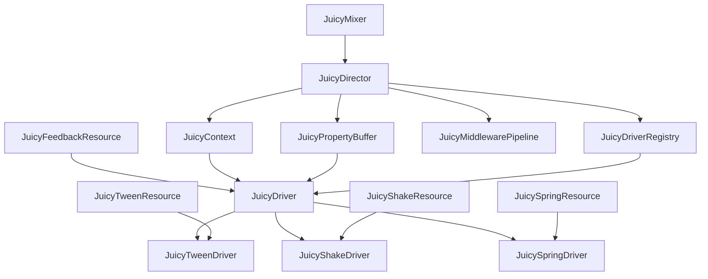
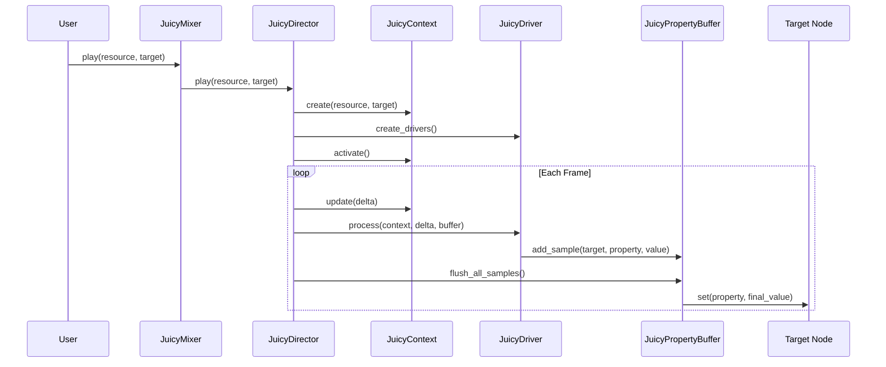

# 阶段2Driver系统开发计划分析报告

## 概述

本报告对JuicyMixer V3阶段2Driver系统开发计划进行全面分析，包括核心目标评估、基础设施支持分析、依赖关系识别、风险评估和优化建议。

---

## 1. 阶段2Driver系统开发计划核心目标和主要组件分析

### 1.1 核心目标

**主要目标**：实现核心Driver集，支持主要效果类型，建立无状态驱动器架构

**具体目标**：
- 实现三种核心Driver类型：补间(Tween)、震动(Shake)、弹簧(Spring)
- 建立统一的Driver接口和基类
- 提供高性能的无状态计算架构
- 支持灵活的配置和参数系统
- 确保与阶段1基础设施的无缝集成

### 1.2 主要组件分析

#### 1.2.1 JuicyDriver (驱动器基类)
- **职责**：定义通用接口、生命周期管理、性能监控
- **关键特性**：无状态设计、类型安全、验证机制
- **实现复杂度**：中等

#### 1.2.2 JuicyTweenDriver (补间驱动器)
- **职责**：平滑属性补间、多种缓动曲线、多属性并行处理
- **关键特性**：支持多种数据类型、相对值计算、延迟处理
- **实现复杂度**：高

#### 1.2.3 JuicyShakeDriver (震动驱动器)
- **职责**：噪声生成、多维震动、衰减控制
- **关键特性**：FastNoiseLite集成、多种衰减模式、参数化配置
- **实现复杂度**：高

#### 1.2.4 JuicySpringDriver (弹簧驱动器)
- **职责**：物理模拟、弹簧力计算、阻尼处理
- **关键特性**：真实物理模拟、稳定性检测、多类型支持
- **实现复杂度**：极高

#### 1.2.5 资源类实现
- **JuicyTweenResource**：补间配置数据结构
- **JuicyShakeResource**：震动配置数据结构
- **JuicySpringResource**：弹簧配置数据结构

---

## 2. 阶段1基础设施支持分析

### 2.1 已完成基础设施状态

#### 2.1.1 核心组件实现状态
| 组件 | 实现状态 | 完成度 | 集成状态 |
|------|----------|--------|----------|
| JuicyContext | ✅ 已完成 | 100% | ✅ 已集成 |
| JuicyDirector | ✅ 已完成 | 85% | ⚠️ 部分集成 |
| JuicyPropertyBuffer | ✅ 已完成 | 100% | ✅ 已集成 |
| JuicyDriverRegistry | ✅ 已完成 | 90% | ✅ 已集成 |
| JuicyFeedbackResource | ✅ 已完成 | 100% | ✅ 已集成 |
| JuicyMixer | ✅ 已完成 | 70% | ⚠️ 部分集成 |

#### 2.1.2 基础设施对阶段2的支持

**强支持领域**：
- **Context管理**：完整的生命周期管理和数据访问
- **属性缓冲**：高效的混合模式和批处理
- **Driver注册**：灵活的注册和发现机制
- **资源系统**：类型安全的配置和验证

**需要完善领域**：
- **Director集成**：需要完善Driver执行机制
- **中间件管道**：当前为占位实现
- **Context池化**：尚未实现
- **性能监控**：需要集成Driver级别监控

### 2.2 基础设施适配性评估

#### 2.2.1 Context数据访问优化
- **现状**：提供强类型访问方法
- **适配需求**：Driver需要使用`get_driver_data()`和`set_driver_data()`
- **评估**：✅ 完全适配

#### 2.2.2 属性缓冲集成
- **现状**：支持三种混合模式，高效批处理
- **适配需求**：Driver需要使用`_add_property_sample()`辅助方法
- **评估**：✅ 完全适配

#### 2.2.3 时间缩放支持
- **现状**：Context提供`time_scale`属性
- **适配需求**：Driver需要在计算中应用时间缩放
- **评估**：✅ 完全适配

---

## 3. 关键依赖关系和集成点分析

### 3.1 依赖关系图



### 3.2 关键集成点

#### 3.2.1 Driver执行集成
- **位置**：`JuicyDirector._execute_drivers()`
- **需求**：调用Driver的`process()`方法
- **当前状态**：⚠️ 部分实现，需要完善

#### 3.2.2 属性缓冲集成
- **位置**：各Driver的`process()`方法
- **需求**：使用`_add_property_sample()`写入属性
- **当前状态**：✅ 接口完整

#### 3.2.3 Context数据集成
- **位置**：Driver的`prepare()`和`process()`方法
- **需求**：使用Context的强类型访问方法
- **当前状态**：✅ 接口完整

#### 3.2.4 注册系统集成
- **位置**：Driver类定义
- **需求**：实现`get_driver_name()`和`get_supported_properties()`
- **当前状态**：✅ 接口完整

### 3.3 数据流分析



---

## 4. 技术风险和挑战评估

### 4.1 技术风险分析

#### 4.1.1 高风险项
| 风险项 | 风险等级 | 影响 | 缓解措施 |
|--------|----------|------|----------|
| 弹簧物理模拟精度 | 🔴 高 | 核心功能 | 实现误差检测和修正机制 |
| 性能瓶颈 | 🔴 高 | 用户体验 | 计算缓存和算法优化 |
| 数学精度累积 | 🟡 中 | 效果质量 | 定期重置和误差修正 |

#### 4.1.2 中风险项
| 风险项 | 风险等级 | 影响 | 缓解措施 |
|--------|----------|------|----------|
| 复杂度超预期 | 🟡 中 | 开发进度 | 分阶段实现，先基础后高级 |
| 调试困难 | 🟡 中 | 开发效率 | 详细调试信息和可视化 |
| 内存管理 | 🟡 中 | 系统稳定性 | 对象池和智能GC |

#### 4.1.3 低风险项
| 风险项 | 风险等级 | 影响 | 缓解措施 |
|--------|----------|------|----------|
| 接口兼容性 | 🟢 低 | 集成成本 | 严格的接口定义和测试 |
| 配置复杂性 | 🟢 低 | 用户体验 | 提供预设和模板 |

### 4.2 技术挑战分析

#### 4.2.1 算法复杂度挑战
- **弹簧物理计算**：需要实现真实的胡克定律和阻尼力计算
- **噪声生成优化**：FastNoiseLite的性能优化和参数调优
- **多属性并行处理**：确保多个属性同时计算的效率

#### 4.2.2 性能优化挑战
- **实时计算要求**：确保60FPS下的流畅运行
- **内存使用优化**：避免大量临时对象创建
- **批处理优化**：减少属性缓冲区的调用次数

#### 4.2.3 集成复杂性挑战
- **无状态设计**：确保Driver的无状态特性
- **类型安全**：支持多种数据类型的统一处理
- **错误处理**：完善的异常处理和恢复机制

---

## 5. 优化建议和实施策略

### 5.1 架构优化建议

#### 5.1.1 分层架构优化
```
应用层 (API)
    ↓
调度层 (Director)
    ↓
驱动层 (Drivers)
    ↓
缓冲层 (PropertyBuffer)
    ↓
渲染层 (Godot Nodes)
```

#### 5.1.2 模块化设计
- **Driver基类**：抽象核心功能，减少重复代码
- **计算模块**：独立的数学计算库，便于测试和优化
- **配置模块**：统一的参数验证和转换机制
- **性能模块**：集成性能监控和优化

#### 5.1.3 接口标准化
- **统一的生命周期**：prepare() → process() → cleanup()
- **标准的数据访问**：使用Context的强类型方法
- **一致的错误处理**：统一的错误码和恢复机制

### 5.2 性能优化策略

#### 5.2.1 计算优化
- **预计算缓存**：缓存常用的计算结果
- **批量处理**：减少单次处理的开销
- **SIMD优化**：利用向量化计算（如果支持）

#### 5.2.2 内存优化
- **对象池**：复用Driver内部状态对象
- **内存布局**：优化数据结构的内存访问模式
- **垃圾回收**：减少临时对象创建

#### 5.2.3 算法优化
- **数值稳定性**：使用更稳定的数值算法
- **早期退出**：在满足条件时提前退出计算
- **自适应精度**：根据需要动态调整计算精度

### 5.3 开发策略建议

#### 5.3.1 迭代开发策略
1. **第4周**：JuicyDriver基类 + JuicyTweenDriver
2. **第5周**：JuicyShakeDriver + 性能优化
3. **第6周**：JuicySpringDriver + 集成测试

#### 5.3.2 测试驱动开发
- **单元测试**：每个Driver的独立测试
- **集成测试**：与基础设施的集成测试
- **性能测试**：持续的性能基准测试
- **回归测试**：确保新功能不破坏现有功能

#### 5.3.3 风险缓解策略
- **原型验证**：先实现简化版本验证可行性
- **并行开发**：同时开发多个Driver以分散风险
- **持续集成**：自动化测试和部署

### 5.4 质量保证策略

#### 5.4.1 代码质量
- **代码审查**：严格的代码审查流程
- **静态分析**：使用工具检查代码质量
- **文档完整**：详细的API文档和使用示例

#### 5.4.2 测试覆盖
- **单元测试覆盖率**：目标100%
- **边界条件测试**：测试极端参数和边界情况
- **压力测试**：测试高负载下的系统表现

#### 5.4.3 性能监控
- **实时监控**：运行时性能指标收集
- **基准测试**：定期性能基准测试
- **性能回归检测**：自动检测性能退化

---

## 6. 实施优先级建议

### 6.1 高优先级（必须完成）
1. **JuicyDriver基类**：所有Driver的基础
2. **JuicyTweenDriver**：最常用的效果类型
3. **基础集成**：确保与阶段1基础设施的完整集成

### 6.2 中优先级（重要）
1. **JuicyShakeDriver**：提供丰富的视觉效果
2. **性能优化**：确保系统的实时性能
3. **测试覆盖**：保证代码质量

### 6.3 低优先级（可选）
1. **JuicySpringDriver**：高级物理效果
2. **高级特性**：如自适应精度、高级调试功能
3. **文档完善**：详细的用户指南和教程

---

## 7. 成功标准定义

### 7.1 功能标准
- ✅ 所有核心Driver正常工作
- ✅ 与阶段1基础设施无缝集成
- ✅ 支持计划中的所有效果类型
- ✅ 提供完整的API接口

### 7.2 性能标准
- ✅ 1000个Driver.process()调用 < 16ms
- ✅ 10000次插值计算 < 16ms
- ✅ 1000次弹簧物理计算 < 16ms
- ✅ 内存使用稳定，无泄漏

### 7.3 质量标准
- ✅ 单元测试覆盖率100%
- ✅ 所有集成测试通过
- ✅ 代码审查通过
- ✅ 性能基准测试达标

---

## 8. 结论和建议

### 8.1 总体评估
阶段2Driver系统开发计划整体设计合理，目标明确，技术路线清晰。阶段1已建立的基础设施为阶段2提供了坚实的基础，大部分组件已经可以直接支持Driver系统的实现。

### 8.2 关键建议
1. **优先完成JuicyDriver基类和JuicyTweenDriver**，建立稳定的开发基础
2. **重视性能优化**，特别是弹簧物理计算和噪声生成
3. **加强测试覆盖**，确保复杂算法的正确性
4. **完善集成机制**，特别是Director的Driver执行逻辑

### 8.3 风险控制建议
1. **分阶段实现**，先完成基础功能再添加高级特性
2. **持续性能监控**，及时发现和解决性能问题
3. **建立完善的测试体系**，确保代码质量
4. **保持架构灵活性**，为后续阶段预留扩展空间

### 8.4 长期发展建议
1. **建立Driver生态系统**，支持第三方Driver开发
2. **提供可视化调试工具**，提高开发效率
3. **优化编辑器集成**，提供更好的用户体验
4. **考虑跨平台兼容性**，确保在不同平台上的表现一致

---

本分析报告为阶段2Driver系统的开发提供了全面的指导，建议开发团队严格按照优先级执行，确保核心功能的稳定实现，同时保持对性能和质量的高标准要求。