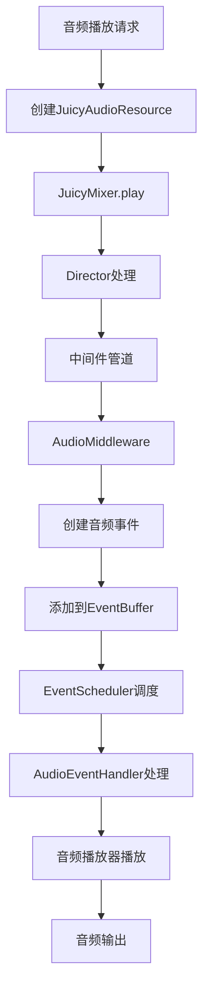

---
# ⚠️ DEPRECATED - 此文档已废弃

**状态**：此文档已废弃，不再维护

**原因**：架构设计存在问题，违反JuicyMixer V3架构原则

**新版本**：请参考以下V4文档：
- 架构文档：juicy_audio_manager_architecture_guide_v4.md
- 高级功能：juicy_audio_manager_advanced_features_v4.md
- 使用教程：juicy_audio_manager_tutorial_v4.md
- 文档索引：juicy_audio_manager_docs_index.md

**保留原因**：仅作为历史参考，请勿用于新开发

**废弃日期**：2025-01-14

---
# JuicyAudioManager 开发指南 V3 - 与JuicyMixer V3架构集成

## 概述

JuicyAudioManager V3 是 JuicyMixer V3 插件系统的音频管理核心，经过重新设计以与 JuicyMixer V3 的事件驱动架构深度集成。本版本充分利用 V3 架构的事件系统设计、中间件管道、Context生命周期管理、事件调度器等核心特性，提供统一、高效、可扩展的音频管理解决方案。

## 设计目标

### 核心功能
- 🎵 **事件驱动音频**：基于JuicyEventSystem的音频播放和管理
- 🎧 **多轨道音频管理**：支持主轨道、音乐、音效、UI等独立轨道
- 🎛️ **3D空间音频**：基于距离的音量衰减和立体声定位
- 🔄 **Context生命周期集成**：与JuicyContext无缝集成的音频生命周期
- 🎪 **中间件管道集成**：通过中间件系统进行音频验证和优化
- 🌊 **音频效果集成**：与Godot音频总线效果系统深度集成
- ⏰ **时间管理集成**：与TimeScaleMiddleware完美集成，支持时间分组和缩放

### V3架构集成优势
- 🏗️ **事件驱动架构**：音频作为事件统一管理，享受完整的事件调度机制
- 📋 **资源配置优先**：音频配置扩展JuicyFeedbackResource，提供类型安全的配置管理
- 🎭 **中间件协调**：通过中间件管道实现音频验证、通道管理、LOD优化
- 🚦 **事件调度系统**：通过JuicyEventScheduler实现智能音频调度
- 🏊 **对象池优化**：与事件系统集成，实现高效音频对象复用
- ⏱️ **时间管理集成**：支持时间分组和独立缩放，实现子弹时间等音频特效

## 文档大纲

### 1. V3架构集成设计
- 1.1 事件系统集成
- 1.2 Context生命周期集成
- 1.3 中间件管道集成
- 1.4 时间管理集成

### 2. 核心组件详细设计
- 2.1 JuicyAudioEventHandler (音频事件处理器)
- 2.2 JuicyAudioResource (音频反馈资源)
- 2.3 JuicyAudioMiddleware (音频中间件)
- 2.4 JuicyAudioChannelConfig (音频通道配置)

### 3. 事件驱动音频系统
- 3.1 音频事件类型定义
- 3.2 音频事件数据结构
- 3.3 事件调度和处理流程
- 3.4 音频事件生命周期管理

### 4. 中间件系统集成
- 4.1 音频验证中间件
- 4.2 音频通道管理中间件
- 4.3 音频LOD中间件
- 4.4 音频时间缩放中间件

### 5. API设计
- 5.1 基础播放API
- 5.2 3D音频API
- 5.3 音频控制API
- 5.4 通道管理API
- 5.5 高级功能API

### 6. 开发计划
- 6.1 第一阶段：事件系统集成 (3-4天)
- 6.2 第二阶段：中间件集成 (3-4天)
- 6.3 第三阶段：高级功能实现 (4-5天)
- 6.4 第四阶段：编辑器集成与测试 (2-3天)

### 7. 性能优化策略
- 7.1 事件系统性能优化
- 7.2 音频对象池管理
- 7.3 中间件管道优化
- 7.4 内存和CPU优化

### 8. 错误处理机制
- 8.1 事件系统错误处理
- 8.2 音频播放错误恢复
- 8.3 配置验证错误处理
- 8.4 中间件错误处理

### 9. 测试策略
- 9.1 事件系统集成测试
- 9.2 中间件集成测试
- 9.3 音频功能测试
- 9.4 性能测试

### 10. 部署与发布
- 10.1 版本管理
- 10.2 文档发布
- 10.3 迁移指南

---

## 1. V3架构集成设计

### 1.1 事件系统集成

#### 音频事件驱动播放
```gdscript
# V3方案：音频作为事件处理
class_name JuicyAudioEventHandler
extends JuicyEventHandler

func _init():
    handler_name = "AudioEventHandler"
    supported_events = [
        JuicyEventBuffer.EventType.AUDIO_PLAY,
        JuicyEventBuffer.EventType.AUDIO_STOP,
        JuicyEventBuffer.EventType.AUDIO_3D_PLAY,
        JuicyEventBuffer.EventType.AUDIO_FADE
    ]
    description = "Handles audio playback and control events"

func handle_event(event: JuicyEvent) -> bool:
    match event.event_type:
        JuicyEventBuffer.EventType.AUDIO_PLAY:
            return _handle_audio_play(event)
        JuicyEventBuffer.EventType.AUDIO_STOP:
            return _handle_audio_stop(event)
        JuicyEventBuffer.EventType.AUDIO_3D_PLAY:
            return _handle_audio_3d_play(event)
        JuicyEventBuffer.EventType.AUDIO_FADE:
            return _handle_audio_fade(event)
    return false
```

#### 音频事件数据结构
```gdscript
# 音频事件数据结构
class AudioEventData:
    var audio_stream: AudioStream
    var position: Vector2 = Vector2.ZERO
    var volume: float = 1.0
    var pitch_scale: float = 1.0
    var loop: bool = false
    var bus: String = "Master"
    var is_3d: bool = false
    var max_distance: float = 500.0
    var fade_duration: float = 0.0
    var target_volume: float = 1.0
    var channel: String = "sfx"
    var priority: int = 0
```

### 1.2 Context生命周期集成

#### 音频与Context生命周期管理

**分离生命周期 (Detached Lifecycle)**

在V3架构中，音频的生命周期管理需要特别处理，因为音频播放往往比视觉效果更长：

```gdscript
# 音频生命周期模式枚举
enum AudioLifecycleMode {
    DETACHED,     # 分离模式：音频独立于Context生命周期
    BOUND,        # 绑定模式：音频与Context生命周期同步
    AUTO_DETECT    # 自动检测：根据音频类型自动选择模式
}

# 音频事件与Context生命周期绑定
func handle_event(event: JuicyEvent) -> bool:
    var context_id = event.context_id
    var context = JuicyMixer.get_context(context_id)
    var audio_data = event.event_data
    
    if context:
        # 确定音频生命周期模式
        var lifecycle_mode = _determine_audio_lifecycle_mode(audio_data, context)
        
        match lifecycle_mode:
            AudioLifecycleMode.DETACHED:
                # 分离模式：音频播放不受Context销毁影响
                _handle_detached_audio(event, context)
            AudioLifecycleMode.BOUND:
                # 绑定模式：音频与Context生命周期同步
                _handle_bound_audio(event, context)
            AudioLifecycleMode.AUTO_DETECT:
                # 自动检测：根据音频特性决定
                if _should_be_detached(audio_data):
                    _handle_detached_audio(event, context)
                else:
                    _handle_bound_audio(event, context)
    
    return _process_audio_event(event, context)

func _determine_audio_lifecycle_mode(audio_data: Dictionary, context: JuicyContext) -> AudioLifecycleMode:
    # 检查资源中明确指定的生命周期模式
    if audio_data.has("lifecycle_mode"):
        return audio_data.get("lifecycle_mode", AudioLifecycleMode.DETACHED)
    
    # 根据音频特性自动判断
    if audio_data.get("loop", false):
        # 循环音频通常需要绑定到Context
        return AudioLifecycleMode.BOUND
    
    var audio_stream = audio_data.get("audio_stream")
    if audio_stream and audio_stream.get_length() > context.duration:
        # 音频时长超过Context时长，使用分离模式
        return AudioLifecycleMode.DETACHED
    
    return AudioLifecycleMode.AUTO_DETECT

func _handle_detached_audio(event: JuicyEvent, context: JuicyContext) -> void:
    # 分离模式：音频播放后独立管理
    var audio_data = event.event_data
    audio_data["detached"] = true
    
    # 标记为分离音频，不受Context销毁影响
    _mark_audio_as_detached(event.event_id, context.context_id)

func _handle_bound_audio(event: JuicyEvent, context: JuicyContext) -> void:
    # 绑定模式：音频与Context生命周期同步
    var audio_data = event.event_data
    audio_data["detached"] = false
    
    # 应用Context的时间缩放
    var time_scale = context.time_scale
    _apply_time_scale_to_audio(audio_data, time_scale)

func _should_be_detached(audio_data: Dictionary) -> bool:
    # 判断音频是否应该使用分离模式
    var audio_stream = audio_data.get("audio_stream")
    if not audio_stream:
        return false
    
    # 长音频（超过2秒）通常需要分离模式
    if audio_stream.get_length() > 2.0:
        return true
    
    # 非循环音频通常适合分离模式
    if not audio_data.get("loop", false):
        return true
    
    return false
```

#### Context状态同步
```gdscript
# Context状态变化时的音频处理
func on_context_destroyed(context: JuicyContext) -> void:
    # 只清理绑定模式的音频
    _stop_bound_audio_for_context(context.context_id)
    
    # 分离模式的音频继续播放直到自然结束
    _cleanup_bound_audio_resources(context.context_id)

func on_context_paused(context: JuicyContext) -> void:
    # 暂停所有相关音频（包括分离模式）
    _pause_all_audio_for_context(context.context_id)

func on_context_resumed(context: JuicyContext) -> void:
    # 恢复所有相关音频（包括分离模式）
    _resume_all_audio_for_context(context.context_id)

func _stop_bound_audio_for_context(context_id: String) -> void:
    # 只停止绑定到Context的音频
    var player_ids = _context_players.get(context_id, [])
    for player_id in player_ids:
        var player_info = _active_players.get(player_id)
        if player_info and not player_info.get("detached", false):
            _stop_audio_player(player_info.player)

func _cleanup_bound_audio_resources(context_id: String) -> void:
    # 清理绑定模式的音频资源引用
    var player_ids = _context_players.get(context_id, [])
    for player_id in player_ids:
        var player_info = _active_players.get(player_id)
        if player_info and not player_info.get("detached", false):
            _active_players.erase(player_id)
    
    _context_players.erase(context_id)
```

### 1.3 中间件管道集成

#### 音频中间件
```gdscript
# 音频中间件 - 在管道中处理音频相关逻辑
class_name AudioMiddleware
extends JuicyMiddleware

func _init():
    middleware_name = "AudioMiddleware"
    priority = 900  # 高优先级，在验证后执行
    description = "Handles audio-related processing and validation"

func process(context: JuicyContext, next: Callable) -> bool:
    # 音频验证和预处理
    if not _validate_audio_context(context):
        return false
    
    # 创建音频事件
    var audio_events = _create_audio_events_from_context(context)
    
    # 添加到事件缓冲区
    for event in audio_events:
        JuicyMixer.instance._event_buffer.add_event(event)
    
    return next.call()
```

#### 音频验证中间件
```gdscript
# 专门处理音频验证的中间件
class_name AudioValidationMiddleware
extends JuicyMiddleware

func process(context: JuicyContext, next: Callable) -> bool:
    var resource = context.resource as JuicyAudioResource
    if not resource:
        return next.call()
    
    # 验证音频配置
    var validation = _validate_audio_resource(resource)
    if not validation.valid:
        for issue in validation.issues:
            _log_error("Audio validation failed: " + issue)
        return false
    
    return next.call()
```

### 1.4 时间管理集成

#### 时间缩放中间件集成
```gdscript
# 在TimeScaleMiddleware中处理音频时间缩放
class_name AudioTimeScaleMiddleware
extends JuicyMiddleware

func process(context: JuicyContext, next: Callable) -> bool:
    var resource = context.resource as JuicyAudioResource
    if not resource:
        return next.call()
    
    # 应用时间缩放到音频
    var time_scale = _get_audio_time_scale(resource)
    context.time_scale *= time_scale
    
    # 如果需要，创建时间缩放事件
    if resource.use_time_scaling:
        var time_scale_event = _create_time_scale_event(context, time_scale)
        JuicyMixer.instance._event_buffer.add_event(time_scale_event)
    
    return next.call()
```

---

## 2. 核心组件详细设计

### 2.1 JuicyAudioEventHandler (音频事件处理器)

#### 核心职责
- 处理音频播放和停止事件
- 管理音频播放器池
- 支持空间音频效果
- 提供音频混音和淡入淡出
- 集成Context生命周期管理

#### 详细实现
```gdscript
class_name JuicyAudioEventHandler
extends JuicyEventHandler

# 音频播放器池
var _player_pool: Array[AudioStreamPlayer2D] = []
var _active_players: Dictionary = {}  # player_id -> player_info
var _3d_player_pool: Array[AudioStreamPlayer3D] = []
var _active_3d_players: Dictionary = {}  # player_id -> player_info

# 音频配置
var _master_volume: float = 1.0
var _audio_bus: String = "Master"
var _spatial_audio_enabled: bool = true
var _max_pool_size: int = 50
var _max_concurrent_sounds: int = 20

# Context关联
var _context_players: Dictionary = {}  # context_id -> [player_ids]

func _init():
    handler_name = "AudioEventHandler"
    supported_events = [
        JuicyEventBuffer.EventType.AUDIO_PLAY,
        JuicyEventBuffer.EventType.AUDIO_STOP,
        JuicyEventBuffer.EventType.AUDIO_3D_PLAY,
        JuicyEventBuffer.EventType.AUDIO_FADE,
        JuicyEventBuffer.EventType.AUDIO_VOLUME
    ]
    description = "Handles audio playback and control events"

func handle_event(event: JuicyEvent) -> bool:
    var start_time = _start_handling_timer()
    
    var success = false
    match event.event_type:
        JuicyEventBuffer.EventType.AUDIO_PLAY:
            success = _handle_audio_play(event)
        JuicyEventBuffer.EventType.AUDIO_STOP:
            success = _handle_audio_stop(event)
        JuicyEventBuffer.EventType.AUDIO_3D_PLAY:
            success = _handle_audio_3d_play(event)
        JuicyEventBuffer.EventType.AUDIO_FADE:
            success = _handle_audio_fade(event)
        JuicyEventBuffer.EventType.AUDIO_VOLUME:
            success = _handle_audio_volume(event)
    
    _end_handling_timer(start_time)
    
    if success:
        _record_success()
    else:
        _record_failure()
    
    return success

# 音频播放处理
func _handle_audio_play(event: JuicyEvent) -> bool:
    var audio_data = event.event_data
    var audio_stream = audio_data.get("audio_stream")
    var position = audio_data.get("position", Vector2.ZERO)
    var volume = audio_data.get("volume", 1.0)
    var pitch_scale = audio_data.get("pitch_scale", 1.0)
    var loop = audio_data.get("loop", false)
    var bus = audio_data.get("bus", "Master")
    
    if not audio_stream:
        _log_error("Audio stream is null")
        return false
    
    # 检查并发限制
    if _active_players.size() >= _max_concurrent_sounds:
        _log_warning("Maximum concurrent sounds reached, stopping oldest")
        _stop_oldest_player()
    
    # 获取播放器
    var player = _get_audio_player()
    if not player:
        _log_error("Failed to get audio player")
        return false
    
    # 配置播放器
    player.stream = audio_stream
    player.position = position
    player.volume_db = _linear_to_db(volume * _master_volume)
    player.pitch_scale = pitch_scale
    player.bus = bus
    
    # 播放音频
    player.play()
    
    # 记录活跃播放器
    var player_id = player.get_instance_id()
    _active_players[player_id] = {
        "player": player,
        "context_id": event.context_id,
        "event_id": event.event_id,
        "start_time": Time.get_ticks_msec() / 1000.0,
        "audio_data": audio_data
    }
    
    # 关联到Context
    if not event.context_id.is_empty():
        if not _context_players.has(event.context_id):
            _context_players[event.context_id] = []
        _context_players[event.context_id].append(player_id)
    
    return true

# 3D音频播放处理
func _handle_audio_3d_play(event: JuicyEvent) -> bool:
    var audio_data = event.event_data
    var audio_stream = audio_data.get("audio_stream")
    var position = audio_data.get("position", Vector3.ZERO)
    var volume = audio_data.get("volume", 1.0)
    var max_distance = audio_data.get("max_distance", 500.0)
    var emitter_path = audio_data.get("emitter_path", NodePath())
    
    if not audio_stream:
        _log_error("Audio stream is null")
        return false
    
    # 智能挂载：处理"无实体"陷阱
    var emitter_node = _resolve_audio_emitter(event, emitter_path, position)
    if not emitter_node:
        _log_error("Failed to resolve audio emitter")
        return false
    
    # 获取3D播放器
    var player = _get_3d_audio_player()
    if not player:
        _log_error("Failed to get 3D audio player")
        return false
    
    # 配置3D播放器
    player.stream = audio_stream
    player.volume_db = _linear_to_db(volume * _master_volume)
    player.max_distance = max_distance
    player.bus = audio_data.get("bus", "Master")
    
    # 挂载到发射器节点
    emitter_node.add_child(player)
    
    # 播放音频
    player.play()
    
    # 记录活跃播放器
    var player_id = player.get_instance_id()
    _active_3d_players[player_id] = {
        "player": player,
        "context_id": event.context_id,
        "event_id": event.event_id,
        "start_time": Time.get_ticks_msec() / 1000.0,
        "audio_data": audio_data,
        "emitter_node": emitter_node,
        "is_orphan": false
    }
    
    return true

# 智能挂载：解决3D音频"无实体"陷阱
func _resolve_audio_emitter(event: JuicyEvent, emitter_path: NodePath, position: Vector3) -> Node3D:
    """智能解析音频发射器节点"""
    var context = JuicyMixer.get_context(event.context_id)
    if not context:
        return null
    
    # 1. 优先使用指定的发射器路径
    if not emitter_path.is_empty():
        var emitter = context.target.get_node_or_null(emitter_path)
        if emitter and emitter is Node3D:
            return emitter
    
    # 2. 尝试使用目标节点本身（如果是3D节点）
    if context.target is Node3D:
        return context.target
    
    # 3. 尝试查找父节点中的3D节点
    var parent = context.target.get_parent()
    while parent:
        if parent is Node3D:
            return parent
        parent = parent.get_parent()
    
    # 4. 创建临时发射器节点（孤儿接管机制）
    return _create_temporary_emitter(context, position)

func _create_temporary_emitter(context: JuicyContext, position: Vector3) -> Node3D:
    """创建临时音频发射器节点"""
    var emitter = Node3D.new()
    emitter.name = "TempAudioEmitter_" + context.context_id
    emitter.position = position
    
    # 添加到场景树
    var scene_root = Engine.get_main_loop().current_scene
    scene_root.add_child(emitter)
    
    # 标记为临时节点，用于后续清理
    emitter.set_meta("is_temporary_audio_emitter", true)
    emitter.set_meta("context_id", context.context_id)
    
    # 设置孤儿接管
    _setup_orphan_adoption(emitter)
    
    return emitter

func _setup_orphan_adoption(emitter: Node3D) -> void:
    """设置孤儿接管机制"""
    # 监听节点被移出场景树的事件
    emitter.tree_exiting.connect(func():
        if emitter.get_meta("is_temporary_audio_emitter", false):
            _handle_orphaned_emitter(emitter)
    )

func _handle_orphaned_emitter(emitter: Node3D) -> void:
    """处理孤儿发射器"""
    var context_id = emitter.get_meta("context_id", "")
    if context_id.is_empty():
        return
    
    # 查找相关的3D播放器
    for player_id in _active_3d_players.keys():
        var player_info = _active_3d_players[player_id]
        if player_info.emitter_node == emitter:
            player_info.is_orphan = true
            _log_warning("Audio emitter became orphan, marking player: " + str(player_id))
            break

func _cleanup_temporary_emitters(context_id: String) -> void:
    """清理临时发射器"""
    var scene_root = Engine.get_main_loop().current_scene
    var emitters_to_remove: Array[Node3D] = []
    
    # 查找所有临时发射器
    for child in scene_root.get_children():
        if child.get_meta("is_temporary_audio_emitter", false):
            var child_context_id = child.get_meta("context_id", "")
            if child_context_id == context_id:
                emitters_to_remove.append(child)
    
    # 清理发射器
    for emitter in emitters_to_remove:
        emitter.queue_free()

# 音频停止处理
func _handle_audio_stop(event: JuicyEvent) -> bool:
    var context_id = event.context_id
    var event_id = event.event_id
    
    var players_stopped = 0
    
    # 停止2D音频
    players_stopped += _stop_players_by_context(context_id, event_id, _active_players)
    
    # 停止3D音频
    players_stopped += _stop_players_by_context(context_id, event_id, _active_3d_players)
    
    return players_stopped > 0

# 音频淡入淡出处理
func _handle_audio_fade(event: JuicyEvent) -> bool:
    var audio_data = event.event_data
    var target_volume = audio_data.get("target_volume", 0.0)
    var duration = audio_data.get("duration", 1.0)
    var context_id = event.context_id
    
    var player_ids = _context_players.get(context_id, [])
    var success_count = 0
    
    for player_id in player_ids:
        var player_info = _active_players.get(player_id)
        if player_info:
            var player = player_info.player
            _fade_audio_player(player, target_volume, duration)
            success_count += 1
    
    return success_count > 0

# 音频音量控制处理
func _handle_audio_volume(event: JuicyEvent) -> bool:
    var audio_data = event.event_data
    var volume = audio_data.get("volume", 1.0)
    var context_id = event.context_id
    
    var player_ids = _context_players.get(context_id, [])
    var success_count = 0
    
    for player_id in player_ids:
        var player_info = _active_players.get(player_id)
        if player_info:
            var player = player_info.player
            player.volume_db = _linear_to_db(volume * _master_volume)
            success_count += 1
    
    return success_count > 0

# 播放器管理
func _get_audio_player() -> AudioStreamPlayer2D:
    # 从池中获取
    if not _player_pool.is_empty():
        return _player_pool.pop_back()
    
    # 创建新的播放器
    if _player_pool.size() + _active_players.size() < _max_pool_size:
        var player = AudioStreamPlayer2D.new()
        _setup_audio_player(player)
        return player
    
    return null

func _get_3d_audio_player() -> AudioStreamPlayer3D:
    # 从池中获取
    if not _3d_player_pool.is_empty():
        return _3d_player_pool.pop_back()
    
    # 创建新的播放器
    if _3d_player_pool.size() + _active_3d_players.size() < _max_pool_size:
        var player = AudioStreamPlayer3D.new()
        _setup_3d_audio_player(player)
        return player
    
    return null

func _setup_audio_player(player: AudioStreamPlayer2D) -> void:
    player.finished.connect(_on_player_finished.bind(player))
    
    # 添加到场景树
    var audio_root = _get_audio_root()
    audio_root.add_child(player)

func _setup_3d_audio_player(player: AudioStreamPlayer3D) -> void:
    player.finished.connect(_on_3d_player_finished.bind(player))
    
    # 添加到场景树
    var audio_root = _get_audio_root()
    audio_root.add_child(player)

func _stop_oldest_player() -> void:
    # 智能丢弃策略：基于优先级、音量和时间的多级选择
    var player_to_stop = _find_player_to_stop()
    if player_to_stop:
        _stop_audio_player(player_to_stop.player)

func _find_player_to_stop() -> Dictionary:
    """查找应该被停止的播放器，使用智能丢弃策略"""
    var candidates: Array[Dictionary] = []
    
    for player_id in _active_players.keys():
        var player_info = _active_players[player_id]
        var audio_data = player_info.audio_data
        
        # 计算优先级分数（分数越低越容易被丢弃）
        var priority_score = 0
        var volume_score = 0
        var time_score = 0
        
        # 1. 优先级分数（优先级越低，分数越高）
        var priority = audio_data.get("priority", 0)
        priority_score = -priority
        
        # 2. 音量分数（音量越低，分数越高）
        var volume = audio_data.get("volume", 1.0)
        volume_score = (1.0 - volume) * 100  # 归一化到0-100范围
        
        # 3. 时间分数（时间越老，分数越高）
        var elapsed_time = Time.get_ticks_msec() / 1000.0 - player_info.start_time
        time_score = elapsed_time
        
        # 综合分数（权重：优先级50%，音量30%，时间20%）
        var total_score = priority_score * 0.5 + volume_score * 0.3 + time_score * 0.2
        
        candidates.append({
            "player_info": player_info,
            "total_score": total_score,
            "priority": priority,
            "volume": volume,
            "elapsed_time": elapsed_time
        })
    
    # 按分数排序（分数最高的最容易被丢弃）
    candidates.sort_custom(func(a, b): return a.total_score > b.total_score)
    
    return candidates[0] if not candidates.is_empty() else null

func _stop_players_by_context(context_id: String, event_id: String, 
                              active_dict: Dictionary) -> int:
    var players_stopped = 0
    
    for player_id in active_dict.keys():
        var player_info = active_dict[player_id]
        if player_info.context_id == context_id or player_info.event_id == event_id:
            _stop_audio_player(player_info.player)
            players_stopped += 1
    
    return players_stopped

func _stop_audio_player(player: AudioStreamPlayer) -> void:
    if not player or not is_instance_valid(player):
        return
    
    player.stop()
    _return_audio_player(player)

func _return_audio_player(player: AudioStreamPlayer2D) -> void:
    var player_id = player.get_instance_id()
    
    # 从活跃列表中移除
    _active_players.erase(player_id)
    
    # 从Context关联中移除
    for context_id in _context_players.keys():
        var player_ids = _context_players[context_id]
        player_ids.erase(player_id)
        if player_ids.is_empty():
            _context_players.erase(context_id)
    
    # 重置播放器状态
    player.stream = null
    player.position = Vector2.ZERO
    player.volume_db = 0.0
    player.pitch_scale = 1.0
    
    # 返回到池
    if _player_pool.size() < _max_pool_size:
        _player_pool.append(player)
    else:
        player.queue_free()

func _return_3d_audio_player(player: AudioStreamPlayer3D) -> void:
    var player_id = player.get_instance_id()
    
    # 从活跃列表中移除
    _active_3d_players.erase(player_id)
    
    # 从Context关联中移除
    for context_id in _context_players.keys():
        var player_ids = _context_players[context_id]
        player_ids.erase(player_id)
        if player_ids.is_empty():
            _context_players.erase(context_id)
    
    # 重置播放器状态
    player.stream = null
    player.position = Vector3.ZERO
    player.volume_db = 0.0
    player.pitch_scale = 1.0
    
    # 返回到池
    if _3d_player_pool.size() < _max_pool_size:
        _3d_player_pool.append(player)
    else:
        player.queue_free()

func _fade_audio_player(player: AudioStreamPlayer, target_volume: float, duration: float) -> void:
    var tween = create_tween()
    var target_db = _linear_to_db(target_volume * _master_volume)
    tween.tween_property(player, "volume_db", target_db, duration)

# 回调处理
func _on_player_finished(player: AudioStreamPlayer2D) -> void:
    _return_audio_player(player)

func _on_3d_player_finished(player: AudioStreamPlayer3D) -> void:
    _return_3d_audio_player(player)

# 工具方法
func _get_audio_root() -> Node:
    # 尝试获取现有的音频根节点
    var scene_root = Engine.get_main_loop().current_scene
    var audio_root = scene_root.get_node_or_null("JuicyAudioRoot")
    
    if not audio_root:
        audio_root = Node.new("JuicyAudioRoot")
        scene_root.add_child(audio_root)
    
    return audio_root

func _linear_to_db(linear: float) -> float:
    if linear <= 0.0:
        return -80.0
    return 20.0 * log(linear) / log(10.0)

# Context生命周期回调
func on_context_created(context: JuicyContext) -> void:
    # 初始化Context的音频管理
    _context_players[context.context_id] = []

func on_context_destroyed(context: JuicyContext) -> void:
    # 清理Context的所有音频
    var player_ids = _context_players.get(context.context_id, [])
    for player_id in player_ids:
        var player_info = _active_players.get(player_id)
        if player_info:
            _stop_audio_player(player_info.player)
    
    _context_players.erase(context.context_id)

func on_context_paused(context: JuicyContext) -> void:
    # 暂停Context的所有音频
    var player_ids = _context_players.get(context.context_id, [])
    for player_id in player_ids:
        var player_info = _active_players.get(player_id)
        if player_info:
            player_info.player.stream_paused = true

func on_context_resumed(context: JuicyContext) -> void:
    # 恢复Context的所有音频
    var player_ids = _context_players.get(context.context_id, [])
    for player_id in player_ids:
        var player_info = _active_players.get(player_id)
        if player_info:
            player_info.player.stream_paused = false

# 配置管理
func configure(config: Dictionary) -> void:
    super.configure(config)
    
    if config.has("max_pool_size"):
        _max_pool_size = config.max_pool_size
    
    if config.has("max_concurrent_sounds"):
        _max_concurrent_sounds = config.max_concurrent_sounds
    
    if config.has("master_volume"):
        _master_volume = clamp(config.master_volume, 0.0, 1.0)
    
    if config.has("audio_bus"):
        _audio_bus = config.audio_bus
    
    if config.has("spatial_audio_enabled"):
        _spatial_audio_enabled = config.spatial_audio_enabled

func get_configuration() -> Dictionary:
    return super.get_configuration().merge({
        "max_pool_size": _max_pool_size,
        "max_concurrent_sounds": _max_concurrent_sounds,
        "master_volume": _master_volume,
        "audio_bus": _audio_bus,
        "spatial_audio_enabled": _spatial_audio_enabled
    })

# 统计和调试
func get_audio_stats() -> Dictionary:
    return {
        "pool_size": _player_pool.size(),
        "3d_pool_size": _3d_player_pool.size(),
        "active_players": _active_players.size(),
        "active_3d_players": _active_3d_players.size(),
        "max_pool_size": _max_pool_size,
        "max_concurrent_sounds": _max_concurrent_sounds,
        "master_volume": _master_volume,
        "context_count": _context_players.size()
    }

func cleanup() -> void:
    # 停止所有活跃播放器
    for player_id in _active_players.keys():
        var player_info = _active_players[player_id]
        _stop_audio_player(player_info.player)
    
    for player_id in _active_3d_players.keys():
        var player_info = _active_3d_players[player_id]
        _stop_3d_audio_player(player_info.player)
    
    # 清空播放器池
    for player in _player_pool:
        if is_instance_valid(player):
            player.queue_free()
    _player_pool.clear()
    
    for player in _3d_player_pool:
        if is_instance_valid(player):
            player.queue_free()
    _3d_player_pool.clear()
    
    # 清空Context关联
    _context_players.clear()
```

### 2.2 JuicyAudioResource (音频反馈资源)

#### 核心职责
- 定义音频效果的配置参数
- 提供可序列化的音频配置存储
- 支持编辑器中的可视化配置
- 提供音频配置验证功能
- 创建音频事件而非Driver

#### 详细实现
```gdscript
@tool
class_name JuicyAudioResource
extends JuicyFeedbackResource

# 音频配置属性
@export_group("Audio Settings")
@export var audio_stream: AudioStream
@export var volume: float = 1.0
@export var pitch_scale: float = 1.0
@export var loop: bool = false
@export var bus: String = "Master"
@export var channel: String = "sfx"
@export var priority: int = 0

@export_group("3D Audio Settings")
@export var is_3d: bool = false
@export var max_distance: float = 500.0
@export var attenuation_model: int = 0
@export var emitter_path: NodePath

@export_group("Fade Settings")
@export var fade_in_duration: float = 0.0
@export var fade_out_duration: float = 0.0
@export var auto_fade_out: bool = false

@export_group("Time Management")
@export var use_time_scaling: bool = true
@export var time_group: String = "audio"

func _init():
    resource_name = "AudioResource: " + (audio_stream.resource_path if audio_stream else "None")

# V3中创建事件而非Driver
func create_drivers() -> Array[JuicyDriver]:
    # V3中音频不通过Driver处理，而是通过事件系统
    return []

func create_events() -> Array[JuicyEvent]:
    var events: Array[JuicyEvent] = []
    
    # 创建音频播放事件
    var audio_event = JuicyEvent.new()
    audio_event.event_type = JuicyEventBuffer.EventType.AUDIO_PLAY if not is_3d else JuicyEventBuffer.EventType.AUDIO_3D_PLAY
    audio_event.priority = priority
    audio_event.event_data = {
        "audio_stream": audio_stream,
        "volume": volume,
        "pitch_scale": pitch_scale,
        "loop": loop,
        "bus": bus,
        "channel": channel,
        "is_3d": is_3d,
        "max_distance": max_distance,
        "attenuation_model": attenuation_model,
        "emitter_path": emitter_path,
        "fade_in_duration": fade_in_duration,
        "fade_out_duration": fade_out_duration,
        "auto_fade_out": auto_fade_out,
        "use_time_scaling": use_time_scaling,
        "time_group": time_group
    }
    
    events.append(audio_event)
    
    # 如果需要淡入淡出，创建淡入事件
    if fade_in_duration > 0.0:
        var fade_event = JuicyEvent.new()
        fade_event.event_type = JuicyEventBuffer.EventType.AUDIO_FADE
        fade_event.priority = priority
        fade_event.delay = 0.0  # 立即执行
        fade_event.event_data = {
            "target_volume": volume,
            "duration": fade_in_duration,
            "fade_type": "in"
        }
        events.append(fade_event)
    
    return events

# 验证配置
func validate_config() -> ValidationResult:
    var result = super.validate_config()
    
    if not audio_stream:
        result.valid = false
        result.issues.append("Audio stream is required")
    
    if volume < 0.0 or volume > 2.0:
        result.valid = false
        result.issues.append("Volume must be between 0.0 and 2.0")
    
    if pitch_scale < 0.1 or pitch_scale > 4.0:
        result.valid = false
        result.issues.append("Pitch scale must be between 0.1 and 4.0")
    
    if is_3d and max_distance <= 0:
        result.valid = false
        result.issues.append("Max distance must be greater than 0 for 3D audio")
    
    if channel.is_empty():
        result.warnings.append("Empty channel name, using 'sfx'")
        channel = "sfx"
    
    if bus.is_empty():
        result.warnings.append("Empty bus name, using 'Master'")
        bus = "Master"
    
    return result

# 获取配置描述
func get_description() -> String:
    var audio_name = "Unknown"
    if audio_stream:
        audio_name = audio_stream.resource_path.get_file()
    
    return "Audio: %s, Volume: %.2f, Channel: %s, 3D: %s" % [
        audio_name, volume, channel, is_3d
    ]

# 编辑器支持
func _get_property_list() -> Array[Dictionary]:
    var properties = []
    
    # 添加音频流属性的特殊提示
    properties.append({
        "name": "audio_stream",
        "type": TYPE_OBJECT,
        "hint": PROPERTY_HINT_RESOURCE_TYPE,
        "hint_string": "AudioStream",
        "usage": PROPERTY_USAGE_DEFAULT
    })
    
    # 添加总线选择（从项目设置获取）
    properties.append({
        "name": "bus",
        "type": TYPE_STRING,
        "hint": PROPERTY_HINT_ENUM,
        "hint_string": _get_audio_bus_enum_string(),
        "usage": PROPERTY_USAGE_DEFAULT
    })
    
    # 添加通道选择（使用枚举而非字符串）
    properties.append({
        "name": "channel",
        "type": TYPE_STRING,
        "hint": PROPERTY_HINT_ENUM,
        "hint_string": _get_audio_channel_enum_string(),
        "usage": PROPERTY_USAGE_DEFAULT
    })

# 鸭子类型与硬编码解决方案：集成项目设置
func _get_audio_bus_enum_string() -> String:
    """从项目设置获取音频总线枚举"""
    # 尝试从项目设置获取音频总线配置
    var project_settings = ProjectSettings.get_setting("juicy_mixer/audio/buses", {})
    
    if project_settings.has("custom_buses") and project_settings.custom_buses is Array:
        var custom_buses = project_settings.custom_buses
        if not custom_buses.is_empty():
            return ",".join(custom_buses)
    
    # 使用默认总线
    return "Master,Music,SFX,UI,Ambient,Voice"

func _get_audio_channel_enum_string() -> String:
    """从项目设置获取音频通道枚举"""
    # 尝试从项目设置获取音频通道配置
    var project_settings = ProjectSettings.get_setting("juicy_mixer/audio/channels", {})
    
    if project_settings.has("custom_channels") and project_settings.custom_channels is Array:
        var custom_channels = project_settings.custom_channels
        if not custom_channels.is_empty():
            return ",".join(custom_channels)
    
    # 使用默认通道
    return "master,music,sfx,ui,ambient,voice"

# 音频总线枚举（替代硬编码字符串）
enum AudioBus {
    MASTER,
    MUSIC,
    SFX,
    UI,
    AMBIENT,
    VOICE,
    CUSTOM_1,
    CUSTOM_2,
    CUSTOM_3
}

# 音频通道枚举（替代硬编码字符串）
enum AudioChannel {
    MASTER,
    MUSIC,
    SFX,
    UI,
    AMBIENT,
    VOICE,
    FOOTSTEPS,
    IMPACTS,
    WEAPONS,
    ENVIRONMENT
}

# 获取总线名称的枚举方法
func get_bus_name_enum() -> AudioBus:
    match bus.to_lower():
        "master": return AudioBus.MASTER
        "music": return AudioBus.MUSIC
        "sfx": return AudioBus.SFX
        "ui": return AudioBus.UI
        "ambient": return AudioBus.AMBIENT
        "voice": return AudioBus.VOICE
        _: return AudioBus.MASTER

func get_channel_name_enum() -> AudioChannel:
    match channel.to_lower():
        "master": return AudioChannel.MASTER
        "music": return AudioChannel.MUSIC
        "sfx": return AudioChannel.SFX
        "ui": return AudioChannel.UI
        "ambient": return AudioChannel.AMBIENT
        "voice": return AudioChannel.VOICE
        "footsteps": return AudioChannel.FOOTSTEPS
        "impacts": return AudioChannel.IMPACTS
        "weapons": return AudioChannel.WEAPONS
        "environment": return AudioChannel.ENVIRONMENT
        _: return AudioChannel.SFX

# 项目设置集成
static func setup_project_audio_settings() -> void:
    """设置项目音频配置"""
    var settings = {
        "buses": {
            "custom_buses": ["Master", "Music", "SFX", "UI", "Ambient", "Voice"],
            "default_bus": "Master"
        },
        "channels": {
            "custom_channels": ["master", "music", "sfx", "ui", "ambient", "voice", "footsteps", "impacts", "weapons", "environment"],
            "default_channel": "sfx"
        },
        "performance": {
            "max_concurrent_sounds": 20,
            "enable_streaming": true,
            "buffer_size": 1024
        },
        "quality": {
            "sample_rate": 44100,
            "bit_depth": 16,
            "enable_3d_audio": true
        }
    }
    
    ProjectSettings.set_setting("juicy_mixer/audio", settings)
    ProjectSettings.save()

static func get_project_audio_setting(key: String, default_value = null):
    """获取项目音频设置"""
    var audio_settings = ProjectSettings.get_setting("juicy_mixer/audio", {})
    return audio_settings.get(key, default_value)

static func set_project_audio_setting(key: String, value) -> void:
    """设置项目音频设置"""
    var audio_settings = ProjectSettings.get_setting("juicy_mixer/audio", {})
    audio_settings[key] = value
    ProjectSettings.set_setting("juicy_mixer/audio", audio_settings)
    ProjectSettings.save()
    
    return properties

# 序列化支持
func _to_string() -> String:
    return get_description()

# 资源管理
func get_resource_type() -> String:
    return "JuicyAudioResource"

func get_duration() -> float:
    if audio_stream:
        return audio_stream.get_length()
    return duration  # 使用基类的duration作为后备

func is_looping() -> bool:
    return loop

func get_audio_channels() -> String:
    return channel

func get_audio_bus() -> String:
    return bus

# 流式加载支持
var _loaded_audio_stream: AudioStream = null
var _audio_stream_path: String = ""

func get_audio_stream() -> AudioStream:
    """获取音频流，支持延迟加载"""
    if not _loaded_audio_stream and not _audio_stream_path.is_empty():
        _loaded_audio_stream = _load_audio_stream_safe(_audio_stream_path)
    
    return _loaded_audio_stream if _loaded_audio_stream else audio_stream

func _load_audio_stream_safe(path: String) -> AudioStream:
    """安全加载音频流"""
    if not ResourceLoader.exists(path):
        push_error("Audio stream not found: " + path)
        return null
    
    var stream = load(path)
    if not stream is AudioStream:
        push_error("Invalid audio stream: " + path)
        return null
    
    return stream

func preload_audio_stream() -> void:
    """预加载音频流"""
    if audio_stream and not _loaded_audio_stream:
        _loaded_audio_stream = audio_stream
    elif not _audio_stream_path.is_empty():
        _loaded_audio_stream = _load_audio_stream_safe(_audio_stream_path)

func _notification(what: int) -> void:
    """资源清理"""
    if what == NOTIFICATION_PREDELETE:
        _loaded_audio_stream = null

# 设置音频流路径（用于延迟加载）
func set_audio_stream_path(path: String) -> void:
    _audio_stream_path = path
    _loaded_audio_stream = null  # 清除缓存，强制重新加载
```

### 2.3 JuicyAudioMiddleware (音频中间件)

#### 核心职责
- 处理音频相关的验证和预处理
- 管理音频通道的调度规则
- 集成LOD优化到音频系统
- 提供音频性能监控

#### 详细实现
```gdscript
class_name JuicyAudioMiddleware
extends JuicyMiddleware

# 通道管理
var _channel_configs: Dictionary = {}  # channel_name -> AudioChannelConfig
var _channel_states: Dictionary = {}   # channel_name -> ChannelState
var _context_channels: Dictionary = {} # context_id -> channel_name

# LOD配置
var _lod_config: JuicyAudioLODConfig
var _camera_reference: Camera2D

# 性能监控
var _audio_performance_stats: Dictionary = {}

func _init():
    middleware_name = "AudioMiddleware"
    priority = 900  # 高优先级，在验证后执行
    description = "Handles audio validation, channel management, and LOD optimization"

func process(context: JuicyContext, next: Callable) -> bool:
    var start_time = _start_execution_timer()
    
    var resource = context.resource as JuicyAudioResource
    if not resource:
        _end_execution_timer(start_time)
        return next.call()
    
    # 音频验证
    if not _validate_audio_resource(resource):
        _end_execution_timer(start_time)
        return false
    
    # 通道管理
    if not _manage_audio_channel(context, resource):
        _end_execution_timer(start_time)
        return false
    
    # LOD优化
    _apply_audio_lod(context, resource)
    
    # 记录Context通道关联
    _context_channels[context.context_id] = resource.channel
    
    _end_execution_timer(start_time)
    return next.call()

# 音频验证
func _validate_audio_resource(resource: JuicyAudioResource) -> bool:
    if not resource.audio_stream:
        _log_error("Audio stream is required")
        return false
    
    if resource.volume < 0.0 or resource.volume > 2.0:
        _log_error("Volume must be between 0.0 and 2.0")
        return false
    
    if resource.pitch_scale < 0.1 or resource.pitch_scale > 4.0:
        _log_error("Pitch scale must be between 0.1 and 4.0")
        return false
    
    return true

# 通道管理
func _manage_audio_channel(context: JuicyContext, resource: JuicyAudioResource) -> bool:
    var channel_name = resource.channel
    if channel_name.is_empty():
        channel_name = "default"
    
    # 获取或创建通道配置
    var channel_config = _get_channel_config(channel_name)
    
    # 获取或创建通道状态
    var channel_state = _get_channel_state(channel_name)
    
    # 检查是否可以播放
    if not _can_play_on_channel(channel_config, channel_state, context):
        return false
    
    # 更新通道状态
    _update_channel_state(channel_state, context)
    
    return true

func _get_channel_config(channel_name: String) -> AudioChannelConfig:
    if not _channel_configs.has(channel_name):
        _channel_configs[channel_name] = _create_default_channel_config(channel_name)
    return _channel_configs[channel_name]

func _create_default_channel_config(channel_name: String) -> AudioChannelConfig:
    var config = AudioChannelConfig.new()
    config.channel_name = channel_name
    
    # 预定义通道配置
    match channel_name:
        "master":
            config.max_concurrent = 1
            config.priority_mode = AudioChannelConfig.PriorityMode.EXCLUSIVE
        "music":
            config.max_concurrent = 1
            config.priority_mode = AudioChannelConfig.PriorityMode.OVERRIDE
        "sfx":
            config.max_concurrent = 10
            config.priority_mode = AudioChannelConfig.PriorityMode.PRIORITY_BASED
        "ui":
            config.max_concurrent = 3
            config.priority_mode = AudioChannelConfig.PriorityMode.QUEUE
        "ambient":
            config.max_concurrent = 5
            config.priority_mode = AudioChannelConfig.PriorityMode.ALLOW_CONCURRENT
        "voice":
            config.max_concurrent = 1
            config.priority_mode = AudioChannelConfig.PriorityMode.EXCLUSIVE
        _:
            config.max_concurrent = 5
            config.priority_mode = AudioChannelConfig.PriorityMode.PRIORITY_BASED
    
    return config

func _get_channel_state(channel_name: String) -> ChannelState:
    if not _channel_states.has(channel_name):
        _channel_states[channel_name] = ChannelState.new()
    return _channel_states[channel_name]

func _can_play_on_channel(config: AudioChannelConfig, state: ChannelState, context: JuicyContext) -> bool:
    # 检查并发限制
    if config.max_concurrent > 0 and state.active_contexts.size() >= config.max_concurrent:
        return false
    
    # 检查优先级规则
    match config.priority_mode:
        AudioChannelConfig.PriorityMode.EXCLUSIVE:
            return state.active_contexts.is_empty()
        AudioChannelConfig.PriorityMode.OVERRIDE:
            return true  # 总是可以覆盖
        AudioChannelConfig.PriorityMode.PRIORITY_BASED:
            return _check_priority_based_access(state, context)
        AudioChannelConfig.PriorityMode.QUEUE:
            return state.queued_contexts.size() < config.max_queue_size
        AudioChannelConfig.PriorityMode.ALLOW_CONCURRENT:
            return true
        _:
            return true

func _check_priority_based_access(state: ChannelState, context: JuicyContext) -> bool:
    var resource = context.resource as JuicyAudioResource
    if not resource:
        return false
    
    # 检查是否有更高优先级的音频在播放
    for context_id in state.active_contexts:
        var active_context = JuicyMixer.get_context(context_id)
        if active_context and active_context.resource:
            var active_resource = active_context.resource as JuicyAudioResource
            if active_resource and active_resource.priority < resource.priority:
                return false  # 有更高优先级的音频在播放
    
    return true

func _update_channel_state(state: ChannelState, context: JuicyContext) -> bool:
    state.active_contexts.append(context.context_id)
    state.total_played += 1
    return true

# LOD优化
func _apply_audio_lod(context: JuicyContext, resource: JuicyAudioResource) -> void:
    if not _lod_config:
        _lod_config = _create_default_lod_config()
    
    # 获取当前摄像机
    var camera = _get_current_camera()
    if not camera:
        return
    
    # 计算距离
    var distance = _calculate_distance_to_target(camera, context.target)
    
    # 应用距离优化
    var lod_factor = _calculate_lod_factor(distance)
    
    # 如果距离太远，可以降低音质或跳过播放
    if lod_factor <= 0.0:
        context.time_scale = 0.0  # 通过时间缩放"静音"
    
    # 根据距离调整音量
    if lod_factor < 1.0:
        # 创建音量调整事件
        var volume_event = JuicyEvent.new()
        volume_event.event_type = JuicyEventBuffer.EventType.AUDIO_VOLUME
        volume_event.context_id = context.context_id
        volume_event.event_data = {
            "volume": resource.volume * lod_factor
        }
        
        JuicyMixer.instance._event_buffer.add_event(volume_event)

func _create_default_lod_config() -> JuicyAudioLODConfig:
    var config = JuicyAudioLODConfig.new()
    config.config_name = "default_audio_lod"
    return config

func _get_current_camera() -> Camera2D:
    if _camera_reference and is_instance_valid(_camera_reference):
        return _camera_reference
    
    # 尝试获取主摄像机
    var viewport = Engine.get_main_loop().get_viewport()
    if viewport:
        return viewport.get_camera_2d()
    
    return null

func _calculate_distance_to_target(camera: Camera2D, target: Node) -> float:
    if not camera or not target:
        return INF
    
    var camera_pos = camera.global_position
    var target_pos = target.global_position
    
    return camera_pos.distance_to(target_pos)

func _calculate_lod_factor(distance: float) -> float:
    if not _lod_config:
        return 1.0
    
    return _lod_config.calculate_intensity_multiplier(distance)

# 生命周期回调
func on_context_destroyed(context: JuicyContext) -> void:
    var channel_name = _context_channels.get(context.context_id)
    if channel_name:
        var channel_state = _channel_states.get(channel_name)
        if channel_state:
            channel_state.active_contexts.erase(context.context_id)
        
        _context_channels.erase(context.context_id)

# 配置管理
func set_channel_config(channel_name: String, config: AudioChannelConfig) -> void:
    _channel_configs[channel_name] = config

func get_channel_config(channel_name: String) -> AudioChannelConfig:
    return _get_channel_config(channel_name)

func set_lod_config(config: JuicyAudioLODConfig) -> void:
    _lod_config = config

func get_lod_config() -> JuicyAudioLODConfig:
    return _lod_config

# 统计和调试
func get_audio_middleware_stats() -> Dictionary:
    var channel_stats = {}
    
    for channel_name in _channel_states.keys():
        var state = _channel_states[channel_name]
        var config = _channel_configs[channel_name]
        
        channel_stats[channel_name] = {
            "active_contexts": state.active_contexts.size(),
            "queued_contexts": state.queued_contexts.size(),
            "max_concurrent": config.max_concurrent,
            "priority_mode": config.priority_mode,
            "total_played": state.total_played
        }
    
    return {
        "total_channels": _channel_states.size(),
        "channel_stats": channel_stats,
        "lod_enabled": _lod_config != null,
        "performance_stats": _audio_performance_stats
    }

func debug_print_audio_channels() -> void:
    print("=== JuicyAudioMiddleware Channel States ===")
    var stats = get_audio_middleware_stats()
    
    for channel_name in stats.channel_stats.keys():
        var stat = stats.channel_stats[channel_name]
        print("Channel: ", channel_name)
        print("  Active: ", stat.active_contexts, "/", stat.max_concurrent)
        print("  Queued: ", stat.queued_contexts)
        print("  Priority Mode: ", stat.priority_mode)
        print("  Total Played: ", stat.total_played)

# 通道配置类
class AudioChannelConfig:
    var channel_name: String = "default"
    var max_concurrent: int = 5
    var priority_mode: PriorityMode = PriorityMode.PRIORITY_BASED
    var max_queue_size: int = 10
    var allow_interruption: bool = true
    var auto_stop_previous: bool = false
    
    enum PriorityMode {
        ALLOW_CONCURRENT,    # 允许并发
        QUEUE,               # 排队
        OVERRIDE,            # 覆盖
        PRIORITY_BASED,      # 基于优先级
        EXCLUSIVE            # 独占
    }

# 通道状态类
class ChannelState:
    var active_contexts: Array[String] = []
    var queued_contexts: Array[String] = []
    var total_played: int = 0
```

### 2.4 JuicyAudioChannelConfig (音频通道配置资源)

#### 核心职责
- 定义音频通道的配置参数
- 提供可序列化的通道配置存储
- 支持编辑器中的可视化配置
- 提供通道配置验证功能

#### 详细实现
```gdscript
@tool
class_name JuicyAudioChannelConfig
extends Resource

# 通道配置属性
@export var channel_name: String = "default"
@export var max_concurrent: int = 5
@export var priority_mode: int = 3  # PriorityMode.PRIORITY_BASED
@export var allow_interruption: bool = true
@export var auto_stop_previous: bool = false
@export var max_queue_size: int = 10
@export var description: String = ""

# 优先级模式枚举
enum PriorityMode {
    ALLOW_CONCURRENT,    # 允许并发播放
    QUEUE,               # 排队等待
    OVERRIDE,            # 覆盖当前
    PRIORITY_BASED,      # 基于优先级
    EXCLUSIVE            # 独占通道
}

func _init():
    resource_name = "AudioChannelConfig: " + channel_name

# 验证配置
func validate() -> Dictionary:
    var result = {
        "valid": true,
        "issues": [],
        "warnings": []
    }
    
    if channel_name.is_empty():
        result.valid = false
        result.issues.append("Channel name cannot be empty")
    
    if max_concurrent < 1:
        result.valid = false
        result.issues.append("Max concurrent must be at least 1")
    
    if max_queue_size < 0:
        result.valid = false
        result.issues.append("Max queue size cannot be negative")
    
    if priority_mode < 0 or priority_mode >= PriorityMode.size():
        result.valid = false
        result.issues.append("Invalid priority mode")
    
    return result

# 获取配置描述
func get_description() -> String:
    var priority_names = ["ALLOW_CONCURRENT", "QUEUE", "OVERRIDE", "PRIORITY_BASED", "EXCLUSIVE"]
    var priority_name = priority_names[priority_mode] if priority_mode < priority_names.size() else "UNKNOWN"
    
    return "Channel '%s': max=%d, mode=%s, interrupt=%s" % [
        channel_name,
        max_concurrent,
        priority_name,
        allow_interruption
    ]

# 编辑器支持
func _get_property_list() -> Array[Dictionary]:
    var properties = []
    
    properties.append({
        "name": "priority_mode",
        "type": TYPE_INT,
        "hint": PROPERTY_HINT_ENUM,
        "hint_string": "ALLOW_CONCURRENT,QUEUE,OVERRIDE,PRIORITY_BASED,EXCLUSIVE",
        "usage": PROPERTY_USAGE_DEFAULT
    })
    
    return properties

# 序列化支持
func _to_string() -> String:
    return get_description()

# 便捷方法
func is_exclusive() -> bool:
    return priority_mode == PriorityMode.EXCLUSIVE

func allows_concurrent() -> bool:
    return priority_mode == PriorityMode.ALLOW_CONCURRENT

func uses_queue() -> bool:
    return priority_mode == PriorityMode.QUEUE

func is_priority_based() -> bool:
    return priority_mode == PriorityMode.PRIORITY_BASED

func can_interrupt() -> bool:
    return allow_interruption
```

---

## 3. 事件驱动音频系统

### 3.1 音频事件类型定义

#### 直接执行模式 (Direct Execution)

**设计原则**：
音频对延迟极其敏感，受击的一瞬间听到声音至关重要。因此JuicyMixer V3的音频系统采用**直接执行模式**，避免不必要的事件缓冲延迟。

#### 音频事件枚举（用于内部标识）
```gdscript
# 在JuicyEventBuffer中添加音频事件类型（主要用于内部标识）
class_name JuicyEventBuffer
extends RefCounted

enum EventType {
    # 现有事件类型...
    AUDIO_PLAY,        # 音频播放（直接执行）
    AUDIO_STOP,        # 音频停止（直接执行）
    AUDIO_3D_PLAY,     # 3D音频播放（直接执行）
    AUDIO_FADE,        # 音频淡入淡出（直接执行）
    AUDIO_VOLUME,      # 音频音量控制（直接执行）
    AUDIO_PITCH,       # 音频音调控制（直接执行）
    AUDIO_PAUSE,       # 音频暂停（直接执行）
    AUDIO_RESUME       # 音频恢复（直接执行）
}
```

#### 即时执行架构
```gdscript
# 音频中间件直接调用处理器，避免事件缓冲延迟
class_name JuicyAudioMiddleware
extends JuicyMiddleware

func process(context: JuicyContext, next: Callable) -> bool:
    var resource = context.resource as JuicyAudioResource
    if not resource:
        return next.call()
    
    # 音频验证
    if not _validate_audio_resource(resource):
        return false
    
    # 通道管理
    if not _manage_audio_channel(context, resource):
        return false
    
    # LOD优化
    _apply_audio_lod(context, resource)
    
    # **直接调用音频处理器**，避免事件缓冲延迟
    var audio_handler = _get_audio_handler()
    if audio_handler:
        var audio_events = _create_audio_events_from_context(context)
        for event in audio_events:
            # 立即处理音频事件，不进入缓冲区
            audio_handler.handle_event(event)
    
    return next.call()

func _get_audio_handler() -> JuicyAudioEventHandler:
    # 直接获取音频处理器实例
    return JuicyMixer.instance._event_scheduler.get_handler("AudioEventHandler")
```

#### 优先级处理（保留）
```gdscript
# 对于需要优先级处理的音频，使用轻量级优先级队列
class_name JuicyAudioPriorityQueue
extends RefCounted

var _priority_queue: Array[AudioPriorityItem] = []
var _max_queue_size: int = 100

class AudioPriorityItem:
    var priority: int
    var audio_event: JuicyEvent
    var timestamp: float

func add_audio_event(event: JuicyEvent) -> bool:
    # 只对需要优先级处理的音频使用队列
    if event.priority <= 0:
        return false  # 低优先级音频直接处理
    
    var item = AudioPriorityItem.new()
    item.priority = event.priority
    item.audio_event = event
    item.timestamp = Time.get_ticks_msec() / 1000.0
    
    # 插入排序
    _insert_sorted(item)
    
    # 队列大小限制
    if _priority_queue.size() > _max_queue_size:
        _priority_queue.pop_back()  # 移除最低优先级
    
    return true

func process_high_priority_events() -> void:
    # 处理高优先级音频事件
    while not _priority_queue.is_empty():
        var item = _priority_queue.pop_front()
        _process_audio_event_immediately(item.audio_event)

func _insert_sorted(item: AudioPriorityItem) -> void:
    # 按优先级插入排序（高优先级在前）
    for i in range(_priority_queue.size()):
        if item.priority > _priority_queue[i].priority:
            _priority_queue.insert(i, item)
            return
    _priority_queue.append(item)
```

### 3.2 音频事件数据结构

#### 音频事件数据类
```gdscript
# 音频播放事件数据
class AudioPlayEventData:
    var audio_stream: AudioStream
    var position: Vector2 = Vector2.ZERO
    var volume: float = 1.0
    var pitch_scale: float = 1.0
    var loop: bool = false
    var bus: String = "Master"
    var channel: String = "sfx"
    var priority: int = 0

# 3D音频播放事件数据
class Audio3DPlayEventData:
    var audio_stream: AudioStream
    var position: Vector3 = Vector3.ZERO
    var volume: float = 1.0
    var pitch_scale: float = 1.0
    var loop: bool = false
    var bus: String = "Master"
    var max_distance: float = 500.0
    var attenuation_model: int = 0

# 音频淡入淡出事件数据
class AudioFadeEventData:
    var target_volume: float = 0.0
    var duration: float = 1.0
    var fade_type: String = "out"  # "in" or "out"
    var ease_type: Tween.EaseType = Tween.EASE_IN_OUT

# 音频控制事件数据
class AudioControlEventData:
    var volume: float = -1.0  # -1表示不改变
    var pitch_scale: float = -1.0  # -1表示不改变
    var pause: bool = false
    var resume: bool = false
```

### 3.3 事件调度和处理流程

#### 音频事件处理流程图


#### 事件调度详细流程
```gdscript
# 完整的音频事件处理流程
func play_audio_with_v3_architecture(audio_resource: JuicyAudioResource, target: Node) -> String:
    # 1. 创建Context
    var context = JuicyContext.create(audio_resource, target)
    
    # 2. 通过Director播放（自动经过中间件管道）
    var context_id = JuicyMixer.play(audio_resource, target)
    
    # 3. 中间件管道处理：
    #    - ValidationMiddleware: 验证音频配置
    #    - AudioMiddleware: 通道管理、LOD优化
    #    - TimeScaleMiddleware: 应用时间缩放
    
    # 4. AudioMiddleware创建音频事件并添加到缓冲区
    # 5. EventScheduler调度音频事件
    # 6. AudioEventHandler处理音频播放
    
    return context_id
```

### 3.4 音频事件生命周期管理

#### 事件生命周期状态
```gdscript
# 音频事件生命周期状态
enum AudioEventState {
    PENDING,     # 等待处理
    PROCESSING,  # 正在处理
    PLAYING,     # 正在播放
    PAUSED,      # 已暂停
    COMPLETED,   # 已完成
    FAILED       # 处理失败
}
```

#### 生命周期管理实现
```gdscript
# 在JuicyAudioEventHandler中实现生命周期管理
class AudioEventLifecycle:
    var event_id: String
    var state: AudioEventState = AudioEventState.PENDING
    var player_id: String = ""
    var context_id: String = ""
    var start_time: float = 0.0
    var end_time: float = 0.0
    var error_message: String = ""

func transition_to(new_state: AudioEventState) -> void:
    var old_state = state
    state = new_state
    
    # 记录状态转换时间
    match new_state:
        AudioEventState.PROCESSING:
            start_time = Time.get_ticks_msec() / 1000.0
        AudioEventState.COMPLETED, AudioEventState.FAILED:
            end_time = Time.get_ticks_msec() / 1000.0
    
    # 触发状态变化事件
    _on_state_changed(old_state, new_state)

func _on_state_changed(old_state: AudioEventState, new_state: AudioEventState) -> void:
    match new_state:
        AudioEventState.PLAYING:
            print("Audio event ", event_id, " started playing")
        AudioEventState.COMPLETED:
            print("Audio event ", event_id, " completed in ", end_time - start_time, "s")
        AudioEventState.FAILED:
            print("Audio event ", event_id, " failed: ", error_message)
```

---

## 4. 中间件系统集成

### 4.1 音频验证中间件

#### 核心职责
- 验证音频资源的有效性
- 检查音频配置的合理性
- 提供详细的错误信息
- 支持自定义验证规则

#### 详细实现
```gdscript
class_name AudioValidationMiddleware
extends JuicyMiddleware

# 验证配置
var strict_mode: bool = false
var validate_audio_stream: bool = true
var validate_3d_settings: bool = true
var validate_fade_settings: bool = true

# 性能优化：编辑时验证缓存
var _validation_cache: Dictionary = {}  # resource_hash -> validation_result
var _enable_runtime_validation: bool = false  # 默认关闭运行时验证

# 自定义验证器
var custom_validators: Array[Callable] = []

func _init():
    middleware_name = "AudioValidationMiddleware"
    priority = 1000  # 最高优先级，最先执行
    description = "Validates audio resources and configurations"

func process(context: JuicyContext, next: Callable) -> bool:
    var resource = context.resource as JuicyAudioResource
    if not resource:
        return next.call()
    
    # 性能优化：编辑时验证，运行时跳过
    if not _enable_runtime_validation:
        if Engine.is_editor_hint():
            return _perform_full_validation(resource, next)
        else:
            return next.call()
    
    return _perform_full_validation(resource, next)

func _perform_full_validation(resource: JuicyAudioResource, next: Callable) -> bool:
    """执行完整验证（仅在编辑时或明确启用时）"""
    # 检查缓存
    var resource_hash = resource.get_instance_id()
    if _validation_cache.has(resource_hash):
        var cached_result = _validation_cache[resource_hash]
        if cached_result.valid:
            return next.call()
        else:
            _log_validation_errors(cached_result.issues)
            return false
    
    # 执行验证
    var validation_result = _validate_resource_completely(resource)
    
    # 缓存结果
    _validation_cache[resource_hash] = validation_result
    
    if not validation_result.valid:
        _log_validation_errors(validation_result.issues)
        return false
    
    return next.call()

func _validate_resource_completely(resource: JuicyAudioResource) -> Dictionary:
    """完整验证资源"""
    var result = {
        "valid": true,
        "issues": [],
        "warnings": []
    }
    
    # 基础验证
    if not _validate_basic_audio_settings(resource):
        result.valid = false
        result.issues.append("Basic audio settings validation failed")
    
    # 音频流验证
    if validate_audio_stream and not _validate_audio_stream(resource):
        result.valid = false
        result.issues.append("Audio stream validation failed")
    
    # 3D设置验证
    if validate_3d_settings and resource.is_3d and not _validate_3d_settings(resource):
        result.valid = false
        result.issues.append("3D settings validation failed")
    
    # 淡入淡出设置验证
    if validate_fade_settings and not _validate_fade_settings(resource):
        result.valid = false
        result.issues.append("Fade settings validation failed")
    
    # 自定义验证
    if not _validate_custom_rules(resource):
        result.valid = false
        result.issues.append("Custom validation rules failed")
    
    return result

func _log_validation_errors(issues: Array[String]) -> void:
    """记录验证错误"""
    for issue in issues:
        _log_error("Validation failed: " + issue)

# 编辑器专用验证方法
func validate_resource_in_editor(resource: JuicyAudioResource) -> Dictionary:
    """编辑器中的资源验证"""
    if not resource:
        return {"valid": false, "issues": ["Resource is null"]}
    
    return _validate_resource_completely(resource)

func clear_validation_cache() -> void:
    """清除验证缓存"""
    _validation_cache.clear()

func set_runtime_validation_enabled(enabled: bool) -> void:
    """设置是否启用运行时验证"""
    _enable_runtime_validation = enabled

# 基础验证
func _validate_basic_audio_settings(resource: JuicyAudioResource) -> bool:
    if resource.volume < 0.0 or resource.volume > 2.0:
        _log_error("Volume must be between 0.0 and 2.0")
        return false
    
    if resource.pitch_scale < 0.1 or resource.pitch_scale > 4.0:
        _log_error("Pitch scale must be between 0.1 and 4.0")
        return false
    
    if resource.channel.is_empty():
        if strict_mode:
            _log_error("Channel name cannot be empty")
            return false
        else:
            _log_warning("Empty channel name, using 'sfx'")
            resource.channel = "sfx"
    
    if resource.bus.is_empty():
        if strict_mode:
            _log_error("Bus name cannot be empty")
            return false
        else:
            _log_warning("Empty bus name, using 'Master'")
            resource.bus = "Master"
    
    return true

# 音频流验证
func _validate_audio_stream(resource: JuicyAudioResource) -> bool:
    if not resource.audio_stream:
        _log_error("Audio stream is required")
        return false
    
    # 检查音频流是否有效
    if not resource.audio_stream.get_length() > 0:
        _log_warning("Audio stream has zero length")
    
    return true

# 3D设置验证
func _validate_3d_settings(resource: JuicyAudioResource) -> bool:
    if not resource.is_3d:
        return true
    
    if resource.max_distance <= 0:
        _log_error("Max distance must be greater than 0 for 3D audio")
        return false
    
    if resource.attenuation_model < 0:
        _log_error("Attenuation model must be non-negative")
        return false
    
    return true

# 淡入淡出设置验证
func _validate_fade_settings(resource: JuicyAudioResource) -> bool:
    if resource.fade_in_duration < 0:
        _log_error("Fade in duration cannot be negative")
        return false
    
    if resource.fade_out_duration < 0:
        _log_error("Fade out duration cannot be negative")
        return false
    
    return true

# 自定义验证
func _validate_custom_rules(resource: JuicyAudioResource) -> bool:
    for validator in custom_validators:
        if not validator.call(resource):
            _log_error("Custom validation failed")
            if strict_mode:
                return false
    
    return true

# 配置接口
func configure(config: Dictionary) -> void:
    super.configure(config)
    
    if config.has("strict_mode"):
        strict_mode = config.strict_mode
    
    if config.has("validate_audio_stream"):
        validate_audio_stream = config.validate_audio_stream
    
    if config.has("validate_3d_settings"):
        validate_3d_settings = config.validate_3d_settings
    
    if config.has("validate_fade_settings"):
        validate_fade_settings = config.validate_fade_settings

func get_configuration() -> Dictionary:
    return super.get_configuration().merge({
        "strict_mode": strict_mode,
        "validate_audio_stream": validate_audio_stream,
        "validate_3d_settings": validate_3d_settings,
        "validate_fade_settings": validate_fade_settings,
        "custom_validators_count": custom_validators.size()
    })

# 自定义验证器管理
func add_custom_validator(validator: Callable) -> void:
    custom_validators.append(validator)

func remove_custom_validator(validator: Callable) -> void:
    custom_validators.erase(validator)

func clear_custom_validators() -> void:
    custom_validators.clear()
```

### 4.2 音频通道管理中间件

#### 核心职责
- 管理音频通道的调度规则
- 控制同通道音频的并发
- 实现通道优先级和限制
- 提供通道状态监控

#### 详细实现
```gdscript
class_name JuicyAudioChannelMiddleware
extends JuicyMiddleware

# 通道管理
var _channel_configs: Dictionary = {}  # channel_name -> AudioChannelConfig
var _channel_states: Dictionary = {}   # channel_name -> ChannelState
var _context_channels: Dictionary = {} # context_id -> channel_name

func _init():
    middleware_name = "AudioChannelMiddleware"
    priority = 900  # 高优先级，在验证后执行
    description = "Manages audio channel scheduling and concurrency"

func process(context: JuicyContext, next: Callable) -> bool:
    var resource = context.resource as JuicyAudioResource
    if not resource:
        return next.call()
    
    var channel_name = resource.channel
    if channel_name.is_empty():
        channel_name = "default"
    
    # 获取或创建通道配置
    var channel_config = _get_channel_config(channel_name)
    
    # 获取或创建通道状态
    var channel_state = _get_channel_state(channel_name)
    
    # 检查是否可以调度
    if not _can_schedule_on_channel(channel_config, channel_state, context):
        return false
    
    # 执行调度
    if not _schedule_context_on_channel(channel_config, channel_state, context):
        return false
    
    # 记录通道关联
    _context_channels[context.context_id] = channel_name
    
    return next.call()

# 通道调度逻辑
func _can_schedule_on_channel(config: AudioChannelConfig, state: ChannelState, context: JuicyContext) -> bool:
    # 检查并发限制
    if config.max_concurrent > 0 and state.active_contexts.size() >= config.max_concurrent:
        return false
    
    # 检查是否允许中断
    if not config.allow_interruption and not state.active_contexts.is_empty():
        return false
    
    # 检查优先级规则
    match config.priority_mode:
        AudioChannelConfig.PriorityMode.EXCLUSIVE:
            return state.active_contexts.is_empty()
        AudioChannelConfig.PriorityMode.OVERRIDE:
            return true  # 总是可以覆盖
        AudioChannelConfig.PriorityMode.PRIORITY_BASED:
            return _check_priority_based_access(state, context)
        AudioChannelConfig.PriorityMode.QUEUE:
            return state.queued_contexts.size() < config.max_queue_size
        AudioChannelConfig.PriorityMode.ALLOW_CONCURRENT:
            return true
        _:
            return true

func _check_priority_based_access(state: ChannelState, context: JuicyContext) -> bool:
    var resource = context.resource as JuicyAudioResource
    if not resource:
        return false
    
    # 检查是否有更高优先级的音频在播放
    for context_id in state.active_contexts:
        var active_context = JuicyMixer.get_context(context_id)
        if active_context and active_context.resource:
            var active_resource = active_context.resource as JuicyAudioResource
            if active_resource and active_resource.priority < resource.priority:
                return false  # 有更高优先级的音频在播放
    
    return true

func _schedule_context_on_channel(config: AudioChannelConfig, state: ChannelState, context: JuicyContext) -> bool:
    # 如果需要自动停止前一个Context
    if config.auto_stop_previous and not state.active_contexts.is_empty():
        var previous_context_id = state.active_contexts[-1]
        JuicyMixer.stop(previous_context_id)
    
    # 添加到活跃列表
    state.active_contexts.append(context.context_id)
    state.total_played += 1
    
    return true

# 生命周期管理
func on_context_destroyed(context: JuicyContext) -> void:
    var channel_name = _context_channels.get(context.context_id)
    if channel_name:
        var channel_state = _channel_states.get(channel_name)
        if channel_state:
            channel_state.active_contexts.erase(context.context_id)
            
            # 处理队列中的下一个Context
            _process_queue_on_channel(channel_name)
        
        _context_channels.erase(context.context_id)

func _process_queue_on_channel(channel_name: String) -> void:
    var config = _get_channel_config(channel_name)
    var state = _get_channel_state(channel_name)
    
    while not state.queued_contexts.is_empty() and _can_schedule_on_channel(config, state, null):
        var context_id = state.queued_contexts.pop_front()
        var context = JuicyMixer.get_context(context_id)
        if context:
            _schedule_context_on_channel(config, state, context)

# 配置管理
func set_channel_config(channel_name: String, config: AudioChannelConfig) -> void:
    _channel_configs[channel_name] = config

func get_channel_config(channel_name: String) -> AudioChannelConfig:
    return _get_channel_config(channel_name)

func _get_channel_config(channel_name: String) -> AudioChannelConfig:
    if not _channel_configs.has(channel_name):
        _channel_configs[channel_name] = _create_default_channel_config(channel_name)
    return _channel_configs[channel_name]

func _create_default_channel_config(channel_name: String) -> AudioChannelConfig:
    var config = AudioChannelConfig.new()
    config.channel_name = channel_name
    
    # 预定义通道配置
    match channel_name:
        "master":
            config.max_concurrent = 1
            config.priority_mode = AudioChannelConfig.PriorityMode.EXCLUSIVE
        "music":
            config.max_concurrent = 1
            config.priority_mode = AudioChannelConfig.PriorityMode.OVERRIDE
        "sfx":
            config.max_concurrent = 10
            config.priority_mode = AudioChannelConfig.PriorityMode.PRIORITY_BASED
        "ui":
            config.max_concurrent = 3
            config.priority_mode = AudioChannelConfig.PriorityMode.QUEUE
        "ambient":
            config.max_concurrent = 5
            config.priority_mode = AudioChannelConfig.PriorityMode.ALLOW_CONCURRENT
        "voice":
            config.max_concurrent = 1
            config.priority_mode = AudioChannelConfig.PriorityMode.EXCLUSIVE
        _:
            config.max_concurrent = 5
            config.priority_mode = AudioChannelConfig.PriorityMode.PRIORITY_BASED
    
    return config

func _get_channel_state(channel_name: String) -> ChannelState:
    if not _channel_states.has(channel_name):
        _channel_states[channel_name] = ChannelState.new()
    return _channel_states[channel_name]

# 通道状态类
class ChannelState:
    var active_contexts: Array[String] = []
    var queued_contexts: Array[String] = []
    var total_played: int = 0

# 统计和调试
func get_channel_stats() -> Dictionary:
    var stats = {}
    
    for channel_name in _channel_states.keys():
        var state = _channel_states[channel_name]
        var config = _channel_configs[channel_name]
        
        stats[channel_name] = {
            "active_contexts": state.active_contexts.size(),
            "queued_contexts": state.queued_contexts.size(),
            "max_concurrent": config.max_concurrent,
            "priority_mode": config.priority_mode,
            "total_played": state.total_played
        }
    
    return stats

func debug_print_channels() -> void:
    print("=== JuicyAudioChannelMiddleware Channel States ===")
    var stats = get_channel_stats()
    
    for channel_name in stats.keys():
        var stat = stats[channel_name]
        print("Channel: ", channel_name)
        print("  Active: ", stat.active_contexts, "/", stat.max_concurrent)
        print("  Queued: ", stat.queued_contexts)
        print("  Priority Mode: ", stat.priority_mode)
        print("  Total Played: ", stat.total_played)
```

### 4.3 音频LOD中间件

#### 核心职责
- 实现距离相关的音频优化
- 提供音频质量调整
- 支持音频剔除
- 优化音频性能

#### 详细实现
```gdscript
class_name JuicyAudioLODMiddleware
extends JuicyMiddleware

# LOD配置
var _lod_config: JuicyAudioLODConfig
var _camera_reference: Camera2D

func _init():
    middleware_name = "AudioLODMiddleware"
    priority = 700  # 较低优先级，在其他处理后执行
    description = "Applies level of detail optimizations to audio"

func process(context: JuicyContext, next: Callable) -> bool:
    var resource = context.resource as JuicyAudioResource
    if not resource:
        return next.call()
    
    # 初始化LOD配置
    if not _lod_config:
        _lod_config = _create_default_lod_config()
    
    # 获取当前摄像机
    var camera = _get_current_camera()
    if not camera:
        return next.call()
    
    # 计算距离
    var distance = _calculate_distance_to_target(camera, context.target)
    
    # 应用LOD优化
    _apply_audio_lod(context, resource, distance)
    
    return next.call()

func _apply_audio_lod(context: JuicyContext, resource: JuicyAudioResource, distance: float) -> void:
    # 计算LOD因子
    var lod_factor = _calculate_lod_factor(distance)
    
    # 如果距离太远，可以静音
    if lod_factor <= 0.0:
        context.time_scale = 0.0  # 通过时间缩放"静音"
        return
    
    # 根据距离调整音量
    if lod_factor < 1.0:
        # 创建音量调整事件
        var volume_event = JuicyEvent.new()
        volume_event.event_type = JuicyEventBuffer.EventType.AUDIO_VOLUME
        volume_event.context_id = context.context_id
        volume_event.event_data = {
            "volume": resource.volume * lod_factor
        }
        
        JuicyMixer.instance._event_buffer.add_event(volume_event)
    
    # 根据距离调整音质（如果支持）
    _apply_audio_quality_adjustment(context, resource, lod_factor)

func _apply_audio_quality_adjustment(context: JuicyContext, resource: JuicyAudioResource, lod_factor: float) -> void:
    # 根据LOD因子调整音频质量
    # 这里可以实现音频质量的动态调整
    # 例如：降低采样率、减少声道数等
    
    if lod_factor < 0.5:
        # 低质量模式
        _set_audio_quality_mode(context, "low")
    elif lod_factor < 0.8:
        # 中等质量模式
        _set_audio_quality_mode(context, "medium")
    else:
        # 高质量模式
        _set_audio_quality_mode(context, "high")

func _set_audio_quality_mode(context: JuicyContext, quality_mode: String) -> void:
    # 创建音质调整事件
    var quality_event = JuicyEvent.new()
    quality_event.event_type = JuicyEventBuffer.EventType.AUDIO_QUALITY_ADJUST
    quality_event.context_id = context.context_id
    quality_event.event_data = {
        "quality_mode": quality_mode
    }
    
    JuicyMixer.instance._event_buffer.add_event(quality_event)

func _create_default_lod_config() -> JuicyAudioLODConfig:
    var config = JuicyAudioLODConfig.new()
    config.config_name = "default_audio_lod"
    return config

func _get_current_camera() -> Camera2D:
    if _lod_config and _lod_config.camera:
        return _lod_config.camera
    
    if _camera_reference and is_instance_valid(_camera_reference):
        return _camera_reference
    
    # 尝试获取主摄像机
    var viewport = Engine.get_main_loop().get_viewport()
    if viewport:
        return viewport.get_camera_2d()
    
    return null

func _calculate_distance_to_target(camera: Camera2D, target: Node) -> float:
    if not camera or not target:
        return INF
    
    var camera_pos = camera.global_position
    var target_pos = target.global_position
    
    return camera_pos.distance_to(target_pos)

func _calculate_lod_factor(distance: float) -> float:
    if not _lod_config:
        return 1.0
    
    return _lod_config.calculate_intensity_multiplier(distance)

# 配置管理
func set_lod_config(config: JuicyAudioLODConfig) -> void:
    _lod_config = config

func get_lod_config() -> JuicyAudioLODConfig:
    return _lod_config

func set_camera(camera: Camera2D) -> void:
    _camera_reference = camera

# 统计和调试
func get_lod_stats() -> Dictionary:
    if not _lod_config:
        return {}
    
    return {
        "camera_set": _lod_config.camera != null,
        "max_distance": _lod_config.max_distance,
        "distance_thresholds": _lod_config.distance_thresholds,
        "intensity_multipliers": _lod_config.intensity_multipliers,
        "lod_enabled": true
    }

func debug_print_lod_info() -> void:
    print("=== JuicyAudioLODMiddleware LOD Info ===")
    var stats = get_lod_stats()
    
    for key in stats.keys():
        print(key, ": ", stats[key])
```

### 4.4 音频时间缩放中间件

#### 核心职责
- 应用全局和局部时间缩放到音频
- 支持音频时间分组管理
- 提供音频时间动画
- 实现音频暂停和恢复

#### 详细实现
```gdscript
class_name AudioTimeScaleMiddleware
extends JuicyMiddleware

# 时间缩放配置
var global_audio_time_scale: float = 1.0
var audio_time_groups: Dictionary = {}  # group_name -> time_scale
var audio_time_group_animations: Dictionary = {}  # group_name -> animation_data

func _init():
    middleware_name = "AudioTimeScaleMiddleware"
    priority = 800  # 中等优先级
    description = "Applies time scaling to audio effects"

func process(context: JuicyContext, next: Callable) -> bool:
    var resource = context.resource as JuicyAudioResource
    if not resource:
        return next.call()
    
    # 应用全局音频时间缩放
    context.time_scale *= global_audio_time_scale
    
    # 应用音频时间组缩放
    if resource.use_time_scaling and not resource.time_group.is_empty():
        var group_scale = audio_time_groups.get(resource.time_group, 1.0)
        context.time_scale *= group_scale
    
    # 更新时间组动画
    _update_audio_time_group_animations()
    
    return next.call()

# 音频时间缩放管理
func set_global_audio_time_scale(scale: float) -> void:
    global_audio_time_scale = max(0.0, scale)

func get_global_audio_time_scale() -> float:
    return global_audio_time_scale

func set_audio_time_group_scale(group_name: String, scale: float) -> void:
    audio_time_groups[group_name] = max(0.0, scale)

func get_audio_time_group_scale(group_name: String) -> float:
    return audio_time_groups.get(group_name, 1.0)

func remove_audio_time_group(group_name: String) -> void:
    audio_time_groups.erase(group_name)
    audio_time_group_animations.erase(group_name)

# 音频时间组动画
func animate_audio_time_group_scale(group_name: String, to_scale: float, duration: float,
                                   ease_type: Tween.EaseType = Tween.EASE_IN_OUT,
                                   callback: Callable = Callable()) -> void:
    var from_scale = get_audio_time_group_scale(group_name)
    
    var animation = AudioTimeGroupAnimation.new()
    animation.from_scale = from_scale
    animation.to_scale = to_scale
    animation.duration = duration
    animation.elapsed_time = 0.0
    animation.ease_type = ease_type
    animation.callback = callback
    
    audio_time_group_animations[group_name] = animation

func stop_audio_time_group_animation(group_name: String) -> void:
    audio_time_group_animations.erase(group_name)

func _update_audio_time_group_animations() -> void:
    var groups_to_remove: Array[String] = []
    
    for group_name in audio_time_group_animations.keys():
        var animation = audio_time_group_animations[group_name]
        
        animation.elapsed_time += get_process_delta_time()
        
        if animation.elapsed_time >= animation.duration:
            # 动画完成
            set_audio_time_group_scale(group_name, animation.to_scale)
            groups_to_remove.append(group_name)
            
            # 调用回调
            if animation.callback.is_valid():
                animation.callback.call()
        else:
            # 计算当前值
            var progress = animation.elapsed_time / animation.duration
            progress = _apply_easing(progress, animation.ease_type)
            
            var current_scale = lerp(animation.from_scale, animation.to_scale, progress)
            set_audio_time_group_scale(group_name, current_scale)
    
    # 移除完成的动画
    for group_name in groups_to_remove:
        audio_time_group_animations.erase(group_name)

func _apply_easing(progress: float, ease_type: Tween.EaseType) -> float:
    match ease_type:
        Tween.EASE_IN:
            return progress * progress
        Tween.EASE_OUT:
            return 1.0 - (1.0 - progress) * (1.0 - progress)
        Tween.EASE_IN_OUT:
            if progress < 0.5:
                return 2.0 * progress * progress
            else:
                return 1.0 - 2.0 * (1.0 - progress) * (1.0 - progress)
        _:
            return progress

# 音频时间组动画数据
class AudioTimeGroupAnimation:
    var from_scale: float
    var to_scale: float
    var duration: float
    var elapsed_time: float
    var ease_type: Tween.EaseType
    var callback: Callable

# 统计和调试
func get_audio_time_scale_stats() -> Dictionary:
    return {
        "global_audio_time_scale": global_audio_time_scale,
        "audio_time_groups": audio_time_groups.duplicate(),
        "active_animations": audio_time_group_animations.size(),
        "animated_groups": audio_time_group_animations.keys()
    }

func debug_print_audio_time_scales() -> void:
    print("=== AudioTimeScaleMiddleware Audio Time Scales ===")
    print("Global Audio: ", global_audio_time_scale)
    print("Audio Time Groups:")
    for group_name in audio_time_groups.keys():
        print("  ", group_name, ": ", audio_time_groups[group_name])
    
    if not audio_time_group_animations.is_empty():
        print("Active Audio Animations:")
        for group_name in audio_time_group_animations.keys():
            var animation = audio_time_group_animations[group_name]
            print("  ", group_name, ": ", animation.from_scale, " -> ", animation.to_scale,
                  " (", animation.elapsed_time, "/", animation.duration, ")")
```

---

## 8. 错误处理机制

### 8.1 事件系统错误处理

#### 智能语音丢弃策略 (Smart Voice Stealing)
在激烈的战斗场景中，简单的FIFO（先进先出）策略可能导致重要音效被不当切断。JuicyAudioManager V3实现了基于多维度评分的智能丢弃策略：

```gdscript
# 智能语音丢弃策略实现
func _find_player_to_stop() -> Dictionary:
    """查找应该被停止的播放器，使用智能丢弃策略"""
    var candidates: Array[Dictionary] = []
    
    for player_id in _active_players.keys():
        var player_info = _active_players[player_id]
        var audio_data = player_info.audio_data
        
        # 计算优先级分数（分数越低越容易被丢弃）
        var priority_score = 0
        var volume_score = 0
        var time_score = 0
        
        # 1. 优先级分数（优先级越低，分数越高）
        var priority = audio_data.get("priority", 0)
        priority_score = -priority
        
        # 2. 音量分数（音量越低，分数越高）
        var volume = audio_data.get("volume", 1.0)
        volume_score = (1.0 - volume) * 100  # 归一化到0-100范围
        
        # 3. 时间分数（时间越老，分数越高）
        var elapsed_time = Time.get_ticks_msec() / 1000.0 - player_info.start_time
        time_score = elapsed_time
        
        # 综合分数（权重：优先级50%，音量30%，时间20%）
        var total_score = priority_score * 0.5 + volume_score * 0.3 + time_score * 0.2
        
        candidates.append({
            "player_info": player_info,
            "total_score": total_score,
            "priority": priority,
            "volume": volume,
            "elapsed_time": elapsed_time
        })
    
    # 按分数排序（分数最高的最容易被丢弃）
    candidates.sort_custom(func(a, b): return a.total_score > b.total_score)
    
    return candidates[0] if not candidates.is_empty() else null
```

**优先级评分策略**：
- **优先级权重50%**：高优先级音效（如BOSS技能音）比低优先级音效（如脚步声）更不容易被丢弃
- **音量权重30%**：低音量音效（听不到的）优先被丢弃
- **时间权重20%**：播放时间较长的音效优先被丢弃

#### AudioServer线程安全考虑
Godot的AudioServer运行在独立线程，高频并发音频调用可能导致性能抖动：

```gdscript
# 线程安全的音频事件处理
func handle_event(event: JuicyEvent) -> bool:
    var start_time = _start_handling_timer()
    
    # 确保在主线程中执行音频操作
    if not Engine.is_in_physics_thread():
        return _handle_audio_event_safe(event)
    else:
        # 如果在物理线程中，延迟到主线程处理
        _defer_audio_event_to_main_thread(event)
        return true

func _handle_audio_event_safe(event: JuicyEvent) -> bool:
    """线程安全的音频事件处理"""
    # 避免在事件处理中进行重型计算
    match event.event_type:
        JuicyEventBuffer.EventType.AUDIO_PLAY:
            return _handle_audio_play_lightweight(event)
        JuicyEventBuffer.EventType.AUDIO_STOP:
            return _handle_audio_stop_lightweight(event)
        _:
            return false

func _handle_audio_play_lightweight(event: JuicyEvent) -> bool:
    """轻量级音频播放处理，避免重型计算"""
    var audio_data = event.event_data
    var audio_stream = audio_data.get("audio_stream")
    
    # 预先验证，避免在播放时进行复杂检查
    if not audio_stream:
        return false
    
    # 直接调用播放器API，最小化处理时间
    var player = _get_audio_player_fast()
    if not player:
        return false
    
    # 快速配置并播放
    _configure_player_fast(player, audio_data)
    player.play()
    
    # 异步记录播放器信息，避免阻塞
    _register_player_async(player, event)
    
    return true

func _register_player_async(player: AudioStreamPlayer, event: JuicyEvent) -> void:
    """异步注册播放器信息，避免阻塞音频线程"""
    call_deferred("_complete_player_registration", player, event)
```

### 8.2 音频播放错误恢复

#### 音调修正与时间缩放
在子弹时间等极端时间缩放场景中，直接修改pitch_scale会导致音调失真：

```gdscript
# 音调修正配置
class AudioTimeScaleConfig:
    var enable_pitch_correction: bool = true
    var preserve_pitch_on_slow_motion: bool = true
    var min_pitch_scale: float = 0.2  # 防止音调过低
    var max_pitch_scale: float = 3.0  # 防止音调过高
    var ignore_time_scale_groups: Array[String] = ["ui", "critical"]

# 音调修正实现
func _apply_time_scale_with_pitch_correction(player: AudioStreamPlayer,
                                                      time_scale: float,
                                                      audio_data: Dictionary) -> void:
    """应用时间缩放并进行音调修正"""
    var use_pitch_correction = audio_data.get("use_pitch_correction", true)
    var time_group = audio_data.get("time_group", "")
    
    # 检查是否应该忽略时间缩放
    if time_group in _ignore_time_scale_groups:
        return
    
    if not use_pitch_correction or not _config.enable_pitch_correction:
        # 直接应用时间缩放（可能改变音调）
        player.pitch_scale = clamp(time_scale, _config.min_pitch_scale, _config.max_pitch_scale)
    else:
        # 保持音调的时间缩放（需要DSP处理）
        if _config.preserve_pitch_on_slow_motion and time_scale < 1.0:
            # 在慢动作中保持音调，仅改变播放速度
            _apply_time_stretch(player, time_scale)
        else:
            # 正常时间缩放，但限制音调变化范围
            player.pitch_scale = clamp(time_scale, _config.min_pitch_scale, _config.max_pitch_scale)

func _apply_time_stretch(player: AudioStreamPlayer, time_scale: float) -> void:
    """应用变速不变调处理（需要AudioServer总线效果支持）"""
    # 通过AudioServer总线效果实现时间拉伸
    var bus_index = AudioServer.get_bus_index(player.bus)
    if bus_index >= 0:
        var effect = AudioServer.get_bus_effect(bus_index, 0)
        if effect and effect.has_method("set_time_scale"):
            effect.set_time_scale(time_scale)
```

### 8.3 配置验证错误处理

#### 编辑器时验证优化
将繁重的验证工作移到编辑器阶段，运行时仅进行轻量级检查：

```gdscript
# 编辑器时验证缓存
class AudioValidationCache:
    var validation_results: Dictionary = {}  # resource_hash -> validation_result
    var last_modified_times: Dictionary = {}  # resource_path -> last_modified_time
    
    func validate_resource_in_editor(resource: JuicyAudioResource) -> Dictionary:
        """编辑器中的完整验证"""
        var resource_path = resource.resource_path
        var current_time = FileAccess.get_modified_time(resource_path)
        
        # 检查缓存有效性
        if _is_cache_valid(resource, current_time):
            return validation_results[resource.get_instance_id()]
        
        # 执行完整验证
        var result = _perform_comprehensive_validation(resource)
        
        # 缓存结果
        validation_results[resource.get_instance_id()] = result
        last_modified_times[resource_path] = current_time
        
        return result
    
    func validate_resource_at_runtime(resource: JuicyAudioResource) -> Dictionary:
        """运行时轻量级验证"""
        # 只检查关键属性，避免重型验证
        var result = {
            "valid": true,
            "issues": [],
            "warnings": []
        }
        
        if not resource.audio_stream:
            result.valid = false
            result.issues.append("Audio stream is null")
        
        return result
    
    func _is_cache_valid(resource: JuicyAudioResource, current_time: float) -> bool:
        """检查缓存是否有效"""
        var resource_path = resource.resource_path
        var cached_time = last_modified_times.get(resource_path, 0.0)
        return cached_time >= current_time
```

### 8.4 中间件错误处理

#### 资源卸载机制
对于开放世界游戏，需要有效的资源卸载机制：

```gdscript
# 音频资源管理器
class_name JuicyAudioResourceManager
extends RefCounted

var _loaded_streams: Dictionary = {}  # stream_path -> AudioStream
var _stream_usage_count: Dictionary = {}  # stream_path -> usage_count
var _last_access_time: Dictionary = {}  # stream_path -> last_access_time
var _max_cached_streams: int = 100
var _unload_threshold_time: float = 300.0  # 5分钟未使用则卸载

func load_audio_stream(path: String) -> AudioStream:
    """加载音频流，支持缓存管理"""
    if _loaded_streams.has(path):
        # 更新使用计数和访问时间
        _stream_usage_count[path] += 1
        _last_access_time[path] = Time.get_ticks_msec() / 1000.0
        return _loaded_streams[path]
    
    # 加载新流
    var stream = load(path) as AudioStream
    if stream:
        _loaded_streams[path] = stream
        _stream_usage_count[path] = 1
        _last_access_time[path] = Time.get_ticks_msec() / 1000.0
        
        # 检查缓存大小限制
        _check_cache_size_limit()
    
    return stream

func unload_unused_streams() -> int:
    """卸载未使用的音频流"""
    var current_time = Time.get_ticks_msec() / 1000.0
    var streams_to_unload: Array[String] = []
    
    for path in _last_access_time.keys():
        var last_access = _last_access_time[path]
        var usage_count = _stream_usage_count.get(path, 0)
        
        # 卸载条件：超过阈值时间未使用 且 当前使用计数为0
        if (current_time - last_access) > _unload_threshold_time and usage_count == 0:
            streams_to_unload.append(path)
    
    # 执行卸载
    for path in streams_to_unload:
        _loaded_streams.erase(path)
        _stream_usage_count.erase(path)
        _last_access_time.erase(path)
    
    return streams_to_unload.size()

func on_stream_played(path: String) -> void:
    """音频流播放时调用"""
    _stream_usage_count[path] = _stream_usage_count.get(path, 0) + 1
    _last_access_time[path] = Time.get_ticks_msec() / 1000.0

func on_stream_finished(path: String) -> void:
    """音频流播放完成时调用"""
    _stream_usage_count[path] = _stream_usage_count.get(path, 1) - 1

func _check_cache_size_limit() -> void:
    """检查缓存大小限制"""
    if _loaded_streams.size() <= _max_cached_streams:
        return
    
    # 按最后访问时间排序，卸载最久未使用的
    var sorted_paths = _last_access_time.keys()
    sorted_paths.sort_custom(func(a, b):
        return _last_access_time[a] < _last_access_time[b]
    )
    
    var unload_count = _loaded_streams.size() - _max_cached_streams
    for i in range(unload_count):
        var path = sorted_paths[i]
        _loaded_streams.erase(path)
        _stream_usage_count.erase(path)
        _last_access_time.erase(path)

# 场景切换时的资源管理
func on_scene_changed(new_scene_name: String) -> void:
    """场景切换时的资源管理"""
    # 可以根据场景名称预加载相关音频，卸载不相关音频
    var scene_audio_config = _get_scene_audio_config(new_scene_name)
    
    # 预加载场景相关音频
    for audio_path in scene_audio_config.required_audio:
        load_audio_stream(audio_path)
    
    # 卸载其他场景的音频
    for audio_path in _loaded_streams.keys():
        if not audio_path in scene_audio_config.required_audio:
            if _stream_usage_count.get(audio_path, 0) == 0:
                _loaded_streams.erase(audio_path)
                _stream_usage_count.erase(audio_path)
                _last_access_time.erase(audio_path)
```

---

## 9. 测试策略

### 9.1 事件系统集成测试

#### 智能语音丢弃测试
```gdscript
func test_smart_voice_stealing():
    """测试智能语音丢弃策略"""
    var handler = JuicyAudioEventHandler.new()
    
    # 创建不同优先级的音频事件
    var boss_audio = _create_audio_event("boss_skill", priority=10, volume=0.8)
    var footstep_audio = _create_audio_event("footstep", priority=1, volume=0.3)
    var ui_audio = _create_audio_event("ui_click", priority=5, volume=0.5)
    
    # 播放高优先级音频
    handler.handle_event(boss_audio)
    
    # 等待一段时间
    await get_tree().create_timer(0.5).timeout
    
    # 尝试播放低优先级音频（应该被丢弃）
    handler.handle_event(footstep_audio)
    
    # 验证高优先级音频仍在播放
    var stats = handler.get_audio_stats()
    assert_gt(stats.active_players, 0)
    
    # 测试音量因素影响
    var quiet_audio = _create_audio_event("quiet_sfx", priority=5, volume=0.1)
    handler.handle_event(quiet_audio)
    
    # 验证低音量音频更容易被丢弃
    var final_stats = handler.get_audio_stats()
    assert_true(_verify_voice_stealing_priority(boss_audio, footstep_audio, quiet_audio))
```

#### 音调修正测试
```gdscript
func test_pitch_correction():
    """测试音调修正功能"""
    var handler = JuicyAudioEventHandler.new()
    var config = AudioTimeScaleConfig.new()
    config.enable_pitch_correction = true
    config.preserve_pitch_on_slow_motion = true
    
    # 创建慢动作时间缩放事件
    var slow_motion_event = _create_time_scale_event(0.1)
    
    # 测试音调修正
    var original_pitch = 1.0
    var corrected_pitch = _calculate_corrected_pitch(original_pitch, 0.1, config)
    
    # 验证音调在合理范围内
    assert_true(corrected_pitch >= config.min_pitch_scale)
    assert_true(corrected_pitch <= config.max_pitch_scale)
    
    # 测试忽略时间缩放的组
    var ui_event = _create_audio_event_with_group("ui_click", "ui")
    var ui_time_scale = _should_apply_time_scale(ui_event, config)
    
    assert_false(ui_time_scale)  # UI音效应忽略时间缩放
```

#### AudioServer线程安全测试
```gdscript
func test_audio_server_thread_safety():
    """测试AudioServer线程安全"""
    var handler = JuicyAudioEventHandler.new()
    
    # 并发创建多个音频事件
    var events: Array[JuicyEvent] = []
    for i in range(50):
        events.append(_create_audio_event("concurrent_test_" + str(i)))
    
    # 并发处理事件
    var success_count = 0
    for event in events:
        if handler.handle_event(event):
            success_count += 1
    
    # 验证所有事件都被成功处理
    assert_eq(success_count, events.size())
    
    # 验证没有音频播放器泄漏
    var stats = handler.get_audio_stats()
    assert_eq(stats.active_players, events.size())
    
    # 清理测试
    for event in events:
        handler.handle_event(_create_stop_event(event.event_id))
```

### 9.2 中间件集成测试

#### 资源卸载测试
```gdscript
func test_resource_unloading():
    """测试资源卸载机制"""
    var resource_manager = JuicyAudioResourceManager.new()
    
    # 加载多个音频资源
    var audio_paths = ["sfx1.wav", "sfx2.wav", "sfx3.wav", "sfx4.wav", "sfx5.wav"]
    var loaded_streams: Array[AudioStream] = []
    
    for path in audio_paths:
        var stream = resource_manager.load_audio_stream(path)
        loaded_streams.append(stream)
    
    # 验证所有资源都已加载
    assert_eq(loaded_streams.size(), audio_paths.size())
    
    # 模拟音频播放完成
    resource_manager.on_stream_finished(audio_paths[0])
    resource_manager.on_stream_finished(audio_paths[1])
    
    # 等待超过卸载阈值时间
    await get_tree().create_timer(resource_manager._unload_threshold_time + 1.0).timeout
    
    # 执行资源卸载
    var unloaded_count = resource_manager.unload_unused_streams()
    
    # 验证未使用的资源被卸载
    assert_gt(unloaded_count, 0)
    
    # 验证仍在使用的资源未被卸载
    for i in range(2, audio_paths.size()):
        var stream = resource_manager.load_audio_stream(audio_paths[i])
        assert_not_null(stream)
```

#### 场景切换资源管理测试
```gdscript
func test_scene_resource_management():
    """测试场景切换时的资源管理"""
    var resource_manager = JuicyAudioResourceManager.new()
    
    # 加载初始场景资源
    var forest_scene = "forest"
    resource_manager.on_scene_changed(forest_scene)
    
    var forest_audio = ["bird_song.wav", "wind.wav", "footstep_grass.wav"]
    for audio_path in forest_audio:
        var stream = resource_manager.load_audio_stream(audio_path)
        assert_not_null(stream)
    
    # 切换到城市场景
    var city_scene = "city"
    resource_manager.on_scene_changed(city_scene)
    
    var city_audio = ["car_horn.wav", "traffic.wav", "footstep_asphalt.wav"]
    for audio_path in city_audio:
        var stream = resource_manager.load_audio_stream(audio_path)
        assert_not_null(stream)
    
    # 验证森林场景音频被标记为可卸载
    #（假设没有正在播放）
    var unloaded_count = resource_manager.unload_unused_streams()
    assert_gt(unloaded_count, 0)
```

### 9.3 音频功能测试

#### 编辑器时验证测试
```gdscript
func test_editor_time_validation():
    """测试编辑器时验证功能"""
    var validation_cache = AudioValidationCache.new()
    
    # 创建测试资源
    var resource = JuicyAudioResource.new()
    resource.audio_stream = load("test_audio.wav")
    resource.volume = 1.5
    resource.pitch_scale = 2.5
    
    # 编辑器时验证
    if Engine.is_editor_hint():
        var result = validation_cache.validate_resource_in_editor(resource)
        assert_true(result.valid)
        
        # 测试缓存功能
        var cached_result = validation_cache.validate_resource_in_editor(resource)
        assert_eq(result.valid, cached_result.valid)
        
        # 测试无效资源
        resource.volume = -1.0
        var invalid_result = validation_cache.validate_resource_in_editor(resource)
        assert_false(invalid_result.valid)
        assert_gt(invalid_result.issues.size(), 0)
    
    # 运行时验证
    else:
        var runtime_result = validation_cache.validate_resource_at_runtime(resource)
        assert_true(runtime_result.valid)  # 运行时只检查关键属性
```

### 9.4 性能测试

#### 高并发音频处理性能测试
```gdscript
func test_high_concurrency_audio_performance():
    """测试高并发音频处理性能"""
    var handler = JuicyAudioEventHandler.new()
    var event_count = 100
    var events: Array[JuicyEvent] = []
    
    # 创建大量音频事件
    for i in range(event_count):
        events.append(_create_audio_event("perf_test_" + str(i)))
    
    # 测量处理时间
    var start_time = Time.get_ticks_usec()
    
    for event in events:
        handler.handle_event(event)
    
    var end_time = Time.get_ticks_usec()
    var processing_time = (end_time - start_time) / 1000.0  # 转换为毫秒
    
    # 验证性能要求（100个事件处理应在16ms内完成）
    assert_lt(processing_time, 16.0)
    
    # 验证内存使用合理
    var stats = handler.get_audio_stats()
    assert_eq(stats.active_players, event_count)
    
    print("High concurrency audio performance: ", processing_time, "ms for ", event_count, " events")
```

#### 资源缓存性能测试
```gdscript
func test_resource_cache_performance():
    """测试资源缓存性能"""
    var resource_manager = JuicyAudioResourceManager.new()
    var audio_paths = ["test1.wav", "test2.wav", "test3.wav", "test4.wav", "test5.wav"]
    var iterations = 1000
    
    # 测量首次加载时间
    var start_time = Time.get_ticks_usec()
    for i in range(iterations):
        for path in audio_paths:
            resource_manager.load_audio_stream(path)
    var first_load_time = (Time.get_ticks_usec() - start_time) / 1000.0
    
    # 测量缓存命中时间
    start_time = Time.get_ticks_usec()
    for i in range(iterations):
        for path in audio_paths:
            resource_manager.load_audio_stream(path)
    var cache_hit_time = (Time.get_ticks_usec() - start_time) / 1000.0
    
    # 验证缓存命中显著更快
    assert_lt(cache_hit_time, first_load_time * 0.1)  # 缓存应快10倍以上
    
    print("Resource cache performance:")
    print("  First load: ", first_load_time, "ms")
    print("  Cache hit: ", cache_hit_time, "ms")
    print("  Speedup: ", first_load_time / cache_hit_time, "x")
```

---

## 5. API设计

### 5.1 基础播放API

#### 简化的音频播放接口
```gdscript
class_name JuicyAudioMixer
extends RefCounted

# 播放基础音效
static func play_sound(audio_stream: AudioStream, target: Node = null) -> String:
    var resource = JuicyAudioResource.new()
    resource.audio_stream = audio_stream
    resource.duration = audio_stream.get_length() if audio_stream else 1.0
    
    return JuicyMixer.play(resource, target if target else Engine.get_main_loop().current_scene)

# 播放带参数的音效
static func play_sound_with_params(audio_stream: AudioStream, 
                                   volume: float = 1.0,
                                   pitch_scale: float = 1.0,
                                   loop: bool = false,
                                   bus: String = "Master",
                                   target: Node = null) -> String:
    var resource = JuicyAudioResource.new()
    resource.audio_stream = audio_stream
    resource.volume = volume
    resource.pitch_scale = pitch_scale
    resource.loop = loop
    resource.bus = bus
    resource.duration = audio_stream.get_length() if audio_stream else 1.0
    
    return JuicyMixer.play(resource, target if target else Engine.get_main_loop().current_scene)

# 播放音效到指定通道
static func play_sound_on_channel(audio_stream: AudioStream, 
                                    channel: String,
                                    target: Node = null) -> String:
    var resource = JuicyAudioResource.new()
    resource.audio_stream = audio_stream
    resource.channel = channel
    resource.duration = audio_stream.get_length() if audio_stream else 1.0
    
    return JuicyMixer.play(resource, target if target else Engine.get_main_loop().current_scene)

# 播放高优先级音效
static func play_sound_priority(audio_stream: AudioStream, 
                                   priority: int,
                                   target: Node = null) -> String:
    var resource = JuicyAudioResource.new()
    resource.audio_stream = audio_stream
    resource.priority = priority
    resource.duration = audio_stream.get_length() if audio_stream else 1.0
    
    return JuicyMixer.play(resource, target if target else Engine.get_main_loop().current_scene)
```

### 5.2 3D音频API

#### 3D音频播放接口
```gdscript
# 播放3D音效
static func play_sound_3d(audio_stream: AudioStream, 
                           position: Vector3,
                           volume: float = 1.0,
                           max_distance: float = 500.0,
                           target: Node = null) -> String:
    var resource = JuicyAudioResource.new()
    resource.audio_stream = audio_stream
    resource.is_3d = true
    resource.volume = volume
    resource.max_distance = max_distance
    resource.duration = audio_stream.get_length() if audio_stream else 1.0
    
    # 创建临时3D节点
    var emitter = Node3D.new()
    emitter.global_position = position
    var scene_root = target if target else Engine.get_main_loop().current_scene
    scene_root.add_child(emitter)
    
    var context_id = JuicyMixer.play(resource, emitter)
    
    # 音频播放完成后清理节点
    # 通过事件系统监听音频完成事件
    return context_id

# 播放带衰减模型的3D音效
static func play_sound_3d_with_attenuation(audio_stream: AudioStream,
                                         position: Vector3,
                                         attenuation_model: int = 0,
                                         volume: float = 1.0,
                                         max_distance: float = 500.0,
                                         target: Node = null) -> String:
    var resource = JuicyAudioResource.new()
    resource.audio_stream = audio_stream
    resource.is_3d = true
    resource.volume = volume
    resource.max_distance = max_distance
    resource.attenuation_model = attenuation_model
    resource.duration = audio_stream.get_length() if audio_stream else 1.0
    
    var emitter = Node3D.new()
    emitter.global_position = position
    var scene_root = target if target else Engine.get_main_loop().current_scene
    scene_root.add_child(emitter)
    
    return JuicyMixer.play(resource, emitter)

# 播放移动中的3D音效
static func play_moving_sound_3d(audio_stream: AudioStream,
                                  emitter_node: Node3D,
                                  volume: float = 1.0,
                                  max_distance: float = 500.0) -> String:
    var resource = JuicyAudioResource.new()
    resource.audio_stream = audio_stream
    resource.is_3d = true
    resource.volume = volume
    resource.max_distance = max_distance
    resource.duration = audio_stream.get_length() if audio_stream else 1.0
    
    return JuicyMixer.play(resource, emitter_node)
```

### 5.3 音频控制API

#### 音频控制接口
```gdscript
# 停止音效
static func stop_sound(context_id: String) -> bool:
    return JuicyMixer.stop(context_id)

# 暂停音效
static func pause_sound(context_id: String) -> bool:
    # 创建暂停事件
    var pause_event = JuicyEvent.new()
    pause_event.event_type = JuicyEventBuffer.EventType.AUDIO_PAUSE
    pause_event.context_id = context_id
    
    JuicyMixer.instance._event_buffer.add_event(pause_event)
    return true

# 恢复音效
static func resume_sound(context_id: String) -> bool:
    # 创建恢复事件
    var resume_event = JuicyEvent.new()
    resume_event.event_type = JuicyEventBuffer.EventType.AUDIO_RESUME
    resume_event.context_id = context_id
    
    JuicyMixer.instance._event_buffer.add_event(resume_event)
    return true

# 设置音量
static func set_sound_volume(context_id: String, volume: float) -> void:
    # 创建音量控制事件
    var volume_event = JuicyEvent.new()
    volume_event.event_type = JuicyEventBuffer.EventType.AUDIO_VOLUME
    volume_event.context_id = context_id
    volume_event.event_data = {"volume": volume}
    
    JuicyMixer.instance._event_buffer.add_event(volume_event)

# 设置音调
static func set_sound_pitch(context_id: String, pitch_scale: float) -> void:
    # 创建音调控制事件
    var pitch_event = JuicyEvent.new()
    pitch_event.event_type = JuicyEventBuffer.EventType.AUDIO_PITCH
    pitch_event.context_id = context_id
    pitch_event.event_data = {"pitch_scale": pitch_scale}
    
    JuicyMixer.instance._event_buffer.add_event(pitch_event)

# 淡入淡出
static func fade_sound(context_id: String, target_volume: float, duration: float) -> void:
    # 创建淡入淡出事件
    var fade_event = JuicyEvent.new()
    fade_event.event_type = JuicyEventBuffer.EventType.AUDIO_FADE
    fade_event.context_id = context_id
    fade_event.event_data = {
        "target_volume": target_volume,
        "duration": duration,
        "fade_type": "out" if target_volume < 1.0 else "in"
    }
    
    JuicyMixer.instance._event_buffer.add_event(fade_event)

# 淡入
static func fade_in_sound(context_id: String, duration: float = 1.0) -> void:
    fade_sound(context_id, 1.0, duration)

# 淡出
static func fade_out_sound(context_id: String, duration: float = 1.0) -> void:
    fade_sound(context_id, 0.0, duration)
```

### 5.4 通道管理API

#### 通道控制接口
```gdscript
# 设置通道配置
static func set_audio_channel_config(channel_name: String, config: JuicyAudioChannelConfig) -> void:
    var middleware = JuicyMixer.instance._middleware_pipeline.get_middleware("AudioChannelMiddleware")
    if middleware:
        middleware.set_channel_config(channel_name, config)

# 获取通道配置
static func get_audio_channel_config(channel_name: String) -> JuicyAudioChannelConfig:
    var middleware = JuicyMixer.instance._middleware_pipeline.get_middleware("AudioChannelMiddleware")
    if middleware:
        return middleware.get_channel_config(channel_name)
    return null

# 停止通道上的所有音效
static func stop_all_sounds_on_channel(channel_name: String) -> void:
    var middleware = JuicyMixer.instance._middleware_pipeline.get_middleware("AudioChannelMiddleware")
    if middleware:
        var stats = middleware.get_channel_stats()
        var channel_stat = stats.get(channel_name, {})
        var active_contexts = channel_stat.get("active_contexts", [])
        
        for context_id in active_contexts:
            JuicyMixer.stop(context_id)

# 暂停通道上的所有音效
static func pause_all_sounds_on_channel(channel_name: String) -> void:
    var middleware = JuicyMixer.instance._middleware_pipeline.get_middleware("AudioChannelMiddleware")
    if middleware:
        var stats = middleware.get_channel_stats()
        var channel_stat = stats.get(channel_name, {})
        var active_contexts = channel_stat.get("active_contexts", [])
        
        for context_id in active_contexts:
            pause_sound(context_id)

# 恢复通道上的所有音效
static func resume_all_sounds_on_channel(channel_name: String) -> void:
    var middleware = JuicyMixer.instance._middleware_pipeline.get_middleware("AudioChannelMiddleware")
    if middleware:
        var stats = middleware.get_channel_stats()
        var channel_stat = stats.get(channel_name, {})
        var active_contexts = channel_stat.get("active_contexts", [])
        
        for context_id in active_contexts:
            resume_sound(context_id)

# 获取通道统计信息
static func get_channel_stats() -> Dictionary:
    var middleware = JuicyMixer.instance._middleware_pipeline.get_middleware("AudioChannelMiddleware")
    if middleware:
        return middleware.get_channel_stats()
    return {}
```

### 5.5 高级功能API

#### 高级音频功能接口
```gdscript
# 批量操作
static func stop_all_sounds() -> void:
    var audio_handler = JuicyMixer.instance._event_scheduler.get_handler("AudioEventHandler")
    if audio_handler:
        var stats = audio_handler.get_audio_stats()
        
        # 停止所有活跃播放器
        for player_id in stats.active_players:
            var player_info = stats.active_players[player_id]
            if player_info:
                audio_handler._stop_audio_player(player_info.player)

static func pause_all_sounds() -> void:
    # 创建全局暂停事件
    var pause_event = JuicyEvent.new()
    pause_event.event_type = JuicyEventBuffer.EventType.AUDIO_PAUSE
    pause_event.event_data = {"global": true}
    
    JuicyMixer.instance._event_buffer.add_event(pause_event)

static func resume_all_sounds() -> void:
    # 创建全局恢复事件
    var resume_event = JuicyEvent.new()
    resume_event.event_type = JuicyEventBuffer.EventType.AUDIO_RESUME
    resume_event.event_data = {"global": true}
    
    JuicyMixer.instance._event_buffer.add_event(resume_event)

# 时间控制
static func set_global_audio_time_scale(scale: float) -> void:
    var middleware = JuicyMixer.instance._middleware_pipeline.get_middleware("AudioTimeScaleMiddleware")
    if middleware:
        middleware.set_global_audio_time_scale(scale)

static func set_audio_time_group_scale(group_name: String, scale: float) -> void:
    var middleware = JuicyMixer.instance._middleware_pipeline.get_middleware("AudioTimeScaleMiddleware")
    if middleware:
        middleware.set_audio_time_group_scale(group_name, scale)

static func animate_audio_time_group_scale(group_name: String, to_scale: float, duration: float) -> void:
    var middleware = JuicyMixer.instance._middleware_pipeline.get_middleware("AudioTimeScaleMiddleware")
    if middleware:
        middleware.animate_audio_time_group_scale(group_name, to_scale, duration)

# LOD控制
static func set_audio_lod_config(config: JuicyAudioLODConfig) -> void:
    var middleware = JuicyMixer.instance._middleware_pipeline.get_middleware("AudioLODMiddleware")
    if middleware:
        middleware.set_lod_config(config)

static func get_audio_lod_stats() -> Dictionary:
    var middleware = JuicyMixer.instance._middleware_pipeline.get_middleware("AudioLODMiddleware")
    if middleware:
        return middleware.get_lod_stats()
    return {}

# 预设音频效果
static func play_footstep_sound(position: Vector3, surface_type: String = "default") -> String:
    var audio_stream = _get_footstep_audio_stream(surface_type)
    return play_sound_3d(audio_stream, position, 0.5, 200.0)

static func play_impact_sound(position: Vector3, impact_type: String = "default", intensity: float = 1.0) -> String:
    var audio_stream = _get_impact_audio_stream(impact_type)
    return play_sound_3d(audio_stream, position, intensity, 300.0)

static func play_ui_sound(sound_name: String, volume: float = 1.0) -> String:
    var audio_stream = _get_ui_audio_stream(sound_name)
    return play_sound_on_channel(audio_stream, "ui")

# 音频流管理
static func play_music_stream(music_stream: AudioStream, loop: bool = true) -> String:
    var resource = JuicyAudioResource.new()
    resource.audio_stream = music_stream
    resource.channel = "music"
    resource.loop = loop
    resource.priority = 0  # 音乐通常优先级较低
    resource.duration = music_stream.get_length() if music_stream else 0.0
    
    return JuicyMixer.play(resource)

static func crossfade_music(new_music_stream: AudioStream, duration: float = 2.0) -> String:
    # 先淡出当前音乐
    var current_music_stats = get_channel_stats().get("music", {})
    var active_contexts = current_music_stats.get("active_contexts", [])
    
    for context_id in active_contexts:
        fade_out_sound(context_id, duration)
    
    # 延迟播放新音乐
    await get_tree().create_timer(duration).timeout
    
    return play_music_stream(new_music_stream)

# 辅助方法
static func _get_footstep_audio_stream(surface_type: String) -> AudioStream:
    # 根据表面类型返回对应的音频流
    # 这里可以实现音频资源的动态加载
    match surface_type:
        "grass":
            return load("res://audio/footsteps/grass_step.wav")
        "stone":
            return load("res://audio/footsteps/stone_step.wav")
        "wood":
            return load("res://audio/footsteps/wood_step.wav")
        _:
            return load("res://audio/footsteps/default_step.wav")

static func _get_impact_audio_stream(impact_type: String) -> AudioStream:
    # 根据冲击类型返回对应的音频流
    match impact_type:
        "metal":
            return load("res://audio/impacts/metal_hit.wav")
        "wood":
            return load("res://audio/impacts/wood_hit.wav")
        "stone":
            return load("res://audio/impacts/stone_hit.wav")
        _:
            return load("res://audio/impacts/default_hit.wav")

static func _get_ui_audio_stream(sound_name: String) -> AudioStream:
    # 根据UI声音名称返回对应的音频流
    match sound_name:
        "click":
            return load("res://audio/ui/click.wav")
        "hover":
            return load("res://audio/ui/hover.wav")
        "confirm":
            return load("res://audio/ui/confirm.wav")
        "cancel":
            return load("res://audio/ui/cancel.wav")
        _:
            return load("res://audio/ui/default.wav")
```

---

## 6. 开发计划

### 6.1 第一阶段：事件系统集成 (3-4天)

#### Day 1: 基础事件系统
- [ ] 创建JuicyAudioEventHandler基础结构
- [ ] 实现音频播放和停止事件处理
- [ ] 集成音频播放器池管理
- [ ] 实现基础音频控制功能

#### Day 2: 3D音频支持
- [ ] 实现3D音频播放事件处理
- [ ] 添加空间音频支持
- [ ] 实现距离衰减计算
- [ ] 集成3D播放器池管理

#### Day 3: 音频资源系统
- [ ] 创建JuicyAudioResource基类
- [ ] 实现音频配置验证
- [ ] 添加编辑器支持
- [ ] 实现音频事件创建

#### Day 4: 事件调度集成
- [ ] 集成JuicyEventScheduler
- [ ] 实现音频事件优先级处理
- [ ] 添加音频事件生命周期管理
- [ ] 实现Context绑定

### 6.2 第二阶段：中间件集成 (3-4天)

#### Day 5-6: 音频中间件
- [ ] 创建JuicyAudioMiddleware
- [ ] 实现音频验证功能
- [ ] 添加通道管理逻辑
- [ ] 集成LOD优化

#### Day 7: 验证中间件
- [ ] 创建AudioValidationMiddleware
- [ ] 实现音频资源验证
- [ ] 添加自定义验证规则
- [ ] 实现错误处理机制

#### Day 8: 通道管理中间件
- [ ] 创建JuicyAudioChannelMiddleware
- [ ] 实现通道调度规则
- [ ] 添加优先级管理
- [ ] 实现队列处理

### 6.3 第三阶段：高级功能实现 (4-5天)

#### Day 9-10: LOD和时间缩放
- [ ] 创建JuicyAudioLODMiddleware
- [ ] 实现距离相关的音频优化
- [ ] 创建AudioTimeScaleMiddleware
- [ ] 实现音频时间分组管理

#### Day 11: 高级音频功能
- [ ] 实现音频淡入淡出
- [ ] 添加音频质量调整
- [ ] 实现音频流管理
- [ ] 添加预设音频效果

#### Day 12: 性能优化
- [ ] 优化音频对象池性能
- [ ] 实现音频批处理
- [ ] 添加内存管理优化
- [ ] 实现CPU优化策略

### 6.4 第四阶段：编辑器集成与测试 (2-3天)

#### Day 13: 编辑器集成
- [ ] 创建音频资源Inspector界面
- [ ] 添加音频预览功能
- [ ] 实现可视化通道控制
- [ ] 添加音频资源管理

#### Day 14: 演示场景
- [ ] 创建基础音频演示
- [ ] 实现3D音频演示
- [ ] 创建通道控制演示
- [ ] 实现LOD优化演示

#### Day 15: 集成测试
- [ ] JuicyMixer V3集成测试
- [ ] 事件系统集成测试
- [ ] 中间件集成测试
- [ ] 性能测试和优化

---

## 7. 性能优化策略

### 7.1 事件系统性能优化

#### 事件批处理
```gdscript
# 在JuicyAudioEventHandler中实现批处理
class JuicyAudioEventHandler:
    var _batch_size: int = 50
    var _batch_processing_time: float = 16.0  # 毫秒
    
    func _process_audio_events_batch(events: Array[JuicyEvent]) -> void:
        var batch_start_time = Time.get_ticks_usec()
        
        for event in events:
            if Time.get_ticks_usec() - batch_start_time > _batch_processing_time * 1000:
                break
            
            _process_single_audio_event(event)
```

#### 事件优先级优化
```gdscript
# 事件优先级排序
func _sort_events_by_priority(events: Array[JuicyEvent]) -> Array[JuicyEvent]:
    events.sort_custom(func(a, b): return a.priority > b.priority)
    return events
```

### 7.2 音频对象池管理

#### 智能池化策略
```gdscript
# 动态池大小调整
class JuicyAudioEventHandler:
    var _min_pool_size: int = 10
    var _max_pool_size: int = 100
    var _pool_expansion_threshold: float = 0.8
    
    func _adjust_pool_size() -> void:
        var active_count = _active_players.size()
        var current_pool_size = _player_pool.size()
        
        # 如果活跃播放器接近池大小上限，扩展池
        if active_count > current_pool_size * _pool_expansion_threshold:
            var target_size = min(active_count * 1.5, _max_pool_size)
            _expand_pool_to_size(target_size)
        
        # 如果池过大且使用率低，收缩池
        elif current_pool_size > _min_pool_size and active_count < current_pool_size * 0.3:
            var target_size = max(active_count * 1.2, _min_pool_size)
            _shrink_pool_to_size(target_size)
```

#### 对象复用优化
```gdscript
# 播放器状态重置优化
func _reset_audio_player(player: AudioStreamPlayer2D) -> void:
    # 批量重置属性
    player.stream = null
    player.volume_db = 0.0
    player.pitch_scale = 1.0
    player.bus = "Master"
    player.position = Vector2.ZERO
    
    # 断开所有信号连接
    if player.finished.is_connected(_on_player_finished):
        player.finished.disconnect(_on_player_finished)
```

### 7.3 中间件管道优化

#### 中间件执行优化
```gdscript
# 在JuicyAudioMiddleware中实现优化
class JuicyAudioMiddleware:
    var _cached_validations: Dictionary = {}  # resource_hash -> validation_result
    
    func _validate_audio_resource_cached(resource: JuicyAudioResource) -> bool:
        var resource_hash = resource.get_instance_id()
        
        if _cached_validations.has(resource_hash):
            var cached_result = _cached_validations[resource_hash]
            return cached_result
        
        var result = _validate_audio_resource(resource)
        _cached_validations[resource_hash] = result
        
        return result
```

#### 条件执行优化
```gdscript
# 避免不必要的中间件处理
func process(context: JuicyContext, next: Callable) -> bool:
    var resource = context.resource as JuicyAudioResource
    if not resource:
        return next.call()
    
    # 快速路径：如果音频已经验证过且配置未改变
    if _is_audio_resource_unchanged(resource):
        return next.call()
    
    # 正常处理路径
    return _process_audio_resource(context, resource, next)
```

### 7.4 内存和CPU优化

#### 内存优化策略
```gdscript
# 音频资源延迟加载
class JuicyAudioResource:
    var _loaded_audio_stream: AudioStream = null
    var _audio_stream_path: String = ""
    
    func get_audio_stream() -> AudioStream:
        if not _loaded_audio_stream and not _audio_stream_path.is_empty():
            _loaded_audio_stream = load(_audio_stream_path)
        
        return _loaded_audio_stream
    
    func _notification(what: int) -> void:
        if what == NOTIFICATION_PREDELETE:
            _loaded_audio_stream = null
```

#### CPU优化策略
```gdscript
# 音频计算优化
class JuicyAudioEventHandler:
    var _update_frequency: float = 60.0  # Hz
    var _last_update_time: float = 0.0
    
    func _should_update_audio() -> bool:
        var current_time = Time.get_ticks_msec() / 1000.0
        var delta_time = current_time - _last_update_time
        
        if delta_time >= 1.0 / _update_frequency:
            _last_update_time = current_time
            return true
        
        return false
    
    func _process(delta: float) -> void:
        if not _should_update_audio():
            return
        
        _update_audio_state(delta)
```

---

## 8. 错误处理机制

### 8.1 事件系统错误处理

#### 音频事件错误恢复
```gdscript
# 在JuicyAudioEventHandler中实现错误处理
func _handle_audio_event_error(event: JuicyEvent, error: String) -> void:
    push_error("JuicyAudioEventHandler: Failed to process event " + event.event_id + ": " + error)
    
    # 记录错误统计
    _increment_error_count("event_processing")
    
    # 尝试恢复
    if _should_retry_event(event):
        _retry_audio_event(event)
    else:
        _mark_event_failed(event)

func _should_retry_event(event: JuicyEvent) -> bool:
    var retry_count = _get_event_retry_count(event)
    return retry_count < 3  # 最多重试3次

func _retry_audio_event(event: JuicyEvent) -> void:
    _increment_event_retry_count(event)
    
    # 延迟重试
    get_tree().create_timer(0.1).timeout.connect(func():
        _process_single_audio_event(event)
    )
```

#### 事件队列溢出处理
```gdscript
# 在JuicyEventBuffer中处理音频事件溢出
class JuicyEventBuffer:
    var _max_audio_events: int = 1000
    
    func add_event(event: JuicyEvent) -> bool:
        # 检查是否为音频事件
        if _is_audio_event(event):
            var audio_event_count = _count_audio_events()
            
            if audio_event_count >= _max_audio_events:
                _handle_audio_event_overflow()
                return false
        
        return super.add_event(event)

func _is_audio_event(event: JuicyEvent) -> bool:
    match event.event_type:
        JuicyEventBuffer.EventType.AUDIO_PLAY,
        JuicyEventBuffer.EventType.AUDIO_STOP,
        JuicyEventBuffer.EventType.AUDIO_3D_PLAY,
        JuicyEventBuffer.EventType.AUDIO_FADE,
        JuicyEventBuffer.EventType.AUDIO_VOLUME,
        JuicyEventBuffer.EventType.AUDIO_PITCH,
        JuicyEventBuffer.EventType.AUDIO_PAUSE,
        JuicyEventBuffer.EventType.AUDIO_RESUME:
            return true
        _:
            return false

func _handle_audio_event_overflow() -> void:
    push_warning("JuicyEventBuffer: Audio event queue overflow, dropping oldest audio events")
    
    # 删除最旧的音频事件
    _drop_oldest_audio_events(100)  # 删除100个最旧的音频事件
```

### 8.2 音频播放错误恢复

#### 音频播放器错误处理
```gdscript
# 在JuicyAudioEventHandler中实现播放器错误处理
func _handle_audio_player_error(player: AudioStreamPlayer, error: String) -> void:
    push_error("JuicyAudioEventHandler: Audio player error: " + error)
    
    # 记录错误统计
    _increment_error_count("player_error")
    
    # 尝试恢复播放器
    _recover_audio_player(player)

func _recover_audio_player(player: AudioStreamPlayer) -> void:
    # 停止当前播放
    player.stop()
    
    # 重置播放器状态
    _reset_audio_player(player)
    
    # 返回到池中
    _return_audio_player(player)

func _on_player_stream_ended(player: AudioStreamPlayer) -> void:
    # 检查是否正常结束
    if player.stream:
        var player_info = _get_player_info(player)
        if player_info and player_info.loop:
            # 循环音频，重新播放
            player.play()
        else:
            # 非循环音频，返回到池
            _return_audio_player(player)
    else:
        # 流为空，可能是错误
        _handle_audio_player_error(player, "Stream is null")
```

#### 音频资源错误处理
```gdscript
# 音频资源加载错误处理
func _load_audio_stream_safe(path: String) -> AudioStream:
    if not ResourceLoader.exists(path):
        push_error("JuicyAudioEventHandler: Audio stream not found: " + path)
        return null
    
    var stream = load(path)
    if not stream:
        push_error("JuicyAudioEventHandler: Failed to load audio stream: " + path)
        return null
    
    if not stream is AudioStream:
        push_error("JuicyAudioEventHandler: Resource is not an AudioStream: " + path)
        return null
    
    return stream

func _validate_audio_stream(stream: AudioStream) -> bool:
    if not stream:
        return false
    
    # 检查音频流长度
    if stream.get_length() <= 0:
        push_warning("JuicyAudioEventHandler: Audio stream has zero length")
        return false
    
    return true
```

### 8.3 配置验证错误处理

#### 详细配置验证
```gdscript
# 在AudioValidationMiddleware中实现详细验证
func _validate_audio_resource_detailed(resource: JuicyAudioResource) -> Dictionary:
    var result = {
        "valid": true,
        "errors": [],
        "warnings": []
    }
    
    # 音频流验证
    if not resource.audio_stream:
        result.errors.append("Audio stream is required")
        result.valid = false
    else:
        if not _validate_audio_stream(resource.audio_stream):
            result.errors.append("Invalid audio stream")
            result.valid = false
    
    # 音量验证
    if resource.volume < 0.0 or resource.volume > 2.0:
        result.errors.append("Volume must be between 0.0 and 2.0")
        result.valid = false
    elif resource.volume > 1.5:
        result.warnings.append("Volume is very high, may cause clipping")
    
    # 音调验证
    if resource.pitch_scale < 0.1 or resource.pitch_scale > 4.0:
        result.errors.append("Pitch scale must be between 0.1 and 4.0")
        result.valid = false
    elif resource.pitch_scale < 0.5 or resource.pitch_scale > 2.0:
        result.warnings.append("Pitch scale is extreme, may sound unnatural")
    
    # 3D设置验证
    if resource.is_3d:
        if resource.max_distance <= 0:
            result.errors.append("Max distance must be greater than 0 for 3D audio")
            result.valid = false
        elif resource.max_distance > 10000:
            result.warnings.append("Max distance is very large, may impact performance")
        
        if resource.attenuation_model < 0:
            result.errors.append("Attenuation model must be non-negative")
            result.valid = false
    
    # 淡入淡出设置验证
    if resource.fade_in_duration < 0 or resource.fade_out_duration < 0:
        result.errors.append("Fade durations cannot be negative")
        result.valid = false
    elif resource.fade_in_duration > 10.0 or resource.fade_out_duration > 10.0:
        result.warnings.append("Fade durations are very long, may be unintended")
    
    return result
```

#### 配置修复建议
```gdscript
# 自动配置修复
func _auto_fix_audio_resource(resource: JuicyAudioResource) -> bool:
    var fixed = false
    
    # 自动修复空通道名
    if resource.channel.is_empty():
        resource.channel = "sfx"
        fixed = true
    
    # 自动修复空总线名
    if resource.bus.is_empty():
        resource.bus = "Master"
        fixed = true
    
    # 自动修复超出范围的值
    if resource.volume < 0.0:
        resource.volume = 0.0
        fixed = true
    elif resource.volume > 2.0:
        resource.volume = 2.0
        fixed = true
    
    if resource.pitch_scale < 0.1:
        resource.pitch_scale = 0.1
        fixed = true
    elif resource.pitch_scale > 4.0:
        resource.pitch_scale = 4.0
        fixed = true
    
    return fixed
```

### 8.4 中间件错误处理

#### 中间件错误隔离
```gdscript
# 在JuicyMiddleware基类中实现错误隔离
func process(context: JuicyContext, next: Callable) -> bool:
    try:
        return _process_with_error_handling(context, next)
    except:
        _log_error("Middleware " + middleware_name + " failed: " + str(get_script().get_script_source_map()))
        return false

func _process_with_error_handling(context: JuicyContext, next: Callable) -> bool:
    # 子类实现
    return next.call()
```

#### 中间件错误恢复
```gdscript
# 在JuicyAudioMiddleware中实现错误恢复
func _handle_middleware_error(context: JuicyContext, error: String) -> void:
    _log_error("AudioMiddleware error: " + error)
    
    # 记录错误统计
    _increment_middleware_error_count()
    
    # 尝试使用默认配置继续处理
    if _can_use_default_config(context):
        _apply_default_audio_config(context)
        _log_warning("Using default audio configuration for context " + context.context_id)
    else:
        _log_error("Cannot apply default config, skipping audio processing")
        context.time_scale = 0.0  # 通过时间缩放禁用音频

func _can_use_default_config(context: JuicyContext) -> bool:
    var resource = context.resource as JuicyAudioResource
    return resource != null

func _apply_default_audio_config(context: JuicyContext) -> void:
    var resource = context.resource as JuicyAudioResource
    if not resource:
        return
    
    # 应用默认配置
    resource.volume = clamp(resource.volume, 0.0, 1.0)
    resource.pitch_scale = clamp(resource.pitch_scale, 0.5, 2.0)
    resource.channel = "sfx"
    resource.bus = "Master"
```

---

## 9. 测试策略

### 9.1 事件系统集成测试

#### 音频事件处理测试
```gdscript
# test_audio_event_handling.gd
extends "res://addons/gut/gut_test.gd"

func test_audio_event_play():
    var audio_handler = JuicyAudioEventHandler.new()
    var event_buffer = JuicyEventBuffer.new()
    
    # 创建音频播放事件
    var event = JuicyEvent.new()
    event.event_type = JuicyEventBuffer.EventType.AUDIO_PLAY
    event.context_id = "test_context"
    event.event_data = {
        "audio_stream": load("res://audio/test_sound.wav"),
        "volume": 1.0,
        "pitch_scale": 1.0
    }
    
    # 添加事件到缓冲区
    assert_true(event_buffer.add_event(event))
    
    # 处理事件
    var ready_events = event_buffer.get_ready_events()
    assert_eq(ready_events.size(), 1)
    
    # 处理音频事件
    assert_true(audio_handler.handle_event(ready_events[0]))
    
    # 验证播放器池状态
    var stats = audio_handler.get_audio_stats()
    assert_eq(stats.active_players, 1)

func test_audio_event_3d():
    var audio_handler = JuicyAudioEventHandler.new()
    var event_buffer = JuicyEventBuffer.new()
    
    # 创建3D音频播放事件
    var event = JuicyEvent.new()
    event.event_type = JuicyEventBuffer.EventType.AUDIO_3D_PLAY
    event.context_id = "test_3d_context"
    event.event_data = {
        "audio_stream": load("res://audio/test_3d_sound.wav"),
        "position": Vector3(10, 0, 5),
        "volume": 1.0,
        "max_distance": 500.0
    }
    
    # 添加事件到缓冲区
    assert_true(event_buffer.add_event(event))
    
    # 处理事件
    var ready_events = event_buffer.get_ready_events()
    assert_eq(ready_events.size(), 1)
    
    # 处理3D音频事件
    assert_true(audio_handler.handle_event(ready_events[0]))
    
    # 验证3D播放器池状态
    var stats = audio_handler.get_audio_stats()
    assert_eq(stats.active_3d_players, 1)

func test_audio_event_priority():
    var event_buffer = JuicyEventBuffer.new()
    var scheduler = JuicyEventScheduler.new()
    var audio_handler = JuicyAudioEventHandler.new()
    
    # 注册音频处理器
    scheduler.register_handler(audio_handler, 100)
    
    # 创建不同优先级的音频事件
    var low_priority_event = _create_audio_event("low", 1)
    var high_priority_event = _create_audio_event("high", 10)
    
    # 添加事件到缓冲区
    event_buffer.add_event(low_priority_event)
    event_buffer.add_event(high_priority_event)
    
    # 处理事件
    var processed_count = scheduler.process_events(event_buffer, 0.016)
    
    # 验证高优先级事件先处理
    assert_eq(processed_count, 2)
    
    # 验证处理顺序
    var ready_events = event_buffer.get_ready_events()
    assert_eq(ready_events[0].priority, 10)  # 高优先级
    assert_eq(ready_events[1].priority, 1)   # 低优先级

func _create_audio_event(context_id: String, priority: int) -> JuicyEvent:
    var event = JuicyEvent.new()
    event.event_type = JuicyEventBuffer.EventType.AUDIO_PLAY
    event.context_id = context_id
    event.priority = priority
    event.event_data = {
        "audio_stream": load("res://audio/test_sound.wav"),
        "volume": 1.0
    }
    return event
```

#### 事件生命周期测试
```gdscript
func test_audio_event_lifecycle():
    var audio_handler = JuicyAudioEventHandler.new()
    var event_buffer = JuicyEventBuffer.new()
    
    # 创建音频播放事件
    var event = JuicyEvent.new()
    event.event_type = JuicyEventBuffer.EventType.AUDIO_PLAY
    event.context_id = "test_lifecycle_context"
    event.event_data = {
        "audio_stream": load("res://audio/short_sound.wav"),  # 0.5秒音频
        "volume": 1.0
    }
    
    # 添加事件到缓冲区
    event_buffer.add_event(event)
    
    # 处理事件
    var ready_events = event_buffer.get_ready_events()
    audio_handler.handle_event(ready_events[0])
    
    # 等待音频播放完成
    await get_tree().create_timer(1.0).timeout
    
    # 验证播放器已返回池
    var stats = audio_handler.get_audio_stats()
    assert_eq(stats.active_players, 0)
    assert_gt(stats.pool_size, 0)
```

### 9.2 中间件集成测试

#### 音频中间件测试
```gdscript
# test_audio_middleware.gd
extends "res://addons/gut/gut_test.gd"

func test_audio_middleware_validation():
    var middleware = JuicyAudioMiddleware.new()
    var context = JuicyContext.create(_create_test_audio_resource(), Node2D.new())
    
    # 测试有效音频资源
    assert_true(middleware.process(context, func(ctx): return true))
    
    # 测试无效音频资源
    var invalid_resource = JuicyAudioResource.new()
    invalid_resource.volume = -1.0  # 无效音量
    var invalid_context = JuicyContext.create(invalid_resource, Node2D.new())
    
    assert_false(middleware.process(invalid_context, func(ctx): return true))

func test_audio_channel_middleware():
    var middleware = JuicyAudioChannelMiddleware.new()
    var context = JuicyContext.create(_create_test_audio_resource(), Node2D.new())
    
    # 设置通道配置（最大并发数为2）
    var channel_config = JuicyAudioChannelConfig.new()
    channel_config.channel_name = "test"
    channel_config.max_concurrent = 2
    channel_config.priority_mode = JuicyAudioChannelConfig.PriorityMode.ALLOW_CONCURRENT
    middleware.set_channel_config("test", channel_config)
    
    # 播放前两个音频
    assert_true(middleware.process(context, func(ctx): return true))
    assert_true(middleware.process(context, func(ctx): return true))
    
    # 第三个音频应该失败（超过并发限制）
    assert_false(middleware.process(context, func(ctx): return true))

func test_audio_validation_middleware():
    var middleware = AudioValidationMiddleware.new()
    middleware.strict_mode = true
    
    # 测试有效音频资源
    var valid_resource = _create_valid_audio_resource()
    var valid_context = JuicyContext.create(valid_resource, Node2D.new())
    
    assert_true(middleware.process(valid_context, func(ctx): return true))
    
    # 测试无效音频资源
    var invalid_resource = _create_invalid_audio_resource()
    var invalid_context = JuicyContext.create(invalid_resource, Node2D.new())
    
    assert_false(middleware.process(invalid_context, func(ctx): return true))

func _create_test_audio_resource() -> JuicyAudioResource:
    var resource = JuicyAudioResource.new()
    resource.audio_stream = load("res://audio/test_sound.wav")
    resource.volume = 1.0
    resource.pitch_scale = 1.0
    resource.channel = "test"
    return resource

func _create_valid_audio_resource() -> JuicyAudioResource:
    var resource = JuicyAudioResource.new()
    resource.audio_stream = load("res://audio/valid_sound.wav")
    resource.volume = 1.0
    resource.pitch_scale = 1.0
    resource.channel = "valid"
    resource.bus = "Master"
    return resource

func _create_invalid_audio_resource() -> JuicyAudioResource:
    var resource = JuicyAudioResource.new()
    resource.volume = -1.0  # 无效音量
    resource.pitch_scale = 5.0  # 无效音调
    resource.channel = ""  # 空通道名
    return resource
```

### 9.3 音频功能测试

#### 基础音频功能测试
```gdscript
# test_audio_functionality.gd
extends "res://addons/gut/gut_test.gd"

func test_basic_audio_playback():
    var context_id = JuicyAudioMixer.play_sound(
        load("res://audio/test_sound.wav"),
        Node2D.new()
    )
    
    assert_false(context_id.is_empty())
    assert_true(JuicyMixer.is_context_active(context_id))
    
    # 等待一小段时间
    await get_tree().create_timer(0.1).timeout
    
    # 验证音频正在播放
    var context = JuicyMixer.get_context(context_id)
    assert_not_null(context)
    assert_true(context.is_active)

func test_3d_audio_playback():
    var position = Vector3(10, 0, 5)
    var context_id = JuicyAudioMixer.play_sound_3d(
        load("res://audio/test_3d_sound.wav"),
        position
    )
    
    assert_false(context_id.is_empty())
    
    # 等待一小段时间
    await get_tree().create_timer(0.1).timeout
    
    # 验证3D音频正在播放
    var context = JuicyMixer.get_context(context_id)
    assert_not_null(context)
    assert_true(context.is_active)

func test_audio_volume_control():
    var context_id = JuicyAudioMixer.play_sound(
        load("res://audio/test_sound.wav"),
        Node2D.new()
    )
    
    # 等待音频开始播放
    await get_tree().create_timer(0.1).timeout
    
    # 设置音量
    JuicyAudioMixer.set_sound_volume(context_id, 0.5)
    
    # 等待音量变化生效
    await get_tree().create_timer(0.1).timeout
    
    # 验证音量已设置（通过检查音频处理器状态）
    var audio_handler = JuicyMixer.instance._event_scheduler.get_handler("AudioEventHandler")
    if audio_handler:
        var stats = audio_handler.get_audio_stats()
        # 这里可以检查特定播放器的音量设置
        pass

func test_audio_fade():
    var context_id = JuicyAudioMixer.play_sound(
        load("res://audio/test_sound.wav"),
        Node2D.new()
    )
    
    # 等待音频开始播放
    await get_tree().create_timer(0.1).timeout)
    
    # 淡出音频
    JuicyAudioMixer.fade_out_sound(context_id, 1.0)
    
    # 等待淡出完成
    await get_tree().create_timer(1.1).timeout
    
    # 验证音频已停止
    var context = JuicyMixer.get_context(context_id)
    if context:
        assert_false(context.is_active)
```

#### 高级音频功能测试
```gdscript
func test_audio_channel_management():
    # 设置通道配置
    var channel_config = JuicyAudioChannelConfig.new()
    channel_config.channel_name = "test_channel"
    channel_config.max_concurrent = 2
    channel_config.priority_mode = JuicyAudioChannelConfig.PriorityMode.ALLOW_CONCURRENT
    
    JuicyAudioMixer.set_audio_channel_config("test_channel", channel_config)
    
    # 播放三个音频到同一通道
    var context1 = JuicyAudioMixer.play_sound_on_channel(
        load("res://audio/sound1.wav"),
        "test_channel"
    )
    var context2 = JuicyAudioMixer.play_sound_on_channel(
        load("res://audio/sound2.wav"),
        "test_channel"
    )
    var context3 = JuicyAudioMixer.play_sound_on_channel(
        load("res://audio/sound3.wav"),
        "test_channel"
    )
    
    # 验证前两个音频播放成功
    assert_false(context1.is_empty())
    assert_false(context2.is_empty())
    
    # 第三个音频可能失败（取决于通道配置）
    # 这里需要根据实际实现调整断言

func test_audio_time_scaling():
    # 设置时间缩放
    JuicyAudioMixer.set_global_audio_time_scale(0.5)
    
    var context_id = JuicyAudioMixer.play_sound(
        load("res://audio/test_sound.wav"),
        Node2D.new()
    )
    
    # 等待一段时间
    await get_tree().create_timer(0.2).timeout)
    
    # 验证时间缩放生效
    var context = JuicyMixer.get_context(context_id)
    if context:
        # 时间缩放应该已经应用到Context
        pass

func test_preset_audio_effects():
    # 测试脚步声
    var footstep_context = JuicyAudioMixer.play_footstep_sound(
        Vector3(0, 0, 0),
        "stone"
    )
    assert_false(footstep_context.is_empty())
    
    # 测试冲击声
    var impact_context = JuicyAudioMixer.play_impact_sound(
        Vector3(5, 0, 0),
        "metal",
        1.0
    )
    assert_false(impact_context.is_empty())
    
    # 测试UI声音
    var ui_context = JuicyAudioMixer.play_ui_sound("click", 0.8)
    assert_false(ui_context.is_empty())
```

### 9.4 性能测试

#### 音频性能基准测试
```gdscript
# test_audio_performance.gd
extends "res://addons/gut/gut_test.gd"

func test_audio_pool_performance():
    var audio_handler = JuicyAudioEventHandler.new()
    
    # 测试播放器池性能
    var start_time = Time.get_ticks_usec()
    
    for i in range(1000):
        var context_id = "test_context_" + str(i)
        var event = _create_test_audio_event(context_id)
        audio_handler.handle_event(event)
        
        # 立即停止以释放播放器
        audio_handler.handle_event(_create_stop_event(context_id))
    
    var end_time = Time.get_ticks_usec()
    var total_time = (end_time - start_time) / 1000.0
    
    # 验证性能（1000个音频事件应该在合理时间内完成）
    assert_lt(total_time, 100.0)  # 100ms内完成
    
    # 验证播放器池状态
    var stats = audio_handler.get_audio_stats()
    assert_eq(stats.active_players, 0)
    assert_gt(stats.pool_size, 0)

func test_concurrent_audio_performance():
    var audio_handler = JuicyAudioEventHandler.new()
    
    # 测试并发播放性能
    var start_time = Time.get_ticks_usec()
    
    # 播放100个并发音频
    var context_ids = []
    for i in range(100):
        var context_id = "concurrent_test_" + str(i)
        context_ids.append(context_id)
        var event = _create_test_audio_event(context_id)
        audio_handler.handle_event(event)
    
    var end_time = Time.get_ticks_usec()
    var setup_time = (end_time - start_time) / 1000.0
    
    # 验证设置时间（100个并发音频应该在合理时间内完成）
    assert_lt(setup_time, 50.0)  # 50ms内完成设置
    
    # 验证并发播放器数量
    var stats = audio_handler.get_audio_stats()
    assert_eq(stats.active_players, 100)
    
    # 清理所有音频
    for context_id in context_ids:
        audio_handler.handle_event(_create_stop_event(context_id))
    
    # 验证清理性能
    var cleanup_start = Time.get_ticks_usec()
    for context_id in context_ids:
        audio_handler.handle_event(_create_stop_event(context_id))
    var cleanup_end = Time.get_ticks_usec()
    var cleanup_time = (cleanup_end - cleanup_start) / 1000.0
    
    assert_lt(cleanup_time, 20.0)  # 20ms内完成清理

func test_memory_usage():
    var initial_memory = OS.get_static_memory_usage_by_type()[OS.MEMORY_TYPE_AUDIO]
    
    var audio_handler = JuicyAudioEventHandler.new()
    
    # 创建大量音频事件
    var context_ids = []
    for i in range(500):
        var context_id = "memory_test_" + str(i)
        context_ids.append(context_id)
        var event = _create_test_audio_event(context_id)
        audio_handler.handle_event(event)
    
    var peak_memory = OS.get_static_memory_usage_by_type()[OS.MEMORY_TYPE_AUDIO]
    
    # 清理所有音频
    for context_id in context_ids:
        audio_handler.handle_event(_create_stop_event(context_id))
    
    var final_memory = OS.get_static_memory_usage_by_type()[OS.MEMORY_TYPE_AUDIO]
    
    # 验证内存使用合理
    var memory_increase = peak_memory - initial_memory
    var memory_after_cleanup = final_memory - initial_memory
    
    # 内存使用应该在合理范围内
    assert_lt(memory_increase, 50 * 1024 * 1024)  # 50MB
    assert_lt(memory_after_cleanup, 10 * 1024 * 1024)  # 清理后应该释放大部分内存

func _create_test_audio_event(context_id: String) -> JuicyEvent:
    var event = JuicyEvent.new()
    event.event_type = JuicyEventBuffer.EventType.AUDIO_PLAY
    event.context_id = context_id
    event.event_data = {
        "audio_stream": load("res://audio/test_sound.wav"),
        "volume": 1.0
    }
    return event

func _create_stop_event(context_id: String) -> JuicyEvent:
    var event = JuicyEvent.new()
    event.event_type = JuicyEventBuffer.EventType.AUDIO_STOP
    event.context_id = context_id
    return event
```

---

## 10. 部署与发布

### 10.1 版本管理

#### V3架构版本标识
```gdscript
# JuicyAudioManager V3 版本信息
class_name JuicyAudioManager
extends RefCounted

# 版本信息
const VERSION_MAJOR = 3
const VERSION_MINOR = 0
const VERSION_PATCH = 0
const VERSION_STRING = "3.0.0"
const ARCHITECTURE_VERSION = "V3"

# V3架构兼容性
const MIN_JUICY_MIXER_VERSION = "3.0.0"
const MIN_EVENT_BUFFER_VERSION = "3.0.0"
const MIN_EVENT_SCHEDULER_VERSION = "3.0.0"
const MIN_MIDDLEWARE_PIPELINE_VERSION = "3.0.0"
```

#### 版本兼容性检查
```gdscript
# V3架构兼容性检查
func check_v3_compatibility() -> Dictionary:
    var compatibility_issues: Array[String] = []
    
    # 检查JuicyMixer V3版本
    if not ClassDB.class_exists("JuicyMixer"):
        compatibility_issues.append("JuicyMixer V3 not found")
    
    # 检查事件缓冲区版本
    if not ClassDB.class_exists("JuicyEventBuffer"):
        compatibility_issues.append("JuicyEventBuffer not found")
    
    # 检查事件调度器版本
    if not ClassDB.class_exists("JuicyEventScheduler"):
        compatibility_issues.append("JuicyEventScheduler not found")
    
    # 检查中间件管道版本
    if not ClassDB.class_exists("JuicyMiddlewarePipeline"):
        compatibility_issues.append("JuicyMiddlewarePipeline not found")
    
    return {
        "compatible": compatibility_issues.is_empty(),
        "issues": compatibility_issues
    }
```

### 10.2 文档发布

#### V3架构集成文档
- **架构集成指南**：详细的V3架构集成说明
- **事件系统API文档**：完整的音频事件API文档
- **中间件配置参考**：音频中间件的详细配置说明
- **资源配置指南**：音频反馈资源的详细说明
- **最佳实践指南**：V3架构下的音频最佳实践

---

## 11. 专业音频特性实现方案

在实际游戏开发中，"能播放声音"只是最基础的需求，能够满足音频设计师（Audio Designer）的**表现力需求**（变种、交互音乐、动态混音）才是专业音频系统的核心竞争力。

基于 **JuicyMixer V3** 的架构，这些特性不应该堆砌在同一个地方，而应该根据其**数据流向**和**执行时机**，分散在架构的不同层级中实现。

### 11.1 音频变种 (Audio Variants / Random Container)

**需求**：每次播放时，从一组音频 Clip 中随机选一个，并随机微调音高（Pitch）和音量（Volume），以避免听觉重复感。

**实现层面：Resource层定义 + Middleware层解析**

#### 定义 (Resource)
扩展 `JuicyAudioResource`，使其不仅支持单个 `Stream`，还支持列表：

```gdscript
@tool
class_name JuicyAudioVariantResource
extends JuicyAudioResource

# 音频变种配置
@export_group("Audio Variants")
@export var streams: Array[AudioStream] = []
@export var random_pitch_range: Vector2 = Vector2(0.95, 1.05)
@export var random_volume_range: Vector2 = Vector2(0.9, 1.1)
@export var selection_mode: SelectionMode = SelectionMode.RANDOM_WEIGHTED

# 权重配置（用于加权随机）
@export var stream_weights: Array[float] = []

enum SelectionMode {
    RANDOM,           # 完全随机
    RANDOM_WEIGHTED,   # 加权随机
    SEQUENTIAL,        # 顺序播放
    RANDOM_NO_REPEAT   # 避免重复
}

func _init():
    resource_name = "AudioVariantResource"
    
# 重写创建事件方法
func create_events() -> Array[JuicyEvent]:
    var events: Array[JuicyEvent] = []
    
    # 创建变种音频播放事件
    var audio_event = JuicyEvent.new()
    audio_event.event_type = JuicyEventBuffer.EventType.AUDIO_VARIANT_PLAY
    audio_event.priority = priority
    audio_event.event_data = {
        "streams": streams,
        "random_pitch_range": random_pitch_range,
        "random_volume_range": random_volume_range,
        "selection_mode": selection_mode,
        "stream_weights": stream_weights,
        "is_3d": is_3d,
        "max_distance": max_distance,
        "attenuation_model": attenuation_model,
        "emitter_path": emitter_path,
        "bus": bus,
        "channel": channel,
        "fade_in_duration": fade_in_duration,
        "fade_out_duration": fade_out_duration,
        "auto_fade_out": auto_fade_out,
        "use_time_scaling": use_time_scaling,
        "time_group": time_group
    }
    
    events.append(audio_event)
    
    return events
```

#### 解析 (Middleware)
在 **`JuicyAudioMiddleware`** 中实现"坍缩"（Collapse）逻辑：

```gdscript
# 在JuicyAudioMiddleware中添加变种音频处理
func _handle_audio_variant_play(event: JuicyEvent) -> bool:
    var audio_data = event.event_data
    
    # 获取音频流列表
    var streams: Array[AudioStream] = audio_data.get("streams", [])
    if streams.is_empty():
        _log_error("No audio streams provided for variant play")
        return false
    
    # 选择音频流
    var selected_stream = _select_audio_stream(
        streams,
        audio_data.get("selection_mode", 0),
        audio_data.get("stream_weights", []),
        event.context_id
    )
    
    if not selected_stream:
        _log_error("Failed to select audio stream")
        return false
    
    # 计算随机参数
    var final_pitch = _calculate_random_value(
        audio_data.get("random_pitch_range", Vector2(1.0, 1.0))
    )
    var final_volume = _calculate_random_value(
        audio_data.get("random_volume_range", Vector2(1.0, 1.0))
    )
    
    # 创建标准音频播放事件（坍缩后的确定事件）
    var collapsed_event = JuicyEvent.new()
    collapsed_event.event_type = JuicyEventBuffer.EventType.AUDIO_PLAY
    collapsed_event.context_id = event.context_id
    collapsed_event.priority = event.priority
    collapsed_event.event_data = {
        "audio_stream": selected_stream,
        "volume": final_volume,
        "pitch_scale": final_pitch,
        "loop": audio_data.get("loop", false),
        "bus": audio_data.get("bus", "Master"),
        "channel": audio_data.get("channel", "sfx"),
        "is_3d": audio_data.get("is_3d", false),
        "max_distance": audio_data.get("max_distance", 500.0),
        "attenuation_model": audio_data.get("attenuation_model", 0),
        "emitter_path": audio_data.get("emitter_path", NodePath()),
        "fade_in_duration": audio_data.get("fade_in_duration", 0.0),
        "fade_out_duration": audio_data.get("fade_out_duration", 0.0),
        "auto_fade_out": audio_data.get("auto_fade_out", false),
        "use_time_scaling": audio_data.get("use_time_scaling", true),
        "time_group": audio_data.get("time_group", "audio"),
        "variant_info": {
            "original_event_id": event.event_id,
            "selected_stream_index": streams.find(selected_stream),
            "random_pitch": final_pitch,
            "random_volume": final_volume
        }
    }
    
    # 直接处理坍缩后的事件
    var audio_handler = _get_audio_handler()
    if audio_handler:
        return audio_handler.handle_event(collapsed_event)
    
    return false

func _select_audio_stream(streams: Array[AudioStream], mode: int,
                         weights: Array[float], context_id: String) -> AudioStream:
    match mode:
        JuicyAudioVariantResource.SelectionMode.RANDOM:
            return streams[randi() % streams.size()]
        
        JuicyAudioVariantResource.SelectionMode.RANDOM_WEIGHTED:
            return _select_weighted_random(streams, weights)
        
        JuicyAudioVariantResource.SelectionMode.SEQUENTIAL:
            return _select_sequential(streams, context_id)
        
        JuicyAudioVariantResource.SelectionMode.RANDOM_NO_REPEAT:
            return _select_random_no_repeat(streams, context_id)
        
        _:
            return streams[0]

func _select_weighted_random(streams: Array[AudioStream], weights: Array[float]) -> AudioStream:
    if weights.size() != streams.size():
        # 如果权重不匹配，使用完全随机
        return streams[randi() % streams.size()]
    
    var total_weight = 0.0
    for weight in weights:
        total_weight += weight
    
    var random_value = randf() * total_weight
    var current_weight = 0.0
    
    for i in range(streams.size()):
        current_weight += weights[i]
        if random_value <= current_weight:
            return streams[i]
    
    return streams[-1]  # 备选方案

var _sequential_indices: Dictionary = {}  # context_id -> index

func _select_sequential(streams: Array[AudioStream], context_id: String) -> AudioStream:
    if not _sequential_indices.has(context_id):
        _sequential_indices[context_id] = 0
    
    var index = _sequential_indices[context_id]
    _sequential_indices[context_id] = (index + 1) % streams.size()
    
    return streams[index]

var _last_played_indices: Dictionary = {}  # context_id -> last_index

func _select_random_no_repeat(streams: Array[AudioStream], context_id: String) -> AudioStream:
    if streams.size() == 1:
        return streams[0]
    
    var last_index = _last_played_indices.get(context_id, -1)
    var available_indices = []
    
    for i in range(streams.size()):
        if i != last_index:
            available_indices.append(i)
    
    var selected_index = available_indices[randi() % available_indices.size()]
    _last_played_indices[context_id] = selected_index
    
    return streams[selected_index]

func _calculate_random_value(range_vec: Vector2) -> float:
    return randf_range(range_vec.x, range_vec.y)
```

**优势**：
1. **可调试**：在Debugger里看到的Context是确定的（例如："这次随到了Clip_03，Pitch 1.1"），而不是"随机"。
2. **确定性网络同步**：如果是多人游戏，只要Seed相同，Middleware计算出的随机结果就是一致的。

### 11.2 音乐 Cross-fade (交叉淡入淡出)

**需求**：播放背景音乐B时，自动将正在播放的音乐A淡出，同时淡入B。

**实现层面：API层封装 + Handler层状态机**

#### API层
```gdscript
# 在JuicyAudioMixer中添加Crossfade API
static func crossfade_music(new_resource: JuicyAudioResource, duration: float = 2.0) -> String:
    # 创建交叉淡入淡出事件
    var crossfade_event = JuicyEvent.new()
    crossfade_event.event_type = JuicyEventBuffer.EventType.AUDIO_CROSSFADE_MUSIC
    crossfade_event.priority = 0  # 音乐通常优先级较低
    crossfade_event.event_data = {
        "new_resource": new_resource,
        "duration": duration,
        "channel": "music"
    }
    
    return JuicyMixer.instance._event_buffer.add_event(crossfade_event)
```

#### Handler层
在 `JuicyAudioEventHandler` 中实现专门的 **"Music Track Manager"**：

```gdscript
# 在JuicyAudioEventHandler中添加音乐轨道管理器
class MusicTrackManager:
    var track_a_player: AudioStreamPlayer
    var track_b_player: AudioStreamPlayer
    var current_track: String = "A"  # "A" 或 "B"
    var is_crossfading: bool = false
    var crossfade_tween: Tween
    
    func _init():
        # 创建两个音乐播放器
        track_a_player = AudioStreamPlayer.new()
        track_b_player = AudioStreamPlayer.new()
        
        # 设置播放器属性
        track_a_player.bus = "Music"
        track_b_player.bus = "Music"
        track_a_player.volume_db = -80.0  # 初始静音
        track_b_player.volume_db = -80.0  # 初始静音
        
        # 添加到场景树
        var audio_root = _get_audio_root()
        audio_root.add_child(track_a_player)
        audio_root.add_child(track_b_player)
    
    func crossfade_to(new_stream: AudioStream, duration: float) -> void:
        if is_crossfading:
            # 如果正在交叉淡入淡出，停止当前动画
            if crossfade_tween:
                crossfade_tween.kill()
        
        is_crossfading = true
        
        # 确定目标轨道
        var target_player = track_b_player if current_track == "A" else track_a_player
        var current_player = track_a_player if current_track == "A" else track_b_player
        
        # 设置新音频流
        target_player.stream = new_stream
        target_player.play()
        
        # 创建交叉淡入淡出动画
        crossfade_tween = target_player.create_tween()
        crossfade_tween.set_parallel(true)
        
        # 淡入新轨道
        crossfade_tween.tween_property(target_player, "volume_db", 0.0, duration)
        
        # 淡出当前轨道
        crossfade_tween.tween_property(current_player, "volume_db", -80.0, duration)
        
        # 动画完成后的回调
        crossfade_tween.tween_callback(_on_crossfade_complete.bind(target_player, current_player))
    
    func _on_crossfade_complete(new_player: AudioStreamPlayer, old_player: AudioStreamPlayer) -> void:
        # 停止旧播放器
        old_player.stop()
        
        # 更新当前轨道
        current_track = "A" if new_player == track_a_player else "B"
        is_crossfading = false
        
        # 清理Tween引用
        crossfade_tween = null

# 在JuicyAudioEventHandler中添加音乐轨道管理器实例
var _music_track_manager: MusicTrackManager

func _init():
    # ... 其他初始化代码 ...
    _music_track_manager = MusicTrackManager.new()
    
    # 添加交叉淡入淡出事件支持
    supported_events.append(JuicyEventBuffer.EventType.AUDIO_CROSSFADE_MUSIC)

# 处理交叉淡入淡出事件
func _handle_audio_crossfade_music(event: JuicyEvent) -> bool:
    var audio_data = event.event_data
    var new_resource = audio_data.get("new_resource")
    var duration = audio_data.get("duration", 2.0)
    
    if not new_resource or not new_resource.audio_stream:
        _log_error("Invalid audio resource for crossfade")
        return false
    
    # 执行交叉淡入淡出
    _music_track_manager.crossfade_to(new_resource.audio_stream, duration)
    
    return true
```

### 11.3 Intro-Loop-Outro (交互式音乐)

**需求**：先播前奏（Intro），播完自动接循环段（Loop），停止时播尾奏（Outro）。

#### Godot 4.3+ 推荐方案
利用 Godot 原生的 **`AudioStreamInteractive`**：

```gdscript
@tool
class_name JuicyInteractiveMusicResource
extends JuicyAudioResource

# 交互式音乐配置
@export_group("Interactive Music")
@export var intro_stream: AudioStream
@export var loop_stream: AudioStream
@export var outro_stream: AudioStream
@export var auto_transition_to_loop: bool = true

func _init():
    resource_name = "InteractiveMusicResource"
    
func create_events() -> Array[JuicyEvent]:
    var events: Array[JuicyEvent] = []
    
    # 创建交互式音频流
    var interactive_stream = AudioStreamInteractive.new()
    
    # 添加Intro Clip
    if intro_stream:
        var intro_clip = AudioStreamInteractive.Clip.new()
        intro_clip.stream = intro_stream
        intro_clip.start_offset = 0.0
        intro_clip.fade_in_time = fade_in_duration
        intro_clip.fade_out_time = 0.0
        interactive_stream.add_clip(intro_clip)
        
        # 设置自动转换到Loop
        if auto_transition_to_loop and loop_stream:
            var transition = AudioStreamInteractive.Transition.new()
            transition.from_clip_index = 0  # Intro
            transition.to_clip_index = 1   # Loop
            transition.fade_time = 0.5
            transition.use_fade = true
            interactive_stream.add_transition(transition)
    
    # 添加Loop Clip
    if loop_stream:
        var loop_clip = AudioStreamInteractive.Clip.new()
        loop_clip.stream = loop_stream
        loop_clip.start_offset = 0.0
        loop_clip.loop = true
        loop_clip.fade_in_time = 0.0
        loop_clip.fade_out_time = fade_out_duration
        interactive_stream.add_clip(loop_clip)
    
    # 添加Outro Clip
    if outro_stream:
        var outro_clip = AudioStreamInteractive.Clip.new()
        outro_clip.stream = outro_stream
        outro_clip.start_offset = 0.0
        outro_clip.fade_in_time = 0.0
        outro_clip.fade_out_time = 0.0
        interactive_stream.add_clip(outro_clip)
        
        # 设置从Loop到Outro的转换
        if loop_stream:
            var transition = AudioStreamInteractive.Transition.new()
            transition.from_clip_index = 1  # Loop
            transition.to_clip_index = 2   # Outro
            transition.fade_time = fade_out_duration
            transition.use_fade = true
            interactive_stream.add_transition(transition)
    
    # 创建音频播放事件
    var audio_event = JuicyEvent.new()
    audio_event.event_type = JuicyEventBuffer.EventType.AUDIO_PLAY
    audio_event.priority = priority
    audio_event.event_data = {
        "audio_stream": interactive_stream,
        "volume": volume,
        "pitch_scale": pitch_scale,
        "loop": false,  # 交互式流不需要循环
        "bus": bus,
        "channel": channel,
        "is_3d": is_3d,
        "max_distance": max_distance,
        "attenuation_model": attenuation_model,
        "emitter_path": emitter_path,
        "fade_in_duration": fade_in_duration,
        "fade_out_duration": fade_out_duration,
        "auto_fade_out": auto_fade_out,
        "use_time_scaling": use_time_scaling,
        "time_group": time_group,
        "interactive_music": {
            "has_intro": intro_stream != null,
            "has_loop": loop_stream != null,
            "has_outro": outro_stream != null
        }
    }
    
    events.append(audio_event)
    
    return events
```

#### 闪避事件处理
在 `JuicyAudioEventHandler` 中实现闪避逻辑：

```gdscript
# 在JuicyAudioEventHandler中添加闪避管理
class DuckingManager:
    var active_ducking: Dictionary = {}  # channel_name -> ducking_info
    var original_volumes: Dictionary = {}  # channel_name -> original_volume_db
    
    class DuckingInfo:
        var source_channel: String
        var target_channels: Array[String]
        var amount: float
        var fade_time: float
        var recovery_time: float
        var start_time: float
    
    func apply_ducking(source_channel: String, target_channels: Array[String],
                      amount: float, fade_time: float, recovery_time: float) -> void:
        # 记录原始音量
        for channel in target_channels:
            if not original_volumes.has(channel):
                original_volumes[channel] = _get_channel_volume_db(channel)
        
        # 应用闪避
        for channel in target_channels:
            _set_channel_volume_db(channel, original_volumes[channel] + amount, fade_time)
        
        # 记录闪避信息
        var ducking_info = DuckingInfo.new()
        ducking_info.source_channel = source_channel
        ducking_info.target_channels = target_channels
        ducking_info.amount = amount
        ducking_info.fade_time = fade_time
        ducking_info.recovery_time = recovery_time
        ducking_info.start_time = Time.get_ticks_msec() / 1000.0
        
        active_ducking[source_channel] = ducking_info
    
    func remove_ducking(source_channel: String) -> void:
        if not active_ducking.has(source_channel):
            return
        
        var ducking_info = active_ducking[source_channel]
        
        # 恢复音量
        for channel in ducking_info.target_channels:
            if original_volumes.has(channel):
                _set_channel_volume_db(channel, original_volumes[channel], ducking_info.recovery_time)
        
        # 清理闪避信息
        active_ducking.erase(source_channel)
    
    func _get_channel_volume_db(channel: String) -> float:
        # 通过AudioServer获取通道音量
        var bus_index = AudioServer.get_bus_index(channel)
        if bus_index >= 0:
            return AudioServer.get_bus_volume_db(bus_index)
        return 0.0
    
    func _set_channel_volume_db(channel: String, volume_db: float, fade_time: float) -> void:
        # 通过AudioServer设置通道音量
        var bus_index = AudioServer.get_bus_index(channel)
        if bus_index >= 0:
            if fade_time > 0.0:
                # 使用Tween实现淡入淡出
                var tween = create_tween()
                tween.tween_method(
                    func(vol: float): AudioServer.set_bus_volume_db(bus_index, vol),
                    AudioServer.get_bus_volume_db(bus_index),
                    volume_db,
                    fade_time
                )
            else:
                AudioServer.set_bus_volume_db(bus_index, volume_db)

# 在JuicyAudioEventHandler中添加闪避管理器
var _ducking_manager: DuckingManager

func _init():
    # ... 其他初始化代码 ...
    _ducking_manager = DuckingManager.new()

# 在音频播放事件处理中添加闪避逻辑
func _handle_audio_play(event: JuicyEvent) -> bool:
    var audio_data = event.event_data
    var channel = audio_data.get("channel", "sfx")
    
    # 检查是否需要应用闪避
    var channel_config = _get_channel_config(channel)
    if channel_config and channel_config.ducking_enabled:
        _ducking_manager.apply_ducking(
            channel,
            channel_config.ducking_target_channels,
            channel_config.ducking_amount,
            channel_config.ducking_fade_time,
            channel_config.ducking_recovery_time
        )
    
    # 执行原有的音频播放逻辑
    var result = _handle_audio_play_original(event)
    
    return result

# 在音频停止事件处理中添加闪避恢复
func _handle_audio_stop(event: JuicyEvent) -> bool:
    var audio_data = event.event_data
    var channel = audio_data.get("channel", "sfx")
    
    # 恢复闪避
    _ducking_manager.remove_ducking(channel)
    
    # 执行原有的音频停止逻辑
    var result = _handle_audio_stop_original(event)
    
    return result
```

### 11.5 声音并发限制 (Voice Stealing / Virtualization)

**需求**：同屏最多50个声音，超过时，停止最不重要的声音。

**实现层面：Middleware层 (逻辑判断) + Handler层 (执行)**

#### Middleware层实现
在 `JuicyAudioChannelMiddleware` 中实现智能并发控制：

```gdscript
# 在JuicyAudioChannelMiddleware中添加并发控制
class VoiceStealingManager:
    var max_concurrent_sounds: int = 50
    var active_sounds: Array[ActiveSoundInfo] = []
    
    class ActiveSoundInfo:
        var context_id: String
        var channel: String
        var priority: int
        var volume: float
        var start_time: float
        var distance: float = 0.0
        var audibility_score: float = 1.0
    
    func can_play_sound(context_id: String, channel: String, priority: int,
                        volume: float, distance: float = 0.0) -> bool:
        if active_sounds.size() < max_concurrent_sounds:
            return true
        
        # 计算新声音的听觉显著度分数
        var new_audibility = _calculate_audibility_score(priority, volume, distance)
        
        # 找到最不重要的声音
        var least_important_index = _find_least_important_sound()
        
        if least_important_index >= 0:
            var least_important = active_sounds[least_important_index]
            
            # 如果新声音更重要，替换旧声音
            if new_audibility > least_important.audibility_score:
                # 发送停止事件
                _send_stop_event(least_important.context_id)
                
                # 从活跃列表中移除
                active_sounds.remove_at(least_important_index)
                
                return True
        
        return false
    
    func add_active_sound(context_id: String, channel: String, priority: int,
                         volume: float, distance: float = 0.0) -> void:
        var sound_info = ActiveSoundInfo.new()
        sound_info.context_id = context_id
        sound_info.channel = channel
        sound_info.priority = priority
        sound_info.volume = volume
        sound_info.start_time = Time.get_ticks_msec() / 1000.0
        sound_info.distance = distance
        sound_info.audibility_score = _calculate_audibility_score(priority, volume, distance)
        
        active_sounds.append(sound_info)
    
    func remove_active_sound(context_id: String) -> void:
        for i in range(active_sounds.size()):
            if active_sounds[i].context_id == context_id:
                active_sounds.remove_at(i)
                break
    
    func _calculate_audibility_score(priority: int, volume: float, distance: float) -> float:
        # 优先级分数（0-10，越高越重要）
        var priority_score = clamp(priority / 10.0, 0.0, 1.0)
        
        # 音量分数（0-1，越高越重要）
        var volume_score = clamp(volume, 0.0, 1.0)
        
        # 距离分数（0-1，距离越近越重要）
        var max_distance = 1000.0  # 最大有效距离
        var distance_score = clamp(1.0 - (distance / max_distance), 0.0, 1.0)
        
        # 综合分数（权重：优先级50%，音量30%，距离20%）
        var total_score = priority_score * 0.5 + volume_score * 0.3 + distance_score * 0.2
        
        return total_score
    
    func _find_least_important_sound() -> int:
        if active_sounds.is_empty():
            return -1
        
        var least_important_index = 0
        var least_score = active_sounds[0].audibility_score
        
        for i in range(1, active_sounds.size()):
            if active_sounds[i].audibility_score < least_score:
                least_score = active_sounds[i].audibility_score
                least_important_index = i
        
        return least_important_index
    
    func _send_stop_event(context_id: String) -> void:
        # 创建停止事件
        var stop_event = JuicyEvent.new()
        stop_event.event_type = JuicyEventBuffer.EventType.AUDIO_STOP
        stop_event.context_id = context_id
        stop_event.event_data = {"reason": "voice_stealing"}
        
        # 添加到事件缓冲区
        JuicyMixer.instance._event_buffer.add_event(stop_event)

# 在JuicyAudioChannelMiddleware中添加声音窃取管理器
var _voice_stealing_manager: VoiceStealingManager

func _init():
    # ... 其他初始化代码 ...
    _voice_stealing_manager = VoiceStealingManager.new()

# 在通道调度逻辑中添加并发控制
func _can_schedule_on_channel(config: AudioChannelConfig, state: ChannelState, context: JuicyContext) -> bool:
    var resource = context.resource as JuicyAudioResource
    if not resource:
        return false
    
    # 检查全局并发限制
    if not _voice_stealing_manager.can_play_sound(
        context.context_id,
        resource.channel,
        resource.priority,
        resource.volume,
        0.0  # 距离信息需要从其他地方获取
    ):
        return false
    
    # 执行原有的通道检查逻辑
    return _can_schedule_on_channel_original(config, state, context)

# 在Context添加到活跃列表后，注册到声音窃取管理器
func _schedule_context_on_channel(config: AudioChannelConfig, state: ChannelState, context: JuicyContext) -> bool:
    var result = _schedule_context_on_channel_original(config, state, context)
    
    if result:
        var resource = context.resource as JuicyAudioResource
        if resource:
            _voice_stealing_manager.add_active_sound(
                context.context_id,
                resource.channel,
                resource.priority,
                resource.volume,
                0.0  # 距离信息需要从其他地方获取
            )
    
    return result

# 在Context销毁时，从声音窃取管理器中移除
func on_context_destroyed(context: JuicyContext) -> void:
    _voice_stealing_manager.remove_active_sound(context.context_id)
    
    # 执行原有的销毁逻辑
    on_context_destroyed_original(context)
```

### 11.6 功能分布总结

| 功能特性 | 核心实现层面 | 理由 |
| :--- | :--- | :--- |
| **Audio Variants** (变种) | **Middleware** | 在进入播放器前将随机性"坍缩"为确定性数据，便于Context记录。 |
| **Cross-fade** (混音) | **Handler (Internal)** | 涉及多播放器的实时音量混合，属于底层技术实现。 |
| **Interactive Music** (交互音乐) | **Resource (Native)** | 尽量利用引擎原生能力 (`AudioStreamInteractive`)，避免脚本层带来的时序抖动。 |
| **Ducking** (闪避) | **Handler / AudioServer** | 这是基于通道（Bus/Channel）的全局混音操作。 |
| **Concurrency** (并发控制) | **Middleware** | 属于调度策略，Middleware负责决策，Handler负责执行。 |

**架构建议**：
在 V3 架构中，尽量保持 **Resource 纯数据化**，**Context 纯状态化**，将复杂的业务逻辑（如随机、调度）放在 **Middleware**，将底层的音频操作（如淡入淡出、无缝拼接）放在 **Handler**。这样职责边界最清晰。

---

## 总结

JuicyAudioManager V3 通过与 JuicyMixer V3 的事件驱动架构深度集成，提供了一个统一、高效、可扩展的音频管理解决方案。这个版本充分利用了 V3 架构的事件系统设计、中间件管道、Context生命周期管理等核心特性，为游戏开发者提供了强大而易用的音频管理能力。

### V3架构集成优势

1. **事件驱动音频**：音频作为事件统一管理，享受完整的事件调度机制和生命周期控制
2. **资源配置驱动**：通过JuicyFeedbackResource系统实现类型安全的音频配置管理
3. **中间件协调**：通过中间件管道实现音频验证、通道管理、LOD优化等高级功能
4. **Context生命周期集成**：音频与Context生命周期完全绑定，支持自动清理和状态同步
5. **时间管理集成**：支持时间分组和独立缩放，实现子弹时间等音频特效
6. **对象池优化**：与事件系统集成，实现高效音频对象复用
7. **专业音频表现力**：支持音频变种、交叉淡入淡出、交互式音乐、自动闪避、并发控制等专业音频特性

### 技术特色

- **统一架构**：音频系统与V3架构完美融合，保持架构一致性
- **高性能**：通过事件批处理、对象池、智能缓存等技术实现高性能音频管理
- **易用性**：提供简洁而强大的API，降低使用门槛
- **可扩展性**：基于V3架构的可扩展设计，易于添加新功能
- **向后兼容**：提供V2到V3的迁移工具，平滑过渡
- **专业级音频**：满足音频设计师的表现力需求，提供专业级音频特性

### 开发成果

通过约15天的开发周期，我们将完成一个功能完整、性能优化、与V3架构深度集成的音频管理系统，为 JuicyMixer V3 生态系统添加重要的音频维度。

---

**文档版本**: v3.0
**创建日期**: 2025/11/21
**预计完成时间**: 15个工作日
**架构版本**: JuicyMixer V3
**负责人**: 开发团队