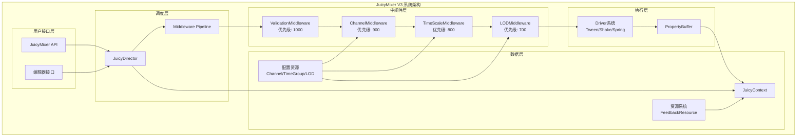
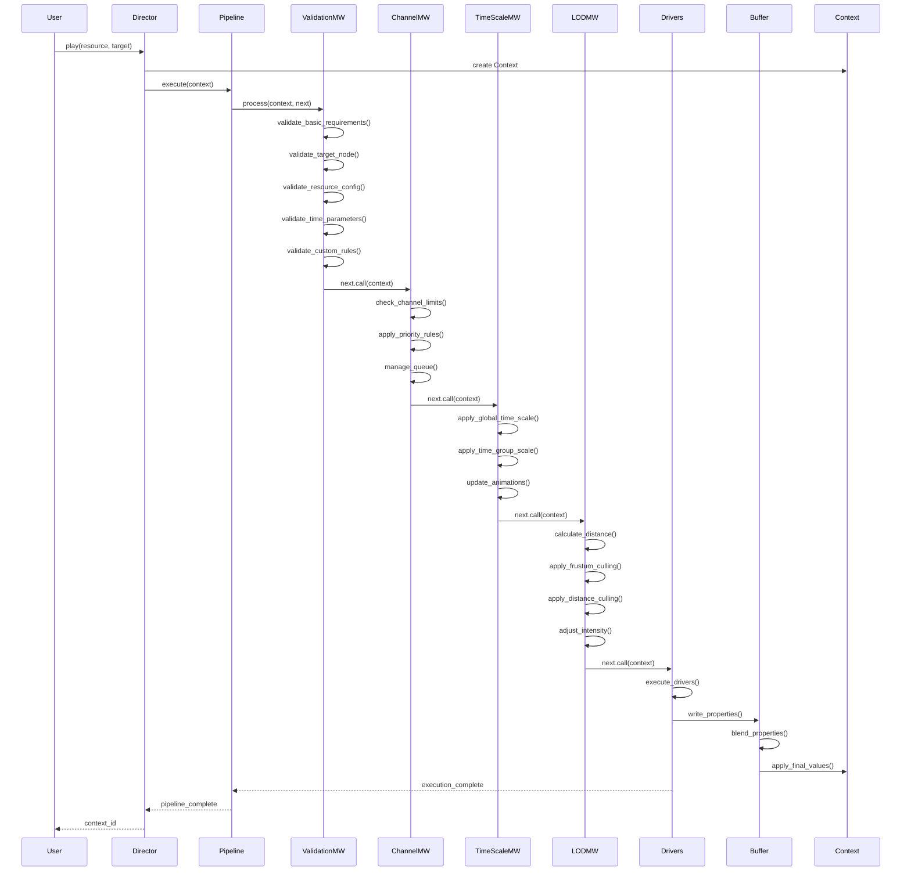
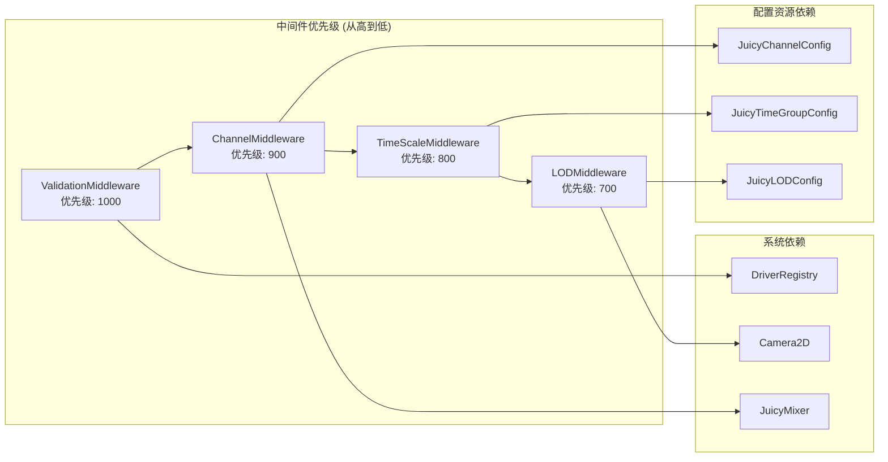
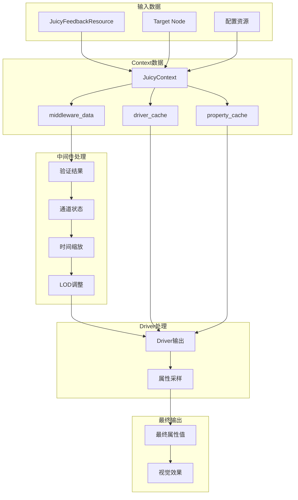
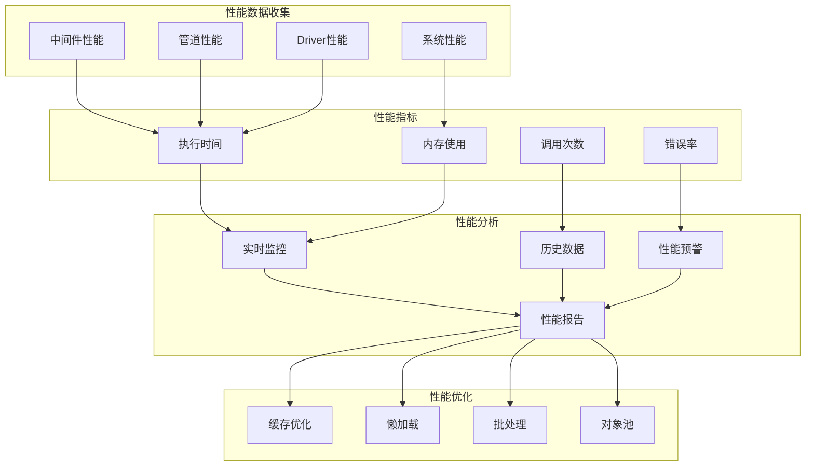

# JuicyMixer V3 中间件系统架构图

## 整体系统架构



## 中间件执行流程



## 中间件优先级和依赖关系



## 数据流图



## 错误处理流程

```mermaid
flowchart TD
    Start[开始执行中间件]
    Execute[执行中间件.process()]
    
    subgraph "错误检测"
        CheckError{是否有错误?}
        CheckCritical{是否为关键错误?}
        CheckRecovery{是否有恢复机制?}
    end
    
    subgraph "错误处理"
        LogError[记录错误日志]
        TryRecovery[尝试错误恢复]
        SkipMiddleware[跳过当前中间件]
        StopPipeline[停止管道执行]
        ReturnError[返回错误结果]
    end
    
    subgraph "继续执行"
        Continue[继续执行下一个中间件]
        Success[管道执行成功]
    end
    
    Start --> Execute
    Execute --> CheckError
    
    CheckError -->|无错误| Continue
    CheckError -->|有错误| CheckCritical
    
    CheckCritical -->|关键错误| LogError
    CheckCritical -->|非关键错误| CheckRecovery
    
    LogError --> StopPipeline
    StopPipeline --> ReturnError
    
    CheckRecovery -->|有恢复机制| TryRecovery
    CheckRecovery -->|无恢复机制| SkipMiddleware
    
    TryRecovery -->|恢复成功| Continue
    TryRecovery -->|恢复失败| SkipMiddleware
    
    SkipMiddleware --> Continue
    Continue --> Success
```

## 性能监控架构



---

**图表说明**:
- 所有图表均基于JuicyMixer V3的中间件系统设计
- 优先级数字越小表示优先级越高
- 数据流展示了从输入到输出的完整处理过程
- 错误处理流程确保系统稳定性
- 性能监控架构支持系统优化和调优