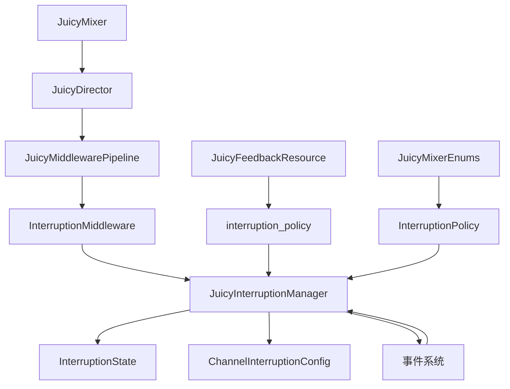

# 中断系统开发任务分解计划

## 概述

本文档提供了JuicyMixer V3中断策略系统的详细开发任务分解，包括核心组件开发、系统集成、测试和文档任务。该计划基于对现有系统架构的分析和中断策略系统需求的设计。

## 系统架构概览



## 任务分解详情

### 1. 核心组件开发任务

#### 1.1 JuicyMixerEnums中断策略枚举扩展

**任务名称**: 扩展JuicyMixerEnums添加中断策略枚举

**描述**: 在现有的JuicyMixerEnums类中添加中断策略相关的枚举定义，提供统一的枚举访问接口。

**预估工作量**: 0.5天

**依赖关系**: 无

**验收标准**:
- [ ] 成功添加InterruptionPolicy枚举，包含7种策略：STACK, RESTART, IGNORE, SMOOTH_TRANSITION, PRIORITY_OVERRIDE, FADE_OUT_FADE_IN, PRIORITY_STACK
- [ ] 提供枚举值到字符串的转换函数
- [ ] 保持与现有枚举的兼容性
- [ ] 通过代码审查

**风险评估**:
- **风险**: 枚举命名冲突
- **概率**: 低
- **影响**: 低
- **缓解措施**: 使用明确的前缀命名

**实现细节**:
```gdscript
# 中断策略枚举
enum InterruptionPolicy {
    STACK,              # 堆叠：新效果加入队列
    RESTART,            # 重启：立即重启效果
    IGNORE,             # 忽略：忽略新效果
    SMOOTH_TRANSITION,   # 平滑过渡：平滑过渡到新效果
    PRIORITY_OVERRIDE,   # 优先级覆盖：高优先级覆盖低优先级
    FADE_OUT_FADE_IN,   # 淡出淡入：当前效果淡出，新效果淡入
    PRIORITY_STACK      # 优先级堆叠：按优先级插入队列
}

# 辅助函数
static func get_interruption_policy_name(policy: InterruptionPolicy) -> String
static func get_interruption_policy_from_name(name: String) -> InterruptionPolicy
```

#### 1.2 InterruptionState中断状态数据结构

**任务名称**: 实现InterruptionState中断状态数据结构

**描述**: 创建中断状态管理类，存储中断状态数据，管理活跃和队列中的上下文，跟踪中断历史。

**预估工作量**: 1.5天

**依赖关系**: 1.1 JuicyMixerEnums扩展

**验收标准**:
- [ ] 实现完整的状态数据结构
- [ ] 提供活跃上下文管理方法
- [ ] 提供队列上下文管理方法
- [ ] 实现优先级队列功能
- [ ] 实现中断历史记录功能
- [ ] 实现过渡状态管理
- [ ] 通过单元测试

**风险评估**:
- **风险**: 内存泄漏风险
- **概率**: 中
- **影响**: 中
- **缓解措施**: 实现自动清理机制和大小限制

**实现细节**:
- 核心数据结构：target_id, active_contexts, queued_contexts, priority_queue
- 优先级队列：按优先级和时间戳排序
- 中断历史：限制记录数量，自动清理
- 过渡管理：跟踪过渡进度和状态

#### 1.3 ChannelInterruptionConfig通道中断配置

**任务名称**: 实现ChannelInterruptionConfig通道中断配置

**描述**: 创建通道级中断配置资源，管理中断策略参数，提供可编辑的配置选项。

**预估工作量**: 1天

**依赖关系**: 1.1 JuicyMixerEnums扩展

**验收标准**:
- [ ] 实现完整的配置数据结构
- [ ] 提供配置验证功能
- [ ] 支持资源序列化
- [ ] 提供编辑器友好界面
- [ ] 实现配置复制功能
- [ ] 通过单元测试

**风险评估**:
- **风险**: 配置验证不完整
- **概率**: 低
- **影响**: 中
- **缓解措施**: 实现全面的验证规则

#### 1.4 JuicyInterruptionManager中断管理器

**任务名称**: 实现JuicyInterruptionManager中断管理器核心功能

**描述**: 创建中断管理器，处理多种中断模式，实现平滑过渡机制，提供中断状态监控。

**预估工作量**: 3天

**依赖关系**: 1.1, 1.2, 1.3

**验收标准**:
- [ ] 实现所有7种中断策略
- [ ] 提供中断决策接口
- [ ] 实现平滑过渡机制
- [ ] 提供状态查询接口
- [ ] 实现性能优化
- [ ] 通过单元测试

**风险评估**:
- **风险**: 中断逻辑复杂导致状态不一致
- **概率**: 中
- **影响**: 高
- **缓解措施**: 实现全面的状态验证和测试

**实现细节**:
- 中断策略处理器：每种策略的独立处理逻辑
- 过渡资源创建：动态生成过渡效果
- 优先级管理：全局和通道级优先级
- 性能优化：缓存和批处理机制

#### 1.5 InterruptionMiddleware中断中间件

**任务名称**: 实现InterruptionMiddleware中断中间件

**描述**: 创建中断处理中间件，在Director执行流程中处理中断，协调不同中断策略的执行。

**预估工作量**: 1.5天

**依赖关系**: 1.4 JuicyInterruptionManager

**验收标准**:
- [ ] 实现中间件接口
- [ ] 集成中断管理器
- [ ] 提供中断决策钩子
- [ ] 实现生命周期管理
- [ ] 通过单元测试

**风险评估**:
- **风险**: 中间件执行顺序问题
- **概率**: 低
- **影响**: 中
- **缓解措施**: 明确优先级和测试验证

### 2. 集成任务

#### 2.1 与Director系统的集成

**任务名称**: 集成中断系统与Director系统

**描述**: 修改JuicyDirector以支持中断处理，确保中断策略与Director的执行顺序和优先级协调。

**预估工作量**: 1天

**依赖关系**: 1.5 InterruptionMiddleware

**验收标准**:
- [ ] Director正确调用中断中间件
- [ ] 维护Director状态一致性
- [ ] 处理中断后的上下文管理
- [ ] 通过集成测试

**风险评估**:
- **风险**: 破坏现有Director功能
- **概率**: 中
- **影响**: 高
- **缓解措施**: 充分的回归测试和向后兼容

#### 2.2 与Middleware系统的集成

**任务名称**: 集成中断系统与Middleware系统

**描述**: 确保中断中间件与现有中间件管道正确协作，处理中间件执行顺序和状态传递。

**预估工作量**: 0.5天

**依赖关系**: 2.1 Director集成

**验收标准**:
- [ ] 中间件管道正确执行中断中间件
- [ ] 中间件状态正确传递
- [ ] 性能影响最小化
- [ ] 通过集成测试

#### 2.3 与事件系统的集成

**任务名称**: 集成中断系统与事件系统

**描述**: 实现中断事件的生成和广播，支持中断状态的事件通知。

**预估工作量**: 0.5天

**依赖关系**: 1.4 JuicyInterruptionManager

**验收标准**:
- [ ] 中断事件正确生成
- [ ] 事件数据完整准确
- [ ] 事件系统性能良好
- [ ] 通过集成测试

#### 2.4 与现有JuicyFeedbackResource的集成

**任务名称**: 集成中断系统与现有JuicyFeedbackResource

**描述**: 扩展JuicyFeedbackResource以支持中断策略配置，确保向后兼容性。

**预估工作量**: 1天

**依赖关系**: 1.1 JuicyMixerEnums扩展

**验收标准**:
- [ ] 资源支持中断策略配置
- [ ] 保持向后兼容性
- [ ] 编辑器界面友好
- [ ] 通过集成测试

**风险评估**:
- **风险**: 破坏现有资源兼容性
- **概率**: 中
- **影响**: 高
- **缓解措施**: 默认值保持不变，渐进式迁移

### 3. 测试任务

#### 3.1 单元测试

**任务名称**: 编写核心组件单元测试

**描述**: 为每个核心组件编写全面的单元测试，确保功能正确性和边界条件处理。

**预估工作量**: 2天

**依赖关系**: 1.1-1.5 核心组件完成

**验收标准**:
- [ ] 测试覆盖率达到95%以上
- [ ] 所有边界条件测试通过
- [ ] 性能基准测试通过
- [ ] 错误处理测试通过

**测试范围**:
- InterruptionState状态管理测试
- 中断策略实现测试
- 优先级队列功能测试
- 配置验证测试
- 中间件集成测试

#### 3.2 集成测试

**任务名称**: 编写系统集成测试

**描述**: 测试中断系统与各子系统的集成，确保整体功能正确性。

**预估工作量**: 1.5天

**依赖关系**: 2.1-2.4 集成任务完成

**验收标准**:
- [ ] 所有集成场景测试通过
- [ ] 性能影响在可接受范围内
- [ ] 内存泄漏测试通过
- [ ] 并发安全测试通过

**测试场景**:
- Director集成测试
- 中间件管道集成测试
- 事件系统集成测试
- 资源系统集成测试
- 复杂中断场景测试

#### 3.3 性能测试

**任务名称**: 编写性能测试

**描述**: 测试中断系统的性能表现，确保满足性能要求。

**预估工作量**: 1天

**依赖关系**: 3.2 集成测试完成

**验收标准**:
- [ ] 1000次中断处理在100ms内完成
- [ ] 内存使用稳定，无泄漏
- [ ] 中断策略响应时间<1ms
- [ ] 优先级队列操作性能达标

**性能指标**:
- 中断处理延迟
- 内存使用量
- CPU使用率
- 缓存命中率

### 4. 文档任务

#### 4.1 API文档更新

**任务名称**: 更新API文档

**描述**: 更新现有API文档，添加中断系统相关的接口说明。

**预估工作量**: 1天

**依赖关系**: 核心组件完成

**验收标准**:
- [ ] 所有新接口有完整文档
- [ ] 参数和返回值说明清晰
- [ ] 使用示例完整
- [ ] 文档格式统一

#### 4.2 使用示例创建

**任务名称**: 创建使用示例

**描述**: 创建各种中断策略的使用示例，展示常见使用场景。

**预估工作量**: 1天

**依赖关系**: 集成任务完成

**验收标准**:
- [ ] 每种中断策略有示例
- [ ] 复杂场景有组合示例
- [ ] 示例代码可运行
- [ ] 性能最佳实践说明

#### 4.3 集成指南编写

**任务名称**: 编写集成指南

**描述**: 编写详细的集成指南，帮助开发者理解和使用中断系统。

**预估工作量**: 1天

**依赖关系**: 4.1, 4.2 完成

**验收标准**:
- [ ] 集成步骤清晰
- [ ] 常见问题有解答
- [ ] 最佳实践有说明
- [ ] 故障排除指南完整

## 开发时间线

### 第1周（核心组件开发）
- 第1天：1.1 JuicyMixerEnums扩展 + 1.2 InterruptionState基础实现
- 第2天：1.2 InterruptionState完善 + 1.3 ChannelInterruptionConfig
- 第3天：1.4 JuicyInterruptionManager基础实现
- 第4天：1.4 JuicyInterruptionManager完善 + 1.5 InterruptionMiddleware
- 第5天：核心组件测试和调试

### 第2周（集成和测试）
- 第1天：2.1 Director集成 + 2.2 Middleware集成
- 第2天：2.3 事件系统集成 + 2.4 JuicyFeedbackResource集成
- 第3天：3.1 单元测试
- 第4天：3.2 集成测试
- 第5天：3.3 性能测试 + 问题修复

### 第3周（文档和优化）
- 第1天：4.1 API文档更新
- 第2天：4.2 使用示例创建
- 第3天：4.3 集成指南编写
- 第4天：性能优化和代码审查
- 第5天：最终测试和交付准备

## 风险管控

### 高风险项目
1. **中断逻辑复杂性**
   - 风险：状态不一致，难以调试
   - 缓解：全面的状态验证，详细的日志记录

2. **向后兼容性**
   - 风险：破坏现有功能
   - 缓解：渐进式集成，充分回归测试

3. **性能影响**
   - 风险：中断处理影响整体性能
   - 缓解：性能基准测试，优化关键路径

### 中风险项目
1. **内存管理**
   - 风险：内存泄漏
   - 缓解：自动清理机制，内存监控

2. **中间件集成**
   - 风险：执行顺序问题
   - 缓解：明确的优先级定义

## 质量保证

### 代码质量标准
- 代码覆盖率：≥95%
- 静态分析：无警告
- 性能基准：满足所有性能指标
- 文档完整性：100%接口有文档

### 测试策略
- 单元测试：每个组件独立测试
- 集成测试：系统间交互测试
- 性能测试：负载和压力测试
- 兼容性测试：向后兼容验证

### 审查流程
- 代码审查：所有代码变更需审查
- 设计审查：架构设计需审查
- 测试审查：测试用例需审查
- 文档审查：文档质量需审查

## 交付检查清单

### 代码交付
- [ ] 所有核心组件实现完成
- [ ] 所有集成任务完成
- [ ] 所有测试通过
- [ ] 性能指标达标
- [ ] 代码审查通过

### 文档交付
- [ ] API文档更新完成
- [ ] 使用示例创建完成
- [ ] 集成指南编写完成
- [ ] 变更日志更新完成

### 测试交付
- [ ] 单元测试报告
- [ ] 集成测试报告
- [ ] 性能测试报告
- [ ] 兼容性测试报告

## 总结

中断策略系统是JuicyMixer V3的关键特性，将提供智能的效果管理能力。通过详细的任务分解和风险管控，确保系统的高质量交付。

**关键成功因素**：
1. 严格遵循开发时间线
2. 充分的测试覆盖
3. 仔细的风险管理
4. 高质量的文档

**预期成果**：
- 灵活的中断策略系统
- 平滑的效果过渡机制
- 高效的中断处理性能
- 完善的开发者文档