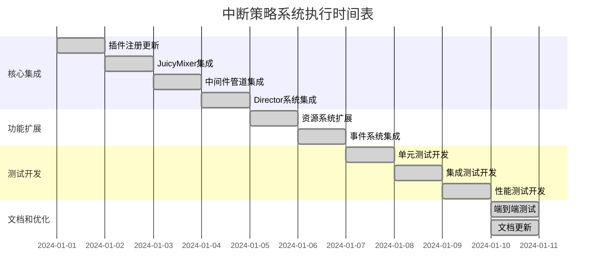

# 中断策略系统最终执行方案

## 执行概述

本文档整合了中断策略系统的所有集成和测试计划，提供了一个结构化的执行方案，包括详细的任务分解、时间安排、验收标准和风险管理策略。

## 项目背景

### 已完成的核心组件
1. **JuicyMixerEnums中断策略枚举扩展** - 定义了7种中断策略
2. **InterruptionState中断状态数据结构** - 管理目标节点的中断状态
3. **ChannelInterruptionConfig通道中断配置** - 通道级别的中断行为配置
4. **JuicyInterruptionManager中断管理器** - 核心中断逻辑处理器
5. **InterruptionMiddleware中断中间件** - 集成到中间件管道的中断处理器

### 集成目标
- 将中断策略系统完全集成到现有JuicyMixer架构中
- 确保与Director、Middleware、事件系统和资源系统的无缝协作
- 提供完整的测试覆盖和文档支持
- 保证系统性能和稳定性满足要求

## 执行计划总览

### 时间安排
**总执行时间：10天**



## 详细执行计划

### 第一阶段：核心集成（4天）

#### 第1天：插件注册更新
**负责人**: 核心开发团队
**关键文件**: [`plugin.gd`](addons/juicy_mixer/plugin.gd)

**任务清单**:
- [ ] 注册InterruptionMiddleware
- [ ] 注册JuicyInterruptionManager
- [ ] 注册InterruptionState
- [ ] 注册ChannelInterruptionConfig
- [ ] 验证编辑器中可见性

**验收标准**:
- 所有新组件在编辑器中可见并可创建
- 插件加载无错误
- 组件注册顺序正确

**预估时间**: 0.5天

#### 第2天：JuicyMixer全局入口集成
**负责人**: 核心开发团队
**关键文件**: [`juicy_mixer.gd`](addons/juicy_mixer/core/juicy_mixer.gd)

**任务清单**:
- [ ] 添加中断管理器实例
- [ ] 实现中断配置API
- [ ] 集成中断状态查询
- [ ] 添加性能监控支持

**验收标准**:
- 可以通过JuicyMixer访问中断管理功能
- API接口完整且可用
- 性能监控正常工作

**预估时间**: 1天

#### 第3天：InterruptionMiddleware管道集成
**负责人**: 中间件开发团队
**关键文件**: [`juicy_mixer.gd`](addons/juicy_mixer/core/juicy_mixer.gd)

**任务清单**:
- [ ] 在初始化时注册InterruptionMiddleware
- [ ] 确保中间件优先级正确设置
- [ ] 验证中间件管道执行流程
- [ ] 测试中间件错误处理

**验收标准**:
- InterruptionMiddleware在播放流程中被正确调用
- 中间件优先级高于其他中间件
- 错误处理机制正常

**预估时间**: 0.5天

#### 第4天：Director系统集成
**负责人**: 核心开发团队
**关键文件**: [`juicy_director.gd`](addons/juicy_mixer/core/juicy_director.gd)

**任务清单**:
- [ ] 在播放前调用中断检查
- [ ] 集成中间件钩子触发
- [ ] 更新上下文生命周期管理
- [ ] 测试多目标中断场景

**验收标准**:
- 播放请求会经过中断策略处理
- 上下文生命周期事件正确触发
- 多目标中断场景正常工作

**预估时间**: 1天

### 第二阶段：功能扩展（2天）

#### 第5天：JuicyFeedbackResource扩展
**负责人**: 资源系统开发团队
**关键文件**: [`juicy_feedback_resource.gd`](addons/juicy_mixer/resources/juicy_feedback_resource.gd)

**任务清单**:
- [ ] 扩展中断策略配置
- [ ] 添加优先级设置
- [ ] 更新编辑器属性列表
- [ ] 实现配置验证

**验收标准**:
- 资源可以配置中断策略和优先级
- 编辑器界面友好且直观
- 配置验证机制有效

**预估时间**: 1天

#### 第6天：事件系统集成
**负责人**: 事件系统开发团队
**关键文件**: [`juicy_event.gd`](addons/juicy_mixer/events/juicy_event.gd)

**任务清单**:
- [ ] 添加中断事件类型
- [ ] 创建中断事件工厂方法
- [ ] 更新事件处理器接口
- [ ] 实现事件历史记录

**验收标准**:
- 可以创建和处理中断事件
- 事件历史记录功能正常
- 事件处理器接口完整

**预估时间**: 1天

### 第三阶段：测试开发（3天）

#### 第7天：单元测试开发
**负责人**: 测试团队
**关键文件**: 测试文件目录

**任务清单**:
- [ ] JuicyMixerEnums测试
- [ ] InterruptionState测试
- [ ] ChannelInterruptionConfig测试
- [ ] JuicyInterruptionManager测试
- [ ] InterruptionMiddleware测试

**验收标准**:
- 所有单元测试通过
- 测试覆盖率达到95%以上
- 测试用例包含边界条件

**预估时间**: 1天

#### 第8天：集成测试开发
**负责人**: 测试团队
**关键文件**: 集成测试文件

**任务清单**:
- [ ] Director-中断系统集成测试
- [ ] 中间件管道集成测试
- [ ] 事件系统集成测试
- [ ] 资源系统集成测试

**验收标准**:
- 所有集成测试通过
- 组件间交互正常
- 错误处理机制有效

**预估时间**: 1天

#### 第9天：性能测试和端到端测试
**负责人**: 测试团队
**关键文件**: 性能测试文件

**任务清单**:
- [ ] 中断处理性能测试
- [ ] 系统性能基准测试
- [ ] 并发性能测试
- [ ] 端到端场景测试

**验收标准**:
- 性能指标满足要求
- 端到端场景测试通过
- 并发处理能力达标

**预估时间**: 1天

### 第四阶段：文档和优化（1天）

#### 第10天：文档更新和最终优化
**负责人**: 文档团队 + 核心开发团队
**关键文件**: 各类文档文件

**任务清单**:
- [ ] API文档更新
- [ ] 使用示例创建
- [ ] 集成指南编写
- [ ] 最终性能优化
- [ ] 发布准备

**验收标准**:
- 文档完整且准确
- 示例代码可运行
- 性能指标达标
- 发布包准备就绪

**预估时间**: 1天

## 关键文件和修改点

### 核心集成文件

#### 1. plugin.gd
**修改内容**:
```gdscript
func _enter_tree():
    # 现有注册代码...
    
    # 注册中断策略系统组件
    add_custom_type(
        "JuicyInterruptionManager",
        "RefCounted",
        preload("res://addons/juicy_mixer/core/juicy_interruption_manager.gd"),
        preload("res://icon.svg")
    )
    
    add_custom_type(
        "InterruptionState",
        "RefCounted",
        preload("res://addons/juicy_mixer/core/interruption_state.gd"),
        preload("res://icon.svg")
    )
    
    add_custom_type(
        "ChannelInterruptionConfig",
        "Resource",
        preload("res://addons/juicy_mixer/resources/channel_interruption_config.gd"),
        preload("res://icon.svg")
    )
    
    add_custom_type(
        "InterruptionMiddleware",
        "RefCounted",
        preload("res://addons/juicy_mixer/middleware/interruption_middleware.gd"),
        preload("res://icon.svg")
    )

func _exit_tree():
    # 现有清理代码...
    
    remove_custom_type("JuicyInterruptionManager")
    remove_custom_type("InterruptionState")
    remove_custom_type("ChannelInterruptionConfig")
    remove_custom_type("InterruptionMiddleware")
```

#### 2. juicy_mixer.gd
**修改内容**:
```gdscript
func _initialize() -> void:
    # 现有初始化代码...
    
    # 添加中断中间件
    var interruption_middleware = InterruptionMiddleware.new()
    if add_middleware(interruption_middleware):
        print("Interruption middleware added successfully")
    else:
        push_error("Failed to add interruption middleware")

# 中断配置API
static func set_interruption_channel_config(channel: String, config: ChannelInterruptionConfig) -> void:
    var middleware = get_interruption_middleware()
    if middleware:
        middleware.set_channel_config(channel, config)

static func get_interruption_middleware() -> InterruptionMiddleware:
    var pipeline = instance.get_middleware_pipeline()
    if pipeline:
        return pipeline.get_middleware("InterruptionMiddleware")
    return null
```

#### 3. juicy_director.gd
**修改内容**:
```gdscript
func play(resource: Object, target: Node, owner: Node = null) -> String:
    # 现有验证逻辑...
    
    # 通过中间件管道处理中断检查
    if not _middleware_pipeline_execute(context):
        _context_pool.return_context(context)
        return ""
    
    # 现有注册逻辑...
```

#### 4. juicy_feedback_resource.gd
**修改内容**:
```gdscript
# 中断策略
@export var interruption_policy: String = "stack"
@export var interruption_priority: int = 0
@export var interruption_channel: String = "default"

func _get_property_list() -> Array[Dictionary]:
    var properties = []
    
    # 添加中断策略枚举
    properties.append({
        "name": "interruption_policy",
        "type": TYPE_STRING,
        "hint": PROPERTY_HINT_ENUM,
        "hint_string": "stack,restart,ignore,smooth_transition,priority_override,fade_out_fade_in,priority_stack",
        "usage": PROPERTY_USAGE_DEFAULT
    })
    
    return properties
```

#### 5. juicy_event.gd
**修改内容**:
```gdscript
enum EventType {
    # 现有类型...
    INTERRUPTION_OCCURRED,    # 中断发生
    INTERRUPTION_COMPLETED,    # 中断完成
    TRANSITION_STARTED,        # 过渡开始
    TRANSITION_COMPLETED       # 过渡完成
}
```

## 测试策略

### 测试层次结构
```
测试金字塔
    ├── 端到端测试 (10%)
    ├── 集成测试 (20%)
    └── 单元测试 (70%)
```

### 测试环境要求
- Godot 4.0+ 环境
- 支持GDScript测试框架
- 性能分析工具
- 内存监控工具

### 测试数据准备
- 标准测试资源集合
- 多种中断策略配置
- 性能基准数据
- 边界条件测试用例

## 性能指标和验收标准

### 性能要求
1. **中断决策时间** < 1ms
2. **内存增长** < 100KB（100个并发中断）
3. **系统开销** < 20%
4. **并发处理能力** > 50个目标

### 验收标准清单
- [ ] 所有单元测试通过
- [ ] 所有集成测试通过
- [ ] 性能指标满足要求
- [ ] 文档完整准确
- [ ] 代码审查通过
- [ ] 向后兼容性验证

## 风险管理策略

### 高风险项目

#### 1. 向后兼容性风险
**风险等级**: 高
**影响范围**: 现有项目集成
**缓解策略**:
- 保持现有API不变
- 提供迁移指南
- 分阶段发布

#### 2. 性能影响风险
**风险等级**: 中
**影响范围**: 系统整体性能
**缓解策略**:
- 持续性能监控
- 优化热点代码
- 提供性能配置选项

#### 3. 集成复杂性风险
**风险等级**: 中
**影响范围**: 开发进度
**缓解策略**:
- 分阶段集成
- 充分测试
- 详细文档

### 应急预案
1. **回滚计划** - 保留回滚到上一版本的机制
2. **热修复流程** - 建立快速修复流程
3. **技术支持准备** - 准备技术支持资源

## 质量保证措施

### 代码质量
- 代码审查制度
- 静态代码分析
- 编码规范检查
- 文档同步更新

### 测试质量
- 测试覆盖率监控
- 自动化测试流程
- 持续集成检查
- 性能回归测试

### 文档质量
- 技术写作审查
- 示例代码验证
- 用户反馈收集
- 定期更新维护

## 发布计划

### 发布阶段
1. **内部测试版本** - 完成核心功能后
2. **Alpha测试版本** - 完成集成测试后
3. **Beta测试版本** - 完成所有测试后
4. **正式发布版本** - 修复所有已知问题后

### 发布检查清单
- [ ] 所有测试通过
- [ ] 性能指标达标
- [ ] 文档完整
- [ ] 安全审查通过
- [ ] 兼容性验证
- [ ] 发布说明准备

## 团队协作

### 团队结构
- **核心开发团队** - 负责核心集成
- **测试团队** - 负责测试开发
- **文档团队** - 负责文档编写
- **技术支持团队** - 负责问题解决

### 沟通机制
- 每日站会 - 同步进度和问题
- 周度回顾 - 总结和调整计划
- 技术评审 - 关键决策讨论
- 文档共享 - 统一信息来源

## 成功指标

### 技术指标
- 代码覆盖率 > 95%
- 性能指标达标率 100%
- 缺陷密度 < 1/KLOC
- 平均修复时间 < 4小时

### 业务指标
- 用户满意度 > 90%
- 集成成功率 > 95%
- 文档使用率 > 80%
- 技术支持减少 > 30%

## 后续维护计划

### 短期维护（1个月）
- 监控系统稳定性
- 收集用户反馈
- 修复发现的问题
- 优化性能瓶颈

### 中期维护（3个月）
- 功能增强
- 性能优化
- 文档完善
- 最佳实践总结

### 长期维护（6个月+）
- 版本迭代
- 新功能开发
- 社区建设
- 生态扩展

## 总结

本执行方案提供了中断策略系统集成的完整路线图，从核心集成到测试开发，从文档更新到风险管理，涵盖了项目成功的所有关键要素。

### 关键成功因素
1. **严格按照计划执行** - 确保时间节点
2. **持续质量监控** - 保证交付质量
3. **及时风险应对** - 降低项目风险
4. **有效团队协作** - 提高开发效率

### 预期成果
- 完整集成中断策略系统
- 全面测试覆盖和验证
- 完善文档和支持
- 高质量可发布版本

通过执行此方案，JuicyMixer V3将获得强大的中断策略管理能力，为用户提供前所未有的效果控制体验。