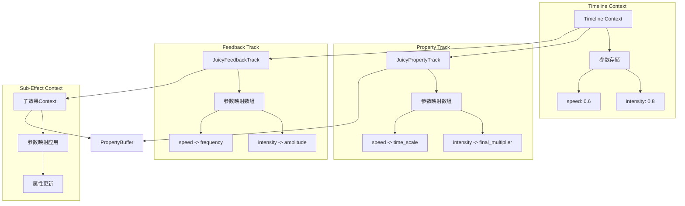
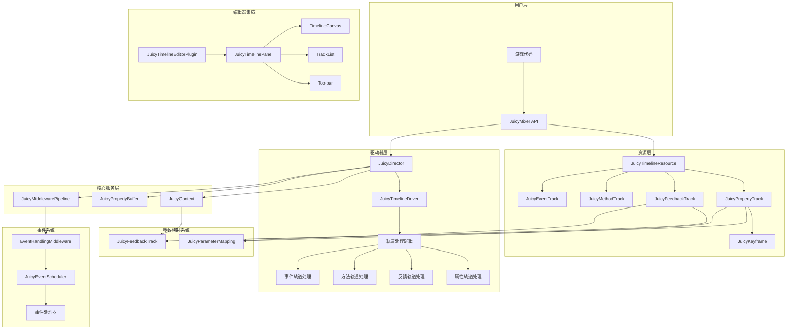

# JuicyTimeline 系统完整实现方案

## 概述

基于JuicyMixer V3 "Holographic"架构原则，JuicyTimeline是一个非线性、基于时间轴的多轨道控制能力系统，旨在替代线性的Sequence，提供导演级控制能力。它将属性变化、子效果触发和回调事件统一在一个时间轴上管理，是实现"联觉（Synesthesia）"的核心组件。

## 架构分析

### 现有JuicyMixer V3架构优势

1. **数据驱动设计**：所有状态存储在JuicyContext中，驱动器保持无状态
2. **中间件管道**：提供高度可扩展的效果处理流程
3. **属性缓冲系统**：集中管理所有属性修改，支持多种混合模式
4. **参数映射系统**：实现"联觉"效果，允许通过一个参数控制多个效果
5. **条件系统**：支持基于参数值、时间进度或复杂逻辑表达式的条件控制

### Timeline系统与现有架构的集成点

1. **资源层**：JuicyTimelineResource继承自JuicyFeedbackResource
2. **驱动器层**：JuicyTimelineDriver继承自JuicyDriver
3. **上下文层**：利用JuicyContext的参数映射和状态管理
4. **缓冲层**：直接写入JuicyPropertyBuffer，天然支持混合
5. **事件层**：与事件系统集成，支持事件触发和响应

## 系统设计

### 1. 数据层：JuicyTimelineResource

#### 1.1 独立轨道类设计

**文件路径**: `addons/juicy_mixer/resources/juicy_track.gd`

```gdscript
# 轨道基类
@tool
class_name JuicyTrack
extends Resource

@export var enabled: bool = true
@export var track_name: String = "Track"
@export var track_color: Color = Color.WHITE  # 编辑器显示颜色
@export var muted: bool = false  # 静音状态

# 获取轨道类型标识
func get_track_type() -> String:
    return "BaseTrack"

# 验证轨道配置
func validate_track() -> String:
    return ""  # 基类默认无错误
```

**文件路径**: `addons/juicy_mixer/resources/juicy_property_track.gd`

```gdscript
# 属性轨道 - 控制节点属性变化
@tool
class_name JuicyPropertyTrack
extends JuicyTrack

@export var property_path: String      # 属性名 (e.g., "scale", "modulate:a")
@export var animation_curve: Curve     # 值变化曲线 (0-1)
@export var value_range: Vector2       # 映射范围 (Min, Max)
@export var relative: bool = true      # 是否是相对值(Additive)
@export var blend_mode: int = 1        # 0: Override, 1: Additive
@export var keyframes: Array[JuicyKeyframe] = []  # 关键帧数据

# 高级属性
@export var use_absolute_time: bool = false  # 使用绝对时间而非相对时间
@export var time_offset: float = 0.0         # 时间偏移
@export var time_scale: float = 1.0         # 时间缩放

# 参数映射系统 - 轨道级别的参数绑定
@export var use_parameter_mapping: bool = false  # 参数映射开关，默认关闭
@export var parameter_mappings: Array[JuicyParameterMapping] = []

func get_track_type() -> String:
    return "Property"

func validate_track() -> String:
    if property_path.is_empty():
        return "Property path cannot be empty"
    
    # 验证参数映射
    for mapping in parameter_mappings:
        var error = mapping.validate_mapping()
        if not error.is_empty():
            return "Parameter mapping error: " + error
    
    return ""

# 获取当前时间点的值
func get_value_at_time(time: float, context: JuicyContext) -> float:
    # 应用时间变换
    var transformed_time = (time - time_offset) * time_scale
    
    # 只有在启用参数映射时才应用
    if use_parameter_mapping:
        # 应用参数映射
        var intensity_multiplier = 1.0
        for mapping in parameter_mappings:
            if mapping.enabled and mapping.target_property == "intensity":
                var param_value = context.get_parameter(mapping.input_parameter, 1.0)
                intensity_multiplier *= mapping.apply_mapping(param_value)
        
        transformed_time *= intensity_multiplier
    
    # 采样曲线或关键帧
    var curve_val: float
    if keyframes.is_empty():
        curve_val = animation_curve.sample(transformed_time)
    else:
        curve_val = _sample_keyframes(keyframes, transformed_time)
    
    # 应用其他参数映射到最终值
    var final_value = lerp(value_range.x, value_range.y, curve_val)
    
    # 只有在启用参数映射时才应用
    if use_parameter_mapping:
        for mapping in parameter_mappings:
            if mapping.enabled and mapping.target_property != "intensity":
                var param_value = context.get_parameter(mapping.input_parameter, 1.0)
                var mapped_value = mapping.apply_mapping(param_value)
                
                # 根据目标属性应用映射
                match mapping.target_property:
                    "value_range_min":
                        final_value = lerp(mapped_value, value_range.y, curve_val)
                    "value_range_max":
                        final_value = lerp(value_range.x, mapped_value, curve_val)
                    "final_multiplier":
                        final_value *= mapped_value
                    "final_offset":
                        final_value += mapped_value
    
    return final_value

# 设置参数映射到上下文
func setup_parameter_mappings(context: JuicyContext) -> void:
    """
    将轨道的参数映射设置到上下文中
    这些映射将在每帧更新时被应用
    
    @param context: JuicyContext实例
    """
    # 只有在启用参数映射时才设置
    if not use_parameter_mapping:
        return
        
    for mapping in parameter_mappings:
        if not mapping.enabled:
            continue
        
        # 为属性轨道添加特殊的参数映射处理
        # 这里我们使用自定义的处理逻辑，因为属性轨道直接修改值而不是通过PropertyBuffer
        context.set_custom_data("property_track_" + str(get_instance_id()) + "_" + mapping.input_parameter, mapping)

# 应用参数映射到属性值
func apply_parameter_mappings(context: JuicyContext, base_value: float) -> float:
    """
    应用所有参数映射到基础值
    
    @param context: JuicyContext实例
    @param base_value: 基础属性值
    @return: 应用参数映射后的值
    """
    # 只有在启用参数映射时才应用
    if not use_parameter_mapping:
        return base_value
        
    var result = base_value
    
    for mapping in parameter_mappings:
        if not mapping.enabled:
            continue
        
        var param_value = context.get_parameter(mapping.input_parameter, 1.0)
        var mapped_value = mapping.apply_mapping(param_value)
        
        # 根据映射类型应用值
        match mapping.target_property:
            "intensity":
                result *= mapped_value
            "offset":
                result += mapped_value
            "scale":
                result *= mapped_value
            "override":
                result = mapped_value
    
    return result

# 采样关键帧
func _sample_keyframes(keyframes: Array[JuicyKeyframe], time: float) -> float:
    if keyframes.is_empty():
        return 0.0
    
    # 找到时间点前后的关键帧
    var prev_frame: JuicyKeyframe = null
    var next_frame: JuicyKeyframe = null
    
    for frame in keyframes:
        if frame.time <= time:
            prev_frame = frame
        elif frame.time > time and not next_frame:
            next_frame = frame
            break
    
    # 处理边界情况
    if not prev_frame:
        return next_frame.value if next_frame else 0.0
    if not next_frame:
        return prev_frame.value
    
    # 计算插值
    var t = (time - prev_frame.time) / (next_frame.time - prev_frame.time)
    
    # 应用缓动
    match prev_frame.interpolation:
        0:  # Linear
            pass  # t保持不变
        1:  # Ease In
            t = _ease_in(t)
        2:  # Ease Out
            t = _ease_out(t)
        3:  # Ease In-Out
            t = _ease_in_out(t)
    
    return lerp(prev_frame.value, next_frame.value, t)

# 缓动函数
func _ease_in(t: float) -> float:
    return t * t

func _ease_out(t: float) -> float:
    return 1.0 - (1.0 - t) * (1.0 - t)

func _ease_in_out(t: float) -> float:
    return t < 0.5 ? 2.0 * t * t : 1.0 - 2.0 * (1.0 - t) * (1.0 - t)
```

**文件路径**: `addons/juicy_mixer/resources/juicy_feedback_track.gd`

```gdscript
# 反馈轨道 - 触发子效果
@tool
class_name JuicyFeedbackTrack
extends JuicyTrack

@export var resource: JuicyFeedbackResource  # 触发的子效果
@export var start_time: float = 0.0
@export var duration: float = -1.0     # -1 表示使用资源自身时长
@export var time_scale_curve: Curve    # 可选：动态控制子效果的时间缩放
@export var condition: JuicyCondition  # 触发条件

# 高级属性
@export var target_path: NodePath  # 可选：指定不同的目标
@export var inherit_time_scale: bool = true  # 是否继承Timeline的时间缩放
@export var interrupt_on_restart: bool = true  # 重新开始时是否中断之前的实例
@export var blend_in_time: float = 0.0  # 淡入时间
@export var blend_out_time: float = 0.0  # 淡出时间

# 参数映射系统 - 轨道级别的参数绑定到子效果
@export var use_parameter_mapping: bool = false  # 参数映射开关，默认关闭
@export var parameter_mappings: Array[JuicyParameterMapping] = []

func get_track_type() -> String:
    return "Feedback"

func validate_track() -> String:
    if not resource:
        return "Feedback resource cannot be null"
    
    # 验证参数映射
    for mapping in parameter_mappings:
        var error = mapping.validate_mapping()
        if not error.is_empty():
            return "Parameter mapping error: " + error
    
    return ""

# 获取实际持续时间
func get_actual_duration() -> float:
    if duration > 0:
        return duration
    elif resource and resource.has_method("get_duration"):
        return resource.get_duration()
    return 1.0

# 获取实际目标 - 支持编辑器和运行时环境
func get_actual_target(base_target: Node) -> Node:
    if target_path.is_empty():
        return base_target
    
    # 在编辑器环境下使用特殊处理
    if Engine.is_editor_hint():
        return _get_target_node_in_editor(base_target)
    else:
        return base_target.get_node(target_path)

# 编辑器环境下的节点获取
func _get_target_node_in_editor(base_target: Node) -> Node:
    var editor_interface = Engine.get_singleton("EditorInterface")
    if not editor_interface:
        return base_target.get_node(target_path)
    
    var edited_root = editor_interface.get_edited_scene_root()
    if not edited_root:
        return base_target.get_node(target_path)
    
    # 尝试直接获取节点
    var target_node = edited_root.get_node_or_null(target_path)
    if target_node:
        return target_node
    
    # 如果直接获取失败，尝试组合绝对路径
    var target_path_str = str(target_path)
    if target_path_str.begins_with("../"):
        var root_path = edited_root.get_path()
        var relative_part = target_path_str.substr(3)  # 移除 "../"
        var absolute_path = str(root_path) + "/" + relative_part
        target_node = edited_root.get_node(absolute_path)
    
    return target_node if target_node else base_target

# 设置参数映射到子效果上下文
func setup_parameter_mappings(context: JuicyContext, sub_context_id: String) -> void:
    """
    将轨道的参数映射设置到子效果的上下文中
    允许Timeline级别的参数直接控制子效果的属性
    
    @param context: Timeline的上下文
    @param sub_context_id: 子效果的上下文ID
    """
    # 只有在启用参数映射时才设置
    if not use_parameter_mapping:
        return
        
    var sub_context = JuicyMixer.get_context(sub_context_id)
    if not sub_context:
        return
    
    # 为每个参数映射创建目标并添加到子上下文
    for mapping in parameter_mappings:
        if not mapping.enabled:
            continue
        
        # 将参数映射添加到子上下文中
        # 这样子效果的驱动器就可以通过参数映射控制属性
        sub_context.add_parameter_mapping(
            mapping.input_parameter,
            "",  # 子效果内部处理，不需要指定上下文ID
            mapping.target_property,
            mapping.curve
        )

# 应用参数映射到子效果
func apply_parameter_mappings_to_sub_effect(context: JuicyContext, sub_context_id: String) -> void:
    """
    将Timeline上下文中的参数值应用到子效果
    
    @param context: Timeline的上下文
    @param sub_context_id: 子效果的上下文ID
    """
    # 只有在启用参数映射时才应用
    if not use_parameter_mapping:
        return
        
    var sub_context = JuicyMixer.get_context(sub_context_id)
    if not sub_context:
        return
    
    # 获取子效果的PropertyBuffer
    var property_buffer = sub_context.get_property_buffer()
    if not property_buffer:
        return
    
    # 应用所有参数映射
    for mapping in parameter_mappings:
        if not mapping.enabled:
            continue
        
        # 从Timeline上下文获取参数值
        var param_value = context.get_parameter(mapping.input_parameter, 1.0)
        
        # 应用映射曲线
        var mapped_value = param_value
        if mapping.curve:
            mapped_value = mapping.curve.sample(clampf(param_value, 0.0, 1.0))
        
        # 通过PropertyBuffer设置属性
        property_buffer.add_middleware_sample(
            sub_context.target,
            mapping.target_property,
            mapped_value,
            JuicyPropertyBuffer.BlendMode.OVERRIDE_BASE,
            "timeline_feedback_track",
            100  # 高优先级确保参数映射生效
        )

# 动态更新子效果参数
func update_sub_effect_parameters(context: JuicyContext, sub_context_id: String, progress: float) -> void:
    """
    根据时间进度动态更新子效果参数
    
    @param context: Timeline的上下文
    @param sub_context_id: 子效果的上下文ID
    @param progress: 时间进度 (0.0-1.0)
    """
    var sub_context = JuicyMixer.get_context(sub_context_id)
    if not sub_context:
        return
    
    # 应用时间缩放曲线
    if time_scale_curve:
        var scale = time_scale_curve.sample(progress)
        sub_context.time_scale = scale
    
    # 只有在启用参数映射时才应用
    if use_parameter_mapping:
        apply_parameter_mappings_to_sub_effect(context, sub_context_id)
```

**文件路径**: `addons/juicy_mixer/resources/juicy_method_track.gd`

```gdscript
# 方法轨道 - 调用目标节点方法
@tool
class_name JuicyMethodTrack
extends JuicyTrack

@export var trigger_time: float = 0.0
@export var method_name: String
@export var args: Array = []
@export var condition: JuicyCondition  # 触发条件

# 高级属性
@export var target_path: NodePath  # 可选：指定不同的目标
@export var trigger_once: bool = true  # 是否只触发一次
@export var delay: float = 0.0  # 触发后的延迟
@export var repeat_interval: float = -1.0  # 重复间隔，-1表示不重复
@export var max_repeats: int = -1  # 最大重复次数，-1表示无限

func get_track_type() -> String:
    return "Method"

func validate_track() -> String:
    if method_name.is_empty():
        return "Method name cannot be empty"
    return ""

# 获取实际目标 - 支持编辑器和运行时环境
func get_actual_target(base_target: Node) -> Node:
    if target_path.is_empty():
        return base_target
    
    # 在编辑器环境下使用特殊处理
    if Engine.is_editor_hint():
        return _get_target_node_in_editor(base_target)
    else:
        return base_target.get_node(target_path)

# 编辑器环境下的节点获取
func _get_target_node_in_editor(base_target: Node) -> Node:
    var editor_interface = Engine.get_singleton("EditorInterface")
    if not editor_interface:
        return base_target.get_node(target_path)
    
    var edited_root = editor_interface.get_edited_scene_root()
    if not edited_root:
        return base_target.get_node(target_path)
    
    # 尝试直接获取节点
    var target_node = edited_root.get_node_or_null(target_path)
    if target_node:
        return target_node
    
    # 如果直接获取失败，尝试组合绝对路径
    var target_path_str = str(target_path)
    if target_path_str.begins_with("../"):
        var root_path = edited_root.get_path()
        var relative_part = target_path_str.substr(3)  # 移除 "../"
        var absolute_path = str(root_path) + "/" + relative_part
        target_node = edited_root.get_node(absolute_path)
    
    return target_node if target_node else base_target
```

**文件路径**: `addons/juicy_mixer/resources/juicy_event_track.gd`

```gdscript
# 事件轨道 - 触发JuicyEvent
@tool
class_name JuicyEventTrack
extends JuicyTrack

@export var trigger_time: float = 0.0
@export var juicy_event: JuicyEvent
@export var condition: JuicyCondition  # 触发条件

# 高级属性
@export var event_template: JuicyEvent  # 事件模板，用于动态创建事件
@export var event_data: Dictionary = {}  # 事件数据覆盖
@export var target_path: NodePath  # 可选：指定不同的目标
@export var trigger_once: bool = true  # 是否只触发一次
@export var delay: float = 0.0  # 触发后的延迟

func get_track_type() -> String:
    return "Event"

func validate_track() -> String:
    if not juicy_event and not event_template:
        return "Either juicy_event or event_template must be set"
    return ""

# 创建实际事件
func create_actual_event(base_target: Node) -> JuicyEvent:
    var actual_event: JuicyEvent
    
    if event_template:
        actual_event = event_template.duplicate()
    elif juicy_event:
        actual_event = juicy_event.duplicate()
    else:
        return null
    
    # 设置目标 - 支持编辑器和运行时环境
    var actual_target = base_target
    if not target_path.is_empty():
        if Engine.is_editor_hint():
            actual_target = _get_target_node_in_editor(base_target)
        else:
            actual_target = base_target.get_node(target_path)
    
    # 应用事件数据覆盖
    for key in event_data:
        actual_event.set(key, event_data[key])
    
    return actual_event
```

**文件路径**: `addons/juicy_mixer/resources/juicy_keyframe.gd`

```gdscript
# 关键帧数据结构
@tool
class_name JuicyKeyframe
extends Resource

@export var time: float = 0.0
@export var value: float = 0.0
@export var interpolation: int = 0  # 插值类型
@export var ease_in: float = 0.0
@export var ease_out: float = 0.0
```

#### 1.2 JuicyTimelineResource主类

**文件路径**: `addons/juicy_mixer/resources/juicy_timeline_resource.gd`

```gdscript
@tool
class_name JuicyTimelineResource
extends JuicyFeedbackResource

# Timeline主体属性
@export_group("Timeline Settings")
@export var tracks: Array[JuicyTrack] = []
@export var duration: float = 5.0
@export var loop_mode: int = 0 # 0: None, 1: Loop, 2: PingPong
@export var loop_count: int = -1 # -1 = Infinite
@export var auto_play: bool = false

# 参数预设 - 仅用于提供默认值和预设
@export_group("Parameters")
@export var input_parameters: Dictionary = {} # "param_name" -> Default Value

# 参数预设
@export var parameter_presets: Dictionary = {}  # 预设名 -> 参数值字典

# 编辑器支持
@export_group("Editor")
@export var timeline_zoom: float = 100.0  # 像素/秒
@export var snap_enabled: bool = true
@export var snap_step: float = 0.1  # 吸附步长（秒）

func create_drivers() -> Array[JuicyDriver]:
    var driver = JuicyTimelineDriver.new()
    driver.timeline_resource = self
    return [driver]

func get_duration() -> float:
    return duration

# 应用参数预设
func apply_parameter_preset(context: JuicyContext, preset_name: String) -> void:
    if not parameter_presets.has(preset_name):
        return
    
    var preset = parameter_presets[preset_name]
    for param_name in preset:
        context.set_parameter(param_name, preset[param_name])

func validate_config() -> ValidationResult:
    var result = super.validate_config()
    if tracks.is_empty():
        result.warnings.append("Timeline has no tracks.")
    
    # 验证轨道配置
    for i in range(tracks.size()):
        var track = tracks[i]
        var track_error = track.validate_track()
        if not track_error.is_empty():
            result.issues.append("Track %d (%s): %s" % [i, track.track_name, track_error])
    
    return result
```

### 2. 逻辑层：JuicyTimelineDriver

```gdscript
class_name JuicyTimelineDriver
extends JuicyDriver

var timeline_resource: JuicyTimelineResource

func _init():
    driver_name = "JuicyTimelineDriver"
    supported_properties = []  # Timeline通过子轨道处理属性

# 准备阶段：初始化状态
func prepare(context: JuicyContext, delta: float, buffer: JuicyPropertyBuffer) -> void:
    # 初始化时间轴状态
    var state = {
        "time": 0.0,
        "active_subs": {},  # track_index -> context_id
        "last_time": -0.001, # 用于检测事件穿越
        "loops": 0,
        "direction": 1,  # 1: 正向, -1: 反向 (用于PingPong)
        "triggered_methods": {},  # method_track_index -> triggered
        "triggered_events": {},   # event_track_index -> triggered
    }
    context.set_driver_data("timeline_state", state)
    
    # 初始化轨道状态
    _initialize_tracks(context)

# 处理阶段：每帧执行
func process(context: JuicyContext, delta: float, buffer: JuicyPropertyBuffer) -> void:
    var state = context.get_driver_data("timeline_state")
    if not state:
        return
    
    # 更新时间
    var prev_time = state.time
    var dt = delta * context.time_scale
    state.time += dt * state.direction
    
    # 处理循环逻辑
    _handle_looping(context, state)
    
    # 处理所有轨道
    for i in range(timeline_resource.tracks.size()):
        var track = timeline_resource.tracks[i]
        if not track.enabled or track.muted:
            continue
        
        _process_track(context, track, i, state, prev_time, buffer)
    
    # 轨道级参数映射由各轨道自行处理
    
    state.last_time = state.time

# 清理阶段
func cleanup(context: JuicyContext) -> void:
    var state = context.get_driver_data("timeline_state")
    if state:
        # 停止所有由Timeline启动的子效果
        for sub_context_id in state.active_subs.values():
            if sub_context_id:
                JuicyMixer.stop(sub_context_id)

# 处理单个轨道
func _process_track(context: JuicyContext, track: JuicyTrack, track_idx: int,
                   state: Dictionary, prev_time: float, buffer: JuicyPropertyBuffer) -> void:
    match track.get_track_type():
        "Property":
            _process_property_track(context, track as JuicyPropertyTrack, state.time, buffer)
        "Feedback":
            _process_feedback_track(context, track as JuicyFeedbackTrack, track_idx, state)
        "Method":
            _process_method_track(context, track as JuicyMethodTrack, track_idx, state, prev_time)
        "Event":
            _process_event_track(context, track as JuicyEventTrack, track_idx, state, prev_time)

# 处理属性轨道
func _process_property_track(context: JuicyContext, track: JuicyPropertyTrack,
                             time: float, buffer: JuicyPropertyBuffer) -> void:
    # 使用轨道的参数映射系统获取值
    var final_val = track.get_value_at_time(time, context)
    
    # 写入Buffer
    var blend_mode = track.blend_mode if track.relative else JuicyPropertyBuffer.BlendMode.OVERRIDE_BASE
    buffer.add_sample(context.target, track.property_path, final_val, blend_mode, context.context_id)

# 处理反馈轨道
func _process_feedback_track(context: JuicyContext, track: JuicyFeedbackTrack,
                            track_idx: int, state: Dictionary) -> void:
    var current_time = state.time
    var end_time = track.start_time + (track.duration if track.duration > 0 else track.resource.duration)
    
    var is_inside_range = current_time >= track.start_time and current_time < end_time
    var sub_id = state.active_subs.get(track_idx)
    
    # 检查触发条件
    if track.condition and not track.condition.evaluate(context):
        is_inside_range = false
    
    # A. 触发开始
    if is_inside_range and sub_id == null:
        var actual_target = track.get_actual_target(context.target)
        var new_id = JuicyMixer.play(track.resource, actual_target)
        state.active_subs[track_idx] = new_id
        
        # 设置轨道级参数映射到子效果
        track.setup_parameter_mappings(context, new_id)
    
    # B. 持续更新
    if is_inside_range and sub_id != null:
        # 计算进度
        var progress = (current_time - track.start_time) / (end_time - track.start_time)
        
        # 应用轨道级参数映射到子效果
        track.update_sub_effect_parameters(context, sub_id, progress)
    
    # C. 触发结束
    if not is_inside_range and sub_id != null:
        JuicyMixer.stop(sub_id)
        state.active_subs.erase(track_idx)

# 处理方法轨道
func _process_method_track(context: JuicyContext, track: JuicyMethodTrack, 
                          track_idx: int, state: Dictionary, prev_time: float) -> void:
    # 检查时间穿越：上一帧在time之前，当前帧在time之后
    if prev_time < track.trigger_time and state.time >= track.trigger_time:
        # 检查是否已触发
        if not state.triggered_methods.get(track_idx, false):
            # 检查触发条件
            if not track.condition or track.condition.evaluate(context):
                var method_target = track.get_actual_target(context.target)
                if method_target and method_target.has_method(track.method_name):
                    method_target.callv(track.method_name, track.args)
                    state.triggered_methods[track_idx] = true

# 处理事件轨道
func _process_event_track(context: JuicyContext, track: JuicyEventTrack, 
                          track_idx: int, state: Dictionary, prev_time: float) -> void:
    # 检查时间穿越
    if prev_time < track.trigger_time and state.time >= track.trigger_time:
        # 检查是否已触发
        if not state.triggered_events.get(track_idx, false):
            # 检查触发条件
            if not track.condition or track.condition.evaluate(context):
                # 添加事件到Context
                context.add_event(track.juicy_event)
                state.triggered_events[track_idx] = true

# 处理循环逻辑
func _handle_looping(context: JuicyContext, state: Dictionary) -> void:
    if state.time >= timeline_resource.duration:
        match timeline_resource.loop_mode:
            0:  # None
                state.time = timeline_resource.duration
                context.complete()
            1:  # Loop
                state.time = 0.0
                state.loops += 1
                _reset_triggered_states(state)
                if timeline_resource.loop_count > 0 and state.loops >= timeline_resource.loop_count:
                    context.complete()
            2:  # PingPong
                state.direction *= -1
                state.time = timeline_resource.duration
                state.loops += 1
                _reset_triggered_states(state)
                if timeline_resource.loop_count > 0 and state.loops >= timeline_resource.loop_count:
                    context.complete()
    elif state.time < 0:  # 反向播放时
        match timeline_resource.loop_mode:
            2:  # PingPong
                state.direction *= -1
                state.time = 0.0
                state.loops += 1
                _reset_triggered_states(state)

# 重置触发状态
func _reset_triggered_states(state: Dictionary) -> void:
    state.triggered_methods.clear()
    state.triggered_events.clear()

# 采样关键帧
func _sample_keyframes(keyframes: Array[JuicyKeyframe], time: float) -> float:
    if keyframes.is_empty():
        return 0.0
    
    # 找到时间点前后的关键帧
    var prev_frame: JuicyKeyframe = null
    var next_frame: JuicyKeyframe = null
    
    for frame in keyframes:
        if frame.time <= time:
            prev_frame = frame
        elif frame.time > time and not next_frame:
            next_frame = frame
            break
    
    # 处理边界情况
    if not prev_frame:
        return next_frame.value if next_frame else 0.0
    if not next_frame:
        return prev_frame.value
    
    # 计算插值
    var t = (time - prev_frame.time) / (next_frame.time - prev_frame.time)
    
    # 应用缓动
    match prev_frame.interpolation:
        0:  # Linear
            pass  # t保持不变
        1:  # Ease In
            t = _ease_in(t)
        2:  # Ease Out
            t = _ease_out(t)
        3:  # Ease In-Out
            t = _ease_in_out(t)
    
    return lerp(prev_frame.value, next_frame.value, t)

# 缓动函数
func _ease_in(t: float) -> float:
    return t * t

func _ease_out(t: float) -> float:
    return 1.0 - (1.0 - t) * (1.0 - t)

func _ease_in_out(t: float) -> float:
    return t < 0.5 ? 2.0 * t * t : 1.0 - 2.0 * (1.0 - t) * (1.0 - t)

# 初始化轨道
func _initialize_tracks(context: JuicyContext) -> void:
    for track in timeline_resource.tracks:
        match track.get_track_type():
            "Property":
                var property_track = track as JuicyPropertyTrack
                # 设置属性轨道的参数映射
                property_track.setup_parameter_mappings(context)
            "Feedback":
                # 反馈轨道的参数映射在触发时设置
                pass
            "Method":
                # 方法轨道暂不支持参数映射
                pass
            "Event":
                # 事件轨道暂不支持参数映射
                pass
```

### 3. 轨道类型详细设计

#### 3.1 属性轨道 (JuicyPropertyTrack)

属性轨道是Timeline系统的核心，用于控制目标节点的属性变化。它支持两种模式：

1. **曲线模式**：使用AnimationCurve定义属性随时间的变化
2. **关键帧模式**：使用离散的关键帧点定义属性变化

属性轨道的完整实现请参考上面的 `addons/juicy_mixer/resources/juicy_property_track.gd` 部分。

#### 3.2 反馈轨道 (JuicyFeedbackTrack)

反馈轨道用于在时间轴上触发其他JuicyFeedbackResource，是替代Sequence的关键组件。

反馈轨道的完整实现请参考上面的 `addons/juicy_mixer/resources/juicy_feedback_track.gd` 部分。

#### 3.3 方法轨道 (JuicyMethodTrack)

方法轨道用于在特定时间点调用目标节点的方法，支持参数传递和条件触发。

方法轨道的完整实现请参考上面的 `addons/juicy_mixer/resources/juicy_method_track.gd` 部分。

#### 3.4 事件轨道 (JuicyEventTrack)

事件轨道用于在特定时间点触发JuicyEvent，与事件系统深度集成。

事件轨道的完整实现请参考上面的 `addons/juicy_mixer/resources/juicy_event_track.gd` 部分。

### 4. 轨道级参数映射和联觉系统集成

JuicyTimeline系统通过轨道级参数映射与JuicyMixer V3的参数映射系统深度集成，实现真正的"联觉"效果。每个轨道可以独立配置参数映射，提供更精细的控制。

#### 4.1 参数映射架构

```gdscript
# Timeline中的参数预设管理
class_name JuicyTimelineResource extends JuicyFeedbackResource
    # ... 其他代码 ...
    
    # 应用参数预设
    func apply_parameter_preset(context: JuicyContext, preset_name: String) -> void:
        if not parameter_presets.has(preset_name):
            return
        
        var preset = parameter_presets[preset_name]
        for param_name in preset:
            context.set_parameter(param_name, preset[param_name])
```

#### 4.2 轨道级参数映射流程



### 5. 编辑器集成方案

#### 5.1 插件架构

```gdscript
# JuicyTimelineEditorPlugin - 主插件入口
@tool
extends EditorPlugin

const TimelinePanel = preload("res://addons/juicy_mixer/editor/timeline_panel.tscn")
var timeline_panel_instance

func _enter_tree():
    timeline_panel_instance = TimelinePanel.instantiate()
    add_control_to_bottom_panel(timeline_panel_instance, "Juicy Timeline")
    _make_visible(false)

func _exit_tree():
    if timeline_panel_instance:
        remove_control_from_bottom_panel(timeline_panel_instance)
        timeline_panel_instance.queue_free()

func _handles(object):
    return object is JuicyTimelineResource

func _edit(object):
    if object is JuicyTimelineResource:
        timeline_panel_instance.set_current_timeline(object)

func _make_visible(visible):
    if timeline_panel_instance:
        timeline_panel_instance.visible = visible
        if visible:
            make_bottom_panel_item_visible(timeline_panel_instance)
```

#### 5.2 时间轴面板设计

```gdscript
# JuicyTimelinePanel - 主面板容器
extends Control

@onready var toolbar: HBoxContainer = $VBoxContainer/Toolbar
@onready var main_area: HSplitContainer = $VBoxContainer/MainArea
@onready var track_list: VBoxContainer = $VBoxContainer/MainArea/TrackList/ScrollContainer/VBoxContainer
@onready var timeline_canvas: Control = $VBoxContainer/MainArea/Timeline/ScrollContainer/TimelineCanvas

var current_timeline: JuicyTimelineResource
var zoom_scale: float = 100.0  # 像素/秒
var playhead_time: float = 0.0
var is_playing: bool = false
var preview_context: JuicyContext

func _ready():
    _setup_toolbar()
    _setup_canvas()

func set_current_timeline(timeline: JuicyTimelineResource):
    current_timeline = timeline
    _refresh_track_list()
    timeline_canvas.queue_redraw()

func _setup_toolbar():
    # 播放控制
    var play_btn = Button.new()
    play_btn.text = "Play"
    play_btn.pressed.connect(_on_play_pressed)
    toolbar.add_child(play_btn)
    
    var stop_btn = Button.new()
    stop_btn.text = "Stop"
    stop_btn.pressed.connect(_on_stop_pressed)
    toolbar.add_child(stop_btn)
    
    # 缩放控制
    var zoom_slider = HSlider.new()
    zoom_slider.min_value = 10.0
    zoom_slider.max_value = 500.0
    zoom_slider.value = zoom_scale
    zoom_slider.value_changed.connect(_on_zoom_changed)
    toolbar.add_child(zoom_slider)

func _setup_canvas():
    timeline_canvas.draw.connect(_on_canvas_draw)
    timeline_canvas.gui_input.connect(_on_canvas_input)

func _on_canvas_draw():
    if not current_timeline:
        return
    
    # 绘制标尺
    _draw_ruler()
    
    # 绘制轨道
    _draw_tracks()
    
    # 绘制播放头
    _draw_playhead()

func _draw_ruler():
    var ruler_height = 20
    timeline_canvas.draw_rect(Rect2(0, 0, timeline_canvas.size.x, ruler_height), Color.DARK_GRAY)
    
    var duration = current_timeline.duration
    var step = _get_ruler_step()
    
    for t in range(0, int(duration / step) + 1):
        var x = t * step * zoom_scale
        timeline_canvas.draw_line(Vector2(x, 0), Vector2(x, ruler_height), Color.WHITE)
        
        if t % 2 == 0:  # 每隔一个标记显示时间
            var font = timeline_canvas.get_theme_font("font", "Label")
            timeline_canvas.draw_string(font, Vector2(x + 5, 15), str(t * step) + "s")

func _draw_tracks():
    var y = 20  # 标尺高度
    var track_height = 30
    
    for i in range(current_timeline.tracks.size()):
        var track = current_timeline.tracks[i]
        
        # 绘制轨道背景
        var track_rect = Rect2(0, y, timeline_canvas.size.x, track_height)
        var bg_color = Color(0.1, 0.1, 0.1)
        if track.muted:
            bg_color = Color(0.1, 0.05, 0.05)
        timeline_canvas.draw_rect(track_rect, bg_color)
        
        # 绘制轨道内容
        match track.get_track_type():
            "Property":
                _draw_property_track(track as JuicyPropertyTrack, y, track_height)
            "Feedback":
                _draw_feedback_track(track as JuicyFeedbackTrack, y, track_height)
            "Method":
                _draw_method_track(track as JuicyMethodTrack, y, track_height)
            "Event":
                _draw_event_track(track as JuicyEventTrack, y, track_height)
        
        y += track_height

func _draw_property_track(track: JuicyPropertyTrack, y: float, height: float):
    # 绘制曲线预览
    if track.animation_curve:
        var points = PackedVector2Array()
        for x in range(0, int(timeline_canvas.size.x), 2):
            var t = x / zoom_scale / current_timeline.duration
            var val = track.animation_curve.sample(t)
            var y_pos = y + height - (val * height)
            points.append(Vector2(x, y_pos))
        
        if points.size() > 1:
            timeline_canvas.draw_polyline(points, track.track_color, 1.0)
    
    # 绘制关键帧
    for keyframe in track.keyframes:
        var x = keyframe.time * zoom_scale
        var y_pos = y + height - (keyframe.value * height)
        timeline_canvas.draw_circle(Vector2(x, y_pos), 4, track.track_color)

func _draw_feedback_track(track: JuicyFeedbackTrack, y: float, height: float):
    var x = track.start_time * zoom_scale
    var w = track.get_actual_duration() * zoom_scale
    
    # 绘制资源块
    var rect = Rect2(x, y + 2, w, height - 4)
    timeline_canvas.draw_rect(rect, track.track_color)
    
    # 绘制资源名称
    if track.resource:
        var font = timeline_canvas.get_theme_font("font", "Label")
        var text = track.resource.get_resource_type()
        var text_pos = Vector2(x + 5, y + height / 2 + font.get_height() / 2)
        timeline_canvas.draw_string(font, text_pos, text)

func _draw_method_track(track: JuicyMethodTrack, y: float, height: float):
    var x = track.trigger_time * zoom_scale
    timeline_canvas.draw_line(Vector2(x, y), Vector2(x, y + height), track.track_color, 2.0)
    
    # 绘制方法名称
    var font = timeline_canvas.get_theme_font("font", "Label")
    var text = track.method_name + "()"
    var text_pos = Vector2(x + 5, y + height / 2 + font.get_height() / 2)
    timeline_canvas.draw_string(font, text_pos, text)

func _draw_event_track(track: JuicyEventTrack, y: float, height: float):
    var x = track.trigger_time * zoom_scale
    timeline_canvas.draw_line(Vector2(x, y), Vector2(x, y + height), track.track_color, 2.0)
    
    # 绘制事件图标
    var icon_rect = Rect2(x - 4, y + height / 2 - 4, 8, 8)
    timeline_canvas.draw_rect(icon_rect, track.track_color)

func _draw_playhead():
    var x = playhead_time * zoom_scale
    timeline_canvas.draw_line(Vector2(x, 0), Vector2(x, timeline_canvas.size.y), Color.RED, 2.0)

func _on_canvas_input(event: InputEvent):
    if event is InputEventMouseButton:
        if event.button_index == MOUSE_BUTTON_LEFT:
            if event.pressed:
                # 点击时间轴，移动播放头
                var time_clicked = event.position.x / zoom_scale
                playhead_time = clamp(time_clicked, 0.0, current_timeline.duration)
                timeline_canvas.queue_redraw()
            else:
                # 释放，可能需要应用更改
                pass
        elif event.button_index == MOUSE_BUTTON_RIGHT:
            if event.pressed:
                # 右键菜单
                _show_context_menu(event.position)

func _on_play_pressed():
    if not current_timeline:
        return
    
    is_playing = true
    
    # 创建预览上下文
    var target = EditorInterface.get_selection().get_selected_nodes()[0]
    preview_context = JuicyContext.create(current_timeline, target)
    
    # 启动播放
    set_process(true)

func _on_stop_pressed():
    is_playing = false
    playhead_time = 0.0
    set_process(false)
    
    if preview_context:
        JuicyMixer.stop(preview_context.context_id)
        preview_context = null
    
    timeline_canvas.queue_redraw()

func _on_zoom_changed(value: float):
    zoom_scale = value
    timeline_canvas.queue_redraw()

func _process(delta):
    if is_playing and current_timeline:
        playhead_time += delta
        
        # 处理循环
        if playhead_time >= current_timeline.duration:
            if current_timeline.loop_mode == 1:  # Loop
                playhead_time = 0.0
            else:
                playhead_time = current_timeline.duration
                is_playing = false
                set_process(false)
        
        timeline_canvas.queue_redraw()

func _get_ruler_step() -> float:
    # 根据缩放级别选择合适的步长
    if zoom_scale < 50:
        return 1.0
    elif zoom_scale < 100:
        return 0.5
    elif zoom_scale < 200:
        return 0.25
    else:
        return 0.1

func _show_context_menu(position: Vector2):
    # 实现右键菜单
    pass
```

### 6. 系统架构图



### 7. 使用示例

#### 7.1 基本使用

```gdscript
# 创建时间轴资源
var timeline = JuicyTimelineResource.new()
timeline.duration = 3.0

# 添加属性轨道 - 控制缩放
var scale_track = JuicyPropertyTrack.new()
scale_track.track_name = "Scale"
scale_track.property_path = "scale"
scale_track.animation_curve = Curve.new()
scale_track.animation_curve.add_point(Vector2(0, 0))
scale_track.animation_curve.add_point(Vector2(0.5, 1))
scale_track.animation_curve.add_point(Vector2(1, 0))
scale_track.value_range = Vector2(1.0, 2.0)
timeline.tracks.append(scale_track)

# 添加反馈轨道 - 播放音效
var audio_resource = preload("res://assets/hit_sound.tres")
var audio_track = JuicyFeedbackTrack.new()
audio_track.track_name = "Hit Sound"
audio_track.resource = audio_resource
audio_track.start_time = 0.5
timeline.tracks.append(audio_track)

# 播放时间轴
var context_id = JuicyMixer.play(timeline, player_node)
```

#### 7.2 创建自定义轨道类型

由于轨道类型现在是独立类，创建自定义轨道类型变得更加简单：

```gdscript
# 自定义轨道 - 粒子控制轨道
# 文件: addons/juicy_mixer/resources/juicy_particle_track.gd
@tool
class_name JuicyParticleTrack
extends JuicyTrack

@export var particle_system_path: NodePath  # 使用路径而非直接引用
@export var emission_curve: Curve
@export var speed_curve: Curve

# 参数映射系统 - 轨道级别的参数绑定
@export var use_parameter_mapping: bool = false  # 参数映射开关，默认关闭
@export var parameter_mappings: Array[JuicyParameterMapping] = []

func get_track_type() -> String:
    return "Particle"

func validate_track() -> String:
    if particle_system_path.is_empty():
        return "Particle system path cannot be empty"
    return ""

# 获取粒子系统实例 - 支持编辑器和运行时环境
func get_particle_system(base_target: Node) -> GPUParticles2D:
    var particle_system: GPUParticles2D
    
    # 在编辑器环境下使用特殊处理
    if Engine.is_editor_hint():
        particle_system = _get_node_in_editor(base_target, particle_system_path)
    else:
        particle_system = base_target.get_node(particle_system_path)
    
    return particle_system as GPUParticles2D

# 编辑器环境下的节点获取
func _get_node_in_editor(base_target: Node, node_path: NodePath) -> Node:
    var editor_interface = Engine.get_singleton("EditorInterface")
    if not editor_interface:
        return base_target.get_node(node_path)
    
    var edited_root = editor_interface.get_edited_scene_root()
    if not edited_root:
        return base_target.get_node(node_path)
    
    # 尝试直接获取节点
    var target_node = edited_root.get_node_or_null(node_path)
    if target_node:
        return target_node
    
    # 如果直接获取失败，尝试组合绝对路径
    var node_path_str = str(node_path)
    if node_path_str.begins_with("../"):
        var root_path = edited_root.get_path()
        var relative_part = node_path_str.substr(3)  # 移除 "../"
        var absolute_path = str(root_path) + "/" + relative_part
        target_node = edited_root.get_node(absolute_path)
    
    return target_node if target_node else base_target

# 在TimelineDriver中添加处理逻辑
func _process_particle_track(context: JuicyContext, track: JuicyParticleTrack,
                           time: float, buffer: JuicyPropertyBuffer) -> void:
    var particle_system = track.get_particle_system(context.target)
    if not particle_system:
        return
    
    var t = time / timeline_resource.duration
    
    # 应用参数映射到时间
    var transformed_time = t
    if track.use_parameter_mapping:
        for mapping in track.parameter_mappings:
            if not mapping.enabled:
                continue
            if mapping.target_property == "time_scale":
                var param_value = context.get_parameter(mapping.input_parameter, 1.0)
                var mapped_value = mapping.apply_mapping(param_value)
                transformed_time *= mapped_value
    
    # 控制发射率
    var emission_rate = track.emission_curve.sample(transformed_time)
    particle_system.emission = emission_rate
    
    # 控制速度
    var speed = track.speed_curve.sample(transformed_time)
    particle_system.process_material.velocity = Vector3(speed, speed, speed)
    
    # 应用其他参数映射
    if track.use_parameter_mapping:
        for mapping in track.parameter_mappings:
            if not mapping.enabled:
                continue
            
            var param_value = context.get_parameter(mapping.input_parameter, 1.0)
            var mapped_value = mapping.apply_mapping(param_value)
            
            # 根据目标属性应用映射
            match mapping.target_property:
                "emission_multiplier":
                    particle_system.emission *= mapped_value
                "speed_multiplier":
                    var current_speed = particle_system.process_material.velocity
                    particle_system.process_material.velocity = current_speed * mapped_value
```

#### 7.2 轨道级参数映射使用

##### 属性轨道参数映射

```gdscript
# 创建属性轨道并添加参数映射
var scale_track = JuicyPropertyTrack.new()
scale_track.track_name = "Scale"
scale_track.property_path = "scale"
scale_track.animation_curve = Curve.new()
scale_track.animation_curve.add_point(Vector2(0, 0))
scale_track.animation_curve.add_point(Vector2(0.5, 1))
scale_track.animation_curve.add_point(Vector2(1, 0))
scale_track.value_range = Vector2(1.0, 2.0)

# 启用参数映射
scale_track.use_parameter_mapping = true

# 添加强度参数映射
var intensity_mapping = JuicyParameterMapping.new()
intensity_mapping.input_parameter = "intensity"
intensity_mapping.target_property = "final_multiplier"
intensity_mapping.curve = Curve.new()
intensity_mapping.curve.add_point(Vector2(0, 0.5))
intensity_mapping.curve.add_point(Vector2(1, 2.0))
scale_track.parameter_mappings.append(intensity_mapping)

timeline.tracks.append(scale_track)
```

##### 反馈轨道参数映射

```gdscript
# 创建反馈轨道并添加参数映射到子效果
var shake_resource = preload("res://assets/camera_shake.tres")
var shake_track = JuicyFeedbackTrack.new()
shake_track.track_name = "Camera Shake"
shake_track.resource = shake_resource
shake_track.start_time = 0.5

# 启用参数映射
shake_track.use_parameter_mapping = true

# 添加振幅参数映射
var amplitude_mapping = JuicyParameterMapping.new()
amplitude_mapping.input_parameter = "intensity"
amplitude_mapping.target_property = "amplitude"
amplitude_mapping.curve = Curve.new()
amplitude_mapping.curve.add_point(Vector2(0, 5.0))
amplitude_mapping.curve.add_point(Vector2(1, 20.0))
shake_track.parameter_mappings.append(amplitude_mapping)

# 添加频率参数映射
var frequency_mapping = JuicyParameterMapping.new()
frequency_mapping.input_parameter = "speed"
frequency_mapping.target_property = "frequency"
frequency_mapping.curve = Curve.new()
frequency_mapping.curve.add_point(Vector2(0, 5.0))
frequency_mapping.curve.add_point(Vector2(1, 15.0))
shake_track.parameter_mappings.append(frequency_mapping)

timeline.tracks.append(shake_track)
```

##### 运行时参数控制

```gdscript
# 播放时间轴
var context_id = JuicyMixer.play(timeline, player_node)

# 运行时控制参数
var context = JuicyMixer.get_context(context_id)
context.set_parameter("intensity", 0.8)  # 80%强度，影响所有绑定的轨道
context.set_parameter("speed", 0.6)       # 60%速度，影响绑定到speed参数的轨道
```

#### 7.3 条件触发

```gdscript
# 创建条件 - 生命值低于30%时触发
var health_condition = JuicyParameterCondition.new()
health_condition.parameter_name = "health_percentage"
health_condition.operator = JuicyParameterCondition.ComparisonOperator.LESS_THAN
health_condition.target_value = 0.3

# 添加到轨道
var method_track = JuicyMethodTrack.new()
method_track.track_name = "Low Health Effect"
method_track.trigger_time = 0.0
method_track.method_name = "play_low_health_effect"
method_track.condition = health_condition
timeline.tracks.append(method_track)
```

### 8. 性能优化

#### 8.1 对象池化

```gdscript
# Timeline专用的对象池
class_name JuicyTimelinePoolManager
extends JuicyPoolManager

# 预热Timeline相关对象
func warm_up_timeline_objects():
    # 预热轨道对象
    _create_pool("JuicyPropertyTrack", 20)
    _create_pool("JuicyFeedbackTrack", 20)
    _create_pool("JuicyMethodTrack", 20)
    _create_pool("JuicyEventTrack", 20)
    
    # 预热关键帧对象
    _create_pool("JuicyKeyframe", 100)
```

#### 8.2 批处理优化

```gdscript
# 在TimelineDriver中使用批处理
func process(context: JuicyContext, delta: float, buffer: JuicyPropertyBuffer) -> void:
    # 收集所有属性更改
    var property_changes = []
    
    for track in property_tracks:
        var change = _calculate_property_change(track, context)
        if change:
            property_changes.append(change)
    
    # 批量应用到缓冲区
    for change in property_changes:
        buffer.add_sample(change.target, change.property, change.value, change.mode, context.context_id)
```

### 9. 扩展能力

#### 9.1 自定义轨道类型

```gdscript
# 自定义轨道 - 粒子控制轨道
class_name JuicyParticleTrack extends JuicyTrack:
    @export var particle_system_path: NodePath  # 使用路径而非直接引用
    @export var emission_curve: Curve
    @export var speed_curve: Curve
    
    # 参数映射系统 - 轨道级别的参数绑定
    @export var use_parameter_mapping: bool = false  # 参数映射开关，默认关闭
    @export var parameter_mappings: Array[JuicyParameterMapping] = []
    
    # 获取粒子系统实例 - 支持编辑器和运行时环境
    func get_particle_system(base_target: Node) -> GPUParticles2D:
        var particle_system: GPUParticles2D
        
        # 在编辑器环境下使用特殊处理
        if Engine.is_editor_hint():
            particle_system = _get_node_in_editor(base_target, particle_system_path)
        else:
            particle_system = base_target.get_node(particle_system_path)
        
        return particle_system as GPUParticles2D
    
    # 编辑器环境下的节点获取
    func _get_node_in_editor(base_target: Node, node_path: NodePath) -> Node:
        var editor_interface = Engine.get_singleton("EditorInterface")
        if not editor_interface:
            return base_target.get_node(node_path)
        
        var edited_root = editor_interface.get_edited_scene_root()
        if not edited_root:
            return base_target.get_node(node_path)
        
        # 尝试直接获取节点
        var target_node = edited_root.get_node_or_null(node_path)
        if target_node:
            return target_node
        
        # 如果直接获取失败，尝试组合绝对路径
        var node_path_str = str(node_path)
        if node_path_str.begins_with("../"):
            var root_path = edited_root.get_path()
            var relative_part = node_path_str.substr(3)  # 移除 "../"
            var absolute_path = str(root_path) + "/" + relative_part
            target_node = edited_root.get_node(absolute_path)
        
        return target_node if target_node else base_target
    
    # 在TimelineDriver中添加处理逻辑
    func _process_particle_track(context: JuicyContext, track: JuicyParticleTrack,
                               time: float, buffer: JuicyPropertyBuffer) -> void:
        var particle_system = track.get_particle_system(context.target)
        if not particle_system:
            return
        
        var t = time / timeline_resource.duration
        
        # 应用参数映射到时间
        var transformed_time = t
        if track.use_parameter_mapping:
            for mapping in track.parameter_mappings:
                if not mapping.enabled:
                    continue
                if mapping.target_property == "time_scale":
                    var param_value = context.get_parameter(mapping.input_parameter, 1.0)
                    var mapped_value = mapping.apply_mapping(param_value)
                    transformed_time *= mapped_value
        
        # 控制发射率
        var emission_rate = track.emission_curve.sample(transformed_time)
        particle_system.emission = emission_rate
        
        # 控制速度
        var speed = track.speed_curve.sample(transformed_time)
        particle_system.process_material.velocity = Vector3(speed, speed, speed)
        
        # 应用其他参数映射
        if track.use_parameter_mapping:
            for mapping in track.parameter_mappings:
                if not mapping.enabled:
                    continue
                
                var param_value = context.get_parameter(mapping.input_parameter, 1.0)
                var mapped_value = mapping.apply_mapping(param_value)
                
                # 根据目标属性应用映射
                match mapping.target_property:
                    "emission_multiplier":
                        particle_system.emission *= mapped_value
                    "speed_multiplier":
                        var current_speed = particle_system.process_material.velocity
                        particle_system.process_material.velocity = current_speed * mapped_value
```

#### 9.2 自定义事件处理器

```gdscript
# Timeline专用事件处理器
class_name JuicyTimelineEventHandler
extends JuicyEventHandler

func _init():
    handler_name = "JuicyTimelineEventHandler"
    supported_events = [JuicyEvent.EventType.CUSTOM_EVENT]

func handle_event(event: JuicyEvent) -> bool:
    if event.event_name == "timeline_marker_reached":
        # 处理时间轴标记事件
        _handle_timeline_marker(event)
        return true
    
    return false
```

### 10. 最佳实践

#### 10.1 轨道组织

1. **按功能分组**：将相关的轨道放在一起，如视觉效果、音频效果、逻辑回调
2. **命名规范**：使用清晰的轨道名称，便于识别和维护
3. **颜色编码**：为不同类型的轨道设置不同颜色，提高可读性

#### 10.2 性能考虑

1. **避免过多轨道**：过多的轨道会增加计算负担，考虑合并相似的属性变化
2. **合理使用关键帧**：对于简单的线性变化，使用曲线比关键帧更高效
3. **条件优化**：将最可能失败的条件放在前面，利用短路评估

#### 10.3 调试技巧

1. **使用轨道静音**：临时禁用某些轨道来隔离问题
2. **参数调试**：通过参数映射实时调整效果，找到最佳参数
3. **事件日志**：启用事件系统的日志功能，跟踪事件触发情况

### 11. 总结

JuicyTimeline系统是JuicyMixer V3架构的自然延伸，它完美继承了V3的设计原则：

1. **数据驱动**：所有状态存储在JuicyContext中，驱动器保持无状态
2. **模块化设计**：每种轨道类型都是独立的模块，易于扩展
3. **轨道级参数映射**：深度集成联觉系统，实现精细的多感官同步控制
4. **事件驱动**：与事件系统无缝集成，支持复杂的交互逻辑
5. **性能优化**：利用对象池和批处理，确保高性能

通过JuicyTimeline，开发者可以创建复杂的游戏手感序列，如：
- 攻击动作：武器挥动（属性轨道）+ 击中音效（反馈轨道）+ 屏幕震动（反馈轨道）+ 伤害数字（方法轨道）
- 技能释放：法术动画（属性轨道）+ 咏唱音效（反馈轨道）+ 粒子效果（反馈轨道）+ 技能冷却（方法轨道）
- 环境交互：开门动画（属性轨道）+ 开门音效（反馈轨道）+ 区域解锁（事件轨道）

JuicyTimeline将JuicyMixer从一个特效库提升为一个完整的游戏手感编排引擎，为开发者提供了前所未有的创作自由度和表现力。