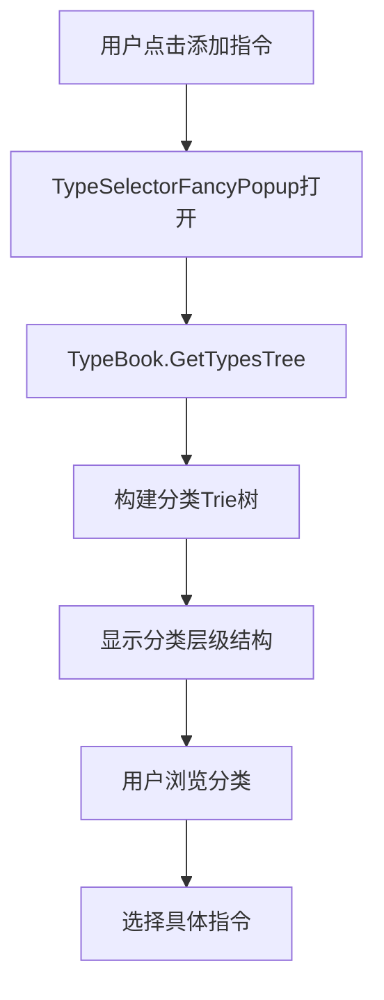
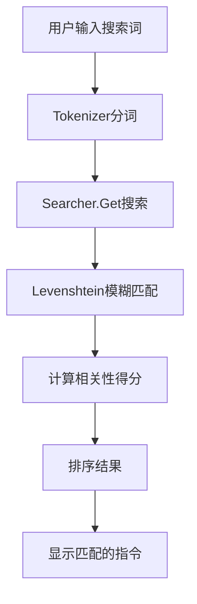

# GameCreator视觉脚本系统中Category和Keyword功能分析

## 概述

GameCreator的视觉脚本系统实现了一个强大的分类和关键字搜索功能，允许用户在检查器面板中通过分类浏览和关键字搜索来快速找到所需的指令、条件和其他组件。本文档详细分析了这一功能的实现机制。

## 核心组件分析

### 1. 属性定义

在 [`InstructionGameObjectAddComponent.cs`](Assets/Plugins/GameCreator/Packages/Core/Runtime/VisualScripting/Instructions/Collection/Common/GameObjects/InstructionGameObjectAddComponent.cs:11-13) 中，我们可以看到category和keyword的定义：

```csharp
[Category("Game Objects/Components/Add Component")]
[Keywords("Add", "Append", "MonoBehaviour", "Behaviour", "Script")]
```

- **Category属性**: 定义了该指令在分类树中的路径，使用"/"分隔符表示层级关系
- **Keywords属性**: 定义了用于搜索的关键字列表

### 2. 分类浏览实现

#### 2.1 TypeUtils.GetTypesTree方法

[`TypeUtils.GetTypesTree`](Assets/Plugins/GameCreator/Packages/Core/Editor/Common/Utilities/Utils/TypeUtils.cs:58-89) 方法是分类浏览的核心实现：

```csharp
public static Trie<Type> GetTypesTree(Type typeBase)
{
    Trie<Type> trie = Trie<Type>.Create();
    Type[] types = GetDerivedTypes(typeBase);

    foreach (Type type in types)
    {
        CategoryAttribute category = type
            .GetCustomAttributes<CategoryAttribute>(true)
            .FirstOrDefault();

        string[] paths = category?.Path ?? Array.Empty<string>();
        string name = category != null && string.IsNullOrEmpty(category.Name)
            ? category.Name
            : TextUtils.Humanize(type.ToString());

        Trie<Type> subTrie = trie;
        foreach (string section in paths)
        {
            if (!subTrie.Children.TryGetValue(section, out Trie<Type> child))
            {
                child = subTrie.AddChild(new Trie<Type>(section, null));
            }
            subTrie = child;
        }

        subTrie.AddChild(new Trie<Type>(name, type));
    }

    return trie;
}
```

该方法的工作原理：
1. 获取所有继承自指定基类的类型
2. 读取每个类型的Category属性
3. 将Category路径解析为层级结构，构建Trie树
4. 每个分类节点可以包含子分类和具体的类型

#### 2.2 TypeBook和TypeChapter

[`TypeBook`](Assets/Plugins/GameCreator/Packages/Core/Editor/Common/TypeSelector/TypeBook/TypeBook.cs:7-27) 类负责管理不同基类型的分类树：

```csharp
internal static class TypeBook 
{
    private static readonly Dictionary<Type, TypeChapter> Books =
        new Dictionary<Type, TypeChapter>();

    public static void Awake(Type type)
    {
        if (!Books.ContainsKey(type))
        {
            Books.Add(type, new TypeChapter(type));
        }
    }
}
```

每个基类型（如Instruction、Condition等）都有对应的TypeChapter，包含该类型的分类树结构。

### 3. 关键字搜索实现

#### 3.1 搜索索引构建

[`Domain`](Assets/Plugins/GameCreator/Packages/Core/Editor/Common/TypeSelector/Search/Documents/Domain.cs:21-72) 类负责构建搜索索引：

```csharp
public Domain(Type type)
{
    // ... 初始化代码 ...
    
    foreach (Type entry in collection)
    {
        Document document = new Document(entry);
        this.Documents.Add(document.DocumentId, document);
        
        TitleAttribute[] title = entry.GetCustomAttributes<TitleAttribute>().ToArray();
        CategoryAttribute[] category = entry.GetCustomAttributes<CategoryAttribute>().ToArray();
        DescriptionAttribute[] description = entry.GetCustomAttributes<DescriptionAttribute>().ToArray();
        ParameterAttribute[] parameters = entry.GetCustomAttributes<ParameterAttribute>().ToArray();
        KeywordsAttribute[] keywords = entry.GetCustomAttributes<KeywordsAttribute>().ToArray();

        Field[] fields = 
        {
            Field.First(0, document.DocumentId, title),
            Field.First(1, document.DocumentId, category),
            Field.First(2, document.DocumentId, description),
            Field.Joins(3, document.DocumentId, parameters),
            Field.Joins(4, document.DocumentId, keywords)
        };

        // ... 处理字段和术语 ...
    }
}
```

搜索索引包含以下字段：
1. **标题字段** (FieldType 0): 包含指令的标题
2. **分类字段** (FieldType 1): 包含分类路径
3. **描述字段** (FieldType 2): 包含指令描述
4. **参数字段** (FieldType 3): 包含参数信息
5. **关键字字段** (FieldType 4): 包含Keywords属性中定义的关键字

#### 3.2 搜索算法

[`Searcher.Get`](Assets/Plugins/GameCreator/Packages/Core/Editor/Common/TypeSelector/Search/Utils/Searcher.cs:33-112) 方法实现了搜索算法：

```csharp
public static List<Type> Get(string search, Domain domain, Indexer indexer)
{
    // ... 初始化代码 ...
    
    string[] terms = Tokenizer.Run(search);
    Pipelines.Searching.Process(terms);
    
    foreach (string term in terms)
    {
        // 对每个搜索词进行模糊匹配
        foreach (KeyValuePair<string, List<int>> inverseEntry in indexer.TermFieldIndex)
        {
            int editDistance = Levenshtein.Get(term, inverseEntry.Key);
            if (editDistance > Levenshtein.MAX_EDITS) continue;
            
            // ... 收集匹配的字段 ...
        }
        
        // ... 计算文档得分 ...
    }

    // ... 返回排序后的结果 ...
}
```

搜索算法特点：
1. **分词处理**: 将搜索查询分解为多个术语
2. **模糊匹配**: 使用Levenshtein距离算法进行模糊匹配
3. **多字段搜索**: 同时搜索标题、分类、描述和关键字字段
4. **相关性评分**: 根据匹配程度计算相关性得分

### 4. 用户界面实现

#### 4.1 TypeSelectorFancyPopup

[`TypeSelectorFancyPopup`](Assets/Plugins/GameCreator/Packages/Core/Editor/Common/TypeSelector/Selectors/Types/Windows/TypeSelectorFancyPopup.cs:10-517) 类实现了选择器弹窗界面：

```csharp
private void SetupHead()
{
    this.m_SearchField = new TextField();

    this.m_SearchField.RegisterValueChangedCallback(changeEvent =>
    {
        bool isEmptySearch = string.IsNullOrEmpty(changeEvent.newValue);
        
        if (isEmptySearch)
        {
            this.SetupSearchPage(null);
            return;
        }
        
        IEnumerable<Type> types = Search.Index.Get(this.m_Type, changeEvent.newValue);
        Trie<Type> pagesTrie = new Trie<Type>(changeEvent.newValue, null);
        
        foreach (Type type in types)
        {
            string typeName = type.ToString();
            pagesTrie.AddChild(new Trie<Type>(typeName, type));
        }
        
        TypePage typePage = new TypePage(pagesTrie, true);
        this.SetupSearchPage(typePage);
    });
}
```

界面功能：
1. **搜索框**: 实时搜索，输入时立即显示匹配结果
2. **分类浏览**: 无搜索内容时显示分类树结构
3. **结果展示**: 搜索结果按相关性排序显示
4. **键盘导航**: 支持键盘快捷键操作

#### 4.2 集成到Actions组件

在 [`ActionsEditor`](Assets/Plugins/GameCreator/Packages/Core/Editor/VisualScripting/Components/ActionsEditor.cs:11-19) 中，选择器被集成到Actions组件的检查器面板：

```csharp
public override VisualElement CreateInspectorGUI()
{
    VisualElement container = new VisualElement();
    container.style.marginTop = DEFAULT_MARGIN_TOP;

    this.CreateInstructionsGUI(container);

    return container;
}
```

通过 [`InstructionListTool`](Assets/Plugins/GameCreator/Packages/Core/Editor/VisualScripting/Instructions/Tools/InstructionListTool.cs:108-111) 创建添加指令按钮：

```csharp
this.m_ButtonAdd = new TypeSelectorElementInstruction(this.PropertyList, this)
{
    name = NAME_BUTTON_ADD
};
```

## 工作流程

### 分类浏览流程



### 关键字搜索流程



## 技术特点

### 1. 高效的索引结构

- **Trie树**: 用于分类浏览，支持快速导航
- **倒排索引**: 用于关键字搜索，支持快速检索
- **缓存机制**: TypeBook缓存已构建的分类树和索引

### 2. 智能搜索算法

- **模糊匹配**: 使用Levenshtein距离算法，支持拼写错误容错
- **多字段搜索**: 同时搜索标题、分类、描述和关键字
- **相关性评分**: 根据匹配程度和字段权重计算得分

### 3. 用户友好的界面

- **实时搜索**: 输入时立即显示结果
- **键盘导航**: 支持方向键和回车键操作
- **视觉反馈**: 高亮显示当前选择和匹配结果

## 扩展性

该系统具有良好的扩展性：

1. **新增指令**: 只需添加Category和Keywords属性即可自动集成到系统中
2. **自定义搜索字段**: 可以通过修改Domain类添加新的搜索字段
3. **自定义排序**: 可以修改搜索算法调整结果排序逻辑

## 总结

GameCreator的category和keyword功能实现了一个完整的类型选择和搜索系统，通过以下关键技术实现：

1. **属性驱动的元数据**: 使用Category和Keywords属性为类型提供结构化元数据
2. **分层索引结构**: 使用Trie树实现分类浏览，使用倒排索引实现关键字搜索
3. **智能搜索算法**: 结合分词、模糊匹配和相关性评分提供高质量的搜索体验
4. **响应式用户界面**: 实时搜索和键盘导航提供流畅的用户体验

这种设计使得用户可以通过直观的分类浏览或强大的关键字搜索快速找到所需的视觉脚本组件，大大提高了开发效率。