# Game Creator 2 变量系统图表分析

## 概述

本文档通过图表形式展示Game Creator 2变量系统的架构关系、工作流程和类层次结构，帮助理解系统的整体设计和各组件之间的交互关系。

## 类关系图

### 1. 核心类层次结构

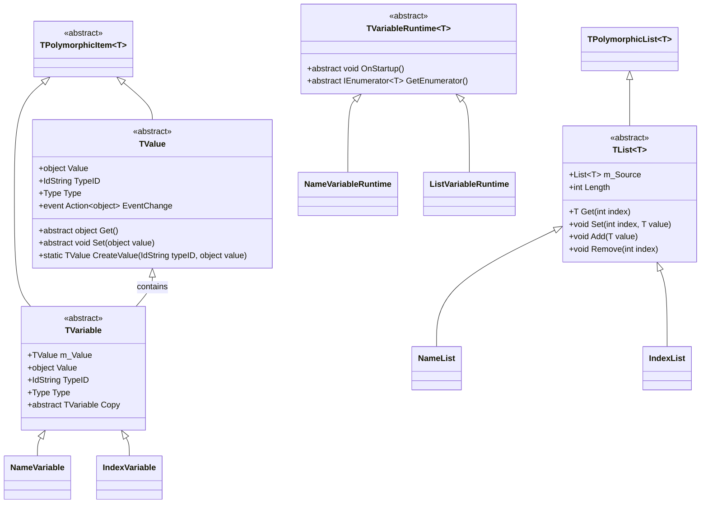

### 2. 具体值类型类

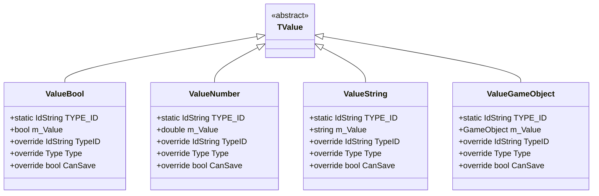

### 3. 字段访问系统

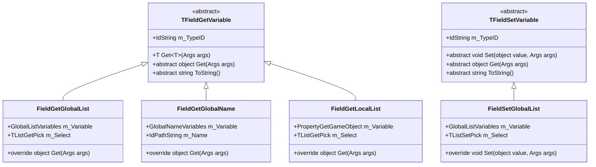

### 4. 属性系统

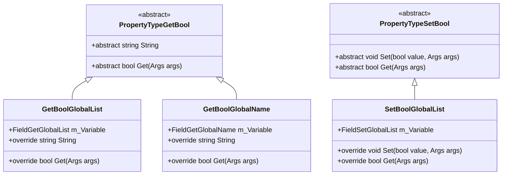

## 工作流程图

### 1. 变量创建和初始化流程

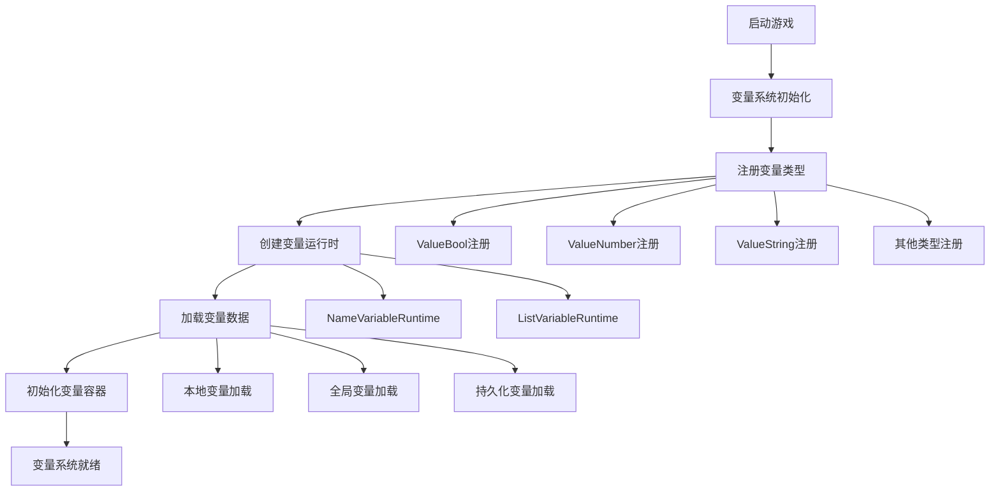

### 2. 变量访问流程

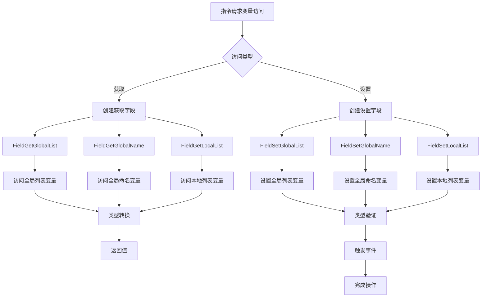

### 3. 指令执行流程

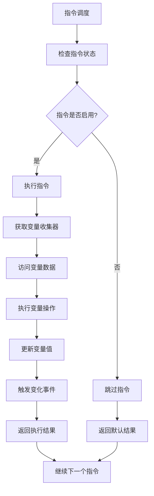

### 4. 变量事件系统流程

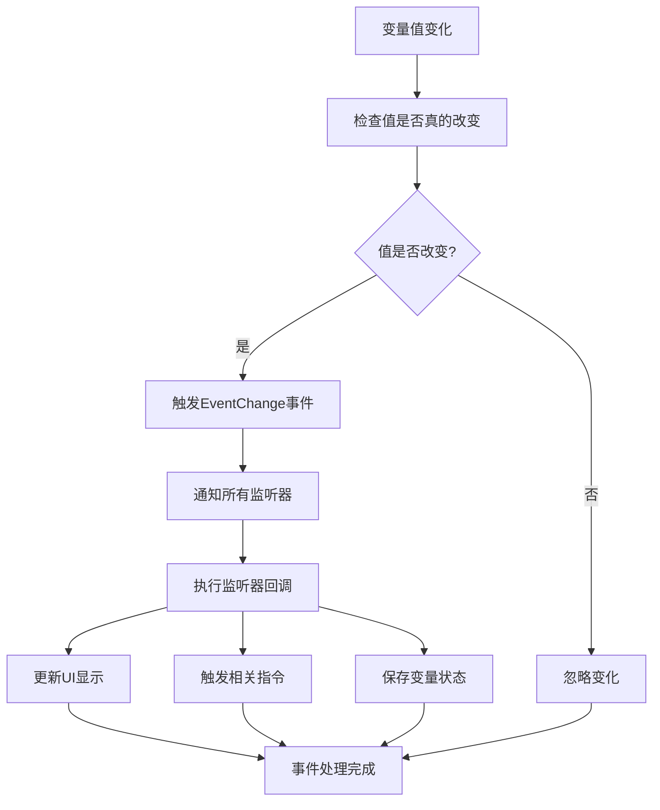

## 系统交互图

### 1. 指令与变量系统交互

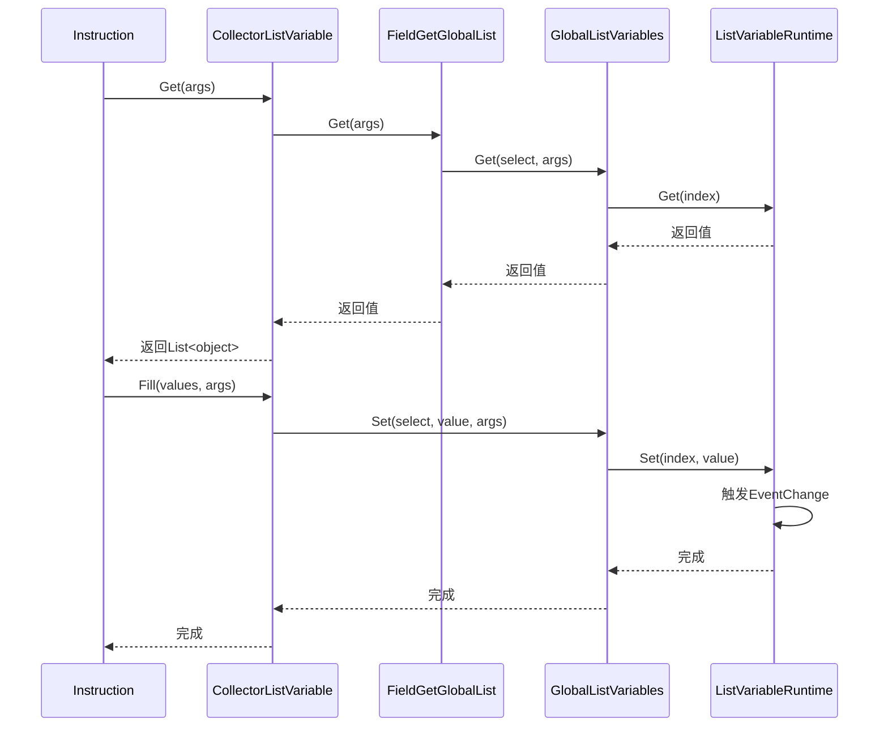

### 2. 属性系统交互

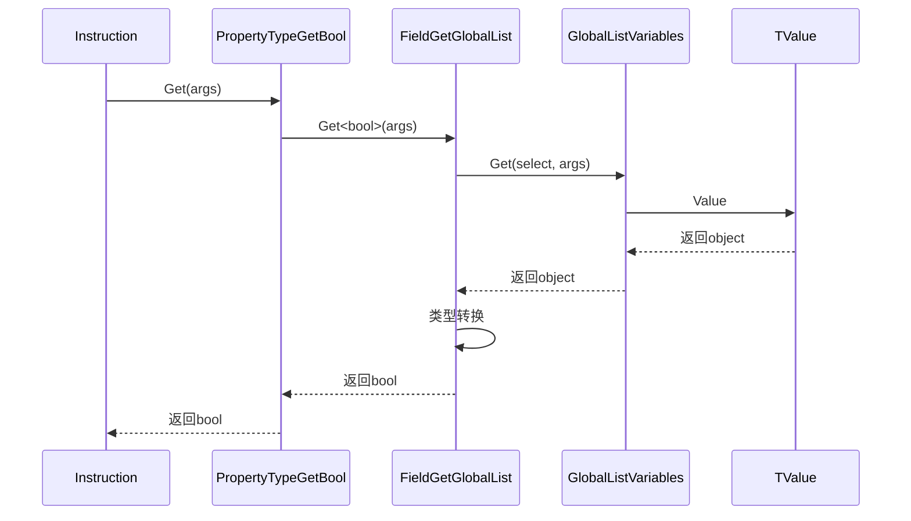

## 数据流图

### 1. 变量系统数据流

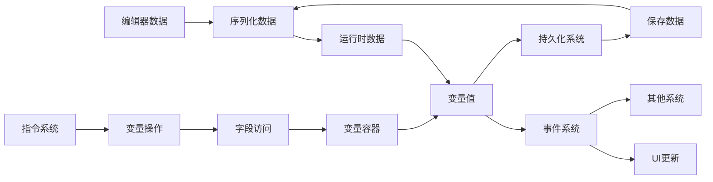

### 2. 类型系统数据流

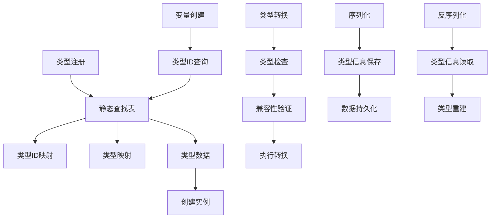

## 组件关系图

### 1. 系统整体架构

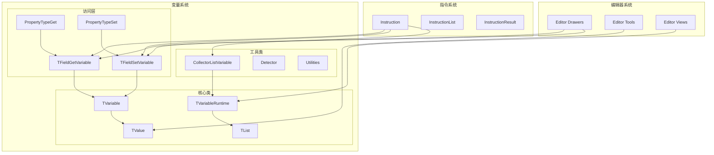

### 2. 变量类型层次

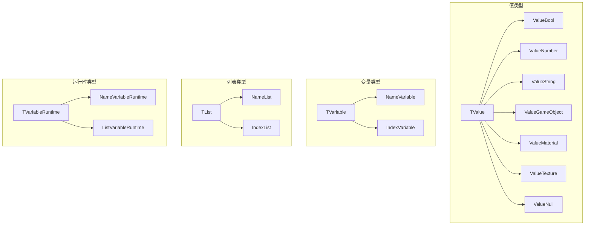

## 总结

通过以上图表，我们可以清晰地看到Game Creator 2变量系统的以下特点：

1. **层次化设计**: 系统采用清晰的层次结构，从抽象基类到具体实现，职责分离明确
2. **多态性支持**: 通过抽象类和接口实现多态性，支持多种变量类型和访问模式
3. **事件驱动**: 使用事件系统实现响应式更新，保持系统各组件的松耦合
4. **类型安全**: 通过泛型和类型检查确保类型安全，避免运行时错误
5. **扩展性**: 通过工厂模式和策略模式支持系统扩展，便于添加新功能

这些设计使得变量系统既强大又灵活，能够满足游戏开发中的各种需求，同时保持代码的清晰性和可维护性。