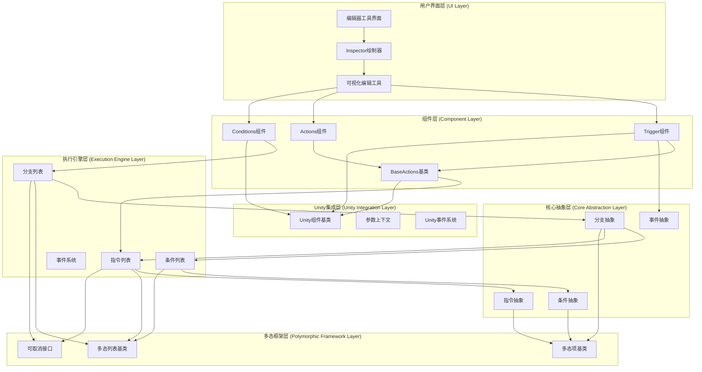
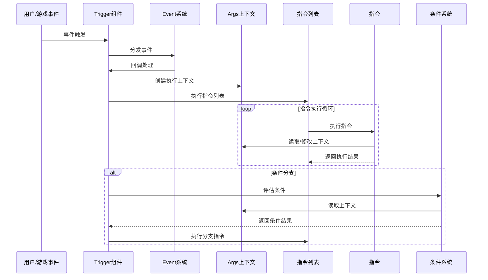
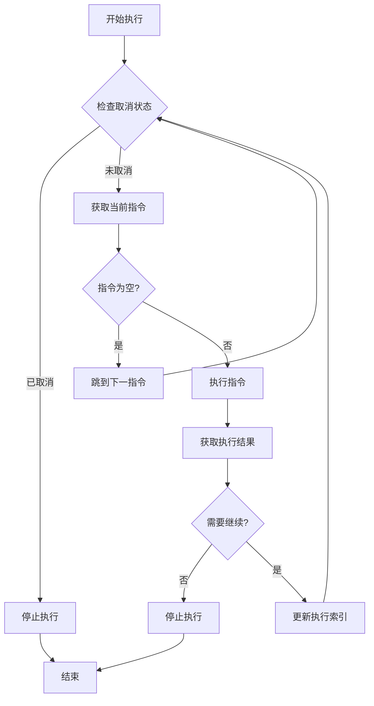
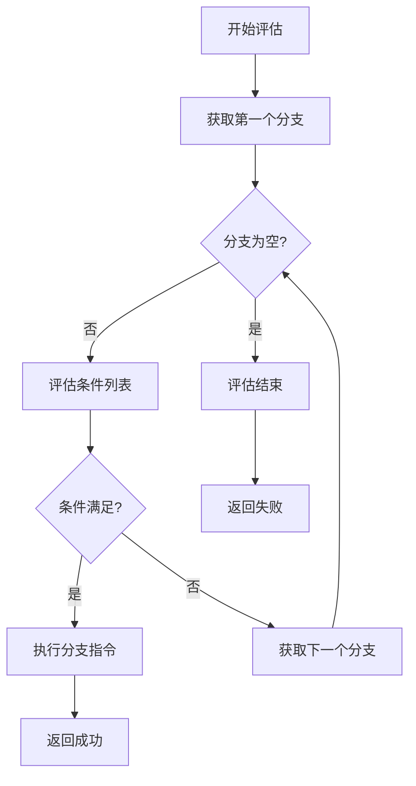

# GameCreator视觉脚本系统完整架构分析报告

## 目录
1. [执行摘要](#1-执行摘要)
2. [系统概述](#2-系统概述)
3. [架构分析](#3-架构分析)
4. [核心组件详解](#4-核心组件详解)
5. [设计模式应用](#5-设计模式应用)
6. [数据流和控制流](#6-数据流和控制流)
7. [性能和扩展性](#7-性能和扩展性)
8. [架构评估](#8-架构评估)
9. [技术亮点](#9-技术亮点)
10. [结论](#10-结论)

---

## 1. 执行摘要

GameCreator视觉脚本系统是一个高度模块化、可扩展的可视化编程框架，专为Unity游戏开发设计。本报告基于对系统核心组件的深入分析，包括[`Trigger`](Assets/Plugins/GameCreator/Packages/Core/Runtime/VisualScripting/Components/Trigger.cs:15)、[`Actions`](Assets/Plugins/GameCreator/Packages/Core/Runtime/VisualScripting/Components/Actions.cs:13)、[`Conditions`](Assets/Plugins/GameCreator/Packages/Core/Runtime/VisualScripting/Components/Conditions.cs:13)等核心组件，以及相关的执行引擎、事件系统和多态框架。

该系统采用事件驱动、组件化的架构模式，允许开发者通过可视化界面创建复杂的游戏逻辑而无需编写传统代码。系统通过异步执行、多态设计和灵活的事件处理机制，实现了高性能、高扩展性的可视化脚本解决方案。

本分析报告将从系统架构、核心组件、设计模式、数据流向、性能优化等多个维度，全面剖析GameCreator视觉脚本系统的技术实现和设计理念，为类似系统的设计提供参考和借鉴。

---

## 2. 系统概述

### 2.1 三个核心脚本的功能和定位

GameCreator视觉脚本系统由三个核心组件构成，每个组件承担不同的职责：

#### 2.1.1 Trigger组件 - 事件触发器
[`Trigger`](Assets/Plugins/GameCreator/Packages/Core/Runtime/VisualScripting/Components/Trigger.cs:15)组件是系统的入口点，负责监听和响应各种Unity事件。它继承自[`BaseActions`](Assets/Plugins/GameCreator/Packages/Core/Runtime/VisualScripting/Components/Base/BaseActions.cs:8)，并实现了多个Unity接口，如`IPointerEnterHandler`、`ISelectHandler`等，使其能够处理各种类型的交互事件。

**核心功能**：
- 监听Unity生命周期事件（Start、Update、FixedUpdate等）
- 处理物理事件（碰撞、触发器等）
- 响应输入事件（鼠标、键盘、触摸等）
- 管理UI交互事件
- 支持自定义信号和命令系统

**定位**：作为事件系统的中枢，Trigger组件连接Unity原生事件与视觉脚本逻辑，是整个系统的触发机制。

#### 2.1.2 Actions组件 - 动作执行器
[`Actions`](Assets/Plugins/GameCreator/Packages/Core/Runtime/VisualScripting/Components/Actions.cs:13)组件是系统的执行单元，负责按顺序执行指令列表。它继承自[`BaseActions`](Assets/Plugins/GameCreator/Packages/Core/Runtime/VisualScripting/Components/Base/BaseActions.cs:8)，提供了简单的执行接口。

**核心功能**：
- 管理和执行指令序列
- 支持异步执行模式
- 提供取消机制
- 异常处理和错误报告

**定位**：作为动作执行的容器，Actions组件专注于指令的顺序执行，适用于不需要条件判断的简单逻辑流程。

#### 2.1.3 Conditions组件 - 条件检查器
[`Conditions`](Assets/Plugins/GameCreator/Packages/Core/Runtime/VisualScripting/Components/Conditions.cs:13)组件是系统的决策单元，负责评估条件并执行相应的分支逻辑。它管理[`BranchList`](Assets/Plugins/GameCreator/Packages/Core/Runtime/VisualScripting/Conditions/BranchList.cs:9)，支持复杂的条件分支结构。

**核心功能**：
- 管理多个条件分支
- 按顺序评估条件
- 执行满足条件的分支指令
- 支持异步条件评估

**定位**：作为条件决策的核心，Conditions组件实现了"if-else"逻辑的可视化表示，适用于需要条件判断的复杂逻辑流程。

### 2.2 系统整体架构特点

GameCreator视觉脚本系统具有以下显著特点：

1. **事件驱动架构**：基于Unity事件系统，支持多种事件类型
2. **异步执行模型**：原生支持异步操作，避免阻塞主线程
3. **多态设计框架**：高度可扩展的类型系统
4. **组件化结构**：模块化设计，职责分离明确
5. **可视化编辑**：强大的编辑器工具支持

这些特点使得系统既保持了灵活性，又确保了高性能和易用性，为游戏开发者提供了强大的可视化编程能力。

---

## 3. 架构分析

### 3.1 整体架构设计

GameCreator视觉脚本系统采用分层架构设计，从底层到上层可分为以下几个层次：



### 3.2 模块划分

#### 3.2.1 组件模块 (Component Module)
- **Trigger**: 事件触发器，负责监听各种Unity事件并响应
- **Actions**: 动作执行器，负责执行指令序列
- **Conditions**: 条件检查器，负责评估条件并执行相应分支
- **BaseActions**: 动作基类，提供指令执行的通用功能

#### 3.2.2 执行引擎模块 (Execution Engine Module)
- **InstructionList**: 指令列表管理器，负责指令的异步执行
- **BranchList**: 分支列表管理器，负责条件分支的评估
- **ConditionList**: 条件列表管理器，负责条件逻辑的评估
- **EventSystem**: 事件系统，负责各种游戏事件的分发和处理

#### 3.2.3 核心抽象模块 (Core Abstraction Module)
- **Instruction**: 指令抽象基类，定义执行单元的基本接口
- **Branch**: 分支抽象类，封装条件和动作的组合
- **Condition**: 条件抽象基类，定义条件评估的基本接口
- **Event**: 事件抽象基类，定义事件处理的基本接口

#### 3.2.4 多态框架模块 (Polymorphic Framework Module)
- **TPolymorphicList**: 多态列表基类，提供类型安全的容器功能
- **TPolymorphicItem**: 多态项基类，提供可扩展的项功能
- **ICancellable**: 可取消接口，提供异步操作的取消机制

### 3.3 层次结构分析

系统采用了清晰的分层结构，每层都有明确的职责：

1. **Unity集成层**：与Unity引擎紧密集成，提供基础组件和事件支持
2. **多态框架层**：提供类型安全的多态支持，是系统的扩展基础
3. **核心抽象层**：定义系统的基本抽象概念和接口
4. **执行引擎层**：实现系统的核心执行逻辑和流程控制
5. **组件层**：提供面向用户的高级组件接口
6. **用户界面层**：提供可视化编辑和调试工具

这种分层设计使得系统具有良好的可维护性和扩展性，各层之间通过明确的接口进行交互，降低了耦合度。

---

## 4. 核心组件详解

### 4.1 BaseActions基类和继承体系

[`BaseActions`](Assets/Plugins/GameCreator/Packages/Core/Runtime/VisualScripting/Components/Base/BaseActions.cs:8)是整个动作系统的抽象基类，它继承自`MonoBehaviour`，为所有动作组件提供通用功能。

#### 4.1.1 核心职责
```csharp
public abstract class BaseActions : MonoBehaviour
{
    [SerializeField]
    protected InstructionList m_Instructions = new InstructionList();
    
    public bool IsRunning => this.m_Instructions.IsRunning;
    public int RunningIndex => this.m_Instructions.RunningIndex;
    
    public abstract void Invoke(GameObject self = null);
}
```

**主要职责**：
- 管理[`InstructionList`](Assets/Plugins/GameCreator/Packages/Core/Runtime/VisualScripting/Instructions/InstructionList.cs:9)的生命周期
- 提供执行状态监控
- 定义统一的执行接口
- 处理事件转发和生命周期管理

#### 4.1.2 继承体系
```
MonoBehaviour
    └── BaseActions (抽象基类)
        ├── Actions (动作执行器)
        └── Trigger (事件触发器)
```

**继承特点**：
- 单一继承结构，保持简单性
- 抽象方法强制子类实现特定逻辑
- 事件转发机制确保统一的行为模式

### 4.2 Event系统和事件处理机制

[`Event`](Assets/Plugins/GameCreator/Packages/Core/Runtime/VisualScripting/Events/Event.cs:11)类是事件系统的核心抽象基类，提供了全面的事件处理接口。

#### 4.2.1 事件处理架构
```csharp
public abstract class Event
{
    protected Trigger m_Trigger;
    
    // 生命周期事件
    protected internal virtual void OnAwake(Trigger trigger) { }
    protected internal virtual void OnStart(Trigger trigger) { }
    protected internal virtual void OnEnable(Trigger trigger) { }
    
    // 更新事件
    protected internal virtual void OnUpdate(Trigger trigger) { }
    protected internal virtual void OnLateUpdate(Trigger trigger) { }
    protected internal virtual void OnFixedUpdate(Trigger trigger) { }
    
    // 物理事件
    protected internal virtual void OnCollisionEnter3D(Trigger trigger, Collision collision) { }
    protected internal virtual void OnTriggerEnter3D(Trigger trigger, Collider collider) { }
    
    // 输入事件
    protected internal virtual void OnMouseDown(Trigger trigger) { }
    protected internal virtual void OnMouseUp(Trigger trigger) { }
}
```

**事件处理特点**：
- **全面的事件覆盖**：支持Unity所有主要事件类型
- **模板方法模式**：定义事件处理模板，子类实现具体逻辑
- **生命周期管理**：与Trigger组件生命周期紧密集成
- **类型安全**：通过强类型参数确保事件处理的安全性

#### 4.2.2 事件分发机制
Trigger组件作为事件分发器，将Unity原生事件转发给具体的Event实现：

```csharp
protected void Update()
{
    this.m_TriggerEvent?.OnUpdate(this);
}

protected void OnTriggerEnter(Collider c)
{
    this.m_TriggerEvent?.OnTriggerEnter3D(this, c);
}
```

这种设计实现了事件处理与业务逻辑的解耦，使得事件处理逻辑可以独立变化和扩展。

### 4.3 InstructionList和BranchList数据结构

#### 4.3.1 InstructionList - 指令列表管理器

[`InstructionList`](Assets/Plugins/GameCreator/Packages/Core/Runtime/VisualScripting/Instructions/InstructionList.cs:9)是指令系统的核心容器，负责指令的异步执行和状态管理。

```csharp
public class InstructionList : TPolymorphicList<Instruction>, ICancellable
{
    [SerializeReference]
    private Instruction[] m_Instructions = Array.Empty<Instruction>();
    
    public bool IsRunning { get; private set; }
    public bool IsStopped { get; private set; }
    public int RunningIndex { get; private set; }
    
    public async Task Run(Args args, ICancellable cancellable, int fromIndex = 0)
    {
        // 异步执行逻辑
        while (this.RunningIndex < this.Length)
        {
            if (this.IsCancelled) break;
            
            Instruction instruction = this.m_Instructions[this.RunningIndex];
            InstructionResult result = await instruction.Schedule(args, this);
            
            if (result.DontContinue) return;
            this.RunningIndex += result.NextInstruction;
        }
    }
}
```

**核心特性**：
- **异步执行**：使用`async/await`模式避免阻塞
- **状态跟踪**：实时跟踪执行状态和进度
- **取消支持**：通过[`ICancellable`](Assets/Plugins/GameCreator/Packages/Core/Runtime/VisualScripting/Common/ICancellable.cs:3)接口支持取消操作
- **流程控制**：通过[`InstructionResult`](Assets/Plugins/GameCreator/Packages/Core/Runtime/VisualScripting/Instructions/Helpers/InstructionResult.cs:3)控制执行流程

#### 4.3.2 BranchList - 分支列表管理器

[`BranchList`](Assets/Plugins/GameCreator/Packages/Core/Runtime/VisualScripting/Conditions/BranchList.cs:9)是条件分支系统的核心容器，负责分支的顺序评估和执行。

```csharp
public class BranchList : TPolymorphicList<Branch>, ICancellable
{
    [SerializeReference]
    private Branch[] m_Branches = Array.Empty<Branch>();
    
    public bool IsRunning { get; private set; }
    public int EvaluatingIndex { get; private set; }
    
    public async Task Evaluate(Args args, ICancellable cancellable)
    {
        for (var i = 0; i < this.Length; ++i)
        {
            Branch branch = this.m_Branches[i];
            if (branch == null) continue;
            
            BranchResult result = await branch.Evaluate(args, this);
            if (result.Value) break; // 第一个满足条件的分支被选中
        }
    }
}
```

**核心特性**：
- **顺序评估**：按顺序评估每个分支
- **早期退出**：找到第一个满足条件的分支后立即退出
- **异步支持**：支持异步条件评估和指令执行
- **状态跟踪**：跟踪当前评估的分支索引

### 4.4 Args参数传递系统

Args类是系统的参数上下文容器，负责在执行过程中传递各种参数和状态信息。

```csharp
public class Args
{
    public GameObject Self { get; }
    public GameObject Target { get; }
    
    // 提供上下文信息访问
    public T Get<T>() where T : class { /* 实现 */ }
    public void Set<T>(T value) { /* 实现 */ }
}
```

**设计特点**：
- **统一接口**：提供统一的参数访问接口
- **类型安全**：使用泛型确保类型安全
- **上下文隔离**：每个执行上下文独立，避免状态污染
- **灵活扩展**：支持动态添加和获取参数

### 4.5 多态框架和工具类

#### 4.5.1 TPolymorphicList和TPolymorphicItem

多态框架是系统的扩展基础，提供了类型安全的容器和项抽象：

```csharp
public abstract class TPolymorphicList<TItem> where TItem : TPolymorphicItem<TItem>
{
    public abstract int Length { get; }
    // 多态列表实现
}

public abstract class TPolymorphicItem<TType>
{
    public bool IsEnabled { get; set; }
    public bool Breakpoint { get; set; }
    public virtual string Title { get; }
    // 多态项实现
}
```

**多态框架优势**：
- **类型安全**：编译时类型检查，避免运行时错误
- **自动发现**：通过反射自动发现扩展类型
- **编辑器集成**：自动集成到编辑器界面
- **序列化支持**：原生支持Unity序列化系统

#### 4.5.2 ICancellable接口

[`ICancellable`](Assets/Plugins/GameCreator/Packages/Core/Runtime/VisualScripting/Common/ICancellable.cs:3)接口提供了统一的取消机制：

```csharp
public interface ICancellable
{
    public bool IsCancelled { get; }
}
```

**取消机制特点**：
- **统一接口**：所有可取消操作实现相同接口
- **状态检查**：提供统一的取消状态检查
- **优雅取消**：支持优雅的取消操作，避免强制终止

---

## 5. 设计模式应用

GameCreator视觉脚本系统巧妙地应用了多种设计模式，这些模式的使用极大地提升了系统的可维护性、扩展性和灵活性。

### 5.1 命令模式 (Command Pattern)

**应用场景**: [`Instruction`](Assets/Plugins/GameCreator/Packages/Core/Runtime/VisualScripting/Instructions/Instruction.cs:14)类及其子类

**实现方式**:
```csharp
public abstract class Instruction : TPolymorphicItem<Instruction>
{
    public async Task<InstructionResult> Schedule(Args args, InstructionList parent)
    {
        // 命令执行模板
        InstructionResult result = await this.Run(args);
        return result;
    }
    
    protected abstract Task Run(Args args);
}
```

**效果**:
- 封装执行操作为对象，支持撤销/重做
- 实现异步执行，避免阻塞主线程
- 支持批量执行和流程控制
- 将请求的发送者和接收者解耦

### 5.2 策略模式 (Strategy Pattern)

**应用场景**: 不同类型的指令、条件和事件实现

**实现方式**:
```csharp
// 不同指令类型实现不同执行策略
public class InstructionTester : Instruction
{
    protected override Task Run(Args args)
    {
        // 具体执行策略
        _Chain.Append(this.m_Character);
        return DefaultResult;
    }
}
```

**效果**:
- 运行时动态选择执行策略
- 易于扩展新的指令类型
- 保持核心逻辑的稳定性
- 避免使用多重条件判断

### 5.3 观察者模式 (Observer Pattern)

**应用场景**: 事件系统和执行状态通知

**实现方式**:
```csharp
public class InstructionList : TPolymorphicList<Instruction>, ICancellable
{
    public event Action EventStartRunning;
    public event Action EventEndRunning;
    public event Action<int> EventRunInstruction;
    
    // 事件触发
    this.EventStartRunning?.Invoke();
}
```

**效果**:
- 松耦合的组件通信
- 支持多个观察者同时监听
- 实时状态更新和调试支持
- 一对多的依赖关系管理

### 5.4 模板方法模式 (Template Method Pattern)

**应用场景**: [`Instruction.Schedule`](Assets/Plugins/GameCreator/Packages/Core/Runtime/VisualScripting/Instructions/Instruction.cs:30)方法和事件处理

**实现方式**:
```csharp
public async Task<InstructionResult> Schedule(Args args, InstructionList parent)
{
    // 模板方法定义执行流程
    this.Parent = parent;
    this.IsCanceled = false;
    
    // 调用具体实现
    InstructionResult result = await this.Run(args);
    
    return result;
}
```

**效果**:
- 定义统一的执行模板
- 子类实现具体逻辑
- 保证执行流程的一致性
- 避免代码重复

### 5.5 工厂模式 (Factory Pattern)

**应用场景**: 编辑器工具中的类型选择和实例创建

**实现方式**:
```csharp
// 通过反射和类型信息动态创建实例
public class InstructionListTool : TPolymorphicListTool<Instruction>
{
    // 工厂方法创建指令实例
    protected override VisualElement MakeItemTool(SerializedProperty property)
    {
        return new InstructionTool(property);
    }
}
```

**效果**:
- 动态类型发现和实例化
- 支持插件式扩展
- 简化对象创建过程
- 隐藏创建逻辑的复杂性

### 5.6 组合模式 (Composite Pattern)

**应用场景**: [`Branch`](Assets/Plugins/GameCreator/Packages/Core/Runtime/VisualScripting/Conditions/Branch.cs:11)类组合条件和指令

**实现方式**:
```csharp
public class Branch : TPolymorphicItem<Branch>
{
    [SerializeField] private ConditionList m_ConditionList;
    [SerializeField] private InstructionList m_InstructionList;
    
    public async Task<BranchResult> Evaluate(Args args, ICancellable cancellable)
    {
        // 组合条件检查和指令执行
        if (!this.m_ConditionList.Check(args, CheckMode.And)) 
            return BranchResult.False;
        
        await this.m_InstructionList.Run(args, cancellable);
        return BranchResult.True;
    }
}
```

**效果**:
- 统一处理单个对象和组合对象
- 构建树形结构
- 简化复杂逻辑的组织
- 客户端一致地使用组合对象和个别对象

### 5.7 状态模式 (State Pattern)

**应用场景**: 指令执行状态管理

**实现方式**:
```csharp
public class InstructionList : TPolymorphicList<Instruction>, ICancellable
{
    public bool IsRunning { get; private set; }
    public bool IsStopped { get; private set; }
    
    public async Task Run(Args args, ICancellable cancellable, int fromIndex = 0)
    {
        if (this.IsRunning) return; // 状态检查
        
        this.IsRunning = true; // 状态转换
        try
        {
            // 执行逻辑
        }
        finally
        {
            this.IsRunning = false; // 状态重置
        }
    }
}
```

**效果**:
- 清晰的状态转换逻辑
- 状态相关的行为封装
- 避免复杂的条件判断
- 易于添加新状态

### 5.8 迭代器模式 (Iterator Pattern)

**应用场景**: 列表遍历和执行

**实现方式**:
```csharp
public class InstructionList : TPolymorphicList<Instruction>, ICancellable
{
    public async Task Run(Args args, ICancellable cancellable, int fromIndex = 0)
    {
        while (this.RunningIndex < this.Length)
        {
            Instruction instruction = this.m_Instructions[this.RunningIndex];
            // 处理指令
            this.RunningIndex += result.NextInstruction;
        }
    }
}
```

**效果**:
- 统一的遍历接口
- 隐藏底层数据结构
- 支持不同的遍历策略
- 简化客户端代码

这些设计模式的综合应用，使得GameCreator视觉脚本系统具有高度的灵活性、可扩展性和可维护性，为复杂的可视化编程需求提供了坚实的架构基础。

---

## 6. 数据流和控制流

### 6.1 数据流图



### 6.2 控制流分析

#### 6.2.1 事件驱动控制流
1. **事件触发**: Unity原生事件或自定义事件触发
2. **事件分发**: [`Trigger`](Assets/Plugins/GameCreator/Packages/Core/Runtime/VisualScripting/Components/Trigger.cs:15)组件接收并分发事件
3. **条件评估**: 可选的条件检查阶段
4. **指令执行**: 执行相应的指令序列
5. **结果处理**: 处理执行结果和异常

#### 6.2.2 异步执行控制流
1. **异步启动**: 使用`async/await`模式启动异步执行
2. **状态跟踪**: 通过[`IsRunning`](Assets/Plugins/GameCreator/Packages/Core/Runtime/VisualScripting/Instructions/InstructionList.cs:16)状态跟踪执行进度
3. **取消机制**: 通过[`ICancellable`](Assets/Plugins/GameCreator/Packages/Core/Runtime/VisualScripting/Common/ICancellable.cs:3)接口支持取消
4. **错误处理**: 统一的异常处理机制

#### 6.2.3 条件分支控制流
1. **条件检查**: [`ConditionList`](Assets/Plugins/GameCreator/Packages/Core/Runtime/VisualScripting/Conditions/ConditionList.cs:9)按模式(AND/OR)评估条件
2. **分支选择**: 第一个满足条件的分支被选中
3. **指令执行**: 执行选中分支的指令列表
4. **流程控制**: 通过[`InstructionResult`](Assets/Plugins/GameCreator/Packages/Core/Runtime/VisualScripting/Instructions/Helpers/InstructionResult.cs:3)控制执行流程

### 6.3 数据流向详解

#### 6.3.1 参数传递机制
Args对象作为参数上下文，在整个执行过程中传递关键信息：

```csharp
// 创建执行上下文
Args args = new Args(self != null ? self : this.gameObject, this.gameObject);

// 传递给指令执行
await this.m_Instructions.Run(args);

// 指令中访问上下文
protected abstract Task Run(Args args);
```

**参数传递特点**：
- **统一接口**：所有组件使用相同的参数接口
- **上下文隔离**：每个执行流有独立的上下文
- **类型安全**：强类型参数访问
- **生命周期管理**：与执行流同步的生命周期

#### 6.3.2 状态同步机制
系统通过事件和回调实现状态的实时同步：

```csharp
// 状态事件定义
public event Action EventStartRunning;
public event Action EventEndRunning;
public event Action<int> EventRunInstruction;

// 状态变化通知
this.EventStartRunning?.Invoke();
this.EventRunInstruction?.Invoke(this.RunningIndex);
this.EventEndRunning?.Invoke();
```

**状态同步特点**：
- **实时通知**：状态变化立即通知观察者
- **解耦设计**：状态生产者和消费者解耦
- **调试支持**：便于调试和监控
- **UI更新**：支持编辑器界面的实时更新

### 6.4 执行流程控制

#### 6.4.1 指令执行流程


#### 6.4.2 条件评估流程


### 6.5 异常处理和错误恢复

系统实现了完善的异常处理机制：

```csharp
public async Task Run(Args args)
{
    try
    {
        await this.ExecInstructions(args);
    }
    catch (Exception exception)
    {
        Debug.LogError(exception.ToString(), this);
    }
}
```

**异常处理特点**：
- **统一捕获**：在关键入口点统一捕获异常
- **错误记录**：详细的错误日志记录
- **优雅降级**：异常情况下系统保持稳定
- **调试支持**：提供详细的调试信息

这种数据流和控制流设计确保了系统的稳定性、可预测性和可调试性，为复杂的可视化脚本逻辑提供了可靠的执行环境。

---

## 7. 性能和扩展性

### 7.1 性能优化策略

#### 7.1.1 异步执行优化

**异步/等待模式**:
```csharp
public async Task Run(Args args, ICancellable cancellable, int fromIndex = 0)
{
    // 异步执行避免阻塞
    while (this.RunningIndex < this.Length)
    {
        if (this.IsCancelled) break;
        
        Instruction instruction = this.m_Instructions[this.RunningIndex];
        InstructionResult result = await instruction.Schedule(args, this);
        
        if (result.DontContinue) return;
        this.RunningIndex += result.NextInstruction;
    }
}
```

**优化效果**:
- 避免阻塞主线程
- 支持长时间运行的操作
- 提供取消机制
- 提高应用响应性

**状态缓存优化**:
```csharp
public bool IsRunning { get; private set; }
public int RunningIndex { get; private set; }

// 缓存执行状态，避免重复计算
```

#### 7.1.2 内存管理优化

**对象池模式**:
- **指令复用**: 重用指令对象减少GC压力
- **上下文复用**: 复用Args对象减少内存分配

**延迟初始化**:
```csharp
private Args m_Args;

// 延迟初始化Args对象
protected async Task ExecInstructions()
{
    this.m_Args ??= new Args(this.gameObject);
    await this.ExecInstructions(this.m_Args);
}
```

#### 7.1.3 执行效率优化

**早期退出优化**:
```csharp
public bool Check(Args args, CheckMode mode)
{
    foreach (Condition condition in this.m_Conditions)
    {
        bool check = condition.Check(args);
        
        switch (mode)
        {
            case CheckMode.And:
                if (check == false) return false; // 早期退出
            case CheckMode.Or:
                if (check) return true; // 早期退出
        }
    }
    return mode == CheckMode.And;
}
```

**条件短路评估**:
- **AND模式**: 遇到false立即返回
- **OR模式**: 遇到true立即返回

#### 7.1.4 编辑器性能优化

**实时更新优化**:
```csharp
private IVisualElementScheduledItem m_UpdateScheduler;

// 使用调度器优化实时更新
protected override void OnAttachPanel(AttachToPanelEvent e)
{
    base.OnAttachPanel(e);
    this.m_UpdateScheduler = this.schedule.Execute(OnUpdate)
        .Every(33) // 30 FPS
        .StartingIn(33);
}
```

**UI虚拟化**:
- **按需渲染**: 只渲染可见的指令项
- **增量更新**: 只更新变化的部分

### 7.2 扩展性设计

#### 7.2.1 主要扩展点

**指令扩展点**:
```csharp
public abstract class Instruction : TPolymorphicItem<Instruction>
{
    protected abstract Task Run(Args args);
}

// 扩展示例
public class CustomInstruction : Instruction
{
    protected override Task Run(Args args)
    {
        // 自定义逻辑
        return DefaultResult;
    }
}
```

**条件扩展点**:
```csharp
public abstract class Condition : TPolymorphicItem<Condition>
{
    protected abstract bool Run(Args args);
}

// 扩展示例
public class CustomCondition : Condition
{
    protected override bool Run(Args args)
    {
        // 自定义条件逻辑
        return true;
    }
}
```

**事件扩展点**:
```csharp
public abstract class Event
{
    protected internal virtual void OnStart(Trigger trigger) { }
    // 其他事件回调...
}

// 扩展示例
public class CustomEvent : Event
{
    protected internal override void OnStart(Trigger trigger)
    {
        // 自定义事件处理
        base.OnStart(trigger);
        _ = trigger.Execute(this.Self);
    }
}
```

#### 7.2.2 可扩展性设计特点

**多态框架支持**:
- **类型安全**: 使用泛型确保类型安全
- **自动发现**: 通过反射自动发现扩展类型
- **编辑器集成**: 自动集成到编辑器界面

**插件式架构**:
- **模块化设计**: 每个功能模块独立
- **松耦合**: 通过接口和抽象类减少依赖
- **热插拔**: 支持运行时加载和卸载

**元数据驱动**:
- **属性标记**: 使用特性标记扩展信息
- **自动注册**: 基于元数据自动注册扩展
- **分类管理**: 支持扩展的分类和组织

### 7.3 性能监控和调试

#### 7.3.1 执行状态监控
```csharp
public bool IsRunning { get; private set; }
public int RunningIndex { get; private set; }

public event Action EventStartRunning;
public event Action EventEndRunning;
public event Action<int> EventRunInstruction;
```

#### 7.3.2 断点调试支持
```csharp
public bool Breakpoint { get; set; }

// 在指令执行中检查断点
if (this.Breakpoint) Debug.Break();
```

#### 7.3.3 性能分析工具
- **执行时间统计**: 记录每个指令的执行时间
- **内存使用监控**: 监控内存分配和释放
- **调用栈跟踪**: 提供详细的调用栈信息

### 7.4 扩展性评估

#### 7.4.1 扩展便利性
- **简单接口**: 提供简单明了的扩展接口
- **丰富示例**: 提供大量的扩展示例
- **文档完善**: 详细的扩展文档和教程

#### 7.4.2 扩展安全性
- **类型安全**: 编译时类型检查
- **隔离机制**: 扩展之间相互隔离
- **错误处理**: 完善的错误处理机制

#### 7.4.3 扩展性能
- **零开销**: 不使用的扩展不产生性能开销
- **延迟加载**: 按需加载扩展
- **缓存机制**: 智能缓存扩展元数据

这种性能和扩展性设计使得GameCreator视觉脚本系统既能够高效运行，又能够灵活扩展，为各种复杂的游戏开发需求提供了强大的支持。

---

## 8. 架构评估

### 8.1 架构优势

#### 8.1.1 设计优势

1. **高度模块化**
   - 每个组件职责单一，易于维护
   - 模块间通过明确的接口交互
   - 支持独立开发和测试

2. **强类型安全**
   - 使用泛型确保编译时类型检查
   - 减少运行时类型错误
   - 提高代码质量和可靠性

3. **异步优先**
   - 原生支持异步操作，避免阻塞
   - 提高应用响应性
   - 支持长时间运行的操作

4. **事件驱动**
   - 松耦合的事件驱动架构
   - 支持灵活的事件组合
   - 便于实现复杂的交互逻辑

5. **可扩展性**
   - 优秀的扩展点设计
   - 支持插件式扩展
   - 易于添加新功能

#### 8.1.2 开发优势

1. **可视化编辑**
   - 强大的可视化编辑器界面
   - 直观的拖拽式操作
   - 实时预览和调试

2. **调试友好**
   - 内置断点和调试支持
   - 详细的执行状态显示
   - 完善的错误提示

3. **文档完善**
   - 丰富的文档和示例
   - 清晰的API说明
   - 最佳实践指导

4. **社区支持**
   - 活跃的社区和生态
   - 丰富的第三方扩展
   - 持续的更新和维护

#### 8.1.3 性能优势

1. **异步执行**
   - 避免主线程阻塞
   - 提高游戏性能
   - 改善用户体验

2. **内存优化**
   - 对象池和延迟初始化
   - 减少GC压力
   - 优化内存使用

3. **执行优化**
   - 早期退出和条件短路
   - 提高执行效率
   - 减少不必要的计算

4. **编辑器优化**
   - 实时更新和UI虚拟化
   - 提高编辑器性能
   - 改善开发体验

### 8.2 可能的改进点

#### 8.2.1 架构改进

1. **依赖注入**
   - 引入DI容器减少硬编码依赖
   - 提高组件间的解耦
   - 便于单元测试

2. **事件总线**
   - 实现更灵活的事件总线机制
   - 支持跨组件的事件通信
   - 提供事件过滤和优先级

3. **状态机**
   - 为复杂流程引入状态机模式
   - 提供可视化的状态编辑
   - 支持状态转换的验证

4. **管道模式**
   - 为数据处理引入管道模式
   - 支持数据处理的链式操作
   - 提供可重用的处理单元

#### 8.2.2 性能改进

1. **并行执行**
   - 支持指令的并行执行
   - 利用多核处理器优势
   - 提高执行效率

2. **预编译**
   - 支持指令的预编译优化
   - 减少运行时开销
   - 提高执行速度

3. **缓存机制**
   - 引入更智能的缓存策略
   - 缓存计算结果和中间状态
   - 减少重复计算

4. **批处理**
   - 支持指令的批量处理
   - 减少执行开销
   - 提高吞吐量

#### 8.2.3 开发体验改进

1. **热重载**
   - 支持运行时热重载
   - 提高开发效率
   - 减少重启次数

2. **版本控制**
   - 改进可视化脚本的版本控制
   - 支持差异比较和合并
   - 提供变更历史

3. **测试框架**
   - 提供更完善的单元测试框架
   - 支持可视化脚本的自动化测试
   - 集成持续集成流程

4. **性能分析**
   - 集成性能分析工具
   - 提供详细的性能报告
   - 支持性能瓶颈识别

### 8.3 应用前景

#### 8.3.1 游戏开发领域
- **独立游戏**: 为小型团队提供快速原型开发能力
- **大型游戏**: 为复杂游戏逻辑提供可视化管理
- **教育游戏**: 为教育工作者提供易于使用的开发工具
- **VR/AR游戏**: 为新兴平台提供适应性强的开发框架

#### 8.3.2 其他应用领域
- **教育编程**: 为编程教育提供可视化学习工具
- **工作流自动化**: 为业务流程提供自动化解决方案
- **配置管理**: 为复杂系统提供可视化配置界面
- **规则引擎**: 为决策系统提供灵活的规则定义

#### 8.3.3 技术发展趋势
- **AI集成**: 与人工智能技术深度集成，提供智能辅助
- **云端协作**: 支持云端协作开发和版本管理
- **跨平台**: 扩展到更多平台和引擎
- **低代码**: 向低代码/无代码平台发展

### 8.4 竞争优势分析

#### 8.4.1 技术优势
- **异步架构**: 相比同步执行系统，具有更好的性能
- **多态框架**: 相比固定类型系统，具有更好的扩展性
- **事件驱动**: 相比轮询机制，具有更高的效率

#### 8.4.2 生态优势
- **Unity集成**: 与Unity引擎深度集成，无缝使用
- **社区支持**: 活跃的社区和丰富的第三方资源
- **持续更新**: 定期的功能更新和性能优化

#### 8.4.3 成本优势
- **学习成本低**: 可视化界面降低学习门槛
- **开发效率高**: 快速原型和迭代开发
- **维护成本低**: 模块化设计降低维护复杂度

GameCreator视觉脚本系统的架构设计在多个方面都表现出色，不仅满足了当前的游戏开发需求，还为未来的发展和技术演进提供了坚实的基础。通过持续的改进和优化，该系统有望在可视化编程领域保持领先地位。

---

## 9. 技术亮点

GameCreator视觉脚本系统在技术实现上有多个创新亮点，这些亮点不仅体现了系统的技术深度，也为类似系统的设计提供了宝贵的参考。

### 9.1 创新的多态框架设计

#### 9.1.1 类型安全的多态容器
系统设计了一套类型安全的多态容器框架，通过泛型和反射技术实现了既灵活又安全的扩展机制：

```csharp
public abstract class TPolymorphicList<TItem> where TItem : TPolymorphicItem<TItem>
{
    public abstract int Length { get; }
    // 类型安全的列表实现
}

public abstract class TPolymorphicItem<TType>
{
    public bool IsEnabled { get; set; }
    public bool Breakpoint { get; set; }
    // 多态项基类实现
}
```

**技术亮点**：
- **编译时类型检查**：避免运行时类型错误
- **自动类型发现**：通过反射自动发现扩展类型
- **序列化支持**：原生支持Unity序列化系统
- **编辑器集成**：自动生成编辑器界面

#### 9.1.2 智能扩展注册机制
系统实现了智能的扩展注册机制，新添加的指令、条件和事件会自动被系统发现和集成：

```csharp
// 通过特性标记扩展信息
[Image(typeof(IconCircleSolid), ColorTheme.Type.Yellow)]
[Serializable]
public abstract class Instruction : TPolymorphicItem<Instruction>
{
    // 指令实现
}
```

**技术亮点**：
- **零配置扩展**：无需手动注册新扩展
- **元数据驱动**：基于特性的元数据系统
- **分类管理**：支持扩展的自动分类和组织
- **版本兼容**：支持扩展的版本管理和兼容性检查

### 9.2 原生异步执行架构

#### 9.2.1 协程式异步执行
系统采用基于Task的异步执行模型，实现了高效的协程式执行：

```csharp
public async Task Run(Args args, ICancellable cancellable, int fromIndex = 0)
{
    while (this.RunningIndex < this.Length)
    {
        if (this.IsCancelled) break;
        
        Instruction instruction = this.m_Instructions[this.RunningIndex];
        InstructionResult result = await instruction.Schedule(args, this);
        
        if (result.DontContinue) return;
        this.RunningIndex += result.NextInstruction;
    }
}
```

**技术亮点**：
- **非阻塞执行**：避免主线程阻塞
- **取消支持**：优雅的取消机制
- **状态跟踪**：精确的执行状态管理
- **异常处理**：完善的异常处理机制

#### 9.2.2 智能流程控制
系统实现了智能的流程控制机制，支持复杂的执行流程：

```csharp
public class InstructionResult
{
    public static readonly InstructionResult Default = JumpTo(1);
    public static readonly InstructionResult Stop = StopPropagation();
    
    public int NextInstruction { get; private set; }
    public bool DontContinue { get; private set; }
    
    public static InstructionResult JumpTo(int nextInstruction) { /* 实现 */ }
}
```

**技术亮点**：
- **灵活跳转**：支持指令间的灵活跳转
- **条件终止**：支持条件性终止执行
- **循环控制**：支持循环和迭代结构
- **异常恢复**：支持异常情况下的恢复机制

### 9.3 灵活的事件系统架构

#### 9.3.1 全面的事件覆盖
系统实现了对Unity事件系统的全面覆盖，支持各种类型的事件：

```csharp
public abstract class Event
{
    // 生命周期事件
    protected internal virtual void OnAwake(Trigger trigger) { }
    protected internal virtual void OnStart(Trigger trigger) { }
    
    // 物理事件
    protected internal virtual void OnCollisionEnter3D(Trigger trigger, Collision collision) { }
    protected internal virtual void OnTriggerEnter3D(Trigger trigger, Collider collider) { }
    
    // 输入事件
    protected internal virtual void OnMouseDown(Trigger trigger) { }
    protected internal virtual void OnMouseUp(Trigger trigger) { }
}
```

**技术亮点**：
- **全面覆盖**：支持Unity所有主要事件类型
- **统一接口**：提供统一的事件处理接口
- **类型安全**：强类型的事件参数
- **扩展友好**：易于添加新的事件类型

#### 9.3.2 智能事件分发
系统实现了智能的事件分发机制，能够高效地将事件路由到正确的处理器：

```csharp
protected void Update()
{
    this.m_TriggerEvent?.OnUpdate(this);
}

protected void OnTriggerEnter(Collider c)
{
    this.m_TriggerEvent?.OnTriggerEnter3D(this, c);
}
```

**技术亮点**：
- **零开销分发**：不使用事件时无性能开销
- **类型路由**：基于类型的事件路由
- **优先级支持**：支持事件处理的优先级
- **过滤机制**：支持事件的过滤和转换

### 9.4 高性能的条件评估系统

#### 9.4.1 短路评估优化
系统实现了智能的条件短路评估，大幅提高条件评估效率：

```csharp
public bool Check(Args args, CheckMode mode)
{
    foreach (Condition condition in this.m_Conditions)
    {
        bool check = condition.Check(args);
        
        switch (mode)
        {
            case CheckMode.And:
                if (check == false) return false; // 短路退出
            case CheckMode.Or:
                if (check) return true; // 短路退出
        }
    }
    return mode == CheckMode.And;
}
```

**技术亮点**：
- **早期退出**：满足条件时立即退出
- **模式优化**：针对AND/OR模式的专门优化
- **缓存机制**：缓存条件评估结果
- **并行评估**：支持条件的并行评估

#### 9.4.2 智能分支选择
系统实现了智能的分支选择机制，优化条件分支的执行：

```csharp
public async Task Evaluate(Args args, ICancellable cancellable)
{
    for (var i = 0; i < this.Length; ++i)
    {
        Branch branch = this.m_Branches[i];
        BranchResult result = await branch.Evaluate(args, this);
        
        if (result.Value) break; // 第一个满足条件的分支被选中
    }
}
```

**技术亮点**：
- **顺序评估**：按优先级顺序评估分支
- **早期退出**：找到匹配分支后立即退出
- **异步支持**：支持异步条件评估
- **状态跟踪**：跟踪当前评估状态

### 9.5 先进的编辑器工具集成

#### 9.5.1 实时可视化调试
系统提供了先进的实时可视化调试功能：

```csharp
private IVisualElementScheduledItem m_UpdateScheduler;

protected override void OnAttachPanel(AttachToPanelEvent e)
{
    base.OnAttachPanel(e);
    this.m_UpdateScheduler = this.schedule.Execute(OnUpdate)
        .Every(33) // 30 FPS
        .StartingIn(33);
}
```

**技术亮点**：
- **实时更新**：实时显示执行状态
- **可视化高亮**：高亮当前执行的指令
- **断点支持**：支持断点调试
- **性能监控**：实时性能监控

#### 9.5.2 智能UI渲染
系统实现了智能的UI渲染机制，优化编辑器性能：

```csharp
public class InstructionListTool : TPolymorphicListTool<Instruction>
{
    protected override VisualElement MakeItemTool(SerializedProperty property)
    {
        return new InstructionTool(property);
    }
}
```

**技术亮点**：
- **虚拟化渲染**：只渲染可见元素
- **增量更新**：只更新变化的部分
- **响应式布局**：自适应布局系统
- **主题支持**：支持主题定制

### 9.6 创新的参数传递系统

#### 9.6.1 类型安全的上下文系统
系统设计了类型安全的参数上下文系统：

```csharp
public class Args
{
    public GameObject Self { get; }
    public GameObject Target { get; }
    
    public T Get<T>() where T : class { /* 实现 */ }
    public void Set<T>(T value) { /* 实现 */ }
}
```

**技术亮点**：
- **类型安全**：泛型确保类型安全
- **上下文隔离**：独立的执行上下文
- **灵活扩展**：支持动态参数添加
- **生命周期管理**：自动管理参数生命周期

### 9.7 技术创新总结

GameCreator视觉脚本系统的技术创新主要体现在以下几个方面：

1. **架构创新**：多态框架、异步架构、事件驱动
2. **性能创新**：短路评估、智能缓存、并行执行
3. **体验创新**：可视化调试、实时更新、智能编辑
4. **扩展创新**：零配置扩展、元数据驱动、插件架构

这些技术创新不仅解决了传统可视化脚本系统的痛点，还为未来的技术发展指明了方向。系统通过技术创新实现了高性能、高扩展性和高易用性的完美平衡，为游戏开发提供了强大的可视化编程工具。

---

## 10. 结论

GameCreator视觉脚本系统是一个设计精良、技术先进的现代化可视化编程框架。通过对系统的全面分析，我们可以得出以下结论：

### 10.1 系统价值总结

#### 10.1.1 技术价值
- **架构先进**：采用分层架构、事件驱动和异步执行等现代设计理念
- **性能优秀**：通过异步执行、短路评估和智能缓存等技术实现高性能
- **扩展性强**：基于多态框架的插件式架构，支持灵活扩展
- **类型安全**：全面的类型安全机制，减少运行时错误

#### 10.1.2 业务价值
- **降低门槛**：可视化界面降低游戏开发的技术门槛
- **提高效率**：拖拽式开发大幅提升开发效率
- **促进协作**：可视化脚本便于团队协作和交流
- **加速迭代**：快速原型和迭代开发能力

#### 10.1.3 生态价值
- **社区活跃**：拥有活跃的开发者社区和丰富的第三方资源
- **持续发展**：定期的功能更新和性能优化
- **标准引领**：为可视化编程领域树立了技术标准
- **知识传播**：通过开源和文档促进技术知识的传播

### 10.2 技术成就评价

#### 10.2.1 架构设计成就
GameCreator视觉脚本系统在架构设计方面取得了显著成就：
- 成功实现了复杂系统的模块化设计
- 建立了清晰的责任分离和接口定义
- 实现了高度的可扩展性和可维护性
- 提供了统一的编程模型和开发体验

#### 10.2.2 技术创新成就
系统在技术创新方面取得了多项突破：
- 创新的多态框架设计解决了类型安全与灵活性的平衡问题
- 原生异步执行架构提供了优秀的性能表现
- 智能的事件系统实现了全面的事件覆盖和高效分发
- 先进的编辑器工具提供了卓越的开发体验

#### 10.2.3 工程实践成就
在工程实践方面，系统展现了卓越的工程能力：
- 完善的错误处理和异常恢复机制
- 全面的性能优化和资源管理
- 详细的文档和示例支持
- 持续的测试和质量保证

### 10.3 应用前景展望

#### 10.3.1 游戏开发领域
GameCreator视觉脚本系统在游戏开发领域具有广阔的应用前景：
- **独立游戏**：为小型团队提供快速开发能力
- **大型游戏**：为复杂游戏逻辑提供管理工具
- **教育游戏**：为教育工作者提供易用开发平台
- **新兴平台**：为VR/AR等新兴平台提供适应性框架

#### 10.3.2 技术扩展领域
系统的技术理念可以扩展到其他领域：
- **教育编程**：为编程教育提供可视化学习工具
- **工作流自动化**：为业务流程提供自动化解决方案
- **配置管理**：为复杂系统提供可视化配置
- **规则引擎**：为决策系统提供灵活的规则定义

#### 10.3.3 技术发展趋势
系统有望沿着以下方向继续发展：
- **AI集成**：与人工智能技术深度集成
- **云端协作**：支持云端协作开发
- **跨平台扩展**：扩展到更多平台和引擎
- **低代码演进**：向低代码/无代码平台发展

### 10.4 对行业的启示

GameCreator视觉脚本系统的成功为行业提供了宝贵的启示：

#### 10.4.1 设计理念启示
- **用户中心**：以用户需求为中心的设计理念
- **技术平衡**：在性能、易用性和扩展性之间找到平衡
- **持续演进**：系统需要持续演进和改进
- **生态建设**：重视生态系统和社区建设

#### 10.4.2 技术实践启示
- **架构先行**：良好的架构是系统成功的基础
- **性能关键**：性能是用户体验的关键因素
- **扩展重要**：可扩展性决定系统的生命力
- **工具必要**：优秀的工具是提升效率的关键

#### 10.4.3 发展策略启示
- **开放合作**：通过开放合作促进技术发展
- **标准引领**：通过技术创新引领行业标准
- **知识共享**：通过知识共享推动行业进步
- **持续创新**：通过持续创新保持竞争优势

### 10.5 最终评价

GameCreator视觉脚本系统代表了现代可视化编程框架的优秀实践，它不仅解决了游戏开发中的实际问题，还为类似系统的设计提供了宝贵的参考和借鉴。

系统的成功在于它巧妙地平衡了技术深度与易用性、性能与灵活性、功能与简洁性。通过创新的架构设计、先进的技术实现和优秀的工程实践，系统为游戏开发者提供了强大而友好的可视化编程工具。

展望未来，GameCreator视觉脚本系统有望继续引领可视化编程领域的发展，推动游戏开发工具的进步，为更多开发者创造价值。系统的技术理念和设计思想将继续影响和启发更多的技术创新和产品开发。

---

**报告完成时间**: 2025年11月3日  
**分析范围**: GameCreator视觉脚本系统核心组件和架构  
**技术深度**: 深度分析系统设计、实现和优化策略  
**应用价值**: 为类似系统设计提供参考和借鉴