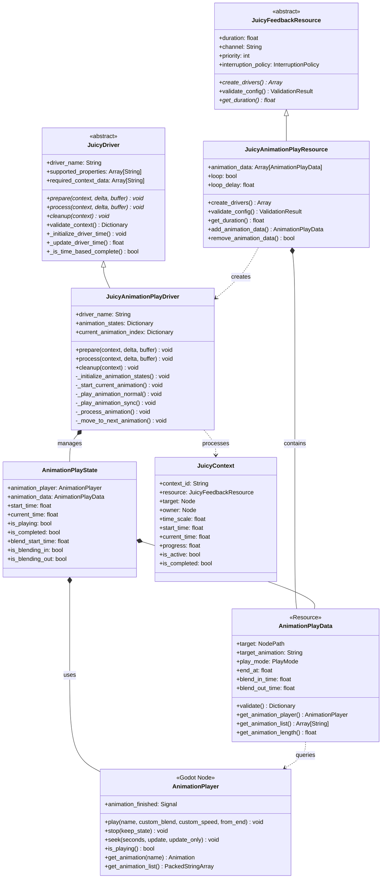
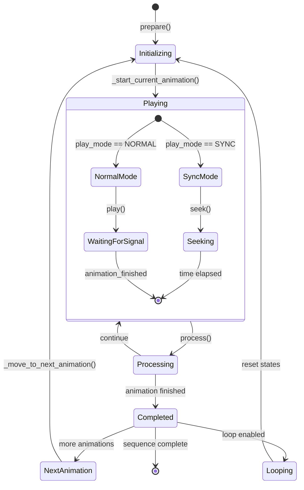
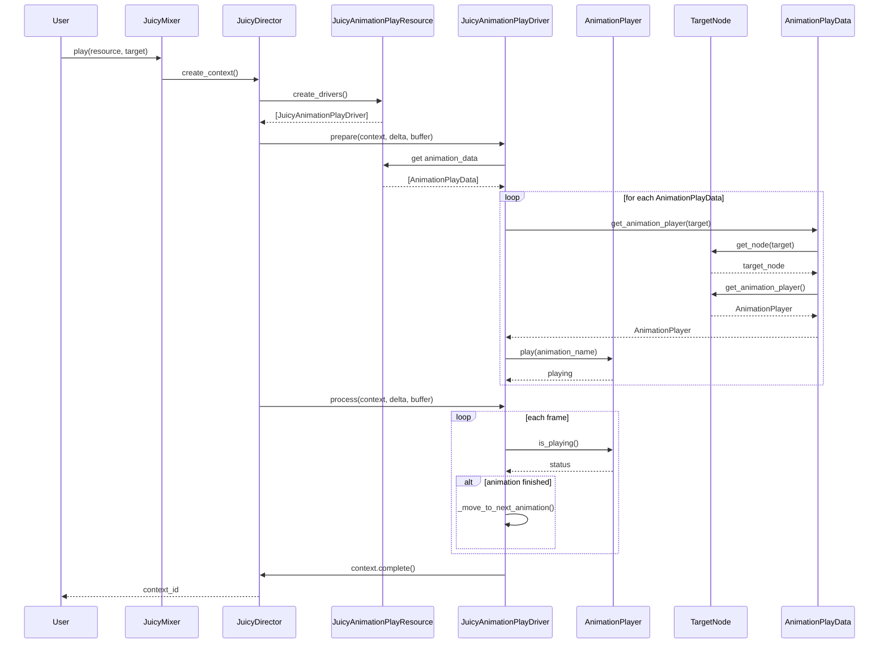
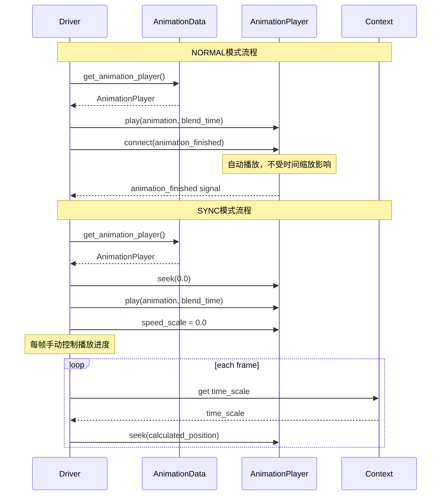
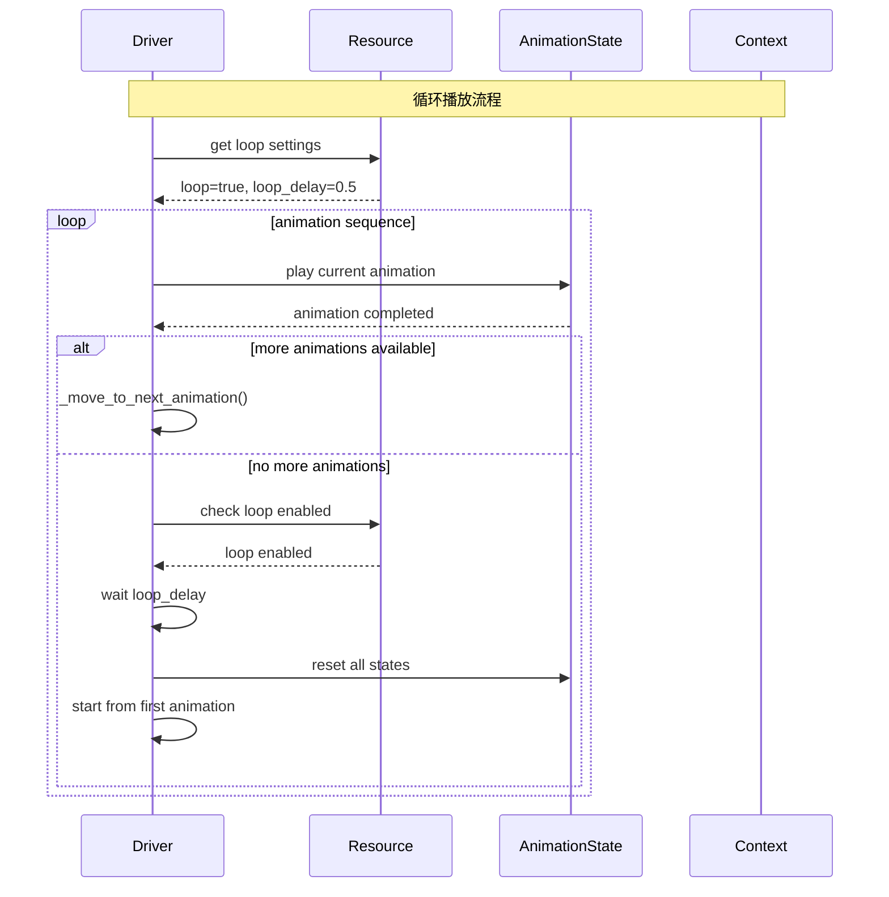
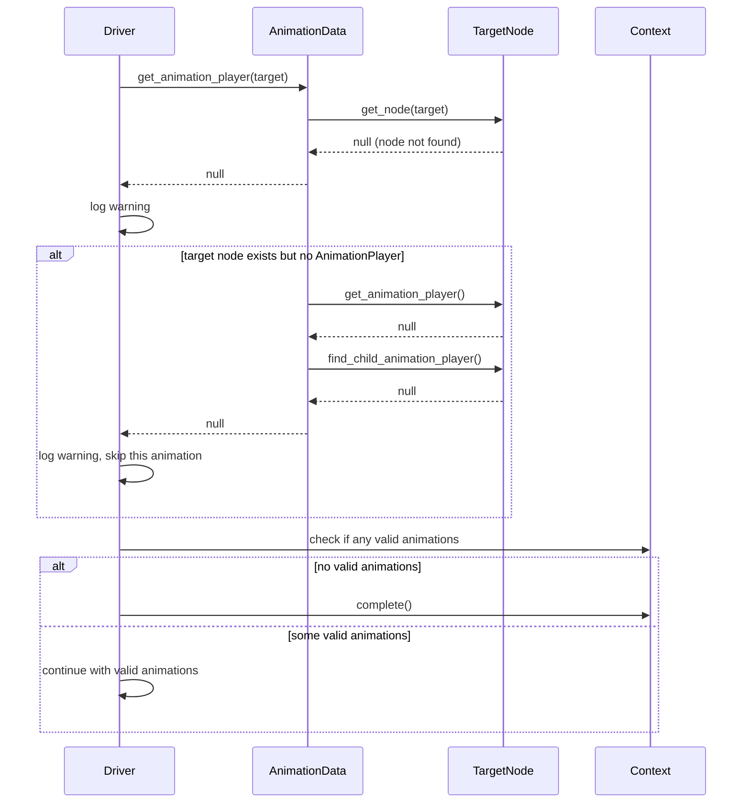
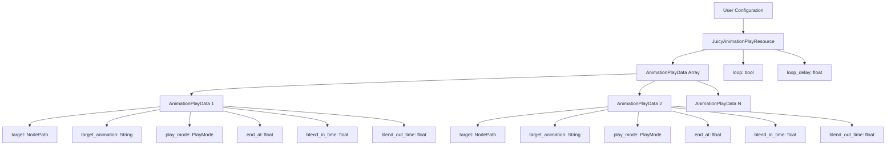
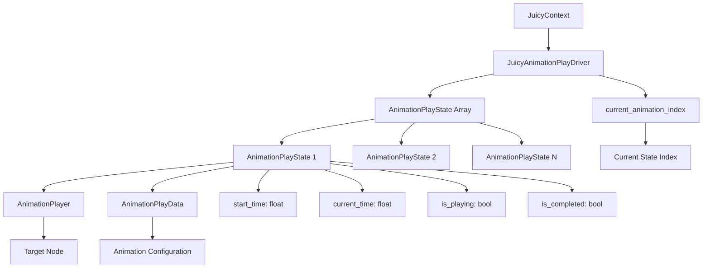
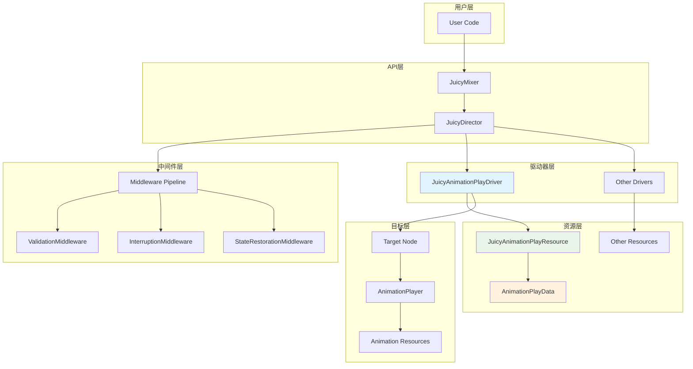
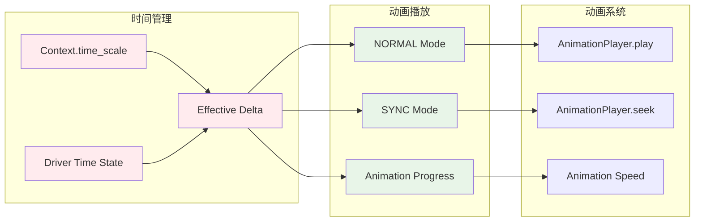

# JuicyAnimationPlay 组件图表

## 1. 类图

### 1.1 核心类关系图



### 1.2 播放模式枚举图

```mermaid
enumDiagram
    PlayMode {
        NORMAL
        SYNC
    }
    
    note for PlayMode "NORMAL: 使用AnimationPlayer.play()\nSYNC: 使用AnimationPlayer.seek()受时间缩放影响"
```

### 1.3 状态转换图



## 2. 时序图

### 2.1 基本播放流程



### 2.2 两种播放模式对比



### 2.3 循环播放流程



### 2.4 错误处理流程



## 3. 数据流图

### 3.1 配置数据流



### 3.2 运行时数据流



## 4. 组件交互图

### 4.1 系统架构交互



### 4.2 时序管理交互



这些图表提供了JuicyAnimationPlay组件的完整可视化表示，包括类关系、时序流程、数据流向和系统交互，有助于理解整个系统的工作原理和组件间的协作关系。