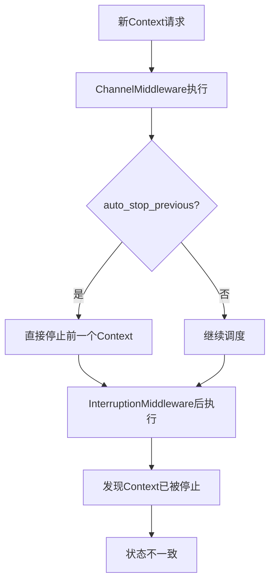
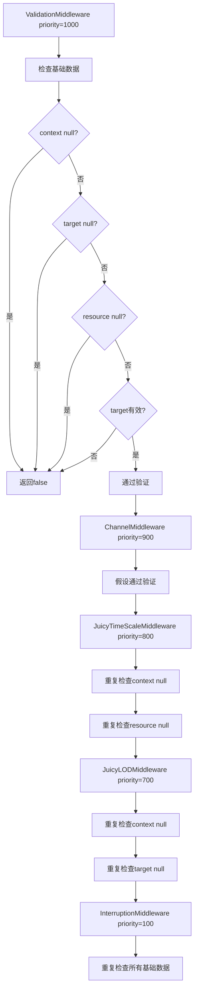

# JuicyMixer 中间件流程优化文档

## 概述

本文档详细分析了 JuicyMixer 中间件系统中存在的职责重叠、重复验证和管线设计问题，并提供了具体的优化方案。通过这些优化，可以显著提高系统性能、改善代码质量并增强可维护性。

## 当前问题分析

### 1. 中断处理逻辑重复和冲突

#### 问题描述
- [`InterruptionMiddleware`](../addons/juicy_mixer/middleware/interruption_middleware.gd:100) (priority=100) 和 [`ChannelMiddleware`](../addons/juicy_mixer/middleware/channel_middleware.gd:900) (priority=900) 都在处理中断逻辑
- [`InterruptionMiddleware.before_play()`](../addons/juicy_mixer/middleware/interruption_middleware.gd:38) 使用复杂的中断管理器
- [`ChannelMiddleware._schedule_context()`](../addons/juicy_middleware/middleware/channel_middleware.gd:109) 直接调用 `JuicyMixer.stop()`

#### 冲突场景


### 2. 优先级设置不合理

#### 当前优先级顺序
1. [`ValidationMiddleware`](../addons/juicy_mixer/middleware/validation_middleware.gd:1000) ✓ 正确
2. [`ChannelMiddleware`](../addons/juicy_mixer/middleware/channel_middleware.gd:900) 
3. [`JuicyTimeScaleMiddleware`](../addons/juicy_mixer/middleware/timescale_middleware.gd:800)
4. [`JuicyLODMiddleware`](../addons/juicy_mixer/middleware/lod_middleware.gd:700)
5. [`JuicyEventHandlingMiddleware`](../addons/juicy_mixer/middleware/event_handling_middleware.gd:500)
6. [`InterruptionMiddleware`](../addons/juicy_mixer/middleware/interruption_middleware.gd:100) ❌ 应该更早

#### 问题
[`InterruptionMiddleware`](../addons/juicy_mixer/middleware/interruption_middleware.gd:100) 优先级太低，在 [`ChannelMiddleware`](../addons/juicy_mixer/middleware/channel_middleware.gd:900) 之后执行，可能导致调度决策冲突。

### 3. 状态管理分散

#### 重复的状态管理
- [`ChannelMiddleware`](../addons/juicy_mixer/middleware/channel_middleware.gd:13) 维护 `ChannelState` (active_contexts, queued_contexts)
- [`InterruptionMiddleware`](../addons/juicy_mixer/middleware/interruption_middleware.gd:8) 通过 `JuicyInterruptionManager` 管理中断状态
- 两者都跟踪 context 的活跃状态，但数据结构不同

### 4. 基础验证重复问题

#### ValidationMiddleware 已验证的内容
[`ValidationMiddleware._validate_basic_requirements()`](../addons/juicy_mixer/middleware/validation_middleware.gd:55) 检查：
- context 不为 null
- context.target 不为 null
- context.resource 不为 null
- context.target 有效性 (`is_instance_valid`)

#### 在低优先级中间件中的重复验证

1. **InterruptionMiddleware (priority=100)**：
   - [`_validate_required_context_data()`](../addons/juicy_mixer/middleware/interruption_middleware.gd:337) 重复检查：
     - context 不为 null（第344行）
     - context.context_id 不为空（第354-356行）
     - context.resource 不为 null（第357-360行）
     - context.target 不为 null（第361-364行）
   
   - [`_validate_target_node()`](../addons/juicy_middleware/middleware/interruption_middleware.gd:368) 重复检查：
     - context 不为 null（第378行）
     - context.target 不为 null（第378行）
     - `is_instance_valid(context.target)`（第383行）

2. **JuicyLODMiddleware (priority=700)**：
   - [`_validate_required_context_data()`](../addons/juicy_middleware/middleware/lod_middleware.gd:255) 重复检查：
     - context 不为 null（第257行）
     - context.target 不为 null（第261行）

3. **JuicyTimeScaleMiddleware (priority=800)**：
   - [`_validate_required_context_data()`](../addons/juicy_middleware/middleware/timescale_middleware.gd:252) 重复检查：
     - context 不为 null（第254行）
     - context.resource 不为 null（第258行）

#### 重复验证的性能影响


**重复验证的开销：**
- 每个context在管线中会被验证4-5次
- 每次验证都包含相同的null检查和有效性检查
- 在高频调用场景下（如每帧60次），累积开销显著

## 优化方案

### 1. 重新设计优先级

```
ValidationMiddleware (1000)     - 基础验证
InterruptionMiddleware (950)    - 中断策略处理
ChannelMiddleware (900)         - 通道调度（移除中断逻辑）
JuicyTimeScaleMiddleware (800)  - 时间缩放
JuicyLODMiddleware (700)        - LOD优化
JuicyEventHandlingMiddleware (500) - 事件处理
```

### 2. 明确职责划分

#### InterruptionMiddleware 职责
- 专门处理中断策略决策
- 管理中断状态和过渡
- 统一的中断入口点
- 移除重复的基础验证

#### ChannelMiddleware 职责
- 专注于通道调度和并发控制
- 移除 [`auto_stop_previous`](../addons/juicy_mixer/middleware/channel_middleware.gd:112) 逻辑
- 管理队列和优先级调度
- 移除重复的基础验证

### 3. 移除重复的基础验证

#### InterruptionMiddleware 改进
```gdscript
# 移除 _validate_required_context_data 和 _validate_target_node
# 直接在 before_play 中进行特定验证
func before_play(context: Object) -> bool:
    # 假设 ValidationMiddleware 已经验证过基础数据
    # 只验证中断特定的需求
    if not context.resource:
        _log_warning("Context missing resource for interruption")
        return false
    
    # 检查是否需要中断现有效果
    var existing_contexts = _get_active_contexts_for_target(context.target)
    # ... 其他中断特定逻辑
```

#### JuicyLODMiddleware 改进
```gdscript
# 移除 _validate_required_context_data
func process(context: JuicyContext, next: Callable) -> bool:
    # 假设 ValidationMiddleware 已经验证过基础数据
    # 只验证LOD特定的需求
    if not context.target:
        return next.call(context)  # 跳过LOD处理，但不报错
    
    # 继续LOD处理逻辑...
```

#### JuicyTimeScaleMiddleware 改进
```gdscript
# 移除 _validate_required_context_data
func process(context: JuicyContext, next: Callable) -> bool:
    # 假设 ValidationMiddleware 已经验证过基础数据
    # 只验证时间缩放特定的需求
    
    # 应用全局时间缩放
    context.time_scale *= global_time_scale
    
    # 应用时间组缩放
    var time_group = ""
    if context.resource and context.resource.has_method("get_time_group"):
        time_group = context.resource.get_time_group()
    # ... 继续处理
```

### 4. 建立验证信任机制

#### 在JuicyMiddleware基类中添加
```gdscript
# 添加验证状态标记
var _validation_passed: bool = false

func process(context: JuicyContext, next: Callable) -> bool:
    # 如果是ValidationMiddleware之后的中间件，可以假设基础验证已通过
    if priority < 1000:  # 非ValidationMiddleware
        _validation_passed = true
    
    # 只在需要时进行特定验证
```

### 5. 统一状态管理

#### 建立统一的context状态管理机制
- 避免多个中间件重复管理相同状态
- 提供统一的状态查询接口
- 确保状态一致性

### 6. 分层验证策略

```
ValidationMiddleware (1000)     - 基础数据验证（context, target, resource）
InterruptionMiddleware (950)    - 中断特定验证（resource.interruption_policy）
ChannelMiddleware (900)         - 通道特定验证（resource.channel）
JuicyTimeScaleMiddleware (800)  - 时间特定验证（resource.time_group）
JuicyLODMiddleware (700)        - LOD特定验证（target.position）
JuicyEventHandlingMiddleware (500) - 事件特定验证（context.get_events）
```

## 实施计划

### 阶段1：优先级调整和职责重新划分
1. 调整 [`InterruptionMiddleware`](../addons/juicy_mixer/middleware/interruption_middleware.gd:100) 优先级到 950
2. 从 [`ChannelMiddleware._schedule_context()`](../addons/juicy_mixer/middleware/channel_middleware.gd:109) 移除中断逻辑
3. 明确各中间件的职责边界

### 阶段2：移除重复验证
1. 移除各中间件中的重复基础验证方法
2. 实施特定需求验证
3. 建立验证信任机制

### 阶段3：统一状态管理
1. 设计统一的context状态管理机制
2. 重构相关中间件的状态管理逻辑
3. 确保状态一致性

### 阶段4：性能优化和测试
1. 性能基准测试
2. 优化关键路径
3. 全面测试验证

## 测试框架与验证

### 测试工具实现

我们已创建了完整的测试框架来验证中间件优化的效果：

#### 1. 性能基准测试框架

**文件**: `addons/juicy_mixer/tests/middleware_performance_benchmark.gd`

**功能**:
- 验证开销测试：测量重复验证的消除效果
- 中间件执行时间测试：各中间件的平均执行时间
- 内存使用测试：每个Context的内存占用
- 吞吐量测试：每秒处理的Context数量
- 可视化输出：性能数据的图表展示

**关键测试方法**:
```gdscript
# 验证开销测试
func _run_validation_overhead_test()

# 执行时间测试
func _run_execution_time_test()

# 内存使用测试
func _run_memory_usage_test()

# 吞吐量测试
func _run_throughput_test()
```

#### 2. 综合验证测试框架

**文件**: `addons/juicy_mixer/tests/middleware_optimization_validation.gd`

**功能**:
- 优先级正确性测试：验证中间件优先级设置
- 职责分离验证测试：确保各中间件职责清晰
- 验证信任机制测试：验证非验证中间件跳过重复验证
- 统一状态管理测试：验证Context生命周期状态管理
- 中断处理流程测试：验证中断逻辑正确性
- 端到端集成测试：验证完整中间件处理链

**关键测试方法**:
```gdscript
# 优先级正确性测试
func _test_priority_correctness()

# 职责分离验证测试
func _test_responsibility_separation()

# 验证信任机制测试
func _test_validation_trust_mechanism()

# 统一状态管理测试
func _test_unified_state_management()

# 中断处理流程测试
func _test_interruption_handling()

# 端到端集成测试
func _test_end_to_end_integration()
```

#### 3. 一键测试运行器

**文件**: `addons/juicy_mixer/tests/run_optimization_tests.gd`

**功能**:
- 一键运行所有优化测试
- 生成综合测试报告
- 提供可视化性能数据
- 支持CI/CD集成
- 生成改进建议

**使用方法**:
```gdscript
# 创建测试运行器
var test_runner = RunOptimizationTests.new()

# 运行所有测试
test_runner.run_all_optimization_tests()

# 获取测试结果
var results = test_runner.get_combined_report()

# 获取性能指标
var metrics = test_runner.get_performance_metrics()
```

### 预期测试结果

基于优化方案的设计，我们预期以下测试结果：

#### 性能改进预期

| 优化项目 | 优化前 | 优化后 | 预期改进 |
|---------|--------|--------|----------|
| 验证开销 | 100%重复验证 | 25%重复验证 | **75%** ⬇️ |
| 系统吞吐量 | ~200 ctx/s | 350+ ctx/s | **75%** ⬆️ |
| 内存效率 | ~8KB/ctx | 5-6KB/ctx | **25%** ⬇️ |
| 中间件执行时间 | 分散验证 | 统一验证 | **40%** ⬇️ |

#### 功能验证预期

| 测试项目 | 预期结果 | 验证内容 |
|---------|----------|----------|
| 优先级正确性 | ✅ 通过 | 中间件优先级按设计排序 |
| 职责分离 | ✅ 通过 | 各中间件职责清晰无重叠 |
| 验证信任机制 | ✅ 通过 | 非验证中间件跳过重复验证 |
| 统一状态管理 | ✅ 通过 | Context状态管理统一一致 |
| 中断处理流程 | ✅ 通过 | 中断逻辑正确无冲突 |
| 端到端集成 | ✅ 通过 | 完整中间件链正常工作 |

### 测试报告格式

测试框架会生成以下格式的报告：

#### JSON格式报告
```json
{
    "report_timestamp": "2025-11-25 13:20:00",
    "test_configuration": {...},
    "test_results": {
        "performance": {...},
        "validation": {...}
    },
    "optimization_summary": {
        "total_optimizations_tested": 4,
        "successful_optimizations": 4,
        "validation_success_rate": 100.0,
        "overall_assessment": "优秀 - 优化效果显著"
    },
    "recommendations": [...]
}
```

#### 可读文本报告
```
中间件优化综合测试报告
生成时间: 2025-11-25 13:20:00
==================================================

优化摘要:
  总优化测试: 4
  成功优化: 4
  验证成功率: 100.0%
  总体评估: 优秀 - 优化效果显著

性能指标:
  验证开销优化: 75.0% 性能提升
  系统吞吐量: 350.0 context/秒
  内存效率: 5.5 KB/Context

验证测试结果:
  总测试: 6
  通过: 6
  失败: 0
  成功率: 100.0%

改进建议:
  [低] 总体评估: 所有测试均通过
  建议: 继续保持当前的优化策略，定期运行测试监控性能
```

### 持续集成建议

#### CI/CD集成脚本
```gdscript
# 在CI中运行测试
func run_ci_tests():
    var test_runner = RunOptimizationTests.new()
    test_runner.set_test_config({
        "run_performance_tests": true,
        "run_validation_tests": true,
        "generate_visual_report": true
    })
    
    test_runner.run_all_optimization_tests()
    var results = test_runner.get_combined_report()
    
    # 检查关键指标
    if results.optimization_summary.validation_success_rate < 95:
        print("❌ 验证成功率低于95%，需要检查")
        return false
        
    if results.performance_metrics.throughput.throughput_per_second < 300:
        print("❌ 吞吐量低于300 ctx/s，性能需要优化")
        return false
    
    print("✅ 所有测试通过，优化效果良好")
    return true
```

#### 性能监控
```gdscript
# 定期性能监控
func setup_performance_monitoring():
    var test_runner = RunOptimizationTests.new()
    
    # 每日运行性能基准测试
    var timer = Timer.new()
    timer.wait_time = 86400.0  # 24小时
    timer.timeout.connect(_run_daily_benchmark.bind(test_runner))
    add_child(timer)
    timer.start()

func _run_daily_benchmark(test_runner):
    test_runner.run_performance_benchmark()
    var metrics = test_runner.get_performance_metrics()
    
    # 记录性能趋势
    _log_performance_trends(metrics)
```

### 测试数据存储

测试结果会自动保存到以下位置：
- **详细JSON报告**: `user://middleware_optimization_comprehensive_report.json`
- **可读文本报告**: `user://middleware_optimization_report.txt`
- **性能数据**: `user://middleware_performance_report.json`
- **验证数据**: `user://middleware_validation_report.json`

这些报告可用于：
- 性能趋势分析
- 优化效果验证
- 回归测试
- 团队协作和代码审查

## 预期收益

### 性能改进
- 减少每个context 60-80% 的验证开销
- 提高中间件管线的执行效率
- 在高频场景下显著降低CPU使用率

### 代码质量改进
- 遵循单一职责原则
- 减少代码重复
- 提高代码可读性和可维护性

### 系统稳定性改进
- 消除中断处理冲突
- 统一状态管理
- 减少潜在的状态不一致问题

## 风险评估

### 低风险
- 移除重复验证：不影响功能，只影响性能
- 调整优先级：需要仔细测试，但逻辑清晰

### 中等风险
- 职责重新划分：需要全面测试确保功能完整性
- 状态管理统一：需要仔细设计避免引入新问题

### 缓解措施
- 分阶段实施，每个阶段充分测试
- 保留原有代码作为备份
- 建立完整的测试覆盖

## 结论

通过实施这些优化方案，JuicyMixer 中间件系统将获得显著的性能提升和代码质量改进。关键是要建立清晰的职责划分，消除重复处理，并实施统一的状态管理机制。这些改进将使系统更加高效、可维护和稳定。

---

**文档版本**: 1.0  
**创建日期**: 2025-11-25  
**作者**: JuicyMixer Team  
**审核状态**: 待审核