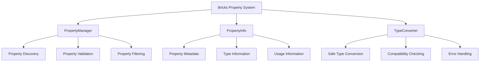

# Bricks 属性系统通用类设计

## 📋 设计概述

本文档设计了三个通用类，用于支持 Bricks 插件中的节点属性操作功能。这些类设计为独立、可复用的组件，可以在多个指令和条件中使用。

### 核心通用类
1. **PropertyManager** - 属性管理器
2. **PropertyInfo** - 属性信息结构
3. **TypeConverter** - 类型转换器

## 🏗️ 整体架构设计



## 📦 PropertyInfo 类设计

### 类定义
```gdscript
@tool
class_name PropertyInfo
extends RefCounted

## 属性基本信息
var name: String                           ## 属性名称
var type: int = TYPE_NIL                 ## 属性类型 (Godot TYPE_*)
var hint: PropertyHint = PROPERTY_HINT_NONE  ## 属性提示
var hint_string: String = ""                 ## 提示字符串
var usage: PropertyUsageFlags = 0           ## 使用标志
var default_value: Variant = null             ## 默认值
var class_name: String = ""                 ## 类名（用于对象类型）

## 扩展信息
var category: String = ""                    ## 属性分类
var description: String = ""                 ## 属性描述
var is_read_only: bool = false              ## 是否只读
var is_internal: bool = false               ## 是否内部属性（以下划线开头）
var is_exported: bool = false               ## 是否导出属性
var is_script_variable: bool = false         ## 是否脚本变量

## 验证信息
var min_value: Variant = null                 ## 最小值（数值类型）
var max_value: Variant = null                 ## 最大值（数值类型）
var step: float = 0.0                        ## 步长（数值类型）
var is_array_fixed_size: bool = false        ## 数组是否固定大小
var array_size: int = 0                     ## 数组大小（固定时）

## 构造函数
static func create(property_dict: Dictionary) -> PropertyInfo
static func from_node_property(node: Node, property_name: String) -> PropertyInfo
```

### 核心方法实现

#### 1. 静态工厂方法
```gdscript
## 从属性字典创建 PropertyInfo
static func create(property_dict: Dictionary) -> PropertyInfo:
    var info = PropertyInfo.new()
    info.name = property_dict.get("name", "")
    info.type = property_dict.get("type", TYPE_NIL)
    info.hint = property_dict.get("hint", PROPERTY_HINT_NONE)
    info.hint_string = property_dict.get("hint_string", "")
    info.usage = property_dict.get("usage", 0)
    info.default_value = property_dict.get("default_value", null)
    info.class_name = property_dict.get("class_name", "")
    
    # 解析扩展信息
    info._parse_extended_info(property_dict)
    
    return info

## 从节点属性创建 PropertyInfo
static func from_node_property(node: Node, property_name: String) -> PropertyInfo:
    var property_list = node.get_property_list()
    for prop_dict in property_list:
        if prop_dict.name == property_name:
            return create(prop_dict)
    
    # 如果找不到属性，返回空信息
    var empty_info = PropertyInfo.new()
    empty_info.name = property_name
    empty_info.is_read_only = true
    return empty_info
```

#### 2. 属性分析
```gdscript
## 解析扩展信息
func _parse_extended_info(property_dict: Dictionary):
    # 分析使用标志
    _parse_usage_flags(property_dict.usage)
    
    # 分析类型特定信息
    _parse_type_specific_info(property_dict)
    
    # 分析提示信息
    _parse_hint_info(property_dict)

## 解析使用标志
func _parse_usage_flags(usage: int):
    is_exported = usage & PROPERTY_USAGE_EDITOR != 0
    is_read_only = usage & PROPERTY_USAGE_READ_ONLY != 0
    is_script_variable = usage & PROPERTY_USAGE_SCRIPT_VARIABLE != 0

## 解析类型特定信息
func _parse_type_specific_info(property_dict: Dictionary):
    match type:
        TYPE_INT, TYPE_FLOAT:
            _parse_numeric_info(property_dict)
        TYPE_STRING:
            _parse_string_info(property_dict)
        TYPE_ARRAY:
            _parse_array_info(property_dict)
        TYPE_OBJECT:
            _parse_object_info(property_dict)

## 解析数值信息
func _parse_numeric_info(property_dict: Dictionary):
    if property_dict.has("min_value"):
        min_value = property_dict.min_value
    if property_dict.has("max_value"):
        max_value = property_dict.max_value
    if property_dict.has("step"):
        step = property_dict.step

## 解析字符串信息
func _parse_string_info(property_dict: Dictionary):
    if property_dict.has("length"):
        max_value = property_dict.length

## 解析数组信息
func _parse_array_info(property_dict: Dictionary):
    if property_dict.has("array_size"):
        is_array_fixed_size = true
        array_size = property_dict.array_size
```

#### 3. 实用方法
```gdscript
## 检查属性是否可写
func is_writable() -> bool:
    return not is_read_only and not is_internal

## 检查属性是否可读
func is_readable() -> bool:
    return not is_internal

## 检查属性是否为数值类型
func is_numeric() -> bool:
    return type in [TYPE_INT, TYPE_FLOAT]

## 检查属性是否为容器类型
func is_container() -> bool:
    return type in [TYPE_ARRAY, TYPE_DICTIONARY]

## 获取类型名称
func get_type_name() -> String:
    return TypeConverter.get_type_name(type)

## 获取显示名称
func get_display_name() -> String:
    if not description.is_empty():
        return description
    return name.capitalize()

## 验证值是否适合此属性
func validate_value(value: Variant) -> Dictionary:
    var result = {"valid": true, "error": "", "converted_value": value}
    
    # 类型检查
    if not TypeConverter.is_compatible(typeof(value), type):
        result.valid = false
        result.error = "类型不兼容：期望 %s，实际 %s" % [
            get_type_name(), TypeConverter.get_type_name(typeof(value))
        ]
        return result
    
    # 数值范围检查
    if is_numeric():
        result = _validate_numeric_range(value)
    
    # 字符串长度检查
    if type == TYPE_STRING and max_value != null:
        var str_value = str(value)
        if str_value.length() > max_value:
            result.valid = false
            result.error = "字符串长度超过限制：%d/%d" % [str_value.length(), max_value]
    
    return result

## 验证数值范围
func _validate_numeric_range(value: Variant) -> Dictionary:
    var result = {"valid": true, "error": "", "converted_value": value}
    
    var num_value: float
    if typeof(value) == TYPE_INT:
        num_value = float(value)
    elif typeof(value) == TYPE_FLOAT:
        num_value = value
    else:
        # 尝试转换
        num_value = TypeConverter.safe_convert_to_float(value)
        if num_value == null:
            result.valid = false
            result.error = "无法转换为数值"
            return result
    
    if min_value != null and num_value < min_value:
        result.valid = false
        result.error = "值小于最小值：%f < %f" % [num_value, min_value]
    elif max_value != null and num_value > max_value:
        result.valid = false
        result.error = "值大于最大值：%f > %f" % [num_value, max_value]
    
    return result
```

## 🔧 TypeConverter 类设计

### 类定义
```gdscript
@tool
class_name TypeConverter
extends RefCounted

## 类型转换映射
static var _type_converters: Dictionary = {}
static var _compatibility_matrix: Dictionary = {}
static var _type_names: Dictionary = {}

## 初始化静态数据
static func _static_init():
    if _type_converters.is_empty():
        _setup_converters()
        _setup_compatibility_matrix()
        _setup_type_names()
```

### 核心转换方法

#### 1. 安全类型转换
```gdscript
## 安全转换为指定类型
static func safe_convert(value: Variant, target_type: int) -> Variant:
    if typeof(value) == target_type:
        return value
    
    match target_type:
        TYPE_BOOL:
            return safe_convert_to_bool(value)
        TYPE_INT:
            return safe_convert_to_int(value)
        TYPE_FLOAT:
            return safe_convert_to_float(value)
        TYPE_STRING:
            return safe_convert_to_string(value)
        TYPE_VECTOR2:
            return safe_convert_to_vector2(value)
        TYPE_VECTOR3:
            return safe_convert_to_vector3(value)
        TYPE_COLOR:
            return safe_convert_to_color(value)
        TYPE_NODE_PATH:
            return safe_convert_to_node_path(value)
        TYPE_ARRAY:
            return safe_convert_to_array(value)
        TYPE_DICTIONARY:
            return safe_convert_to_dictionary(value)
        _:
            push_warning("不支持的转换类型: " + get_type_name(target_type))
            return value

## 安全转换为布尔值
static func safe_convert_to_bool(value: Variant) -> bool:
    match typeof(value):
        TYPE_BOOL:
            return value
        TYPE_INT:
            return value != 0
        TYPE_FLOAT:
            return value != 0.0
        TYPE_STRING:
            var str_val = (value as String).to_lower().strip_edges()
            if str_val in ["true", "1", "yes", "on", "是", "真"]:
                return true
            elif str_val in ["false", "0", "no", "off", "否", "假"]:
                return false
            else:
                return str_val.is_empty() == false
        TYPE_NIL:
            return false
        _:
            return value != null

## 安全转换为整数
static func safe_convert_to_int(value: Variant) -> int:
    match typeof(value):
        TYPE_INT:
            return value
        TYPE_FLOAT:
            return int(value)
        TYPE_BOOL:
            return 1 if value else 0
        TYPE_STRING:
            var str_val = (value as String).strip_edges()
            if str_val.is_valid_int():
                return str_val.to_int()
            elif str_val.is_valid_float():
                return int(str_val.to_float())
            else:
                return 0
        TYPE_NIL:
            return 0
        _:
            return 0

## 安全转换为浮点数
static func safe_convert_to_float(value: Variant) -> float:
    match typeof(value):
        TYPE_FLOAT:
            return value
        TYPE_INT:
            return float(value)
        TYPE_BOOL:
            return 1.0 if value else 0.0
        TYPE_STRING:
            var str_val = (value as String).strip_edges()
            if str_val.is_valid_float():
                return str_val.to_float()
            else:
                return 0.0
        TYPE_NIL:
            return 0.0
        _:
            return 0.0

## 安全转换为字符串
static func safe_convert_to_string(value: Variant) -> String:
    if value == null:
        return ""
    return str(value)

## 安全转换为 Vector2
static func safe_convert_to_vector2(value: Variant) -> Vector2:
    match typeof(value):
        TYPE_VECTOR2:
            return value
        TYPE_VECTOR2I:
            return Vector2(value.x, value.y)
        TYPE_VECTOR3:
            return Vector2(value.x, value.y)
        TYPE_VECTOR3I:
            return Vector2(value.x, value.y)
        TYPE_STRING:
            return _parse_vector2_string(value)
        TYPE_ARRAY:
            if value.size() >= 2:
                return Vector2(value[0], value[1])
        TYPE_COLOR:
            return Vector2(value.r, value.g)
        _:
            return Vector2.ZERO

## 解析 Vector2 字符串
static func _parse_vector2_string(str_val: String) -> Vector2:
    var parts = str_val.split(",")
    if parts.size() != 2:
        return Vector2.ZERO
    
    var x = safe_convert_to_float(parts[0].strip_edges())
    var y = safe_convert_to_float(parts[1].strip_edges())
    return Vector2(x, y)
```

#### 2. 类型兼容性检查
```gdscript
## 检查类型兼容性
static func is_compatible(source_type: int, target_type: int) -> bool:
    if source_type == target_type:
        return true
    
    # 检查兼容性矩阵
    var key = "%s_%s" % [get_type_name(source_type), get_type_name(target_type)]
    return _compatibility_matrix.get(key, false)

## 设置兼容性矩阵
static func _setup_compatibility_matrix():
    _compatibility_matrix = {
        # 数值类型互相兼容
        "INT_FLOAT": true, "FLOAT_INT": true,
        "INT_BOOL": true, "FLOAT_BOOL": true,
        "BOOL_INT": true, "BOOL_FLOAT": true,
        
        # 字符串与基础类型兼容
        "STRING_INT": true, "STRING_FLOAT": true,
        "STRING_BOOL": true, "STRING_VECTOR2": true,
        "STRING_VECTOR3": true, "STRING_COLOR": true,
        
        # 向量类型部分兼容
        "VECTOR2_VECTOR3": true, "VECTOR3_VECTOR2": true,
        "VECTOR2I_VECTOR2": true, "VECTOR3I_VECTOR3": true,
        
        # 数组与容器兼容
        "ARRAY_ARRAY": true, "STRING_ARRAY": true,
        "DICTIONARY_STRING": true, "STRING_DICTIONARY": true,
        
        # NodePath 与字符串兼容
        "NODE_PATH_STRING": true, "STRING_NODE_PATH": true,
        
        # 所有类型都可以转换为字符串
        "INT_STRING": true, "FLOAT_STRING": true,
        "BOOL_STRING": true, "VECTOR2_STRING": true,
        "VECTOR3_STRING": true, "COLOR_STRING": true,
        "ARRAY_STRING": true, "DICTIONARY_STRING": true,
        "OBJECT_STRING": true, "NODE_PATH_STRING": true
    }
```

#### 3. 类型名称和描述
```gdscript
## 获取类型名称
static func get_type_name(type: int) -> String:
    if _type_names.has(type):
        return _type_names[type]
    return "UNKNOWN"

## 获取类型描述
static func get_type_description(type: int) -> String:
    match type:
        TYPE_NIL: return "空值"
        TYPE_BOOL: return "布尔值"
        TYPE_INT: return "整数"
        TYPE_FLOAT: return "浮点数"
        TYPE_STRING: return "字符串"
        TYPE_VECTOR2: return "二维向量"
        TYPE_VECTOR2I: return "整数二维向量"
        TYPE_VECTOR3: return "三维向量"
        TYPE_VECTOR3I: return "整数三维向量"
        TYPE_COLOR: return "颜色"
        TYPE_ARRAY: return "数组"
        TYPE_DICTIONARY: return "字典"
        TYPE_OBJECT: return "对象"
        TYPE_NODE_PATH: return "节点路径"
        TYPE_PACKED_BYTE_ARRAY: return "字节数组"
        TYPE_PACKED_INT32_ARRAY: return "整数数组"
        TYPE_PACKED_FLOAT32_ARRAY: return "浮点数数组"
        TYPE_PACKED_STRING_ARRAY: return "字符串数组"
        _: return "未知类型"

## 设置类型名称映射
static func _setup_type_names():
    _type_names = {
        TYPE_NIL: "NIL",
        TYPE_BOOL: "BOOL",
        TYPE_INT: "INT",
        TYPE_FLOAT: "FLOAT",
        TYPE_STRING: "STRING",
        TYPE_VECTOR2: "VECTOR2",
        TYPE_VECTOR2I: "VECTOR2I",
        TYPE_VECTOR3: "VECTOR3",
        TYPE_VECTOR3I: "VECTOR3I",
        TYPE_COLOR: "COLOR",
        TYPE_ARRAY: "ARRAY",
        TYPE_DICTIONARY: "DICTIONARY",
        TYPE_OBJECT: "OBJECT",
        TYPE_NODE_PATH: "NODE_PATH",
        TYPE_PACKED_BYTE_ARRAY: "PACKED_BYTE_ARRAY",
        TYPE_PACKED_INT32_ARRAY: "PACKED_INT32_ARRAY",
        TYPE_PACKED_FLOAT32_ARRAY: "PACKED_FLOAT32_ARRAY",
        TYPE_PACKED_STRING_ARRAY: "PACKED_STRING_ARRAY"
    }
```

## 🗂️ PropertyManager 类设计

### 类定义
```gdscript
@tool
class_name PropertyManager
extends RefCounted

## 缓存系统
static var _property_cache: Dictionary = {}
static var _node_cache: Dictionary = {}

## 属性过滤器
enum PropertyFilter {
    ALL,                ## 所有属性
    WRITABLE_ONLY,      ## 仅可写属性
    EXPORTED_ONLY,       ## 仅导出属性
    NUMERIC_ONLY,        ## 仅数值属性
    CONTAINER_ONLY,       ## 仅容器属性
    CUSTOM_PROPERTIES    ## 自定义属性过滤器
}
```

### 核心功能方法

#### 1. 属性发现和获取
```gdscript
## 获取节点的所有属性信息
static func get_all_properties(node: Node) -> Array[PropertyInfo]:
    if node == null:
        return []
    
    var cache_key = str(node.get_instance_id())
    if _property_cache.has(cache_key):
        return _property_cache[cache_key]
    
    var properties: Array[PropertyInfo] = []
    var property_list = node.get_property_list()
    
    for prop_dict in property_list:
        var property_info = PropertyInfo.create(prop_dict)
        properties.append(property_info)
    
    # 缓存结果
    _property_cache[cache_key] = properties
    
    return properties

## 获取节点的可写属性
static func get_writable_properties(node: Node) -> Array[PropertyInfo]:
    return get_filtered_properties(node, PropertyFilter.WRITABLE_ONLY)

## 获取节点的导出属性
static func get_exported_properties(node: Node) -> Array[PropertyInfo]:
    return get_filtered_properties(node, PropertyFilter.EXPORTED_ONLY)

## 获取节点的数值属性
static func get_numeric_properties(node: Node) -> Array[PropertyInfo]:
    return get_filtered_properties(node, PropertyFilter.NUMERIC_ONLY)

## 获取节点的容器属性
static func get_container_properties(node: Node) -> Array[PropertyInfo]:
    return get_filtered_properties(node, PropertyFilter.CONTAINER_ONLY)
```

#### 2. 属性过滤
```gdscript
## 根据过滤器获取属性
static func get_filtered_properties(node: Node, filter: PropertyFilter) -> Array[PropertyInfo]:
    var all_properties = get_all_properties(node)
    var filtered_properties: Array[PropertyInfo] = []
    
    for property_info in all_properties:
        if _passes_filter(property_info, filter):
            filtered_properties.append(property_info)
    
    return filtered_properties

## 检查属性是否通过过滤器
static func _passes_filter(property_info: PropertyInfo, filter: PropertyFilter) -> bool:
    match filter:
        PropertyFilter.ALL:
            return true
        PropertyFilter.WRITABLE_ONLY:
            return property_info.is_writable()
        PropertyFilter.EXPORTED_ONLY:
            return property_info.is_exported
        PropertyFilter.NUMERIC_ONLY:
            return property_info.is_numeric()
        PropertyFilter.CONTAINER_ONLY:
            return property_info.is_container()
        PropertyFilter.CUSTOM_PROPERTIES:
            return _custom_filter_check(property_info)
        _:
            return true

## 自定义过滤器检查（可扩展）
static func _custom_filter_check(property_info: PropertyInfo) -> bool:
    # 默认实现：排除内部属性和脚本变量
    return not property_info.is_internal and not property_info.is_script_variable
```

#### 3. 属性查找和验证
```gdscript
## 查找指定属性
static func find_property(node: Node, property_name: String) -> PropertyInfo:
    var properties = get_all_properties(node)
    for property_info in properties:
        if property_info.name == property_name:
            return property_info
    return null

## 检查属性是否存在
static func has_property(node: Node, property_name: String) -> bool:
    return find_property(node, property_name) != null

## 检查属性是否可写
static func is_property_writable(node: Node, property_name: String) -> bool:
    var property_info = find_property(node, property_name)
    return property_info != null and property_info.is_writable()

## 验证属性值
static func validate_property_value(node: Node, property_name: String, value: Variant) -> Dictionary:
    var property_info = find_property(node, property_name)
    if property_info == null:
        return {"valid": false, "error": "属性不存在: " + property_name}
    
    if not property_info.is_writable():
        return {"valid": false, "error": "属性不可写: " + property_name}
    
    return property_info.validate_value(value)
```

#### 4. 属性设置操作
```gdscript
## 安全设置属性值
static func set_property_safe(node: Node, property_name: String, value: Variant) -> Dictionary:
    var validation = validate_property_value(node, property_name, value)
    if not validation.valid:
        return {"success": false, "error": validation.error}
    
    try:
        var converted_value = validation.converted_value
        node.set(property_name, converted_value)
        return {"success": true, "value": converted_value}
    except:
        return {"success": false, "error": "设置属性时发生异常: " + property_name}

## 批量设置属性
static func set_properties_batch(node: Node, property_values: Dictionary) -> Dictionary:
    var results = {"success_count": 0, "failed_count": 0, "errors": []}
    
    for property_name in property_values:
        var value = property_values[property_name]
        var result = set_property_safe(node, property_name, value)
        
        if result.success:
            results.success_count += 1
        else:
            results.failed_count += 1
            results.errors.append({
                "property": property_name,
                "error": result.error
            })
    
    return results

## 复制属性到另一个节点
static func copy_properties(source: Node, target: Node, property_names: Array[String] = []) -> Dictionary:
    var results = {"copied_count": 0, "failed_count": 0, "errors": []}
    
    var source_properties = get_all_properties(source)
    var properties_to_copy = property_names
    
    # 如果没有指定属性名，则复制所有可写属性
    if properties_to_copy.is_empty():
        for prop_info in source_properties:
            if prop_info.is_writable():
                properties_to_copy.append(prop_info.name)
    
    # 执行复制
    for property_name in properties_to_copy:
        var source_value = source.get(property_name)
        var result = set_property_safe(target, property_name, source_value)
        
        if result.success:
            results.copied_count += 1
        else:
            results.failed_count += 1
            results.errors.append({
                "property": property_name,
                "error": result.error
            })
    
    return results
```

#### 5. 缓存管理
```gdscript
## 清除指定节点的缓存
static func clear_cache(node: Node):
    if node == null:
        return
    
    var cache_key = str(node.get_instance_id())
    _property_cache.erase(cache_key)
    _node_cache.erase(cache_key)

## 清除所有缓存
static func clear_all_cache():
    _property_cache.clear()
    _node_cache.clear()

## 获取缓存统计信息
static func get_cache_stats() -> Dictionary:
    return {
        "cached_nodes": _property_cache.size(),
        "cached_properties": 0,
        "memory_usage": _estimate_memory_usage()
    }

## 估算内存使用量
static func _estimate_memory_usage() -> int:
    var total_size = 0
    for properties in _property_cache.values():
        total_size += properties.size() * 100  # 估算每个 PropertyInfo 约 100 字节
    
    return total_size
```

## 🔄 使用示例

### 1. 基本属性操作
```gdscript
# 获取节点的所有可写属性
var node = get_node("Player")
var writable_props = PropertyManager.get_writable_properties(node)

# 查找特定属性
var health_prop = PropertyManager.find_property(node, "health")
if health_prop:
    print("健康属性类型: " + health_prop.get_type_name())

# 安全设置属性值
var result = PropertyManager.set_property_safe(node, "health", 100)
if result.success:
    print("属性设置成功")
else:
    print("设置失败: " + result.error)
```

### 2. 类型转换使用
```gdscript
# 安全类型转换
var string_value = "123.45"
var int_value = TypeConverter.safe_convert_to_int(string_value)  # 123
var float_value = TypeConverter.safe_convert_to_float(string_value)  # 123.45
var bool_value = TypeConverter.safe_convert_to_bool("true")  # true

# 检查类型兼容性
if TypeConverter.is_compatible(TYPE_STRING, TYPE_INT):
    print("字符串可以转换为整数")

# 获取类型信息
var type_name = TypeConverter.get_type_name(TYPE_VECTOR2)  # "VECTOR2"
var type_desc = TypeConverter.get_type_description(TYPE_COLOR)  # "颜色"
```

### 3. 属性信息使用
```gdscript
# 从节点创建属性信息
var prop_info = PropertyInfo.from_node_property(node, "position")

# 检查属性特性
if prop_info.is_numeric():
    print("这是数值属性")
if prop_info.is_writable():
    print("属性可写")

# 验证值
var validation = prop_info.validate_value(50)
if validation.valid:
    print("值有效: " + validation.converted_value)
else:
    print("值无效: " + validation.error)
```

## 🚀 性能优化特性

### 1. 智能缓存
- **节点级缓存**：按节点实例ID缓存属性列表
- **增量更新**：只在节点结构变化时更新缓存
- **内存管理**：自动清理无效节点的缓存

### 2. 延迟计算
- **按需解析**：只在需要时解析属性详细信息
- **类型缓存**：缓存类型名称和兼容性矩阵
- **快速查找**：使用哈希表快速查找属性

### 3. 批量操作
- **批量设置**：支持一次设置多个属性
- **批量验证**：一次性验证多个值
- **事务性操作**：支持回滚机制

## 🛡️ 安全特性

### 1. 类型安全
- **严格类型检查**：防止类型注入攻击
- **安全转换**：所有转换都有边界检查
- **兼容性验证**：确保类型转换的安全性

### 2. 属性访问控制
- **权限检查**：严格验证属性可写性
- **内部属性保护**：防止访问私有属性
- **只读属性保护**：防止修改只读属性

### 3. 错误处理
- **异常捕获**：完善的 try-catch 机制
- **详细错误信息**：提供清晰的错误描述
- **优雅降级**：失败时提供合理的默认值

## 📈 扩展性设计

### 1. 插件接口
- **自定义转换器**：支持注册自定义类型转换器
- **自定义过滤器**：支持扩展属性过滤器
- **自定义验证器**：支持添加属性验证规则

### 2. 事件系统
- **属性变化监听**：监听属性值变化
- **缓存更新通知**：缓存更新时发出通知
- **错误事件**：错误发生时发出事件

### 3. 配置系统
- **全局配置**：支持全局行为配置
- **节点级配置**：支持节点特定的配置
- **运行时调整**：支持运行时调整行为

这三个通用类为 Bricks 插件提供了完整、安全、高效的属性操作基础设施，可以在多个组件中复用，大大提高了代码的可维护性和扩展性。