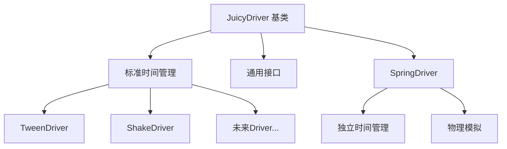

# JuicyMixer 混合时间管理策略重构文档

## 概述

本文档描述了 JuicyMixer 系统中驱动器时间管理的重构方案，旨在解决当前不同驱动器时间管理不一致的问题，同时保持系统的灵活性和扩展性。该重构采用混合策略，为不同类型的驱动器提供最适合的时间管理方式。

## 当前问题分析

### 现有时间管理实现

在当前的 JuicyMixer 系统中，各个驱动器采用了不同的时间管理策略：

1. **JuicyTweenDriver** - 使用内部时间状态管理
   - 在 `_property_states` 中为每个属性维护 `elapsed_time`
   - 在 `process()` 方法中更新时间状态
   - 基于时间进度计算补间动画

2. **JuicyShakeDriver** - 使用内部时间状态管理
   - 在 `_shake_states` 中为每个属性维护 `elapsed_time`
   - 基于时间进度计算震动效果
   - 使用 `context.current_time` 生成噪声值

3. **JuicySpringDriver** - 使用物理模拟时间管理
   - 基于 `effective_delta` 进行物理计算
   - 不依赖绝对时间，而是基于帧间增量
   - 通过物理稳定性判断完成状态

### 存在的问题

1. **不一致性**：不同驱动器使用不同的时间管理方式，增加了维护复杂度
2. **代码重复**：时间管理逻辑在多个驱动器中重复实现
3. **扩展困难**：新驱动器需要重新实现时间管理逻辑
4. **测试复杂**：不同的时间策略增加了测试和调试的难度

## 设计方案：分层时间管理

### 设计思路

采用**渐进式重构**策略，既保持系统稳定性，又为未来扩展提供灵活性。核心思路是在基类中提供标准时间管理接口，同时允许特定驱动器保持独立的时间管理策略。

### 架构设计



## 实施方案

### 1. JuicyDriver 基类增强

在 [`JuicyDriver`](addons/juicy_mixer/drivers/juicy_driver.gd) 中添加标准时间管理功能：

```gdscript
# 时间管理状态
var _driver_time_states: Dictionary = {}  # context_id -> {elapsed_time: float, start_time: float}

# 标准时间管理接口
func _initialize_driver_time(context: JuicyContext) -> void:
    """初始化驱动器时间状态"""
    var context_id = context.context_id
    _driver_time_states[context_id] = {
        "elapsed_time": 0.0,
        "start_time": Time.get_ticks_msec() / 1000.0
    }

func _update_driver_time(context: JuicyContext, delta: float) -> float:
    """更新驱动器时间并返回有效增量"""
    var context_id = context.context_id
    var time_state = _driver_time_states[context_id]
    
    var effective_delta = delta * context.time_scale
    time_state.elapsed_time += effective_delta
    
    return effective_delta

func _get_driver_elapsed_time(context: JuicyContext) -> float:
    """获取驱动器经过时间"""
    var context_id = context.context_id
    if not _driver_time_states.has(context_id):
        return 0.0
    return _driver_time_states[context_id].elapsed_time

func _is_time_based_complete(context: JuicyContext, target_duration: float) -> bool:
    """基于时间的完成判断"""
    var elapsed = _get_driver_elapsed_time(context)
    return elapsed >= target_duration - 0.001  # 1ms容差

func _cleanup_driver_time(context: JuicyContext) -> void:
    """清理驱动器时间状态"""
    _driver_time_states.erase(context.context_id)
```

### 2. TweenDriver 重构

修改 [`JuicyTweenDriver`](addons/juicy_mixer/drivers/juicy_tween_driver.gd) 使用基类时间管理：

```gdscript
func prepare(context: JuicyContext, delta: float, buffer: JuicyPropertyBuffer) -> void:
    # 现有逻辑...
    
    # 使用基类时间管理
    _initialize_driver_time(context)

func process(context: JuicyContext, delta: float, buffer: JuicyPropertyBuffer) -> void:
    var start_time = _start_execution_timer()
    
    # 使用基类时间管理
    var effective_delta = _update_driver_time(context, delta)
    
    # 检查是否所有补间属性都已完成
    var all_properties_complete = true
    
    # 处理每个补间属性
    for property in tween_properties.keys():
        var config = tween_properties[property]
        var state = _get_property_state(context, property)
        
        # 检查补间是否完成（使用基类时间）
        var total_duration = config.delay + config.duration
        var is_complete = _is_time_based_complete(context, total_duration)
        if not is_complete:
            all_properties_complete = false
        
        # 检查延迟
        if _get_driver_elapsed_time(context) < config.delay:
            continue
        
        # 计算补间进度（使用基类时间）
        var elapsed = _get_driver_elapsed_time(context)
        var effective_elapsed = max(0.0, elapsed - config.delay)
        var progress = clamp(effective_elapsed / config.duration, 0.0, 1.0)
        
        # 计算当前值
        var current_value = _interpolate_value(config, progress)
        
        # 更新状态
        state.current_value = current_value
        state.tween_progress = progress
        
        # 写入缓冲区
        _add_property_sample(buffer, context, property, current_value, JuicyPropertyBuffer.BlendMode.OVERRIDE_BASE)
    
    # 如果所有属性都已完成，标记上下文为完成
    if all_properties_complete:
        context.complete()
    
    _end_execution_timer(start_time)

func cleanup(context: JuicyContext) -> void:
    _cleanup_driver_time(context)
    # 现有清理逻辑...
```

### 3. ShakeDriver 重构

修改 [`JuicyShakeDriver`](addons/juicy_mixer/drivers/juicy_shake_driver.gd) 使用基类时间管理：

```gdscript
func prepare(context: JuicyContext, delta: float, buffer: JuicyPropertyBuffer) -> void:
    # 现有逻辑...
    
    # 使用基类时间管理
    _initialize_driver_time(context)

func process(context: JuicyContext, delta: float, buffer: JuicyPropertyBuffer) -> void:
    var start_time = _start_execution_timer()
    
    # 使用基类时间管理
    var effective_delta = _update_driver_time(context, delta)
    
    # 检查是否所有震动属性都已完成
    var all_properties_complete = true
    
    # 处理每个震动属性
    for property in shake_properties.keys():
        var config = shake_properties[property]
        var state = _get_shake_state(context, property)
        
        # 检查是否完成（使用基类时间）
        if not _is_time_based_complete(context, config.duration):
            all_properties_complete = false
        
        # 计算进度（使用基类时间）
        var progress = _get_driver_elapsed_time(context) / config.duration
        
        # 计算衰减系数
        var falloff_factor = _calculate_falloff_factor(progress, config)
        
        if falloff_factor <= 0.0:
            continue
        
        # 生成噪声值（使用 context.current_time 保持兼容性）
        var noise_value = _generate_noise_value(_noise_generators[property], context.current_time, config, property)
        
        # 应用振幅和衰减
        var shake_offset = _apply_amplitude_and_falloff(noise_value, config.amplitude, falloff_factor, property)
        
        # 计算偏移量差值
        var offset_delta = _calculate_offset_delta(state.last_offset, shake_offset, property)
        
        # 更新状态
        state.last_offset = shake_offset
        
        # 写入缓冲区
        _add_property_sample(buffer, context, property, offset_delta, JuicyPropertyBuffer.BlendMode.ADDITIVE)
    
    # 如果所有属性都已完成，标记上下文为完成
    if all_properties_complete:
        context.complete()
    
    _end_execution_timer(start_time)

func cleanup(context: JuicyContext) -> void:
    _cleanup_driver_time(context)
    # 现有清理逻辑...
```

### 4. SpringDriver 保持独立

[`JuicySpringDriver`](addons/juicy_mixer/drivers/juicy_spring_driver.gd) 保持现有的独立时间管理：

```gdscript
# 继续使用自己的时间管理
# 不调用基类的时间管理方法
# 保持物理模拟的独立性和精确性
```

## 实施步骤

### 第一阶段：修改 JuicyDriver 基类

1. 添加时间管理状态变量
2. 实现标准时间管理接口方法
3. 确保不影响现有功能

### 第二阶段：重构 TweenDriver

1. 修改 `prepare()` 方法，调用 `_initialize_driver_time()`
2. 修改 `process()` 方法，使用基类时间管理
3. 移除重复的时间逻辑
4. 修改 `cleanup()` 方法，调用 `_cleanup_driver_time()`
5. 测试功能正常

### 第三阶段：重构 ShakeDriver

1. 修改 `prepare()` 方法，调用 `_initialize_driver_time()`
2. 修改 `process()` 方法，使用基类时间管理
3. 保持与 Context 的兼容性
4. 修改 `cleanup()` 方法，调用 `_cleanup_driver_time()`
5. 测试功能正常

### 第四阶段：验证 SpringDriver

1. 验证 SpringDriver 正常工作
2. 确认物理模拟的精确性不受影响
3. 不进行修改，保持独立时间管理

## 方案优势

### 1. 渐进式重构

- ✅ **风险最小**：只修改需要修改的部分
- ✅ **向后兼容**：SpringDriver 继续正常工作
- ✅ **逐步验证**：可以逐个测试每个 Driver

### 2. 灵活性保持

- ✅ **SpringDriver**：保持物理模拟的精确性
- ✅ **Tween/ShakeDriver**：获得统一的时间管理
- ✅ **未来扩展**：新 Driver 可以选择使用基类时间管理或独立管理

### 3. 代码复用

- ✅ **统一接口**：所有时间相关的逻辑在基类中
- ✅ **减少重复**：避免每个 Driver 重复实现时间管理
- ✅ **一致性**：确保时间计算逻辑的一致性

## 技术细节

### 时间精度处理

所有时间相关计算都使用 1ms 容差来避免浮点精度问题：

```gdscript
func _is_time_based_complete(context: JuicyContext, target_duration: float) -> bool:
    var elapsed = _get_driver_elapsed_time(context)
    return elapsed >= target_duration - 0.001  # 1ms容差
```

### 时间缩放支持

基类时间管理自动支持 [`JuicyContext`](addons/juicy_mixer/core/juicy_context.gd) 的时间缩放：

```gdscript
func _update_driver_time(context: JuicyContext, delta: float) -> float:
    var effective_delta = delta * context.time_scale
    time_state.elapsed_time += effective_delta
    return effective_delta
```

### 状态隔离

每个 Context 都有独立的时间状态，避免多个效果之间的干扰：

```gdscript
var _driver_time_states: Dictionary = {}  # context_id -> {elapsed_time: float, start_time: float}
```

## 测试策略

### 单元测试

1. **基类时间管理测试**
   - 验证时间初始化
   - 验证时间更新逻辑
   - 验证时间完成判断

2. **TweenDriver 测试**
   - 验证补间动画正确性
   - 验证时间缩放支持
   - 验证多属性并行处理

3. **ShakeDriver 测试**
   - 验证震动效果正确性
   - 验证衰减函数
   - 验证噪声生成一致性

4. **SpringDriver 测试**
   - 验证物理模拟精确性
   - 验证稳定性判断
   - 确认不受重构影响

### 集成测试

1. **多 Driver 并行测试**
   - 验证不同 Driver 同时运行
   - 验证时间状态隔离
   - 验证完成状态正确性

2. **性能测试**
   - 验证重构后性能影响
   - 确认内存使用合理
   - 测试高频率调用场景

## 未来扩展

### 新 Driver 开发指南

新开发的 Driver 可以根据特性选择时间管理策略：

1. **基于时间的 Driver**（如动画、过渡效果）
   - 使用基类标准时间管理
   - 继承 `_initialize_driver_time()`、`_update_driver_time()` 等方法
   - 使用 `_is_time_based_complete()` 判断完成状态

2. **基于物理的 Driver**（如物理模拟、粒子系统）
   - 保持独立时间管理
   - 使用帧间增量进行计算
   - 基于物理状态判断完成条件

3. **混合型 Driver**
   - 可以结合两种策略
   - 在特定阶段使用不同的时间管理方式

### 可能的增强功能

1. **时间调试工具**
   - 可视化时间状态
   - 时间回放功能
   - 性能分析工具

2. **高级时间控制**
   - 时间缓动
   - 时间反转
   - 时间分段控制

3. **时间同步机制**
   - 多 Driver 时间同步
   - 网络时间同步
   - 全局时间管理器

## 总结

这个混合时间管理重构方案是**最佳的折中方案**：

1. **尊重现实**：SpringDriver 的物理模拟确实需要独立时间管理
2. **提供统一性**：Tween/ShakeDriver 获得统一的时间管理
3. **保持扩展性**：未来的 Driver 可以选择适合的时间管理策略
4. **降低风险**：渐进式重构，不会破坏现有功能

这种设计既解决了当前的不一致性问题，又为未来的扩展提供了灵活的基础架构。通过分层时间管理策略，我们实现了代码复用和一致性的提升，同时保持了系统的灵活性和可扩展性。

## 参考资料

- [`JuicyDriver`](addons/juicy_mixer/drivers/juicy_driver.gd) - 驱动器基类
- [`JuicyTweenDriver`](addons/juicy_mixer/drivers/juicy_tween_driver.gd) - 补间驱动器
- [`JuicyShakeDriver`](addons/juicy_mixer/drivers/juicy_shake_driver.gd) - 震动驱动器
- [`JuicySpringDriver`](addons/juicy_mixer/drivers/juicy_spring_driver.gd) - 弹簧驱动器
- [`JuicyContext`](addons/juicy_mixer/core/juicy_context.gd) - 数据载体和上下文管理