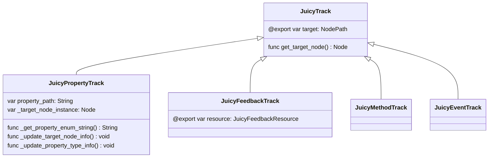
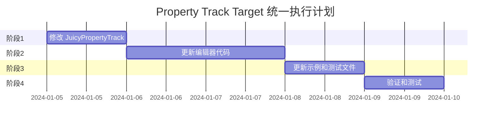

# Property Track 目标属性统一方案

## 1. 问题分析

### 当前状态
- **JuicyTrack基类**：定义了 `target: NodePath` 属性和 `get_target_node()` 方法
- **JuicyPropertyTrack**：定义了独立的 `target_node_path: NodePath` 属性
- **JuicyFeedbackTrack**：直接使用基类的 `target` 属性
- **JuicyMethodTrack**：直接使用基类的 `target` 属性
- **JuicyEventTrack**：直接使用基类的 `target` 属性

### 问题点
1. **不一致性**：Property Track 使用 `target_node_path`，其他 Track 使用 `target`
2. **冗余**：`target_node_path` 的 setter 会同步设置基类的 `target`，造成双重存储
3. **混淆**：编辑器代码需要处理两种不同的属性名

### 受影响的文件
- `addons/juicy_mixer/resources/juicy_property_track.gd`
- `addons/juicy_mixer/editor/juicy_timeline_editor.gd`
- `addons/juicy_mixer/editor/juicy_timeline_canvas.gd`
- `addons/juicy_mixer/editor/juicy_timeline_inspector.gd`
- `addons/juicy_mixer/examples/timeline_examples.gd`
- `addons/juicy_mixer/examples/timeline_performance_benchmark.gd`
- 各种测试文件

## 2. 设计方案

### 2.1 核心设计原则
1. **统一性**：所有 Track 类型都使用基类的 `target` 属性
2. **兼容性**：保留 Property Track 的动态属性下拉菜单功能
3. **平滑迁移**：提供向后兼容性，避免破坏现有资源

### 2.2 架构设计



### 2.3 实现策略

#### 阶段 1：修改 JuicyPropertyTrack
1. **移除 `target_node_path` 属性定义**
   - 删除独立的 `var target_node_path: NodePath` 声明
   - 保留 `_get_property_list()` 中的属性定义（改用 `target`）

2. **保留动态属性下拉菜单功能**
   - 继续使用 `_get_property_enum_string()` 生成属性枚举
   - 继续使用 `_update_target_node_info()` 获取节点实例
   - 继续使用 `_update_property_type_info()` 更新属性类型

3. **更新属性列表生成**
   ```gdscript
   func _get_property_list() -> Array[Dictionary]:
       var properties: Array[Dictionary] = []
       
       # 添加目标节点路径（使用基类的 target）
       properties.append({
           "name": "target",
           "type": TYPE_NODE_PATH,
           "hint": PROPERTY_HINT_NODE_PATH_VALID_TYPES,
           "hint_string": "Node",
           "default": NodePath(""),
           "usage": PROPERTY_USAGE_DEFAULT | PROPERTY_USAGE_EDITOR
       })
       
       # ... 其他属性 ...
   }
   ```

4. **添加向后兼容性支持**
   ```gdscript
   func _ready():
       # 迁移旧的 target_node_path 到新的 target
       if has_meta("legacy_target_node_path"):
           var legacy_path = get_meta("legacy_target_node_path")
           target = NodePath(legacy_path)
           remove_meta("legacy_target_node_path")
   ```

#### 阶段 2：更新编辑器代码
1. **juicy_timeline_editor.gd**
   - 将 `property_track.target_node_path` 改为 `property_track.target`
   - 将 `track.target_node_path` 改为 `track.target`

2. **juicy_timeline_canvas.gd**
   - 将 `track.target_node_path` 改为 `track.target`

3. **juicy_timeline_inspector.gd**
   - 更新自定义 UI 代码使用 `target` 属性

#### 阶段 3：更新示例和测试文件
1. **timeline_examples.gd**
   - 所有 `track.target_node_path` 改为 `track.target`

2. **timeline_performance_benchmark.gd**
   - 所有 `track.target_node_path` 改为 `track.target`

3. **测试文件**
   - 更新所有测试代码使用 `target` 属性

## 3. 详细实现步骤

### 步骤 1：修改 JuicyPropertyTrack

#### 1.1 移除 target_node_path 属性
```gdscript
# 删除或注释掉以下代码
# var target_node_path: NodePath = "":
#     set(value):
#         target_node_path = value
#         target = value
#         _update_target_node_info()
#         notify_property_list_changed()
#     get:
#         return target_node_path
```

#### 1.2 更新 _get_property_list()
```gdscript
func _get_property_list() -> Array[Dictionary]:
    var properties: Array[Dictionary] = []
    
    # 添加目标节点路径（使用基类的 target）
    properties.append({
        "name": "target",
        "type": TYPE_NODE_PATH,
        "hint": PROPERTY_HINT_NODE_PATH_VALID_TYPES,
        "hint_string": "Node",
        "default": NodePath(""),
        "usage": PROPERTY_USAGE_DEFAULT | PROPERTY_USAGE_EDITOR
    })
    
    # 添加属性路径选择器（使用枚举提示）
    var enum_string = _get_property_enum_string()
    properties.append({
        "name": "property_path",
        "type": TYPE_STRING,
        "hint": PROPERTY_HINT_ENUM if not enum_string.is_empty() else PROPERTY_HINT_NONE,
        "hint_string": enum_string if not enum_string.is_empty() else "",
        "default": "",
        "usage": PROPERTY_USAGE_DEFAULT | PROPERTY_USAGE_EDITOR
    })
    
    # ... 其他属性保持不变 ...
    
    return properties
```

#### 1.3 更新 _update_target_node_info()
```gdscript
func _update_target_node_info():
    _target_node_instance = null
    
    # 使用基类的 target 属性
    if target.is_empty():
        print("JuicyPropertyTrack: target为空，跳过节点获取")
        return
    
    # 在编辑器模式下获取节点实例
    if Engine.is_editor_hint():
        print("JuicyPropertyTrack: 尝试获取节点实例 - target: ", target)
        var editor_interface = Engine.get_singleton("EditorInterface")
        if editor_interface:
            var edited_root = editor_interface.get_edited_scene_root()
            if edited_root:
                print("JuicyPropertyTrack: edited_root: ", edited_root.get_path())
                var target_node_str = str(target)
                
                # 尝试直接获取节点
                _target_node_instance = edited_root.get_node_or_null(target)
                if _target_node_instance:
                    print("JuicyPropertyTrack: 成功获取节点（直接路径）: ", _target_node_instance.get_path(), " 类型: ", _target_node_instance.get_class())
                    _update_property_type_info()
                    notify_property_list_changed()
                    return
                else:
                    print("JuicyPropertyTrack: 直接路径获取失败，尝试绝对路径组合")
                
                # 如果直接获取失败，尝试组合绝对路径（支持相对路径）
                if target_node_str.begins_with("../"):
                    var root_path = edited_root.get_path()
                    var relative_part = target_node_str.substr(3)  # 移除 "../"
                    var absolute_path = str(root_path) + "/" + relative_part
                    print("JuicyPropertyTrack: 尝试绝对路径: ", absolute_path)
                    _target_node_instance = edited_root.get_node(absolute_path)
                    if _target_node_instance:
                        print("JuicyPropertyTrack: 成功获取节点（绝对路径）: ", _target_node_instance.get_path(), " 类型: ", _target_node_instance.get_class())
                        _update_property_type_info()
                        notify_property_list_changed()
                        return
                    else:
                        print("JuicyPropertyTrack: 绝对路径获取失败")
    
    if _target_node_instance:
        print("JuicyPropertyTrack: 节点实例已获取，更新属性类型信息")
        _update_property_type_info()
        notify_property_list_changed()
    else:
        print("JuicyPropertyTrack: 无法获取节点实例，通知编辑器更新属性列表")
        notify_property_list_changed()
```

#### 1.4 添加资源迁移支持
```gdscript
func _ready():
    # 迁移旧的 target_node_path 数据（从保存的元数据中）
    if has_meta("legacy_target_node_path"):
        var legacy_path = get_meta("legacy_target_node_path")
        target = NodePath(legacy_path)
        remove_meta("legacy_target_node_path")
        print("JuicyPropertyTrack: 已迁移旧的 target_node_path: ", legacy_path)
```

#### 1.5 更新序列化方法
```gdscript
func get_config_dict() -> Dictionary:
    var config = super.get_config_dict()
    
    # 添加属性轨道特有配置
    config["property_path"] = property_path
    config["value_range"] = {"x": value_range.x, "y": value_range.y}
    config["relative"] = relative
    config["blend_mode"] = BlendMode.keys()[blend_mode]
    config["use_absolute_time"] = use_absolute_time
    config["time_offset"] = time_offset
    config["time_scale"] = time_scale
    config["wrap_mode"] = wrap_mode
    config["use_parameter_mapping"] = use_parameter_mapping
    config["ease_preset"] = ease_preset
    
    return config

func load_from_dict(config_dict: Dictionary) -> bool:
    if not super.load_from_dict(config_dict):
        return false
    
    # 加载属性轨道特有配置
    if config_dict.has("property_path"):
        property_path = config_dict["property_path"]
    if config_dict.has("value_range"):
        var range_dict = config_dict["value_range"]
        value_range = Vector2(range_dict.get("x", 0.0), range_dict.get("y", 1.0))
    if config_dict.has("relative"):
        relative = config_dict["relative"]
    if config_dict.has("blend_mode"):
        var mode_name = config_dict["blend_mode"]
        for i in range(BlendMode.values().size()):
            if BlendMode.keys()[i] == mode_name:
                blend_mode = BlendMode.values()[i]
                break
    if config_dict.has("use_absolute_time"):
        use_absolute_time = config_dict["use_absolute_time"]
    if config_dict.has("time_offset"):
        time_offset = config_dict["time_offset"]
    if config_dict.has("time_scale"):
        time_scale = config_dict["time_scale"]
    if config_dict.has("wrap_mode"):
        wrap_mode = config_dict["wrap_mode"]
    if config_dict.has("use_parameter_mapping"):
        use_parameter_mapping = config_dict["use_parameter_mapping"]
    if config_dict.has("ease_preset"):
        ease_preset = config_dict["ease_preset"]
    
    # 向后兼容：尝试加载旧的 target_node_path
    if config_dict.has("target_node_path"):
        var old_path = config_dict["target_node_path"]
        target = NodePath(old_path)
        print("JuicyPropertyTrack: 从旧配置迁移 target_node_path: ", old_path)
    
    return true
```

### 步骤 2：更新编辑器代码

#### 2.1 juicy_timeline_editor.gd
```gdscript
# 将所有 target_node_path 引用改为 target

# 示例 1: 行 875
# 修改前:
# current_track.target_node_path = node_path
# 修改后:
current_track.target = node_path

# 示例 2: 行 1157
# 修改前:
# print("TimelineEditor: target_node_path = ", property_track.target_node_path)
# 修改后:
print("TimelineEditor: target = ", property_track.target)

# 示例 3: 行 1167
# 修改前:
# var display_path = property_track.target_node_path
# 修改后:
var display_path = property_track.target
```

#### 2.2 juicy_timeline_canvas.gd
```gdscript
# 将所有 target_node_path 引用改为 target

# 示例 1: 行 2159
# 修改前:
# print("TimelineCanvas: target_node_path = ", track.target_node_path)
# 修改后:
print("TimelineCanvas: target = ", track.target)

# 示例 2: 行 2160
# 修改前:
# if not track.target_node_path.is_empty():
# 修改后:
if not track.target.is_empty():
```

#### 2.3 juicy_timeline_inspector.gd
```gdscript
# 更新自定义 UI 代码

# 修改前:
# node_path_line.text = property_track.target_node_path if property_track.has_property("target_node_path") else ""
# node_path_line.text_changed.connect(func(text):
#     if property_track.has_property("target_node_path"):
#         property_track.target_node_path = text
# )

# 修改后:
node_path_line.text = property_track.target if not property_track.target.is_empty() else ""
node_path_line.text_changed.connect(func(text):
    property_track.target = NodePath(text)
)
)
```

### 步骤 3：更新示例和测试文件

#### 3.1 timeline_examples.gd
```gdscript
# 将所有 track.target_node_path 改为 track.target

# 示例:
# 修改前:
# scale_track.target_node_path = "Sprite2D"
# 修改后:
scale_track.target = "Sprite2D"
```

#### 3.2 timeline_performance_benchmark.gd
```gdscript
# 将所有 track.target_node_path 改为 track.target

# 示例:
# 修改前:
# track.target_node_path = "Sprite2D"
# 修改后:
track.target = "Sprite2D"
```

## 4. 验证计划

### 4.1 单元测试
1. 测试 Property Track 的 target 属性设置和获取
2. 测试动态属性下拉菜单功能
3. 测试向后兼容性（旧资源迁移）

### 4.2 集成测试
1. 测试 Timeline Driver 使用新的 target 属性
2. 测试编辑器 UI 正确显示和编辑 target
3. 测试所有 Track 类型的一致性

### 4.3 回归测试
1. 运行所有现有测试用例
2. 验证示例代码仍然正常工作
3. 验证资源序列化和反序列化

## 5. 风险和缓解措施

### 5.1 风险
1. **破坏性变更**：现有资源可能无法正确加载
2. **编辑器兼容性**：编辑器代码需要大量修改
3. **测试覆盖**：需要确保所有场景都被测试

### 5.2 缓解措施
1. **向后兼容性**：在 `load_from_dict()` 中添加旧属性迁移逻辑
2. **渐进式迁移**：先修改核心代码，再更新编辑器和示例
3. **充分测试**：在每个阶段完成后进行测试

## 6. 执行顺序



## 7. 总结

### 核心改动
1. **JuicyPropertyTrack**：移除 `target_node_path`，统一使用基类的 `target`
2. **编辑器代码**：更新所有 `target_node_path` 引用为 `target`
3. **示例和测试**：更新所有使用 `target_node_path` 的代码

### 保留功能
1. **动态属性下拉菜单**：Property Track 继续支持根据目标节点生成属性列表
2. **属性类型检测**：继续支持自动检测属性类型并调整值范围
3. **关键帧创建**：继续支持根据属性类型创建合适的关键帧

### 向后兼容性
1. **资源迁移**：在 `load_from_dict()` 中添加旧属性迁移逻辑
2. **元数据支持**：使用 `set_meta()` 和 `get_meta()` 处理遗留数据
3. **平滑过渡**：确保现有资源能够正确加载和转换
