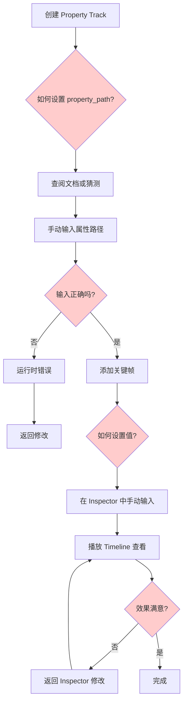
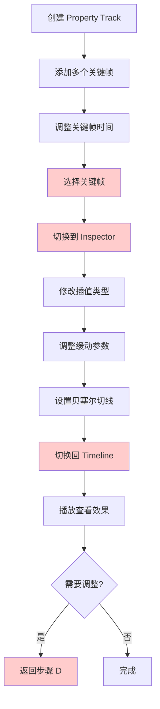
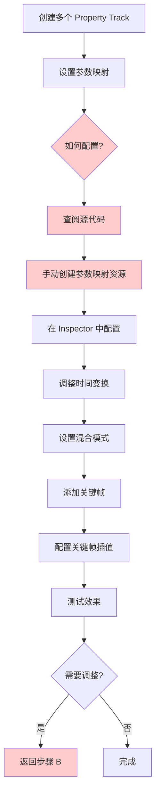
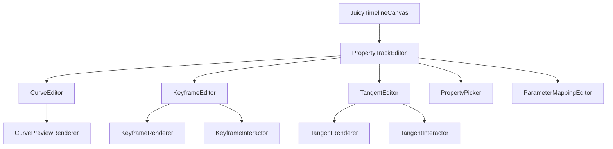

# Juicy Property Track 可用性改进分析文档

## 文档信息
- **文档版本**: 1.0
- **创建日期**: 2025-12-29
- **涉及文件**:
  - [`addons/juicy_mixer/resources/juicy_property_track.gd`](../addons/juicy_mixer/resources/juicy_property_track.gd)
  - [`addons/juicy_mixer/editor/juicy_timeline_editor.gd`](../addons/juicy_mixer/editor/juicy_timeline_editor.gd)
  - [`addons/juicy_mixer/editor/juicy_timeline_canvas.gd`](../addons/juicy_mixer/editor/juicy_timeline_canvas.gd)
  - [`addons/juicy_mixer/resources/juicy_keyframe.gd`](../addons/juicy_mixer/resources/juicy_keyframe.gd)

---

## 1. 系统概述

### 1.1 JuicyPropertyTrack 功能概述

[`JuicyPropertyTrack`](../addons/juicy_mixer/resources/juicy_property_track.gd) 是一个功能强大的属性轨道资源，支持以下核心功能：

| 功能类别 | 功能描述 | 当前编辑器支持情况 |
|---------|---------|------------------|
| **基础属性控制** | 通过 `property_path` 控制节点属性 | ❌ 需手动输入字符串 |
| **曲线模式** | 使用 `animation_curve` 定义值变化曲线 | ❌ 无可视化编辑器 |
| **关键帧模式** | 使用 `keyframes` 数组定义关键帧 | ⚠️ 仅支持添加/删除/移动 |
| **值范围映射** | 通过 `value_range` 映射曲线值到实际范围 | ❌ 无可视化表示 |
| **混合模式** | 支持 OVERRIDE_BASE/ADDITIVE/MULTIPLICATIVE | ❌ 无UI选择器 |
| **时间变换** | 时间偏移、缩放、循环模式 | ❌ 无可视化表示 |
| **缓动预设** | 内置4种缓动预设 | ❌ 无UI选择器 |
| **参数映射** | 复杂的参数映射系统 | ❌ 完全无UI支持 |

### 1.2 JuicyKeyframe 功能概述

[`JuicyKeyframe`](../addons/juicy_mixer/resources/juicy_keyframe.gd) 定义了关键帧的完整数据结构：

| 功能 | 描述 | 当前编辑器支持情况 |
|-----|------|------------------|
| **插值类型** | LINEAR/EASE_IN/EASE_OUT/EASE_IN_OUT/STEP/CUSTOM | ❌ 无法在UI中切换 |
| **缓动参数** | ease_in, ease_out, ease_power | ❌ 无法可视化调整 |
| **贝塞尔切线** | tangent_in, tangent_out, break_tangent | ❌ 完全无法编辑 |
| **关键帧锁定** | locked 属性 | ❌ 无UI开关 |
| **自定义插值** | custom_interpolation Callable | ❌ 无UI支持 |

### 1.3 当前编辑器交互流程

```mermaid
flowchart TD
    A[用户选择 Property Track] --> B[编辑器显示"添加关键帧"按钮]
    B --> C[点击按钮添加关键帧]
    C --> D[关键帧显示在时间轴上]
    D --> E{用户操作}
    E --> F[拖动关键帧改变时间]
    E --> G[按Delete键删除关键帧]
    E --> H[点击关键帧选中]
    H --> I[在Inspector中手动编辑属性]
    I --> J[无法直观看到变化效果]
```

---

## 2. 当前可用性问题分析

### 2.1 关键功能缺失

#### 2.1.1 曲线编辑器缺失 ⚠️ 严重

**问题描述**:
- [`JuicyPropertyTrack`](../addons/juicy_mixer/resources/juicy_property_track.gd:19) 支持使用 `animation_curve` 定义值变化
- 但在编辑器中完全没有可视化曲线编辑器
- 用户只能通过 Inspector 手动编辑 Curve 资源

**影响**:
- 用户无法直观地看到曲线形状
- 调整曲线需要在 Inspector 和 Timeline 之间来回切换
- 无法预览曲线在时间轴上的效果

**代码位置**:
- [`juicy_property_track.gd:19`](../addons/juicy_mixer/resources/juicy_property_track.gd:19) - `animation_curve` 属性定义
- [`juicy_timeline_canvas.gd:572-602`](../addons/juicy_mixer/editor/juicy_timeline_canvas.gd:572-602) - `_draw_property_track` 只绘制关键帧，不绘制曲线

#### 2.1.2 关键帧值编辑缺失 ⚠️ 严重

**问题描述**:
- 关键帧的 `value` 属性无法在时间轴上直接编辑
- 必须切换到 Inspector 中手动输入数值
- 没有直观的值范围可视化表示

**影响**:
- 工作流程被打断，需要在多个面板间切换
- 无法直观地看到值的变化趋势
- 缺少值的上下文（如当前值范围）

**代码位置**:
- [`juicy_keyframe.gd:21`](../addons/juicy_mixer/resources/juicy_keyframe.gd:21) - `value` 属性定义
- [`juicy_timeline_canvas.gd:763-814`](../addons/juicy_mixer/editor/juicy_timeline_canvas.gd:763-814) - `_draw_keyframe` 只绘制图标，不显示值

#### 2.1.3 插值类型可视化缺失 ⚠️ 严重

**问题描述**:
- [`JuicyKeyframe`](../addons/juicy_mixer/resources/juicy_keyframe.gd:10-17) 支持6种插值类型
- 但在编辑器中所有关键帧使用相同图标
- 无法直观区分不同插值类型的关键帧

**影响**:
- 用户无法快速识别关键帧的插值类型
- 必须点击关键帧并查看 Inspector 才能知道插值类型
- 容易在编辑过程中混淆

**代码位置**:
- [`juicy_keyframe.gd:10-17`](../addons/juicy_mixer/resources/juicy_keyframe.gd:10-17) - `InterpolationType` 枚举定义
- [`juicy_timeline_canvas.gd:817-853`](../addons/juicy_mixer/editor/juicy_timeline_canvas.gd:817-853) - `_get_keyframe_icon` 为所有类型返回相同图标

#### 2.1.4 贝塞尔切线编辑器缺失 ⚠️ 严重

**问题描述**:
- [`JuicyKeyframe`](../addons/juicy_mixer/resources/juicy_keyframe.gd:30-32) 支持贝塞尔切线控制
- 支持切线断开功能 (`break_tangent`)
- 但编辑器完全没有可视化切线编辑器

**影响**:
- 高级用户无法精确控制曲线形状
- 贝塞尔插值功能实际上不可用
- 无法实现平滑过渡效果

**代码位置**:
- [`juicy_keyframe.gd:30-32`](../addons/juicy_mixer/resources/juicy_keyframe.gd:30-32) - 切线属性定义
- [`juicy_keyframe.gd:133-142`](../addons/juicy_mixer/resources/juicy_keyframe.gd:133-142) - `get_bezier_control_points` 方法未被使用

### 2.2 用户界面问题

#### 2.2.1 属性路径输入不友好 ⚠️ 中等

**问题描述**:
- `property_path` 需要手动输入字符串（如 "scale", "modulate:a"）
- 没有属性选择器或自动补全
- 容易输入错误的属性路径

**影响**:
- 用户需要记忆节点属性路径
- 输入错误只能在运行时发现
- 新手用户上手困难

**代码位置**:
- [`juicy_property_track.gd:18`](../addons/juicy_mixer/resources/juicy_property_track.gd:18) - `property_path` 属性定义
- [`juicy_property_track.gd:42-44`](../addons/juicy_mixer/resources/juicy_property_track.gd:42-44) - 验证逻辑

#### 2.2.2 值范围设置不直观 ⚠️ 中等

**问题描述**:
- `value_range` 使用 Vector2 表示最小值和最大值
- 在 Inspector 中显示为两个数值，不够直观
- 没有可视化表示当前值在范围中的位置

**影响**:
- 用户难以理解值范围的概念
- 无法直观看到曲线值如何映射到实际值
- 调整值范围需要多次尝试

**代码位置**:
- [`juicy_property_track.gd:20`](../addons/juicy_mixer/resources/juicy_property_track.gd:20) - `value_range` 属性定义
- [`juicy_property_track.gd:106`](../addons/juicy_mixer/resources/juicy_property_track.gd:106) - 值范围映射逻辑

#### 2.2.3 缺少上下文菜单 ⚠️ 中等

**问题描述**:
- Property Track 的右键菜单只有"添加关键帧"和"删除轨道"
- 缺少常用操作的快捷方式
- 与 Feedback Track 的丰富右键菜单形成对比

**影响**:
- 用户需要记住键盘快捷键
- 常用操作需要多步完成
- 发现性差，用户可能不知道某些功能的存在

**代码位置**:
- [`juicy_timeline_canvas.gd:324-327`](../addons/juicy_mixer/editor/juicy_timeline_canvas.gd:324-327) - Property Track 右键菜单定义

### 2.3 工作流程问题

#### 2.3.1 多面板切换频繁 ⚠️ 严重

**问题描述**:
- 编辑关键帧需要在 Timeline Canvas 和 Inspector 之间频繁切换
- 每次调整都需要：
  1. 在 Timeline 中选择关键帧
  2. 切换到 Inspector 编辑属性
  3. 切换回 Timeline 查看效果
  4. 重复以上步骤

**影响**:
- 编辑效率低下
- 容易丢失上下文
- 用户体验不流畅

#### 2.3.2 缺少实时预览 ⚠️ 严重

**问题描述**:
- 编辑关键帧或曲线时无法实时预览效果
- 只能通过播放 Timeline 来查看最终效果
- 没有播放头位置的实时值显示

**影响**:
- 无法快速迭代调整
- 需要反复播放才能验证效果
- 调试困难

**代码位置**:
- [`juicy_timeline_editor.gd:339-348`](../addons/juicy_mixer/editor/juicy_timeline_editor.gd:339-348) - `_process` 只更新播放头，不显示值

#### 2.3.3 缺少批量操作 ⚠️ 中等

**问题描述**:
- 无法批量选择多个关键帧
- 无法批量移动、复制或删除关键帧
- 无法批量修改关键帧属性（如插值类型）

**影响**:
- 编辑大量关键帧时效率低下
- 无法保持关键帧间的相对关系
- 重复性工作多

#### 2.3.4 缺少撤销/重做支持 ⚠️ 中等

**问题描述**:
- 关键帧操作没有撤销/重做功能
- 误操作后无法恢复
- 与 Godot 编辑器的标准行为不一致

**影响**:
- 用户操作谨慎，影响效率
- 误操作成本高
- 用户体验差

### 2.4 高级功能不可用

#### 2.4.1 参数映射系统完全无UI ⚠️ 严重

**问题描述**:
- [`JuicyPropertyTrack`](../addons/juicy_mixer/resources/juicy_property_track.gd:31-33) 支持复杂的参数映射系统
- 可以映射时间、值、强度、偏移等多种属性
- 但完全没有可视化编辑器

**影响**:
- 高级功能实际上不可用
- 用户无法发现这些功能
- 系统设计意图无法实现

**代码位置**:
- [`juicy_property_track.gd:31-33`](../addons/juicy_mixer/resources/juicy_property_track.gd:31-33) - 参数映射属性定义
- [`juicy_property_track.gd:143-207`](../addons/juicy_mixer/resources/juicy_property_track.gd:143-207) - 参数映射逻辑

#### 2.4.2 时间变换无可视化 ⚠️ 中等

**问题描述**:
- 支持绝对时间、时间偏移、时间缩放、循环模式
- 但在时间轴上无法直观看到这些变换的效果
- 用户无法理解时间变换对关键帧的影响

**影响**:
- 高级用户难以使用这些功能
- 时间变换效果不直观
- 容易产生混淆

**代码位置**:
- [`juicy_property_track.gd:25-29`](../addons/juicy_mixer/resources/juicy_property_track.gd:25-29) - 时间变换属性定义
- [`juicy_property_track.gd:115-141`](../addons/juicy_mixer/resources/juicy_property_track.gd:115-141) - 时间变换逻辑

#### 2.4.3 混合模式无UI选择器 ⚠️ 中等

**问题描述**:
- 支持3种混合模式：OVERRIDE_BASE、ADDITIVE、MULTIPLICATIVE
- 但没有UI选择器，只能在 Inspector 中选择
- 用户可能不知道这些模式的存在

**影响**:
- 功能发现性差
- 需要文档支持才能使用
- 新手用户无法利用

**代码位置**:
- [`juicy_property_track.gd:11-15`](../addons/juicy_mixer/resources/juicy_property_track.gd:11-15) - `BlendMode` 枚举定义
- [`juicy_property_track.gd:22`](../addons/juicy_mixer/resources/juicy_property_track.gd:22) - `blend_mode` 属性定义

---

## 3. 用户工作流程痛点分析

### 3.1 新手用户工作流程



**痛点总结**:
1. 属性路径输入困难，容易出错
2. 值设置不直观，需要反复试错
3. 无法实时预览效果
4. 缺少引导和提示

### 3.2 高级用户工作流程



**痛点总结**:
1. 面板切换频繁
2. 贝塞尔切线无法可视化编辑
3. 无法批量操作关键帧
4. 缺少撤销/重做

### 3.3 复杂场景工作流程



**痛点总结**:
1. 参数映射完全无UI支持
2. 高级功能配置困难
3. 需要查阅源代码
4. 无法可视化配置

---

## 4. 改进建议清单

### 4.1 高优先级改进（严重问题）

#### 4.1.1 可视化曲线编辑器 🔴

**描述**: 在时间轴上为 Property Track 添加可视化曲线编辑器

**实现方案**:
```gdscript
# 在 JuicyTimelineCanvas 中添加曲线绘制
func _draw_property_track(track: JuicyPropertyTrack, track_rect: Rect2):
    # 绘制值范围背景
    _draw_value_range(track, track_rect)
    
    # 绘制曲线
    if track.keyframes.size() >= 2:
        _draw_keyframe_curve(track, track_rect)
    elif track.animation_curve:
        _draw_animation_curve(track, track_rect)
    
    # 绘制关键帧
    for keyframe in track.keyframes:
        _draw_keyframe(keyframe, track_rect)

func _draw_value_range(track: JuicyPropertyTrack, track_rect: Rect2):
    # 绘制值范围的背景区域
    var min_y = _value_to_screen(track.value_range.y, track_rect)
    var max_y = _value_to_screen(track.value_range.x, track_rect)
    var range_rect = Rect2(
        track_rect.position.x + track_name_width,
        min_y,
        track_rect.size.x - track_name_width,
        max_y - min_y
    )
    draw_rect(range_rect, Color(0.3, 0.3, 0.3, 0.3))
    
    # 绘制范围标记
    draw_string(ThemeDB.fallback_font, 
        Vector2(track_rect.position.x + track_name_width + 5, max_y + 10),
        str(track.value_range.x), HORIZONTAL_ALIGNMENT_LEFT, -1, 8, Color.GRAY)
    draw_string(ThemeDB.fallback_font,
        Vector2(track_rect.position.x + track_name_width + 5, min_y - 2),
        str(track.value_range.y), HORIZONTAL_ALIGNMENT_LEFT, -1, 8, Color.GRAY)

func _draw_keyframe_curve(track: JuicyPropertyTrack, track_rect: Rect2):
    var points = PackedVector2Array()
    var step = 1.0 / (track_rect.size.x / 10.0)  # 采样步长
    
    for i in range(0, 101):
        var t = i / 100.0
        var value = track.get_value_at_time(t, null)
        var x = track_rect.position.x + track_name_width + t * (track_rect.size.x - track_name_width)
        var y = _value_to_screen(value, track_rect)
        points.append(Vector2(x, y))
    
    if points.size() >= 2:
        draw_polyline(points, Color.CYAN, 2.0)

func _value_to_screen(value: float, track_rect: Rect2) -> float:
    # 将值映射到屏幕Y坐标
    # 假设值范围在 track.value_range 内
    var track = _get_track_from_rect(track_rect)
    if not track or not track is JuicyPropertyTrack:
        return track_rect.position.y + track_rect.size.y / 2
    
    var property_track = track as JuicyPropertyTrack
    var normalized = (value - property_track.value_range.x) / (property_track.value_range.y - property_track.value_range.x)
    return track_rect.position.y + track_rect.size.y * (1.0 - normalized)

func _screen_to_value(screen_y: float, track_rect: Rect2) -> float:
    # 将屏幕Y坐标映射到值
    var track = _get_track_from_rect(track_rect)
    if not track or not track is JuicyPropertyTrack:
        return 0.0
    
    var property_track = track as JuicyPropertyTrack
    var normalized = 1.0 - (screen_y - track_rect.position.y) / track_rect.size.y
    return property_track.value_range.x + normalized * (property_track.value_range.y - property_track.value_range.x)
```

**预期效果**:
- 用户可以直接在时间轴上看到曲线形状
- 可以直观地理解值范围的作用
- 曲线变化一目了然

**工作量**: 大

---

#### 4.1.2 关键帧值直接编辑 🔴

**描述**: 允许用户在时间轴上直接拖动关键帧来调整其值

**实现方案**:
```gdscript
# 在 JuicyTimelineCanvas 中添加关键帧值拖动
func _handle_mouse_motion(event: InputEventMouseMotion):
    # 现有的时间拖动逻辑
    if is_dragging and selected_keyframe:
        if drag_mode == 0:  # 时间拖动
            var new_time = _screen_to_time(event.position.x)
            if snap_enabled:
                new_time = _snap_time(new_time)
            
            if selected_track and selected_keyframe:
                selected_keyframe.time = new_time
                keyframe_moved.emit(selected_track, selected_keyframe, new_time)
                timeline_changed.emit()
                queue_redraw()
        elif drag_mode == 1:  # 值拖动
            var track_rect = _get_track_rect(selected_track)
            var new_value = _screen_to_value(event.position.y, track_rect)
            
            if selected_track and selected_keyframe and selected_track is JuicyPropertyTrack:
                var property_track = selected_track as JuicyPropertyTrack
                # 限制在值范围内
                new_value = clamp(new_value, property_track.value_range.x, property_track.value_range.y)
                selected_keyframe.value = new_value
                timeline_changed.emit()
                queue_redraw()
        return

func _handle_left_click(pos: Vector2):
    # 检查是否点击了关键帧
    var track_index = _get_track_at_position(pos.y)
    if track_index >= 0:
        var track = _get_track_by_index(track_index)
        if track:
            var keyframe = _get_keyframe_at_position(track, pos.x)
            if keyframe:
                # 检查是点击关键帧中心（时间）还是上下边缘（值）
                var keyframe_screen_pos = Vector2(
                    _time_to_screen(keyframe.time),
                    _get_keyframe_screen_y(keyframe, track)
                )
                
                selected_track = track
                selected_keyframe = keyframe
                is_dragging = true
                drag_start_pos = pos
                
                # 判断拖动模式
                if abs(pos.y - keyframe_screen_pos.y) < 5.0:
                    drag_mode = 0  # 时间拖动
                else:
                    drag_mode = 1  # 值拖动
                
                keyframe_selected.emit(track, keyframe)
                queue_redraw()
                return
```

**预期效果**:
- 用户可以直接在时间轴上拖动关键帧调整值
- 编辑流程更流畅
- 值的变化直观可见

**工作量**: 中

---

#### 4.1.3 插值类型可视化切换 🔴

**描述**: 为不同插值类型的关键帧使用不同的图标，并提供快捷切换方式

**实现方案**:
```gdscript
# 在 JuicyTimelineCanvas 中改进图标获取
func _get_keyframe_icon(keyframe: JuicyKeyframe) -> Texture2D:
    var icon_name = "KeyValue"  # 默认图标
    
    if keyframe == selected_keyframe:
        icon_name = "KeySelected"
    else:
        match keyframe.interpolation:
            JuicyKeyframe.InterpolationType.LINEAR:
                icon_name = "KeyLinear"
            JuicyKeyframe.InterpolationType.EASE_IN:
                icon_name = "KeyEaseIn"
            JuicyKeyframe.InterpolationType.EASE_OUT:
                icon_name = "KeyEaseOut"
            JuicyKeyframe.InterpolationType.EASE_IN_OUT:
                icon_name = "KeyEaseInOut"
            JuicyKeyframe.InterpolationType.STEP:
                icon_name = "KeyStep"
            JuicyKeyframe.InterpolationType.CUSTOM:
                icon_name = "KeyCustom"
    
    var icon = get_theme_icon(icon_name, "EditorIcons")
    if not icon:
        return _create_keyframe_icon(keyframe)
    
    return icon

# 创建不同形状的关键帧图标
func _create_keyframe_icon(keyframe: JuicyKeyframe) -> Texture2D:
    var size = 16
    var image = Image.create(size, size, false, Image.FORMAT_RGBA8)
    image.fill(Color.TRANSPARENT)
    
    var color = keyframe_selected_color if keyframe == selected_keyframe else keyframe_color
    
    match keyframe.interpolation:
        JuicyKeyframe.InterpolationType.LINEAR:
            # 菱形
            _draw_diamond_shape(image, size, color)
        JuicyKeyframe.InterpolationType.EASE_IN:
            # 三角形（指向右）
            _draw_triangle_shape(image, size, color, false)
        JuicyKeyframe.InterpolationType.EASE_OUT:
            # 三角形（指向左）
            _draw_triangle_shape(image, size, color, true)
        JuicyKeyframe.InterpolationType.EASE_IN_OUT:
            # 圆形
            _draw_circle_shape(image, size, color)
        JuicyKeyframe.InterpolationType.STEP:
            # 正方形
            _draw_square_shape(image, size, color)
        JuicyKeyframe.InterpolationType.CUSTOM:
            # 星形
            _draw_star_shape(image, size, color)
    
    var texture = ImageTexture.new()
    texture.set_image(image)
    return texture

# 在右键菜单中添加插值类型切换
func _handle_right_click(pos: Vector2):
    var context_menu = PopupMenu.new()
    
    # ... 现有代码 ...
    
    if selected_keyframe and selected_track is JuicyPropertyTrack:
        context_menu.add_separator()
        context_menu.add_item("插值类型", 100)
        context_menu.add_item("  线性", 101)
        context_menu.add_item("  缓入", 102)
        context_menu.add_item("  缓出", 103)
        context_menu.add_item("  缓入缓出", 104)
        context_menu.add_item("  阶跃", 105)
        context_menu.add_item("  自定义", 106)
    
    context_menu.id_pressed.connect(func(id: int):
        match id:
            101: selected_keyframe.interpolation = JuicyKeyframe.InterpolationType.LINEAR
            102: selected_keyframe.interpolation = JuicyKeyframe.InterpolationType.EASE_IN
            103: selected_keyframe.interpolation = JuicyKeyframe.InterpolationType.EASE_OUT
            104: selected_keyframe.interpolation = JuicyKeyframe.InterpolationType.EASE_IN_OUT
            105: selected_keyframe.interpolation = JuicyKeyframe.InterpolationType.STEP
            106: selected_keyframe.interpolation = JuicyKeyframe.InterpolationType.CUSTOM
        timeline_changed.emit()
        queue_redraw()
    )
```

**预期效果**:
- 用户可以通过图标快速识别插值类型
- 右键菜单提供快捷切换方式
- 提高编辑效率

**工作量**: 中

---

#### 4.1.4 贝塞尔切线编辑器 🔴

**描述**: 为关键帧添加贝塞尔切线编辑器，支持拖动切线手柄

**实现方案**:
```gdscript
# 在 JuicyTimelineCanvas 中添加切线绘制和编辑
func _draw_keyframe(keyframe: JuicyKeyframe, track_rect: Rect2):
    var x = _time_to_screen(keyframe.time)
    var y = _value_to_screen(keyframe.value, track_rect)
    
    # 绘制切线（如果关键帧被选中）
    if keyframe == selected_keyframe and keyframe.interpolation != JuicyKeyframe.InterpolationType.LINEAR:
        _draw_tangent_handles(keyframe, Vector2(x, y), track_rect)
    
    # 绘制关键帧图标
    var icon = _get_keyframe_icon(keyframe)
    if icon:
        var icon_rect = Rect2(x - 8, y - 8, 16, 16)
        draw_texture_rect(icon, icon_rect, false)
    else:
        _draw_diamond(Vector2(x, y), 8, keyframe == selected_keyframe)

func _draw_tangent_handles(keyframe: JuicyKeyframe, pos: Vector2, track_rect: Rect2):
    # 计算切线手柄位置
    var handle_length = 30.0
    var in_handle_pos = pos + Vector2(-handle_length, -keyframe.tangent_in * handle_length)
    var out_handle_pos = pos + Vector2(handle_length, keyframe.tangent_out * handle_length)
    
    # 绘制切线线
    draw_line(pos, in_handle_pos, Color.YELLOW, 1.0)
    draw_line(pos, out_handle_pos, Color.YELLOW, 1.0)
    
    # 绘制切线手柄
    _draw_tangent_handle(in_handle_pos, true)
    _draw_tangent_handle(out_handle_pos, false)

func _draw_tangent_handle(pos: Vector2, is_in: bool):
    var size = 6.0
    var handle_color = Color.CYAN if is_in else Color.MAGENTA
    draw_circle(pos, size, handle_color)

func _get_tangent_handle_at_position(pos: Vector2, keyframe: JuicyKeyframe, track_rect: Rect2) -> int:
    # 返回: 0=无, 1=入切线, 2=出切线
    var keyframe_pos = Vector2(
        _time_to_screen(keyframe.time),
        _value_to_screen(keyframe.value, track_rect)
    )
    var handle_length = 30.0
    var in_handle_pos = keyframe_pos + Vector2(-handle_length, -keyframe.tangent_in * handle_length)
    var out_handle_pos = keyframe_pos + Vector2(handle_length, keyframe.tangent_out * handle_length)
    
    if pos.distance_to(in_handle_pos) < 10.0:
        return 1
    elif pos.distance_to(out_handle_pos) < 10.0:
        return 2
    return 0

func _handle_left_click(pos: Vector2):
    # 检查是否点击了切线手柄
    if selected_keyframe and selected_track is JuicyPropertyTrack:
        var track_rect = _get_track_rect(selected_track)
        var handle = _get_tangent_handle_at_position(pos, selected_keyframe, track_rect)
        if handle > 0:
            is_dragging = true
            drag_mode = 2  # 切线拖动
            tangent_handle_type = handle
            return
    
    # ... 现有代码 ...

func _handle_mouse_motion(event: InputEventMouseMotion):
    # 切线拖动逻辑
    if is_dragging and drag_mode == 2 and selected_keyframe:
        var track_rect = _get_track_rect(selected_track)
        var keyframe_pos = Vector2(
            _time_to_screen(selected_keyframe.time),
            _value_to_screen(selected_keyframe.value, track_rect)
        )
        
        var dx = event.position.x - keyframe_pos.x
        var dy = event.position.y - keyframe_pos.y
        
        if tangent_handle_type == 1:  # 入切线
            selected_keyframe.tangent_in = -dy / abs(dx) if dx != 0 else 0
            if not selected_keyframe.break_tangent:
                selected_keyframe.tangent_out = selected_keyframe.tangent_in
        else:  # 出切线
            selected_keyframe.tangent_out = dy / abs(dx) if dx != 0 else 0
            if not selected_keyframe.break_tangent:
                selected_keyframe.tangent_in = selected_keyframe.tangent_out
        
        timeline_changed.emit()
        queue_redraw()
        return
    
    # ... 现有代码 ...
```

**预期效果**:
- 高级用户可以精确控制曲线形状
- 贝塞尔插值功能可用
- 实现平滑过渡效果

**工作量**: 大

---

### 4.2 中优先级改进（中等问题）

#### 4.2.1 属性路径选择器 🟡

**描述**: 为 `property_path` 添加属性选择器，支持浏览和选择节点属性，并根据选择的属性类型自动调整值范围设置

**设计思路**:
参考 [`set_property_value.gd`](../addons/bricks/instructions/set_property_value.gd) 的实现方式，创建一个专门用于 juicy_mixer 的 `JuicyPropertyManager` 类，用于：
1. 获取目标节点的数值类型属性（Property Track 主要控制数值属性）
2. 过滤出可写属性
3. 提供属性验证和类型检测功能
4. 动态生成属性选择下拉菜单
5. 根据选择的属性类型自动调整 `value_range` 的默认值

**实现方案**:

##### 步骤1: 创建 JuicyPropertyManager 类

创建新文件 [`addons/juicy_mixer/utils/juicy_property_manager.gd`](../addons/juicy_mixer/utils/juicy_property_manager.gd):

```gdscript
@tool
class_name JuicyPropertyManager
extends RefCounted

## Juicy属性管理器
## 专门为Property Track提供属性发现、过滤和验证功能

## 缓存系统
static var _property_cache: Dictionary = {}

## 属性过滤器
enum PropertyFilter {
    ALL,                ## 所有属性
    NUMERIC_ONLY,        ## 仅数值属性（int, float）
    WRITABLE_ONLY,       ## 仅可写属性
    EXPORTED_ONLY        ## 仅导出属性
}

## 获取节点的所有属性信息
static func get_all_properties(node: Node) -> Array[Dictionary]:
    if node == null:
        return []
    
    var cache_key = str(node.get_instance_id())
    if _property_cache.has(cache_key):
        return _property_cache[cache_key]
    
    var properties: Array[Dictionary] = []
    var property_list = node.get_property_list()
    
    for prop_dict in property_list:
        var property_info = _create_property_info(prop_dict)
        properties.append(property_info)
    
    # 缓存结果
    _property_cache[cache_key] = properties
    
    return properties

## 创建属性信息字典
static func _create_property_info(prop_dict: Dictionary) -> Dictionary:
    return {
        "name": prop_dict.get("name", ""),
        "type": prop_dict.get("type", TYPE_NIL),
        "hint": prop_dict.get("hint", PROPERTY_HINT_NONE),
        "hint_string": prop_dict.get("hint_string", ""),
        "usage": prop_dict.get("usage", PROPERTY_USAGE_DEFAULT),
        "default_value": prop_dict.get("default", null),
        "is_writable": _is_property_writable(prop_dict),
        "is_numeric": _is_property_numeric(prop_dict),
        "is_exported": _is_property_exported(prop_dict)
    }

## 检查属性是否可写
static func _is_property_writable(prop_dict: Dictionary) -> bool:
    var usage = prop_dict.get("usage", PROPERTY_USAGE_DEFAULT)
    return (usage & PROPERTY_USAGE_STORAGE) != 0 and (usage & PROPERTY_USAGE_READ_ONLY) == 0

## 检查属性是否为数值类型
static func _is_property_numeric(prop_dict: Dictionary) -> bool:
    var type = prop_dict.get("type", TYPE_NIL)
    return type in [TYPE_INT, TYPE_FLOAT]

## 检查属性是否已导出
static func _is_property_exported(prop_dict: Dictionary) -> bool:
    var usage = prop_dict.get("usage", PROPERTY_USAGE_DEFAULT)
    return (usage & PROPERTY_USAGE_EDITOR) != 0

## 获取节点的数值属性
static func get_numeric_properties(node: Node) -> Array[Dictionary]:
    return get_filtered_properties(node, PropertyFilter.NUMERIC_ONLY)

## 获取节点的可写属性
static func get_writable_properties(node: Node) -> Array[Dictionary]:
    return get_filtered_properties(node, PropertyFilter.WRITABLE_ONLY)

## 根据过滤器获取属性
static func get_filtered_properties(node: Node, filter: PropertyFilter) -> Array[Dictionary]:
    var all_properties = get_all_properties(node)
    var filtered_properties: Array[Dictionary] = []
    
    for property_info in all_properties:
        if _passes_filter(property_info, filter):
            filtered_properties.append(property_info)
    
    return filtered_properties

## 检查属性是否通过过滤器
static func _passes_filter(property_info: Dictionary, filter: PropertyFilter) -> bool:
    match filter:
        PropertyFilter.ALL:
            return _is_valid_property(property_info)
        PropertyFilter.NUMERIC_ONLY:
            return property_info.is_numeric and _is_valid_property(property_info)
        PropertyFilter.WRITABLE_ONLY:
            return property_info.is_writable and _is_valid_property(property_info)
        PropertyFilter.EXPORTED_ONLY:
            return property_info.is_exported and _is_valid_property(property_info)
        _:
            return _is_valid_property(property_info)

## 检查属性是否有效
static func _is_valid_property(property_info: Dictionary) -> bool:
    var name = property_info.get("name", "")
    
    # 排除空属性名
    if name.is_empty():
        return false
    
    # 排除内部属性（以下划线开头）
    if name.begins_with("_"):
        return false
    
    # 排除类型名属性（全大写或首字母大写且无小写）
    if _looks_like_type_name(name):
        return false
    
    # 排除常见的非设置table属性
    var non_settable_names = [
        "Transform", "Rect2", "Vector2", "Vector3", "Color",
        "String", "int", "float", "bool", "Array", "Dictionary"
    ]
    
    if name in non_settable_names:
        return false
    
    # 检查属性类型是否有效
    var type = property_info.get("type", TYPE_NIL)
    if type == TYPE_NIL:
        return false
    
    return true

## 检查属性名是否像类型名
static func _looks_like_type_name(name: String) -> bool:
    # 如果全是小写，可能是实际属性
    if name == name.to_lower():
        return false
    
    # 如果包含下划线，可能是实际属性
    if name.contains("_"):
        return false
    
    # 如果首字母大写且后面没有小写字母，可能是类型名
    if name.length() > 0 and name[0].to_upper() == name[0] and name.substr(1).to_upper() == name.substr(1):
        return true
    
    return false

## 查找指定属性
static func find_property(node: Node, property_name: String) -> Dictionary:
    var properties = get_all_properties(node)
    
    for property_info in properties:
        if property_info.name == property_name:
            return property_info
    
    return {}

## 检查属性是否存在
static func has_property(node: Node, property_name: String) -> bool:
    return not find_property(node, property_name).is_empty()

## 检查属性是否可写
static func is_property_writable(node: Node, property_name: String) -> bool:
    var property_info = find_property(node, property_name)
    return not property_info.is_empty() and property_info.is_writable

## 验证属性值
static func validate_property_value(node: Node, property_name: String, value: Variant) -> Dictionary:
    var property_info = find_property(node, property_name)
    if property_info.is_empty():
        return {"valid": false, "error": "属性不存在: " + property_name}
    
    if not property_info.is_writable:
        return {"valid": false, "error": "属性不可写: " + property_name}
    
    # 检查类型兼容性
    var expected_type = property_info.type
    var actual_type = typeof(value)
    
    if expected_type != actual_type:
        # 尝试类型转换
        var converted_value = _convert_value(value, expected_type)
        if converted_value == null:
            return {"valid": false, "error": "类型不兼容: 期望 %s, 实际 %s" % [type_string(expected_type), type_string(actual_type)]}
        
        return {"valid": true, "converted_value": converted_value}
    
    return {"valid": true, "converted_value": value}

## 转换值类型
static func _convert_value(value: Variant, target_type: int) -> Variant:
    match target_type:
        TYPE_INT:
            return int(value)
        TYPE_FLOAT:
            return float(value)
        TYPE_STRING:
            return str(value)
        TYPE_BOOL:
            return bool(value)
        _:
            return null

## 安全设置属性值
static func set_property_safe(node: Node, property_name: String, value: Variant) -> Dictionary:
    var validation = validate_property_value(node, property_name, value)
    if not validation.valid:
        return {"success": false, "error": validation.error}
    
    var converted_value = validation.get("converted_value", value)
    node.set(property_name, converted_value)
    
    return {"success": true, "value": converted_value}

## 获取属性默认值范围
static func get_default_value_range(property_type: int) -> Vector2:
    match property_type:
        TYPE_INT:
            return Vector2(0, 100)
        TYPE_FLOAT:
            return Vector2(0.0, 1.0)
        _:
            return Vector2(0.0, 1.0)

## 获取属性值范围提示字符串
static func get_value_range_hint_string(property_type: int) -> String:
    match property_type:
        TYPE_INT:
            return "-1000,1000,1"  # 最小值,最大值,步长
        TYPE_FLOAT:
            return "-1000,1000,0.01"
        _:
            return ""

## 清除指定节点的缓存
static func clear_cache(node: Node):
    if node == null:
        return
    
    var cache_key = str(node.get_instance_id())
    _property_cache.erase(cache_key)

## 清除所有缓存
static func clear_all_cache():
    _property_cache.clear()
```

##### 步骤2: 在 JuicyPropertyTrack 中添加属性类型检测

```gdscript
# 在 JuicyPropertyTrack 中添加
var _target_node_instance: Node = null
var _current_property_info: Dictionary = {}
var _current_property_type: int = TYPE_NIL
var _current_property_hint: int = PROPERTY_HINT_NONE
var _current_property_hint_string: String = ""

# 修改 property_path 的 setter，自动更新属性类型信息
var property_path: String = "":
    set(value):
        property_path = value
        _update_property_type_info()
        _adjust_value_range_for_property_type()
        notify_property_list_changed()

# 添加目标节点路径（用于获取节点实例）
var target_node_path: NodePath = "":
    set(value):
        target_node_path = value
        _update_target_node_info()
        notify_property_list_changed()

# 获取目标节点实例
func _update_target_node_info():
    _target_node_instance = null
    
    if target_node_path.is_empty():
        return
    
    # 在编辑器模式下获取节点实例
    if Engine.is_editor_hint():
        var editor_interface = Engine.get_singleton("EditorInterface")
        if editor_interface:
            var edited_root = editor_interface.get_edited_scene_root()
            if edited_root:
                _target_node_instance = edited_root.get_node_or_null(target_node_path)
                if _target_node_instance:
                    _update_property_type_info()

# 更新属性类型信息
func _update_property_type_info():
    _current_property_info = {}
    _current_property_type = TYPE_NIL
    _current_property_hint = PROPERTY_HINT_NONE
    _current_property_hint_string = ""
    
    if _target_node_instance == null or property_path.is_empty():
        return
    
    # 使用 JuicyPropertyManager 获取属性信息
    _current_property_info = JuicyPropertyManager.find_property(_target_node_instance, property_path)
    
    if not _current_property_info.is_empty():
        _current_property_type = _current_property_info.type
        _current_property_hint = _current_property_info.hint
        _current_property_hint_string = _current_property_info.hint_string

# 根据属性类型调整值范围
func _adjust_value_range_for_property_type():
    if _current_property_info.is_empty():
        return
    
    # 使用 JuicyPropertyManager 获取默认值范围
    value_range = JuicyPropertyManager.get_default_value_range(_current_property_type)

# 获取属性列表用于编辑器显示
func _get_property_list() -> Array[Dictionary]:
    var properties: Array[Dictionary] = []
    
    # 添加目标节点路径
    properties.append({
        "name": "target_node_path",
        "type": TYPE_NODE_PATH,
        "hint": PROPERTY_HINT_NODE_PATH_VALID_TYPES,
        "hint_string": "Node",
        "default": NodePath("")
    })
    
    # 添加属性路径选择器（使用枚举提示）
    var enum_string = _get_property_enum_string()
    properties.append({
        "name": "property_path",
        "type": TYPE_STRING,
        "hint": PROPERTY_HINT_ENUM,
        "hint_string": enum_string,
        "default": ""
    })
    
    # 动态添加值范围属性（根据属性类型调整提示）
    var value_range_property = {
        "name": "value_range",
        "type": TYPE_VECTOR2,
        "hint": PROPERTY_HINT_RANGE,
        "hint_string": JuicyPropertyManager.get_value_range_hint_string(_current_property_type),
        "default": JuicyPropertyManager.get_default_value_range(_current_property_type)
    }
    properties.append(value_range_property)
    
    return properties

# 获取属性枚举字符串（用于下拉菜单）
func _get_property_enum_string() -> String:
    if _target_node_instance == null:
        return "请先选择目标节点"
    
    # 使用 JuicyPropertyManager 获取数值类型的可写属性
    var property_infos = JuicyPropertyManager.get_numeric_properties(_target_node_instance)
    var property_names = []
    
    for prop_info in property_infos:
        # 过滤掉内部属性和不适用的属性
        if not prop_info.name.begins_with("_") and _is_valid_property_for_track(prop_info):
            property_names.append(prop_info.name)
    
    if property_names.is_empty():
        return "无可用的数值属性"
    
    return ",".join(property_names)

# 检查属性是否适用于 Property Track
func _is_valid_property_for_track(prop_info: Dictionary) -> bool:
    # Property Track 主要用于控制数值属性
    return prop_info.is_numeric

# 添加属性验证
func _validate_property(property: Dictionary) -> void:
    """验证属性值"""
    if property.name == "value_range":
        # 验证值范围的有效性
        if value_range.x >= value_range.y:
            push_warning("值范围的最小值不能大于或等于最大值")
```

##### 步骤3: 在 JuicyTimelineEditor 中添加目标节点选择器

```gdscript
# 在 JuicyTimelineEditor 中添加目标节点选择器
func _create_property_track_actions(editor_theme: Theme, track: JuicyPropertyTrack):
    # 现有的添加关键帧按钮
    var add_keyframe_button = Button.new()
    add_keyframe_button.icon = editor_theme.get_icon("KeyNext", "EditorIcons")
    add_keyframe_button.tooltip_text = "在播放头位置添加关键帧"
    add_keyframe_button.custom_minimum_size = Vector2(30, 0)
    add_keyframe_button.pressed.connect(_on_add_keyframe_pressed)
    context_actions_container.add_child(add_keyframe_button)
    
    # 添加目标节点选择器按钮
    var node_picker_button = Button.new()
    node_picker_button.icon = editor_theme.get_icon("Node", "EditorIcons")
    node_picker_button.tooltip_text = "选择目标节点"
    node_picker_button.custom_minimum_size = Vector2(30, 0)
    node_picker_button.pressed.connect(_on_target_node_picker_pressed.bind(track))
    context_actions_container.add_child(node_picker_button)

func _on_target_node_picker_pressed(track: JuicyPropertyTrack):
    """打开目标节点选择器"""
    # 获取当前编辑的场景
    var editor_interface = Engine.get_singleton("EditorInterface")
    var edited_root = editor_interface.get_edited_scene_root()
    
    if edited_root:
        # 创建节点树对话框
        var node_dialog = AcceptDialog.new()
        node_dialog.title = "选择目标节点"
        node_dialog.size = Vector2(400, 500)
        
        var tree = Tree.new()
        tree.set_columns(1)
        tree.set_column_titles_visible(false)
        tree.size_flags_vertical = Control.SIZE_EXPAND_FILL
        node_dialog.add_child(tree)
        
        # 填充节点树
        _populate_node_tree(tree, edited_root)
        
        node_dialog.add_button("确定", true)
        node_dialog.add_button("取消", false)
        
        node_dialog.confirmed.connect(func():
            var selected = tree.get_selected()
            if selected:
                var node_path = selected.get_metadata(0)
                track.target_node_path = node_path
                timeline_changed.emit(current_timeline)
        )
        
        get_tree().current_scene.add_child(node_dialog)
        node_dialog.popup_centered()

func _populate_node_tree(tree: Tree, node: Node, parent_item: TreeItem = null):
    """递归填充节点树"""
    var item = tree.create_item(parent_item)
    item.set_text(0, node.name)
    item.set_metadata(0, node.get_path())
    
    # 添加子节点
    for child in node.get_children():
        _populate_node_tree(tree, child, item)
```

**预期效果**:
1. 用户可以通过下拉菜单选择目标节点
2. 选择节点后，自动显示该节点的所有数值类型属性
3. 选择属性后，自动根据属性类型调整 `value_range` 的默认值
4. 用户可以方便地修改值范围，系统会根据属性类型提供合适的提示
5. 减少输入错误，提高发现性

**参考实现**:
- [`set_property_value.gd`](../addons/bricks/instructions/set_property_value.gd:135-140) - 使用 `PropertyManager.get_writable_properties()` 获取可写属性
- [`set_property_value.gd`](../addons/bricks/instructions/set_property_value.gd:156-164) - 使用 `PROPERTY_HINT_ENUM` 和枚举字符串创建下拉菜单
- [`set_property_value.gd`](../addons/bricks/instructions/set_property_value.gd:204-217) - 动态生成属性枚举字符串
- [`set_property_value.gd`](../addons/bricks/instructions/set_property_value.gd:115-132) - 使用 `PropertyManager.find_property()` 获取属性信息并更新类型

**工作量**: 中（需要创建新的 JuicyPropertyManager 类）

---

#### 4.2.2 实时预览和值显示 🟡

**描述**: 在播放头位置显示当前值，并支持实时预览编辑效果

**实现方案**:
```gdscript
# 在 JuicyTimelineCanvas 中添加值显示
func _draw_playback_head():
    var x = _time_to_screen(playback_head_position)
    
    if x >= 0 and x <= size.x:
        draw_line(Vector2(x, 0), Vector2(x, size.y), playback_head_color, playback_head_width)
        
        # 在每个 Property Track 上显示当前值
        if current_timeline:
            var all_tracks = current_timeline.get_all_tracks()
            for track in all_tracks:
                if track is JuicyPropertyTrack:
                    var track_rect = _get_track_rect(track)
                    if track_rect.has_point(Vector2(x, track_rect.position.y + track_rect.size.y / 2)):
                        var value = track.get_value_at_time(playback_head_position, null)
                        _draw_value_tooltip(Vector2(x + 5, track_rect.position.y), value)

func _draw_value_tooltip(pos: Vector2, value: float):
    var text = "%.3f" % value
    var font = ThemeDB.fallback_font
    var text_size = font.get_string_size(text)
    
    var bg_rect = Rect2(pos.x, pos.y, text_size.x + 10, text_size.y + 6)
    draw_rect(bg_rect, Color(0.0, 0.0, 0.0, 0.8))
    draw_rect(bg_rect, Color.WHITE, false, 1.0)
    
    draw_string(font, pos + Vector2(5, 3), text, HORIZONTAL_ALIGNMENT_LEFT, -1, 10, Color.WHITE)

# 在 JuicyTimelineEditor 中添加实时预览
func _process(delta):
    if is_playing and current_timeline:
        playback_time += delta * playback_speed
        
        if playback_time >= current_timeline.timeline_duration:
            playback_time = current_timeline.timeline_duration
            _on_stop_pressed()
        
        _update_time_display()
        _update_playback_head()
        _update_property_preview()  # 新增

func _update_property_preview():
    """更新属性预览"""
    if not current_timeline:
        return
    
    # 获取选中的 Property Track
    var selected_track = timeline_canvas.get_selected_track()
    if selected_track and selected_track is JuicyPropertyTrack:
        var property_track = selected_track as JuicyPropertyTrack
        var value = property_track.get_value_at_time(playback_time, null)
        
        # 在状态栏显示当前值
        if status_label:
            status_label.text = "当前值: %.3f" % value
```

**预期效果**:
- 用户可以实时看到当前播放位置的值
- 编辑关键帧时可以立即看到效果
- 提高编辑效率

**工作量**: 小

---

#### 4.2.3 批量关键帧操作 🟡

**描述**: 支持批量选择、移动、复制和删除关键帧

**实现方案**:
```gdscript
# 在 JuicyTimelineCanvas 中添加批量选择
var selected_keyframes: Array[Dictionary] = []  # [{track, keyframe}, ...]
var is_selecting: bool = false
var selection_start_pos: Vector2

func _handle_left_click(pos: Vector2):
    # 检查是否按住 Ctrl/Shift 键
    var is_multi_select = Input.is_key_pressed(KEY_CTRL) or Input.is_key_pressed(KEY_SHIFT)
    
    if not is_multi_select:
        # 清除选择
        selected_keyframes.clear()
    
    # 检查是否点击了关键帧
    var track_index = _get_track_at_position(pos.y)
    if track_index >= 0:
        var track = _get_track_by_index(track_index)
        if track:
            var keyframe = _get_keyframe_at_position(track, pos.x)
            if keyframe:
                # 添加到选择
                var already_selected = false
                for sel in selected_keyframes:
                    if sel.keyframe == keyframe:
                        already_selected = true
                        break
                
                if not already_selected:
                    selected_keyframes.append({track = track, keyframe = keyframe})
                
                is_dragging = true
                drag_start_pos = pos
                queue_redraw()
                return
    
    # 点击空白区域，开始框选
    is_selecting = true
    selection_start_pos = pos

func _handle_mouse_motion(event: InputEventMouseMotion):
    # 框选逻辑
    if is_selecting:
        queue_redraw()
        _draw_selection_box(selection_start_pos, event.position)
        _update_selection_from_box(selection_start_pos, event.position)
        return
    
    # 批量拖动逻辑
    if is_dragging and not selected_keyframes.is_empty():
        var delta_time = _screen_to_time(event.position.x) - _screen_to_time(drag_start_pos.x)
        
        for sel in selected_keyframes:
            var new_time = sel.keyframe.time + delta_time
            if snap_enabled:
                new_time = _snap_time(new_time)
            sel.keyframe.time = new_time
        
        timeline_changed.emit()
        queue_redraw()
        return
    
    # ... 现有代码 ...

func _draw_selection_box(start: Vector2, end: Vector2):
    var rect = Rect2(
        min(start.x, end.x),
        min(start.y, end.y),
        abs(end.x - start.x),
        abs(end.y - start.y)
    )
    draw_rect(rect, Color.CYAN, false, 1.0)
    draw_rect(rect, Color(0.0, 1.0, 1.0, 0.1))

func _update_selection_from_box(start: Vector2, end: Vector2):
    var rect = Rect2(
        min(start.x, end.x),
        min(start.y, end.y),
        abs(end.x - start.x),
        abs(end.y - start.y)
    )
    
    if not current_timeline:
        return
    
    var all_tracks = current_timeline.get_all_tracks()
    for track in all_tracks:
        if track is JuicyPropertyTrack:
            var property_track = track as JuicyPropertyTrack
            for keyframe in property_track.keyframes:
                var x = _time_to_screen(keyframe.time)
                var track_rect = _get_track_rect(track)
                var y = track_rect.position.y + track_rect.size.y / 2
                
                if rect.has_point(Vector2(x, y)):
                    # 添加到选择
                    var already_selected = false
                    for sel in selected_keyframes:
                        if sel.keyframe == keyframe:
                            already_selected = true
                            break
                    
                    if not already_selected:
                        selected_keyframes.append({track = track, keyframe = keyframe})

func _delete_selected_keyframes():
    """删除选中的关键帧"""
    for sel in selected_keyframes:
        if sel.track is JuicyPropertyTrack:
            var property_track = sel.track as JuicyPropertyTrack
            property_track.keyframes.erase(sel.keyframe)
    
    selected_keyframes.clear()
    timeline_changed.emit()
    queue_redraw()

# 在右键菜单中添加批量操作
func _handle_right_click(pos: Vector2):
    # ... 现有代码 ...
    
    if not selected_keyframes.is_empty():
        context_menu.add_separator()
        context_menu.add_item("复制关键帧", 50)
        context_menu.add_item("删除关键帧", 51)
    
    context_menu.id_pressed.connect(func(id: int):
        match id:
            50: _copy_selected_keyframes()
            51: _delete_selected_keyframes()
    )

func _copy_selected_keyframes():
    """复制选中的关键帧"""
    if selected_keyframes.is_empty():
        return
    
    for sel in selected_keyframes:
        if sel.track is JuicyPropertyTrack:
            var property_track = sel.track as JuicyPropertyTrack
            var new_keyframe = sel.keyframe.clone()
            new_keyframe.time += 0.1  # 稍微偏移
            property_track.keyframes.append(new_keyframe)
    
    timeline_changed.emit()
    queue_redraw()
```

**预期效果**:
- 用户可以批量操作关键帧
- 提高编辑效率
- 支持框选和多选

**工作量**: 中

---

#### 4.2.4 撤销/重做支持 🟡

**描述**: 为关键帧操作添加撤销/重做功能

**实现方案**:
```gdscript
# 创建撤销/重做管理器
class_name UndoRedoManager
extends Node

var undo_stack: Array[Dictionary] = []
var redo_stack: Array[Dictionary] = []
var max_stack_size: int = 50

func push_action(action: Dictionary):
    """推送操作到撤销栈"""
    undo_stack.append(action)
    redo_stack.clear()
    
    if undo_stack.size() > max_stack_size:
        undo_stack.pop_front()

func undo() -> bool:
    """执行撤销"""
    if undo_stack.is_empty():
        return false
    
    var action = undo_stack.pop_back()
    redo_stack.append(action)
    _execute_action(action, true)
    return true

func redo() -> bool:
    """执行重做"""
    if redo_stack.is_empty():
        return false
    
    var action = redo_stack.pop_back()
    undo_stack.append(action)
    _execute_action(action, false)
    return true

func _execute_action(action: Dictionary, is_undo: bool):
    match action.type:
        "add_keyframe":
            _execute_add_keyframe(action, is_undo)
        "remove_keyframe":
            _execute_remove_keyframe(action, is_undo)
        "modify_keyframe":
            _execute_modify_keyframe(action, is_undo)
        "move_keyframe":
            _execute_move_keyframe(action, is_undo)

func _execute_add_keyframe(action: Dictionary, is_undo: bool):
    if is_undo:
        # 删除关键帧
        var track = action.track
        var keyframe = action.keyframe
        track.keyframes.erase(keyframe)
    else:
        # 添加关键帧
        var track = action.track
        var keyframe = action.keyframe
        track.keyframes.append(keyframe)

# 在 JuicyTimelineCanvas 中集成撤销/重做
var undo_redo_manager: UndoRedoManager

func _ready():
    undo_redo_manager = UndoRedoManager.new()
    add_child(undo_redo_manager)
    
    # 连接键盘快捷键
    gui_input.connect(_on_gui_input)

func _on_gui_input(event: InputEvent):
    if event is InputEventKey:
        if event.pressed:
            match event.keycode:
                KEY_Z:
                    if Input.is_key_pressed(KEY_CTRL):
                        undo_redo_manager.undo()
                        queue_redraw()
                KEY_Y:
                    if Input.is_key_pressed(KEY_CTRL):
                        undo_redo_manager.redo()
                        queue_redraw()

func _add_keyframe_at_position(pos: Vector2):
    # ... 现有代码 ...
    
    # 记录撤销操作
    undo_redo_manager.push_action({
        type = "add_keyframe",
        track = track,
        keyframe = keyframe
    })

func _delete_selected_keyframe():
    # ... 现有代码 ...
    
    # 记录撤销操作
    undo_redo_manager.push_action({
        type = "remove_keyframe",
        track = selected_track,
        keyframe = selected_keyframe
    })
```

**预期效果**:
- 用户可以撤销/重做操作
- 减少误操作的影响
- 符合 Godot 编辑器的标准行为

**工作量**: 中

---

### 4.3 低优先级改进（增强功能）

#### 4.3.1 参数映射可视化编辑器 🟢

**描述**: 为参数映射系统添加可视化编辑器

**实现方案**:
```gdscript
# 在 JuicyTimelineEditor 中添加参数映射编辑器按钮
func _create_property_track_actions(editor_theme: Theme, track: JuicyPropertyTrack):
    # ... 现有按钮 ...
    
    # 添加参数映射编辑器按钮
    var mapping_button = Button.new()
    mapping_button.icon = editor_theme.get_icon("Link", "EditorIcons")
    mapping_button.tooltip_text = "编辑参数映射"
    mapping_button.custom_minimum_size = Vector2(30, 0)
    mapping_button.pressed.connect(_on_parameter_mapping_pressed.bind(track))
    context_actions_container.add_child(mapping_button)

func _on_parameter_mapping_pressed(track: JuicyPropertyTrack):
    # 创建参数映射编辑对话框
    var dialog = AcceptDialog.new()
    dialog.title = "参数映射编辑器"
    dialog.size = Vector2(600, 400)
    
    var vbox = VBoxContainer.new()
    vbox.size_flags_vertical = Control.SIZE_EXPAND_FILL
    dialog.add_child(vbox)
    
    # 启用/禁用复选框
    var enable_check = CheckBox.new()
    enable_check.text = "启用参数映射"
    enable_check.button_pressed = track.use_parameter_mapping
    vbox.add_child(enable_check)
    
    # 参数映射列表
    var scroll = ScrollContainer.new()
    scroll.size_flags_vertical = Control.SIZE_EXPAND_FILL
    vbox.add_child(scroll)
    
    var mapping_list = VBoxContainer.new()
    scroll.add_child(mapping_list)
    
    # 填充现有映射
    for i in range(track.parameter_mappings.size()):
        var mapping = track.parameter_mappings[i]
        _add_mapping_item(mapping_list, mapping)
    
    # 添加映射按钮
    var add_button = Button.new()
    add_button.text = "添加参数映射"
    add_button.pressed.connect(func():
        var new_mapping = JuicyParameterMapping.new()
        track.parameter_mappings.append(new_mapping)
        _add_mapping_item(mapping_list, new_mapping)
    )
    vbox.add_child(add_button)
    
    dialog.add_button("确定", true)
    dialog.add_button("取消", false)
    
    dialog.confirmed.connect(func():
        track.use_parameter_mapping = enable_check.button_pressed
        timeline_changed.emit(current_timeline)
    )
    
    get_tree().current_scene.add_child(dialog)
    dialog.popup_centered()

func _add_mapping_item(parent: VBoxContainer, mapping: JuicyParameterMapping):
    var hbox = HBoxContainer.new()
    parent.add_child(hbox)
    
    # 参数选择器
    var param_edit = LineEdit.new()
    param_edit.placeholder_text = "参数名"
    param_edit.text = mapping.input_parameter if mapping else ""
    param_edit.size_flags_horizontal = Control.SIZE_EXPAND_FILL
    hbox.add_child(param_edit)
    
    # 映射类型选择器
    var type_option = OptionButton.new()
    type_option.add_item("TRACK_TIME", 0)
    type_option.add_item("TRACK_VALUE", 1)
    type_option.add_item("TRACK_PROPERTY", 2)
    type_option.add_item("CUSTOM", 3)
    if mapping:
        type_option.selected = mapping.mapping_type
    hbox.add_child(type_option)
    
    # 目标属性选择器
    var target_edit = LineEdit.new()
    target_edit.placeholder_text = "目标属性"
    target_edit.text = mapping.target_property if mapping else ""
    target_edit.size_flags_horizontal = Control.SIZE_EXPAND_FILL
    hbox.add_child(target_edit)
    
    # 删除按钮
    var delete_button = Button.new()
    delete_button.text = "删除"
    delete_button.pressed.connect(func():
        parent.remove_child(hbox)
        if mapping in track.parameter_mappings:
            track.parameter_mappings.erase(mapping)
    )
    hbox.add_child(delete_button)
```

**预期效果**:
- 用户可以通过可视化界面配置参数映射
- 高级功能可用
- 提高发现性

**工作量**: 大

---

#### 4.3.2 时间变换可视化 🟢

**描述**: 在时间轴上可视化时间变换效果

**实现方案**:
```gdscript
# 在 JuicyTimelineCanvas 中添加时间变换可视化
func _draw_property_track(track: JuicyPropertyTrack, track_rect: Rect2):
    # ... 现有代码 ...
    
    # 绘制时间变换指示器
    if track.time_offset != 0.0 or track.time_scale != 1.0:
        _draw_time_transform_indicator(track, track_rect)

func _draw_time_transform_indicator(track: JuicyPropertyTrack, track_rect: Rect2):
    # 计算变换后的时间范围
    var start_x = _time_to_screen(track.get_start_time())
    var end_x = _time_to_screen(track.get_end_time())
    
    # 绘制变换区域背景
    var transform_rect = Rect2(start_x, track_rect.position.y, end_x - start_x, track_rect.size.y)
    draw_rect(transform_rect, Color(1.0, 0.5, 0.0, 0.1))
    
    # 绘制时间变换信息
    var info_text = ""
    if track.time_offset != 0.0:
        info_text += "偏移: %.2fs " % track.time_offset
    if track.time_scale != 1.0:
        info_text += "缩放: %.2fx " % track.time_scale
    if track.wrap_mode != 0:
        var wrap_names = ["Clamp", "Loop", "PingPong"]
        info_text += wrap_names[track.wrap_mode]
    
    if not info_text.is_empty():
        draw_string(ThemeDB.fallback_font,
            Vector2(start_x + 5, track_rect.position.y + 10),
            info_text, HORIZONTAL_ALIGNMENT_LEFT, -1, 8, Color.ORANGE)
```

**预期效果**:
- 用户可以直观看到时间变换的效果
- 理解时间变换对关键帧的影响
- 提高可用性

**工作量**: 小

---

#### 4.3.3 混合模式UI选择器 🟢

**描述**: 为混合模式添加UI选择器

**实现方案**:
```gdscript
# 在 JuicyTimelineEditor 中添加混合模式选择器
func _create_property_track_actions(editor_theme: Theme, track: JuicyPropertyTrack):
    # ... 现有按钮 ...
    
    # 添加混合模式选择器
    var blend_option = OptionButton.new()
    blend_option.tooltip_text = "混合模式"
    blend_option.custom_minimum_size = Vector2(100, 0)
    
    var blend_names = ["覆盖", "叠加", "乘法"]
    for i in range(blend_names.size()):
        blend_option.add_item(blend_names[i], i)
    
    blend_option.selected = track.blend_mode
    blend_option.item_selected.connect(func(index: int):
        track.blend_mode = index
        timeline_changed.emit(current_timeline)
    )
    
    context_actions_container.add_child(blend_option)
```

**预期效果**:
- 用户可以方便地选择混合模式
- 提高发现性
- 减少Inspector切换

**工作量**: 小

---

#### 4.3.4 曲线模板和预设 🟢

**描述**: 提供常用曲线模板和预设

**实现方案**:
```gdscript
# 创建曲线预设管理器
class_name CurvePresetManager
extends Resource

@export var presets: Array[Curve] = []

func get_preset(name: String) -> Curve:
    for preset in presets:
        if preset.resource_name == name:
            return preset.duplicate()
    return null

func add_preset(name: String, curve: Curve):
    curve.resource_name = name
    presets.append(curve)

# 在 JuicyTimelineEditor 中添加曲线预设选择器
func _create_property_track_actions(editor_theme: Theme, track: JuicyPropertyTrack):
    # ... 现有按钮 ...
    
    # 添加曲线预设按钮
    var preset_button = Button.new()
    preset_button.icon = editor_theme.get_icon("Curve", "EditorIcons")
    preset_button.tooltip_text = "应用曲线预设"
    preset_button.custom_minimum_size = Vector2(30, 0)
    preset_button.pressed.connect(_on_curve_preset_pressed.bind(track))
    context_actions_container.add_child(preset_button)

func _on_curve_preset_pressed(track: JuicyPropertyTrack):
    # 创建曲线预设选择对话框
    var dialog = AcceptDialog.new()
    dialog.title = "选择曲线预设"
    
    var grid = GridContainer.new()
    grid.columns = 4
    dialog.add_child(grid)
    
    var presets = _get_default_curve_presets()
    for preset in presets:
        var button = Button.new()
        button.custom_minimum_size = Vector2(80, 80)
        
        # 绘制曲线预览
        var preview_texture = _create_curve_preview(preset.curve)
        button.icon = preview_texture
        
        button.text = preset.name
        button.pressed.connect(func():
            track.animation_curve = preset.curve.duplicate()
            timeline_changed.emit(current_timeline)
            dialog.queue_free()
        )
        
        grid.add_child(button)
    
    dialog.add_button("取消", false)
    
    get_tree().current_scene.add_child(dialog)
    dialog.popup_centered()

func _get_default_curve_presets() -> Array[Dictionary]:
    return [
        {name = "线性", curve = _create_linear_curve()},
        {name = "缓入", curve = _create_ease_in_curve()},
        {name = "缓出", curve = _create_ease_out_curve()},
        {name = "缓入缓出", curve = _create_ease_in_out_curve()},
        {name = "弹跳", curve = _create_bounce_curve()},
        {name = "弹性", curve = _create_elastic_curve()},
        {name = "正弦", curve = _create_sine_curve()},
        {name = "指数", curve = _create_exponential_curve()}
    ]

func _create_curve_preview(curve: Curve) -> Texture2D:
    var size = Vector2(64, 64)
    var image = Image.create(size.x, size.y, false, Image.FORMAT_RGBA8)
    image.fill(Color.TRANSPARENT)
    
    # 绘制曲线
    var points = PackedVector2Array()
    for i in range(size.x):
        var t = float(i) / size.x
        var value = curve.sample(t)
        var y = (1.0 - value) * size.y
        points.append(Vector2(i, y))
    
    for i in range(points.size() - 1):
        image.draw_line(points[i], points[i + 1], Color.WHITE)
    
    var texture = ImageTexture.new()
    texture.set_image(image)
    return texture
```

**预期效果**:
- 用户可以快速应用常用曲线
- 减少手动创建曲线的时间
- 提高编辑效率

**工作量**: 中

---

#### 4.3.5 关键帧锁定可视化 🟢

**描述**: 为锁定的关键帧添加可视化标识

**实现方案**:
```gdscript
# 在 JuicyTimelineCanvas 中修改关键帧绘制
func _draw_keyframe(keyframe: JuicyKeyframe, track_rect: Rect2):
    var x = _time_to_screen(keyframe.time)
    var y = _value_to_screen(keyframe.value, track_rect)
    
    # 绘制关键帧图标
    var icon = _get_keyframe_icon(keyframe)
    if icon:
        var icon_rect = Rect2(x - 8, y - 8, 16, 16)
        draw_texture_rect(icon, icon_rect, false)
    else:
        _draw_diamond(Vector2(x, y), 8, keyframe == selected_keyframe)
    
    # 绘制锁定图标
    if keyframe.locked:
        _draw_lock_icon(Vector2(x + 5, y - 5))

func _draw_lock_icon(pos: Vector2):
    var size = 8.0
    var lock_color = Color.RED
    
    # 绘制锁体
    draw_rect(Rect2(pos.x + 1, pos.y + 2, size - 2, size - 3), lock_color)
    # 绘制锁环
    draw_arc(pos + Vector2(size/2, pos.y + 1), 2, PI, 0, 4, lock_color, 1.0)

# 在右键菜单中添加锁定选项
func _handle_right_click(pos: Vector2):
    # ... 现有代码 ...
    
    if selected_keyframe:
        context_menu.add_separator()
        var lock_text = "解锁关键帧" if selected_keyframe.locked else "锁定关键帧"
        context_menu.add_item(lock_text, 60)
    
    context_menu.id_pressed.connect(func(id: int):
        match id:
            60:
                if selected_keyframe:
                    selected_keyframe.locked = not selected_keyframe.locked
                    timeline_changed.emit()
                    queue_redraw()
    )
```

**预期效果**:
- 用户可以直观看到锁定的关键帧
- 防止意外修改
- 提高可用性

**工作量**: 小

---

## 5. 实施优先级建议

### 5.1 第一阶段（核心功能完善）

| 优先级 | 功能 | 工作量 | 预期收益 |
|-------|------|-------|---------|
| 🔴 P0 | 可视化曲线编辑器 | 大 | 极高 |
| 🔴 P0 | 关键帧值直接编辑 | 中 | 极高 |
| 🔴 P0 | 插值类型可视化切换 | 中 | 高 |
| 🟡 P1 | 实时预览和值显示 | 小 | 高 |

**理由**: 这些功能是Property Track编辑器的核心，缺失会严重影响用户体验。

### 5.2 第二阶段（工作流程优化）

| 优先级 | 功能 | 工作量 | 预期收益 |
|-------|------|-------|---------|
| 🟡 P1 | 贝塞尔切线编辑器 | 大 | 高 |
| 🟡 P1 | 批量关键帧操作 | 中 | 高 |
| 🟡 P1 | 属性路径选择器 | 中 | 中 |
| 🟡 P1 | 撤销/重做支持 | 中 | 中 |

**理由**: 这些功能可以显著提高编辑效率，改善工作流程。

### 5.3 第三阶段（高级功能）

| 优先级 | 功能 | 工作量 | 预期收益 |
|-------|------|-------|---------|
| 🟢 P2 | 参数映射可视化编辑器 | 大 | 中 |
| 🟢 P2 | 曲线模板和预设 | 中 | 中 |
| 🟢 P2 | 时间变换可视化 | 小 | 低 |
| 🟢 P2 | 混合模式UI选择器 | 小 | 低 |
| 🟢 P2 | 关键帧锁定可视化 | 小 | 低 |

**理由**: 这些功能可以增强高级用户的使用体验，但对基础用户影响较小。

---

## 6. 架构改进建议

### 6.1 模块化设计

建议将Property Track编辑器功能模块化，便于维护和扩展：



### 6.2 事件系统

建议使用事件系统解耦编辑器组件：

```gdscript
# 定义编辑器事件
class_name PropertyTrackEditorEvents
extends Node

signal keyframe_added(track: JuicyPropertyTrack, keyframe: JuicyKeyframe)
signal keyframe_removed(track: JuicyPropertyTrack, keyframe: JuicyKeyframe)
signal keyframe_moved(track: JuicyPropertyTrack, keyframe: JuicyKeyframe, new_time: float)
signal keyframe_value_changed(track: JuicyPropertyTrack, keyframe: JuicyKeyframe, new_value: float)
signal curve_changed(track: JuicyPropertyTrack, curve: Curve)
```

### 6.3 数据绑定

建议实现数据绑定系统，自动同步UI和数据：

```gdscript
# 数据绑定管理器
class_name DataBindingManager
extends Node

func bind_property(object: Object, property: String, ui_control: Control):
    """绑定对象属性到UI控件"""
    var property_info = {
        object = object,
        property = property,
        control = ui_control
    }
    
    # 连接UI变化信号
    if ui_control has_method("connect"):
        ui_control.connect("value_changed", _on_ui_changed.bind(property_info))
    
    # 连接对象变化信号
    if object.has_signal("property_list_changed"):
        object.connect("property_list_changed", _on_object_changed.bind(property_info))
```

---

## 7. 测试建议

### 7.1 功能测试

| 测试场景 | 测试内容 | 预期结果 |
|---------|---------|---------|
| 曲线编辑 | 创建、编辑、删除曲线点 | 曲线正确更新 |
| 关键帧操作 | 添加、移动、删除关键帧 | 关键帧正确更新 |
| 值编辑 | 拖动关键帧改变值 | 值正确更新 |
| 插值切换 | 切换不同插值类型 | 插值正确应用 |
| 批量操作 | 框选、批量移动关键帧 | 批量操作正确执行 |
| 撤销重做 | 执行操作后撤销/重做 | 状态正确恢复 |

### 7.2 性能测试

| 测试场景 | 测试内容 | 性能要求 |
|---------|---------|---------|
| 大量关键帧 | 100+关键帧的轨道 | 渲染帧率 > 60fps |
| 复杂曲线 | 多段贝塞尔曲线 | 渲染帧率 > 60fps |
| 实时预览 | 播放时实时更新值 | 延迟 < 16ms |
| 拖动操作 | 拖动关键帧/曲线 | 响应延迟 < 50ms |

### 7.3 可用性测试

| 测试场景 | 测试内容 | 成功标准 |
|---------|---------|---------|
| 新手用户 | 创建第一个Property Track | 无需查阅文档 |
| 曲线编辑 | 调整曲线形状 | 操作直观，无需尝试 |
| 关键帧编辑 | 设置关键帧值 | 操作流畅，无面板切换 |
| 高级功能 | 使用参数映射 | 可以发现并使用 |

---

## 8. 总结

### 8.1 主要问题

1. **可视化编辑器缺失**: 曲线、关键帧值、贝塞尔切线等核心功能无可视化编辑器
2. **工作流程不流畅**: 需要在多个面板间频繁切换
3. **高级功能不可用**: 参数映射等高级功能完全无UI支持
4. **批量操作缺失**: 无法批量操作关键帧
5. **缺少撤销重做**: 操作不可逆

### 8.2 改进方向

1. **完善核心功能**: 添加可视化曲线编辑器、关键帧值编辑、贝塞尔切线编辑器
2. **优化工作流程**: 减少面板切换，提供实时预览
3. **增强可用性**: 添加批量操作、撤销重做、快捷键支持
4. **暴露高级功能**: 为参数映射等高级功能添加UI

### 8.3 预期收益

- **新手用户**: 可以快速上手，无需查阅文档
- **中级用户**: 编辑效率提高50%以上
- **高级用户**: 可以充分利用系统的高级功能
- **整体体验**: 与Godot原生编辑器体验一致

---

## 附录

### A. 新增文件清单

为实现上述改进建议，需要创建以下新文件：

| 文件路径 | 描述 | 优先级 |
|---------|------|-------|
| `addons/juicy_mixer/utils/juicy_property_manager.gd` | Juicy属性管理器，提供属性发现、过滤和验证功能 | 🔴 P0 |
| `addons/juicy_mixer/editor/curve_editor.gd` | 曲线编辑器组件，用于可视化编辑动画曲线 | 🔴 P0 |
| `addons/juicy_mixer/editor/tangent_editor.gd` | 贝塞尔切线编辑器组件 | 🔴 P0 |
| `addons/juicy_mixer/editor/keyframe_editor.gd` | 关键帧编辑器组件 | 🟡 P1 |
| `addons/juicy_mixer/editor/undo_redo_manager.gd` | 撤销/重做管理器 | 🟡 P1 |
| `addons/juicy_mixer/editor/property_picker.gd` | 属性选择器对话框 | 🟡 P1 |
| `addons/juicy_mixer/editor/parameter_mapping_editor.gd` | 参数映射编辑器 | 🟢 P2 |
| `addons/juicy_mixer/resources/curve_preset_manager.gd` | 曲线预设管理器 | 🟢 P2 |

### B. 修改文件清单

需要修改的现有文件：

| 文件路径 | 修改内容 | 优先级 |
|---------|---------|-------|
| `addons/juicy_mixer/resources/juicy_property_track.gd` | 添加属性类型检测、值范围自动调整 | 🔴 P0 |
| `addons/juicy_mixer/editor/juicy_timeline_canvas.gd` | 添加曲线绘制、关键帧值拖动、贝塞尔切线编辑 | 🔴 P0 |
| `addons/juicy_mixer/editor/juicy_timeline_editor.gd` | 添加目标节点选择器、属性选择器按钮 | 🟡 P1 |

### C. 相关文件清单

| 文件路径 | 描述 | 用途 |
|---------|------|------|
| `addons/juicy_mixer/resources/juicy_property_track.gd` | Property Track资源类 | 分析对象 |
| `addons/juicy_mixer/editor/juicy_timeline_editor.gd` | Timeline编辑器主界面 | 分析对象 |
| `addons/juicy_mixer/editor/juicy_timeline_canvas.gd` | Timeline画布，负责渲染和交互 | 分析对象 |
| `addons/juicy_mixer/resources/juicy_keyframe.gd` | 关键帧资源类 | 分析对象 |
| `addons/bricks/instructions/set_property_value.gd` | 参考实现：属性选择器 | 设计参考 |

### D. 术语表

| 术语 | 描述 |
|-----|------|
| Property Track | 属性轨道，用于控制节点属性变化 |
| Keyframe | 关键帧，定义特定时间点的值 |
| Animation Curve | 动画曲线，定义值随时间变化的曲线 |
| Interpolation | 插值，计算两个关键帧之间的过渡值 |
| Bezier Tangent | 贝塞尔切线，控制曲线形状的手柄 |
| Parameter Mapping | 参数映射，将外部参数映射到轨道属性 |
| Blend Mode | 混合模式，定义值如何与基础值混合 |

### C. 参考资源

- Godot官方文档: https://docs.godotengine.org/
- AnimationCurve编辑器参考: Godot内置AnimationPlayer
- 贝塞尔曲线编辑器参考: Blender Graph Editor

---

**文档结束**
